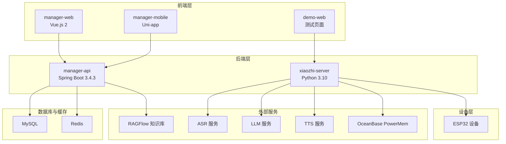
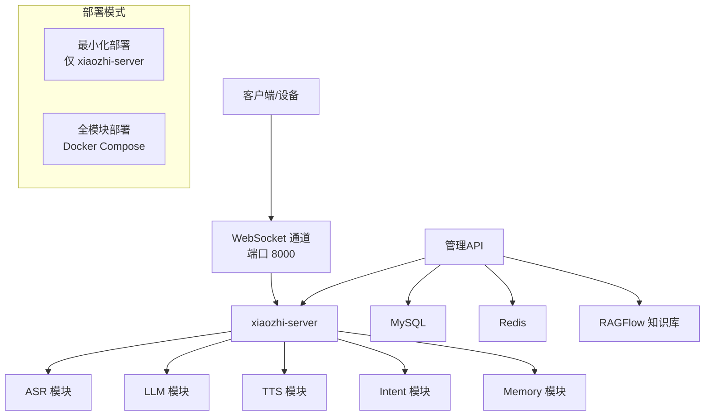
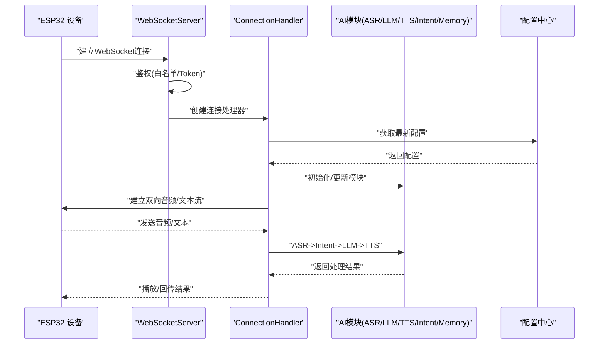
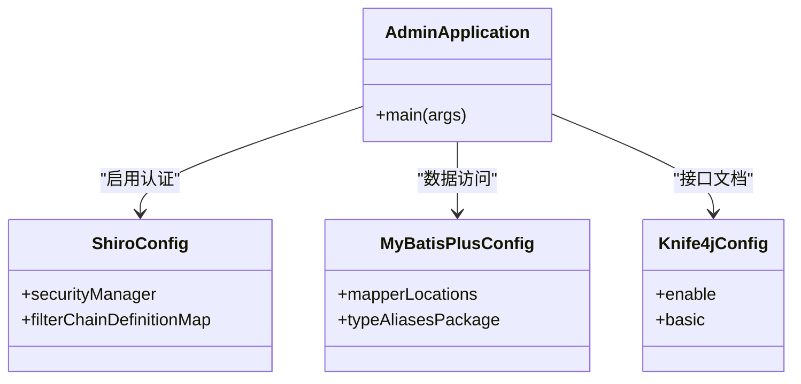
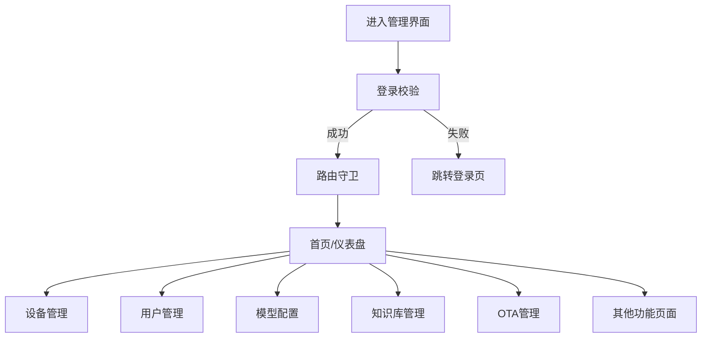
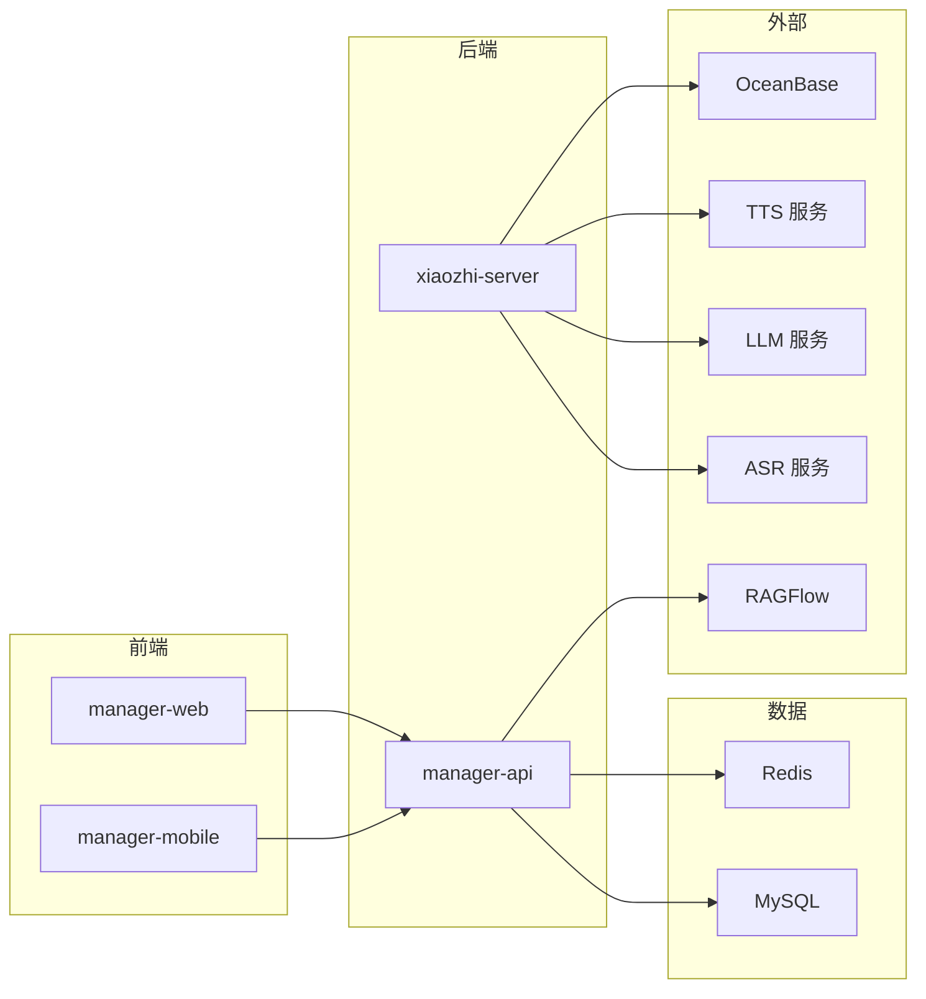

# 整体架构设计

<cite>
**本文引用的文件**
- [README.md](file://README.md)
- [xiaozhi-esp32-server-architecture.html](file://docs/architecture/xiaozhi-esp32-server-architecture.html)
- [app.py](file://main/xiaozhi-server/app.py)
- [http_server.py](file://main/xiaozhi-server/core/http_server.py)
- [websocket_server.py](file://main/xiaozhi-server/core/websocket_server.py)
- [settings.py](file://main/xiaozhi-server/config/settings.py)
- [docker-compose.yml](file://main/xiaozhi-server/docker-compose.yml)
- [AdminApplication.java](file://main/manager-api/src/main/java/xiaozhi/AdminApplication.java)
- [pom.xml](file://main/manager-api/pom.xml)
- [application.yml](file://main/manager-api/src/main/resources/application.yml)
- [index.html](file://main/demo-web/index.html)
- [package.json](file://main/manager-web/package.json)
- [src/main.js](file://main/manager-web/src/main.js)
- [index.js](file://main/manager-web/src/router/index.js)
- [package.json](file://main/manager-mobile/package.json)
- [src/main.ts](file://main/manager-mobile/src/main.ts)
</cite>

## 目录
1. [引言](#引言)
2. [项目结构](#项目结构)
3. [核心组件](#核心组件)
4. [架构总览](#架构总览)
5. [详细组件分析](#详细组件分析)
6. [依赖关系分析](#依赖关系分析)
7. [性能考量](#性能考量)
8. [故障排查指南](#故障排查指南)
9. [结论](#结论)
10. [附录](#附录)

## 引言
本项目围绕“小智ESP32服务器”构建，目标是为ESP32硬件终端提供一套完整的后端服务，涵盖语音交互、视觉分析、设备管理、用户认证与配置中心等能力。系统采用三层架构设计：Python后端AI引擎负责实时语音对话与AI流水线处理；Java管理API提供REST接口与权限控制；Vue前端管理界面（含Web与移动端）提供可视化运维与配置管理。

系统同时采用微服务化与模块化理念：通过Provider模式抽象ASR/LLM/TTS/VAD/Intent/Memory等模块，支持多供应商切换与热插拔；通过Docker容器化部署，实现最小化与全模块部署两种模式；通过远程配置中心实现配置的动态下发与热更新。

## 项目结构
项目采用多模块组织方式，主要包含：
- Python后端AI引擎：xiaozhi-server，提供WebSocket与HTTP服务，承载ASR/LLM/TTS/VAD/Intent/Memory等AI模块。
- Java管理API：manager-api，提供REST接口、用户认证、设备与配置管理。
- 前端管理界面：manager-web（Vue.js 2）、manager-mobile（Uni-app），分别提供Web端与移动端管理能力。
- 文档与架构图：docs/architecture/xiaozhi-esp32-server-architecture.html 展示系统整体架构与数据流。

图表来源
- [xiaozhi-esp32-server-architecture.html:140-426](file://docs/architecture/xiaozhi-esp32-server-architecture.html#L140-L426)

章节来源
- [README.md:235-254](file://README.md#L235-L254)
- [xiaozhi-esp32-server-architecture.html:139-427](file://docs/architecture/xiaozhi-esp32-server-architecture.html#L139-L427)

## 核心组件
- Python后端AI引擎（xiaozhi-server）
  - WebSocket服务器：提供实时语音对话通道，支持设备鉴权与动态配置更新。
  - HTTP服务器：提供OTA与视觉分析接口，便于单模块部署与测试。
  - Provider模块：统一管理ASR/LLM/TTS/VAD/Intent/Memory等AI组件，支持多供应商切换与热更新。
- Java管理API（manager-api）
  - Spring Boot应用，提供REST接口与权限控制，集成Shiro认证、MyBatis-Plus、Redis、MySQL、Liquibase等。
- 前端管理界面
  - manager-web（Vue.js 2）：提供Web端管理控制台，路由保护与国际化支持。
  - manager-mobile（Uni-app）：提供H5/小程序/APP跨平台管理能力。
  - demo-web：测试页面，用于验证WebSocket与音频交互。

章节来源
- [app.py:46-152](file://main/xiaozhi-server/app.py#L46-L152)
- [http_server.py:35-92](file://main/xiaozhi-server/core/http_server.py#L35-L92)
- [websocket_server.py:71-204](file://main/xiaozhi-server/core/websocket_server.py#L71-L204)
- [AdminApplication.java:1-13](file://main/manager-api/src/main/java/xiaozhi/AdminApplication.java#L1-L13)
- [pom.xml:1-291](file://main/manager-api/pom.xml#L1-L291)
- [application.yml:1-66](file://main/manager-api/src/main/resources/application.yml#L1-L66)
- [package.json:1-51](file://main/manager-web/package.json#L1-L51)
- [src/main.js:1-30](file://main/manager-web/src/main.js#L1-L30)
- [index.js:1-250](file://main/manager-web/src/router/index.js#L1-L250)
- [package.json:1-163](file://main/manager-mobile/package.json#L1-L163)
- [src/main.ts:1-27](file://main/manager-mobile/src/main.ts#L1-L27)

## 架构总览
系统采用分层架构与微服务化设计：
- 分层架构
  - 表现层：前端Web与移动端管理界面。
  - 控制层：Java管理API提供REST接口与认证授权。
  - 服务层：Python后端AI引擎提供实时语音对话与AI流水线。
  - 数据层：MySQL、Redis、OceanBase PowerMem。
- 微服务与模块化
  - Provider模式：ASR/LLM/TTS/VAD/Intent/Memory通过工厂模式实例化，支持多供应商切换。
  - 远程配置中心：支持从API读取配置，动态下发至xiaozhi-server，实现热更新。
  - Docker容器化：提供最小化与全模块部署两种模式，便于快速上线与扩展。

图表来源
- [xiaozhi-esp32-server-architecture.html:356-378](file://docs/architecture/xiaozhi-esp32-server-architecture.html#L356-L378)
- [docker-compose.yml:1-22](file://main/xiaozhi-server/docker-compose.yml#L1-L22)

章节来源
- [README.md:235-254](file://README.md#L235-L254)
- [xiaozhi-esp32-server-architecture.html:139-427](file://docs/architecture/xiaozhi-esp32-server-architecture.html#L139-L427)

## 详细组件分析

### Python后端AI引擎（xiaozhi-server）
- 启动流程与生命周期
  - 主入口负责加载配置、初始化GC管理器、启动WebSocket与HTTP服务，并监听退出信号。
  - 支持从API读取配置，动态更新AI模块与组件。
- WebSocket服务器
  - 提供设备鉴权（支持白名单与Token校验）、连接管理、配置热更新。
  - 通过ConnectionHandler处理设备连接，串联VAD/ASR/LLM/Intent/Memory等模块。
- HTTP服务器
  - 提供OTA接口与视觉分析接口，支持OPTIONS预检请求。
  - 在单模块部署场景下，提供OTA下载与WebSocket地址下发能力。
- 配置与部署
  - 支持本地文件、远程API与配置中心三种配置来源，优先级可配置。
  - Docker Compose映射端口与模型文件，便于快速部署。

图表来源
- [app.py:46-152](file://main/xiaozhi-server/app.py#L46-L152)
- [websocket_server.py:71-204](file://main/xiaozhi-server/core/websocket_server.py#L71-L204)
- [http_server.py:35-92](file://main/xiaozhi-server/core/http_server.py#L35-L92)

章节来源
- [app.py:46-152](file://main/xiaozhi-server/app.py#L46-L152)
- [websocket_server.py:42-204](file://main/xiaozhi-server/core/websocket_server.py#L42-L204)
- [http_server.py:10-92](file://main/xiaozhi-server/core/http_server.py#L10-L92)
- [settings.py:9-34](file://main/xiaozhi-server/config/settings.py#L9-L34)
- [docker-compose.yml:1-22](file://main/xiaozhi-server/docker-compose.yml#L1-L22)

### Java管理API（manager-api）
- 技术栈与特性
  - Spring Boot 3.4.3、Spring MVC、WebSocket、Shiro认证、MyBatis-Plus、MySQL、Redis、Liquibase。
  - Knife4j/OpenAPI文档、国际化、文件上传、XSS防护等。
- 配置与端口
  - 默认端口8002，上下文路径/xiaozhi，Tomcat线程池配置较高以支撑高并发。
- 安全与认证
  - 支持OAuth2与服务端密钥双重认证策略，结合白名单与Token校验保障设备接入安全。

图表来源
- [AdminApplication.java:1-13](file://main/manager-api/src/main/java/xiaozhi/AdminApplication.java#L1-L13)
- [pom.xml:1-291](file://main/manager-api/pom.xml#L1-L291)
- [application.yml:1-66](file://main/manager-api/src/main/resources/application.yml#L1-L66)

章节来源
- [AdminApplication.java:1-13](file://main/manager-api/src/main/java/xiaozhi/AdminApplication.java#L1-L13)
- [pom.xml:1-291](file://main/manager-api/pom.xml#L1-L291)
- [application.yml:1-66](file://main/manager-api/src/main/resources/application.yml#L1-L66)

### 前端管理界面
- manager-web（Vue.js 2）
  - Element UI、Vue Router、Vuex、i18n，提供路由守卫与登录态校验。
  - 路由覆盖设备管理、用户管理、模型配置、知识库管理、OTA管理等。
- manager-mobile（Uni-app）
  - 支持H5/小程序/iOS/Android多端，使用Vue 3生态与TanStack Vue Query。
  - 国际化与状态管理完善，提供跨平台一致的管理体验。
- demo-web
  - 提供WebSocket测试页面，验证音频交互与连接状态。

图表来源
- [index.js:234-247](file://main/manager-web/src/router/index.js#L234-L247)
- [src/main.js:1-30](file://main/manager-web/src/main.js#L1-L30)
- [package.json:1-51](file://main/manager-web/package.json#L1-L51)
- [package.json:1-163](file://main/manager-mobile/package.json#L1-L163)
- [src/main.ts:1-27](file://main/manager-mobile/src/main.ts#L1-L27)
- [index.html:1-399](file://main/demo-web/index.html#L1-L399)

章节来源
- [index.js:1-250](file://main/manager-web/src/router/index.js#L1-L250)
- [src/main.js:1-30](file://main/manager-web/src/main.js#L1-L30)
- [package.json:1-51](file://main/manager-web/package.json#L1-L51)
- [package.json:1-163](file://main/manager-mobile/package.json#L1-L163)
- [src/main.ts:1-27](file://main/manager-mobile/src/main.ts#L1-L27)
- [index.html:1-399](file://main/demo-web/index.html#L1-L399)

## 依赖关系分析
- 组件耦合与内聚
  - Python后端通过Provider模式解耦ASR/LLM/TTS/VAD/Intent/Memory，模块间通过统一接口交互，内聚性高、耦合度低。
  - Java管理API通过REST接口与前端交互，数据访问层与业务逻辑分离，便于扩展与维护。
- 外部依赖
  - 多供应商AI服务（ASR/LLM/TTS）与知识库（RAGFlow），通过Provider模式统一接入。
  - 数据存储：MySQL（业务数据）、Redis（缓存/会话）、OceanBase PowerMem（记忆与向量存储）。
- 部署与集成
  - Docker Compose提供一键部署，端口映射与卷挂载明确，便于最小化与全模块部署。

图表来源
- [pom.xml:1-291](file://main/manager-api/pom.xml#L1-L291)
- [docker-compose.yml:1-22](file://main/xiaozhi-server/docker-compose.yml#L1-L22)
- [xiaozhi-esp32-server-architecture.html:228-291](file://docs/architecture/xiaozhi-esp32-server-architecture.html#L228-L291)

章节来源
- [pom.xml:1-291](file://main/manager-api/pom.xml#L1-L291)
- [docker-compose.yml:1-22](file://main/xiaozhi-server/docker-compose.yml#L1-L22)
- [xiaozhi-esp32-server-architecture.html:228-291](file://docs/architecture/xiaozhi-esp32-server-architecture.html#L228-L291)

## 性能考量
- 实时性与并发
  - WebSocket长连接提供低延迟语音交互；Tomcat线程池配置较高，支持高并发请求。
  - Python后端采用异步事件循环与模块化初始化，减少阻塞。
- 配置与热更新
  - 支持从API读取配置并动态更新AI模块，避免重启带来的停机时间。
- 存储与缓存
  - Redis缓存热点数据与会话信息，MySQL承载业务数据，OceanBase PowerMem提供向量与知识图谱能力。
- 部署弹性
  - Docker容器化部署，便于横向扩展与资源隔离；最小化与全模块部署满足不同场景需求。

[本节为通用性能讨论，不直接分析具体文件]

## 故障排查指南
- WebSocket连接问题
  - 检查端口8000是否开放，确认设备ID与Authorization头是否正确传递。
  - 关注无效握手日志过滤，避免误判连接异常。
- HTTP接口问题
  - 确认端口8003与路由映射正确，检查OTA与视觉分析接口的OPTIONS预检。
- 配置与认证
  - 确认配置文件存在且格式正确，检查auth_key与白名单配置。
  - 管理API端口8002与上下文路径/xiaozhi是否可达，Shiro认证是否生效。
- 前端登录与路由
  - 检查localStorage中的token，确认路由守卫逻辑与页面跳转。

章节来源
- [websocket_server.py:8-30](file://main/xiaozhi-server/core/websocket_server.py#L8-L30)
- [websocket_server.py:146-153](file://main/xiaozhi-server/core/websocket_server.py#L146-L153)
- [http_server.py:35-92](file://main/xiaozhi-server/core/http_server.py#L35-L92)
- [settings.py:9-34](file://main/xiaozhi-server/config/settings.py#L9-L34)
- [application.yml:1-66](file://main/manager-api/src/main/resources/application.yml#L1-L66)
- [index.js:234-247](file://main/manager-web/src/router/index.js#L234-L247)

## 结论
小智ESP32服务器通过清晰的三层架构与微服务化设计，实现了从设备接入、AI处理到管理运维的完整闭环。Python后端AI引擎以Provider模式实现模块化与多供应商接入，Java管理API提供完善的认证与数据管理能力，前端管理界面覆盖Web与移动端场景。结合Docker容器化与远程配置中心，系统具备良好的可扩展性与可维护性，能够适应从个人家庭到企业级部署的多样化需求。

[本节为总结性内容，不直接分析具体文件]

## 附录
- 端口与服务
  - WebSocket：8000
  - HTTP（OTA/视觉分析）：8003
  - 管理API：8002（上下文/xiaozhi）
  - 管理Web：8001（前端控制台）
- 部署模式
  - 最小化部署：仅运行xiaozhi-server
  - 全模块部署：Docker Compose包含MySQL、Redis、OceanBase等

章节来源
- [docker-compose.yml:1-22](file://main/xiaozhi-server/docker-compose.yml#L1-L22)
- [application.yml:1-66](file://main/manager-api/src/main/resources/application.yml#L1-L66)
- [xiaozhi-esp32-server-architecture.html:356-378](file://docs/architecture/xiaozhi-esp32-server-architecture.html#L356-L378)