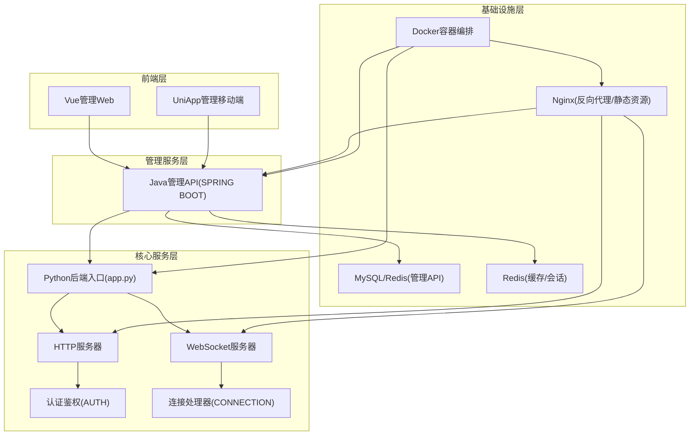
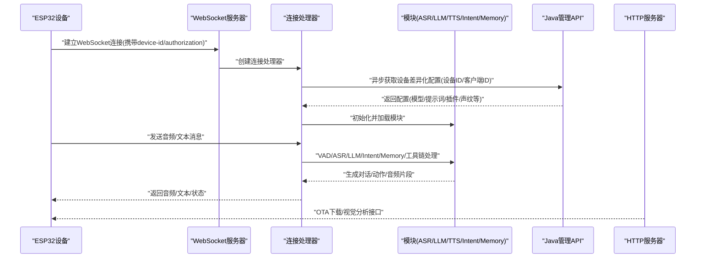
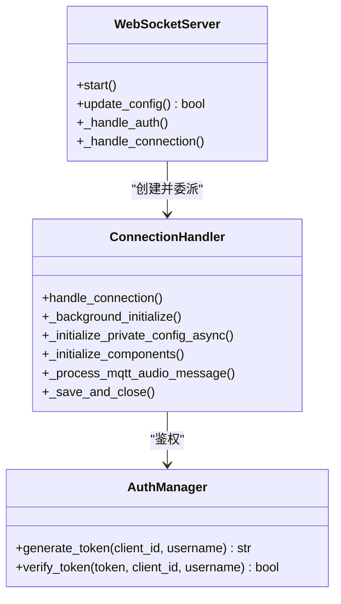
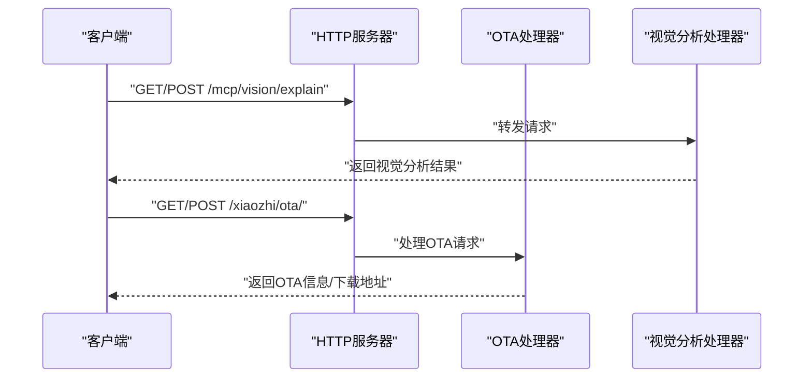
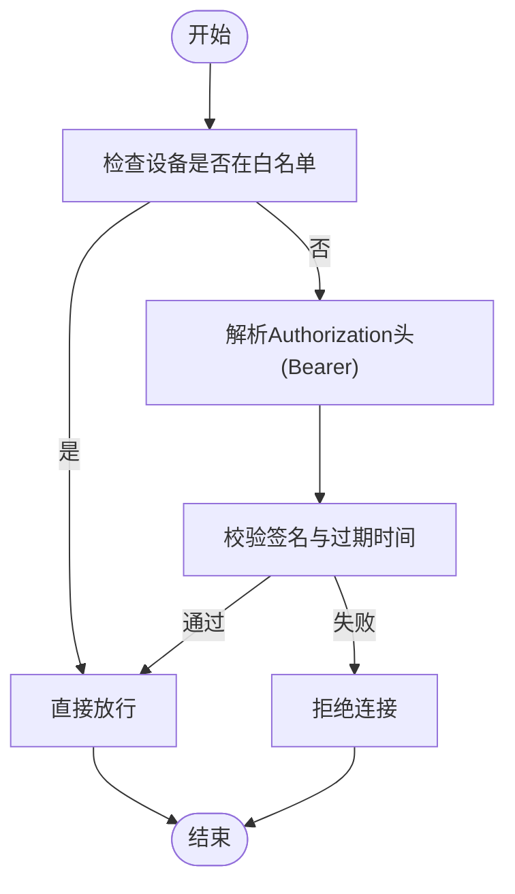
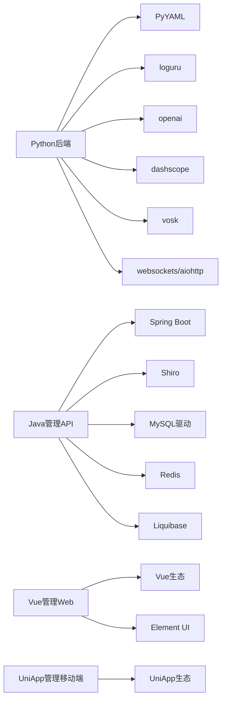

# 系统架构

<cite>
**本文档引用的文件**
- [README.md](file://README.md)
- [app.py](file://main/xiaozhi-server/app.py)
- [settings.py](file://main/xiaozhi-server/config/settings.py)
- [config_loader.py](file://main/xiaozhi-server/config/config_loader.py)
- [http_server.py](file://main/xiaozhi-server/core/http_server.py)
- [websocket_server.py](file://main/xiaozhi-server/core/websocket_server.py)
- [connection.py](file://main/xiaozhi-server/core/connection.py)
- [auth.py](file://main/xiaozhi-server/core/auth.py)
- [AdminApplication.java](file://main/manager-api/src/main/java/xiaozhi/AdminApplication.java)
- [requirements.txt](file://main/xiaozhi-server/requirements.txt)
- [pom.xml](file://main/manager-api/pom.xml)
- [package.json（管理Web）](file://main/manager-web/package.json)
- [package.json（管理移动端）](file://main/manager-mobile/package.json)
- [docker-compose.yml](file://main/xiaozhi-server/docker-compose.yml)
</cite>

## 目录
1. [引言](#引言)
2. [项目结构](#项目结构)
3. [核心组件](#核心组件)
4. [架构总览](#架构总览)
5. [详细组件分析](#详细组件分析)
6. [依赖分析](#依赖分析)
7. [性能考量](#性能考量)
8. [故障排查指南](#故障排查指南)
9. [结论](#结论)
10. [附录](#附录)

## 引言
本项目围绕“小智ESP32”智能硬件终端，提供统一的后端服务，涵盖WebSocket实时音频交互、HTTP服务（OTA与视觉分析）、以及Java管理API与Vue/UniApp管理界面。系统采用Python后端作为核心处理引擎，结合Java管理API提供设备与用户管理能力，前端由Vue与UniApp分别覆盖Web与移动端。

系统目标是在保证低延迟音频处理与多模态（语音/视觉）推理的前提下，提供可扩展、可观测、可维护的分层架构，支持从单机部署到容器化集群的多种拓扑形态。

章节来源
- [README.md:1-378](file://README.md#L1-L378)

## 项目结构
项目采用“多子工程 + 分层架构”的组织方式：
- Python后端（xiaozhi-server）：核心服务入口、WebSocket/HTTP服务器、消息路由、认证鉴权、模块化组件（ASR/LLM/TTS/VAD/Intent/Memory/Tools等）
- Java管理API（manager-api）：Spring Boot应用，提供设备/用户/模型/知识库等管理接口
- Vue管理Web（manager-web）：PC端管理界面
- UniApp管理移动端（manager-mobile）：移动端管理界面
- 文档与Docker配置：部署与集成文档、Nginx与启动脚本、Compose编排

图表来源
- [app.py:46-160](file://main/xiaozhi-server/app.py#L46-L160)
- [AdminApplication.java:1-13](file://main/manager-api/src/main/java/xiaozhi/AdminApplication.java#L1-L13)
- [docker-compose.yml:1-22](file://main/xiaozhi-server/docker-compose.yml#L1-L22)

章节来源
- [README.md:178-378](file://README.md#L178-L378)
- [docker-compose.yml:1-22](file://main/xiaozhi-server/docker-compose.yml#L1-L22)

## 核心组件
- Python后端入口与生命周期管理
  - 负责加载配置、启动WebSocket与HTTP服务、管理全局GC、监听退出信号
  - 生成/校验JWT认证密钥，输出服务地址与使用提示
- WebSocket服务器
  - 提供设备侧音频/文本消息的实时双向通道，支持设备白名单与JWT鉴权
  - 支持动态配置更新（VAD/ASR/LLM/Memory/Intent等模块的热切换）
- HTTP服务器
  - 提供OTA固件下载与视觉分析接口，支持跨域OPTIONS预检
- 连接处理器
  - 负责设备连接生命周期、绑定状态、VAD/ASR/LLM/TTS/Intent/Memory/工具链的初始化与调度
  - 支持MQTT网关透传音频帧、乱序音频包重排、声纹识别、记忆持久化
- 认证鉴权
  - HMAC-SHA256签名的三元组（client_id, device_id, timestamp）生成与校验，支持过期策略
- 管理API（Java）
  - Spring Boot应用，提供设备/用户/模型/知识库等REST接口，集成Shiro安全框架、Redis、MySQL、Liquibase等
- 管理前端
  - Vue管理Web与UniApp移动端，分别面向PC与移动端的管理操作

章节来源
- [app.py:46-160](file://main/xiaozhi-server/app.py#L46-L160)
- [websocket_server.py:42-228](file://main/xiaozhi-server/core/websocket_server.py#L42-L228)
- [http_server.py:10-93](file://main/xiaozhi-server/core/http_server.py#L10-L93)
- [connection.py:77-800](file://main/xiaozhi-server/core/connection.py#L77-L800)
- [auth.py:13-73](file://main/xiaozhi-server/core/auth.py#L13-L73)
- [AdminApplication.java:1-13](file://main/manager-api/src/main/java/xiaozhi/AdminApplication.java#L1-L13)

## 架构总览
系统采用“服务边界清晰、职责分层”的架构模式：
- 分层架构
  - 表现层：Vue/UniApp管理界面
  - 控制层：Java管理API（设备/用户/配置管理）
  - 业务层：Python后端（WebSocket/HTTP服务、消息路由、模块化推理）
  - 基础设施层：MySQL/Redis/Nginx/Docker
- 交互模式
  - 设备通过WebSocket与Python后端交互，实时传输音频与文本
  - 管理端通过Java管理API对设备与模型进行集中管理
  - HTTP服务提供OTA与视觉分析等补充能力
- 数据流
  - 设备侧：音频采集 → VAD静音检测 → ASR识别 → LLM对话/意图识别 → TTS合成 → 音频回放
  - 管理侧：设备绑定/配置下发 → Python后端动态加载模块 → 实时生效

图表来源
- [websocket_server.py:81-145](file://main/xiaozhi-server/core/websocket_server.py#L81-L145)
- [connection.py:668-800](file://main/xiaozhi-server/core/connection.py#L668-L800)
- [http_server.py:35-93](file://main/xiaozhi-server/core/http_server.py#L35-L93)

## 详细组件分析

### WebSocket服务器与连接处理器
- WebSocket服务器
  - 负责握手、认证、设备白名单放行、动态配置更新与组件重建
  - 提供HTTP探测响应，区分WS升级与普通HTTP请求
- 连接处理器
  - 生命周期管理：初始化、绑定状态、超时关闭、记忆保存
  - 模块化处理：VAD/ASR/LLM/Intent/Memory/工具链的初始化与调度
  - 音频处理：MQTT网关透传、乱序包重排、声纹识别、TTS通道打开
  - 上报线程：异步上报ASR/TTS统计信息（可选）

图表来源
- [websocket_server.py:42-228](file://main/xiaozhi-server/core/websocket_server.py#L42-L228)
- [connection.py:77-800](file://main/xiaozhi-server/core/connection.py#L77-L800)
- [auth.py:13-73](file://main/xiaozhi-server/core/auth.py#L13-L73)

章节来源
- [websocket_server.py:71-205](file://main/xiaozhi-server/core/websocket_server.py#L71-L205)
- [connection.py:193-328](file://main/xiaozhi-server/core/connection.py#L193-L328)

### HTTP服务器与OTA/视觉分析接口
- HTTP服务器
  - 提供OTA固件下载与视觉分析接口，支持OPTIONS预检
  - 在未从API读取配置时，额外提供OTA接口以返回WebSocket地址
- 视觉分析接口
  - 通过MCP视觉端点提供图像理解能力，支持JWT认证

图表来源
- [http_server.py:35-93](file://main/xiaozhi-server/core/http_server.py#L35-L93)

章节来源
- [http_server.py:10-93](file://main/xiaozhi-server/core/http_server.py#L10-L93)

### 认证与鉴权
- 认证策略
  - JWT三元组：client_id|device_id|timestamp，HMAC-SHA256签名，支持过期时间
  - 支持设备白名单直通（不在白名单内才校验token）
- 传输方式
  - WebSocket：Authorization头（Bearer）
  - MQTT：用户名为device_id，密码为token

图表来源
- [auth.py:52-73](file://main/xiaozhi-server/core/auth.py#L52-L73)
- [websocket_server.py:206-228](file://main/xiaozhi-server/core/websocket_server.py#L206-L228)

章节来源
- [auth.py:13-73](file://main/xiaozhi-server/core/auth.py#L13-L73)
- [websocket_server.py:63-69](file://main/xiaozhi-server/core/websocket_server.py#L63-L69)

### 管理API服务（Java）
- 技术栈
  - Spring Boot 3.4.3、Shiro安全框架、MySQL、Redis、Liquibase、Knife4j/SpringDoc
- 能力范围
  - 设备管理、用户管理、模型配置、知识库、插件与模板管理、短信等扩展能力
- 部署
  - 通过Spring Boot打包运行，可与Nginx配合对外提供REST服务

章节来源
- [pom.xml:1-291](file://main/manager-api/pom.xml#L1-L291)
- [AdminApplication.java:1-13](file://main/manager-api/src/main/java/xiaozhi/AdminApplication.java#L1-L13)

### 前端管理（Vue/UniApp）
- Vue管理Web
  - PC端管理界面，提供设备/用户/模型/知识库等管理能力
- UniApp管理移动端
  - 跨平台移动端管理界面，支持多端构建与发布

章节来源
- [package.json（管理Web）:1-51](file://main/manager-web/package.json#L1-L51)
- [package.json（管理移动端）:1-163](file://main/manager-mobile/package.json#L1-L163)

## 依赖分析
- Python后端依赖
  - 核心库：aiohttp/websockets、loguru、PyYAML、Jinja2、PyJWT、psutil、mcp、mcp-proxy等
  - 语音/视觉/推理：openai、google-generativeai、dashscope、vosk、sherpa_onnx、silero_vad、opuslib_next、pydub等
- Java管理API依赖
  - Spring Boot、Shiro、MySQL驱动、Druid、MyBatis-Plus、Liquibase、Knife4j、SpringDoc、Guava、Hutool、Okio等
- 前端依赖
  - Vue2/Vue3生态、Element UI、Vuex/Store、路由、i18n、Opus编解码器等

图表来源
- [requirements.txt:1-43](file://main/xiaozhi-server/requirements.txt#L1-L43)
- [pom.xml:38-248](file://main/manager-api/pom.xml#L38-L248)
- [package.json（管理Web）:10-26](file://main/manager-web/package.json#L10-L26)
- [package.json（管理移动端）:77-107](file://main/manager-mobile/package.json#L77-L107)

章节来源
- [requirements.txt:1-43](file://main/xiaozhi-server/requirements.txt#L1-L43)
- [pom.xml:17-36](file://main/manager-api/pom.xml#L17-L36)

## 性能考量
- 异步与并发
  - Python后端采用asyncio与aiohttp/websockets，支持高并发WebSocket连接与HTTP请求
  - 连接处理器使用线程池执行耗时初始化，避免阻塞事件循环
- 模块化与热切换
  - 支持动态更新VAD/ASR/LLM/Memory/Intent等模块，减少停机时间
- 音频处理优化
  - VAD静音检测、乱序包重排、声纹识别与TTS通道复用，降低端到端延迟
- 部署弹性
  - Docker Compose支持端口映射与模型文件挂载，便于横向扩展与资源隔离

章节来源
- [websocket_server.py:155-205](file://main/xiaozhi-server/core/websocket_server.py#L155-L205)
- [connection.py:668-750](file://main/xiaozhi-server/core/connection.py#L668-L750)

## 故障排查指南
- WebSocket连接失败
  - 检查设备ID与Authorization头是否正确，确认JWT签名与过期时间
  - 查看无效握手日志是否被过滤（服务器端已屏蔽常见无效握手噪声）
- 配置拉取异常
  - 确认管理API地址与密钥配置，检查网络连通性与证书
  - 若本地配置与API配置冲突，按提示迁移至data/.config.yaml
- 音频处理异常
  - 检查VAD/ASR模块初始化状态，确认采样率与音频格式一致
  - 对于MQTT网关透传音频，确认帧头解析与时间戳顺序
- HTTP服务异常
  - 确认端口占用与防火墙策略，检查OPTIONS预检与CORS配置

章节来源
- [auth.py:52-73](file://main/xiaozhi-server/core/auth.py#L52-L73)
- [websocket_server.py:8-31](file://main/xiaozhi-server/core/websocket_server.py#L8-L31)
- [config_loader.py:27-62](file://main/xiaozhi-server/config/config_loader.py#L27-L62)
- [connection.py:375-407](file://main/xiaozhi-server/core/connection.py#L375-L407)
- [http_server.py:35-93](file://main/xiaozhi-server/core/http_server.py#L35-L93)

## 结论
本系统通过Python后端与Java管理API的协同，构建了覆盖设备交互、管理与基础设施的完整闭环。WebSocket与HTTP双栈服务满足实时与离线两类场景，模块化设计与动态配置使系统具备良好的可演进性与可维护性。结合Docker与Nginx，可在单机与集群环境下灵活部署，满足从个人学习到企业级生产的多样化需求。

## 附录
- 部署拓扑
  - 单机部署：Docker Compose一键启动，端口映射8000/8003，挂载模型与配置
  - 集群部署：Nginx前置，Java管理API与Python后端分离，Redis/MySQL独立
- 安全加固建议
  - 强制HTTPS与证书校验，限制WebSocket与HTTP访问来源
  - 定期轮换JWT密钥，启用设备白名单与细粒度权限控制
- 监控与可观测性
  - Python后端使用loguru输出结构化日志，结合外部日志收集系统
  - Java管理API启用Spring Boot Actuator与健康检查端点
- 灾难恢复
  - MySQL/Redis备份与快照策略，配置文件与模型文件异地容灾
  - Docker镜像与Compose编排文件版本化管理，支持快速回滚

章节来源
- [docker-compose.yml:13-22](file://main/xiaozhi-server/docker-compose.yml#L13-L22)
- [README.md:178-223](file://README.md#L178-L223)