# 组件交互关系

<cite>
**本文档引用的文件**
- [app.py](file://main/xiaozhi-server/app.py)
- [websocket_server.py](file://main/xiaozhi-server/core/websocket_server.py)
- [http_server.py](file://main/xiaozhi-server/core/http_server.py)
- [connection.py](file://main/xiaozhi-server/core/connection.py)
- [auth.py](file://main/xiaozhi-server/core/auth.py)
- [config_loader.py](file://main/xiaozhi-server/config/config_loader.py)
- [modules_initialize.py](file://main/xiaozhi-server/core/utils/modules_initialize.py)
- [settings.py](file://main/xiaozhi-server/config/settings.py)
- [ota_handler.py](file://main/xiaozhi-server/core/api/ota_handler.py)
- [manage_api_client.py](file://main/xiaozhi-server/config/manage_api_client.py)
- [util.py](file://main/xiaozhi-server/core/utils/util.py)
- [config.yaml](file://main/xiaozhi-server/config.yaml)
- [config_from_api.yaml](file://main/xiaozhi-server/config_from_api.yaml)
</cite>

## 目录
1. [简介](#简介)
2. [项目结构](#项目结构)
3. [核心组件](#核心组件)
4. [架构总览](#架构总览)
5. [详细组件分析](#详细组件分析)
6. [依赖关系分析](#依赖关系分析)
7. [性能考量](#性能考量)
8. [故障排查指南](#故障排查指南)
9. [结论](#结论)
10. [附录](#附录)

## 简介
本文件面向小智ESP32服务器，系统性梳理WebSocket服务器、HTTP服务器、连接处理器、配置管理器等核心组件的交互模式与依赖关系，解释组件生命周期管理与资源协调机制，给出组件交互时序图与状态转换图，阐明异步处理与并发控制策略，并提供组件间通信协议与数据格式规范。

## 项目结构
小智ESP32服务器采用“入口应用 + 多组件协同”的架构：
- 入口应用负责启动与生命周期管理
- WebSocket服务器负责实时音频/文本交互
- HTTP服务器提供OTA与视觉分析等REST接口
- 连接处理器负责单连接的生命周期、消息路由与模块编排
- 配置管理器负责本地与远端配置加载、合并与缓存
- 认证管理器负责统一鉴权
- 模块初始化器负责按需加载ASR/VAD/LLM/Memory/Intent/TTS等子模块

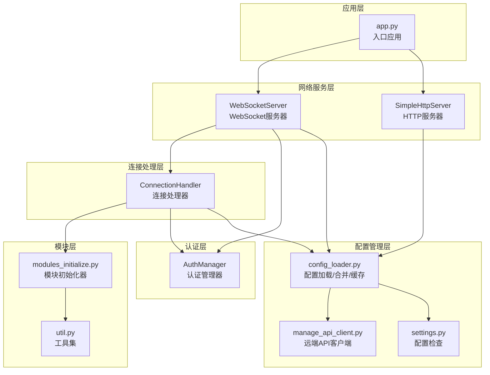

**图表来源**
- [app.py:46-130](file://main/xiaozhi-server/app.py#L46-L130)
- [websocket_server.py:42-80](file://main/xiaozhi-server/core/websocket_server.py#L42-L80)
- [http_server.py:10-35](file://main/xiaozhi-server/core/http_server.py#L10-L35)
- [connection.py:77-120](file://main/xiaozhi-server/core/connection.py#L77-L120)
- [config_loader.py:27-62](file://main/xiaozhi-server/config/config_loader.py#L27-L62)
- [modules_initialize.py:9-98](file://main/xiaozhi-server/core/utils/modules_initialize.py#L9-L98)

**章节来源**
- [app.py:46-130](file://main/xiaozhi-server/app.py#L46-L130)
- [config.yaml:9-27](file://main/xiaozhi-server/config.yaml#L9-L27)

## 核心组件
- 入口应用（app.py）
  - 负责加载配置、初始化全局GC、启动WebSocket与HTTP服务、监控标准输入、处理退出信号与资源回收。
- WebSocket服务器（websocket_server.py）
  - 负责WebSocket握手、认证、连接生命周期管理、配置更新与模块初始化。
- HTTP服务器（http_server.py）
  - 负责注册OTA与视觉分析接口，提供REST服务。
- 连接处理器（connection.py）
  - 负责单连接的消息路由、模块初始化、音频队列处理、上报线程、超时管理与资源清理。
- 配置管理器（config_loader.py）
  - 负责本地配置与远端配置的加载、合并、缓存与目录初始化。
- 认证管理器（auth.py）
  - 负责HMAC-SHA256签名与校验，生成与验证token。
- 模块初始化器（modules_initialize.py）
  - 负责按需初始化VAD/ASR/LLM/Memory/Intent/TTS等模块。
- 工具集（util.py）
  - 提供IP获取、音频处理、版本比较、MCP端点校验等通用能力。

**章节来源**
- [app.py:46-130](file://main/xiaozhi-server/app.py#L46-L130)
- [websocket_server.py:42-80](file://main/xiaozhi-server/core/websocket_server.py#L42-L80)
- [http_server.py:10-35](file://main/xiaozhi-server/core/http_server.py#L10-L35)
- [connection.py:77-120](file://main/xiaozhi-server/core/connection.py#L77-L120)
- [config_loader.py:27-62](file://main/xiaozhi-server/config/config_loader.py#L27-L62)
- [auth.py:13-73](file://main/xiaozhi-server/core/auth.py#L13-L73)
- [modules_initialize.py:9-98](file://main/xiaozhi-server/core/utils/modules_initialize.py#L9-L98)
- [util.py:20-609](file://main/xiaozhi-server/core/utils/util.py#L20-L609)

## 架构总览
系统采用“事件驱动 + 异步并发”的架构：
- 入口应用在事件循环中启动两个服务：WebSocket与HTTP
- WebSocket服务器在握手阶段完成认证与配置更新，随后将连接委派给连接处理器
- 连接处理器在后台线程池中初始化模块，主线程异步处理消息
- HTTP服务器提供OTA与视觉分析接口，内部使用认证管理器与配置管理器
- 配置管理器支持本地与远端配置，远端配置通过异步HTTP客户端拉取

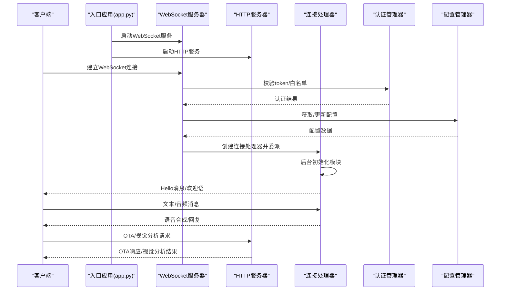

**图表来源**
- [app.py:78-83](file://main/xiaozhi-server/app.py#L78-L83)
- [websocket_server.py:108-127](file://main/xiaozhi-server/core/websocket_server.py#L108-L127)
- [http_server.py:35-86](file://main/xiaozhi-server/core/http_server.py#L35-L86)
- [connection.py:193-264](file://main/xiaozhi-server/core/connection.py#L193-L264)
- [auth.py:52-73](file://main/xiaozhi-server/core/auth.py#L52-L73)
- [config_loader.py:65-94](file://main/xiaozhi-server/config/config_loader.py#L65-L94)

## 详细组件分析

### WebSocket服务器（WebSocketServer）
- 职责
  - 接收WebSocket连接，执行认证，创建连接处理器并委派处理
  - 提供配置更新接口，支持异步从远端获取配置并按需重建模块
  - 过滤无效握手日志，降低噪音
- 关键交互
  - 与认证管理器协作进行token校验
  - 与配置管理器协作获取/更新配置
  - 与连接处理器协作完成连接生命周期管理
- 并发与异步
  - 使用异步事件循环处理连接
  - 配置更新使用互斥锁保证线程安全
- 错误处理
  - 认证失败直接关闭连接
  - 处理异常时记录日志并确保连接关闭

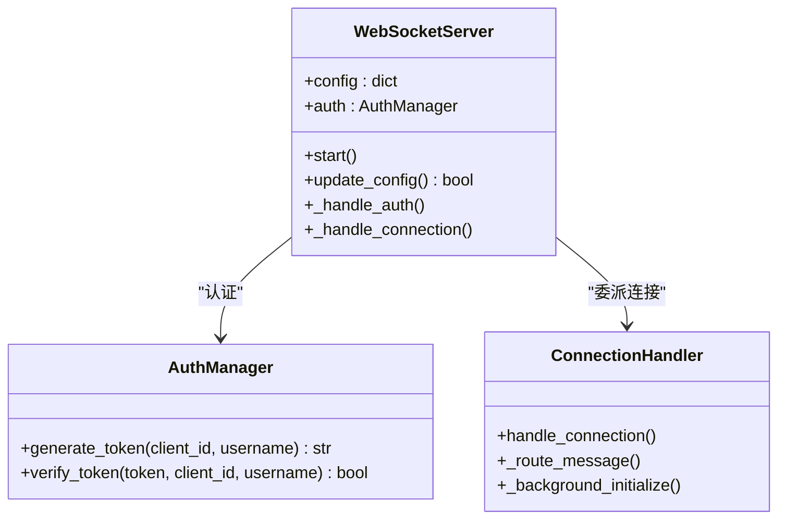

**图表来源**
- [websocket_server.py:42-80](file://main/xiaozhi-server/core/websocket_server.py#L42-L80)
- [auth.py:13-73](file://main/xiaozhi-server/core/auth.py#L13-L73)
- [connection.py:193-264](file://main/xiaozhi-server/core/connection.py#L193-L264)

**章节来源**
- [websocket_server.py:42-204](file://main/xiaozhi-server/core/websocket_server.py#L42-L204)

### HTTP服务器（SimpleHttpServer）
- 职责
  - 注册OTA与视觉分析接口
  - 提供CORS支持与OPTIONS预检
  - 在未启用远端配置时提供OTA下载能力
- 关键交互
  - 与OTA处理器协作处理OTA请求
  - 与视觉处理器协作处理视觉分析请求
  - 与配置管理器协作获取服务器配置
- 并发与异步
  - 使用aiohttp异步处理请求
  - 通过AppRunner与TCPSite启动服务

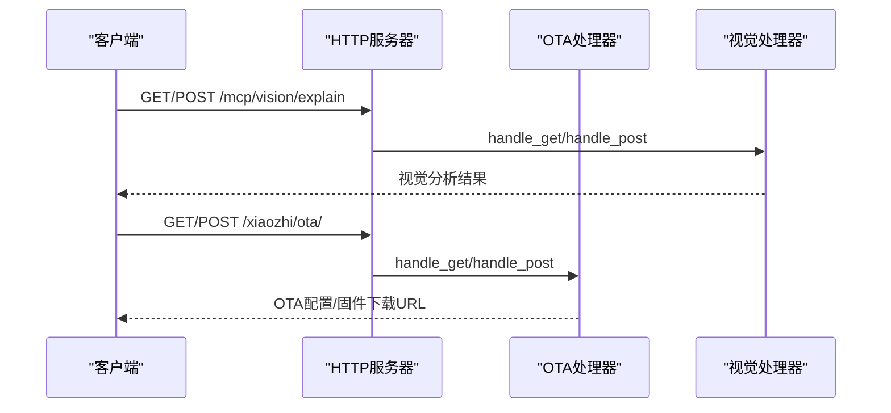

**图表来源**
- [http_server.py:35-86](file://main/xiaozhi-server/core/http_server.py#L35-L86)
- [ota_handler.py:143-370](file://main/xiaozhi-server/core/api/ota_handler.py#L143-L370)

**章节来源**
- [http_server.py:10-93](file://main/xiaozhi-server/core/http_server.py#L10-L93)

### 连接处理器（ConnectionHandler）
- 职责
  - 单连接生命周期管理：初始化、消息路由、超时、清理
  - 模块初始化：VAD/ASR/LLM/Memory/Intent/TTS按需初始化
  - 音频处理：音频队列、乱序包处理、MQTT网关音频包解析
  - 上报线程：异步上报聊天记录
  - 绑定与差异化配置：从远端获取设备差异化配置
- 并发与异步
  - 主循环异步处理消息
  - 后台线程池初始化模块
  - 线程安全的上报队列
- 状态管理
  - 绑定状态、超时任务、客户端活动时间戳、音频窗口等

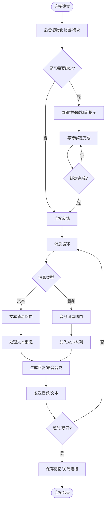

**图表来源**
- [connection.py:193-264](file://main/xiaozhi-server/core/connection.py#L193-L264)
- [connection.py:340-406](file://main/xiaozhi-server/core/connection.py#L340-L406)
- [connection.py:668-708](file://main/xiaozhi-server/core/connection.py#L668-L708)

**章节来源**
- [connection.py:77-800](file://main/xiaozhi-server/core/connection.py#L77-L800)

### 配置管理器（config_loader.py）
- 职责
  - 本地配置与远端配置的加载与合并
  - 缓存配置以提升启动性能
  - 目录初始化与权限检查
  - 异步获取服务器配置与设备差异化配置
- 关键流程
  - 优先读取data/.config.yaml，若存在manager-api配置则从远端拉取
  - 合并默认配置与自定义配置
  - 为每个事件循环维护独立的HTTP客户端，禁用keep-alive避免连接池问题

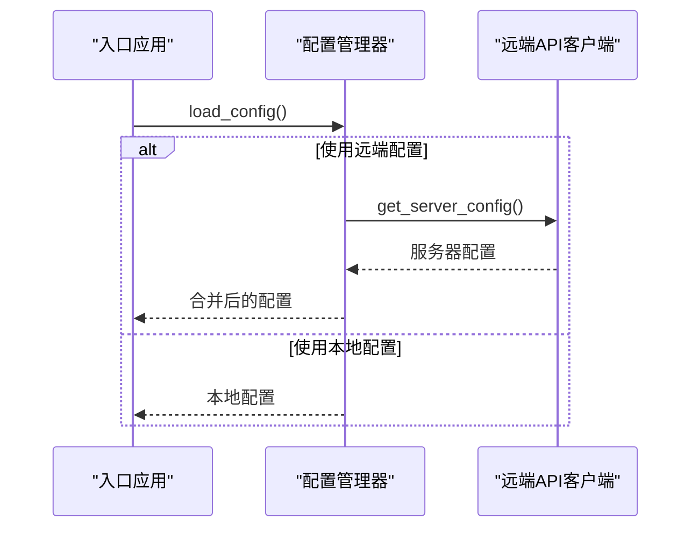

**图表来源**
- [config_loader.py:27-62](file://main/xiaozhi-server/config/config_loader.py#L27-L62)
- [config_loader.py:65-94](file://main/xiaozhi-server/config/config_loader.py#L65-L94)
- [manage_api_client.py:164-168](file://main/xiaozhi-server/config/manage_api_client.py#L164-L168)

**章节来源**
- [config_loader.py:27-193](file://main/xiaozhi-server/config/config_loader.py#L27-L193)
- [manage_api_client.py:20-161](file://main/xiaozhi-server/config/manage_api_client.py#L20-L161)

### 认证管理器（AuthManager）
- 职责
  - 生成与验证token，支持白名单直通
  - HMAC-SHA256签名，时间戳防重放
- 使用场景
  - WebSocket握手阶段
  - HTTP OTA接口（可选）

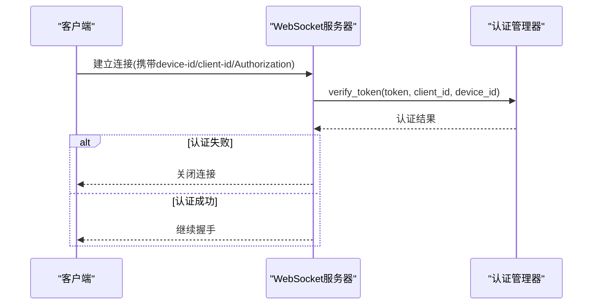

**图表来源**
- [websocket_server.py:206-227](file://main/xiaozhi-server/core/websocket_server.py#L206-L227)
- [auth.py:52-73](file://main/xiaozhi-server/core/auth.py#L52-L73)

**章节来源**
- [auth.py:13-73](file://main/xiaozhi-server/core/auth.py#L13-L73)

### 模块初始化器（modules_initialize.py）
- 职责
  - 按需初始化VAD/ASR/LLM/Memory/Intent/TTS模块
  - 支持不同provider与type的动态创建
- 与连接处理器协作
  - 连接处理器在后台线程池中调用初始化器创建模块实例

**章节来源**
- [modules_initialize.py:9-152](file://main/xiaozhi-server/core/utils/modules_initialize.py#L9-L152)

## 依赖关系分析
- 组件耦合
  - WebSocket服务器与连接处理器强耦合（委派关系）
  - 连接处理器与模块初始化器弱耦合（按需调用）
  - 配置管理器与远端API客户端弱耦合（通过接口调用）
- 外部依赖
  - websockets（WebSocket服务）
  - aiohttp（HTTP服务）
  - httpx（异步HTTP客户端）
  - yaml（配置解析）
- 循环依赖
  - 未发现直接循环依赖
  - 通过接口与工厂模式降低耦合

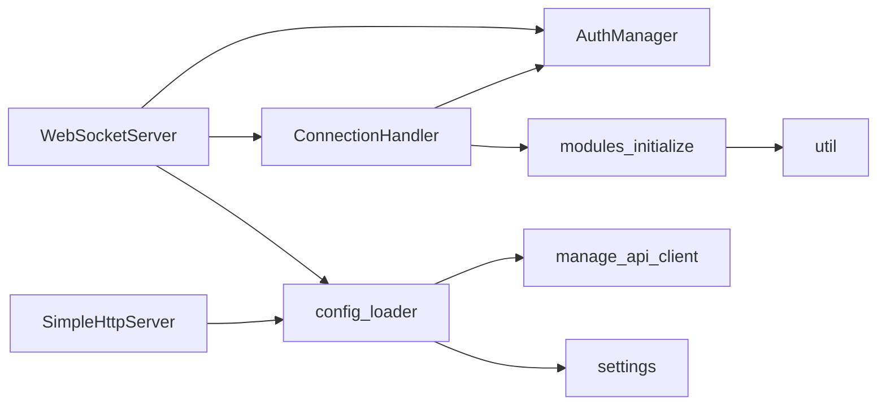

**图表来源**
- [websocket_server.py:33-37](file://main/xiaozhi-server/core/websocket_server.py#L33-L37)
- [http_server.py:4-5](file://main/xiaozhi-server/core/http_server.py#L4-L5)
- [connection.py:22-26](file://main/xiaozhi-server/core/connection.py#L22-L26)
- [config_loader.py:5-13](file://main/xiaozhi-server/config/config_loader.py#L5-L13)
- [modules_initialize.py:3](file://main/xiaozhi-server/core/utils/modules_initialize.py#L3)

**章节来源**
- [websocket_server.py:33-37](file://main/xiaozhi-server/core/websocket_server.py#L33-L37)
- [http_server.py:4-5](file://main/xiaozhi-server/core/http_server.py#L4-L5)
- [connection.py:22-26](file://main/xiaozhi-server/core/connection.py#L22-L26)
- [config_loader.py:5-13](file://main/xiaozhi-server/config/config_loader.py#L5-L13)
- [modules_initialize.py:3](file://main/xiaozhi-server/core/utils/modules_initialize.py#L3)

## 性能考量
- 异步与并发
  - 事件驱动模型，避免阻塞IO
  - 线程池用于模块初始化与上报，避免阻塞事件循环
- 资源管理
  - 全局GC管理器定期清理内存
  - 连接关闭时确保资源释放（音频通道、上报线程等）
- 配置缓存
  - 配置管理器缓存配置，减少远端请求
- I/O优化
  - 使用异步HTTP客户端，禁用keep-alive避免连接池问题
  - 音频处理采用流式编码/解码

## 故障排查指南
- 启动失败
  - 检查配置文件是否存在与格式正确
  - 确认manager-api配置与secret
- WebSocket连接失败
  - 校验token与白名单
  - 检查MCP接入点格式
- HTTP接口异常
  - 检查CORS头与OPTIONS预检
  - 确认vision_explain与websocket地址
- 音频处理异常
  - 检查ffmpeg安装与依赖
  - 确认音频采样率与格式

**章节来源**
- [settings.py:9-34](file://main/xiaozhi-server/config/settings.py#L9-L34)
- [util.py:157-218](file://main/xiaozhi-server/core/utils/util.py#L157-L218)
- [config.yaml:119-121](file://main/xiaozhi-server/config.yaml#L119-L121)

## 结论
小智ESP32服务器通过清晰的组件边界与异步并发模型，实现了稳定的实时语音交互与REST服务。WebSocket服务器与HTTP服务器分别承担实时与批处理职责，连接处理器负责单连接的生命周期与模块编排，配置管理器与认证管理器提供基础设施支撑。整体架构具备良好的扩展性与可维护性。

## 附录

### 组件交互时序图（OTA流程）
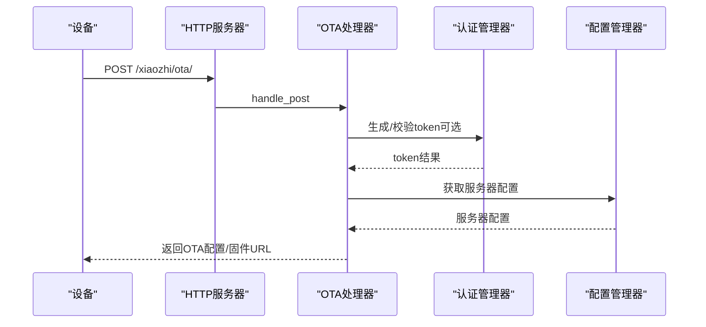

**图表来源**
- [http_server.py:66-76](file://main/xiaozhi-server/core/http_server.py#L66-L76)
- [ota_handler.py:143-370](file://main/xiaozhi-server/core/api/ota_handler.py#L143-L370)
- [auth.py:36-73](file://main/xiaozhi-server/core/auth.py#L36-L73)
- [config_loader.py:65-94](file://main/xiaozhi-server/config/config_loader.py#L65-L94)

### 组件交互时序图（视觉分析流程）
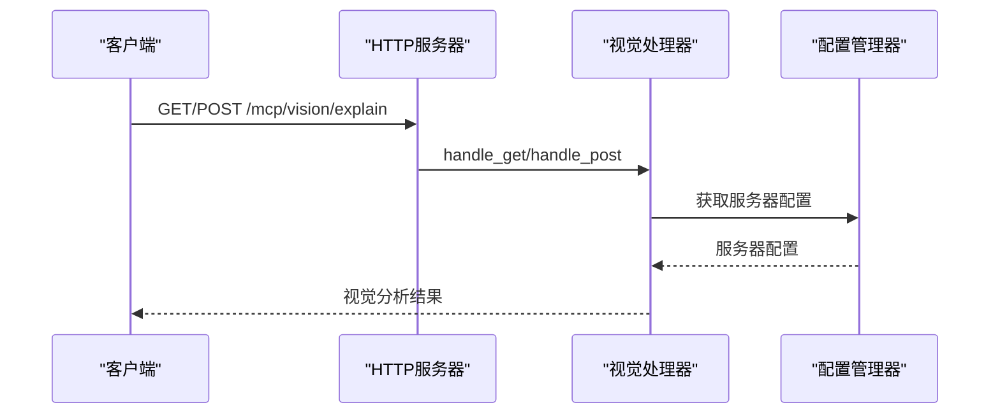

**图表来源**
- [http_server.py:66-76](file://main/xiaozhi-server/core/http_server.py#L66-L76)
- [config_loader.py:65-94](file://main/xiaozhi-server/config/config_loader.py#L65-L94)

### 组件交互时序图（配置更新流程）
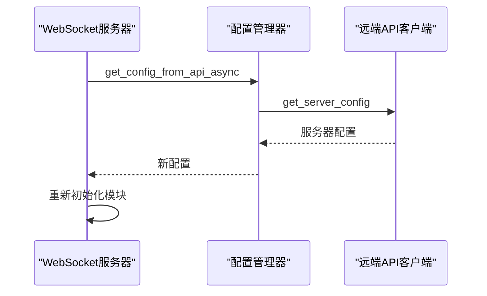

**图表来源**
- [websocket_server.py:155-204](file://main/xiaozhi-server/core/websocket_server.py#L155-L204)
- [config_loader.py:65-94](file://main/xiaozhi-server/config/config_loader.py#L65-L94)
- [manage_api_client.py:164-168](file://main/xiaozhi-server/config/manage_api_client.py#L164-L168)

### 组件解耦设计与接口抽象
- 工厂与接口
  - 模块初始化器通过工厂模式创建不同provider实例
  - 认证管理器提供统一的token生成/校验接口
- 配置抽象
  - 配置管理器屏蔽本地与远端差异
  - 工具集提供通用能力（IP、音频、版本比较等）
- 异步抽象
  - 远端API客户端为每个事件循环维护独立客户端
  - 连接处理器使用线程池与事件循环解耦

**章节来源**
- [modules_initialize.py:9-98](file://main/xiaozhi-server/core/utils/modules_initialize.py#L9-L98)
- [auth.py:13-73](file://main/xiaozhi-server/core/auth.py#L13-L73)
- [config_loader.py:52-81](file://main/xiaozhi-server/config/config_loader.py#L52-L81)
- [util.py:20-609](file://main/xiaozhi-server/core/utils/util.py#L20-L609)

### 异步处理模式与并发控制策略
- 事件循环
  - WebSocket与HTTP均在事件循环中运行
- 线程池
  - 连接处理器使用线程池执行模块初始化与上报
- 互斥锁
  - 配置更新使用互斥锁保证线程安全
- 超时与清理
  - 连接超时任务与资源清理确保稳定性

**章节来源**
- [connection.py:118-121](file://main/xiaozhi-server/core/connection.py#L118-L121)
- [websocket_server.py:161-204](file://main/xiaozhi-server/core/websocket_server.py#L161-L204)

### 组件间通信协议与数据格式规范
- WebSocket协议
  - 路径：/xiaozhi/v1/
  - 认证：Authorization Bearer token
  - 设备标识：device-id
  - 客户端标识：client-id
- HTTP协议（OTA）
  - GET/POST /xiaozhi/ota/
  - 设备标识：device-id
  - 客户端标识：client-id
  - 固件下载：/xiaozhi/ota/download/{filename}
- HTTP协议（视觉分析）
  - GET/POST /mcp/vision/explain
- 配置文件
  - 本地：config.yaml
  - 远端：data/.config.yaml（复制config_from_api.yaml）
  - 服务器配置字段参考config.yaml与config_from_api.yaml

**章节来源**
- [websocket_server.py:81-107](file://main/xiaozhi-server/core/websocket_server.py#L81-L107)
- [http_server.py:42-76](file://main/xiaozhi-server/core/http_server.py#L42-L76)
- [config.yaml:9-27](file://main/xiaozhi-server/config.yaml#L9-L27)
- [config_from_api.yaml:8-27](file://main/xiaozhi-server/config_from_api.yaml#L8-L27)