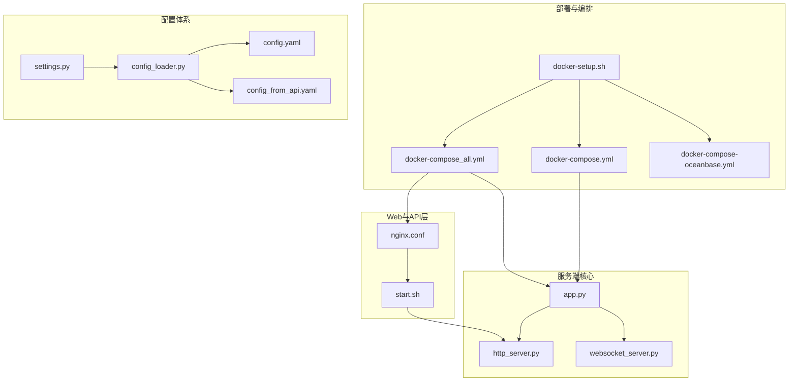
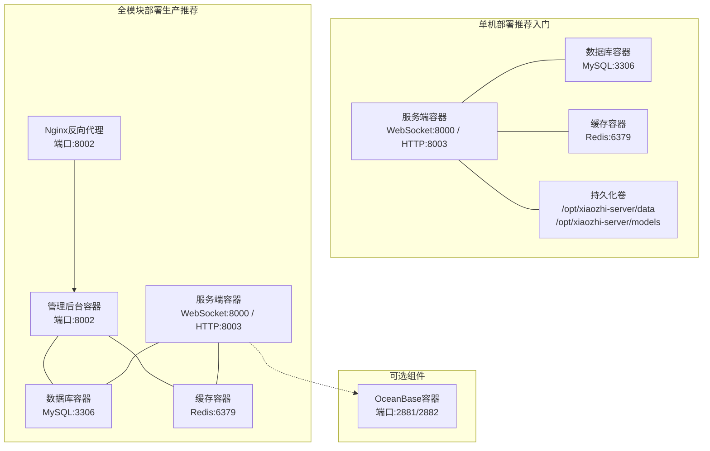
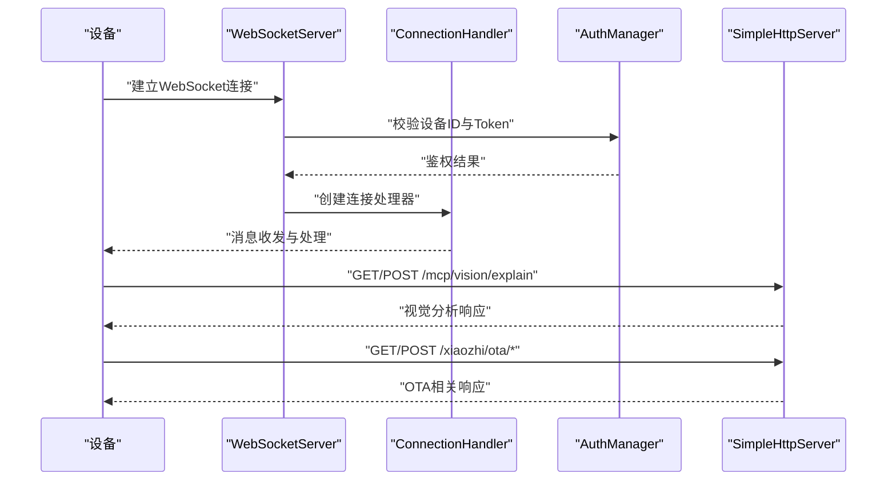
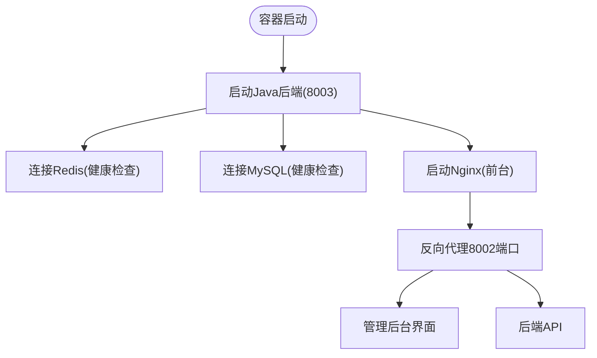
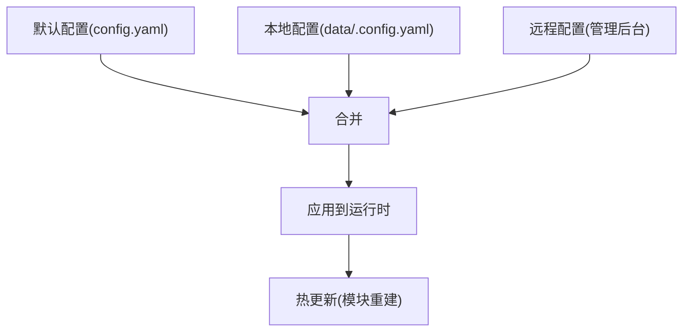
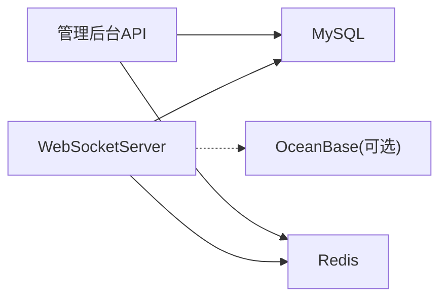

# 部署拓扑

<cite>
**本文引用的文件**   
- [docker-setup.sh](file://docker-setup.sh)
- [docker-compose.yml](file://main/xiaozhi-server/docker-compose.yml)
- [docker-compose_all.yml](file://main/xiaozhi-server/docker-compose_all.yml)
- [docker-compose-oceanbase.yml](file://main/xiaozhi-server/docker-compose-oceanbase.yml)
- [nginx.conf](file://docs/docker/nginx.conf)
- [start.sh](file://docs/docker/start.sh)
- [app.py](file://main/xiaozhi-server/app.py)
- [config_from_api.yaml](file://main/xiaozhi-server/config_from_api.yaml)
- [config_loader.py](file://main/xiaozhi-server/config/config_loader.py)
- [settings.py](file://main/xiaozhi-server/config/settings.py)
- [config.yaml](file://main/xiaozhi-server/config.yaml)
- [http_server.py](file://main/xiaozhi-server/core/http_server.py)
- [websocket_server.py](file://main/xiaozhi-server/core/websocket_server.py)
- [Memory_System_Architecture_Blueprint.md](file://main/xiaozhi-server/docs/architecture/Memory_System_Architecture_Blueprint.md)
</cite>

## 目录
1. [简介](#简介)
2. [项目结构](#项目结构)
3. [核心组件](#核心组件)
4. [架构总览](#架构总览)
5. [详细组件分析](#详细组件分析)
6. [依赖关系分析](#依赖关系分析)
7. [性能考量](#性能考量)
8. [故障排查指南](#故障排查指南)
9. [结论](#结论)
10. [附录](#附录)

## 简介
本文件面向小智ESP32服务器的Docker容器化部署，提供从单机到分布式场景的拓扑设计、容器职责与网络拓扑、服务发现与负载均衡策略、容器间通信与数据持久化、配置管理与热更新、监控与日志策略，以及最佳实践与故障恢复方案。文档同时给出架构图与网络拓扑图，帮助运维与开发人员快速理解并落地部署。

## 项目结构
围绕Docker部署，项目的关键目录与文件如下：
- 部署脚本与编排
  - docker-setup.sh：一键安装与升级脚本，负责镜像源配置、容器拉起、服务健康检查与密钥配置。
  - docker-compose.yml：单容器部署（仅服务端）。
  - docker-compose_all.yml：全模块部署（服务端+管理后台+数据库+Redis）。
  - docker-compose-oceanbase.yml：可选OceanBase部署（用于PowerMem记忆存储）。
- Web与API层
  - nginx.conf：反向代理配置，转发管理后台与后端API。
  - start.sh：Java后端启动脚本（监听8003端口），并前台运行Nginx。
- 服务端核心
  - app.py：服务端入口，启动WebSocket与HTTP服务，打印对外地址。
  - http_server.py：HTTP服务（OTA与视觉分析接口）。
  - websocket_server.py：WebSocket服务（设备连接、鉴权、消息分发）。
- 配置体系
  - config.yaml：默认配置模板。
  - config_from_api.yaml：从管理后台拉取配置的指引与示例。
  - config_loader.py：配置加载与远程配置合并逻辑。
  - settings.py：配置文件存在性与来源检查。

**图表来源**
- [docker-setup.sh:1-414](file://docker-setup.sh#L1-L414)
- [docker-compose_all.yml:1-93](file://main/xiaozhi-server/docker-compose_all.yml#L1-L93)
- [docker-compose.yml:1-22](file://main/xiaozhi-server/docker-compose.yml#L1-L22)
- [docker-compose-oceanbase.yml:1-36](file://main/xiaozhi-server/docker-compose-oceanbase.yml#L1-L36)
- [nginx.conf:1-53](file://docs/docker/nginx.conf#L1-L53)
- [start.sh:1-13](file://docs/docker/start.sh#L1-L13)
- [app.py:1-160](file://main/xiaozhi-server/app.py#L1-L160)
- [http_server.py:1-93](file://main/xiaozhi-server/core/http_server.py#L1-L93)
- [websocket_server.py:1-228](file://main/xiaozhi-server/core/websocket_server.py#L1-L228)
- [config.yaml:1-1198](file://main/xiaozhi-server/config.yaml#L1-L1198)
- [config_from_api.yaml:1-27](file://main/xiaozhi-server/config_from_api.yaml#L1-L27)
- [config_loader.py:1-193](file://main/xiaozhi-server/config/config_loader.py#L1-L193)
- [settings.py:1-34](file://main/xiaozhi-server/config/settings.py#L1-L34)

**章节来源**
- [docker-setup.sh:1-414](file://docker-setup.sh#L1-L414)
- [docker-compose.yml:1-22](file://main/xiaozhi-server/docker-compose.yml#L1-L22)
- [docker-compose_all.yml:1-93](file://main/xiaozhi-server/docker-compose_all.yml#L1-L93)
- [docker-compose-oceanbase.yml:1-36](file://main/xiaozhi-server/docker-compose-oceanbase.yml#L1-L36)
- [nginx.conf:1-53](file://docs/docker/nginx.conf#L1-L53)
- [start.sh:1-13](file://docs/docker/start.sh#L1-L13)
- [app.py:1-160](file://main/xiaozhi-server/app.py#L1-L160)
- [http_server.py:1-93](file://main/xiaozhi-server/core/http_server.py#L1-L93)
- [websocket_server.py:1-228](file://main/xiaozhi-server/core/websocket_server.py#L1-L228)
- [config.yaml:1-1198](file://main/xiaozhi-server/config.yaml#L1-L1198)
- [config_from_api.yaml:1-27](file://main/xiaozhi-server/config_from_api.yaml#L1-L27)
- [config_loader.py:1-193](file://main/xiaozhi-server/config/config_loader.py#L1-L193)
- [settings.py:1-34](file://main/xiaozhi-server/config/settings.py#L1-L34)

## 核心组件
- 服务端容器（xiaozhi-esp32-server）
  - 职责：提供WebSocket服务（设备连接与消息处理）、HTTP服务（OTA与视觉分析接口）、配置加载与热更新、鉴权与模块初始化。
  - 端口映射：8000（WebSocket）、8003（HTTP）。
  - 挂载：配置目录、模型文件。
- 管理后台容器（xiaozhi-esp32-server-web）
  - 职责：提供管理后台界面与后端API，依赖MySQL与Redis。
  - 端口映射：8002（管理后台）。
  - 环境变量：数据库与Redis连接参数。
- 数据库容器（xiaozhi-esp32-server-db）
  - 职责：提供MySQL数据库，持久化管理后台与设备配置。
- 缓存容器（xiaozhi-esp32-server-redis）
  - 职责：提供Redis缓存与会话存储。
- OceanBase容器（可选）
  - 职责：为PowerMem记忆系统提供向量与图存储能力。
- Nginx（可选，配合管理后台）
  - 职责：反向代理管理后台静态资源与后端API。

**章节来源**
- [docker-compose_all.yml:1-93](file://main/xiaozhi-server/docker-compose_all.yml#L1-L93)
- [docker-compose.yml:1-22](file://main/xiaozhi-server/docker-compose.yml#L1-L22)
- [docker-compose-oceanbase.yml:1-36](file://main/xiaozhi-server/docker-compose-oceanbase.yml#L1-L36)
- [nginx.conf:1-53](file://docs/docker/nginx.conf#L1-L53)
- [start.sh:1-13](file://docs/docker/start.sh#L1-L13)
- [app.py:1-160](file://main/xiaozhi-server/app.py#L1-L160)

## 架构总览
下图展示了单机与分布式两种部署形态的拓扑关系与容器间通信路径。

**图表来源**
- [docker-compose_all.yml:1-93](file://main/xiaozhi-server/docker-compose_all.yml#L1-L93)
- [docker-compose.yml:1-22](file://main/xiaozhi-server/docker-compose.yml#L1-L22)
- [docker-compose-oceanbase.yml:1-36](file://main/xiaozhi-server/docker-compose-oceanbase.yml#L1-L36)
- [nginx.conf:1-53](file://docs/docker/nginx.conf#L1-L53)

## 详细组件分析

### 服务端容器（xiaozhi-esp32-server）
- 服务职责
  - WebSocket服务：接收设备连接，鉴权与消息处理。
  - HTTP服务：提供OTA与视觉分析接口。
  - 配置加载：支持本地配置与远程配置（管理后台）合并。
  - 热更新：支持动态拉取远程配置并重建模块。
- 端口与挂载
  - 端口：8000（WS）、8003（HTTP）。
  - 挂载：配置目录、模型文件。
- 关键流程（启动与服务）
  - 启动顺序：ffmpeg检查、配置加载、插件初始化、GC管理器启动、WS与HTTP服务启动。
  - 服务暴露：WS地址与HTTP地址在启动日志中输出，便于设备侧接入。

**图表来源**
- [websocket_server.py:1-228](file://main/xiaozhi-server/core/websocket_server.py#L1-L228)
- [http_server.py:1-93](file://main/xiaozhi-server/core/http_server.py#L1-L93)
- [app.py:1-160](file://main/xiaozhi-server/app.py#L1-L160)

**章节来源**
- [app.py:1-160](file://main/xiaozhi-server/app.py#L1-L160)
- [http_server.py:1-93](file://main/xiaozhi-server/core/http_server.py#L1-L93)
- [websocket_server.py:1-228](file://main/xiaozhi-server/core/websocket_server.py#L1-L228)

### 管理后台容器（xiaozhi-esp32-server-web）
- 服务职责
  - 提供管理后台界面与后端API。
  - 依赖MySQL与Redis，健康检查确保依赖可用。
- 端口与环境
  - 端口：8002。
  - 环境变量：数据库URL、用户名、密码；Redis主机、端口、密码。
- Nginx集成
  - 反向代理管理后台静态资源与后端API，统一入口。

**图表来源**
- [docker-compose_all.yml:31-56](file://main/xiaozhi-server/docker-compose_all.yml#L31-L56)
- [start.sh:1-13](file://docs/docker/start.sh#L1-L13)
- [nginx.conf:1-53](file://docs/docker/nginx.conf#L1-L53)

**章节来源**
- [docker-compose_all.yml:31-56](file://main/xiaozhi-server/docker-compose_all.yml#L31-L56)
- [start.sh:1-13](file://docs/docker/start.sh#L1-L13)
- [nginx.conf:1-53](file://docs/docker/nginx.conf#L1-L53)

### 数据持久化与配置管理
- 持久化卷
  - 服务端：配置目录与模型文件挂载至宿主机，保证重启不丢失。
  - 数据库：MySQL数据目录挂载至宿主机。
- 配置层次
  - 默认配置（config.yaml）。
  - 本地覆盖（data/.config.yaml）。
  - 远程配置（管理后台）。
- 配置合并与热更新
  - 合并策略：后者覆盖前者。
  - 热更新：WebSocket服务支持动态拉取远程配置并重建模块。

**图表来源**
- [config.yaml:1-1198](file://main/xiaozhi-server/config.yaml#L1-L1198)
- [config_from_api.yaml:1-27](file://main/xiaozhi-server/config_from_api.yaml#L1-L27)
- [config_loader.py:1-193](file://main/xiaozhi-server/config/config_loader.py#L1-L193)
- [settings.py:1-34](file://main/xiaozhi-server/config/settings.py#L1-L34)
- [websocket_server.py:155-205](file://main/xiaozhi-server/core/websocket_server.py#L155-L205)

**章节来源**
- [config.yaml:1-1198](file://main/xiaozhi-server/config.yaml#L1-L1198)
- [config_from_api.yaml:1-27](file://main/xiaozhi-server/config_from_api.yaml#L1-L27)
- [config_loader.py:1-193](file://main/xiaozhi-server/config/config_loader.py#L1-L193)
- [settings.py:1-34](file://main/xiaozhi-server/config/settings.py#L1-L34)
- [websocket_server.py:155-205](file://main/xiaozhi-server/core/websocket_server.py#L155-L205)

### 服务发现与负载均衡
- 单机部署
  - 容器间通过Docker默认网络互通，服务端通过服务名访问数据库与Redis。
- 分布式部署
  - 建议使用反向代理（如Nginx）或服务网格（如Traefik）进行入口流量分发。
  - 数据库与缓存建议使用高可用方案（主从、哨兵、集群）。
  - OceanBase可作为独立集群部署，服务端通过服务名访问。

**章节来源**
- [docker-compose_all.yml:1-93](file://main/xiaozhi-server/docker-compose_all.yml#L1-L93)
- [docker-compose-oceanbase.yml:1-36](file://main/xiaozhi-server/docker-compose-oceanbase.yml#L1-L36)

### 监控与日志
- 日志
  - 应用日志：服务端通过日志库输出，建议结合容器日志收集（如Fluent Bit/Fluentd）。
  - 管理后台：Java应用日志与Nginx访问日志分离。
- 监控
  - 健康检查：数据库与Redis提供健康检查探针。
  - 建议：Prometheus + Grafana采集容器指标，结合日志分析平台（如ELK）。

**章节来源**
- [docker-compose_all.yml:60-88](file://main/xiaozhi-server/docker-compose_all.yml#L60-L88)
- [Memory_System_Architecture_Blueprint.md:703-774](file://main/xiaozhi-server/docs/architecture/Memory_System_Architecture_Blueprint.md#L703-L774)

## 依赖关系分析
- 组件耦合
  - 服务端对数据库与Redis存在直接依赖，通过compose健康检查保障可用性。
  - 管理后台依赖数据库与Redis，服务端通过服务名访问。
- 外部依赖
  - OceanBase（可选）用于记忆系统。
  - LLM/TTS/ASR等外部服务（由配置决定）。

**图表来源**
- [docker-compose_all.yml:1-93](file://main/xiaozhi-server/docker-compose_all.yml#L1-L93)
- [websocket_server.py:1-228](file://main/xiaozhi-server/core/websocket_server.py#L1-L228)

**章节来源**
- [docker-compose_all.yml:1-93](file://main/xiaozhi-server/docker-compose_all.yml#L1-L93)
- [websocket_server.py:1-228](file://main/xiaozhi-server/core/websocket_server.py#L1-L228)

## 性能考量
- 并发模型
  - 服务端采用异步IO（asyncio）与线程池执行器，适合高并发设备连接与消息处理。
- 资源限制
  - 建议为容器设置CPU与内存限制，避免资源争抢。
- 存储与I/O
  - 模型与配置挂载至高性能磁盘，数据库与日志分离。
- 网络
  - WebSocket与HTTP端口分离，避免相互影响；必要时引入反向代理优化长连接。

[本节为通用指导，无需引用具体文件]

## 故障排查指南
- 容器启动失败
  - 检查Docker镜像源与网络；确认端口未被占用。
  - 使用健康检查确认数据库与Redis可达。
- WebSocket无法连接
  - 确认设备携带正确的设备ID与Token；检查服务端鉴权配置。
  - 使用浏览器打开测试页面验证连接。
- HTTP接口不可用
  - 确认HTTP端口映射与防火墙放行；检查服务端日志。
- 配置未生效
  - 确认data/.config.yaml存在且格式正确；检查远程配置同步状态。
- 记忆系统异常
  - OceanBase部署与连接参数需正确；关注日志中的删除监控与错误级别日志。

**章节来源**
- [docker-setup.sh:350-381](file://docker-setup.sh#L350-L381)
- [websocket_server.py:206-228](file://main/xiaozhi-server/core/websocket_server.py#L206-L228)
- [settings.py:9-34](file://main/xiaozhi-server/config/settings.py#L9-L34)
- [Memory_System_Architecture_Blueprint.md:703-774](file://main/xiaozhi-server/docs/architecture/Memory_System_Architecture_Blueprint.md#L703-L774)

## 结论
通过Docker容器化部署，小智ESP32服务器实现了服务端、管理后台、数据库与缓存的解耦与快速编排。单机部署适合入门与演示，全模块部署适合生产环境。结合健康检查、持久化卷与配置热更新，系统具备良好的可维护性与扩展性。建议在分布式场景引入反向代理与高可用数据库/缓存，并完善监控与日志体系。

[本节为总结，无需引用具体文件]

## 附录

### 单机部署与分布式部署对比
- 单机部署
  - 适用：开发测试、小规模设备接入。
  - 特点：容器在同一主机，网络简单，无需外部LB。
- 分布式部署
  - 适用：生产环境、高并发与高可用需求。
  - 特点：多主机、多副本、反向代理与高可用数据库/缓存。

**章节来源**
- [docker-compose.yml:1-22](file://main/xiaozhi-server/docker-compose.yml#L1-L22)
- [docker-compose_all.yml:1-93](file://main/xiaozhi-server/docker-compose_all.yml#L1-L93)

### 环境配置管理与热更新机制
- 配置层次：默认配置 → 本地配置 → 远程配置（后者覆盖前者）。
- 热更新：WebSocket服务支持动态拉取远程配置并重建模块，无需重启容器。

**章节来源**
- [config.yaml:1-1198](file://main/xiaozhi-server/config.yaml#L1-L1198)
- [config_from_api.yaml:1-27](file://main/xiaozhi-server/config_from_api.yaml#L1-L27)
- [config_loader.py:1-193](file://main/xiaozhi-server/config/config_loader.py#L1-L193)
- [websocket_server.py:155-205](file://main/xiaozhi-server/core/websocket_server.py#L155-L205)

### 监控与日志收集策略
- 日志：应用日志与Nginx访问日志分离，建议集中收集与轮转。
- 监控：容器指标、数据库/缓存健康状态、业务关键指标（如连接数、处理耗时）。

**章节来源**
- [docker-compose_all.yml:60-88](file://main/xiaozhi-server/docker-compose_all.yml#L60-L88)
- [nginx.conf:1-53](file://docs/docker/nginx.conf#L1-L53)
- [Memory_System_Architecture_Blueprint.md:703-774](file://main/xiaozhi-server/docs/architecture/Memory_System_Architecture_Blueprint.md#L703-L774)