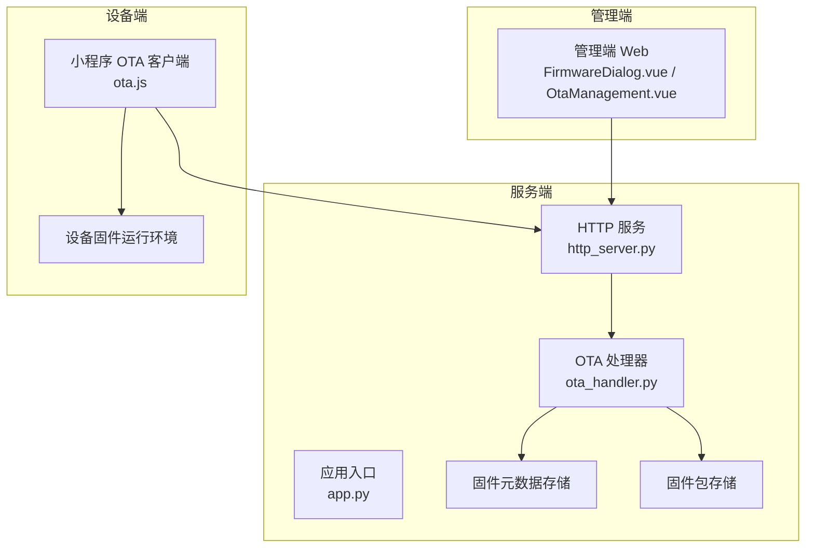
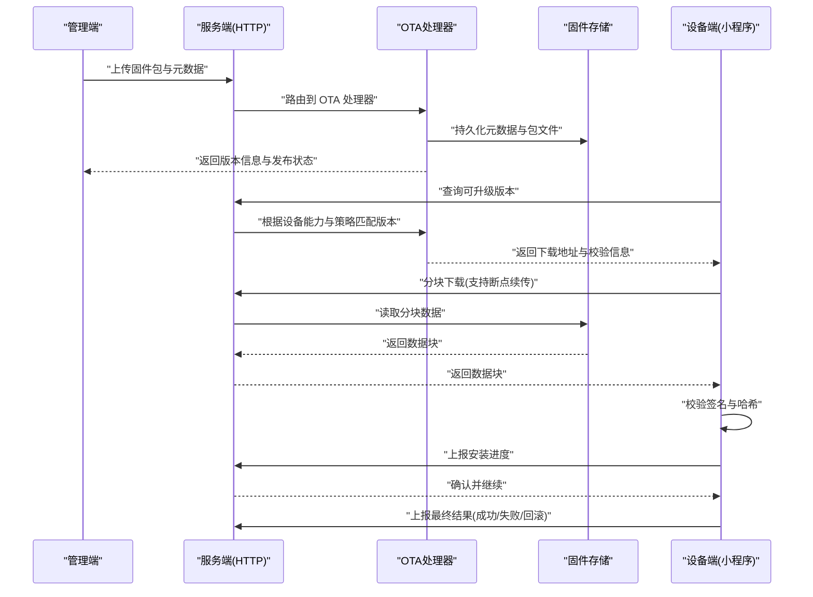
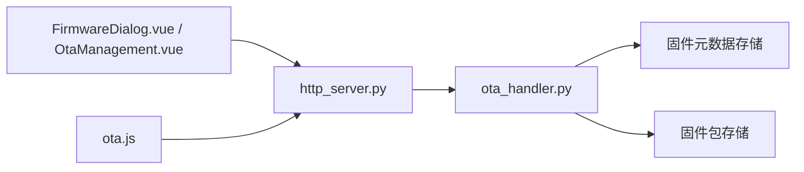

# OTA 升级系统

<cite>
**本文引用的文件**   
- [ota-upgrade-guide.md](file://docs/ota-upgrade-guide.md)
- [ota_handler.py](file://main/xiaozhi-server/core/api/ota_handler.py)
- [http_server.py](file://main/xiaozhi-server/core/http_server.py)
- [app.py](file://main/xiaozhi-server/app.py)
- [FirmwareDialog.vue](file://main/manager-web/src/components/FirmwareDialog.vue)
- [OtaManagement.vue](file://main/manager-web/src/views/OtaManagement.vue)
- [ota.js](file://main/egg-miniprogram/miniprogram/utils/ota.js)
</cite>

## 目录
1. [简介](#简介)
2. [项目结构](#项目结构)
3. [核心组件](#核心组件)
4. [架构总览](#架构总览)
5. [详细组件分析](#详细组件分析)
6. [依赖关系分析](#依赖关系分析)
7. [性能考虑](#性能考虑)
8. [故障排查指南](#故障排查指南)
9. [结论](#结论)
10. [附录](#附录)

## 简介
本技术文档围绕 OTA（Over-The-Air）升级系统，系统性阐述固件版本管理、兼容性检查、增量更新策略、升级包分发链路、进度跟踪与断点续传、失败重试、回滚机制、安全校验与签名验证、API 接口定义以及批量升级、灰度发布、监控告警等高级能力。文档面向开发者与运维人员，既提供高层架构概览，也给出代码级实现要点与排障建议。

## 项目结构
OTA 相关能力横跨服务端、管理端与小程序端：
- 服务端（xiaozhi-server）：提供 HTTP API 与 OTA 处理逻辑，负责固件元数据管理、下载分发、状态上报与事件通知。
- 管理端（manager-web）：提供固件上传、版本发布、灰度策略配置、批量下发与升级监控界面。
- 小程序端（egg-miniprogram）：提供设备侧的 OTA 客户端能力，包括查询、下载、安装、进度上报与异常恢复。

图表来源
- [app.py](file://main/xiaozhi-server/app.py)
- [http_server.py](file://main/xiaozhi-server/core/http_server.py)
- [ota_handler.py](file://main/xiaozhi-server/core/api/ota_handler.py)
- [FirmwareDialog.vue](file://main/manager-web/src/components/FirmwareDialog.vue)
- [OtaManagement.vue](file://main/manager-web/src/views/OtaManagement.vue)
- [ota.js](file://main/egg-miniprogram/miniprogram/utils/ota.js)

章节来源
- [ota-upgrade-guide.md](file://docs/ota-upgrade-guide.md)

## 核心组件
- 固件版本管理
  - 版本号规范：采用语义化版本（主版本.次版本.修订号），并支持预发布标识与构建号。
  - 兼容性矩阵：设备型号、硬件平台、基础固件基线与目标版本的兼容关系。
  - 增量更新：基于差分算法生成补丁包，降低带宽与存储压力。
- 升级包分发
  - 管理端上传：校验包完整性、签名、元数据一致性后入库。
  - 服务端分发：按设备能力与策略选择合适版本，支持 CDN/边缘节点加速。
  - 设备端下载：支持分块下载、断点续传、并发控制与校验。
- 进度跟踪与状态机
  - 状态：待升级、下载中、校验中、安装中、成功、失败、回滚中、已回滚。
  - 上报频率：按阶段自适应上报，关键节点强制上报。
- 失败重试与断点续传
  - 指数退避重试、最大重试次数限制、网络抖动容错。
  - 分块校验与断点记录，支持中断后继续。
- 回滚机制
  - 双分区或备份槽位设计，升级前创建快照，失败自动回滚。
  - 人工干预触发回滚与回滚确认流程。
- 安全与签名
  - 固件包签名验证、哈希校验、证书链校验、防篡改保护。
  - 传输层加密（HTTPS/TLS）、鉴权与访问控制。
- 高级功能
  - 批量升级：按设备组/标签批量下发，限流与分批推进。
  - 灰度发布：按区域/机型/用户维度逐步放量，观察指标后全量。
  - 监控告警：成功率、失败率、耗时、回滚率、带宽占用等指标采集与告警。

章节来源
- [ota-upgrade-guide.md](file://docs/ota-upgrade-guide.md)

## 架构总览
整体流程从管理端上传固件开始，经服务端校验与存储，设备端按需拉取并完成安装与上报。

图表来源
- [http_server.py](file://main/xiaozhi-server/core/http_server.py)
- [ota_handler.py](file://main/xiaozhi-server/core/api/ota_handler.py)
- [ota.js](file://main/egg-miniprogram/miniprogram/utils/ota.js)

## 详细组件分析

### 固件版本管理与兼容性检查
- 版本规范
  - 主版本用于不兼容变更；次版本用于向后兼容的功能增强；修订号用于缺陷修复。
  - 预发布与构建号用于区分测试与生产版本。
- 兼容性矩阵
  - 设备型号、硬件平台、基础固件基线、目标版本四元组约束。
  - 服务端在匹配时进行规则校验，拒绝不兼容版本。
- 增量更新策略
  - 基于二进制差分生成补丁，设备端合并旧镜像与补丁得到新镜像。
  - 补丁大小阈值与回滚条件需明确定义。

章节来源
- [ota-upgrade-guide.md](file://docs/ota-upgrade-guide.md)

### 升级包分发流程
- 管理端上传
  - 校验包完整性（哈希）、签名有效性、元数据一致性。
  - 写入对象存储与数据库元数据，生成唯一版本 ID。
- 服务端分发
  - 按设备能力、网络状况、灰度策略选择最优版本与源地址。
  - 支持 CDN/边缘缓存，提升下载效率。
- 设备端下载
  - 支持 Range 请求与分块校验，断点续传。
  - 并发下载与限速，避免拥塞。

章节来源
- [FirmwareDialog.vue](file://main/manager-web/src/components/FirmwareDialog.vue)
- [OtaManagement.vue](file://main/manager-web/src/views/OtaManagement.vue)
- [http_server.py](file://main/xiaozhi-server/core/http_server.py)
- [ota_handler.py](file://main/xiaozhi-server/core/api/ota_handler.py)
- [ota.js](file://main/egg-miniprogram/miniprogram/utils/ota.js)

### 进度跟踪、断点续传与失败重试
- 进度跟踪
  - 阶段化状态机：待升级、下载中、校验中、安装中、成功、失败、回滚中、已回滚。
  - 上报频率：下载阶段按固定间隔，安装阶段按关键事件上报。
- 断点续传
  - 记录已下载分块索引与校验和，中断后从断点继续。
  - 分块大小与并发数可调，平衡速度与稳定性。
- 失败重试
  - 指数退避策略，最大重试次数限制。
  - 网络错误与服务器错误分类处理，区分可重试与不可重试。

章节来源
- [ota.js](file://main/egg-miniprogram/miniprogram/utils/ota.js)
- [ota_handler.py](file://main/xiaozhi-server/core/api/ota_handler.py)

### 回滚机制实现
- 双分区/备份槽位
  - 升级前创建当前分区快照，安装到新分区，启动前校验通过则切换。
  - 启动失败自动回滚至原分区。
- 人工回滚
  - 管理端触发回滚指令，设备执行并上报结果。
- 回滚条件
  - 校验失败、安装超时、启动自检失败、健康检查未通过。

章节来源
- [ota-upgrade-guide.md](file://docs/ota-upgrade-guide.md)

### 升级安全检查与签名验证
- 传输安全
  - HTTPS/TLS 加密，证书校验，防中间人攻击。
- 包体安全
  - 数字签名验证、哈希校验、证书链校验。
  - 白名单机制，仅允许受信任的签名者发布版本。
- 访问控制
  - 管理端操作鉴权，设备端身份认证与权限校验。

章节来源
- [ota-upgrade-guide.md](file://docs/ota-upgrade-guide.md)
- [http_server.py](file://main/xiaozhi-server/core/http_server.py)
- [ota_handler.py](file://main/xiaozhi-server/core/api/ota_handler.py)

### API 接口文档
以下为 OTA 相关核心 API 的定义与用法说明（以路径与方法为主，具体参数与响应格式请参考对应实现）。

- 固件版本管理
  - POST /api/ota/firmware/upload
    - 用途：上传固件包与元数据
    - 请求头：Content-Type: multipart/form-data, Authorization: Bearer <token>
    - 请求体：file(二进制), version(字符串), model(字符串), platform(字符串), compatibility(对象), signature(字符串), hash(字符串)
    - 响应：{version_id, status, message}
  - GET /api/ota/firmware/list
    - 用途：查询固件版本列表
    - 查询参数：model, platform, page, size
    - 响应：{items:[...], total}
  - GET /api/ota/firmware/:version_id
    - 用途：获取指定版本详情
    - 响应：{version_id, model, platform, version, compatibility, signature, hash, created_at, status}
  - PUT /api/ota/firmware/:version_id/publish
    - 用途：发布/下架版本
    - 请求体：{action: "publish"|"unpublish"}
    - 响应：{status, message}

- 设备升级流程
  - GET /api/ota/device/check
    - 用途：设备查询可升级版本
    - 查询参数：device_id, current_version, model, platform
    - 响应：{available: bool, version_id, download_url, checksum, signature, strategy}
  - GET /api/ota/device/download
    - 用途：分块下载固件
    - 查询参数：version_id, range(start, end)
    - 响应：二进制数据块
  - POST /api/ota/device/report
    - 用途：上报升级进度与结果
    - 请求体：{device_id, version_id, stage, progress, result, error_code, timestamp}
    - 响应：{ack: true/false, next_action}

- 批量与灰度
  - POST /api/ota/batch/schedule
    - 用途：创建批量升级任务
    - 请求体：{device_ids:[], version_id, strategy:{type:"all"|"gray", gray_ratio, segments}}
    - 响应：{task_id, status}
  - GET /api/ota/task/:task_id/status
    - 用途：查询任务状态
    - 响应：{task_id, progress, success_count, fail_count, rollback_count, details:[...]}

- 监控与日志
  - GET /api/ota/monitor/metrics
    - 用途：获取升级指标
    - 响应：{success_rate, fail_rate, avg_duration, rollback_rate, bandwidth_usage}
  - GET /api/ota/logs
    - 用途：查询升级日志
    - 查询参数：device_id, version_id, level, start_time, end_time
    - 响应：{logs:[...]}

章节来源
- [http_server.py](file://main/xiaozhi-server/core/http_server.py)
- [ota_handler.py](file://main/xiaozhi-server/core/api/ota_handler.py)
- [FirmwareDialog.vue](file://main/manager-web/src/components/FirmwareDialog.vue)
- [OtaManagement.vue](file://main/manager-web/src/views/OtaManagement.vue)
- [ota.js](file://main/egg-miniprogram/miniprogram/utils/ota.js)

### 批量升级与灰度发布
- 批量升级
  - 设备分组：按模型、平台、区域、标签等维度组织。
  - 限流与分批：控制并发与批次大小，避免资源耗尽。
  - 任务编排：调度器按策略推进，失败设备进入重试队列。
- 灰度发布
  - 灰度比例与分段：按比例逐步放量，观察指标后扩大范围。
  - 快速回滚：发现异常立即停止灰度并回滚受影响设备。

章节来源
- [OtaManagement.vue](file://main/manager-web/src/views/OtaManagement.vue)
- [ota_handler.py](file://main/xiaozhi-server/core/api/ota_handler.py)

### 升级监控与告警
- 指标采集
  - 成功率、失败率、平均耗时、回滚率、带宽占用、设备在线率。
- 告警规则
  - 失败率阈值、回滚率阈值、耗时异常、带宽峰值。
- 可视化
  - 仪表盘展示趋势与分布，支持下钻到设备级别。

章节来源
- [OtaManagement.vue](file://main/manager-web/src/views/OtaManagement.vue)
- [http_server.py](file://main/xiaozhi-server/core/http_server.py)

## 依赖关系分析
- 模块耦合
  - http_server 作为网关，将请求路由到 ota_handler。
  - ota_handler 依赖存储与校验模块，协调设备端与服务端状态。
  - 管理端与小程序端通过 REST API 交互，遵循统一鉴权与错误码规范。
- 外部依赖
  - 对象存储（固件包）、数据库（元数据）、CDN（加速下载）、消息队列（异步任务）。
- 潜在循环依赖
  - 确保 ota_handler 不反向依赖 http_server，保持单向调用。

图表来源
- [http_server.py](file://main/xiaozhi-server/core/http_server.py)
- [ota_handler.py](file://main/xiaozhi-server/core/api/ota_handler.py)
- [FirmwareDialog.vue](file://main/manager-web/src/components/FirmwareDialog.vue)
- [OtaManagement.vue](file://main/manager-web/src/views/OtaManagement.vue)
- [ota.js](file://main/egg-miniprogram/miniprogram/utils/ota.js)

章节来源
- [app.py](file://main/xiaozhi-server/app.py)
- [http_server.py](file://main/xiaozhi-server/core/http_server.py)
- [ota_handler.py](file://main/xiaozhi-server/core/api/ota_handler.py)

## 性能考虑
- 下载优化
  - 分块大小与并发数调优，结合设备内存与网络状况动态调整。
  - 启用 CDN/边缘缓存，减少中心节点压力。
- 校验优化
  - 增量校验优先，全量校验仅在必要时触发。
  - 并行计算哈希与签名，缩短等待时间。
- 存储与 I/O
  - 使用流式读写，避免大对象一次性加载。
  - 合理设置缓存与过期策略，提升重复下载效率。
- 资源控制
  - 限流与熔断，防止突发流量导致服务降级。
  - 连接池与线程池配置，避免资源泄漏。

[本节为通用性能指导，无需特定文件引用]

## 故障排查指南
- 常见问题
  - 下载失败：检查网络连通性、Range 支持、分块大小与并发配置。
  - 校验失败：核对签名与哈希，确保证书链有效。
  - 安装失败：查看设备分区状态与健康检查日志。
  - 回滚触发：定位回滚条件，分析启动自检失败原因。
- 日志定位
  - 设备端日志：下载进度、校验结果、安装步骤、异常堆栈。
  - 服务端日志：请求轨迹、错误码、重试次数、资源占用。
- 调试工具
  - 模拟弱网与丢包，验证断点续传与重试策略。
  - 注入错误码，覆盖各类失败场景。

章节来源
- [ota.js](file://main/egg-miniprogram/miniprogram/utils/ota.js)
- [http_server.py](file://main/xiaozhi-server/core/http_server.py)
- [ota_handler.py](file://main/xiaozhi-server/core/api/ota_handler.py)

## 结论
本 OTA 升级系统通过清晰的版本管理、安全的分发链路、可靠的进度跟踪与回滚机制，实现了稳定高效的固件升级能力。结合批量升级、灰度发布与监控告警，可满足大规模设备部署与运维需求。建议在实施中严格遵循版本规范与安全校验，持续优化下载与校验性能，完善日志与监控体系，保障升级过程的可观测性与可恢复性。

[本节为总结性内容，无需特定文件引用]

## 附录
- 术语表
  - 固件：设备的操作系统与应用集合。
  - 增量更新：基于差分的补丁更新方式。
  - 灰度发布：逐步放量的发布策略。
  - 回滚：恢复到上一个稳定版本的操作。
- 参考文档
  - [ota-upgrade-guide.md](file://docs/ota-upgrade-guide.md)

[本节为补充信息，无需特定文件引用]