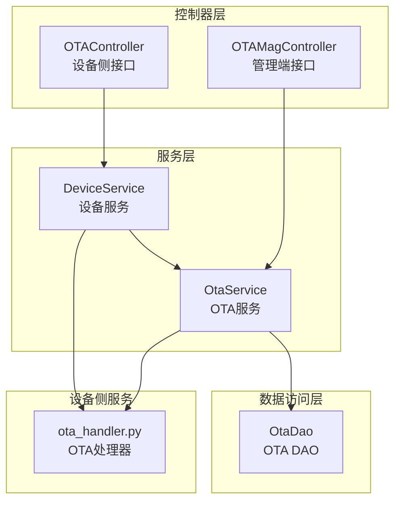
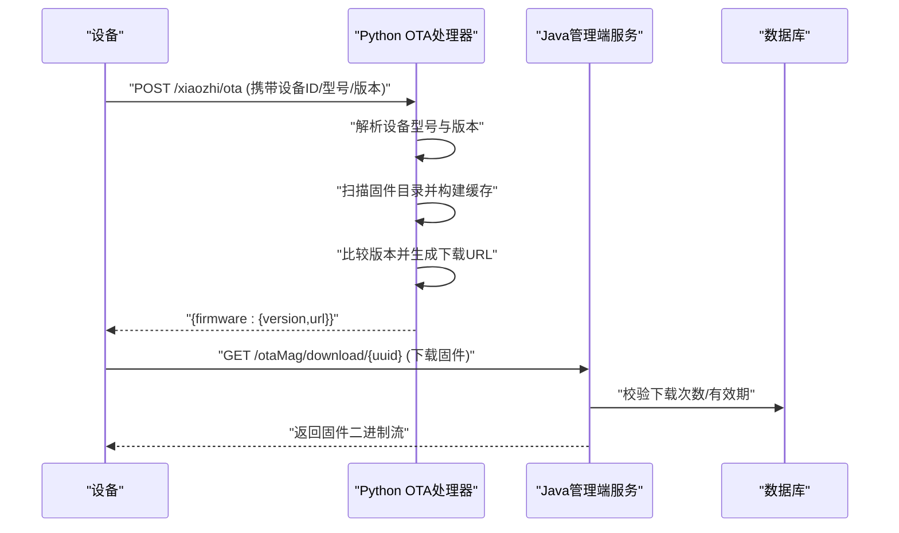
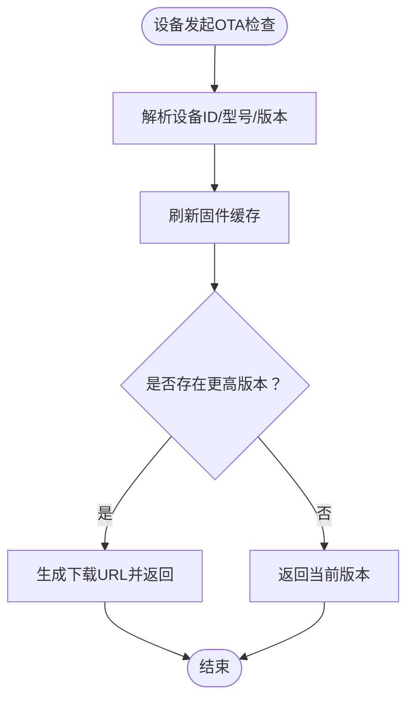
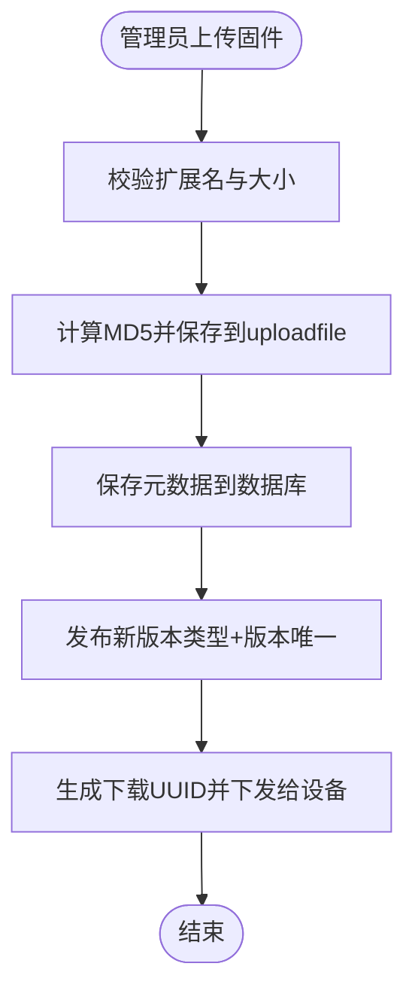
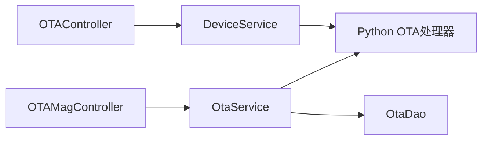

# OTA固件升级

<cite>
**本文引用的文件**
- [OTAController.java](file://main/manager-api/src/main/java/xiaozhi/modules/device/controller/OTAController.java)
- [OTAMagController.java](file://main/manager-api/src/main/java/xiaozhi/modules/device/controller/OTAMagController.java)
- [DeviceReportReqDTO.java](file://main/manager-api/src/main/java/xiaozhi/modules/device/dto/DeviceReportReqDTO.java)
- [DeviceReportRespDTO.java](file://main/manager-api/src/main/java/xiaozhi/modules/device/dto/DeviceReportRespDTO.java)
- [DeviceService.java](file://main/manager-api/src/main/java/xiaozhi/modules/device/service/DeviceService.java)
- [OtaEntity.java](file://main/manager-api/src/main/java/xiaozhi/modules/device/entity/OtaEntity.java)
- [OtaDao.java](file://main/manager-api/src/main/java/xiaozhi/modules/device/dao/OtaDao.java)
- [OtaServiceImpl.java](file://main/manager-api/src/main/java/xiaozhi/modules/device/service/impl/OtaServiceImpl.java)
- [ota_handler.py](file://main/xiaozhi-server/core/api/ota_handler.py)
</cite>

## 目录
1. [简介](#简介)
2. [项目结构](#项目结构)
3. [核心组件](#核心组件)
4. [架构总览](#架构总览)
5. [详细组件分析](#详细组件分析)
6. [依赖分析](#依赖分析)
7. [性能考虑](#性能考虑)
8. [故障排查指南](#故障排查指南)
9. [结论](#结论)
10. [附录](#附录)

## 简介
本文件面向OTA固件升级功能，系统性阐述升级流程、版本管理与策略、控制器实现逻辑、升级请求处理与进度跟踪、Ota实体模型设计、DAO层数据持久化与查询优化、事务处理、完整API接口定义（含升级包上传、版本发布与升级执行）、安全验证、断点续传与失败回滚机制，以及管理员端与普通用户的权限差异与操作流程。

## 项目结构
OTA相关能力在后端分为三层：
- 控制器层：对外暴露REST接口，负责请求接入与鉴权控制
- 服务层：封装业务逻辑，协调DAO与外部系统
- 数据访问层：基于MyBatis-Plus进行数据库操作
- 服务端OTA处理：Python异步HTTP服务负责设备侧OTA版本判定与固件下载

图表来源
- [OTAController.java:33-123](file://main/manager-api/src/main/java/xiaozhi/modules/device/controller/OTAController.java#L33-L123)
- [OTAMagController.java:53-342](file://main/manager-api/src/main/java/xiaozhi/modules/device/controller/OTAMagController.java#L53-L342)
- [DeviceService.java:16-136](file://main/manager-api/src/main/java/xiaozhi/modules/device/service/DeviceService.java#L16-L136)
- [OtaServiceImpl.java:20-85](file://main/manager-api/src/main/java/xiaozhi/modules/device/service/impl/OtaServiceImpl.java#L20-L85)
- [OtaDao.java:1-15](file://main/manager-api/src/main/java/xiaozhi/modules/device/dao/OtaDao.java#L1-L15)
- [ota_handler.py:46-416](file://main/xiaozhi-server/core/api/ota_handler.py#L46-L416)

章节来源
- [OTAController.java:33-123](file://main/manager-api/src/main/java/xiaozhi/modules/device/controller/OTAController.java#L33-L123)
- [OTAMagController.java:53-342](file://main/manager-api/src/main/java/xiaozhi/modules/device/controller/OTAMagController.java#L53-L342)
- [DeviceService.java:16-136](file://main/manager-api/src/main/java/xiaozhi/modules/device/service/DeviceService.java#L16-L136)
- [OtaServiceImpl.java:20-85](file://main/manager-api/src/main/java/xiaozhi/modules/device/service/impl/OtaServiceImpl.java#L20-L85)
- [OtaDao.java:1-15](file://main/manager-api/src/main/java/xiaozhi/modules/device/dao/OtaDao.java#L1-L15)
- [ota_handler.py:46-416](file://main/xiaozhi-server/core/api/ota_handler.py#L46-L416)

## 核心组件
- 设备侧控制器：提供OTA版本检查与激活状态快速检查接口，返回设备侧所需的MQTT或WebSocket配置及固件下载信息
- 管理端控制器：提供OTA固件的分页查询、新增/修改/删除、下载链接生成与固件下载、固件上传（支持.bin/.apk），并区分管理员与普通用户权限
- 设备服务：封装设备激活、OTA版本检查、WebSocket令牌生成等逻辑
- OTA服务与DAO：封装OTA固件的分页、保存/更新、删除、按类型查询最新版本等操作
- Python OTA处理器：负责设备侧OTA请求解析、固件版本比较、下载地址下发、固件文件下载

章节来源
- [OTAController.java:33-123](file://main/manager-api/src/main/java/xiaozhi/modules/device/controller/OTAController.java#L33-L123)
- [OTAMagController.java:53-342](file://main/manager-api/src/main/java/xiaozhi/modules/device/controller/OTAMagController.java#L53-L342)
- [DeviceService.java:16-136](file://main/manager-api/src/main/java/xiaozhi/modules/device/service/DeviceService.java#L16-L136)
- [OtaEntity.java:15-61](file://main/manager-api/src/main/java/xiaozhi/modules/device/entity/OtaEntity.java#L15-L61)
- [OtaServiceImpl.java:20-85](file://main/manager-api/src/main/java/xiaozhi/modules/device/service/impl/OtaServiceImpl.java#L20-L85)
- [OtaDao.java:1-15](file://main/manager-api/src/main/java/xiaozhi/modules/device/dao/OtaDao.java#L1-L15)
- [ota_handler.py:46-416](file://main/xiaozhi-server/core/api/ota_handler.py#L46-L416)

## 架构总览
OTA升级涉及“设备侧请求—服务端判定—固件下发—设备下载”的闭环流程。设备侧通过HTTP请求向服务端发起OTA检查，服务端根据设备型号与当前版本选择最优固件并返回下载地址；管理端负责固件上传、版本发布与下载授权；Python OTA处理器负责固件缓存、版本比较与下载端点。

图表来源
- [ota_handler.py:143-353](file://main/xiaozhi-server/core/api/ota_handler.py#L143-L353)
- [OTAMagController.java:136-243](file://main/manager-api/src/main/java/xiaozhi/modules/device/controller/OTAMagController.java#L136-L243)
- [OTAController.java:42-60](file://main/manager-api/src/main/java/xiaozhi/modules/device/controller/OTAController.java#L42-L60)

## 详细组件分析

### 设备侧控制器：OTAController
- 功能要点
  - 版本与激活检查：接收设备上报的固件信息，校验设备ID格式，调用设备服务进行激活状态检查并返回统一JSON响应
  - 快速激活检查：仅校验设备是否存在，便于设备快速探测
  - 健康检查：校验系统参数（MQTT网关、WebSocket、OTA地址），确保OTA链路可用
- 关键输入输出
  - 请求头：Device-Id、Client-Id
  - 请求体：设备固件信息上报DTO
  - 响应体：统一的设备OTA检测响应DTO
- 安全与容错
  - 对设备ID进行简单正则校验
  - 缺少必要参数或参数非法时返回错误响应

章节来源
- [OTAController.java:33-123](file://main/manager-api/src/main/java/xiaozhi/modules/device/controller/OTAController.java#L33-L123)
- [DeviceReportReqDTO.java:14-149](file://main/manager-api/src/main/java/xiaozhi/modules/device/dto/DeviceReportReqDTO.java#L14-L149)
- [DeviceReportRespDTO.java:8-95](file://main/manager-api/src/main/java/xiaozhi/modules/device/dto/DeviceReportRespDTO.java#L8-L95)

### 管理端控制器：OTAMagController
- 功能要点
  - 分页查询：按固件名称模糊查询，按更新时间倒序
  - 新增/修改/删除：对固件元数据进行维护
  - 下载链接生成：生成一次性UUID并写入Redis，限制下载次数
  - 固件下载：校验Redis键与下载次数，支持绝对/相对路径与备用目录查找
  - 固件上传：支持.bin/.apk，计算MD5命名，限制大小与频率
  - 权限控制：管理员与普通用户不同权限，普通用户每日上传次数受Redis计数限制
- 关键流程
  - 上传：校验扩展名与大小，计算MD5并保存到uploadfile目录
  - 下载：通过UUID映射到固件ID或直接路径，校验下载次数，返回二进制流
  - 资源固件上传：普通用户可上传资源固件，受每日次数限制

章节来源
- [OTAMagController.java:53-342](file://main/manager-api/src/main/java/xiaozhi/modules/device/controller/OTAMagController.java#L53-L342)

### 设备服务：DeviceService
- 功能要点
  - 设备激活与OTA版本检查：根据设备上报信息与系统参数生成响应
  - WebSocket认证token生成：用于设备侧WebSocket鉴权
  - 设备查询与连接信息更新：支持按MAC地址查询与连接状态更新
- 与OTA的关系
  - 设备侧控制器调用该服务完成激活与版本检查
  - Python OTA处理器依赖系统参数（MQTT/WS/OTA地址）进行配置下发

章节来源
- [DeviceService.java:16-136](file://main/manager-api/src/main/java/xiaozhi/modules/device/service/DeviceService.java#L16-L136)

### OTA实体模型：OtaEntity
- 字段说明
  - 主键：UUID
  - 固件名称、类型、版本、大小、备注、文件路径、排序
  - 创建/更新时间与人员字段，自动填充
- 设计考量
  - 类型+版本唯一性约束通过服务层保证
  - 同类型固件仅保留最新一条，避免历史冗余

章节来源
- [OtaEntity.java:15-61](file://main/manager-api/src/main/java/xiaozhi/modules/device/entity/OtaEntity.java#L15-L61)

### OTA服务与DAO：OtaService/OtaDao
- 服务层
  - 分页查询：支持按固件名称模糊查询
  - 保存/更新：同类型仅保留最新一条；更新前校验相同类型+版本唯一
  - 删除：批量删除
  - 查询最新版本：按更新时间倒序取第一条
- DAO层
  - 基于MyBatis-Plus的通用Mapper接口，继承BaseMapper

章节来源
- [OtaServiceImpl.java:20-85](file://main/manager-api/src/main/java/xiaozhi/modules/device/service/impl/OtaServiceImpl.java#L20-L85)
- [OtaDao.java:1-15](file://main/manager-api/src/main/java/xiaozhi/modules/device/dao/OtaDao.java#L1-L15)

### Python OTA处理器：ota_handler.py
- 功能要点
  - 设备请求解析：从请求头与请求体提取设备ID、型号、版本
  - 固件缓存：扫描data/bin目录，按模型与版本构建缓存并排序
  - 版本比较：语义化版本比较，选择更高版本
  - 下发配置：优先下发MQTT网关配置；若未配置则下发WebSocket配置与token
  - 固件下载：仅允许下载data/bin目录下安全命名的.bin文件，防止路径穿越
- 性能与可靠性
  - 固件缓存带TTL，避免频繁扫描
  - 版本比较采用元组比较，兼容不同长度版本号

章节来源
- [ota_handler.py:46-416](file://main/xiaozhi-server/core/api/ota_handler.py#L46-L416)

### 升级流程与策略
- 流程图（设备侧）

图表来源
- [ota_handler.py:143-353](file://main/xiaozhi-server/core/api/ota_handler.py#L143-L353)

- 管理端流程（上传/发布/下载）

图表来源
- [OTAMagController.java:245-294](file://main/manager-api/src/main/java/xiaozhi/modules/device/controller/OTAMagController.java#L245-L294)
- [OtaServiceImpl.java:62-75](file://main/manager-api/src/main/java/xiaozhi/modules/device/service/impl/OtaServiceImpl.java#L62-L75)

### 进度跟踪与状态管理
- 设备侧：通过OTA检查接口返回的固件版本与下载URL实现“是否需要升级”的状态判断
- 管理端：通过分页查询与最新版本查询接口跟踪固件版本与发布状态
- 下载侧：通过Redis记录下载次数与有效期，防止滥用

章节来源
- [OTAController.java:42-60](file://main/manager-api/src/main/java/xiaozhi/modules/device/controller/OTAController.java#L42-L60)
- [OTAMagController.java:136-243](file://main/manager-api/src/main/java/xiaozhi/modules/device/controller/OTAMagController.java#L136-L243)
- [OtaServiceImpl.java:77-84](file://main/manager-api/src/main/java/xiaozhi/modules/device/service/impl/OtaServiceImpl.java#L77-L84)

### 安全验证、断点续传与失败回滚
- 安全验证
  - 设备ID格式校验（MAC地址正则）
  - Python OTA处理器对下载路径进行安全校验，防止目录穿越
  - 管理端下载链接使用UUID并在Redis中设置过期与次数限制
- 断点续传
  - 当前实现未见断点续传支持，建议在设备侧实现Range请求与服务端配合
- 失败回滚
  - 当前实现未见自动回滚逻辑，建议在设备侧实现“上电自检失败回滚至上一稳定版本”的机制

章节来源
- [OTAController.java:114-121](file://main/manager-api/src/main/java/xiaozhi/modules/device/controller/OTAController.java#L114-L121)
- [ota_handler.py:372-415](file://main/xiaozhi-server/core/api/ota_handler.py#L372-L415)
- [OTAMagController.java:145-243](file://main/manager-api/src/main/java/xiaozhi/modules/device/controller/OTAMagController.java#L145-L243)

### 权限差异与操作流程
- 管理员（超级管理员）
  - 可执行所有OTA管理操作：分页查询、新增/修改/删除、上传固件、生成下载链接、下载固件
- 普通用户
  - 可上传资源固件（受每日次数限制），无法直接管理固件元数据
- 设备侧
  - 通过设备ID与Client-Id进行身份识别与鉴权（取决于系统配置）

章节来源
- [OTAMagController.java:64-134](file://main/manager-api/src/main/java/xiaozhi/modules/device/controller/OTAMagController.java#L64-L134)
- [OTAMagController.java:296-330](file://main/manager-api/src/main/java/xiaozhi/modules/device/controller/OTAMagController.java#L296-L330)

## 依赖分析
- 控制器依赖服务，服务依赖DAO与Redis/系统参数
- Python OTA处理器独立于Java服务，但共享固件存储目录
- 设备侧通过HTTP与WebSocket/MQTT与服务端交互

图表来源
- [OTAController.java:33-123](file://main/manager-api/src/main/java/xiaozhi/modules/device/controller/OTAController.java#L33-L123)
- [OTAMagController.java:53-342](file://main/manager-api/src/main/java/xiaozhi/modules/device/controller/OTAMagController.java#L53-L342)
- [DeviceService.java:16-136](file://main/manager-api/src/main/java/xiaozhi/modules/device/service/DeviceService.java#L16-L136)
- [OtaServiceImpl.java:20-85](file://main/manager-api/src/main/java/xiaozhi/modules/device/service/impl/OtaServiceImpl.java#L20-L85)
- [OtaDao.java:1-15](file://main/manager-api/src/main/java/xiaozhi/modules/device/dao/OtaDao.java#L1-L15)
- [ota_handler.py:46-416](file://main/xiaozhi-server/core/api/ota_handler.py#L46-L416)

## 性能考虑
- 固件缓存：Python OTA处理器对固件目录进行TTL缓存，减少IO开销
- 数据库查询：分页与条件查询使用MyBatis-Plus，建议在类型与更新时间字段建立索引以提升查询效率
- 下载限流：Redis计数与过期策略限制下载与上传频率，避免资源滥用
- 文件存储：上传固件以MD5命名，避免重复存储，节省空间

章节来源
- [ota_handler.py:66-104](file://main/xiaozhi-server/core/api/ota_handler.py#L66-L104)
- [OtaServiceImpl.java:24-39](file://main/manager-api/src/main/java/xiaozhi/modules/device/service/impl/OtaServiceImpl.java#L24-L39)
- [OTAMagController.java:145-243](file://main/manager-api/src/main/java/xiaozhi/modules/device/controller/OTAMagController.java#L145-L243)

## 故障排查指南
- 设备侧无法获取OTA配置
  - 检查系统参数：MQTT网关、WebSocket、OTA地址是否配置正确
  - 检查设备ID格式是否符合MAC地址规范
- 固件下载失败
  - 检查UUID是否过期或下载次数超限
  - 检查固件文件路径是否存在，是否在允许目录内
- 版本未更新
  - 检查固件命名是否符合“模型_版本.bin”，版本是否高于设备当前版本
  - 检查固件缓存是否刷新成功

章节来源
- [OTAController.java:77-93](file://main/manager-api/src/main/java/xiaozhi/modules/device/controller/OTAController.java#L77-L93)
- [OTAMagController.java:145-243](file://main/manager-api/src/main/java/xiaozhi/modules/device/controller/OTAMagController.java#L145-L243)
- [ota_handler.py:372-415](file://main/xiaozhi-server/core/api/ota_handler.py#L372-L415)

## 结论
本OTA方案通过Java管理端与Python设备侧服务协同，实现了从固件上传、版本发布到设备侧版本检查与下载的完整闭环。通过Redis限流与安全校验保障了稳定性与安全性。建议后续增强断点续传与自动回滚机制，进一步提升用户体验与系统鲁棒性。

## 附录

### API接口清单（管理端）
- 分页查询OTA固件
  - 方法：GET
  - 路径：/otaMag
  - 权限：sys:role:superAdmin
  - 参数：分页参数
- 获取OTA固件详情
  - 方法：GET
  - 路径：/otaMag/{id}
  - 权限：sys:role:superAdmin
- 保存OTA固件信息
  - 方法：POST
  - 路径：/otaMag
  - 权限：sys:role:superAdmin
  - 请求体：OtaEntity
- 修改OTA固件信息
  - 方法：PUT
  - 路径：/otaMag/{id}
  - 权限：sys:role:superAdmin
  - 请求体：OtaEntity
- 删除OTA固件
  - 方法：DELETE
  - 路径：/otaMag/{id}
  - 权限：sys:role:superAdmin
- 生成下载链接
  - 方法：GET
  - 路径：/otaMag/getDownloadUrl/{id}
  - 权限：sys:role:superAdmin
- 下载固件
  - 方法：GET
  - 路径：/otaMag/download/{uuid}
  - 权限：sys:role:superAdmin
- 上传固件
  - 方法：POST
  - 路径：/otaMag/upload
  - 权限：sys:role:superAdmin
  - 参数：file（.bin/.apk）
- 普通用户上传资源固件
  - 方法：POST
  - 路径：/otaMag/uploadAssetsBin
  - 权限：sys:role:normal
  - 参数：file（≤20MB）

章节来源
- [OTAMagController.java:64-330](file://main/manager-api/src/main/java/xiaozhi/modules/device/controller/OTAMagController.java#L64-L330)

### API接口清单（设备侧）
- OTA版本与激活检查
  - 方法：POST
  - 路径：/ota/
  - 请求头：Device-Id、Client-Id
  - 请求体：DeviceReportReqDTO
  - 响应体：DeviceReportRespDTO
- 设备快速激活检查
  - 方法：POST
  - 路径：/ota/activate
  - 请求头：Device-Id、Client-Id
- OTA健康检查
  - 方法：GET
  - 路径：/ota/

章节来源
- [OTAController.java:42-93](file://main/manager-api/src/main/java/xiaozhi/modules/device/controller/OTAController.java#L42-L93)
- [DeviceReportReqDTO.java:14-149](file://main/manager-api/src/main/java/xiaozhi/modules/device/dto/DeviceReportReqDTO.java#L14-L149)
- [DeviceReportRespDTO.java:8-95](file://main/manager-api/src/main/java/xiaozhi/modules/device/dto/DeviceReportRespDTO.java#L8-L95)