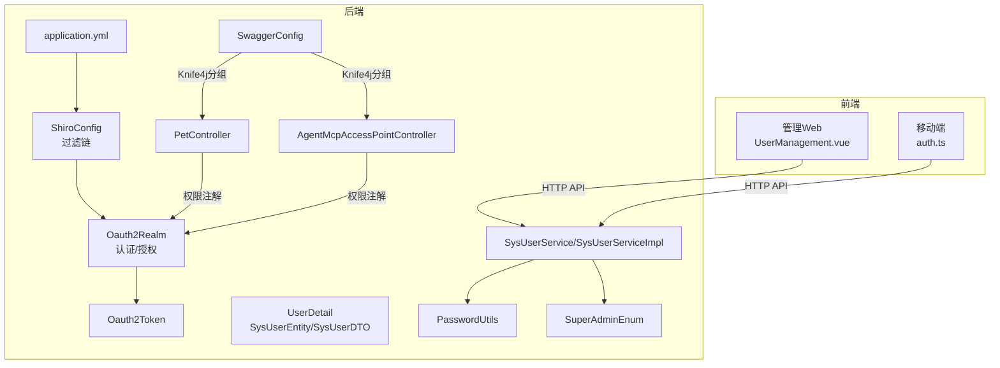
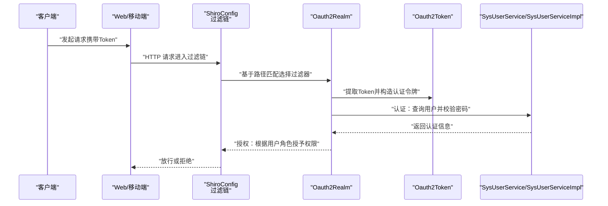
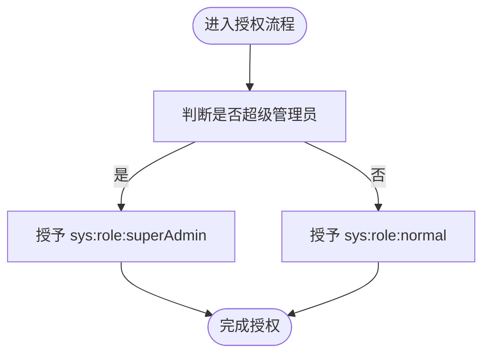
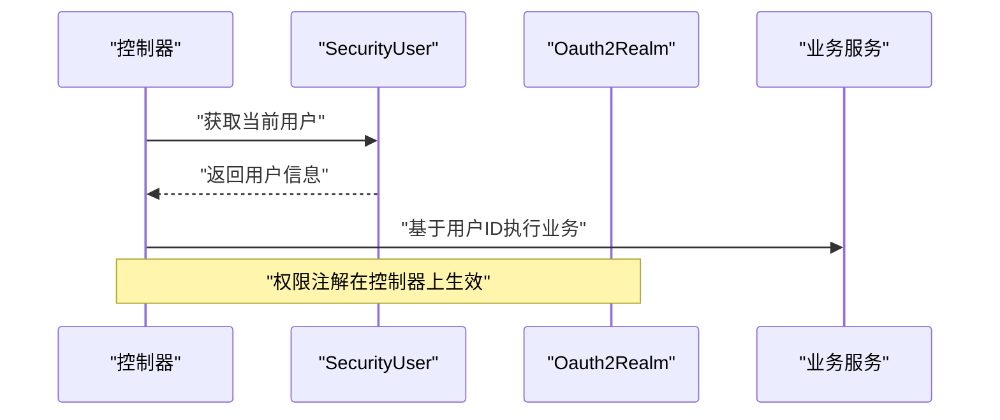
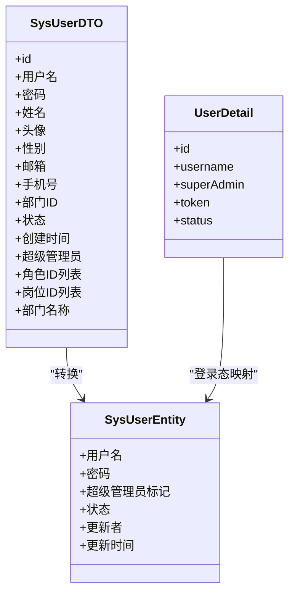
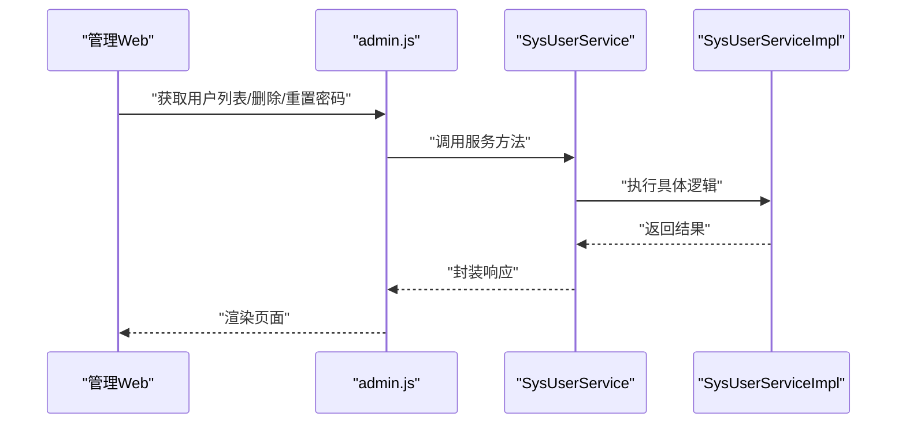
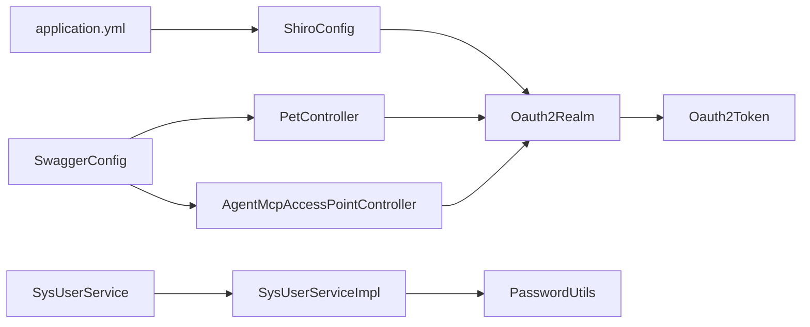

# 用户权限管理

<cite>
**本文引用的文件**
- [Oauth2Realm.java](file://main/manager-api/src/main/java/xiaozhi/modules/security/oauth2/Oauth2Realm.java)
- [Oauth2Token.java](file://main/manager-api/src/main/java/xiaozhi/modules/security/oauth2/Oauth2Token.java)
- [ShiroConfig.java](file://main/manager-api/src/main/java/xiaozhi/modules/security/config/ShiroConfig.java)
- [UserDetail.java](file://main/manager-api/src/main/java/xiaozhi/common/user/UserDetail.java)
- [SysUserEntity.java](file://main/manager-api/src/main/java/xiaozhi/modules/sys/entity/SysUserEntity.java)
- [SysUserDTO.java](file://main/manager-api/src/main/java/xiaozhi/modules/sys/dto/SysUserDTO.java)
- [SysUserDao.java](file://main/manager-api/src/main/java/xiaozhi/modules/sys/dao/SysUserDao.java)
- [SysUserService.java](file://main/manager-api/src/main/java/xiaozhi/modules/sys/service/SysUserService.java)
- [SysUserServiceImpl.java](file://main/manager-api/src/main/java/xiaozhi/modules/sys/service/impl/SysUserServiceImpl.java)
- [PasswordUtils.java](file://main/manager-api/src/main/java/xiaozhi/modules/security/password/PasswordUtils.java)
- [SuperAdminEnum.java](file://main/manager-api/src/main/java/xiaozhi/modules/sys/enums/SuperAdminEnum.java)
- [application.yml](file://main/manager-api/src/main/resources/application.yml)
- [PetController.java](file://main/manager-api/src/main/java/xiaozhi/modules/pet/controller/PetController.java)
- [AgentMcpAccessPointController.java](file://main/manager-api/src/main/java/xiaozhi/modules/agent/controller/AgentMcpAccessPointController.java)
- [admin.js](file://main/manager-web/src/apis/module/admin.js)
- [UserManagement.vue](file://main/manager-web/src/views/UserManagement.vue)
- [auth.ts](file://main/manager-mobile/src/api/auth.ts)
- [SwaggerConfig.java](file://main/manager-api/src/main/java/xiaozhi/common/config/SwaggerConfig.java)
</cite>

## 目录
1. [简介](#简介)
2. [项目结构](#项目结构)
3. [核心组件](#核心组件)
4. [架构总览](#架构总览)
5. [详细组件分析](#详细组件分析)
6. [依赖分析](#依赖分析)
7. [性能考虑](#性能考虑)
8. [故障排查指南](#故障排查指南)
9. [结论](#结论)
10. [附录](#附录)

## 简介
本文件系统性梳理用户权限管理功能，覆盖角色体系、权限分配与访问控制、认证与会话、用户实体模型、用户管理界面能力、权限API接口、权限继承与资源访问控制、安全审计机制，以及管理员、普通用户与设备绑定权限的区别与应用场景。文档以代码为依据，结合架构图与流程图，帮助开发者与产品人员快速理解与落地。

## 项目结构
围绕用户权限管理的关键模块分布如下：
- 后端权限框架与认证
  - Shiro 安全配置与过滤链
  - OAuth2 Realm 与 Token
  - 用户信息载体
- 用户域模型与服务
  - 实体、DTO、DAO、Service 及其实现
  - 密码工具与超级管理员枚举
- 前端管理界面
  - Web 管理端用户管理页面与 API 调用
  - 移动端注册、登录、找回密码等接口
- 权限注解与控制器
  - 基于注解的权限校验示例
- 文档与配置
  - Knife4j Swagger 分组
  - Spring Boot 应用配置（含 Cookie 设置）

图表来源
- [ShiroConfig.java:93-118](file://main/manager-api/src/main/java/xiaozhi/modules/security/config/ShiroConfig.java#L93-L118)
- [Oauth2Realm.java:43-77](file://main/manager-api/src/main/java/xiaozhi/modules/security/oauth2/Oauth2Realm.java#L43-L77)
- [Oauth2Token.java:1-27](file://main/manager-api/src/main/java/xiaozhi/modules/security/oauth2/Oauth2Token.java#L1-27)
- [UserDetail.java:1-19](file://main/manager-api/src/main/java/xiaozhi/common/user/UserDetail.java#L1-19)
- [SysUserEntity.java:1-47](file://main/manager-api/src/main/java/xiaozhi/modules/sys/entity/SysUserEntity.java#L1-L47)
- [SysUserDTO.java:1-87](file://main/manager-api/src/main/java/xiaozhi/modules/sys/dto/SysUserDTO.java#L1-L87)
- [SysUserService.java:1-76](file://main/manager-api/src/main/java/xiaozhi/modules/sys/service/SysUserService.java#L1-L76)
- [SysUserServiceImpl.java:1-251](file://main/manager-api/src/main/java/xiaozhi/modules/sys/service/impl/SysUserServiceImpl.java#L1-L251)
- [PasswordUtils.java:1-41](file://main/manager-api/src/main/java/xiaozhi/modules/security/password/PasswordUtils.java#L1-L41)
- [SuperAdminEnum.java:1-19](file://main/manager-api/src/main/java/xiaozhi/modules/sys/enums/SuperAdminEnum.java#L1-L19)
- [PetController.java:40-57](file://main/manager-api/src/main/java/xiaozhi/modules/pet/controller/PetController.java#L40-L57)
- [AgentMcpAccessPointController.java:29-67](file://main/manager-api/src/main/java/xiaozhi/modules/agent/controller/AgentMcpAccessPointController.java#L29-L67)
- [SwaggerConfig.java:58-114](file://main/manager-api/src/main/java/xiaozhi/common/config/SwaggerConfig.java#L58-L114)
- [application.yml:1-66](file://main/manager-api/src/main/resources/application.yml#L1-L66)

章节来源
- [ShiroConfig.java:93-118](file://main/manager-api/src/main/java/xiaozhi/modules/security/config/ShiroConfig.java#L93-L118)
- [application.yml:1-66](file://main/manager-api/src/main/resources/application.yml#L1-L66)

## 核心组件
- 角色与权限
  - 角色标识：sys:role:superAdmin、sys:role:normal
  - 超级管理员拥有全部角色；普通用户仅拥有 normal 角色
- 认证与会话
  - 使用 OAuth2 Token 作为 Shiro 的 AuthenticationToken
  - 通过 Realm 完成认证与授权
- 用户模型
  - SysUserEntity：持久化用户基本信息与状态
  - SysUserDTO：对外传输对象，含角色/岗位/部门等扩展信息
  - UserDetail：登录态中的用户信息载体
- 密码与安全
  - PasswordUtils：BCrypt 编码与匹配
  - 密码强度策略：包含大小写字母与数字
- 用户服务
  - SysUserService：用户增删改查、密码变更/重置、分页查询、批量启停
  - SysUserServiceImpl：实现业务逻辑，含首次创建自动设为超级管理员、密码强度校验、随机密码生成等

章节来源
- [Oauth2Realm.java:43-77](file://main/manager-api/src/main/java/xiaozhi/modules/security/oauth2/Oauth2Realm.java#L43-L77)
- [Oauth2Token.java:1-27](file://main/manager-api/src/main/java/xiaozhi/modules/security/oauth2/Oauth2Token.java#L1-27)
- [UserDetail.java:1-19](file://main/manager-api/src/main/java/xiaozhi/common/user/UserDetail.java#L1-19)
- [SysUserEntity.java:1-47](file://main/manager-api/src/main/java/xiaozhi/modules/sys/entity/SysUserEntity.java#L1-L47)
- [SysUserDTO.java:1-87](file://main/manager-api/src/main/java/xiaozhi/modules/sys/dto/SysUserDTO.java#L1-L87)
- [SysUserService.java:1-76](file://main/manager-api/src/main/java/xiaozhi/modules/sys/service/SysUserService.java#L1-L76)
- [SysUserServiceImpl.java:1-251](file://main/manager-api/src/main/java/xiaozhi/modules/sys/service/impl/SysUserServiceImpl.java#L1-L251)
- [PasswordUtils.java:1-41](file://main/manager-api/src/main/java/xiaozhi/modules/security/password/PasswordUtils.java#L1-L41)
- [SuperAdminEnum.java:1-19](file://main/manager-api/src/main/java/xiaozhi/modules/sys/enums/SuperAdminEnum.java#L1-L19)

## 架构总览
下图展示从客户端到后端的认证与权限校验路径，以及关键组件之间的交互。

图表来源
- [ShiroConfig.java:93-118](file://main/manager-api/src/main/java/xiaozhi/modules/security/config/ShiroConfig.java#L93-L118)
- [Oauth2Realm.java:43-77](file://main/manager-api/src/main/java/xiaozhi/modules/security/oauth2/Oauth2Realm.java#L43-L77)
- [Oauth2Token.java:1-27](file://main/manager-api/src/main/java/xiaozhi/modules/security/oauth2/Oauth2Token.java#L1-27)
- [SysUserServiceImpl.java:1-251](file://main/manager-api/src/main/java/xiaozhi/modules/sys/service/impl/SysUserServiceImpl.java#L1-L251)

## 详细组件分析

### 角色与权限体系
- 角色定义
  - sys:role:superAdmin：超级管理员角色
  - sys:role:normal：普通用户角色
- 授权规则
  - 若用户为超级管理员，则同时具备 superAdmin 与 normal 角色
  - 否则仅具备 normal 角色
- 控制器使用
  - 使用注解对资源进行权限标注，如 sys:role:normal

图表来源
- [Oauth2Realm.java:50-70](file://main/manager-api/src/main/java/xiaozhi/modules/security/oauth2/Oauth2Realm.java#L50-L70)

章节来源
- [Oauth2Realm.java:50-70](file://main/manager-api/src/main/java/xiaozhi/modules/security/oauth2/Oauth2Realm.java#L50-L70)

### SecurityUser 与会话管理
- SecurityUser 提供当前线程中的用户上下文访问，如获取用户 ID 或用户对象
- 在控制器中通过 SecurityUser 获取当前用户，用于资源访问控制与业务逻辑
- 会话由 Shiro 维护，Token 作为认证凭据

图表来源
- [PetController.java:40-57](file://main/manager-api/src/main/java/xiaozhi/modules/pet/controller/PetController.java#L40-L57)
- [AgentMcpAccessPointController.java:29-67](file://main/manager-api/src/main/java/xiaozhi/modules/agent/controller/AgentMcpAccessPointController.java#L29-L67)

章节来源
- [PetController.java:40-57](file://main/manager-api/src/main/java/xiaozhi/modules/pet/controller/PetController.java#L40-L57)
- [AgentMcpAccessPointController.java:29-67](file://main/manager-api/src/main/java/xiaozhi/modules/agent/controller/AgentMcpAccessPointController.java#L29-L67)

### SysUser 实体模型设计
- SysUserEntity
  - 字段：用户名、密码、超级管理员标记、状态、更新者、更新时间等
  - 与数据库表 sys_user 对应
- SysUserDTO
  - 传输层对象，包含角色ID列表、岗位ID列表、部门名称等
  - 用于对外暴露用户信息与权限集合
- UserDetail
  - 登录态中的用户信息载体，包含用户ID、用户名、是否超级管理员、状态、Token

图表来源
- [SysUserEntity.java:1-47](file://main/manager-api/src/main/java/xiaozhi/modules/sys/entity/SysUserEntity.java#L1-L47)
- [SysUserDTO.java:1-87](file://main/manager-api/src/main/java/xiaozhi/modules/sys/dto/SysUserDTO.java#L1-L87)
- [UserDetail.java:1-19](file://main/manager-api/src/main/java/xiaozhi/common/user/UserDetail.java#L1-L19)

章节来源
- [SysUserEntity.java:1-47](file://main/manager-api/src/main/java/xiaozhi/modules/sys/entity/SysUserEntity.java#L1-L47)
- [SysUserDTO.java:1-87](file://main/manager-api/src/main/java/xiaozhi/modules/sys/dto/SysUserDTO.java#L1-L87)
- [UserDetail.java:1-19](file://main/manager-api/src/main/java/xiaozhi/common/user/UserDetail.java#L1-L19)

### 用户管理界面功能特性
- 管理Web端用户管理页面
  - 支持按手机号搜索、分页查看用户列表
  - 支持批量启用/停用、重置密码、删除用户
  - 与后端 admin 用户管理 API 对接
- 移动端
  - 提供注册、发送短信验证码、忘记密码等接口
  - 公共配置接口支持免鉴权访问

图表来源
- [UserManagement.vue:1-318](file://main/manager-web/src/views/UserManagement.vue#L1-L318)
- [admin.js:1-53](file://main/manager-web/src/apis/module/admin.js#L1-L53)
- [SysUserService.java:1-76](file://main/manager-api/src/main/java/xiaozhi/modules/sys/service/SysUserService.java#L1-L76)
- [SysUserServiceImpl.java:1-251](file://main/manager-api/src/main/java/xiaozhi/modules/sys/service/impl/SysUserServiceImpl.java#L1-L251)

章节来源
- [UserManagement.vue:1-318](file://main/manager-web/src/views/UserManagement.vue#L1-L318)
- [admin.js:1-53](file://main/manager-web/src/apis/module/admin.js#L1-L53)

### 权限API接口文档
- 管理端用户管理
  - GET /admin/users?page=...&limit=...&mobile=...
  - PUT /admin/users/{id}（重置密码）
  - DELETE /admin/users/{id}
- 用户端接口（移动端）
  - GET /user/pub-config（公共配置，免鉴权）
  - POST /user/register（注册）
  - POST /user/smsVerification（发送短信验证码）
  - PUT /user/retrieve-password（找回密码）

章节来源
- [admin.js:1-53](file://main/manager-web/src/apis/module/admin.js#L1-L53)
- [auth.ts:83-143](file://main/manager-mobile/src/api/auth.ts#L83-L143)

### 权限继承、资源访问控制与安全审计
- 权限继承
  - 超级管理员继承普通用户权限，天然具备 sys:role:normal
- 资源访问控制
  - 控制器方法通过注解声明所需角色，如 sys:role:normal
  - Shiro 过滤链对路径进行统一拦截与放行
- 安全审计
  - 建议在业务关键操作处增加审计日志（例如登录、密码变更、用户启停、删除等），记录操作人、时间、目标与结果

章节来源
- [Oauth2Realm.java:50-70](file://main/manager-api/src/main/java/xiaozhi/modules/security/oauth2/Oauth2Realm.java#L50-L70)
- [PetController.java:40-57](file://main/manager-api/src/main/java/xiaozhi/modules/pet/controller/PetController.java#L40-L57)
- [AgentMcpAccessPointController.java:29-67](file://main/manager-api/src/main/java/xiaozhi/modules/agent/controller/AgentMcpAccessPointController.java#L29-L67)
- [ShiroConfig.java:93-118](file://main/manager-api/src/main/java/xiaozhi/modules/security/config/ShiroConfig.java#L93-L118)

### 管理员权限、普通用户权限与设备绑定权限
- 管理员权限
  - 超级管理员具备 sys:role:superAdmin 与 sys:role:normal
  - 可执行用户管理、权限分配、系统配置等高权限操作
- 普通用户权限
  - 仅具备 sys:role:normal
  - 可访问自身资源（如宠物、智能体接入点等）
- 设备绑定权限
  - 通过业务服务校验用户与设备/智能体的归属关系（例如检查智能体权限）
  - 控制器在访问前进行权限校验，防止越权访问

章节来源
- [Oauth2Realm.java:50-70](file://main/manager-api/src/main/java/xiaozhi/modules/security/oauth2/Oauth2Realm.java#L50-L70)
- [AgentMcpAccessPointController.java:29-67](file://main/manager-api/src/main/java/xiaozhi/modules/agent/controller/AgentMcpAccessPointController.java#L29-L67)

## 依赖分析
- 组件耦合
  - ShiroConfig 与 Oauth2Realm：过滤链与认证授权入口
  - Oauth2Realm 与 Oauth2Token：认证令牌封装
  - SysUserService/SysUserServiceImpl：用户业务逻辑与数据访问
  - PasswordUtils：密码编码与匹配
  - 控制器与 SecurityUser：基于注解的权限控制
- 外部依赖
  - Spring Boot、MyBatis-Plus、Knife4j Swagger

图表来源
- [ShiroConfig.java:93-118](file://main/manager-api/src/main/java/xiaozhi/modules/security/config/ShiroConfig.java#L93-L118)
- [Oauth2Realm.java:43-77](file://main/manager-api/src/main/java/xiaozhi/modules/security/oauth2/Oauth2Realm.java#L43-L77)
- [Oauth2Token.java:1-27](file://main/manager-api/src/main/java/xiaozhi/modules/security/oauth2/Oauth2Token.java#L1-27)
- [SysUserService.java:1-76](file://main/manager-api/src/main/java/xiaozhi/modules/sys/service/SysUserService.java#L1-L76)
- [SysUserServiceImpl.java:1-251](file://main/manager-api/src/main/java/xiaozhi/modules/sys/service/impl/SysUserServiceImpl.java#L1-L251)
- [PasswordUtils.java:1-41](file://main/manager-api/src/main/java/xiaozhi/modules/security/password/PasswordUtils.java#L1-L41)
- [PetController.java:40-57](file://main/manager-api/src/main/java/xiaozhi/modules/pet/controller/PetController.java#L40-L57)
- [AgentMcpAccessPointController.java:29-67](file://main/manager-api/src/main/java/xiaozhi/modules/agent/controller/AgentMcpAccessPointController.java#L29-L67)
- [SwaggerConfig.java:58-114](file://main/manager-api/src/main/java/xiaozhi/common/config/SwaggerConfig.java#L58-L114)
- [application.yml:1-66](file://main/manager-api/src/main/resources/application.yml#L1-L66)

## 性能考虑
- 密码加密采用 BCrypt，安全性高但计算成本较高，建议在批量导入或初始化场景中合理安排并发与批处理
- 用户分页查询使用 MyBatis-Plus 分页器，注意索引与查询条件优化
- Shiro 过滤链对所有请求生效，建议结合路径精确匹配与静态资源放行减少开销
- Cookie 配置开启 HttpOnly，降低 XSS 风险

## 故障排查指南
- 认证失败
  - 检查 Token 是否有效、是否被正确传递
  - 核对 Oauth2Token 与 Realm 的认证流程
- 权限不足
  - 确认当前用户角色是否满足控制器注解要求
  - 检查 Shiro 过滤链路径映射是否正确
- 密码问题
  - 密码强度不满足要求会导致保存失败
  - 重置密码会生成新随机密码并直接更新
- 用户管理异常
  - 删除用户时关联设备与智能体会一并清理
  - 分页查询需确保查询参数与数据库索引匹配

章节来源
- [Oauth2Realm.java:72-77](file://main/manager-api/src/main/java/xiaozhi/modules/security/oauth2/Oauth2Realm.java#L72-L77)
- [SysUserServiceImpl.java:70-94](file://main/manager-api/src/main/java/xiaozhi/modules/sys/service/impl/SysUserServiceImpl.java#L70-L94)
- [SysUserServiceImpl.java:146-152](file://main/manager-api/src/main/java/xiaozhi/modules/sys/service/impl/SysUserServiceImpl.java#L146-L152)
- [SysUserServiceImpl.java:96-105](file://main/manager-api/src/main/java/xiaozhi/modules/sys/service/impl/SysUserServiceImpl.java#L96-L105)

## 结论
本权限体系以 Shiro 为核心，结合 OAuth2 Token 与自定义 Realm 实现认证与授权；通过 SysUser 实体与 DTO 完成用户信息与权限映射；前端管理界面与移动端接口分别对接管理与用户侧能力。角色体系简洁清晰，权限注解与过滤链共同保障资源访问安全。建议在生产环境中完善审计日志与监控告警，并持续优化密码策略与分页查询性能。

## 附录
- Swagger 分组
  - admin、user、config、knowledge、bot、correct-word 等分组，便于接口文档分类管理
- 应用配置要点
  - Cookie HttpOnly 开启
  - 文件上传大小限制
  - 多语言与国际化消息

章节来源
- [SwaggerConfig.java:58-114](file://main/manager-api/src/main/java/xiaozhi/common/config/SwaggerConfig.java#L58-L114)
- [application.yml:1-66](file://main/manager-api/src/main/resources/application.yml#L1-L66)