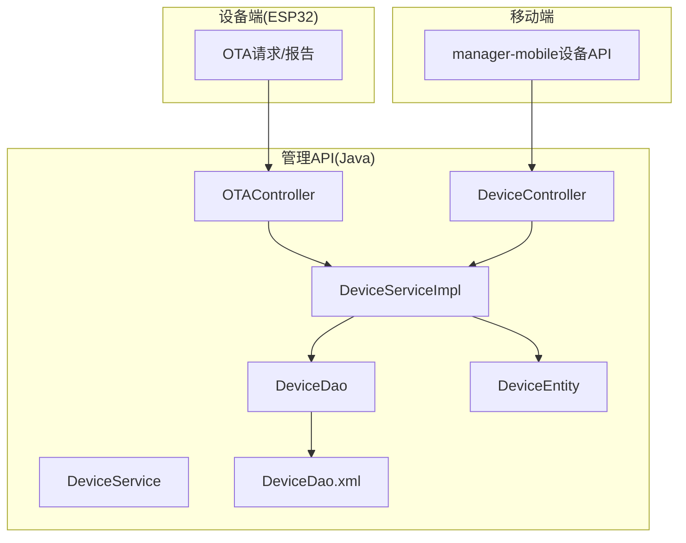
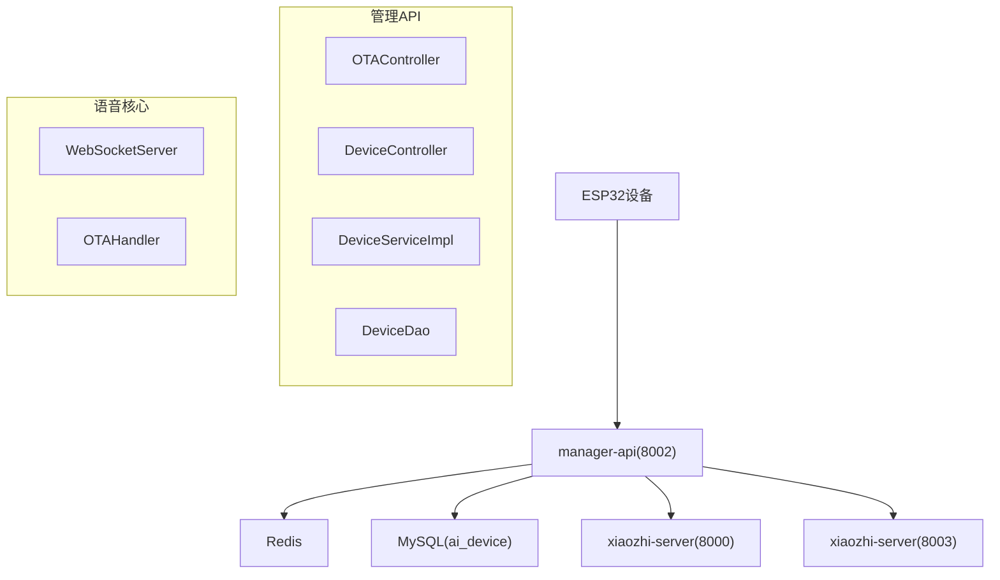
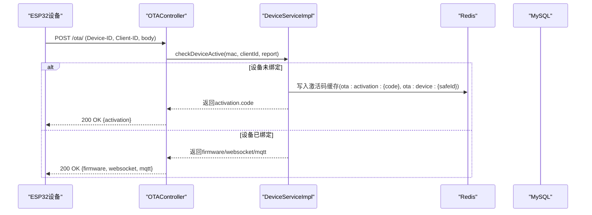
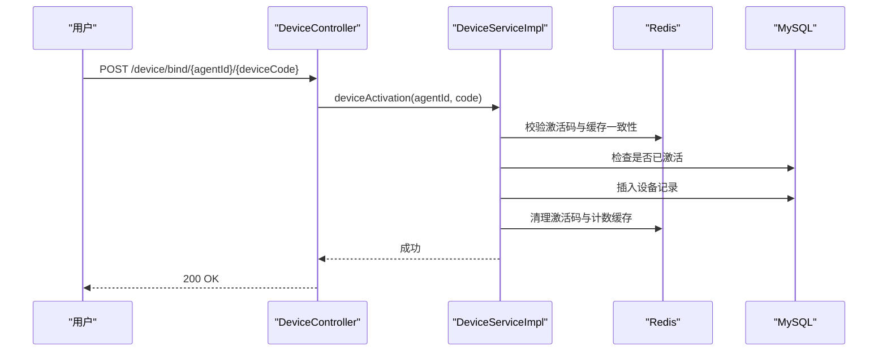
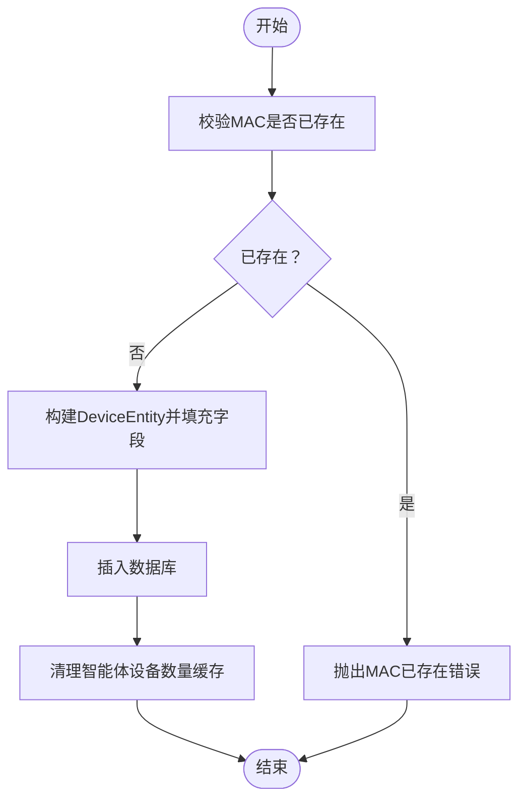
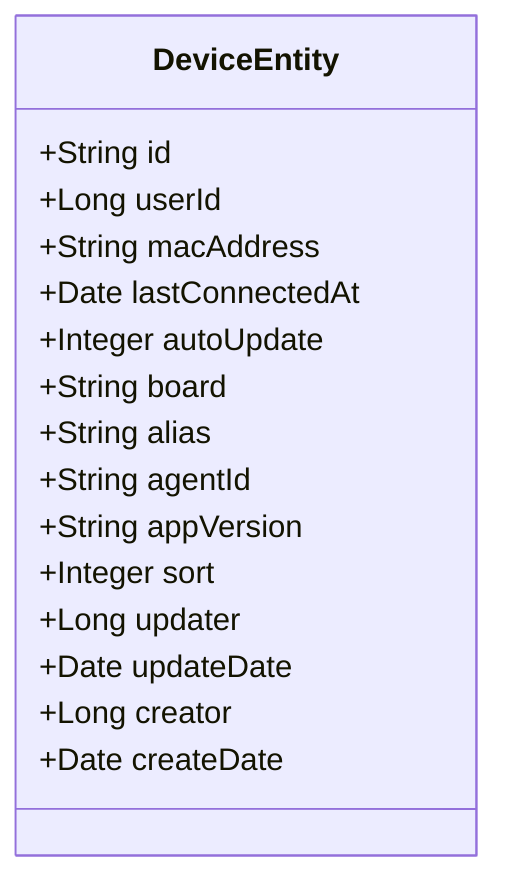
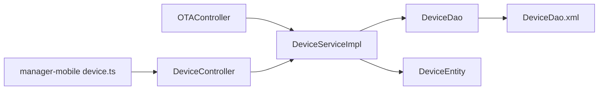

# 设备注册与绑定

<cite>
**本文引用的文件**
- [DeviceController.java](file://main/manager-api/src/main/java/xiaozhi/modules/device/controller/DeviceController.java)
- [OTAController.java](file://main/manager-api/src/main/java/xiaozhi/modules/device/controller/OTAController.java)
- [DeviceService.java](file://main/manager-api/src/main/java/xiaozhi/modules/device/service/DeviceService.java)
- [DeviceServiceImpl.java](file://main/manager-api/src/main/java/xiaozhi/modules/device/service/impl/DeviceServiceImpl.java)
- [DeviceDao.java](file://main/manager-api/src/main/java/xiaozhi/modules/device/dao/DeviceDao.java)
- [DeviceDao.xml](file://main/manager-api/src/main/resources/mapper/device/DeviceDao.xml)
- [DeviceEntity.java](file://main/manager-api/src/main/java/xiaozhi/modules/device/entity/DeviceEntity.java)
- [DeviceRegisterDTO.java](file://main/manager-api/src/main/java/xiaozhi/modules/device/dto/DeviceRegisterDTO.java)
- [DeviceBindDTO.java](file://main/manager-api/src/main/java/xiaozhi/modules/device/dto/DeviceBindDTO.java)
- [DeviceManualAddDTO.java](file://main/manager-api/src/main/java/xiaozhi/modules/device/dto/DeviceManualAddDTO.java)
- [DeviceUnBindDTO.java](file://main/manager-api/src/main/java/xiaozhi/modules/device/dto/DeviceUnBindDTO.java)
- [DeviceUpdateDTO.java](file://main/manager-api/src/main/java/xiaozhi/modules/device/dto/DeviceUpdateDTO.java)
- [DeviceReportReqDTO.java](file://main/manager-api/src/main/java/xiaozhi/modules/device/dto/DeviceReportReqDTO.java)
- [DeviceReportRespDTO.java](file://main/manager-api/src/main/java/xiaozhi/modules/device/dto/DeviceReportRespDTO.java)
- [device-onboarding-flow.md](file://main/xiaozhi-server/docs/device/device-onboarding-flow.md)
- [device.ts](file://main/manager-mobile/src/api/device/device.ts)
</cite>

## 目录
1. [简介](#简介)
2. [项目结构](#项目结构)
3. [核心组件](#核心组件)
4. [架构总览](#架构总览)
5. [详细组件分析](#详细组件分析)
6. [依赖分析](#依赖分析)
7. [性能考量](#性能考量)
8. [故障排查指南](#故障排查指南)
9. [结论](#结论)
10. [附录](#附录)

## 简介
本文件面向设备注册与绑定功能，系统性阐述设备激活流程、设备绑定机制与手动添加设备的操作步骤；详细说明设备注册DTO的数据结构、验证规则与业务逻辑；解释设备实体模型的设计思路、字段含义与关系映射；说明DAO层数据库操作、查询优化与事务管理；提供设备注册的完整API接口文档，包括请求参数、响应格式与错误处理；并总结设备绑定的最佳实践、安全考虑与常见问题解决方案。

## 项目结构
围绕设备注册与绑定的关键代码位于以下模块与文件：
- 控制层：DeviceController、OTAController
- 服务层：DeviceService、DeviceServiceImpl
- 数据访问层：DeviceDao、DeviceDao.xml
- 实体与DTO：DeviceEntity、DeviceRegisterDTO、DeviceBindDTO、DeviceManualAddDTO、DeviceUnBindDTO、DeviceUpdateDTO、DeviceReportReqDTO、DeviceReportRespDTO
- 文档与移动端接口：device-onboarding-flow.md、manager-mobile/src/api/device/device.ts

**图表来源**
- [DeviceController.java:35-55](file://main/manager-api/src/main/java/xiaozhi/modules/device/controller/DeviceController.java#L35-L55)
- [OTAController.java:33-123](file://main/manager-api/src/main/java/xiaozhi/modules/device/controller/OTAController.java#L33-L123)
- [DeviceServiceImpl.java:76-876](file://main/manager-api/src/main/java/xiaozhi/modules/device/service/impl/DeviceServiceImpl.java#L76-L876)
- [DeviceDao.java:1-21](file://main/manager-api/src/main/java/xiaozhi/modules/device/dao/DeviceDao.java#L1-L21)
- [DeviceDao.xml:1-12](file://main/manager-api/src/main/resources/mapper/device/DeviceDao.xml#L1-L12)
- [DeviceEntity.java:1-67](file://main/manager-api/src/main/java/xiaozhi/modules/device/entity/DeviceEntity.java#L1-L67)
- [device-onboarding-flow.md:1-497](file://main/xiaozhi-server/docs/device/device-onboarding-flow.md#L1-L497)
- [device.ts:1-72](file://main/manager-mobile/src/api/device/device.ts#L1-L72)

**章节来源**
- [DeviceController.java:35-55](file://main/manager-api/src/main/java/xiaozhi/modules/device/controller/DeviceController.java#L35-L55)
- [OTAController.java:33-123](file://main/manager-api/src/main/java/xiaozhi/modules/device/controller/OTAController.java#L33-L123)
- [DeviceServiceImpl.java:76-876](file://main/manager-api/src/main/java/xiaozhi/modules/device/service/impl/DeviceServiceImpl.java#L76-L876)
- [DeviceDao.java:1-21](file://main/manager-api/src/main/java/xiaozhi/modules/device/dao/DeviceDao.java#L1-L21)
- [DeviceDao.xml:1-12](file://main/manager-api/src/main/resources/mapper/device/DeviceDao.xml#L1-L12)
- [DeviceEntity.java:1-67](file://main/manager-api/src/main/java/xiaozhi/modules/device/entity/DeviceEntity.java#L1-L67)
- [device-onboarding-flow.md:1-497](file://main/xiaozhi-server/docs/device/device-onboarding-flow.md#L1-L497)
- [device.ts:1-72](file://main/manager-mobile/src/api/device/device.ts#L1-L72)

## 核心组件
- 控制层
  - DeviceController：提供设备绑定、手动添加、解绑、更新等REST接口入口。
  - OTAController：提供OTA版本检查与设备激活状态快速检查接口。
- 服务层
  - DeviceService：定义设备激活、绑定、查询、连接信息更新、工具调用等核心业务方法。
  - DeviceServiceImpl：实现设备激活流程、OTA响应构建、WebSocket/MQTT配置生成、异步连接信息更新等。
- DAO层
  - DeviceDao：MyBatis Mapper，提供按智能体的最后连接时间查询。
  - DeviceDao.xml：SQL映射，查询指定agentId的设备最后连接时间。
- 实体与DTO
  - DeviceEntity：设备实体，映射ai_device表。
  - DeviceRegisterDTO：设备注册头信息DTO（含MAC地址）。
  - DeviceBindDTO：设备绑定DTO（含MAC、用户ID、智能体ID）。
  - DeviceManualAddDTO：手动添加设备DTO（含agentId、board、appVersion、macAddress）。
  - DeviceUnBindDTO：设备解绑DTO（含deviceId）。
  - DeviceUpdateDTO：设备更新DTO（含autoUpdate、alias）。
  - DeviceReportReqDTO：设备上报请求DTO（含application、board、chip信息等）。
  - DeviceReportRespDTO：OTA响应DTO（含activation、firmware、websocket、mqtt、server_time）。

**章节来源**
- [DeviceController.java:35-55](file://main/manager-api/src/main/java/xiaozhi/modules/device/controller/DeviceController.java#L35-L55)
- [OTAController.java:33-123](file://main/manager-api/src/main/java/xiaozhi/modules/device/controller/OTAController.java#L33-L123)
- [DeviceService.java:16-136](file://main/manager-api/src/main/java/xiaozhi/modules/device/service/DeviceService.java#L16-L136)
- [DeviceServiceImpl.java:76-876](file://main/manager-api/src/main/java/xiaozhi/modules/device/service/impl/DeviceServiceImpl.java#L76-L876)
- [DeviceDao.java:1-21](file://main/manager-api/src/main/java/xiaozhi/modules/device/dao/DeviceDao.java#L1-L21)
- [DeviceDao.xml:1-12](file://main/manager-api/src/main/resources/mapper/device/DeviceDao.xml#L1-L12)
- [DeviceEntity.java:1-67](file://main/manager-api/src/main/java/xiaozhi/modules/device/entity/DeviceEntity.java#L1-L67)
- [DeviceRegisterDTO.java:1-23](file://main/manager-api/src/main/java/xiaozhi/modules/device/dto/DeviceRegisterDTO.java#L1-L23)
- [DeviceBindDTO.java:1-27](file://main/manager-api/src/main/java/xiaozhi/modules/device/dto/DeviceBindDTO.java#L1-L27)
- [DeviceManualAddDTO.java:1-11](file://main/manager-api/src/main/java/xiaozhi/modules/device/dto/DeviceManualAddDTO.java#L1-L11)
- [DeviceUnBindDTO.java:1-20](file://main/manager-api/src/main/java/xiaozhi/modules/device/dto/DeviceUnBindDTO.java#L1-L20)
- [DeviceUpdateDTO.java:1-30](file://main/manager-api/src/main/java/xiaozhi/modules/device/dto/DeviceUpdateDTO.java#L1-L30)
- [DeviceReportReqDTO.java:1-149](file://main/manager-api/src/main/java/xiaozhi/modules/device/dto/DeviceReportReqDTO.java#L1-L149)
- [DeviceReportRespDTO.java:1-95](file://main/manager-api/src/main/java/xiaozhi/modules/device/dto/DeviceReportRespDTO.java#L1-L95)

## 架构总览
设备注册与绑定涉及“管理API + 语音核心”双服务模式：
- 管理API（Java，8002）：负责设备管理、OTA配置、用户绑定、个性化配置组装。
- 语音核心（Python，8000/8003）：负责实时音频对话、WebSocket服务、OTA文件下载。
- 缓存与存储：Redis用于激活码缓存与会话数据；MySQL持久化设备-用户-智能体关系。

**图表来源**
- [device-onboarding-flow.md:7-23](file://main/xiaozhi-server/docs/device/device-onboarding-flow.md#L7-L23)
- [OTAController.java:33-123](file://main/manager-api/src/main/java/xiaozhi/modules/device/controller/OTAController.java#L33-L123)
- [DeviceServiceImpl.java:76-876](file://main/manager-api/src/main/java/xiaozhi/modules/device/service/impl/DeviceServiceImpl.java#L76-L876)

## 详细组件分析

### 设备激活流程（OTA阶段）
- 设备首次启动，上报OTA请求（包含application、board等信息），携带Device-ID（MAC）、Client-ID。
- 服务端校验Device-ID格式，调用DeviceServiceImpl.checkDeviceActive：
  - 若设备未绑定：返回当前固件版本与activation.code（6位随机数字），并写入Redis缓存。
  - 若设备已绑定：返回firmware（如有新版本）、websocket配置（含可选token）、MQTT配置（可选）。
- 设备播报activation.code后，用户在管理端输入激活码进行绑定。

**图表来源**
- [OTAController.java:42-60](file://main/manager-api/src/main/java/xiaozhi/modules/device/controller/OTAController.java#L42-L60)
- [DeviceServiceImpl.java:200-291](file://main/manager-api/src/main/java/xiaozhi/modules/device/service/impl/DeviceServiceImpl.java#L200-L291)
- [device-onboarding-flow.md:51-98](file://main/xiaozhi-server/docs/device/device-onboarding-flow.md#L51-L98)

**章节来源**
- [OTAController.java:42-60](file://main/manager-api/src/main/java/xiaozhi/modules/device/controller/OTAController.java#L42-L60)
- [DeviceServiceImpl.java:200-291](file://main/manager-api/src/main/java/xiaozhi/modules/device/service/impl/DeviceServiceImpl.java#L200-L291)
- [device-onboarding-flow.md:51-98](file://main/xiaozhi-server/docs/device/device-onboarding-flow.md#L51-L98)

### 设备绑定机制
- 用户在管理端输入activation.code，调用绑定接口。
- 服务端校验激活码有效性、缓存一致性、设备是否已激活，然后创建设备记录并清理缓存。
- 绑定成功后，设备再次请求OTA，服务端生成WebSocket Token并返回。

**图表来源**
- [DeviceController.java:49-55](file://main/manager-api/src/main/java/xiaozhi/modules/device/controller/DeviceController.java#L49-L55)
- [DeviceServiceImpl.java:102-155](file://main/manager-api/src/main/java/xiaozhi/modules/device/service/impl/DeviceServiceImpl.java#L102-L155)
- [device-onboarding-flow.md:126-143](file://main/xiaozhi-server/docs/device/device-onboarding-flow.md#L126-L143)

**章节来源**
- [DeviceController.java:49-55](file://main/manager-api/src/main/java/xiaozhi/modules/device/controller/DeviceController.java#L49-L55)
- [DeviceServiceImpl.java:102-155](file://main/manager-api/src/main/java/xiaozhi/modules/device/service/impl/DeviceServiceImpl.java#L102-L155)
- [device-onboarding-flow.md:126-143](file://main/xiaozhi-server/docs/device/device-onboarding-flow.md#L126-L143)

### 手动添加设备
- 通过管理端调用手动添加接口，传入agentId、board、appVersion、macAddress。
- 服务端校验MAC唯一性，插入设备记录并清理智能体设备数量缓存。

**图表来源**
- [DeviceServiceImpl.java:522-549](file://main/manager-api/src/main/java/xiaozhi/modules/device/service/impl/DeviceServiceImpl.java#L522-L549)

**章节来源**
- [DeviceServiceImpl.java:522-549](file://main/manager-api/src/main/java/xiaozhi/modules/device/service/impl/DeviceServiceImpl.java#L522-L549)

### 设备实体模型设计
- 表映射：DeviceEntity对应ai_device表，主键策略为UUID（注释中提及，实际以实体注解为准）。
- 关键字段：userId、macAddress、lastConnectedAt、autoUpdate、board、alias、agentId、appVersion、sort、creator/updater、createDate/updateDate。
- 字段含义与关系：
  - 设备唯一标识：macAddress作为外部标识，id可设为主键或UUID。
  - 用户关联：userId关联用户。
  - 智能体关联：agentId关联智能体。
  - 连接与版本：lastConnectedAt、appVersion用于设备活跃度与OTA更新判断。
  - 自动更新：autoUpdate控制是否允许OTA升级。
  - 创建与更新：creator/updater与createDate/updateDate用于审计。

**章节来源**
- [DeviceEntity.java:15-67](file://main/manager-api/src/main/java/xiaozhi/modules/device/entity/DeviceEntity.java#L15-L67)

### DAO层数据库操作与查询优化
- DeviceDao继承BaseMapper，提供按agentId查询设备最后连接时间的方法。
- DeviceDao.xml实现该查询，按agentId分组取最大last_connected_at并限制返回一条。
- 优化建议：
  - 为agent_id与last_connected_at建立复合索引，提升查询效率。
  - 对高频查询结果增加Redis缓存，避免重复扫描数据库。
  - 使用分页查询与投影字段，减少网络传输与序列化开销。

**章节来源**
- [DeviceDao.java:11-21](file://main/manager-api/src/main/java/xiaozhi/modules/device/dao/DeviceDao.java#L11-L21)
- [DeviceDao.xml:4-11](file://main/manager-api/src/main/resources/mapper/device/DeviceDao.xml#L4-L11)

### 设备注册DTO与验证规则
- DeviceRegisterDTO：包含macAddress字段，用于设备注册头信息。
- 验证规则：
  - Device-ID格式校验：在OTAController中对Device-ID进行MAC地址格式简单校验。
  - 设备绑定：DeviceBindDTO包含macAddress、userId、agentId，用于绑定时的参数传递。
  - 手动添加：DeviceManualAddDTO包含agentId、board、appVersion、macAddress，用于手动添加设备。
  - 解绑与更新：DeviceUnBindDTO包含deviceId；DeviceUpdateDTO包含autoUpdate与alias，分别进行数值范围与长度校验。

**章节来源**
- [DeviceRegisterDTO.java:15-23](file://main/manager-api/src/main/java/xiaozhi/modules/device/dto/DeviceRegisterDTO.java#L15-L23)
- [OTAController.java:114-121](file://main/manager-api/src/main/java/xiaozhi/modules/device/controller/OTAController.java#L114-L121)
- [DeviceBindDTO.java:13-27](file://main/manager-api/src/main/java/xiaozhi/modules/device/dto/DeviceBindDTO.java#L13-L27)
- [DeviceManualAddDTO.java:5-11](file://main/manager-api/src/main/java/xiaozhi/modules/device/dto/DeviceManualAddDTO.java#L5-L11)
- [DeviceUnBindDTO.java:12-20](file://main/manager-api/src/main/java/xiaozhi/modules/device/dto/DeviceUnBindDTO.java#L12-L20)
- [DeviceUpdateDTO.java:13-30](file://main/manager-api/src/main/java/xiaozhi/modules/device/dto/DeviceUpdateDTO.java#L13-L30)

### 设备实体模型类图

**图表来源**
- [DeviceEntity.java:15-67](file://main/manager-api/src/main/java/xiaozhi/modules/device/entity/DeviceEntity.java#L15-L67)

## 依赖分析
- 控制层依赖服务层：DeviceController与OTAController均注入DeviceService。
- 服务层依赖DAO与系统参数：DeviceServiceImpl依赖DeviceDao、RedisUtils、SysParamsService、OtaService等。
- DAO层依赖MyBatis与数据库：DeviceDao.xml定义SQL映射。
- 设备端与移动端依赖API：OTAController与DeviceController提供REST接口；manager-mobile通过device.ts封装调用。

**图表来源**
- [OTAController.java:33-123](file://main/manager-api/src/main/java/xiaozhi/modules/device/controller/OTAController.java#L33-L123)
- [DeviceController.java:35-55](file://main/manager-api/src/main/java/xiaozhi/modules/device/controller/DeviceController.java#L35-L55)
- [DeviceServiceImpl.java:76-876](file://main/manager-api/src/main/java/xiaozhi/modules/device/service/impl/DeviceServiceImpl.java#L76-L876)
- [DeviceDao.java:1-21](file://main/manager-api/src/main/java/xiaozhi/modules/device/dao/DeviceDao.java#L1-L21)
- [DeviceDao.xml:1-12](file://main/manager-api/src/main/resources/mapper/device/DeviceDao.xml#L1-L12)
- [DeviceEntity.java:1-67](file://main/manager-api/src/main/java/xiaozhi/modules/device/entity/DeviceEntity.java#L1-L67)
- [device.ts:1-72](file://main/manager-mobile/src/api/device/device.ts#L1-L72)

**章节来源**
- [OTAController.java:33-123](file://main/manager-api/src/main/java/xiaozhi/modules/device/controller/OTAController.java#L33-L123)
- [DeviceController.java:35-55](file://main/manager-api/src/main/java/xiaozhi/modules/device/controller/DeviceController.java#L35-L55)
- [DeviceServiceImpl.java:76-876](file://main/manager-api/src/main/java/xiaozhi/modules/device/service/impl/DeviceServiceImpl.java#L76-L876)
- [DeviceDao.java:1-21](file://main/manager-api/src/main/java/xiaozhi/modules/device/dao/DeviceDao.java#L1-L21)
- [DeviceDao.xml:1-12](file://main/manager-api/src/main/resources/mapper/device/DeviceDao.xml#L1-L12)
- [DeviceEntity.java:1-67](file://main/manager-api/src/main/java/xiaozhi/modules/device/entity/DeviceEntity.java#L1-L67)
- [device.ts:1-72](file://main/manager-mobile/src/api/device/device.ts#L1-L72)

## 性能考量
- 缓存策略：Redis用于激活码与设备激活信息缓存，避免频繁访问数据库；OTA下载链接通过UUID映射，降低URL复杂度。
- 异步更新：设备连接信息更新采用异步方法，减少OTA响应延迟。
- 查询优化：按agentId查询最后连接时间的SQL已限制返回条数；建议增加索引与缓存。
- WebSocket负载均衡：server.websocket支持多节点，随机分发提升可用性与吞吐。

**章节来源**
- [DeviceServiceImpl.java:84-100](file://main/manager-api/src/main/java/xiaozhi/modules/device/service/impl/DeviceServiceImpl.java#L84-L100)
- [DeviceDao.xml:4-11](file://main/manager-api/src/main/resources/mapper/device/DeviceDao.xml#L4-L11)
- [device-onboarding-flow.md:494-496](file://main/xiaozhi-server/docs/device/device-onboarding-flow.md#L494-L496)

## 故障排查指南
- 设备未绑定导致无法获取Token
  - 现象：OTA返回activation.code，WebSocket无法建立。
  - 处理：确认用户已在管理端完成绑定；设备再次请求OTA以获取Token。
- 激活码无效或过期
  - 现象：绑定时报错“激活码错误”。
  - 处理：检查Redis中激活码缓存是否存在与一致性；重新触发OTA生成新的activation.code。
- 设备已激活仍报“已激活”
  - 现象：重复绑定报“设备已激活”。
  - 处理：确认MySQL中ai_device是否已存在该设备记录；必要时清理缓存后重试。
- WebSocket认证失败
  - 现象：连接时提示认证失败。
  - 处理：检查server.auth_enabled与server.secret配置；确认token签名与过期时间。
- MQTT配置缺失
  - 现象：未返回MQTT配置。
  - 处理：检查server.mqtt_gateway与server.mqtt_signature_key配置。

**章节来源**
- [DeviceServiceImpl.java:102-155](file://main/manager-api/src/main/java/xiaozhi/modules/device/service/impl/DeviceServiceImpl.java#L102-L155)
- [device-onboarding-flow.md:482-496](file://main/xiaozhi-server/docs/device/device-onboarding-flow.md#L482-L496)

## 结论
设备注册与绑定通过“OTA激活 + 管理端绑定 + WebSocket认证”的闭环实现，结合Redis缓存与MySQL持久化，确保设备生命周期管理的可靠性与可扩展性。服务层通过清晰的职责划分与异步处理，提升了整体性能与用户体验。建议在生产环境中强化缓存与索引策略，并完善监控与告警体系。

## 附录

### 设备注册与绑定API参考

- OTA版本与激活状态检查
  - 方法：POST
  - 路径：/ota/
  - 请求头：
    - Device-Id：设备MAC地址（必填）
    - Client-Id：客户端标识（可选，默认等于Device-Id）
  - 请求体：DeviceReportReqDTO
  - 响应体：DeviceReportRespDTO
  - 错误处理：
    - Device ID为空：返回错误响应
    - Device ID格式无效：返回错误响应
    - 设备未绑定：返回activation.code与websocket配置
    - 设备已绑定：返回firmware、websocket、mqtt配置

- 设备快速检查激活状态
  - 方法：POST
  - 路径：/ota/activate
  - 请求头：
    - Device-Id：设备MAC地址（必填）
    - Client-Id：客户端标识（可选）
  - 响应：
    - 未绑定：返回202
    - 已绑定：返回200 "success"

- 绑定设备
  - 方法：POST
  - 路径：/device/bind/{agentId}/{deviceCode}
  - 权限：需要权限标识sys:role:normal
  - 响应：Result<Void>，成功返回空结果

- 手动添加设备
  - 方法：POST
  - 路径：/device/manual-add
  - 请求体：DeviceManualAddDTO
  - 响应：无特定返回体

- 解绑设备
  - 方法：POST
  - 路径：/device/unbind
  - 请求体：DeviceUnBindDTO
  - 响应：无特定返回体

- 更新设备自动升级开关
  - 方法：PUT
  - 路径：/device/update/{deviceId}
  - 请求体：DeviceUpdateDTO
  - 响应：无特定返回体

- 移动端调用示例
  - 获取绑定设备列表：GET /device/bind/{agentId}
  - 绑定设备：POST /device/bind/{agentId}/{code}
  - 手动添加设备：POST /device/manual-add
  - 设置自动升级：PUT /device/update/{deviceId}
  - 解绑设备：POST /device/unbind

**章节来源**
- [OTAController.java:42-75](file://main/manager-api/src/main/java/xiaozhi/modules/device/controller/OTAController.java#L42-L75)
- [DeviceController.java:49-55](file://main/manager-api/src/main/java/xiaozhi/modules/device/controller/DeviceController.java#L49-L55)
- [DeviceServiceImpl.java:522-549](file://main/manager-api/src/main/java/xiaozhi/modules/device/service/impl/DeviceServiceImpl.java#L522-L549)
- [device.ts:14-71](file://main/manager-mobile/src/api/device/device.ts#L14-L71)