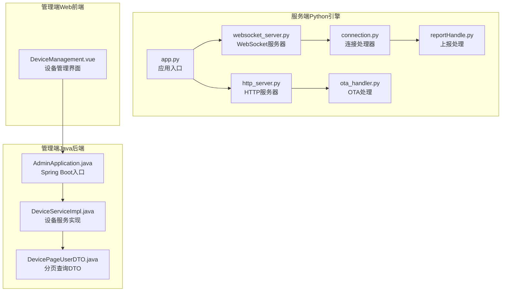
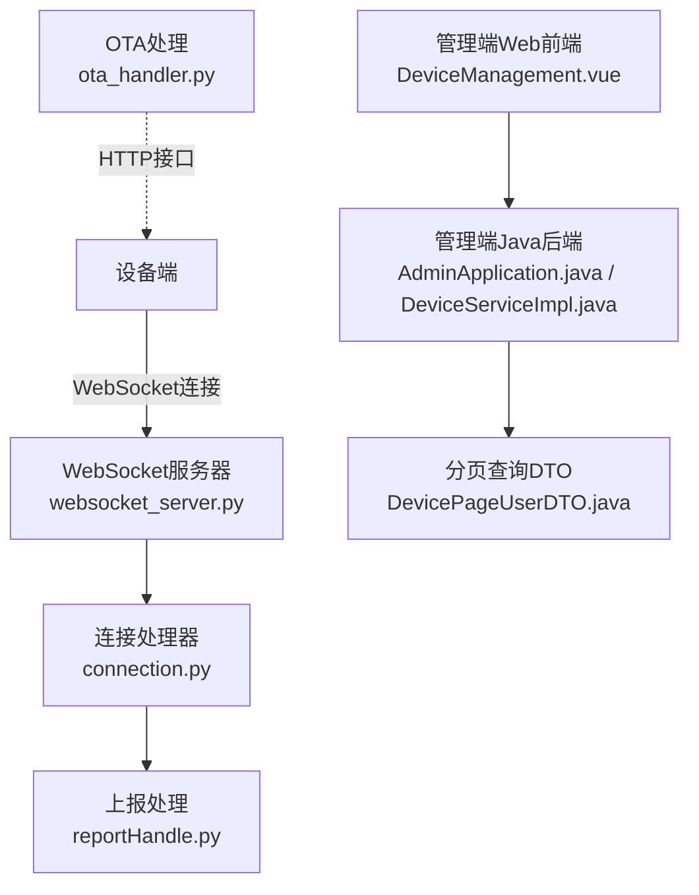
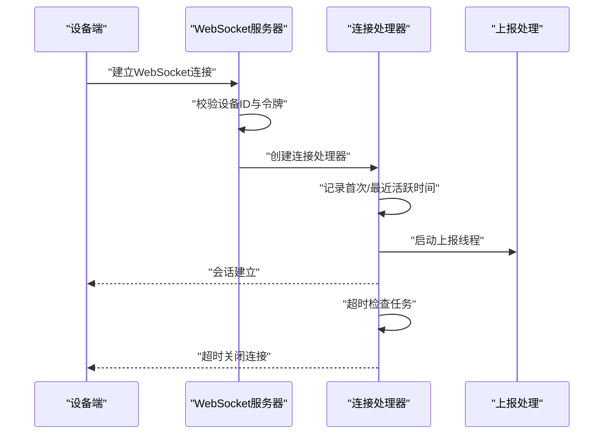
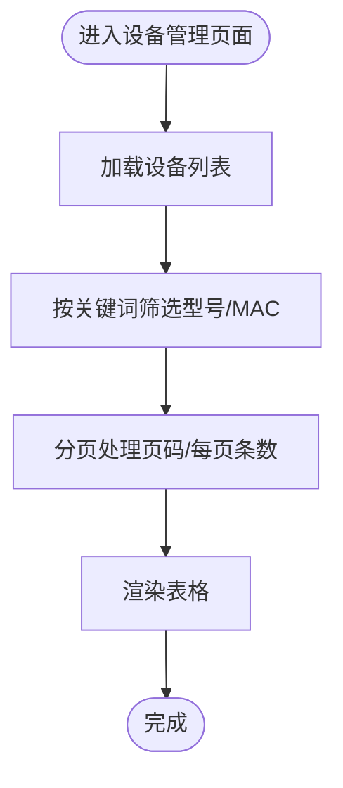
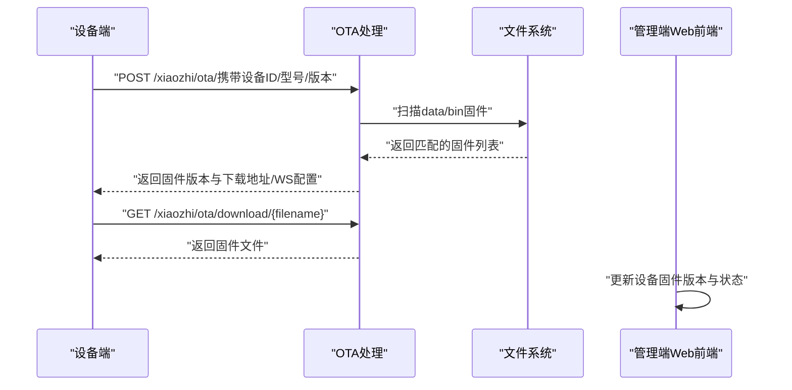
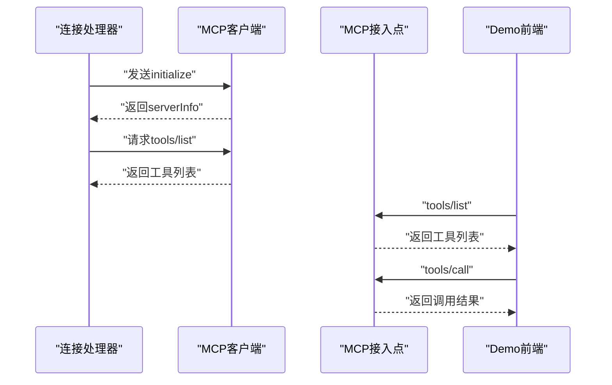
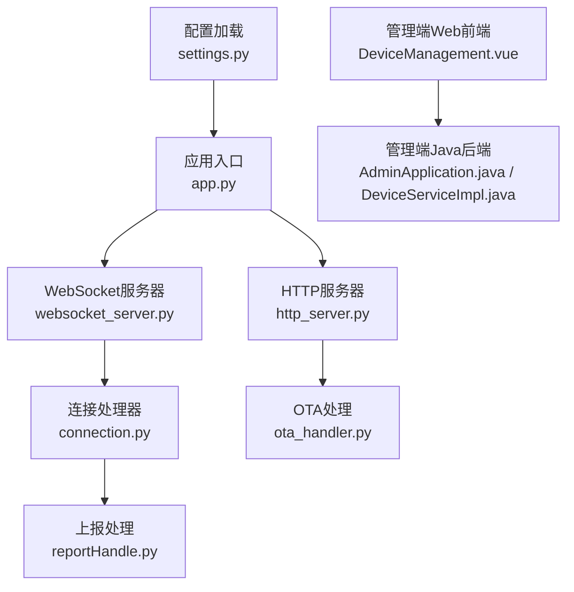

# 设备状态监控

<cite>
**本文档引用的文件**
- [app.py](file://main/xiaozhi-server/app.py)
- [http_server.py](file://main/xiaozhi-server/core/http_server.py)
- [websocket_server.py](file://main/xiaozhi-server/core/websocket_server.py)
- [connection.py](file://main/xiaozhi-server/core/connection.py)
- [ota_handler.py](file://main/xiaozhi-server/core/api/ota_handler.py)
- [base_handler.py](file://main/xiaozhi-server/core/api/base_handler.py)
- [reportHandle.py](file://main/xiaozhi-server/core/handle/reportHandle.py)
- [settings.py](file://main/xiaozhi-server/config/settings.py)
- [DeviceManagement.vue](file://main/manager-web/src/views/DeviceManagement.vue)
- [DeviceServiceImpl.java](file://main/manager-api/src/main/java/xiaozhi/modules/device/service/impl/DeviceServiceImpl.java)
- [DevicePageUserDTO.java](file://main/manager-api/src/main/java/xiaozhi/modules/device/dto/DevicePageUserDTO.java)
- [AdminApplication.java](file://main/manager-api/src/main/java/xiaozhi/AdminApplication.java)
- [mcp_endpoint_handler.py](file://main/xiaozhi-server/core/providers/tools/mcp_endpoint/mcp_endpoint_handler.py)
- [mcp_handler.py](file://main/xiaozhi-server/core/providers/tools/device_mcp/mcp_handler.py)
- [websocket.js](file://main/demo-web/js/core/network/websocket.js)
</cite>

## 目录
1. [简介](#简介)
2. [项目结构](#项目结构)
3. [核心组件](#核心组件)
4. [架构总览](#架构总览)
5. [详细组件分析](#详细组件分析)
6. [依赖关系分析](#依赖关系分析)
7. [性能考虑](#性能考虑)
8. [故障排查指南](#故障排查指南)
9. [结论](#结论)
10. [附录](#附录)

## 简介
本文件面向设备状态监控功能，系统性阐述以下能力：
- 设备在线状态检测与健康检查机制
- 异常告警策略与阈值设定
- 分页查询设备列表、筛选与排序规则
- 设备OTA状态显示、升级进度与结果反馈
- MCP协议在设备监控中的应用、命令执行与状态回传
- 设备监控的完整API接口文档（状态查询、批量操作、实时通知）
- 离线处理、重连机制与数据缓存策略

## 项目结构
该系统由三层组成：
- 服务端Python引擎：负责WebSocket通信、OTA升级、MCP协议对接与设备状态上报
- 管理端Web前端：提供设备列表展示、分页筛选与状态查询
- 管理端Java后端：聚合设备状态、提供设备管理API与鉴权

**图表来源**
- [app.py:46-160](file://main/xiaozhi-server/app.py#L46-L160)
- [http_server.py:35-93](file://main/xiaozhi-server/core/http_server.py#L35-L93)
- [websocket_server.py:71-228](file://main/xiaozhi-server/core/websocket_server.py#L71-L228)
- [connection.py:193-800](file://main/xiaozhi-server/core/connection.py#L193-L800)
- [ota_handler.py:143-416](file://main/xiaozhi-server/core/api/ota_handler.py#L143-L416)
- [reportHandle.py:25-201](file://main/xiaozhi-server/core/handle/reportHandle.py#L25-L201)
- [DeviceManagement.vue:135-242](file://main/manager-web/src/views/DeviceManagement.vue#L135-L242)
- [AdminApplication.java:6-13](file://main/manager-api/src/main/java/xiaozhi/AdminApplication.java#L6-L13)
- [DeviceServiceImpl.java:157-184](file://main/manager-api/src/main/java/xiaozhi/modules/device/service/impl/DeviceServiceImpl.java#L157-L184)
- [DevicePageUserDTO.java:13-27](file://main/manager-api/src/main/java/xiaozhi/modules/device/dto/DevicePageUserDTO.java#L13-L27)

**章节来源**
- [app.py:46-160](file://main/xiaozhi-server/app.py#L46-L160)
- [http_server.py:35-93](file://main/xiaozhi-server/core/http_server.py#L35-L93)
- [websocket_server.py:71-228](file://main/xiaozhi-server/core/websocket_server.py#L71-L228)
- [connection.py:193-800](file://main/xiaozhi-server/core/connection.py#L193-L800)
- [ota_handler.py:143-416](file://main/xiaozhi-server/core/api/ota_handler.py#L143-L416)
- [reportHandle.py:25-201](file://main/xiaozhi-server/core/handle/reportHandle.py#L25-L201)
- [DeviceManagement.vue:135-242](file://main/manager-web/src/views/DeviceManagement.vue#L135-L242)
- [AdminApplication.java:6-13](file://main/manager-api/src/main/java/xiaozhi/AdminApplication.java#L6-L13)
- [DeviceServiceImpl.java:157-184](file://main/manager-api/src/main/java/xiaozhi/modules/device/service/impl/DeviceServiceImpl.java#L157-L184)
- [DevicePageUserDTO.java:13-27](file://main/manager-api/src/main/java/xiaozhi/modules/device/dto/DevicePageUserDTO.java#L13-L27)

## 核心组件
- 应用入口与服务编排：负责启动HTTP与WebSocket服务、配置加载与日志初始化
- WebSocket服务器：统一处理设备连接、鉴权、配置更新与消息路由
- 连接处理器：维护设备会话状态、音频缓冲、超时控制与上报线程
- OTA处理：设备固件版本比对、下载地址下发与MQTT/WebSocket配置下发
- 上报处理：将TTS/ASR/工具调用等数据异步上报至管理端
- 管理端Web前端：设备列表分页、筛选、状态查询与交互
- 管理端Java后端：聚合设备状态、提供设备管理API与鉴权

**章节来源**
- [app.py:46-160](file://main/xiaozhi-server/app.py#L46-L160)
- [websocket_server.py:71-228](file://main/xiaozhi-server/core/websocket_server.py#L71-L228)
- [connection.py:193-800](file://main/xiaozhi-server/core/connection.py#L193-L800)
- [ota_handler.py:143-416](file://main/xiaozhi-server/core/api/ota_handler.py#L143-L416)
- [reportHandle.py:25-201](file://main/xiaozhi-server/core/handle/reportHandle.py#L25-L201)
- [DeviceManagement.vue:135-242](file://main/manager-web/src/views/DeviceManagement.vue#L135-L242)
- [AdminApplication.java:6-13](file://main/manager-api/src/main/java/xiaozhi/AdminApplication.java#L6-L13)

## 架构总览
系统采用“服务端引擎 + 管理端Web + 管理端Java后端”的三层架构。设备通过WebSocket与服务端建立长连接，服务端负责状态上报、OTA升级与MCP协议交互；管理端Web前端负责展示与交互，Java后端负责聚合与鉴权。

**图表来源**
- [websocket_server.py:71-228](file://main/xiaozhi-server/core/websocket_server.py#L71-L228)
- [connection.py:193-800](file://main/xiaozhi-server/core/connection.py#L193-L800)
- [ota_handler.py:143-416](file://main/xiaozhi-server/core/api/ota_handler.py#L143-L416)
- [reportHandle.py:25-201](file://main/xiaozhi-server/core/handle/reportHandle.py#L25-L201)
- [DeviceManagement.vue:135-242](file://main/manager-web/src/views/DeviceManagement.vue#L135-L242)
- [AdminApplication.java:6-13](file://main/manager-api/src/main/java/xiaozhi/AdminApplication.java#L6-L13)
- [DeviceServiceImpl.java:157-184](file://main/manager-api/src/main/java/xiaozhi/modules/device/service/impl/DeviceServiceImpl.java#L157-L184)
- [DevicePageUserDTO.java:13-27](file://main/manager-api/src/main/java/xiaozhi/modules/device/dto/DevicePageUserDTO.java#L13-L27)

## 详细组件分析

### 设备在线状态检测与健康检查
- 连接建立与鉴权：WebSocket服务器在握手阶段读取请求头中的设备标识与令牌，支持白名单直通与JWT校验
- 活跃时间戳：连接建立时记录首次与最近活跃时间，用于超时判断
- 超时关闭：基于配置的超时阈值进行两阶段关闭，避免误判
- 状态上报：连接处理器维护上报线程，将TTS/ASR/工具调用等数据异步上报

**图表来源**
- [websocket_server.py:206-228](file://main/xiaozhi-server/core/websocket_server.py#L206-L228)
- [connection.py:222-264](file://main/xiaozhi-server/core/connection.py#L222-L264)
- [reportHandle.py:108-134](file://main/xiaozhi-server/core/handle/reportHandle.py#L108-L134)

**章节来源**
- [websocket_server.py:206-228](file://main/xiaozhi-server/core/websocket_server.py#L206-L228)
- [connection.py:222-264](file://main/xiaozhi-server/core/connection.py#L222-L264)
- [reportHandle.py:108-134](file://main/xiaozhi-server/core/handle/reportHandle.py#L108-L134)

### 异常告警机制与阈值设置
- 超时阈值：通过配置项控制无语音超时时间，结合第二道关闭阈值形成双层保护
- 异常日志：统一的日志记录与过滤，便于定位问题
- 建议阈值：
  - 无语音超时：根据业务场景设置（例如120秒）
  - 第二道关闭延时：在第一道基础上增加60秒
  - 上报失败重试：上报线程内部捕获异常并记录，避免影响主流程

**章节来源**
- [connection.py:179-182](file://main/xiaozhi-server/core/connection.py#L179-L182)
- [websocket_server.py:8-31](file://main/xiaozhi-server/core/websocket_server.py#L8-L31)

### 分页查询设备列表、筛选与排序
- 前端分页：每页条目数与当前页码由组件状态维护，支持切换页大小
- 筛选规则：按设备型号与MAC地址进行关键字模糊匹配
- 排序规则：前端未实现排序，当前按设备列表顺序展示
- 后端分页：Java后端提供分页查询DTO，包含关键词、页数与限制条数

**图表来源**
- [DeviceManagement.vue:161-197](file://main/manager-web/src/views/DeviceManagement.vue#L161-L197)
- [DevicePageUserDTO.java:13-27](file://main/manager-api/src/main/java/xiaozhi/modules/device/dto/DevicePageUserDTO.java#L13-L27)

**章节来源**
- [DeviceManagement.vue:161-197](file://main/manager-web/src/views/DeviceManagement.vue#L161-L197)
- [DevicePageUserDTO.java:13-27](file://main/manager-api/src/main/java/xiaozhi/modules/device/dto/DevicePageUserDTO.java#L13-L27)

### 设备OTA状态显示、升级进度与结果反馈
- 固件版本比对：服务端扫描data/bin目录，按模型与版本降序匹配更高版本
- 下发配置：若配置MQTT网关则下发MQTT参数，否则下发WebSocket地址与令牌
- 下载地址：通过HTTP接口生成下载链接，限制仅允许下载bin目录内文件
- 前端反馈：管理端Web前端根据接口返回更新设备状态与固件版本

**图表来源**
- [ota_handler.py:143-416](file://main/xiaozhi-server/core/api/ota_handler.py#L143-L416)
- [DeviceManagement.vue:400-453](file://main/manager-web/src/views/DeviceManagement.vue#L400-L453)

**章节来源**
- [ota_handler.py:143-416](file://main/xiaozhi-server/core/api/ota_handler.py#L143-L416)
- [DeviceManagement.vue:400-453](file://main/manager-web/src/views/DeviceManagement.vue#L400-L453)

### MCP协议在设备监控中的应用
- 客户端MCP：连接处理器负责初始化MCP、请求工具列表并处理工具调用响应
- 接入点MCP：服务端与外部MCP接入点建立连接，获取工具清单并刷新函数缓存
- 前端MCP：Demo前端实现tools/list与tools/call的回传与执行

**图表来源**
- [mcp_handler.py:103-171](file://main/xiaozhi-server/core/providers/tools/device_mcp/mcp_handler.py#L103-L171)
- [mcp_endpoint_handler.py:224-244](file://main/xiaozhi-server/core/providers/tools/mcp_endpoint/mcp_endpoint_handler.py#L224-L244)
- [websocket.js:248-289](file://main/demo-web/js/core/network/websocket.js#L248-L289)

**章节来源**
- [mcp_handler.py:103-171](file://main/xiaozhi-server/core/providers/tools/device_mcp/mcp_handler.py#L103-L171)
- [mcp_endpoint_handler.py:75-244](file://main/xiaozhi-server/core/providers/tools/mcp_endpoint/mcp_endpoint_handler.py#L75-L244)
- [websocket.js:248-289](file://main/demo-web/js/core/network/websocket.js#L248-L289)

### 设备监控API接口文档
- OTA接口
  - GET /xiaozhi/ota/：健康检查，返回WebSocket地址
  - POST /xiaozhi/ota/：查询固件更新，返回下载地址或WebSocket配置
  - GET /xiaozhi/ota/download/{filename}：下载固件（仅限bin目录）
- 视觉分析接口
  - GET/POST /mcp/vision/explain：视觉分析服务（CORS已配置）
- 设备状态查询（Java后端）
  - 聚合设备状态：通过MQTT网关API获取设备在线状态映射
  - 分页查询：DevicePageUserDTO定义关键词、页数与限制条数

**章节来源**
- [http_server.py:35-93](file://main/xiaozhi-server/core/http_server.py#L35-L93)
- [base_handler.py:10-25](file://main/xiaozhi-server/core/api/base_handler.py#L10-L25)
- [DeviceServiceImpl.java:157-184](file://main/manager-api/src/main/java/xiaozhi/modules/device/service/impl/DeviceServiceImpl.java#L157-L184)
- [DevicePageUserDTO.java:13-27](file://main/manager-api/src/main/java/xiaozhi/modules/device/dto/DevicePageUserDTO.java#L13-L27)

### 离线处理、重连机制与数据缓存策略
- 离线处理：连接断开时记录日志并清理资源，必要时强制关闭连接
- 重连机制：设备端应具备自动重连策略（建议在设备端实现指数退避与心跳保活）
- 数据缓存：OTA固件缓存按模型维护版本列表，支持TTL控制；配置更新通过异步接口拉取

**章节来源**
- [connection.py:252-264](file://main/xiaozhi-server/core/connection.py#L252-L264)
- [ota_handler.py:66-104](file://main/xiaozhi-server/core/api/ota_handler.py#L66-L104)

## 依赖关系分析
- 服务端引擎依赖配置加载与日志系统，WebSocket与HTTP服务相互独立但共享配置
- 连接处理器依赖上报线程与各模块初始化，负责会话生命周期管理
- 管理端Web前端依赖Java后端提供的设备状态接口，后端通过MQTT网关聚合状态

**图表来源**
- [settings.py:9-34](file://main/xiaozhi-server/config/settings.py#L9-L34)
- [app.py:46-160](file://main/xiaozhi-server/app.py#L46-L160)
- [http_server.py:35-93](file://main/xiaozhi-server/core/http_server.py#L35-L93)
- [websocket_server.py:71-228](file://main/xiaozhi-server/core/websocket_server.py#L71-L228)
- [connection.py:193-800](file://main/xiaozhi-server/core/connection.py#L193-L800)
- [ota_handler.py:143-416](file://main/xiaozhi-server/core/api/ota_handler.py#L143-L416)
- [reportHandle.py:25-201](file://main/xiaozhi-server/core/handle/reportHandle.py#L25-L201)
- [DeviceManagement.vue:135-242](file://main/manager-web/src/views/DeviceManagement.vue#L135-L242)
- [AdminApplication.java:6-13](file://main/manager-api/src/main/java/xiaozhi/AdminApplication.java#L6-L13)

**章节来源**
- [settings.py:9-34](file://main/xiaozhi-server/config/settings.py#L9-L34)
- [app.py:46-160](file://main/xiaozhi-server/app.py#L46-L160)
- [http_server.py:35-93](file://main/xiaozhi-server/core/http_server.py#L35-L93)
- [websocket_server.py:71-228](file://main/xiaozhi-server/core/websocket_server.py#L71-L228)
- [connection.py:193-800](file://main/xiaozhi-server/core/connection.py#L193-L800)
- [ota_handler.py:143-416](file://main/xiaozhi-server/core/api/ota_handler.py#L143-L416)
- [reportHandle.py:25-201](file://main/xiaozhi-server/core/handle/reportHandle.py#L25-L201)
- [DeviceManagement.vue:135-242](file://main/manager-web/src/views/DeviceManagement.vue#L135-L242)
- [AdminApplication.java:6-13](file://main/manager-api/src/main/java/xiaozhi/AdminApplication.java#L6-L13)

## 性能考虑
- 异步I/O：WebSocket与HTTP均采用异步处理，避免阻塞主线程
- 上报异步化：上报线程与主循环解耦，降低对实时性的干扰
- 缓存策略：OTA固件缓存与配置更新采用TTL控制，减少重复扫描与网络请求
- 资源清理：连接断开时及时释放解码器与线程资源，防止内存泄漏

## 故障排查指南
- WebSocket连接失败：检查设备ID与令牌是否正确，确认端口与地址配置
- OTA下载失败：确认文件名符合安全模式，路径位于bin目录内
- 状态查询异常：检查MQTT网关地址配置与接口可达性
- 日志定位：关注WebSocket握手过滤日志与异常堆栈输出

**章节来源**
- [websocket_server.py:8-31](file://main/xiaozhi-server/core/websocket_server.py#L8-L31)
- [ota_handler.py:372-416](file://main/xiaozhi-server/core/api/ota_handler.py#L372-L416)
- [DeviceServiceImpl.java:157-184](file://main/manager-api/src/main/java/xiaozhi/modules/device/service/impl/DeviceServiceImpl.java#L157-L184)

## 结论
本系统通过WebSocket长连接、OTA升级与MCP协议实现了设备状态的实时监控与管理。前端提供分页与筛选能力，后端聚合设备状态并提供鉴权保障。通过合理的超时与重连策略、异步上报与缓存机制，系统在保证实时性的同时兼顾稳定性与可扩展性。

## 附录
- 配置文件检查：确保存在data/.config.yaml并正确配置
- CORS配置：HTTP处理器已添加CORS头，便于跨域访问
- 实时通知：通过WebSocket推送状态变更与升级结果

**章节来源**
- [settings.py:9-34](file://main/xiaozhi-server/config/settings.py#L9-L34)
- [base_handler.py:10-25](file://main/xiaozhi-server/core/api/base_handler.py#L10-L25)