# 设备监控与管理

<cite>
**本文引用的文件**   
- [README.md](file://README.md)
- [app.py](file://main/xiaozhi-server/app.py)
- [websocket_server.py](file://main/xiaozhi-server/core/websocket_server.py)
- [connection.py](file://main/xiaozhi-server/core/connection.py)
- [http_server.py](file://main/xiaozhi-server/core/http_server.py)
- [reportHandle.py](file://main/xiaozhi-server/core/handle/reportHandle.py)
- [receiveAudioHandle.py](file://main/xiaozhi-server/core/handle/receiveAudioHandle.py)
- [sendAudioHandle.py](file://main/xiaozhi-server/core/handle/sendAudioHandle.py)
- [textMessageProcessor.py](file://main/xiaozhi-server/core/handle/textMessageProcessor.py)
- [textMessageType.py](file://main/xiaozhi-server/core/handle/textMessageType.py)
- [gc_manager.py](file://main/xiaozhi-server/core/utils/gc_manager.py)
- [current_time.py](file://main/xiaozhi-server/core/utils/current_time.py)
- [output_counter.py](file://main/xiaozhi-server/core/utils/output_counter.py)
- [manage_api_client.py](file://main/xiaozhi-server/config/manage_api_client.py)
- [DeviceManagement.vue](file://main/manager-web/src/views/DeviceManagement.vue)
- [device.js](file://main/manager-mobile/src/api/device/index.ts)
- [pages.json](file://main/manager-mobile/pages.json)
- [index-stream-integration.md](file://docs/index-stream-integration.md)
- [performance_tester.py](file://main/xiaozhi-server/performance_tester.py)
</cite>

## 目录
1. [简介](#简介)
2. [项目结构](#项目结构)
3. [核心组件](#核心组件)
4. [架构总览](#架构总览)
5. [详细组件分析](#详细组件分析)
6. [依赖关系分析](#依赖关系分析)
7. [性能考量](#性能考量)
8. [故障排查指南](#故障排查指南)
9. [结论](#结论)
10. [附录](#附录)

## 简介
本技术文档围绕“设备监控与管理”展开，聚焦于设备在线状态检测、资源使用统计与性能指标收集；设备分组管理、标签系统与搜索过滤；操作日志、审计与安全事件记录；实时监控面板、告警机制与故障诊断工具；以及设备生命周期管理、回收机制与数据清理策略。同时涵盖监控数据存储、历史数据分析与报表生成能力，并提供管理界面操作指南（批量操作、状态查看、问题排查）。

## 项目结构
本项目由多端组成：服务端（Python）、Web管理端（Vue）、移动端管理端（UniApp）及小程序等。设备侧通过WebSocket与服务端建立长连接，上报状态与媒体流；服务端负责会话编排、消息路由、指标采集与持久化；管理端提供可视化监控、设备管理与运维能力。

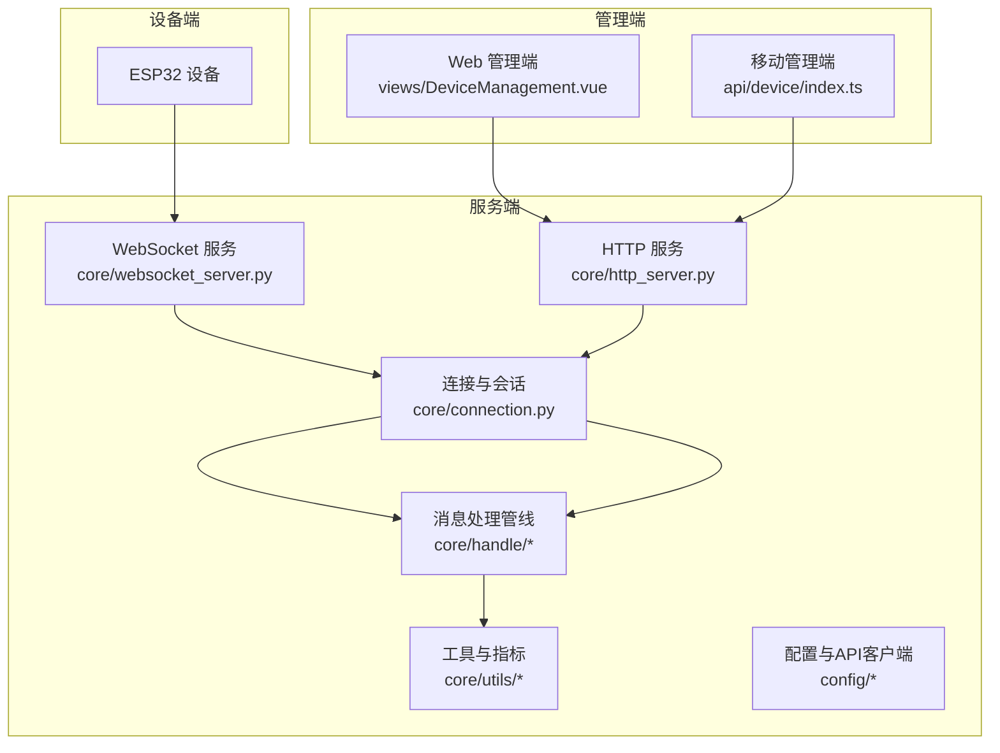

**图示来源** 
- [websocket_server.py](file://main/xiaozhi-server/core/websocket_server.py)
- [http_server.py](file://main/xiaozhi-server/core/http_server.py)
- [connection.py](file://main/xiaozhi-server/core/connection.py)
- [reportHandle.py](file://main/xiaozhi-server/core/handle/reportHandle.py)
- [receiveAudioHandle.py](file://main/xiaozhi-server/core/handle/receiveAudioHandle.py)
- [sendAudioHandle.py](file://main/xiaozhi-server/core/handle/sendAudioHandle.py)
- [textMessageProcessor.py](file://main/xiaozhi-server/core/handle/textMessageProcessor.py)
- [DeviceManagement.vue](file://main/manager-web/src/views/DeviceManagement.vue)
- [device.js](file://main/manager-mobile/src/api/device/index.ts)

**章节来源**
- [README.md](file://README.md)
- [index-stream-integration.md](file://docs/index-stream-integration.md)

## 核心组件
- WebSocket 服务：维护设备长连接、心跳与在线状态、消息分发与回写。
- 连接与会话：封装单设备上下文、生命周期、资源占用与指标聚合。
- 消息处理管线：音频接收/发送、文本消息处理、报告上报等。
- 工具与指标：时间戳、GC 管理、输出计数、当前时间等。
- 配置与外部接口：管理 API 客户端用于与后端管理服务交互。
- 管理端：Web 与移动端提供设备列表、状态查看、分组/标签、搜索过滤、批量操作、日志与审计、告警与报表。

**章节来源**
- [websocket_server.py](file://main/xiaozhi-server/core/websocket_server.py)
- [connection.py](file://main/xiaozhi-server/core/connection.py)
- [reportHandle.py](file://main/xiaozhi-server/core/handle/reportHandle.py)
- [receiveAudioHandle.py](file://main/xiaozhi-server/core/handle/receiveAudioHandle.py)
- [sendAudioHandle.py](file://main/xiaozhi-server/core/handle/sendAudioHandle.py)
- [textMessageProcessor.py](file://main/xiaozhi-server/core/handle/textMessageProcessor.py)
- [gc_manager.py](file://main/xiaozhi-server/core/utils/gc_manager.py)
- [current_time.py](file://main/xiaozhi-server/core/utils/current_time.py)
- [output_counter.py](file://main/xiaozhi-server/core/utils/output_counter.py)
- [manage_api_client.py](file://main/xiaozhi-server/config/manage_api_client.py)
- [DeviceManagement.vue](file://main/manager-web/src/views/DeviceManagement.vue)
- [device.js](file://main/manager-mobile/src/api/device/index.ts)

## 架构总览
系统采用“设备-服务端-管理端”三层架构。设备通过 WebSocket 接入，服务端进行会话编排与消息路由，管理端通过 HTTP 访问服务端的 REST 接口或内部服务接口，实现设备监控、分组、标签、搜索、日志审计、告警与报表等功能。

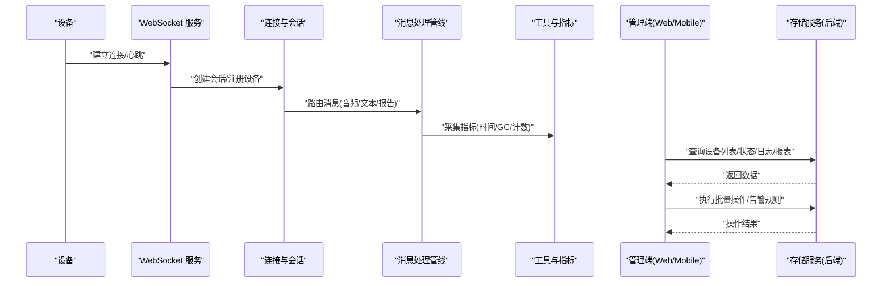

**图示来源** 
- [websocket_server.py](file://main/xiaozhi-server/core/websocket_server.py)
- [connection.py](file://main/xiaozhi-server/core/connection.py)
- [reportHandle.py](file://main/xiaozhi-server/core/handle/reportHandle.py)
- [receiveAudioHandle.py](file://main/xiaozhi-server/core/handle/receiveAudioHandle.py)
- [sendAudioHandle.py](file://main/xiaozhi-server/core/handle/sendAudioHandle.py)
- [textMessageProcessor.py](file://main/xiaozhi-server/core/handle/textMessageProcessor.py)
- [gc_manager.py](file://main/xiaozhi-server/core/utils/gc_manager.py)
- [current_time.py](file://main/xiaozhi-server/core/utils/current_time.py)
- [output_counter.py](file://main/xiaozhi-server/core/utils/output_counter.py)

## 详细组件分析

### 设备在线状态检测与心跳
- 设备首次连接时建立会话并注册到连接管理器；周期性心跳维持在线状态；超时未心跳则标记离线并触发回收流程。
- 心跳与状态更新由 WebSocket 服务与连接模块协作完成，确保高并发下的准确性与一致性。

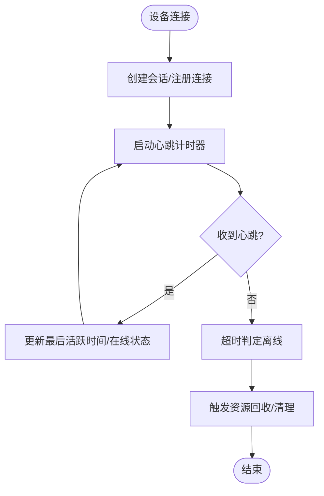

**图示来源** 
- [websocket_server.py](file://main/xiaozhi-server/core/websocket_server.py)
- [connection.py](file://main/xiaozhi-server/core/connection.py)

**章节来源**
- [websocket_server.py](file://main/xiaozhi-server/core/websocket_server.py)
- [connection.py](file://main/xiaozhi-server/core/connection.py)

### 资源使用统计与性能指标收集
- 指标维度包括：内存与GC行为、输出计数、时间戳精度、音频收发吞吐等。
- 工具层提供统一采集点，处理层在关键路径调用以聚合指标，便于后续分析与报表。

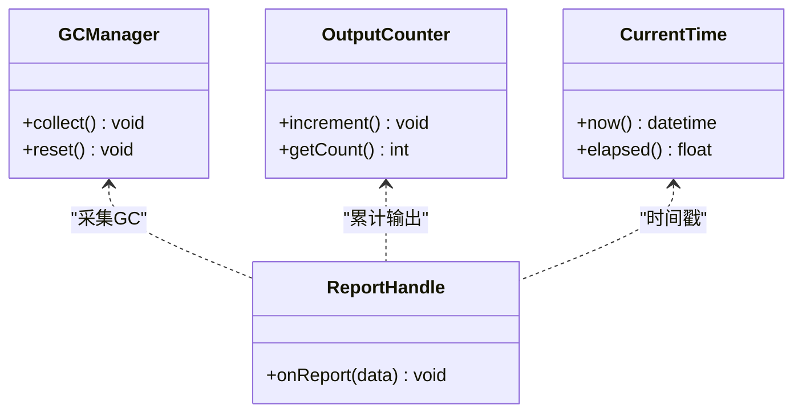

**图示来源** 
- [gc_manager.py](file://main/xiaozhi-server/core/utils/gc_manager.py)
- [output_counter.py](file://main/xiaozhi-server/core/utils/output_counter.py)
- [current_time.py](file://main/xiaozhi-server/core/utils/current_time.py)
- [reportHandle.py](file://main/xiaozhi-server/core/handle/reportHandle.py)

**章节来源**
- [gc_manager.py](file://main/xiaozhi-server/core/utils/gc_manager.py)
- [output_counter.py](file://main/xiaozhi-server/core/utils/output_counter.py)
- [current_time.py](file://main/xiaozhi-server/core/utils/current_time.py)
- [reportHandle.py](file://main/xiaozhi-server/core/handle/reportHandle.py)

### 音频流处理与实时性
- 接收音频处理：解码、VAD、ASR 流水线，缓冲与丢帧策略保障低延迟。
- 发送音频处理：TTS 合成、编码、网络传输与播放控制。
- 文本消息处理：意图识别、工具调用、对话状态管理。

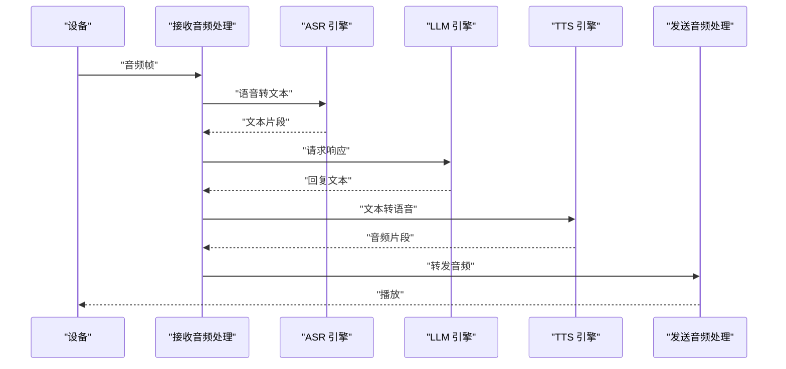

**图示来源** 
- [receiveAudioHandle.py](file://main/xiaozhi-server/core/handle/receiveAudioHandle.py)
- [sendAudioHandle.py](file://main/xiaozhi-server/core/handle/sendAudioHandle.py)
- [textMessageProcessor.py](file://main/xiaozhi-server/core/handle/textMessageProcessor.py)
- [textMessageType.py](file://main/xiaozhi-server/core/handle/textMessageType.py)

**章节来源**
- [receiveAudioHandle.py](file://main/xiaozhi-server/core/handle/receiveAudioHandle.py)
- [sendAudioHandle.py](file://main/xiaozhi-server/core/handle/sendAudioHandle.py)
- [textMessageProcessor.py](file://main/xiaozhi-server/core/handle/textMessageProcessor.py)
- [textMessageType.py](file://main/xiaozhi-server/core/handle/textMessageType.py)

### 设备分组管理、标签系统与搜索过滤
- 分组：按业务域或物理位置划分设备集合，支持层级与继承。
- 标签：键值对形式扩展设备属性，便于灵活分类与筛选。
- 搜索过滤：组合条件（名称、MAC、分组、标签、状态、时间范围）快速定位设备。

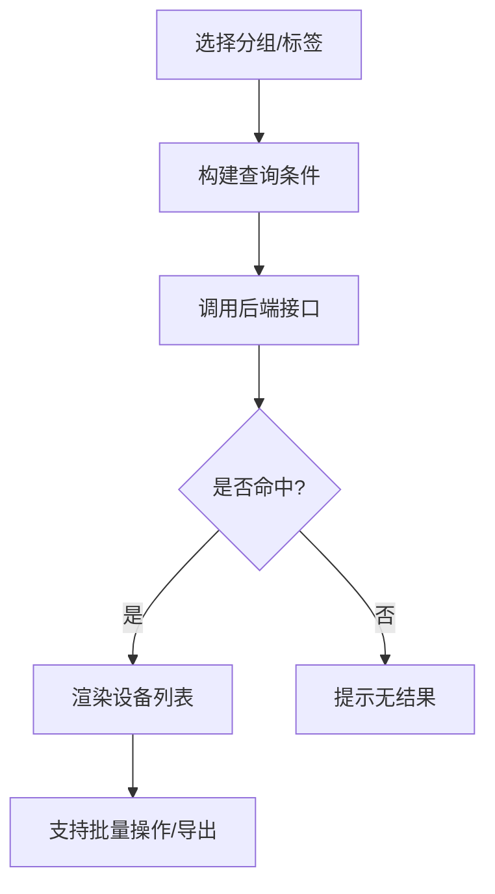

**图示来源** 
- [DeviceManagement.vue](file://main/manager-web/src/views/DeviceManagement.vue)
- [device.js](file://main/manager-mobile/src/api/device/index.ts)

**章节来源**
- [DeviceManagement.vue](file://main/manager-web/src/views/DeviceManagement.vue)
- [device.js](file://main/manager-mobile/src/api/device/index.ts)

### 操作日志、审计与安全事件记录
- 操作日志：记录管理员对设备的增删改查、批量操作、配置变更等。
- 审计：关联用户身份、时间戳、IP、操作结果，支持追溯与合规。
- 安全事件：异常登录、越权访问、设备异常行为（频繁断连、非法指令）记录与告警。

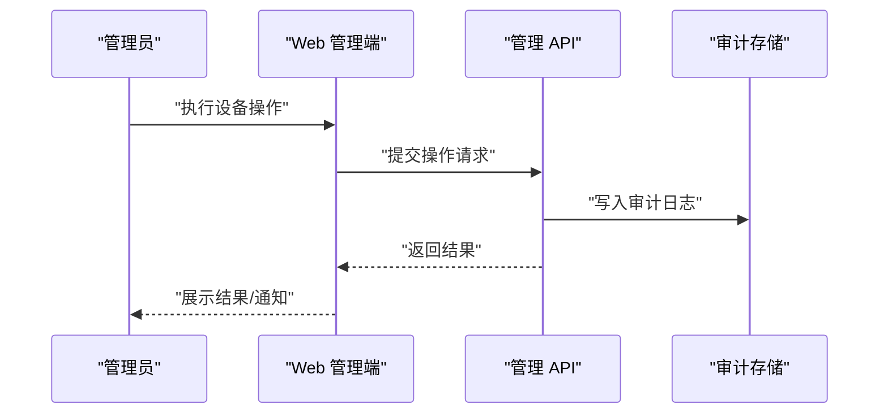

**图示来源** 
- [DeviceManagement.vue](file://main/manager-web/src/views/DeviceManagement.vue)
- [device.js](file://main/manager-mobile/src/api/device/index.ts)

**章节来源**
- [DeviceManagement.vue](file://main/manager-web/src/views/DeviceManagement.vue)
- [device.js](file://main/manager-mobile/src/api/device/index.ts)

### 实时监控面板、告警机制与故障诊断工具
- 实时监控：在线设备数、CPU/内存/网络吞吐、音频延迟、错误率等。
- 告警机制：阈值触发（如离线率、延迟过高、错误率飙升），多渠道通知（站内信、邮件、短信）。
- 故障诊断：连接质量分析、音频链路追踪、GC 压力测试、慢查询定位。

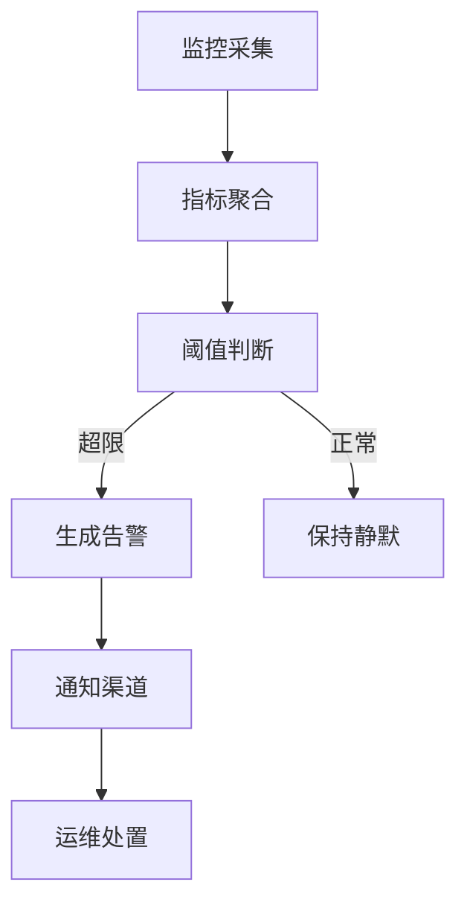

[此图为概念流程图，不直接映射具体源码文件]

### 设备生命周期管理、回收机制与数据清理策略
- 生命周期：注册→激活→运行→休眠→离线→注销。
- 回收机制：超时离线释放资源、清理缓存、断开媒体流。
- 数据清理：按策略归档历史数据、删除过期日志、压缩存储。

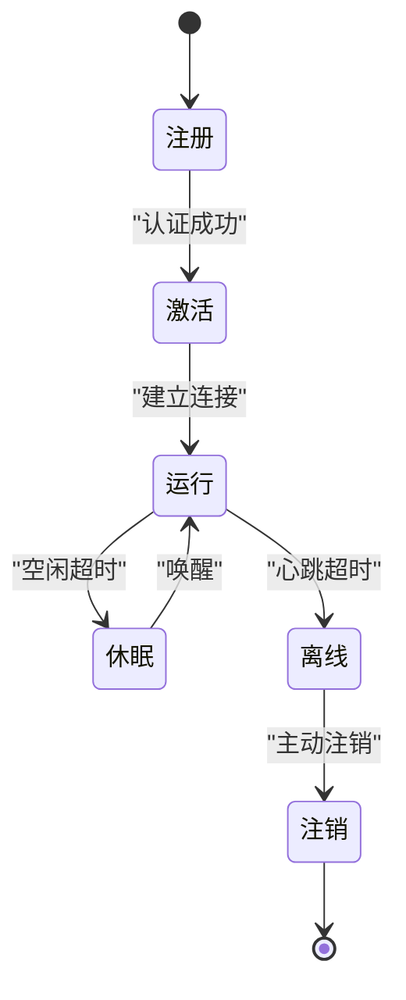

**图示来源** 
- [connection.py](file://main/xiaozhi-server/core/connection.py)
- [gc_manager.py](file://main/xiaozhi-server/core/utils/gc_manager.py)

**章节来源**
- [connection.py](file://main/xiaozhi-server/core/connection.py)
- [gc_manager.py](file://main/xiaozhi-server/core/utils/gc_manager.py)

### 监控数据存储、历史数据分析与报表生成
- 存储：时序数据库或对象存储，按设备ID与时间分区。
- 分析：滑动窗口统计、趋势分析、异常检测。
- 报表：日/周/月报，导出PDF/CSV，支持自定义维度。

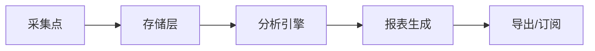

[此图为概念流程图，不直接映射具体源码文件]

## 依赖关系分析
- 服务端内部依赖：WebSocket 服务依赖连接与会话模块；消息处理管线依赖工具层；配置模块提供外部接口。
- 管理端依赖：Web 与移动端通过 HTTP 调用管理 API，获取设备状态、日志与报表。

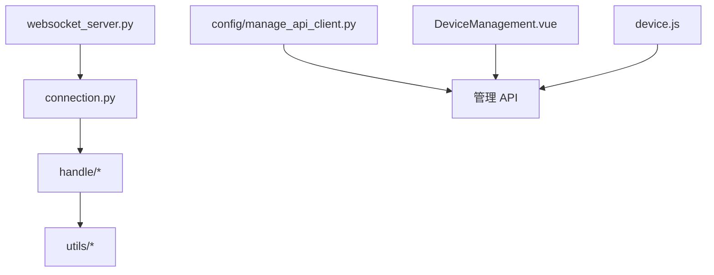

**图示来源** 
- [websocket_server.py](file://main/xiaozhi-server/core/websocket_server.py)
- [connection.py](file://main/xiaozhi-server/core/connection.py)
- [reportHandle.py](file://main/xiaozhi-server/core/handle/reportHandle.py)
- [receiveAudioHandle.py](file://main/xiaozhi-server/core/handle/receiveAudioHandle.py)
- [sendAudioHandle.py](file://main/xiaozhi-server/core/handle/sendAudioHandle.py)
- [textMessageProcessor.py](file://main/xiaozhi-server/core/handle/textMessageProcessor.py)
- [gc_manager.py](file://main/xiaozhi-server/core/utils/gc_manager.py)
- [current_time.py](file://main/xiaozhi-server/core/utils/current_time.py)
- [output_counter.py](file://main/xiaozhi-server/core/utils/output_counter.py)
- [manage_api_client.py](file://main/xiaozhi-server/config/manage_api_client.py)
- [DeviceManagement.vue](file://main/manager-web/src/views/DeviceManagement.vue)
- [device.js](file://main/manager-mobile/src/api/device/index.ts)

**章节来源**
- [websocket_server.py](file://main/xiaozhi-server/core/websocket_server.py)
- [connection.py](file://main/xiaozhi-server/core/connection.py)
- [manage_api_client.py](file://main/xiaozhi-server/config/manage_api_client.py)
- [DeviceManagement.vue](file://main/manager-web/src/views/DeviceManagement.vue)
- [device.js](file://main/manager-mobile/src/api/device/index.ts)

## 性能考量
- 连接与消息：使用非阻塞 I/O、连接池、批处理与背压控制，避免热点设备拖垮整体。
- 音频流：合理缓冲与丢帧策略，降低延迟与抖动；编码参数动态调整。
- 指标采集：轻量级计数器与采样，避免高频锁竞争；异步落盘。
- 存储与分析：分区与索引优化，冷热数据分离，增量计算与物化视图。

[本节为通用指导，不直接分析具体文件]

## 故障排查指南
- 连接问题：检查心跳间隔、超时阈值、防火墙与代理设置；查看连接日志与重连次数。
- 音频问题：确认编解码一致、网络带宽与丢包率；观察音频链路各阶段耗时。
- 指标异常：关注 GC 频率与停顿、内存峰值、CPU 使用率；定位慢查询与热点代码。
- 管理端问题：核对权限与鉴权、接口返回码与错误信息；查看浏览器控制台与移动端日志。

**章节来源**
- [websocket_server.py](file://main/xiaozhi-server/core/websocket_server.py)
- [connection.py](file://main/xiaozhi-server/core/connection.py)
- [receiveAudioHandle.py](file://main/xiaozhi-server/core/handle/receiveAudioHandle.py)
- [sendAudioHandle.py](file://main/xiaozhi-server/core/handle/sendAudioHandle.py)
- [gc_manager.py](file://main/xiaozhi-server/core/utils/gc_manager.py)
- [output_counter.py](file://main/xiaozhi-server/core/utils/output_counter.py)

## 结论
本方案以 WebSocket 长连接为核心，结合完善的消息处理管线与工具层指标采集，构建了覆盖设备在线状态、资源统计、性能指标、分组标签、搜索过滤、日志审计、告警与报表的完整设备监控与管理体系。通过分层架构与模块化设计，系统具备良好的可扩展性与可维护性，适用于大规模设备场景。

[本节为总结，不直接分析具体文件]

## 附录
- 管理界面操作指南（概览）
  - 设备列表与状态查看：进入设备管理页面，按分组/标签筛选，查看在线/离线状态与基础信息。
  - 批量操作：勾选多个设备，执行批量重启、配置下发、固件升级等操作。
  - 搜索过滤：组合关键词与条件快速定位目标设备。
  - 日志与审计：查看操作日志、安全事件与设备运行日志，支持导出。
  - 告警与报表：配置阈值与通知渠道，生成并导出报表。
- 性能测试工具：使用性能测试脚本进行端到端压测与瓶颈定位。

**章节来源**
- [DeviceManagement.vue](file://main/manager-web/src/views/DeviceManagement.vue)
- [device.js](file://main/manager-mobile/src/api/device/index.ts)
- [performance_tester.py](file://main/xiaozhi-server/performance_tester.py)