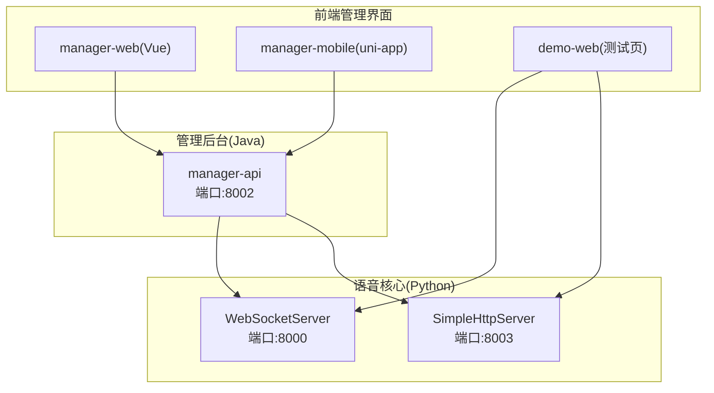
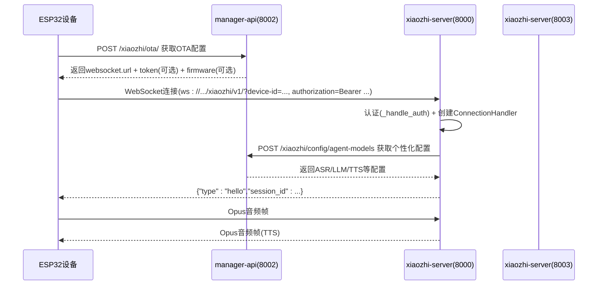
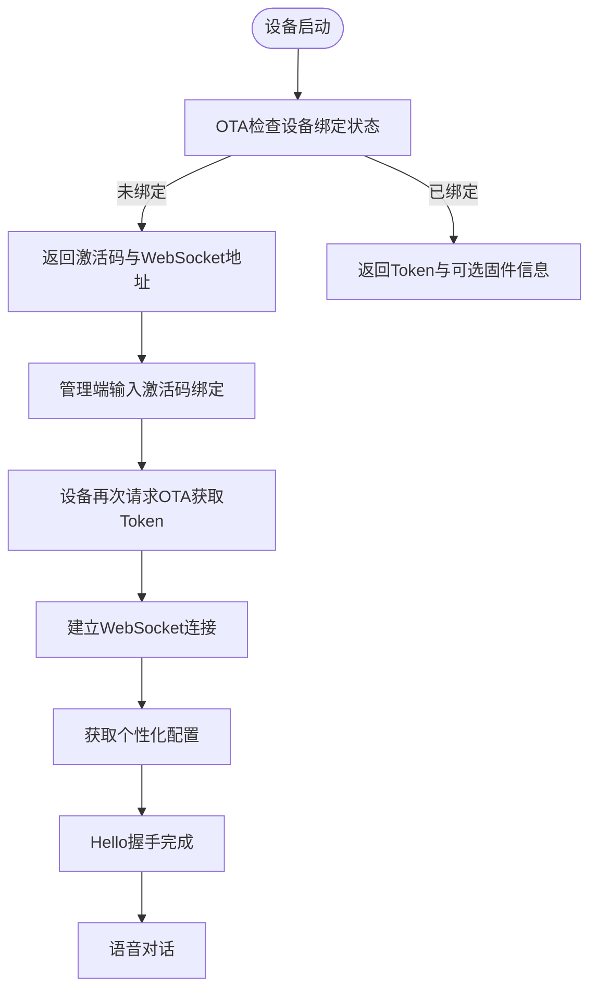
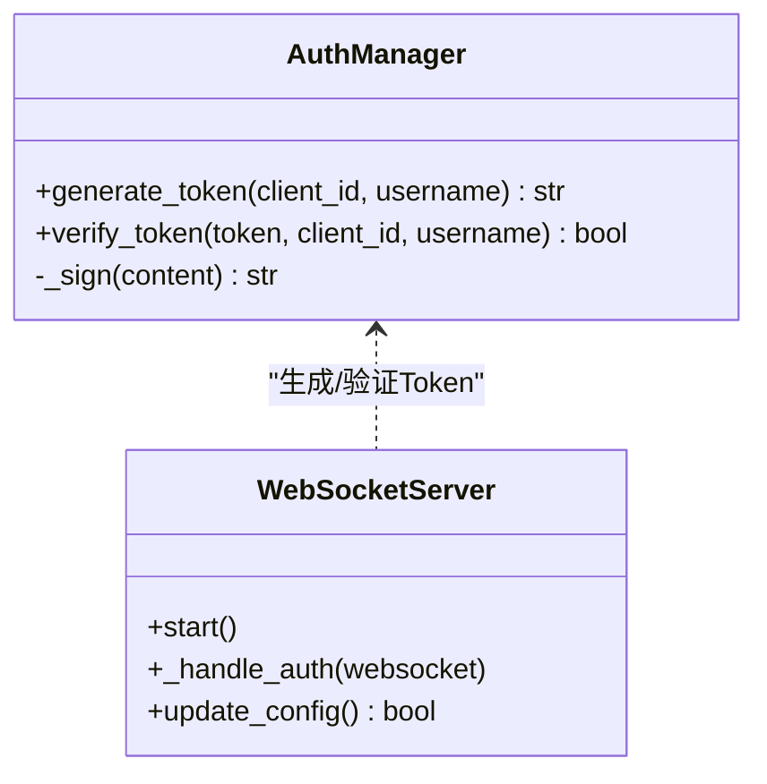
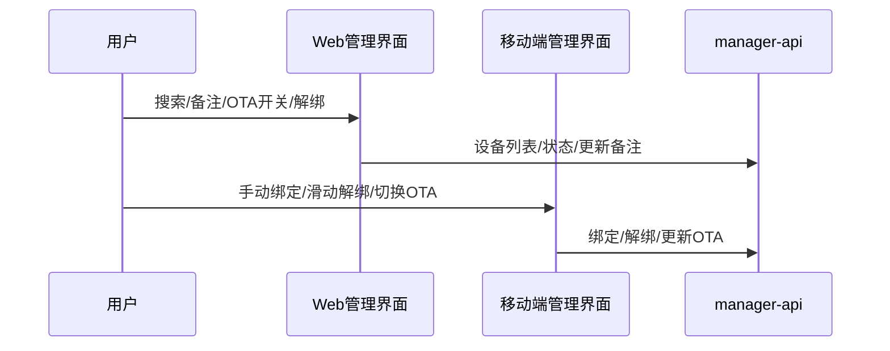
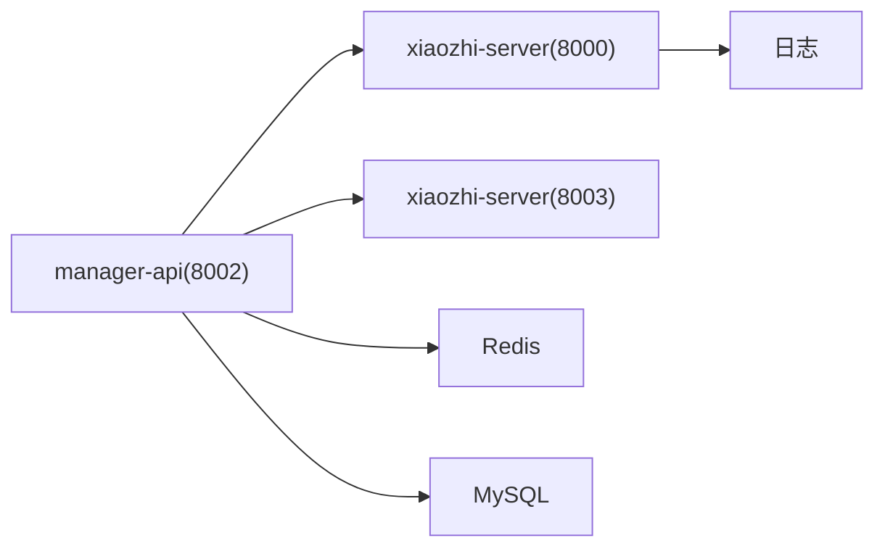

# 设备管理

<cite>
**本文引用的文件**   
- [app.py](file://main/xiaozhi-server/app.py)
- [WebSocketServer](file://main/xiaozhi-server/core/websocket_server.py)
- [SimpleHttpServer](file://main/xiaozhi-server/core/http_server.py)
- [AuthManager](file://main/xiaozhi-server/core/auth.py)
- [device-onboarding-flow.md](file://main/xiaozhi-server/docs/device/device-onboarding-flow.md)
- [device-api-reference.md](file://main/xiaozhi-server/docs/device/device-api-reference.md)
- [DeviceManagement.vue](file://main/manager-web/src/views/DeviceManagement.vue)
- [index.vue](file://main/manager-mobile/src/pages/device/index.vue)
- [AdminApplication.java](file://main/manager-api/src/main/java/xiaozhi/AdminApplication.java)
- [application.yml](file://main/manager-api/src/main/resources/application.yml)
- [index.html](file://main/demo-web/index.html)
</cite>

## 目录
1. [简介](#简介)
2. [项目结构](#项目结构)
3. [核心组件](#核心组件)
4. [架构总览](#架构总览)
5. [详细组件分析](#详细组件分析)
6. [依赖分析](#依赖分析)
7. [性能考虑](#性能考虑)
8. [故障排查指南](#故障排查指南)
9. [结论](#结论)
10. [附录](#附录)

## 简介
本文件面向“小智ESP32服务器”的设备管理系统，系统由“管理后台 + 语音核心”双服务构成，覆盖设备注册与绑定、生命周期管理、状态监控、权限与认证、通信协议与OTA升级、管理界面交互与最佳实践等内容。文档以仓库现有实现与文档为依据，结合可视化图示帮助读者快速理解并高效运维。

## 项目结构
- 服务划分
  - 管理后台（Java Spring Boot，端口8002）：负责设备管理、OTA配置下发、用户绑定、个性化配置组装。
  - 语音核心（Python，端口8000/8003）：负责WebSocket实时音频对话、HTTP OTA与视觉分析接口。
- 前端管理界面
  - Web端（Vue）与移动端（uni-app）：提供设备列表、绑定、备注、OTA开关、状态查看等管理能力。
- 测试与演示
  - demo-web提供WebSocket测试页面，便于联调与验证。

**图表来源**
- [app.py:46-130](file://main/xiaozhi-server/app.py#L46-L130)
- [WebSocketServer:71-79](file://main/xiaozhi-server/core/websocket_server.py#L71-L79)
- [SimpleHttpServer:35-86](file://main/xiaozhi-server/core/http_server.py#L35-L86)
- [AdminApplication.java:9-12](file://main/manager-api/src/main/java/xiaozhi/AdminApplication.java#L9-L12)

**章节来源**
- [app.py:46-130](file://main/xiaozhi-server/app.py#L46-L130)
- [AdminApplication.java:9-12](file://main/manager-api/src/main/java/xiaozhi/AdminApplication.java#L9-L12)

## 核心组件
- WebSocketServer：负责WebSocket连接接入、认证、配置加载与消息路由。
- SimpleHttpServer：提供OTA与视觉分析HTTP接口（单模块模式下还提供OTA下载）。
- AuthManager：基于HMAC-SHA256的Token生成与验证，支持过期时间控制。
- 管理端设备管理界面：提供设备列表、搜索、备注、批量解绑、OTA开关、状态刷新等。
- 设备接入流程文档：定义了从OTA配置到绑定、认证、Hello握手与语音对话的完整链路。

**章节来源**
- [WebSocketServer:42-131](file://main/xiaozhi-server/core/websocket_server.py#L42-L131)
- [SimpleHttpServer:10-93](file://main/xiaozhi-server/core/http_server.py#L10-L93)
- [AuthManager:13-73](file://main/xiaozhi-server/core/auth.py#L13-L73)
- [DeviceManagement.vue:128-494](file://main/manager-web/src/views/DeviceManagement.vue#L128-L494)
- [index.vue:1-632](file://main/manager-mobile/src/pages/device/index.vue#L1-L632)

## 架构总览
系统采用“管理后台 + 语音核心”的双服务模式，设备通过OTA接口获取WebSocket地址与Token，随后建立WebSocket连接并完成个性化配置加载与Hello握手，进入语音对话流程。管理端提供设备绑定、OTA开关、状态监控等功能。

**图表来源**
- [device-onboarding-flow.md:350-437](file://main/xiaozhi-server/docs/device/device-onboarding-flow.md#L350-L437)
- [device-api-reference.md:178-209](file://main/xiaozhi-server/docs/device/device-api-reference.md#L178-L209)
- [WebSocketServer:206-227](file://main/xiaozhi-server/core/websocket_server.py#L206-L227)

## 详细组件分析

### 设备注册与配置流程
- OTA阶段（智控台模式）
  - 设备首次请求OTA，返回激活码与WebSocket地址；绑定后再次请求OTA获取Token与固件信息。
- 绑定阶段（管理端）
  - 用户在Web/移动端输入激活码完成绑定，设备记录创建并可开启自动OTA。
- 配置加载阶段（WebSocket）
  - 连接后通过配置接口获取个性化AI配置，完成组件初始化与Hello握手。

**图表来源**
- [device-onboarding-flow.md:28-172](file://main/xiaozhi-server/docs/device/device-onboarding-flow.md#L28-L172)
- [device-api-reference.md:178-209](file://main/xiaozhi-server/docs/device/device-api-reference.md#L178-L209)

**章节来源**
- [device-onboarding-flow.md:28-172](file://main/xiaozhi-server/docs/device/device-onboarding-flow.md#L28-L172)
- [device-api-reference.md:178-209](file://main/xiaozhi-server/docs/device/device-api-reference.md#L178-L209)

### 设备生命周期管理
- 生命周期关键节点
  - 首次接入：OTA返回激活码，提示用户绑定。
  - 绑定完成：设备可获取Token与配置，进入可对话状态。
  - 运行中：心跳保活、音频对话、错误处理与断线重连策略。
  - 解绑/停用：管理端批量解绑，设备侧不再接收消息。
- 状态监控
  - Web端通过设备状态接口拉取MQTT状态映射，展示在线/离线。
  - 移动端展示最近连接时间与OTA开关。

**章节来源**
- [DeviceManagement.vue:364-461](file://main/manager-web/src/views/DeviceManagement.vue#L364-L461)
- [index.vue:100-120](file://main/manager-mobile/src/pages/device/index.vue#L100-L120)

### 设备状态监控与故障处理
- 状态来源
  - Web端：调用设备状态接口，解析MQTT客户端ID映射，判定在线/离线。
  - 移动端：展示最近连接时间与OTA开关。
- 故障处理
  - 认证失败：WebSocket返回“认证失败”，设备需重新获取Token。
  - 未绑定：消息被丢弃并周期性播放绑定提示。
  - 配置加载异常：等待或重试，直至配置可用。

**章节来源**
- [WebSocketServer:206-227](file://main/xiaozhi-server/core/websocket_server.py#L206-L227)
- [device-onboarding-flow.md:416-427](file://main/xiaozhi-server/docs/device/device-onboarding-flow.md#L416-L427)

### 用户权限管理、角色分配与访问控制
- 认证机制
  - Token生成：HMAC-SHA256签名，包含client_id、username(deviceId)、timestamp。
  - Token验证：校验签名与过期时间，支持白名单直通。
- 访问控制
  - WebSocket握手时校验Authorization头，必要时允许白名单设备免校验。
  - 管理端接口通过OAuth2 Token访问（登录后获取）。

**图表来源**
- [AuthManager:13-73](file://main/xiaozhi-server/core/auth.py#L13-L73)
- [WebSocketServer:206-227](file://main/xiaozhi-server/core/websocket_server.py#L206-L227)

**章节来源**
- [AuthManager:13-73](file://main/xiaozhi-server/core/auth.py#L13-L73)
- [WebSocketServer:63-69](file://main/xiaozhi-server/core/websocket_server.py#L63-L69)

### 设备与服务器通信协议、数据同步与OTA升级
- 通信协议
  - WebSocket：设备→服务器音频帧（Opus）、控制消息（JSON）。
  - HTTP：OTA配置、固件下载、视觉分析接口。
- 数据同步
  - 个性化配置通过配置接口按设备维度拉取，避免固件升级即可变更。
- OTA升级
  - 智控台模式：manager-api下发WebSocket地址与Token，支持激活码绑定与固件下载。
  - 单模块模式：xiaozhi-server提供OTA与固件下载接口。

**章节来源**
- [device-api-reference.md:218-332](file://main/xiaozhi-server/docs/device/device-api-reference.md#L218-L332)
- [SimpleHttpServer:35-86](file://main/xiaozhi-server/core/http_server.py#L35-L86)
- [device-onboarding-flow.md:174-347](file://main/xiaozhi-server/docs/device/device-onboarding-flow.md#L174-L347)

### 管理界面功能特性、用户交互与操作流程
- Web端（Vue）
  - 设备列表、搜索、备注编辑、OTA开关、批量解绑、分页与状态刷新。
  - 通过设备状态接口获取MQTT在线状态并展示。
- 移动端（uni-app）
  - 设备卡片列表、滑动解绑、手动绑定、OTA开关切换、时间格式化显示。
- 测试页（demo-web）
  - 提供WebSocket连接、录音、设置面板与OTA地址配置，便于联调。

**图表来源**
- [DeviceManagement.vue:128-494](file://main/manager-web/src/views/DeviceManagement.vue#L128-L494)
- [index.vue:1-632](file://main/manager-mobile/src/pages/device/index.vue#L1-L632)

**章节来源**
- [DeviceManagement.vue:128-494](file://main/manager-web/src/views/DeviceManagement.vue#L128-L494)
- [index.vue:1-632](file://main/manager-mobile/src/pages/device/index.vue#L1-L632)
- [index.html:1-399](file://main/demo-web/index.html#L1-L399)

## 依赖分析
- 服务间依赖
  - 管理后台提供OTA、绑定、配置接口；语音核心负责WebSocket与HTTP服务。
  - 设备侧依赖管理后台获取配置与Token，依赖语音核心进行实时对话。
- 关键外部依赖
  - Redis：激活码缓存。
  - MySQL：设备与用户关系持久化。
  - 日志与配置：统一的日志与配置加载机制。

**图表来源**
- [device-onboarding-flow.md:11-16](file://main/xiaozhi-server/docs/device/device-onboarding-flow.md#L11-L16)
- [app.py:46-130](file://main/xiaozhi-server/app.py#L46-L130)

**章节来源**
- [device-onboarding-flow.md:11-16](file://main/xiaozhi-server/docs/device/device-onboarding-flow.md#L11-L16)
- [app.py:46-130](file://main/xiaozhi-server/app.py#L46-L130)

## 性能考虑
- 并发与资源
  - WebSocketServer使用异步事件循环与后台任务并行初始化组件，避免阻塞消息处理。
  - 管理后台Tomcat线程池上限较高，适合高并发请求。
- 配置热更新
  - WebSocketServer支持异步获取新配置并重新初始化模块，降低停机风险。
- 日志与监控
  - 建议开启详细日志并按设备ID过滤，便于定位性能瓶颈。

**章节来源**
- [WebSocketServer:155-204](file://main/xiaozhi-server/core/websocket_server.py#L155-L204)
- [application.yml:1-66](file://main/manager-api/src/main/resources/application.yml#L1-L66)

## 故障排查指南
- 常见问题
  - 认证失败：检查Authorization头、Token签名与过期时间；确认白名单配置。
  - 未绑定：设备在WebSocket阶段会拒绝处理消息并提示绑定；需在管理端完成绑定。
  - 配置加载异常：检查配置接口返回与网络连通性；关注后台日志。
  - OTA失败：确认部署模式（智控台vs单模块），确保访问正确的端点。
- 调试工具
  - 浏览器测试页：用于验证WebSocket连接与基本交互。
  - 日志过滤：按设备ID与错误关键字过滤日志。
  - 抓包：使用Wireshark过滤WebSocket流量，定位协议层问题。

**章节来源**
- [device-onboarding-flow.md:482-497](file://main/xiaozhi-server/docs/device/device-onboarding-flow.md#L482-L497)
- [device-api-reference.md:376-408](file://main/xiaozhi-server/docs/device/device-api-reference.md#L376-L408)
- [index.html:1-399](file://main/demo-web/index.html#L1-L399)

## 结论
本系统通过清晰的服务边界与标准化的协议，实现了从设备接入、绑定、配置加载到实时对话的完整闭环。管理端提供直观的设备管理能力，语音核心保障低延迟的音频交互体验。建议在生产环境中完善监控与告警、强化认证与访问控制，并定期评估配置热更新与日志策略以提升稳定性与可观测性。

## 附录
- 最佳实践
  - 使用配置接口动态获取WebSocket地址，避免硬编码。
  - 合理设置Token过期时间与白名单策略。
  - 通过管理端开启/关闭设备自动OTA，确保固件版本可控。
- 常见问题
  - 激活码与验证码的区别：前者用于首次绑定，后者用于手动注册。
  - 多节点WebSocket地址：通过配置接口返回的地址进行负载均衡。

**章节来源**
- [device-onboarding-flow.md:482-497](file://main/xiaozhi-server/docs/device/device-onboarding-flow.md#L482-L497)
- [device-api-reference.md:17-17](file://main/xiaozhi-server/docs/device/device-api-reference.md#L17-L17)