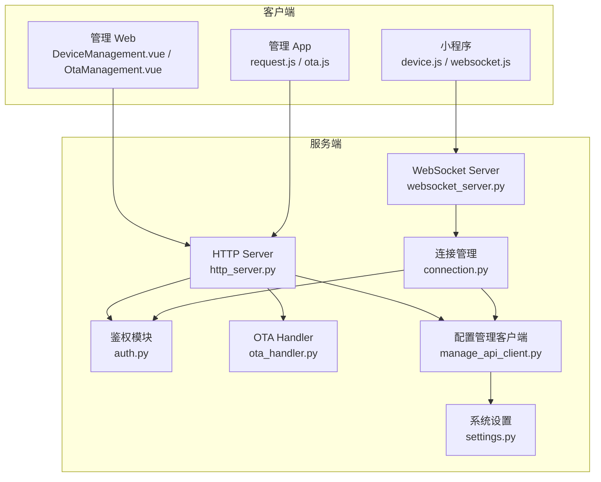
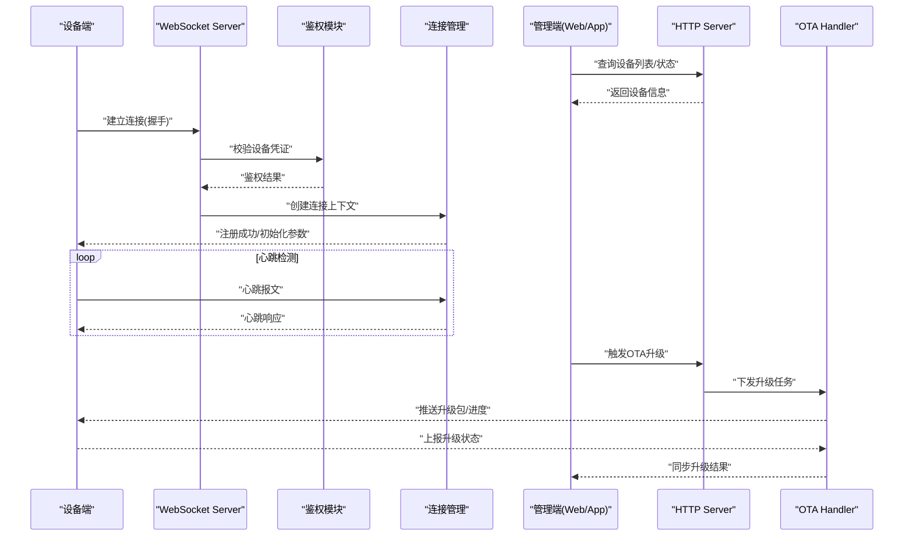
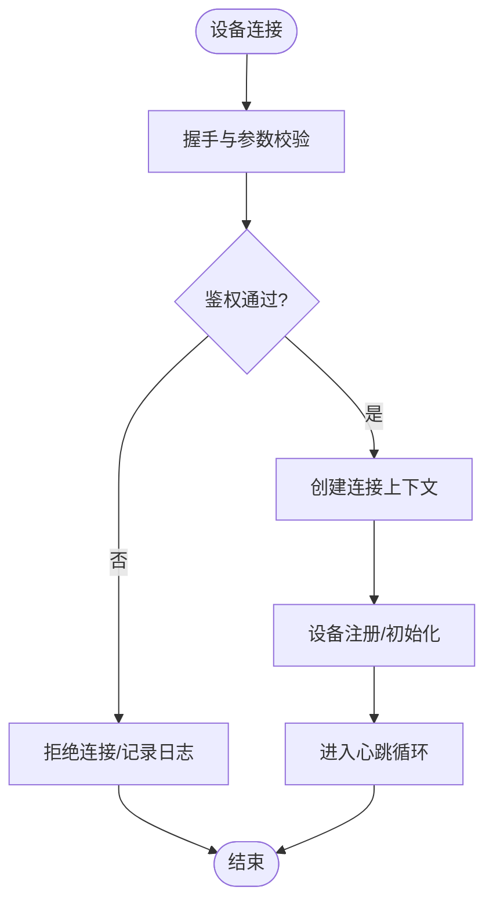
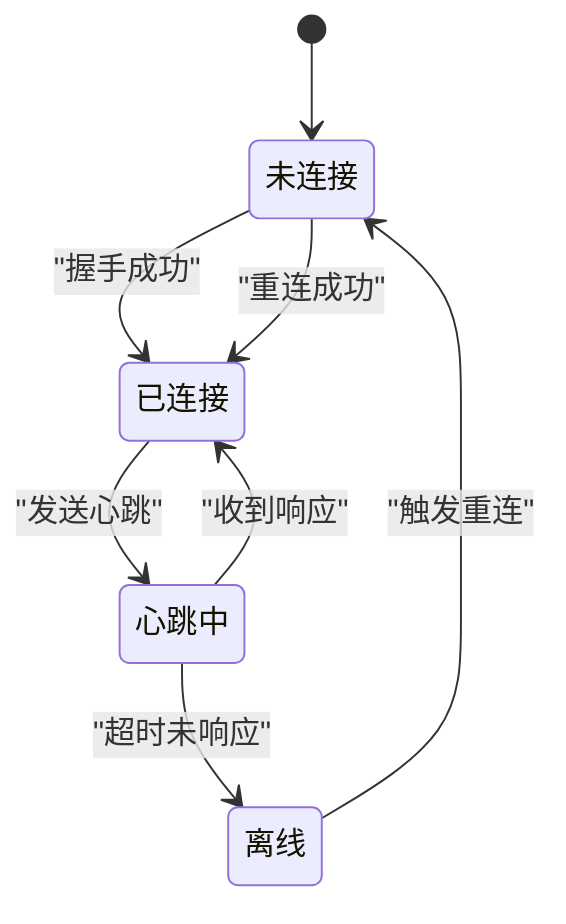
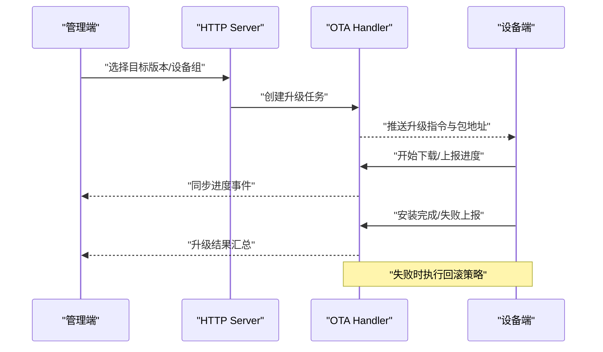
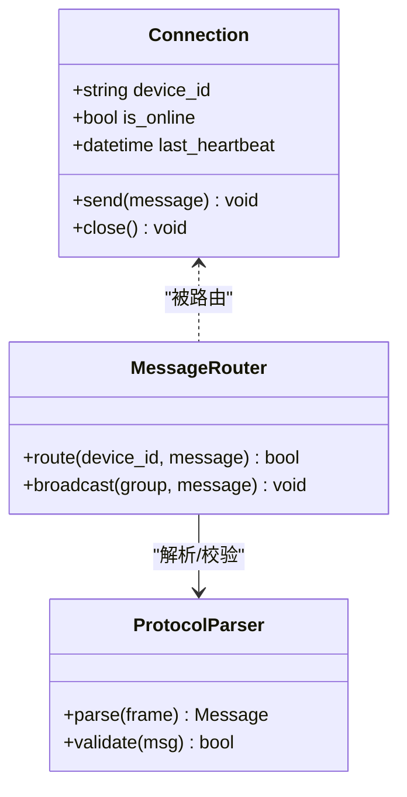
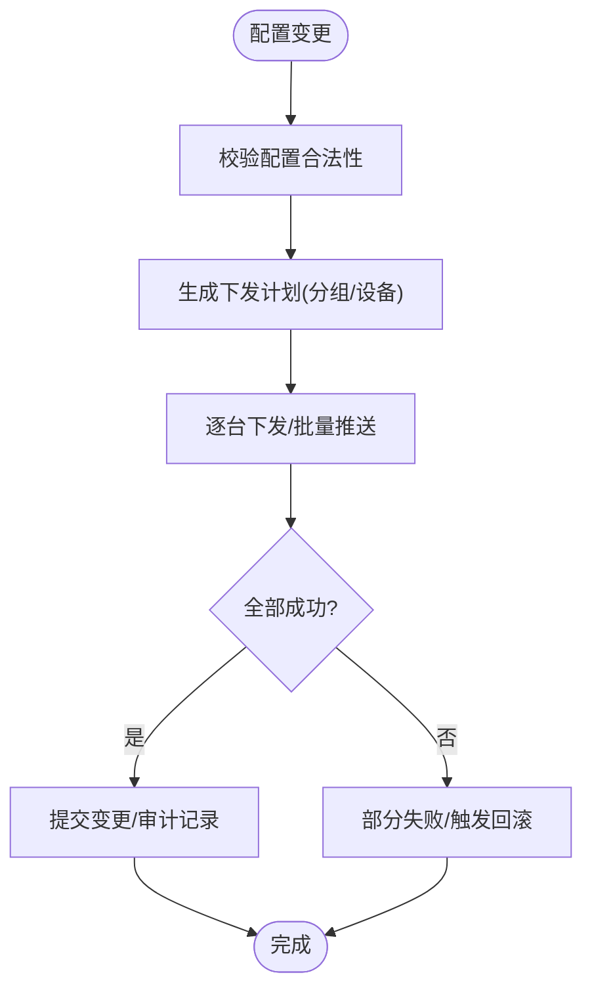
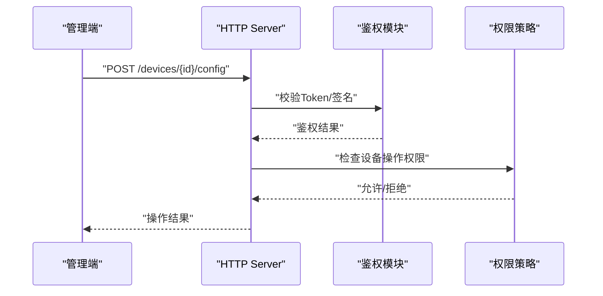
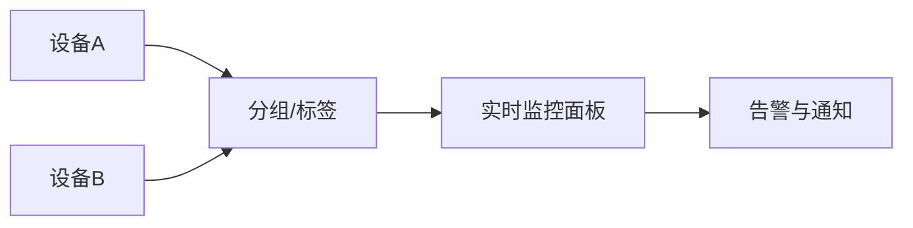
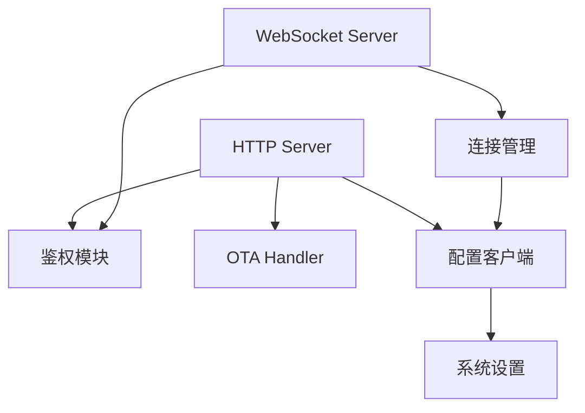

# 设备管理

<cite>
**本文引用的文件**   
- [README.md](file://README.md)
- [ota-upgrade-guide.md](file://docs/ota-upgrade-guide.md)
- [app.py](file://main/xiaozhi-server/app.py)
- [http_server.py](file://main/xiaozhi-server/core/http_server.py)
- [websocket_server.py](file://main/xiaozhi-server/core/websocket_server.py)
- [connection.py](file://main/xiaozhi-server/core/connection.py)
- [auth.py](file://main/xiaozhi-server/core/auth.py)
- [ota_handler.py](file://main/xiaozhi-server/core/api/ota_handler.py)
- [base_handler.py](file://main/xiaozhi-server/core/api/base_handler.py)
- [manage_api_client.py](file://main/xiaozhi-server/config/manage_api_client.py)
- [settings.py](file://main/xiaozhi-server/config/settings.py)
- [DeviceManagement.vue](file://main/manager-web/src/views/DeviceManagement.vue)
- [OtaManagement.vue](file://main/manager-web/src/views/OtaManagement.vue)
- [api.js](file://main/manager-web/src/apis/api.js)
- [request.js](file://main/manager-mobile/src/utils/request.js)
- [ota.js](file://main/manager-mobile/src/utils/ota.js)
- [device.js](file://main/miniprogram/utils/device.js)
- [websocket.js](file://main/miniprogram/utils/websocket.js)
</cite>

## 目录
1. [简介](#简介)
2. [项目结构](#项目结构)
3. [核心组件](#核心组件)
4. [架构总览](#架构总览)
5. [详细组件分析](#详细组件分析)
6. [依赖关系分析](#依赖关系分析)
7. [性能考量](#性能考量)
8. [故障排查指南](#故障排查指南)
9. [结论](#结论)
10. [附录：API 接口文档](#附录api-接口文档)

## 简介
本技术文档围绕“设备管理”能力，系统性梳理设备注册、身份认证、状态管理、OTA 升级（版本管理、升级包分发、进度跟踪、回滚）、通信协议与心跳、断线重连、配置下发与批量操作、权限控制、分组与标签、实时监控等关键主题。内容基于仓库中的服务端、Web 管理端、移动端实现进行归纳与可视化说明，帮助读者快速理解并落地使用。

## 项目结构
本项目采用多端协作的架构：
- xiaozhi-server：Python 后端服务，提供 HTTP/WebSocket/MQTT 网关、设备连接管理、OTA 处理、鉴权与配置管理等核心能力。
- manager-web：Vue 管理后台，提供设备管理、OTA 管理、用户与权限等界面。
- manager-mobile：移动端管理应用，提供设备绑定、OTA 升级、实时状态查看等能力。
- miniprogram：小程序端，负责设备交互、WebSocket 通信、OTA 流程辅助等。

图表来源
- [http_server.py](file://main/xiaozhi-server/core/http_server.py)
- [websocket_server.py](file://main/xiaozhi-server/core/websocket_server.py)
- [connection.py](file://main/xiaozhi-server/core/connection.py)
- [auth.py](file://main/xiaozhi-server/core/auth.py)
- [ota_handler.py](file://main/xiaozhi-server/core/api/ota_handler.py)
- [manage_api_client.py](file://main/xiaozhi-server/config/manage_api_client.py)
- [settings.py](file://main/xiaozhi-server/config/settings.py)
- [DeviceManagement.vue](file://main/manager-web/src/views/DeviceManagement.vue)
- [OtaManagement.vue](file://main/manager-web/src/views/OtaManagement.vue)
- [request.js](file://main/manager-mobile/src/utils/request.js)
- [ota.js](file://main/manager-mobile/src/utils/ota.js)
- [device.js](file://main/miniprogram/utils/device.js)
- [websocket.js](file://main/miniprogram/utils/websocket.js)

章节来源
- [README.md](file://README.md)

## 核心组件
- 设备注册与认证
  - 设备首次接入通过 HTTP 或 WebSocket 完成注册与鉴权，服务端校验设备标识与凭证，建立会话并持久化设备信息。
- 设备状态管理
  - 在线/离线状态由心跳与连接生命周期维护；支持按分组、标签筛选与聚合统计。
- OTA 升级系统
  - 版本管理、升级包分发、进度上报、失败回滚与灰度发布策略。
- 通信协议与心跳
  - 基于 WebSocket 的长连接，周期性心跳检测与自动重连策略。
- 配置管理与批量操作
  - 统一配置中心，支持单设备与批量下发，变更审计与回滚。
- 权限控制
  - 基于角色的访问控制（RBAC），对设备操作进行细粒度授权。
- 分组与标签
  - 设备分组、标签体系，便于批量管理与监控。
- 实时监控
  - 设备状态、日志、指标实时推送至管理端。

章节来源
- [http_server.py](file://main/xiaozhi-server/core/http_server.py)
- [websocket_server.py](file://main/xiaozhi-server/core/websocket_server.py)
- [connection.py](file://main/xiaozhi-server/core/connection.py)
- [auth.py](file://main/xiaozhi-server/core/auth.py)
- [ota_handler.py](file://main/xiaozhi-server/core/api/ota_handler.py)
- [manage_api_client.py](file://main/xiaozhi-server/config/manage_api_client.py)
- [settings.py](file://main/xiaozhi-server/config/settings.py)

## 架构总览
整体数据流与控制流如下：
- 设备端通过 WebSocket 建立长连接，完成鉴权与注册。
- 服务端维护连接上下文与设备状态，定时心跳检测。
- 管理端通过 REST API 查询设备、下发配置、触发 OTA。
- OTA 流程中，服务端协调版本库、存储与设备端，确保升级安全与可回滚。

图表来源
- [websocket_server.py](file://main/xiaozhi-server/core/websocket_server.py)
- [connection.py](file://main/xiaozhi-server/core/connection.py)
- [auth.py](file://main/xiaozhi-server/core/auth.py)
- [http_server.py](file://main/xiaozhi-server/core/http_server.py)
- [ota_handler.py](file://main/xiaozhi-server/core/api/ota_handler.py)

## 详细组件分析

### 设备注册与身份认证
- 注册流程
  - 设备端发起连接请求，携带设备标识与凭证。
  - 服务端鉴权通过后，创建连接上下文，写入设备元数据与初始配置。
- 认证机制
  - 支持 Token/JWT 或设备证书方式，鉴权失败则拒绝连接。
  - 会话过期与刷新策略由服务端统一管理。

图表来源
- [websocket_server.py](file://main/xiaozhi-server/core/websocket_server.py)
- [connection.py](file://main/xiaozhi-server/core/connection.py)
- [auth.py](file://main/xiaozhi-server/core/auth.py)

章节来源
- [websocket_server.py](file://main/xiaozhi-server/core/websocket_server.py)
- [connection.py](file://main/xiaozhi-server/core/connection.py)
- [auth.py](file://main/xiaozhi-server/core/auth.py)

### 设备状态管理与心跳、断线重连
- 状态模型
  - 在线/离线、最后心跳时间、信号强度、固件版本、运行指标等。
- 心跳检测
  - 固定周期发送心跳，服务端超时判定离线并触发告警。
- 断线重连
  - 设备端指数退避重连，服务端保持连接池与会话清理。

图表来源
- [connection.py](file://main/xiaozhi-server/core/connection.py)
- [websocket_server.py](file://main/xiaozhi-server/core/websocket_server.py)

章节来源
- [connection.py](file://main/xiaozhi-server/core/connection.py)
- [websocket_server.py](file://main/xiaozhi-server/core/websocket_server.py)

### OTA 升级系统
- 版本管理
  - 版本语义化、兼容性矩阵、灰度策略与发布审批。
- 升级包分发
  - 分片下载、断点续传、校验签名与完整性。
- 进度跟踪
  - 设备端定期上报下载/安装进度，服务端聚合展示。
- 回滚机制
  - 升级失败自动回滚到上一稳定版本，支持手动回滚。

图表来源
- [ota_handler.py](file://main/xiaozhi-server/core/api/ota_handler.py)
- [http_server.py](file://main/xiaozhi-server/core/http_server.py)

章节来源
- [ota_handler.py](file://main/xiaozhi-server/core/api/ota_handler.py)
- [http_server.py](file://main/xiaozhi-server/core/http_server.py)
- [ota-upgrade-guide.md](file://docs/ota-upgrade-guide.md)

### 设备通信协议与消息路由
- 协议设计
  - 基于 WebSocket 的二进制/JSON 混合帧，定义命令字、载荷结构与错误码。
- 消息路由
  - 按设备 ID 路由到对应连接上下文，支持广播与群组消息。
- 可靠性保障
  - 确认机制、重试策略、乱序处理与去重。

图表来源
- [connection.py](file://main/xiaozhi-server/core/connection.py)
- [websocket_server.py](file://main/xiaozhi-server/core/websocket_server.py)

章节来源
- [connection.py](file://main/xiaozhi-server/core/connection.py)
- [websocket_server.py](file://main/xiaozhi-server/core/websocket_server.py)

### 配置管理与批量操作
- 配置模型
  - 键值对与结构化配置，支持模板与继承。
- 批量下发
  - 按分组/标签批量更新，支持幂等与事务性提交。
- 审计与回滚
  - 变更记录、差异对比、一键回滚。

图表来源
- [manage_api_client.py](file://main/xiaozhi-server/config/manage_api_client.py)
- [settings.py](file://main/xiaozhi-server/config/settings.py)

章节来源
- [manage_api_client.py](file://main/xiaozhi-server/config/manage_api_client.py)
- [settings.py](file://main/xiaozhi-server/config/settings.py)

### 权限控制与角色管理
- RBAC 模型
  - 用户-角色-权限三元组，设备操作细粒度授权。
- 鉴权中间件
  - 统一拦截器校验 Token/签名，拒绝越权访问。
- 审计日志
  - 记录敏感操作与访问轨迹。

图表来源
- [auth.py](file://main/xiaozhi-server/core/auth.py)
- [http_server.py](file://main/xiaozhi-server/core/http_server.py)

章节来源
- [auth.py](file://main/xiaozhi-server/core/auth.py)
- [http_server.py](file://main/xiaozhi-server/core/http_server.py)

### 分组与标签、实时监控
- 分组与标签
  - 动态分组规则、标签聚合、批量操作入口。
- 实时监控
  - 设备状态、指标、日志实时推送，管理端可视化展示。

图表来源
- [DeviceManagement.vue](file://main/manager-web/src/views/DeviceManagement.vue)
- [OtaManagement.vue](file://main/manager-web/src/views/OtaManagement.vue)

章节来源
- [DeviceManagement.vue](file://main/manager-web/src/views/DeviceManagement.vue)
- [OtaManagement.vue](file://main/manager-web/src/views/OtaManagement.vue)

## 依赖关系分析
- 模块耦合
  - HTTP Server 依赖鉴权、OTA、配置客户端；WebSocket Server 依赖连接管理与鉴权。
- 外部依赖
  - 配置中心、对象存储（升级包）、消息队列（可选）。
- 潜在循环依赖
  - 通过接口抽象与事件总线解耦，避免直接循环引用。

图表来源
- [http_server.py](file://main/xiaozhi-server/core/http_server.py)
- [websocket_server.py](file://main/xiaozhi-server/core/websocket_server.py)
- [connection.py](file://main/xiaozhi-server/core/connection.py)
- [auth.py](file://main/xiaozhi-server/core/auth.py)
- [ota_handler.py](file://main/xiaozhi-server/core/api/ota_handler.py)
- [manage_api_client.py](file://main/xiaozhi-server/config/manage_api_client.py)
- [settings.py](file://main/xiaozhi-server/config/settings.py)

章节来源
- [http_server.py](file://main/xiaozhi-server/core/http_server.py)
- [websocket_server.py](file://main/xiaozhi-server/core/websocket_server.py)
- [connection.py](file://main/xiaozhi-server/core/connection.py)
- [auth.py](file://main/xiaozhi-server/core/auth.py)
- [ota_handler.py](file://main/xiaozhi-server/core/api/ota_handler.py)
- [manage_api_client.py](file://main/xiaozhi-server/config/manage_api_client.py)
- [settings.py](file://main/xiaozhi-server/config/settings.py)

## 性能考量
- 连接池与并发
  - 高并发下连接复用、线程池/协程优化，避免阻塞 I/O。
- 心跳与超时
  - 合理的心跳间隔与超时阈值，降低误判与资源占用。
- 升级包分发
  - CDN/边缘节点缓存，分片下载与并行传输提升吞吐。
- 配置下发
  - 批量合并与幂等提交，减少网络往返与冲突。
- 监控与限流
  - 接口限流、熔断降级，保护核心链路。

[本节为通用指导，不直接分析具体文件]

## 故障排查指南
- 常见问题定位
  - 鉴权失败：检查 Token/签名、证书有效期与权限策略。
  - 心跳超时：核对网络连通性、防火墙策略与服务端负载。
  - OTA 失败：验证包完整性、签名校验与存储空间。
- 日志与诊断
  - 启用调试日志，采集握手、心跳、升级事件与错误堆栈。
- 恢复策略
  - 重启连接、回滚配置、重新下发升级包。

章节来源
- [auth.py](file://main/xiaozhi-server/core/auth.py)
- [connection.py](file://main/xiaozhi-server/core/connection.py)
- [ota_handler.py](file://main/xiaozhi-server/core/api/ota_handler.py)

## 结论
本项目在设备管理方向提供了完整的注册认证、状态管理、OTA 升级、通信协议、配置下发、权限控制与实时监控能力。通过清晰的模块划分与稳健的错误处理，能够满足大规模设备接入与运维需求。建议在生产环境完善监控告警、容量规划与安全加固，持续提升稳定性与用户体验。

[本节为总结性内容，不直接分析具体文件]

## 附录：API 接口文档
以下列出设备管理与 OTA 相关的主要 RESTful 接口，供管理端调用。实际路径与参数以服务端实现为准。

- 设备管理
  - GET /api/devices
    - 功能：获取设备列表与状态
    - 入参：分页、过滤（分组/标签）、排序
    - 出参：设备清单、在线状态、最后心跳时间
  - GET /api/devices/{deviceId}
    - 功能：查询设备详情
    - 出参：设备元数据、配置快照、运行指标
  - PUT /api/devices/{deviceId}/config
    - 功能：下发设备配置
    - 入参：配置键值对、版本、生效策略
    - 出参：下发结果、审计ID
  - POST /api/devices/batch/config
    - 功能：批量下发配置
    - 入参：设备组/标签、配置内容、幂等键
    - 出参：任务ID、进度查询接口
  - DELETE /api/devices/{deviceId}
    - 功能：注销设备
    - 出参：注销结果

- OTA 升级
  - POST /api/ota/tasks
    - 功能：创建升级任务
    - 入参：目标版本、设备组/标签、灰度比例、回滚策略
    - 出参：任务ID、进度查询接口
  - GET /api/ota/tasks/{taskId}
    - 功能：查询升级任务进度
    - 出参：各设备状态、成功率、失败原因
  - POST /api/ota/tasks/{taskId}/rollback
    - 功能：触发回滚
    - 出参：回滚任务ID

- 实时监控
  - GET /api/devices/{deviceId}/metrics
    - 功能：拉取设备指标
    - 出参：CPU/内存/网络/业务指标
  - GET /api/devices/{deviceId}/logs
    - 功能：拉取设备日志
    - 出参：日志条目、级别、时间戳

- 权限与审计
  - GET /api/audit?operator={user}&action={op}&resource={res}
    - 功能：查询操作审计
    - 出参：审计记录列表

章节来源
- [http_server.py](file://main/xiaozhi-server/core/http_server.py)
- [ota_handler.py](file://main/xiaozhi-server/core/api/ota_handler.py)
- [DeviceManagement.vue](file://main/manager-web/src/views/DeviceManagement.vue)
- [OtaManagement.vue](file://main/manager-web/src/views/OtaManagement.vue)
- [api.js](file://main/manager-web/src/apis/api.js)
- [request.js](file://main/manager-mobile/src/utils/request.js)
- [ota.js](file://main/manager-mobile/src/utils/ota.js)
- [device.js](file://main/miniprogram/utils/device.js)
- [websocket.js](file://main/miniprogram/utils/websocket.js)