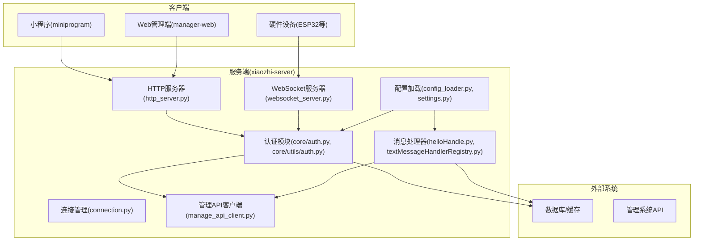
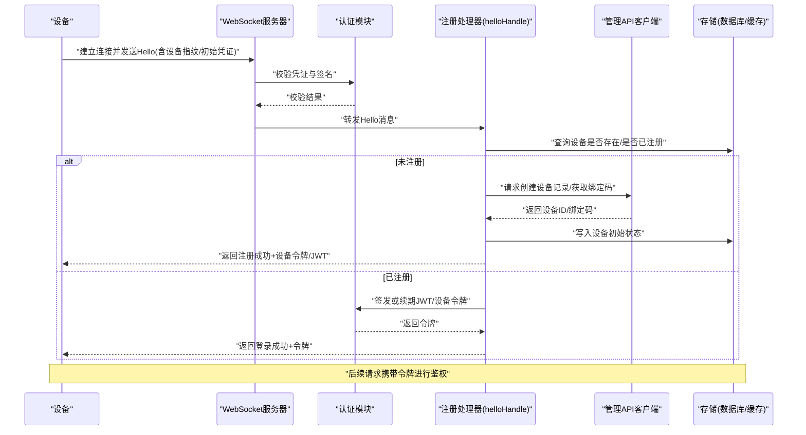
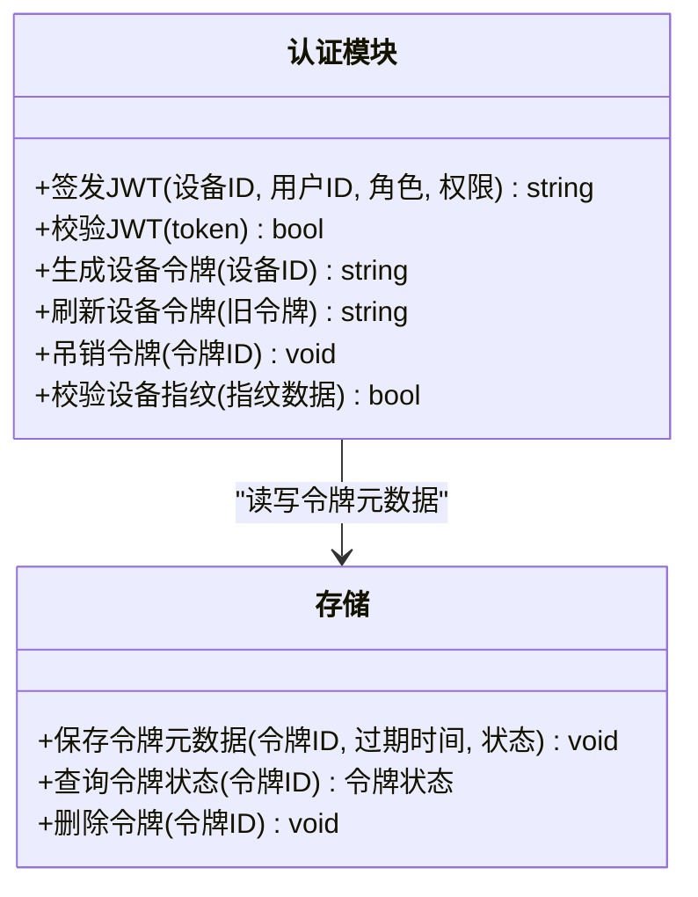
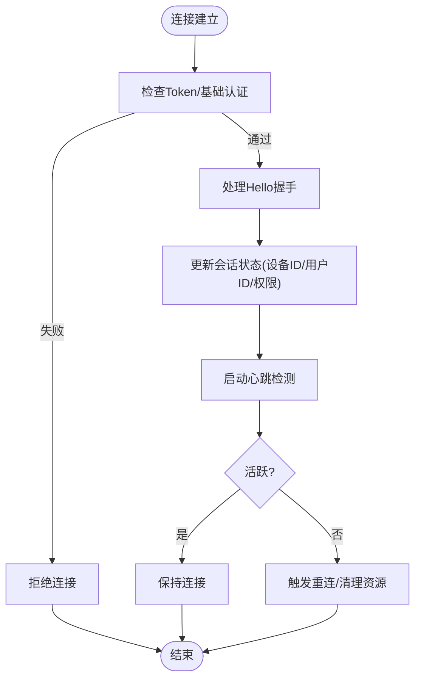
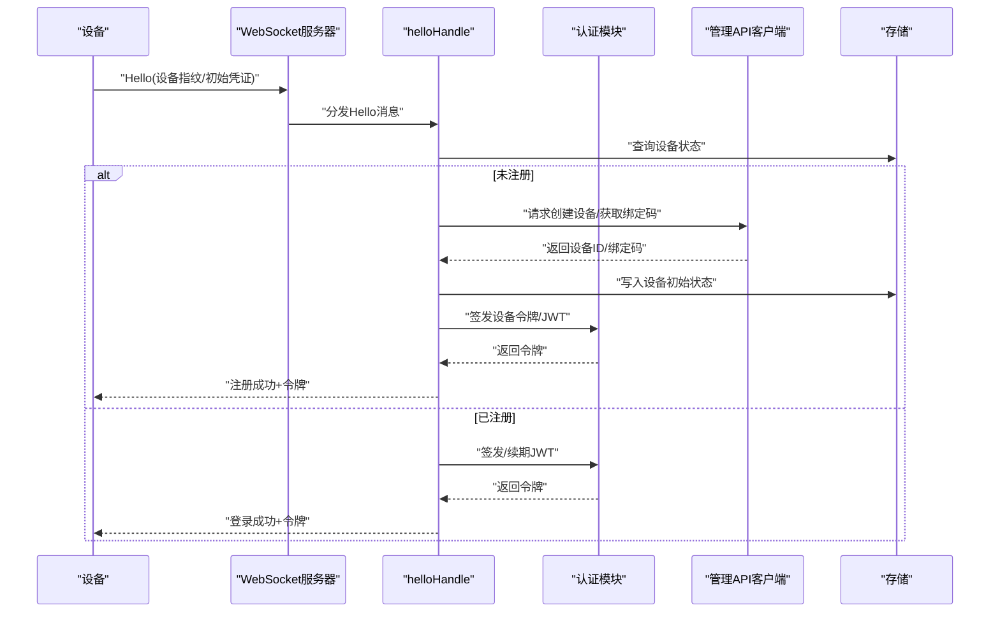
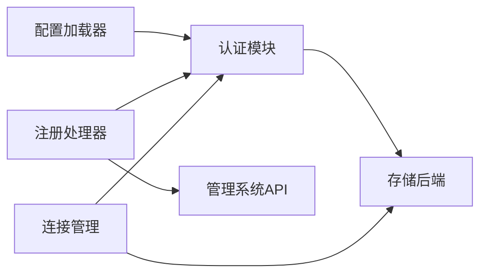

# 设备认证与注册

<cite>
**本文档引用的文件**   
- [app.py](file://main/xiaozhi-server/app.py)
- [auth.py](file://main/xiaozhi-server/core/auth.py)
- [auth.py](file://main/xiaozhi-server/core/utils/auth.py)
- [http_server.py](file://main/xiaozhi-server/core/http_server.py)
- [websocket_server.py](file://main/xiaozhi-server/core/websocket_server.py)
- [connection.py](file://main/xiaozhi-server/core/connection.py)
- [helloHandle.py](file://main/xiaozhi-server/core/handle/helloHandle.py)
- [textMessageHandlerRegistry.py](file://main/xiaozhi-server/core/handle/textMessageHandlerRegistry.py)
- [config_loader.py](file://main/xiaozhi-server/config/config_loader.py)
- [settings.py](file://main/xiaozhi-server/config/settings.py)
- [manage_api_client.py](file://main/xiaozhi-server/config/manage_api_client.py)
- [device.js](file://main/miniprogram/utils/device.js)
- [auth.js](file://main/miniprogram/utils/auth.js)
- [request.js](file://main/miniprogram/utils/request.js)
- [DeviceManagement.vue](file://main/manager-web/src/views/DeviceManagement.vue)
- [AddDeviceDialog.vue](file://main/manager-web/src/components/AddDeviceDialog.vue)
</cite>

## 目录
1. [简介](#简介)
2. [项目结构](#项目结构)
3. [核心组件](#核心组件)
4. [架构总览](#架构总览)
5. [详细组件分析](#详细组件分析)
6. [依赖关系分析](#依赖关系分析)
7. [性能考虑](#性能考虑)
8. [故障排查指南](#故障排查指南)
9. [结论](#结论)
10. [附录](#附录)

## 简介
本技术文档聚焦于“设备认证与注册”能力，覆盖设备身份验证机制（设备令牌、JWT 认证流程、设备指纹识别）、设备注册全流程（首次连接至完成注册）、权限模型与访问控制策略、安全令牌管理、设备绑定/解绑逻辑、多用户支持、设备状态同步机制，以及自定义认证逻辑与设备注册接口的实现要点。文档同时给出安全考量（防重放攻击、会话管理等）与常见问题排查建议，帮助开发者快速理解并扩展该子系统。

## 项目结构
本项目采用前后端分离与多服务协作的架构：
- 服务端（Python）：提供 HTTP/WebSocket 接口、认证鉴权、消息处理、设备生命周期管理、与管理系统 API 交互等。
- 小程序前端（miniprogram）：负责设备发现、绑定、注册、认证交互与状态展示。
- Web 管理端（manager-web）：用于管理员进行设备管理、批量操作与配置下发。

图表来源 
- [http_server.py](file://main/xiaozhi-server/core/http_server.py)
- [websocket_server.py](file://main/xiaozhi-server/core/websocket_server.py)
- [auth.py](file://main/xiaozhi-server/core/auth.py)
- [auth.py](file://main/xiaozhi-server/core/utils/auth.py)
- [connection.py](file://main/xiaozhi-server/core/connection.py)
- [helloHandle.py](file://main/xiaozhi-server/core/handle/helloHandle.py)
- [textMessageHandlerRegistry.py](file://main/xiaozhi-server/core/handle/textMessageHandlerRegistry.py)
- [config_loader.py](file://main/xiaozhi-server/config/config_loader.py)
- [settings.py](file://main/xiaozhi-server/config/settings.py)
- [manage_api_client.py](file://main/xiaozhi-server/config/manage_api_client.py)

章节来源
- [app.py](file://main/xiaozhi-server/app.py)
- [http_server.py](file://main/xiaozhi-server/core/http_server.py)
- [websocket_server.py](file://main/xiaozhi-server/core/websocket_server.py)

## 核心组件
- 认证模块
  - JWT 签发与校验、设备令牌生成与刷新、签名算法与密钥管理。
  - 设备指纹采集与校验（MAC、设备型号、固件版本等）。
- 连接与会话管理
  - WebSocket 长连接建立、心跳保活、断线重连、会话上下文维护。
- 消息处理与注册流程
  - Hello 握手、设备信息上报、注册/绑定请求、状态同步与确认。
- 配置与外部集成
  - 从配置文件加载认证策略、密钥、超时参数；调用管理系统 API 完成设备归属与权限分配。

章节来源
- [auth.py](file://main/xiaozhi-server/core/auth.py)
- [auth.py](file://main/xiaozhi-server/core/utils/auth.py)
- [connection.py](file://main/xiaozhi-server/core/connection.py)
- [helloHandle.py](file://main/xiaozhi-server/core/handle/helloHandle.py)
- [textMessageHandlerRegistry.py](file://main/xiaozhi-server/core/handle/textMessageHandlerRegistry.py)
- [config_loader.py](file://main/xiaozhi-server/config/config_loader.py)
- [settings.py](file://main/xiaozhi-server/config/settings.py)
- [manage_api_client.py](file://main/xiaozhi-server/config/manage_api_client.py)

## 架构总览
设备认证与注册的整体流程如下：
- 设备首次连接通过 WebSocket 发起 Hello 握手，携带设备指纹与初始凭证。
- 服务端校验设备指纹与凭证，生成短期设备令牌或 JWT，返回注册结果。
- 若需绑定到用户账户，则通过小程序或管理端发起绑定请求，由管理系统 API 完成授权。
- 后续通信使用 JWT 或设备令牌进行鉴权，服务端维护会话与设备状态。

图表来源 
- [websocket_server.py](file://main/xiaozhi-server/core/websocket_server.py)
- [helloHandle.py](file://main/xiaozhi-server/core/handle/helloHandle.py)
- [auth.py](file://main/xiaozhi-server/core/auth.py)
- [manage_api_client.py](file://main/xiaozhi-server/config/manage_api_client.py)
- [connection.py](file://main/xiaozhi-server/core/connection.py)

## 详细组件分析

### 认证模块（JWT 与设备令牌）
- 职责
  - 生成与校验 JWT，支持过期时间、签名算法、载荷字段（设备ID、用户ID、角色、权限等）。
  - 设备令牌生命周期管理（签发、刷新、吊销），与缓存/存储联动。
  - 设备指纹校验（MAC、型号、固件版本、地理位置等），防止伪造与越权。
- 关键流程
  - 登录/注册成功后签发 JWT 或设备令牌。
  - 每次请求校验令牌有效性、签名、过期时间与黑名单。
  - 结合设备指纹进行二次校验，增强安全性。

图表来源 
- [auth.py](file://main/xiaozhi-server/core/auth.py)
- [auth.py](file://main/xiaozhi-server/core/utils/auth.py)

章节来源
- [auth.py](file://main/xiaozhi-server/core/auth.py)
- [auth.py](file://main/xiaozhi-server/core/utils/auth.py)

### 连接与会话管理（WebSocket）
- 职责
  - 建立与维护 WebSocket 连接，处理心跳、断线重连。
  - 维护会话上下文（设备ID、用户ID、权限、在线状态）。
  - 将认证结果与设备状态注入到消息处理链路。
- 关键流程
  - 连接建立时进行基础认证（可选 Token 校验）。
  - Hello 握手完成后更新会话状态为“已注册”。
  - 心跳检测与异常断开恢复。

图表来源 
- [websocket_server.py](file://main/xiaozhi-server/core/websocket_server.py)
- [connection.py](file://main/xiaozhi-server/core/connection.py)

章节来源
- [websocket_server.py](file://main/xiaozhi-server/core/websocket_server.py)
- [connection.py](file://main/xiaozhi-server/core/connection.py)

### 注册流程（Hello 握手与设备注册）
- 职责
  - 处理设备首次连接的 Hello 消息，完成设备指纹校验与注册。
  - 与管理系统 API 交互，完成设备归属与权限分配。
  - 返回注册结果与令牌，供后续通信使用。
- 关键流程
  - 解析 Hello 消息，提取设备指纹与初始凭证。
  - 校验设备指纹与凭证合法性。
  - 查询设备是否已注册，未注册则创建记录并返回绑定码或注册成功。
  - 已注册则签发/续期令牌并返回登录成功。

图表来源 
- [helloHandle.py](file://main/xiaozhi-server/core/handle/helloHandle.py)
- [auth.py](file://main/xiaozhi-server/core/auth.py)
- [manage_api_client.py](file://main/xiaozhi-server/config/manage_api_client.py)
- [connection.py](file://main/xiaozhi-server/core/connection.py)

章节来源
- [helloHandle.py](file://main/xiaozhi-server/core/handle/helloHandle.py)
- [textMessageHandlerRegistry.py](file://main/xiaozhi-server/core/handle/textMessageHandlerRegistry.py)

### 权限模型与访问控制
- 设备级权限
  - 基于设备ID与设备类型限制可访问的资源与功能。
- 用户级权限
  - 基于用户角色（管理员、普通用户）控制设备管理与操作权限。
- 访问控制策略
  - 在 HTTP 与 WebSocket 层统一校验 JWT 中的角色与权限。
  - 结合设备指纹与在线状态进行动态授权。

章节来源
- [auth.py](file://main/xiaozhi-server/core/auth.py)
- [auth.py](file://main/xiaozhi-server/core/utils/auth.py)
- [connection.py](file://main/xiaozhi-server/core/connection.py)

### 安全令牌管理
- 令牌类型
  - JWT：用于跨服务鉴权，包含设备ID、用户ID、角色、权限、过期时间。
  - 设备令牌：短期令牌，用于设备侧高频通信，支持刷新与吊销。
- 生命周期
  - 签发：注册/登录后生成，设置过期时间与黑名单。
  - 刷新：到期前自动续期，避免频繁重新认证。
  - 吊销：设备丢失或用户注销时立即失效。
- 存储与缓存
  - 令牌元数据持久化与缓存加速校验，支持分布式部署。

章节来源
- [auth.py](file://main/xiaozhi-server/core/auth.py)
- [auth.py](file://main/xiaozhi-server/core/utils/auth.py)

### 设备绑定/解绑与多用户支持
- 绑定流程
  - 设备首次注册后返回绑定码，小程序或管理端使用绑定码完成用户归属。
  - 管理系统 API 校验绑定码与用户权限，完成设备与用户关联。
- 解绑流程
  - 用户主动解绑或管理员强制解绑，解除设备与用户关联。
  - 清理会话与权限，确保设备不可被原用户访问。
- 多用户支持
  - 同一设备可被多个用户共享，但需明确主用户与访客权限。
  - 支持用户切换时的令牌刷新与权限隔离。

章节来源
- [manage_api_client.py](file://main/xiaozhi-server/config/manage_api_client.py)
- [device.js](file://main/miniprogram/utils/device.js)
- [auth.js](file://main/miniprogram/utils/auth.js)

### 设备状态同步机制
- 状态定义
  - 在线/离线、注册/未注册、绑定/未绑定、权限变更。
- 同步方式
  - WebSocket 推送状态变更事件，客户端实时更新 UI。
  - 心跳检测与断线重连保证状态一致性。
- 冲突处理
  - 多端并发修改时采用乐观锁或版本号控制，避免状态不一致。

章节来源
- [connection.py](file://main/xiaozhi-server/core/connection.py)
- [websocket_server.py](file://main/xiaozhi-server/core/websocket_server.py)

### 自定义认证逻辑与设备注册接口实现
- 自定义认证逻辑
  - 在认证模块中扩展设备指纹校验规则（如增加地理围栏、设备白名单）。
  - 支持第三方认证源（企业 LDAP、OAuth2）与本地认证并存。
- 设备注册接口
  - HTTP 接口用于小程序与管理端调用，接收设备信息与绑定码，调用管理系统 API 完成注册。
  - 返回注册结果与临时令牌，供设备侧后续通信使用。

章节来源
- [auth.py](file://main/xiaozhi-server/core/auth.py)
- [auth.py](file://main/xiaozhi-server/core/utils/auth.py)
- [manage_api_client.py](file://main/xiaozhi-server/config/manage_api_client.py)
- [device.js](file://main/miniprogram/utils/device.js)
- [auth.js](file://main/miniprogram/utils/auth.js)

## 依赖关系分析
- 内部依赖
  - 认证模块依赖配置加载器与存储后端。
  - 注册处理器依赖认证模块与管理系统 API 客户端。
  - 连接管理依赖认证模块与会话存储。
- 外部依赖
  - 管理系统 API：设备归属、权限分配、绑定码管理。
  - 存储后端：设备信息、令牌元数据、会话状态。

图表来源 
- [config_loader.py](file://main/xiaozhi-server/config/config_loader.py)
- [auth.py](file://main/xiaozhi-server/core/auth.py)
- [helloHandle.py](file://main/xiaozhi-server/core/handle/helloHandle.py)
- [manage_api_client.py](file://main/xiaozhi-server/config/manage_api_client.py)
- [connection.py](file://main/xiaozhi-server/core/connection.py)

章节来源
- [config_loader.py](file://main/xiaozhi-server/config/config_loader.py)
- [settings.py](file://main/xiaozhi-server/config/settings.py)

## 性能考虑
- 令牌校验优化
  - 使用缓存减少数据库查询，提升鉴权性能。
  - 支持异步校验与批量刷新。
- 连接管理优化
  - 心跳间隔可调，避免过多网络开销。
  - 断线重连采用指数退避，降低服务器压力。
- 注册流程优化
  - 设备指纹校验与注册逻辑并行执行，缩短响应时间。
  - 管理系统 API 调用支持超时与重试机制。

## 故障排查指南
- 认证失败
  - 检查 JWT 签名与过期时间，确认密钥配置正确。
  - 查看设备指纹校验日志，确认设备信息一致。
- 注册失败
  - 检查管理系统 API 连通性与返回码。
  - 确认设备指纹与初始凭证合法。
- 连接中断
  - 检查心跳配置与网络稳定性。
  - 查看会话状态与资源清理日志。

章节来源
- [auth.py](file://main/xiaozhi-server/core/auth.py)
- [helloHandle.py](file://main/xiaozhi-server/core/handle/helloHandle.py)
- [connection.py](file://main/xiaozhi-server/core/connection.py)

## 结论
设备认证与注册是系统的核心安全能力，涉及 JWT 认证、设备指纹识别、令牌管理、权限控制与状态同步等多个方面。通过模块化设计与清晰的流程划分，系统实现了高可用、可扩展的设备认证与注册机制。开发者可根据业务需求扩展认证逻辑与注册接口，同时遵循安全最佳实践，确保系统的安全性与稳定性。

## 附录
- 相关前端组件
  - 小程序设备管理：[device.js](file://main/miniprogram/utils/device.js)、[auth.js](file://main/miniprogram/utils/auth.js)
  - Web 管理端设备页面：[DeviceManagement.vue](file://main/manager-web/src/views/DeviceManagement.vue)、[AddDeviceDialog.vue](file://main/manager-web/src/components/AddDeviceDialog.vue)

章节来源
- [device.js](file://main/miniprogram/utils/device.js)
- [auth.js](file://main/miniprogram/utils/auth.js)
- [DeviceManagement.vue](file://main/manager-web/src/views/DeviceManagement.vue)
- [AddDeviceDialog.vue](file://main/manager-web/src/components/AddDeviceDialog.vue)