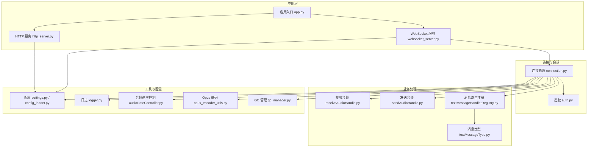
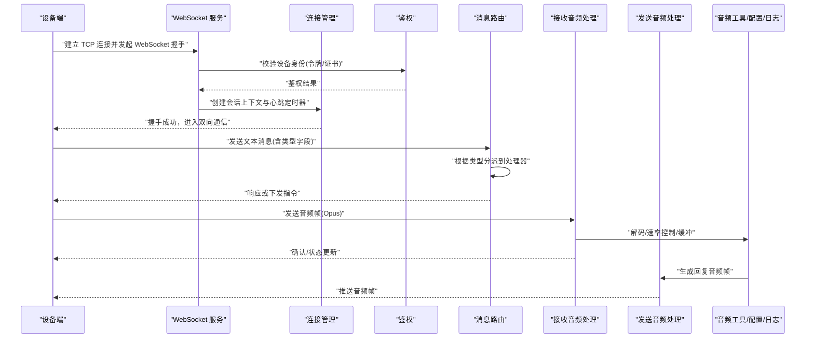
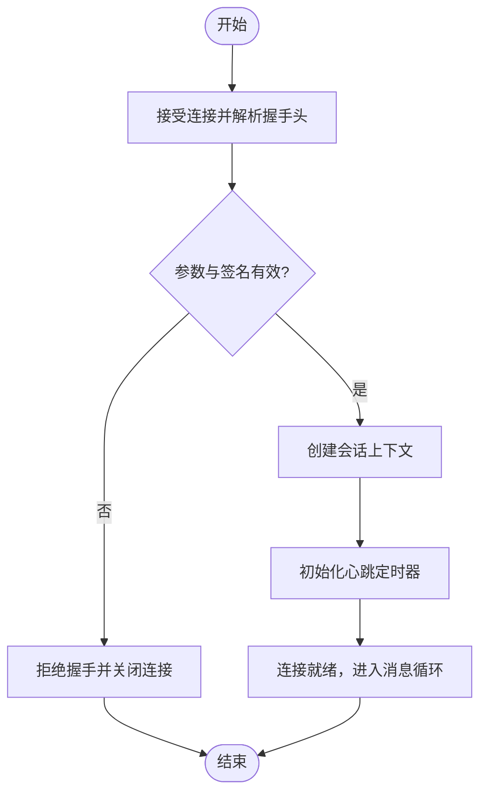
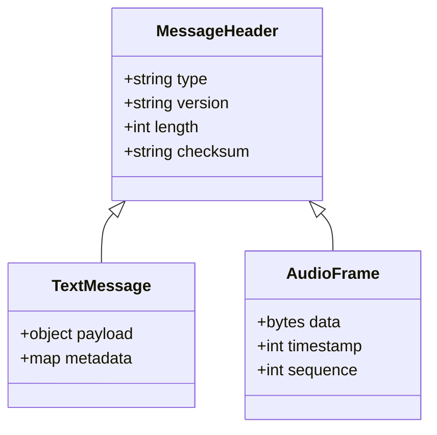
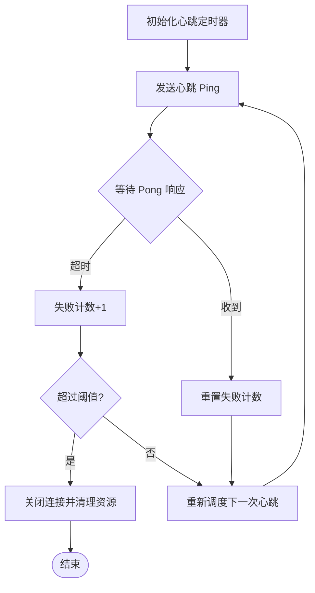
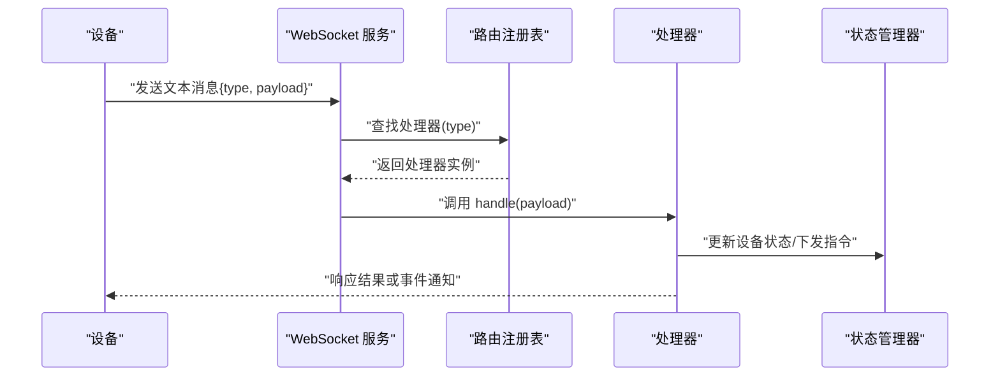
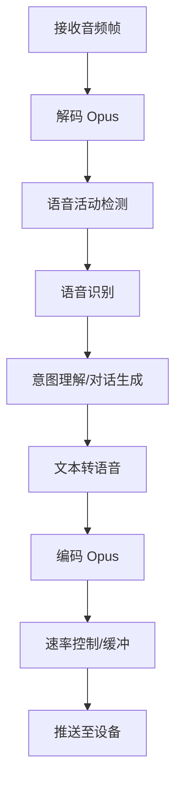
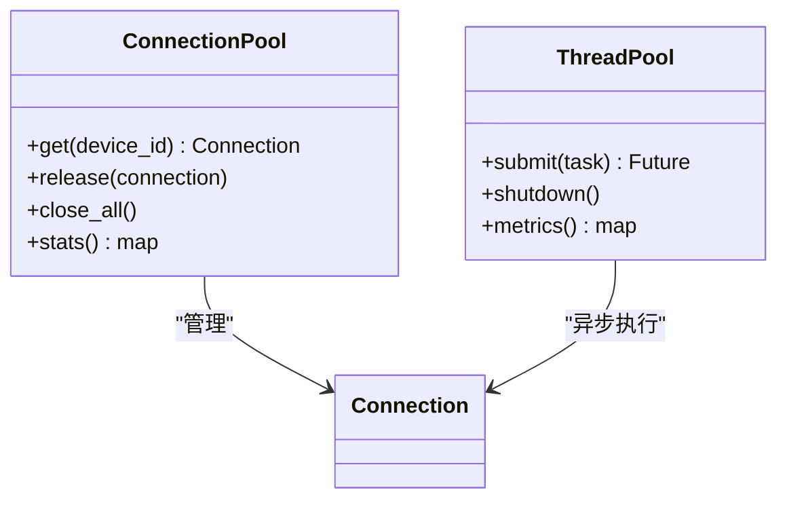
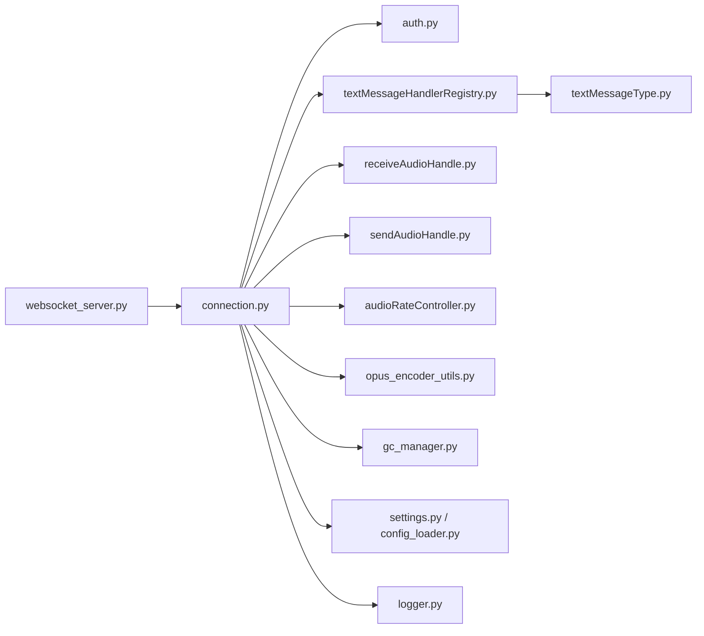

# 设备通信协议

<cite>
**本文引用的文件**   
- [app.py](file://main/xiaozhi-server/app.py)
- [websocket_server.py](file://main/xiaozhi-server/core/websocket_server.py)
- [connection.py](file://main/xiaozhi-server/core/connection.py)
- [http_server.py](file://main/xiaozhi-server/core/http_server.py)
- [auth.py](file://main/xiaozhi-server/core/auth.py)
- [settings.py](file://main/xiaozhi-server/config/settings.py)
- [config_loader.py](file://main/xiaozhi-server/config/config_loader.py)
- [logger.py](file://main/xiaozhi-server/config/logger.py)
- [receiveAudioHandle.py](file://main/xiaozhi-server/core/handle/receiveAudioHandle.py)
- [sendAudioHandle.py](file://main/xiaozhi-server/core/handle/sendAudioHandle.py)
- [textMessageHandlerRegistry.py](file://main/xiaozhi-server/core/handle/textMessageHandlerRegistry.py)
- [textMessageType.py](file://main/xiaozhi-server/core/handle/textMessageType.py)
- [audioRateController.py](file://main/xiaozhi-server/core/utils/audioRateController.py)
- [opus_encoder_utils.py](file://main/xiaozhi-server/core/utils/opus_encoder_utils.py)
- [gc_manager.py](file://main/xiaozhi-server/core/utils/gc_manager.py)
- [performance_tester.py](file://main/xiaozhi-server/performance_tester.py)
- [mcp-endpoint-integration.md](file://docs/mcp-endpoint-integration.md)
- [mqtt-gateway-architecture-analysis.md](file://docs/custom/mqtt-gateway-architecture-analysis.md)
- [thread-pool-and-connection-optimization.md](file://docs/custom/thread-pool-and-connection-optimization.md)
</cite>

## 目录
1. [简介](#简介)
2. [项目结构](#项目结构)
3. [核心组件](#核心组件)
4. [架构总览](#架构总览)
5. [详细组件分析](#详细组件分析)
6. [依赖关系分析](#依赖关系分析)
7. [性能考量](#性能考量)
8. [故障排查指南](#故障排查指南)
9. [结论](#结论)
10. [附录](#附录)

## 简介
本技术文档围绕设备与服务器之间的通信协议展开，重点覆盖：
- WebSocket 连接建立、鉴权握手、消息格式定义与版本兼容策略
- 心跳检测机制（间隔配置、超时处理、自动重连）
- 消息路由、设备状态同步与实时数据推送
- 连接池管理、并发模型与内存优化
- 异常处理、网络故障恢复与性能监控指标
- MQTT 集成、消息队列使用与分布式部署考虑

该文档面向开发者与运维人员，既提供高层架构概览，也深入到关键模块的实现细节与调用流程。

## 项目结构
本项目采用多模块组织方式，设备通信相关代码主要集中在 xiaozhi-server 子项目中：
- 应用入口与启动：app.py
- WebSocket 服务与连接管理：core/websocket_server.py、core/connection.py
- HTTP API 与鉴权：core/http_server.py、core/auth.py
- 配置与日志：config/settings.py、config/config_loader.py、config/logger.py
- 音频处理与编码：core/utils/audioRateController.py、core/utils/opus_encoder_utils.py
- 文本消息路由与处理器注册：core/handle/textMessageHandlerRegistry.py、core/handle/textMessageType.py
- 音频收发处理：core/handle/receiveAudioHandle.py、core/handle/sendAudioHandle.py
- 性能测试工具：performance_tester.py
- 外部集成文档：docs/mcp-endpoint-integration.md、docs/custom/mqtt-gateway-architecture-analysis.md、docs/custom/thread-pool-and-connection-optimization.md

图表来源
- [app.py](file://main/xiaozhi-server/app.py)
- [http_server.py](file://main/xiaozhi-server/core/http_server.py)
- [websocket_server.py](file://main/xiaozhi-server/core/websocket_server.py)
- [connection.py](file://main/xiaozhi-server/core/connection.py)
- [auth.py](file://main/xiaozhi-server/core/auth.py)
- [receiveAudioHandle.py](file://main/xiaozhi-server/core/handle/receiveAudioHandle.py)
- [sendAudioHandle.py](file://main/xiaozhi-server/core/handle/sendAudioHandle.py)
- [textMessageHandlerRegistry.py](file://main/xiaozhi-server/core/handle/textMessageHandlerRegistry.py)
- [textMessageType.py](file://main/xiaozhi-server/core/handle/textMessageType.py)
- [audioRateController.py](file://main/xiaozhi-server/core/utils/audioRateController.py)
- [opus_encoder_utils.py](file://main/xiaozhi-server/core/utils/opus_encoder_utils.py)
- [gc_manager.py](file://main/xiaozhi-server/core/utils/gc_manager.py)
- [settings.py](file://main/xiaozhi-server/config/settings.py)
- [config_loader.py](file://main/xiaozhi-server/config/config_loader.py)
- [logger.py](file://main/xiaozhi-server/config/logger.py)

章节来源
- [app.py](file://main/xiaozhi-server/app.py)
- [websocket_server.py](file://main/xiaozhi-server/core/websocket_server.py)
- [connection.py](file://main/xiaozhi-server/core/connection.py)
- [http_server.py](file://main/xiaozhi-server/core/http_server.py)
- [auth.py](file://main/xiaozhi-server/core/auth.py)
- [settings.py](file://main/xiaozhi-server/config/settings.py)
- [config_loader.py](file://main/xiaozhi-server/config/config_loader.py)
- [logger.py](file://main/xiaozhi-server/config/logger.py)

## 核心组件
- WebSocket 服务：负责监听端口、接受设备连接、升级协议为 WebSocket、分发消息到具体处理器。
- 连接管理：维护每个设备的会话上下文、心跳定时器、发送/接收通道、错误与重连策略。
- 鉴权模块：在握手阶段校验设备身份，支持 Token/证书等认证方式。
- 消息路由：基于消息类型将文本消息分发给对应处理器，支持扩展注册。
- 音频处理：对 Opus 音频流进行编码/解码、速率控制与缓冲管理。
- 配置与日志：集中加载运行时配置、统一日志输出与级别控制。
- 性能与内存：线程池、异步 I/O、对象复用、垃圾回收调优。

章节来源
- [websocket_server.py](file://main/xiaozhi-server/core/websocket_server.py)
- [connection.py](file://main/xiaozhi-server/core/connection.py)
- [auth.py](file://main/xiaozhi-server/core/auth.py)
- [textMessageHandlerRegistry.py](file://main/xiaozhi-server/core/handle/textMessageHandlerRegistry.py)
- [receiveAudioHandle.py](file://main/xiaozhi-server/core/handle/receiveAudioHandle.py)
- [sendAudioHandle.py](file://main/xiaozhi-server/core/handle/sendAudioHandle.py)
- [audioRateController.py](file://main/xiaozhi-server/core/utils/audioRateController.py)
- [opus_encoder_utils.py](file://main/xiaozhi-server/core/utils/opus_encoder_utils.py)
- [settings.py](file://main/xiaozhi-server/config/settings.py)
- [config_loader.py](file://main/xiaozhi-server/config/config_loader.py)
- [logger.py](file://main/xiaozhi-server/config/logger.py)

## 架构总览
下图展示了设备通过 WebSocket 与服务器的交互路径，以及内部模块的协作关系。

图表来源
- [websocket_server.py](file://main/xiaozhi-server/core/websocket_server.py)
- [connection.py](file://main/xiaozhi-server/core/connection.py)
- [auth.py](file://main/xiaozhi-server/core/auth.py)
- [textMessageHandlerRegistry.py](file://main/xiaozhi-server/core/handle/textMessageHandlerRegistry.py)
- [receiveAudioHandle.py](file://main/xiaozhi-server/core/handle/receiveAudioHandle.py)
- [sendAudioHandle.py](file://main/xiaozhi-server/core/handle/sendAudioHandle.py)
- [audioRateController.py](file://main/xiaozhi-server/core/utils/audioRateController.py)
- [opus_encoder_utils.py](file://main/xiaozhi-server/core/utils/opus_encoder_utils.py)

## 详细组件分析

### WebSocket 连接建立与鉴权
- 握手阶段：服务端接收 Upgrade 请求，校验参数与签名，必要时从配置中心获取设备白名单。
- 会话初始化：分配连接 ID、绑定设备标识、初始化心跳定时器与发送队列。
- 鉴权失败处理：返回错误码并关闭连接，记录审计日志。

图表来源
- [websocket_server.py](file://main/xiaozhi-server/core/websocket_server.py)
- [auth.py](file://main/xiaozhi-server/core/auth.py)
- [connection.py](file://main/xiaozhi-server/core/connection.py)

章节来源
- [websocket_server.py](file://main/xiaozhi-server/core/websocket_server.py)
- [auth.py](file://main/xiaozhi-server/core/auth.py)
- [connection.py](file://main/xiaozhi-server/core/connection.py)

### 消息格式定义与版本兼容
- 消息结构：包含固定头部（类型、版本、长度）、负载（JSON/二进制）、可选校验字段。
- 文本消息：用于控制指令、状态上报、系统事件；类型由枚举定义，便于扩展。
- 音频消息：二进制帧，封装 Opus 编码片段，附带时间戳与序列号。
- 版本兼容：通过版本号字段协商能力集，旧版本降级处理未知字段。

图表来源
- [textMessageType.py](file://main/xiaozhi-server/core/handle/textMessageType.py)
- [textMessageHandlerRegistry.py](file://main/xiaozhi-server/core/handle/textMessageHandlerRegistry.py)
- [receiveAudioHandle.py](file://main/xiaozhi-server/core/handle/receiveAudioHandle.py)
- [sendAudioHandle.py](file://main/xiaozhi-server/core/handle/sendAudioHandle.py)

章节来源
- [textMessageType.py](file://main/xiaozhi-server/core/handle/textMessageType.py)
- [textMessageHandlerRegistry.py](file://main/xiaozhi-server/core/handle/textMessageHandlerRegistry.py)
- [receiveAudioHandle.py](file://main/xiaozhi-server/core/handle/receiveAudioHandle.py)
- [sendAudioHandle.py](file://main/xiaozhi-server/core/handle/sendAudioHandle.py)

### 心跳检测机制
- 心跳间隔：通过配置项设置客户端/服务端心跳周期。
- 超时处理：连续 N 次未收到心跳则判定连接失效，触发清理与告警。
- 自动重连：客户端侧实现指数退避重试，服务端限制重连频率防止风暴。

图表来源
- [connection.py](file://main/xiaozhi-server/core/connection.py)
- [settings.py](file://main/xiaozhi-server/config/settings.py)
- [logger.py](file://main/xiaozhi-server/config/logger.py)

章节来源
- [connection.py](file://main/xiaozhi-server/core/connection.py)
- [settings.py](file://main/xiaozhi-server/config/settings.py)
- [logger.py](file://main/xiaozhi-server/config/logger.py)

### 消息路由机制与设备状态同步
- 路由表：按消息类型注册处理器，支持动态加载与热更新。
- 状态同步：设备在线/离线、运行模式、能力集变更通过专用消息类型广播。
- 实时推送：服务端主动下发指令或数据，客户端需保证幂等与顺序性。

图表来源
- [textMessageHandlerRegistry.py](file://main/xiaozhi-server/core/handle/textMessageHandlerRegistry.py)
- [textMessageType.py](file://main/xiaozhi-server/core/handle/textMessageType.py)
- [connection.py](file://main/xiaozhi-server/core/connection.py)

章节来源
- [textMessageHandlerRegistry.py](file://main/xiaozhi-server/core/handle/textMessageHandlerRegistry.py)
- [textMessageType.py](file://main/xiaozhi-server/core/handle/textMessageType.py)
- [connection.py](file://main/xiaozhi-server/core/connection.py)

### 音频数据处理与推送
- 接收路径：设备上传 Opus 帧，服务端解码、VAD 检测、ASR 转写。
- 发送路径：TTS 生成音频，编码为 Opus 帧，按速率控制推送。
- 缓冲与丢包：滑动窗口、丢包补偿、抖动缓冲。

图表来源
- [receiveAudioHandle.py](file://main/xiaozhi-server/core/handle/receiveAudioHandle.py)
- [sendAudioHandle.py](file://main/xiaozhi-server/core/handle/sendAudioHandle.py)
- [audioRateController.py](file://main/xiaozhi-server/core/utils/audioRateController.py)
- [opus_encoder_utils.py](file://main/xiaozhi-server/core/utils/opus_encoder_utils.py)

章节来源
- [receiveAudioHandle.py](file://main/xiaozhi-server/core/handle/receiveAudioHandle.py)
- [sendAudioHandle.py](file://main/xiaozhi-server/core/handle/sendAudioHandle.py)
- [audioRateController.py](file://main/xiaozhi-server/core/utils/audioRateController.py)
- [opus_encoder_utils.py](file://main/xiaozhi-server/core/utils/opus_encoder_utils.py)

### 连接池管理与并发处理
- 连接池：按设备维度维护连接实例，限制最大连接数与单设备并发。
- 并发模型：异步 I/O 为主，CPU 密集任务放入线程池，避免阻塞事件循环。
- 背压与限流：发送队列满时丢弃低优先级消息或回退。

图表来源
- [connection.py](file://main/xiaozhi-server/core/connection.py)
- [settings.py](file://main/xiaozhi-server/config/settings.py)

章节来源
- [connection.py](file://main/xiaozhi-server/core/connection.py)
- [settings.py](file://main/xiaozhi-server/config/settings.py)

### 内存优化与 GC 管理
- 对象复用：音频帧、缓冲区、编码器实例复用，减少分配开销。
- 弱引用：会话与缓存使用弱引用避免循环引用。
- GC 调优：定期触发 GC，监控内存峰值与碎片率。

章节来源
- [gc_manager.py](file://main/xiaozhi-server/core/utils/gc_manager.py)
- [opus_encoder_utils.py](file://main/xiaozhi-server/core/utils/opus_encoder_utils.py)
- [audioRateController.py](file://main/xiaozhi-server/core/utils/audioRateController.py)

### 配置与日志
- 配置加载：支持 YAML/环境变量/远程配置源，运行时热更新。
- 日志分级：调试、信息、警告、错误，结构化输出便于聚合。
- 指标采集：QPS、延迟、错误率、内存/CPU 占用。

章节来源
- [settings.py](file://main/xiaozhi-server/config/settings.py)
- [config_loader.py](file://main/xiaozhi-server/config/config_loader.py)
- [logger.py](file://main/xiaozhi-server/config/logger.py)

## 依赖关系分析
- 内聚性：连接管理、消息路由、音频处理职责清晰，耦合度低。
- 外部依赖：ASR/TTS/LLM 通过插件化接口接入，可替换实现。
- 潜在循环：避免在处理器中直接反向依赖连接层，使用事件总线解耦。

图表来源
- [websocket_server.py](file://main/xiaozhi-server/core/websocket_server.py)
- [connection.py](file://main/xiaozhi-server/core/connection.py)
- [auth.py](file://main/xiaozhi-server/core/auth.py)
- [textMessageHandlerRegistry.py](file://main/xiaozhi-server/core/handle/textMessageHandlerRegistry.py)
- [textMessageType.py](file://main/xiaozhi-server/core/handle/textMessageType.py)
- [receiveAudioHandle.py](file://main/xiaozhi-server/core/handle/receiveAudioHandle.py)
- [sendAudioHandle.py](file://main/xiaozhi-server/core/handle/sendAudioHandle.py)
- [audioRateController.py](file://main/xiaozhi-server/core/utils/audioRateController.py)
- [opus_encoder_utils.py](file://main/xiaozhi-server/core/utils/opus_encoder_utils.py)
- [gc_manager.py](file://main/xiaozhi-server/core/utils/gc_manager.py)
- [settings.py](file://main/xiaozhi-server/config/settings.py)
- [config_loader.py](file://main/xiaozhi-server/config/config_loader.py)
- [logger.py](file://main/xiaozhi-server/config/logger.py)

章节来源
- [websocket_server.py](file://main/xiaozhi-server/core/websocket_server.py)
- [connection.py](file://main/xiaozhi-server/core/connection.py)
- [auth.py](file://main/xiaozhi-server/core/auth.py)
- [textMessageHandlerRegistry.py](file://main/xiaozhi-server/core/handle/textMessageHandlerRegistry.py)
- [textMessageType.py](file://main/xiaozhi-server/core/handle/textMessageType.py)
- [receiveAudioHandle.py](file://main/xiaozhi-server/core/handle/receiveAudioHandle.py)
- [sendAudioHandle.py](file://main/xiaozhi-server/core/handle/sendAudioHandle.py)
- [audioRateController.py](file://main/xiaozhi-server/core/utils/audioRateController.py)
- [opus_encoder_utils.py](file://main/xiaozhi-server/core/utils/opus_encoder_utils.py)
- [gc_manager.py](file://main/xiaozhi-server/core/utils/gc_manager.py)
- [settings.py](file://main/xiaozhi-server/config/settings.py)
- [config_loader.py](file://main/xiaozhi-server/config/config_loader.py)
- [logger.py](file://main/xiaozhi-server/config/logger.py)

## 性能考量
- 异步 I/O：优先使用非阻塞读写，降低线程切换开销。
- 批处理：音频帧合并发送，减少系统调用次数。
- 缓存热点：设备能力集、路由表常驻内存，避免频繁 IO。
- 监控指标：连接数、消息吞吐、端到端延迟、错误率、GC 停顿时长。

章节来源
- [performance_tester.py](file://main/xiaozhi-server/performance_tester.py)
- [audioRateController.py](file://main/xiaozhi-server/core/utils/audioRateController.py)
- [gc_manager.py](file://main/xiaozhi-server/core/utils/gc_manager.py)

## 故障排查指南
- 连接异常：检查握手参数、鉴权失败原因、TLS 证书有效性。
- 心跳超时：核对心跳间隔配置、网络延迟、设备电量策略。
- 音频卡顿：查看缓冲大小、丢包率、编码比特率、速率控制器参数。
- 内存泄漏：定位未释放的连接、循环引用、大对象未及时回收。
- 日志定位：启用调试级别，收集握手、路由、音频处理链路日志。

章节来源
- [logger.py](file://main/xiaozhi-server/config/logger.py)
- [auth.py](file://main/xiaozhi-server/core/auth.py)
- [connection.py](file://main/xiaozhi-server/core/connection.py)
- [receiveAudioHandle.py](file://main/xiaozhi-server/core/handle/receiveAudioHandle.py)
- [sendAudioHandle.py](file://main/xiaozhi-server/core/handle/sendAudioHandle.py)

## 结论
本设备通信协议以 WebSocket 为核心，结合严格的消息格式与版本兼容策略，实现了高可靠、低延迟的设备交互。通过模块化设计，消息路由、音频处理、连接管理各司其职，易于扩展与维护。配合心跳检测、自动重连、连接池与内存优化，系统在大规模设备场景下具备良好稳定性与性能表现。未来可进一步引入 MQTT 网关与消息队列，支撑分布式部署与跨域通信。

## 附录

### 消息格式示例（文本）
- 设备上线上报：
  - 类型：device_online
  - 版本：v1
  - 负载：{device_id, capabilities, firmware_version}
- 状态同步：
  - 类型：device_status
  - 版本：v1
  - 负载：{status, battery_level, signal_strength}
- 控制指令：
  - 类型：control_command
  - 版本：v1
  - 负载：{command, params, request_id}

### 消息格式示例（音频）
- 上行音频帧：
  - 类型：audio_up
  - 版本：v1
  - 负载：{data: base64_opus, timestamp, sequence}
- 下行音频帧：
  - 类型：audio_down
  - 版本：v1
  - 负载：{data: base64_opus, timestamp, sequence}

### MQTT 集成与消息队列
- MQTT 网关：将 WebSocket 设备消息桥接到 MQTT 主题，供后端服务订阅。
- 消息队列：使用持久化队列承载高吞吐音频元数据与事件，削峰填谷。
- 分布式部署：多实例无状态化，共享配置与状态存储，水平扩展。

章节来源
- [mcp-endpoint-integration.md](file://docs/mcp-endpoint-integration.md)
- [mqtt-gateway-architecture-analysis.md](file://docs/custom/mqtt-gateway-architecture-analysis.md)
- [thread-pool-and-connection-optimization.md](file://docs/custom/thread-pool-and-connection-optimization.md)