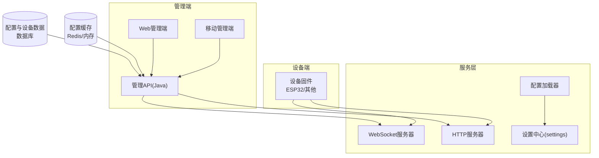
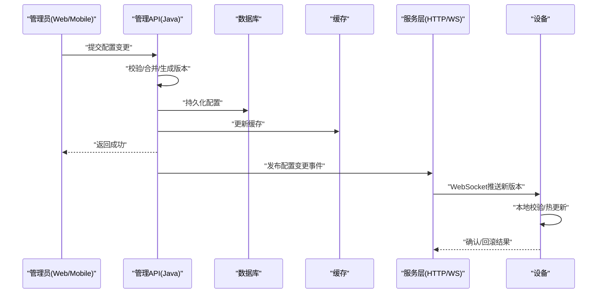
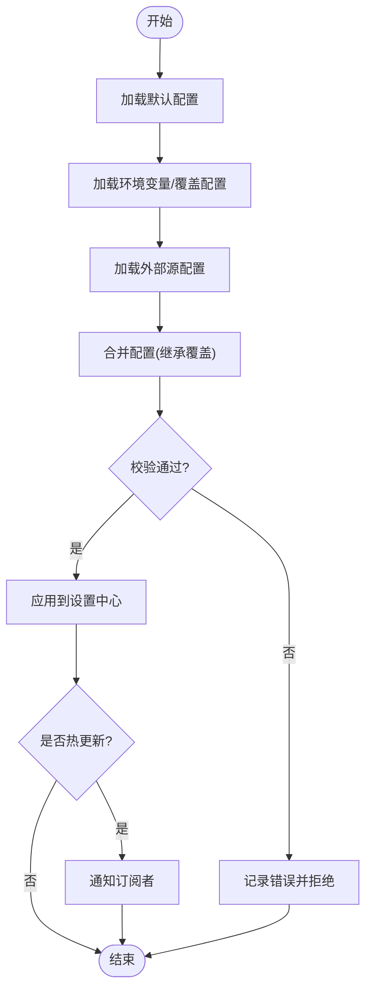
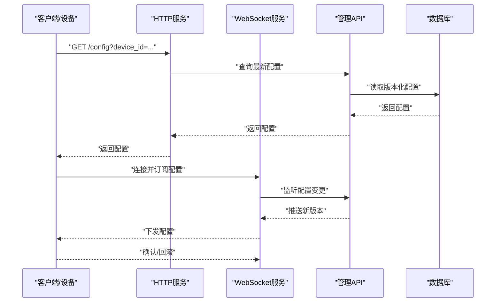
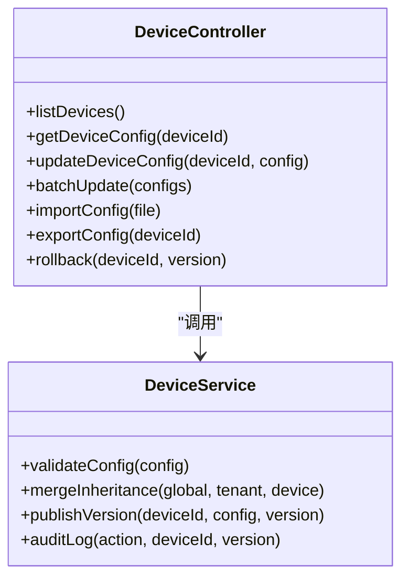
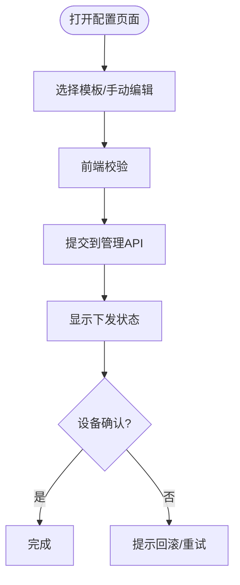
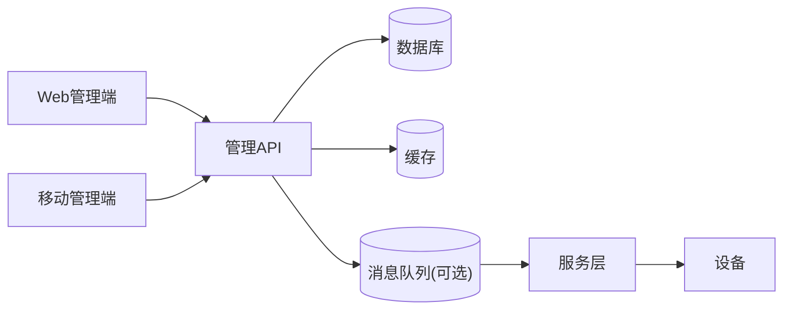

# 设备配置管理

<cite>
**本文引用的文件**   
- [README.md](file://README.md)
- [xiaozhi-server/app.py](file://main/xiaozhi-server/app.py)
- [xiaozhi-server/config/settings.py](file://main/xiaozhi-server/config/settings.py)
- [xiaozhi-server/config/config_loader.py](file://main/xiaozhi-server/config/config_loader.py)
- [xiaozhi-server/core/http_server.py](file://main/xiaozhi-server/core/http_server.py)
- [xiaozhi-server/core/websocket_server.py](file://main/xiaozhi-server/core/websocket_server.py)
- [manager-web/src/views/DeviceManagement.vue](file://main/manager-web/src/views/DeviceManagement.vue)
- [manager-web/src/components/AddDeviceDialog.vue](file://main/manager-web/src/components/AddDeviceDialog.vue)
- [manager-web/src/utils/deviceTime.mjs](file://main/manager-web/src/utils/deviceTime.mjs)
- [manager-mobile/src/pages/device-config/index.vue](file://main/manager-mobile/src/pages/device-config/index.vue)
- [manager-api/src/main/java/xiaozhi/controller/DeviceController.java](file://main/manager-api/src/main/java/xiaozhi/controller/DeviceController.java)
- [manager-api/src/main/java/xiaozhi/service/DeviceService.java](file://main/manager-api/src/main/java/xiaozhi/service/DeviceService.java)
- [manager-api/src/main/resources/application.yml](file://main/manager-api/src/main/resources/application.yml)
</cite>

## 目录
1. [简介](#简介)
2. [项目结构](#项目结构)
3. [核心组件](#核心组件)
4. [架构总览](#架构总览)
5. [详细组件分析](#详细组件分析)
6. [依赖关系分析](#依赖关系分析)
7. [性能考虑](#性能考虑)
8. [故障排查指南](#故障排查指南)
9. [结论](#结论)
10. [附录](#附录)

## 简介
本技术文档围绕“设备配置管理”展开，覆盖配置项结构、模板管理、动态下发、版本控制、同步机制、冲突解决、验证规则、默认值与继承、批量操作、导入导出、审计日志、热更新与回滚、权限控制、缓存策略、性能优化与安全考量。文档以仓库中的服务端（Python）、管理端（Web/Mobile）与管理API（Java）为线索，结合设备侧交互流程，给出可落地的设计与实践建议。

## 项目结构
本项目由多端构成：
- xiaozhi-server：设备通信与服务核心（HTTP/WebSocket），负责配置加载、下发与运行时配置管理。
- manager-web：Web管理控制台，提供设备管理、配置编辑、模板管理等界面。
- manager-mobile：移动端管理应用，支持设备配置查看与基础操作。
- manager-api：后端管理服务，提供设备与配置的REST接口，对接数据库与缓存。

图表来源 
- [xiaozhi-server/core/websocket_server.py](file://main/xiaozhi-server/core/websocket_server.py)
- [xiaozhi-server/core/http_server.py](file://main/xiaozhi-server/core/http_server.py)
- [xiaozhi-server/config/config_loader.py](file://main/xiaozhi-server/config/config_loader.py)
- [xiaozhi-server/config/settings.py](file://main/xiaozhi-server/config/settings.py)
- [manager-api/src/main/resources/application.yml](file://main/manager-api/src/main/resources/application.yml)

章节来源
- [README.md](file://README.md)

## 核心组件
- 配置加载与设置中心
  - 负责从配置文件或外部源加载配置，合并默认值与覆盖值，暴露统一读取接口。
- HTTP/WebSocket服务
  - 对外暴露配置查询、下发、校验等接口；通过WebSocket向设备推送配置变更。
- 管理API（Java）
  - 提供设备与配置的CRUD、模板管理、版本控制、导入导出、审计等能力。
- Web/Mobile管理端
  - 提供可视化配置编辑、模板选择、批量操作、导入导出、审计查看等界面。

章节来源
- [xiaozhi-server/config/config_loader.py](file://main/xiaozhi-server/config/config_loader.py)
- [xiaozhi-server/config/settings.py](file://main/xiaozhi-server/config/settings.py)
- [xiaozhi-server/core/http_server.py](file://main/xiaozhi-server/core/http_server.py)
- [xiaozhi-server/core/websocket_server.py](file://main/xiaozhi-server/core/websocket_server.py)
- [manager-api/src/main/java/xiaozhi/controller/DeviceController.java](file://main/manager-api/src/main/java/xiaozhi/controller/DeviceController.java)
- [manager-api/src/main/java/xiaozhi/service/DeviceService.java](file://main/manager-api/src/main/java/xiaozhi/service/DeviceService.java)

## 架构总览
设备配置管理的整体流程如下：
- 管理员在Web/Mobile端编辑配置并保存至管理API。
- 管理API进行校验、生成版本、持久化到数据库，并写入缓存。
- 服务层监听配置变更事件，将新版本推送到设备（WebSocket）。
- 设备接收后执行校验与热更新，必要时触发回滚。

图表来源 
- [manager-api/src/main/java/xiaozhi/controller/DeviceController.java](file://main/manager-api/src/main/java/xiaozhi/controller/DeviceController.java)
- [manager-api/src/main/java/xiaozhi/service/DeviceService.java](file://main/manager-api/src/main/java/xiaozhi/service/DeviceService.java)
- [xiaozhi-server/core/websocket_server.py](file://main/xiaozhi-server/core/websocket_server.py)
- [xiaozhi-server/core/http_server.py](file://main/xiaozhi-server/core/http_server.py)

## 详细组件分析

### 配置加载与设置中心
- 职责
  - 加载默认配置、环境覆盖、外部源配置，合并为最终设置。
  - 提供线程安全的读取接口，支持运行时重载。
- 关键点
  - 默认值管理：未显式设置的字段使用默认值。
  - 继承关系：按层级（全局→租户→设备）合并，后者覆盖前者。
  - 热更新：支持在不重启的情况下刷新配置。
- 复杂度
  - 合并策略时间复杂度O(n)，n为配置项数量；读取O(1)。

图表来源 
- [xiaozhi-server/config/config_loader.py](file://main/xiaozhi-server/config/config_loader.py)
- [xiaozhi-server/config/settings.py](file://main/xiaozhi-server/config/settings.py)

章节来源
- [xiaozhi-server/config/config_loader.py](file://main/xiaozhi-server/config/config_loader.py)
- [xiaozhi-server/config/settings.py](file://main/xiaozhi-server/config/settings.py)

### HTTP/WebSocket服务与配置下发
- 职责
  - 提供配置查询、下发、校验接口；通过WebSocket向设备推送配置。
- 关键点
  - 幂等下发：同一版本多次下发不重复生效。
  - 增量推送：仅推送差异字段，降低带宽。
  - 设备确认：设备需返回确认或失败原因。
- 安全
  - 鉴权与访问控制：基于角色/设备ID限制。
  - 传输加密：TLS/WSS。

图表来源 
- [xiaozhi-server/core/http_server.py](file://main/xiaozhi-server/core/http_server.py)
- [xiaozhi-server/core/websocket_server.py](file://main/xiaozhi-server/core/websocket_server.py)
- [manager-api/src/main/java/xiaozhi/controller/DeviceController.java](file://main/manager-api/src/main/java/xiaozhi/controller/DeviceController.java)

章节来源
- [xiaozhi-server/core/http_server.py](file://main/xiaozhi-server/core/http_server.py)
- [xiaozhi-server/core/websocket_server.py](file://main/xiaozhi-server/core/websocket_server.py)

### 管理API（设备与配置）
- 职责
  - 提供设备与配置的CRUD、模板管理、版本控制、导入导出、审计日志等接口。
- 关键点
  - 版本控制：每次变更生成版本号，支持回滚到历史版本。
  - 校验规则：字段类型、范围、依赖关系校验。
  - 并发控制：避免重复下发与冲突。
- 集成点
  - 数据库：持久化配置与审计日志。
  - 缓存：加速读取与热点配置分发。

图表来源 
- [manager-api/src/main/java/xiaozhi/controller/DeviceController.java](file://main/manager-api/src/main/java/xiaozhi/controller/DeviceController.java)
- [manager-api/src/main/java/xiaozhi/service/DeviceService.java](file://main/manager-api/src/main/java/xiaozhi/service/DeviceService.java)

章节来源
- [manager-api/src/main/java/xiaozhi/controller/DeviceController.java](file://main/manager-api/src/main/java/xiaozhi/controller/DeviceController.java)
- [manager-api/src/main/java/xiaozhi/service/DeviceService.java](file://main/manager-api/src/main/java/xiaozhi/service/DeviceService.java)

### Web/Mobile管理端
- 职责
  - 提供设备配置编辑、模板选择、批量操作、导入导出、审计查看等界面。
- 关键点
  - 表单校验：前端预校验，减少无效请求。
  - 模板管理：快速套用常用配置。
  - 实时反馈：显示下发状态与设备确认结果。

图表来源 
- [manager-web/src/views/DeviceManagement.vue](file://main/manager-web/src/views/DeviceManagement.vue)
- [manager-web/src/components/AddDeviceDialog.vue](file://main/manager-web/src/components/AddDeviceDialog.vue)
- [manager-mobile/src/pages/device-config/index.vue](file://main/manager-mobile/src/pages/device-config/index.vue)

章节来源
- [manager-web/src/views/DeviceManagement.vue](file://main/manager-web/src/views/DeviceManagement.vue)
- [manager-web/src/components/AddDeviceDialog.vue](file://main/manager-web/src/components/AddDeviceDialog.vue)
- [manager-mobile/src/pages/device-config/index.vue](file://main/manager-mobile/src/pages/device-config/index.vue)

## 依赖关系分析
- 组件耦合
  - 管理API与数据库/缓存强耦合；服务层与API通过事件/消息解耦。
  - Web/Mobile与API松耦合，通过REST/GraphQL交互。
- 外部依赖
  - 数据库：MySQL/PostgreSQL等。
  - 缓存：Redis。
  - 消息队列：可选，用于异步下发与审计。
- 潜在循环依赖
  - 服务层不应反向依赖管理API，避免循环。

图表来源 
- [manager-api/src/main/resources/application.yml](file://main/manager-api/src/main/resources/application.yml)

章节来源
- [manager-api/src/main/resources/application.yml](file://main/manager-api/src/main/resources/application.yml)

## 性能考虑
- 配置缓存
  - 热点配置入缓存，减少数据库压力。
  - 缓存失效策略：TTL+主动失效。
- 增量下发
  - 仅推送差异字段，降低网络开销。
- 批量操作
  - 合并请求，减少往返次数。
- 并发控制
  - 使用分布式锁避免重复下发。
- 异步处理
  - 审计日志、通知等异步化。

## 故障排查指南
- 常见问题
  - 配置未生效：检查版本是否一致、设备是否确认。
  - 下发失败：查看设备日志与网络状态。
  - 回滚失败：确认历史版本存在且有效。
- 排查步骤
  - 查看管理API日志与审计记录。
  - 检查服务层WebSocket连接状态。
  - 核对设备端配置校验结果。
- 恢复策略
  - 回滚到上一稳定版本。
  - 清理缓存并重新拉取。

章节来源
- [manager-api/src/main/java/xiaozhi/controller/DeviceController.java](file://main/manager-api/src/main/java/xiaozhi/controller/DeviceController.java)
- [manager-api/src/main/java/xiaozhi/service/DeviceService.java](file://main/manager-api/src/main/java/xiaozhi/service/DeviceService.java)

## 结论
设备配置管理需要兼顾一致性、可用性与安全性。通过版本控制、增量下发、缓存与异步处理，可实现高效稳定的配置生命周期管理。建议在关键路径加入完善的校验、审计与回滚机制，确保生产环境的可靠性。

## 附录
- 配置示例与最佳实践
  - 不同设备类型的配置差异：传感器阈值、通信参数、功能开关等。
  - 模板复用：按设备族定义模板，快速部署。
  - 权限控制：按角色限制配置修改范围。
  - 安全考虑：敏感字段加密、传输加密、访问审计。