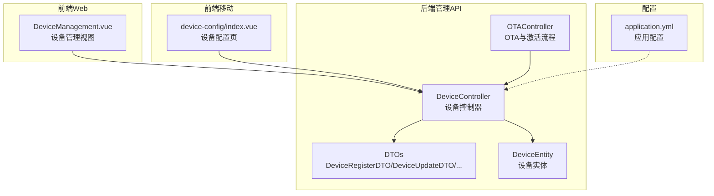
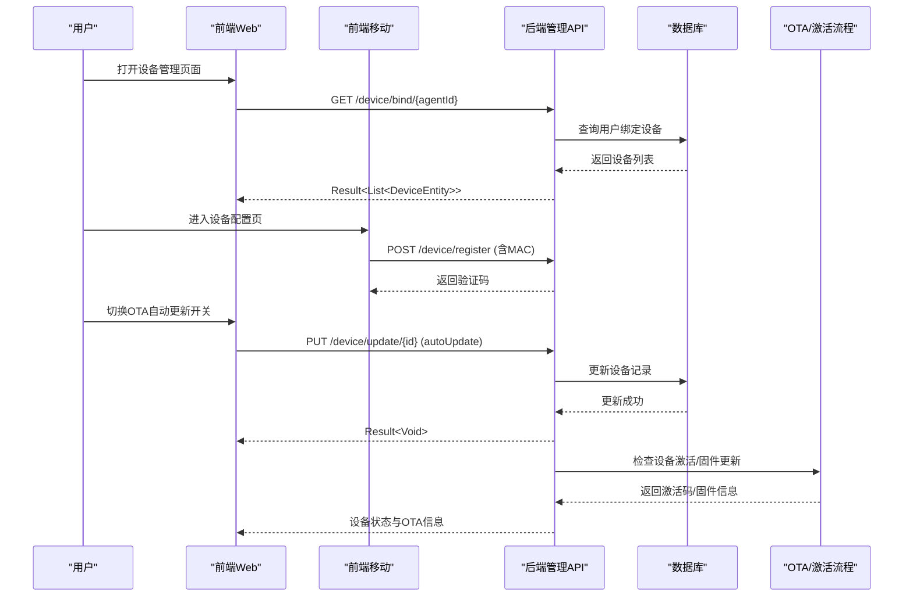
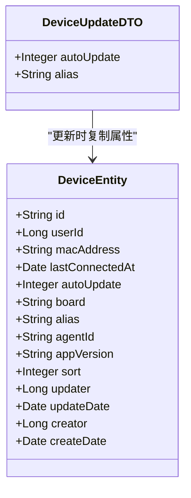
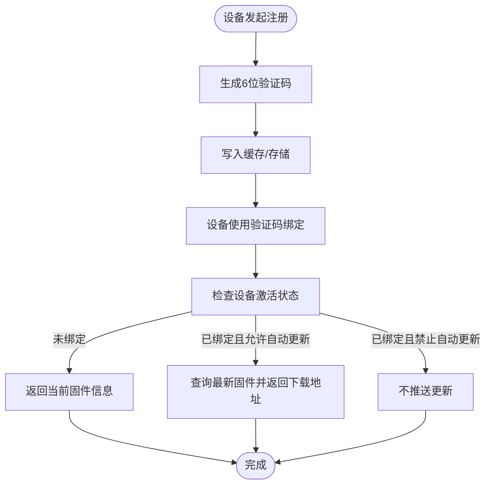
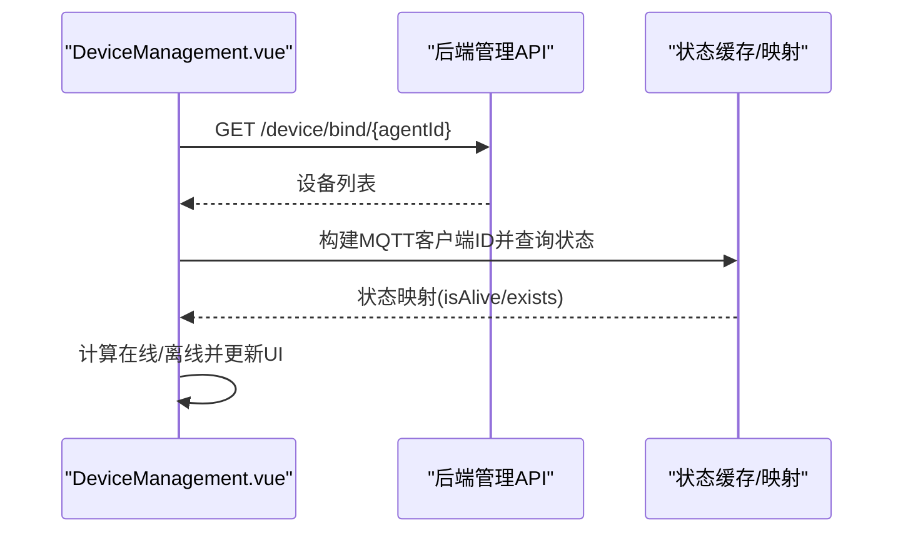
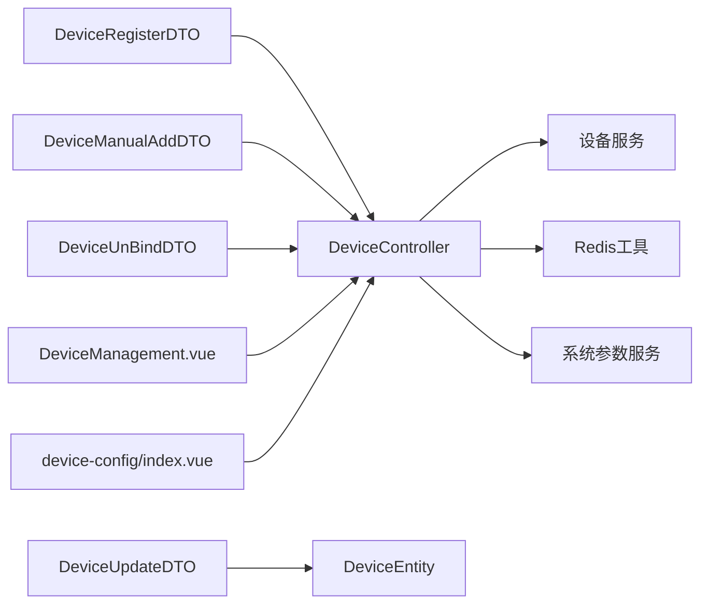

# 设备配置管理

<cite>
**本文档引用的文件**
- [DeviceController.java](file://main/manager-api/src/main/java/xiaozhi/modules/device/controller/DeviceController.java)
- [DeviceUpdateDTO.java](file://main/manager-api/src/main/java/xiaozhi/modules/device/dto/DeviceUpdateDTO.java)
- [DeviceRegisterDTO.java](file://main/manager-api/src/main/java/xiaozhi/modules/device/dto/DeviceRegisterDTO.java)
- [DeviceManualAddDTO.java](file://main/manager-api/src/main/java/xiaozhi/modules/device/dto/DeviceManualAddDTO.java)
- [DeviceUnBindDTO.java](file://main/manager-api/src/main/java/xiaozhi/modules/device/dto/DeviceUnBindDTO.java)
- [DeviceEntity.java](file://main/manager-api/src/main/java/xiaozhi/modules/device/entity/DeviceEntity.java)
- [DeviceManagement.vue](file://main/manager-web/src/views/DeviceManagement.vue)
- [index.vue](file://main/manager-mobile/src/pages/device-config/index.vue)
- [types.ts](file://main/manager-mobile/src/api/device/types.ts)
- [application.yml](file://main/manager-api/src/main/resources/application.yml)
- [OTAController.java](file://main/manager-api/src/main/java/xiaozhi/modules/device/controller/OTAController.java)
- [device-onboarding-flow.md](file://main/xiaozhi-server/docs/device/device-onboarding-flow.md)
</cite>

## 目录
1. [简介](#简介)
2. [项目结构](#项目结构)
3. [核心组件](#核心组件)
4. [架构总览](#架构总览)
5. [详细组件分析](#详细组件分析)
6. [依赖分析](#依赖分析)
7. [性能考虑](#性能考虑)
8. [故障排查指南](#故障排查指南)
9. [结论](#结论)
10. [附录](#附录)

## 简介
本文件面向“设备配置管理”功能，系统性梳理设备配置项的设置与修改流程、配置参数的校验与同步机制；明确设备更新DTO的数据结构、配置选项与业务规则；阐述设备上报请求与响应的数据格式、状态同步与错误处理；解释用户可见设备列表的展示逻辑、权限过滤与排序规则；提供设备配置的完整API接口文档，覆盖配置项定义、更新操作与查询接口；同时给出配置管理的安全策略、版本控制与回滚机制建议。

## 项目结构
围绕设备配置管理的关键模块分布于后端管理API与前后端展示层：
- 后端管理API（Spring Boot）：提供设备注册、绑定、解绑、更新、工具调用等接口，以及OTA检查与激活流程。
- 前端Web：展示设备列表、搜索筛选、分页与状态同步，支持OTA开关切换。
- 前端移动端：提供设备配置页面，支持WiFi配网等配置流程。
- 配置与运行时：应用配置文件定义端口、会话、Redis等基础能力。

图表来源
- [DeviceController.java:35-162](file://main/manager-api/src/main/java/xiaozhi/modules/device/controller/DeviceController.java#L35-L162)
- [DeviceManagement.vue:1-242](file://main/manager-web/src/views/DeviceManagement.vue#L1-L242)
- [index.vue:1-156](file://main/manager-mobile/src/pages/device-config/index.vue#L1-L156)
- [application.yml:1-66](file://main/manager-api/src/main/resources/application.yml#L1-L66)

章节来源
- [DeviceController.java:35-162](file://main/manager-api/src/main/java/xiaozhi/modules/device/controller/DeviceController.java#L35-L162)
- [application.yml:1-66](file://main/manager-api/src/main/resources/application.yml#L1-L66)

## 核心组件
- 设备控制器（DeviceController）：提供设备注册、绑定、解绑、更新、工具调用等REST接口，统一返回Result包装。
- 设备更新DTO（DeviceUpdateDTO）：定义可更新字段及约束（如autoUpdate取值范围、alias长度限制）。
- 设备实体（DeviceEntity）：持久化模型，包含用户ID、MAC地址、自动更新开关、别名、固件版本、排序等字段。
- 设备注册DTO（DeviceRegisterDTO）：设备注册请求头信息，包含MAC地址。
- 设备手动添加DTO（DeviceManualAddDTO）：管理员手动添加设备所需字段。
- 设备解绑DTO（DeviceUnBindDTO）：解绑请求DTO，包含设备ID。
- 前端设备管理视图（DeviceManagement.vue）：负责设备列表展示、搜索、分页、状态同步与OTA开关切换。
- 前端设备配置页（device-config/index.vue）：移动端设备配置入口，支持WiFi配网等。
- 应用配置（application.yml）：定义服务端口、会话、Redis、MyBatis等基础配置。

章节来源
- [DeviceController.java:35-162](file://main/manager-api/src/main/java/xiaozhi/modules/device/controller/DeviceController.java#L35-L162)
- [DeviceUpdateDTO.java:10-30](file://main/manager-api/src/main/java/xiaozhi/modules/device/dto/DeviceUpdateDTO.java#L10-L30)
- [DeviceEntity.java:15-67](file://main/manager-api/src/main/java/xiaozhi/modules/device/entity/DeviceEntity.java#L15-L67)
- [DeviceRegisterDTO.java:9-23](file://main/manager-api/src/main/java/xiaozhi/modules/device/dto/DeviceRegisterDTO.java#L9-L23)
- [DeviceManualAddDTO.java:1-11](file://main/manager-api/src/main/java/xiaozhi/modules/device/dto/DeviceManualAddDTO.java#L1-L11)
- [DeviceUnBindDTO.java:9-20](file://main/manager-api/src/main/java/xiaozhi/modules/device/dto/DeviceUnBindDTO.java#L9-L20)
- [DeviceManagement.vue:1-242](file://main/manager-web/src/views/DeviceManagement.vue#L1-L242)
- [index.vue:1-156](file://main/manager-mobile/src/pages/device-config/index.vue#L1-L156)
- [application.yml:1-66](file://main/manager-api/src/main/resources/application.yml#L1-L66)

## 架构总览
设备配置管理涉及“前端展示层—后端控制器—数据传输对象—实体持久化—OTA与激活流程”的协同：

图表来源
- [DeviceController.java:49-162](file://main/manager-api/src/main/java/xiaozhi/modules/device/controller/DeviceController.java#L49-L162)
- [DeviceManagement.vue:472-492](file://main/manager-web/src/views/DeviceManagement.vue#L472-L492)
- [index.vue:1-156](file://main/manager-mobile/src/pages/device-config/index.vue#L1-L156)
- [OTAController.java:95-122](file://main/manager-api/src/main/java/xiaozhi/modules/device/controller/OTAController.java#L95-L122)

## 详细组件分析

### 设备控制器与接口
- 绑定设备：POST /device/bind/{agentId}/{deviceCode}
- 注册设备：POST /device/register（基于MAC生成验证码）
- 获取已绑定设备：GET /device/bind/{agentId}
- 设备在线接口：POST /device/bind/{agentId}（转发至MQTT网关）
- 解绑设备：POST /device/unbind
- 更新设备信息：PUT /device/update/{id}
- 手动添加设备：POST /device/manual-add
- 获取设备工具列表：POST /device/tools/list/{deviceId}
- 调用设备工具：POST /device/tools/call/{deviceId}

业务规则与权限：
- 多数接口要求具备特定角色权限（如普通角色）。
- 更新设备信息时需校验设备归属用户，防止越权访问。
- 注册接口对MAC地址进行基础校验，避免空值。

章节来源
- [DeviceController.java:49-162](file://main/manager-api/src/main/java/xiaozhi/modules/device/controller/DeviceController.java#L49-L162)

### 设备更新DTO与实体
- 设备更新DTO（DeviceUpdateDTO）
  - 字段：autoUpdate（取值0/1）、alias（最大长度64）
  - 约束：数值范围校验、字符串长度校验
- 设备实体（DeviceEntity）
  - 关键字段：userId、macAddress、autoUpdate、alias、board、appVersion、sort、agentId
  - 时间与审计：createDate、updateDate、creator、updater

图表来源
- [DeviceUpdateDTO.java:10-30](file://main/manager-api/src/main/java/xiaozhi/modules/device/dto/DeviceUpdateDTO.java#L10-L30)
- [DeviceEntity.java:15-67](file://main/manager-api/src/main/java/xiaozhi/modules/device/entity/DeviceEntity.java#L15-L67)

章节来源
- [DeviceUpdateDTO.java:10-30](file://main/manager-api/src/main/java/xiaozhi/modules/device/dto/DeviceUpdateDTO.java#L10-L30)
- [DeviceEntity.java:15-67](file://main/manager-api/src/main/java/xiaozhi/modules/device/entity/DeviceEntity.java#L15-L67)

### 设备注册与激活流程
- 注册阶段：设备携带MAC发起注册，后端生成6位验证码并写入缓存，用于后续绑定。
- 激活阶段：设备根据激活码完成绑定，服务端返回服务器时间、固件信息、WebSocket/MQTT配置等。
- OTA检查：根据设备绑定状态与自动更新配置决定是否推送新固件。

图表来源
- [device-onboarding-flow.md:47-81](file://main/xiaozhi-server/docs/device/device-onboarding-flow.md#L47-L81)
- [OTAController.java:95-122](file://main/manager-api/src/main/java/xiaozhi/modules/device/controller/OTAController.java#L95-L122)

章节来源
- [device-onboarding-flow.md:47-81](file://main/xiaozhi-server/docs/device/device-onboarding-flow.md#L47-L81)
- [OTAController.java:95-122](file://main/manager-api/src/main/java/xiaozhi/modules/device/controller/OTAController.java#L95-L122)

### 前端设备列表展示与状态同步
- 展示逻辑：支持按模型与MAC地址搜索、分页显示、列头样式定制。
- 权限过滤：仅展示当前用户绑定的设备（由后端接口返回）。
- 排序规则：实体中提供sort字段，可在查询时按该字段排序。
- 状态同步：根据后端返回的设备状态映射，计算设备在线/离线状态。

图表来源
- [DeviceManagement.vue:432-461](file://main/manager-web/src/views/DeviceManagement.vue#L432-L461)

章节来源
- [DeviceManagement.vue:160-198](file://main/manager-web/src/views/DeviceManagement.vue#L160-L198)
- [DeviceManagement.vue:432-461](file://main/manager-web/src/views/DeviceManagement.vue#L432-L461)

### 移动端设备配置页
- 功能入口：提供配网方式选择（WiFi/超声波），默认启用WiFi配网。
- 数据结构：定义WiFi网络信息接口类型，用于传递所选网络与密码。
- 交互流程：选择配网方式与WiFi网络后，进入具体配置组件执行配网。

章节来源
- [index.vue:1-156](file://main/manager-mobile/src/pages/device-config/index.vue#L1-L156)
- [types.ts:1-22](file://main/manager-mobile/src/api/device/types.ts#L1-L22)

## 依赖分析
- 控制器依赖：DeviceController依赖设备服务、Redis工具、系统参数服务。
- DTO与实体：更新接口通过BeanUtils复制属性到实体，确保字段一致性。
- 前端依赖：Web端通过API模块调用后端接口；移动端通过API模块封装请求头（设备标识、鉴权）。

图表来源
- [DeviceController.java:39-47](file://main/manager-api/src/main/java/xiaozhi/modules/device/controller/DeviceController.java#L39-L47)
- [DeviceUpdateDTO.java:10-30](file://main/manager-api/src/main/java/xiaozhi/modules/device/dto/DeviceUpdateDTO.java#L10-L30)
- [DeviceEntity.java:15-67](file://main/manager-api/src/main/java/xiaozhi/modules/device/entity/DeviceEntity.java#L15-L67)
- [DeviceRegisterDTO.java:9-23](file://main/manager-api/src/main/java/xiaozhi/modules/device/dto/DeviceRegisterDTO.java#L9-L23)
- [DeviceManualAddDTO.java:1-11](file://main/manager-api/src/main/java/xiaozhi/modules/device/dto/DeviceManualAddDTO.java#L1-L11)
- [DeviceUnBindDTO.java:9-20](file://main/manager-api/src/main/java/xiaozhi/modules/device/dto/DeviceUnBindDTO.java#L9-L20)
- [DeviceManagement.vue:1-242](file://main/manager-web/src/views/DeviceManagement.vue#L1-L242)
- [index.vue:1-156](file://main/manager-mobile/src/pages/device-config/index.vue#L1-L156)

章节来源
- [DeviceController.java:39-47](file://main/manager-api/src/main/java/xiaozhi/modules/device/controller/DeviceController.java#L39-L47)

## 性能考虑
- 分页与搜索：前端采用分页与关键词过滤，减少一次性渲染与网络传输压力。
- 状态同步：通过构建MQTT客户端ID进行状态查询，避免频繁轮询。
- 缓存与TTL：OTA固件缓存支持TTL控制，降低重复扫描成本。
- 并发与会话：应用配置中启用高并发线程池与HTTP-only会话Cookie，提升稳定性与安全性。

章节来源
- [DeviceManagement.vue:160-198](file://main/manager-web/src/views/DeviceManagement.vue#L160-L198)
- [OTAController.java:66-77](file://main/manager-api/src/main/java/xiaozhi/modules/device/controller/OTAController.java#L66-L77)
- [application.yml:1-66](file://main/manager-api/src/main/resources/application.yml#L1-L66)

## 故障排查指南
- 设备注册失败
  - 检查MAC地址是否为空或格式异常。
  - 查看验证码生成与缓存写入是否成功。
- 设备更新失败
  - 确认设备归属用户与当前登录用户一致。
  - 校验autoUpdate取值范围与alias长度。
- 设备状态不同步
  - 校验MQTT客户端ID构造逻辑与状态映射键是否匹配。
  - 确认后端状态缓存/映射是否存在对应键。
- OTA检查异常
  - 核对激活状态与自动更新配置。
  - 检查固件缓存刷新逻辑与TTL设置。

章节来源
- [DeviceController.java:57-76](file://main/manager-api/src/main/java/xiaozhi/modules/device/controller/DeviceController.java#L57-L76)
- [DeviceController.java:107-122](file://main/manager-api/src/main/java/xiaozhi/modules/device/controller/DeviceController.java#L107-L122)
- [DeviceManagement.vue:432-461](file://main/manager-web/src/views/DeviceManagement.vue#L432-L461)
- [OTAController.java:66-77](file://main/manager-api/src/main/java/xiaozhi/modules/device/controller/OTAController.java#L66-L77)

## 结论
本方案以清晰的DTO/实体模型与REST接口为核心，结合前端的搜索、分页与状态同步能力，实现了设备配置管理的闭环。通过权限控制、参数校验与OTA激活流程，保障了配置变更的可控性与安全性。建议在后续迭代中完善版本控制与回滚机制，以进一步增强配置变更的可观测性与可恢复性。

## 附录

### 设备配置API接口文档

- 绑定设备
  - 方法与路径：POST /device/bind/{agentId}/{deviceCode}
  - 权限：需要特定角色权限
  - 描述：使用验证码完成设备绑定
- 注册设备
  - 方法与路径：POST /device/register
  - 请求体：DeviceRegisterDTO（包含macAddress）
  - 响应：验证码字符串
- 获取已绑定设备
  - 方法与路径：GET /device/bind/{agentId}
  - 权限：需要特定角色权限
  - 响应：设备列表（DeviceEntity数组）
- 设备在线接口
  - 方法与路径：POST /device/bind/{agentId}
  - 请求体：原始请求体（透传）
  - 响应：转发结果字符串
- 解绑设备
  - 方法与路径：POST /device/unbind
  - 请求体：DeviceUnBindDTO（包含deviceId）
  - 权限：需要特定角色权限
- 更新设备信息
  - 方法与路径：PUT /device/update/{id}
  - 请求体：DeviceUpdateDTO（autoUpdate、alias）
  - 权限：需要特定角色权限
  - 业务规则：仅允许更新当前用户所属设备
- 手动添加设备
  - 方法与路径：POST /device/manual-add
  - 请求体：DeviceManualAddDTO（agentId、board、appVersion、macAddress）
  - 权限：需要特定角色权限
- 获取设备工具列表
  - 方法与路径：POST /device/tools/list/{deviceId}
  - 权限：需要特定角色权限
  - 响应：工具数据对象
- 调用设备工具
  - 方法与路径：POST /device/tools/call/{deviceId}
  - 请求体：工具名称与参数
  - 权限：需要特定角色权限
  - 响应：工具调用结果

章节来源
- [DeviceController.java:49-162](file://main/manager-api/src/main/java/xiaozhi/modules/device/controller/DeviceController.java#L49-L162)

### 配置参数与业务规则
- 设备更新DTO
  - autoUpdate：取值0或1
  - alias：最大长度64字符
- 设备实体
  - 支持按sort排序
  - 包含用户ID、MAC地址、固件版本、设备型号、别名等
- 前端展示
  - 支持按模型与MAC地址搜索
  - 支持分页与页大小切换
  - 支持OTA开关切换并回显状态

章节来源
- [DeviceUpdateDTO.java:10-30](file://main/manager-api/src/main/java/xiaozhi/modules/device/dto/DeviceUpdateDTO.java#L10-L30)
- [DeviceEntity.java:15-67](file://main/manager-api/src/main/java/xiaozhi/modules/device/entity/DeviceEntity.java#L15-L67)
- [DeviceManagement.vue:160-198](file://main/manager-web/src/views/DeviceManagement.vue#L160-L198)
- [DeviceManagement.vue:472-492](file://main/manager-web/src/views/DeviceManagement.vue#L472-L492)

### 安全策略、版本控制与回滚机制建议
- 安全策略
  - 接口权限控制：使用注解限制角色访问
  - 参数校验：DTO级约束与后端校验双保险
  - 会话安全：启用HTTP-only Cookie与HTTPS
- 版本控制
  - 固件版本字段（appVersion）可用于版本比较与升级决策
  - 建议引入配置版本号字段，配合变更日志追踪
- 回滚机制
  - 建议在更新设备配置时记录历史快照，支持一键回滚
  - 对关键配置（如autoUpdate）变更增加二次确认与审计日志

章节来源
- [DeviceController.java:39-47](file://main/manager-api/src/main/java/xiaozhi/modules/device/controller/DeviceController.java#L39-L47)
- [DeviceEntity.java:46-47](file://main/manager-api/src/main/java/xiaozhi/modules/device/entity/DeviceEntity.java#L46-L47)
- [application.yml:11-14](file://main/manager-api/src/main/resources/application.yml#L11-L14)