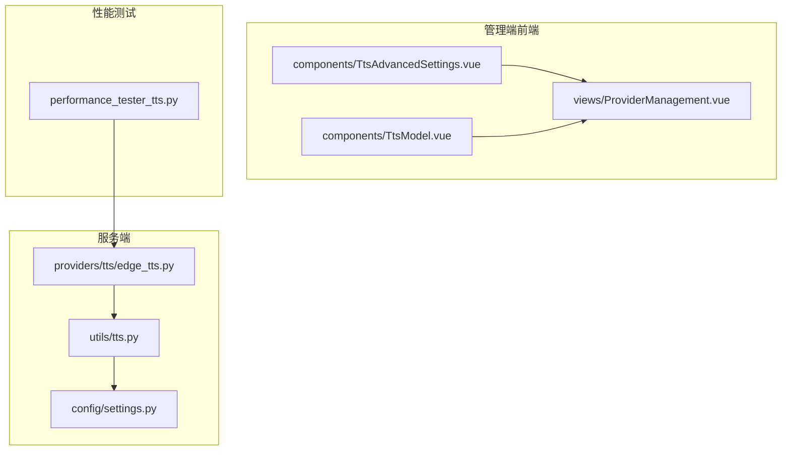
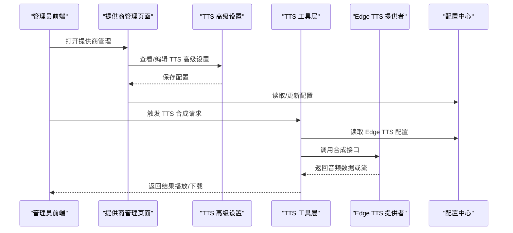
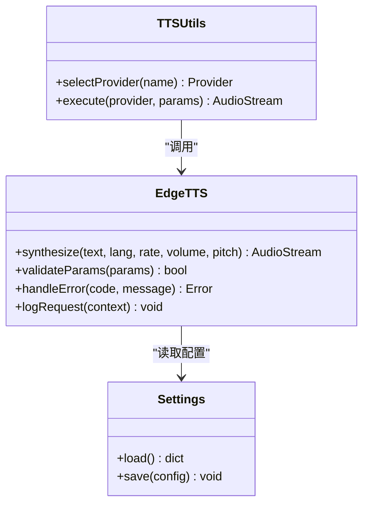
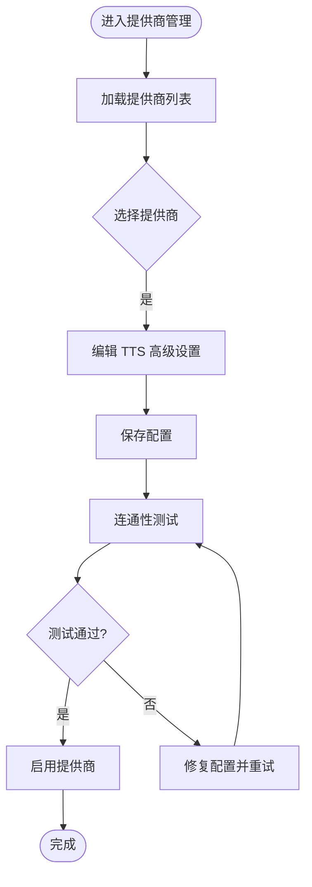
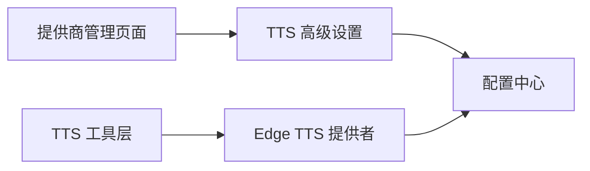

# Edge TTS 提供商

<cite>
**本文档引用的文件**   
- [xiaozhi-server/providers/tts/edge_tts.py](file://main/xiaozhi-server/core/providers/tts/edge_tts.py)
- [xiaozhi-server/utils/tts.py](file://main/xiaozhi-server/core/utils/tts.py)
- [xiaozhi-server/config/settings.py](file://main/xiaozhi-server/config/settings.py)
- [manager-web/src/components/TtsAdvancedSettings.vue](file://main/manager-web/src/components/TtsAdvancedSettings.vue)
- [manager-web/src/components/TtsModel.vue](file://main/manager-web/src/components/TtsModel.vue)
- [manager-web/src/views/ProviderManagement.vue](file://main/manager-web/src/views/ProviderManagement.vue)
- [xiaozhi-server/performance_tester/performance_tester_tts.py](file://main/xiaozhi-server/performance_tester/performance_tester_tts.py)
</cite>

## 目录
1. [简介](#简介)
2. [项目结构](#项目结构)
3. [核心组件](#核心组件)
4. [架构总览](#架构总览)
5. [详细组件分析](#详细组件分析)
6. [依赖关系分析](#依赖关系分析)
7. [性能考量](#性能考量)
8. [故障排查指南](#故障排查指南)
9. [结论](#结论)
10. [附录](#附录)

## 简介
本技术文档面向“Edge TTS 提供商”的集成与使用，聚焦于 Microsoft Edge 浏览器内置 TTS 引擎（Web Speech API）在 Web 端的调用方式，以及在本项目中的后端适配与前端配置。内容涵盖：
- 浏览器兼容性要求与 Web Speech API 使用方法
- 支持的语种、方言与音色数量说明及获取策略
- 实时语音合成的实现原理：流式处理、中断机制、延迟优化
- 音频质量控制、网络稳定性处理与离线降级方案
- 浏览器端与服务器端集成示例（JavaScript 客户端、Python 后端适配）
- 跨平台兼容性、移动端适配与无障碍访问支持

## 项目结构
本项目中，TTS 相关能力主要分布在以下位置：
- 服务端 TTS 提供者实现：core/providers/tts/edge_tts.py
- 通用 TTS 工具与调度：core/utils/tts.py
- 配置管理：config/settings.py
- 管理端前端配置界面：manager-web/src/components/TtsAdvancedSettings.vue、TtsModel.vue、ProviderManagement.vue
- 性能测试脚本：performance_tester/performance_tester_tts.py

图表来源
- [xiaozhi-server/providers/tts/edge_tts.py](file://main/xiaozhi-server/core/providers/tts/edge_tts.py)
- [xiaozhi-server/utils/tts.py](file://main/xiaozhi-server/core/utils/tts.py)
- [xiaozhi-server/config/settings.py](file://main/xiaozhi-server/config/settings.py)
- [manager-web/src/components/TtsAdvancedSettings.vue](file://main/manager-web/src/components/TtsAdvancedSettings.vue)
- [manager-web/src/components/TtsModel.vue](file://main/manager-web/src/components/TtsModel.vue)
- [manager-web/src/views/ProviderManagement.vue](file://main/manager-web/src/views/ProviderManagement.vue)
- [xiaozhi-server/performance_tester/performance_tester_tts.py](file://main/xiaozhi-server/performance_tester/performance_tester_tts.py)

章节来源
- [xiaozhi-server/providers/tts/edge_tts.py](file://main/xiaozhi-server/core/providers/tts/edge_tts.py)
- [xiaozhi-server/utils/tts.py](file://main/xiaozhi-server/core/utils/tts.py)
- [xiaozhi-server/config/settings.py](file://main/xiaozhi-server/config/settings.py)
- [manager-web/src/components/TtsAdvancedSettings.vue](file://main/manager-web/src/components/TtsAdvancedSettings.vue)
- [manager-web/src/components/TtsModel.vue](file://main/manager-web/src/components/TtsModel.vue)
- [manager-web/src/views/ProviderManagement.vue](file://main/manager-web/src/views/ProviderManagement.vue)
- [xiaozhi-server/performance_tester/performance_tester_tts.py](file://main/xiaozhi-server/performance_tester/performance_tester_tts.py)

## 核心组件
- Edge TTS 提供者（服务端）
  - 负责对接系统或浏览器提供的 TTS 能力，封装统一的接口供上层调用
  - 提供文本到音频的转换、参数校验、错误处理与日志记录
- 通用 TTS 工具（服务端）
  - 统一入口与调度逻辑，选择具体 TTS 提供商并执行合成流程
- 配置模块（服务端）
  - 加载与校验 Edge TTS 相关配置项（如语言、音质、重试策略等）
- 管理端前端（Vue 组件）
  - 提供 TTS 高级设置、模型选择与提供商管理的 UI 交互
- 性能测试（服务端）
  - 对 TTS 能力进行基准测试与延迟评估

章节来源
- [xiaozhi-server/providers/tts/edge_tts.py](file://main/xiaozhi-server/core/providers/tts/edge_tts.py)
- [xiaozhi-server/utils/tts.py](file://main/xiaozhi-server/core/utils/tts.py)
- [xiaozhi-server/config/settings.py](file://main/xiaozhi-server/config/settings.py)
- [manager-web/src/components/TtsAdvancedSettings.vue](file://main/manager-web/src/components/TtsAdvancedSettings.vue)
- [manager-web/src/components/TtsModel.vue](file://main/manager-web/src/components/TtsModel.vue)
- [manager-web/src/views/ProviderManagement.vue](file://main/manager-web/src/views/ProviderManagement.vue)

## 架构总览
下图展示了从前端配置到服务端 TTS 提供者的整体交互流程，包括参数传递、提供商选择与执行路径。

图表来源
- [manager-web/src/views/ProviderManagement.vue](file://main/manager-web/src/views/ProviderManagement.vue)
- [manager-web/src/components/TtsAdvancedSettings.vue](file://main/manager-web/src/components/TtsAdvancedSettings.vue)
- [xiaozhi-server/utils/tts.py](file://main/xiaozhi-server/core/utils/tts.py)
- [xiaozhi-server/providers/tts/edge_tts.py](file://main/xiaozhi-server/core/providers/tts/edge_tts.py)
- [xiaozhi-server/config/settings.py](file://main/xiaozhi-server/config/settings.py)

## 详细组件分析

### Edge TTS 提供者（服务端）
- 职责
  - 封装 Edge TTS 能力，对外暴露统一的合成接口
  - 处理参数校验、错误码映射、重试与超时控制
  - 输出标准音频格式，便于播放器直接消费
- 关键实现要点
  - 参数校验：语言、语速、音量、音高、SSML 标记支持
  - 错误处理：网络异常、服务不可用、参数非法等场景
  - 日志记录：请求上下文、耗时统计、失败原因
- 与其他组件的关系
  - 被 TTS 工具层调用，依赖配置中心读取运行时参数

图表来源
- [xiaozhi-server/providers/tts/edge_tts.py](file://main/xiaozhi-server/core/providers/tts/edge_tts.py)
- [xiaozhi-server/utils/tts.py](file://main/xiaozhi-server/core/utils/tts.py)
- [xiaozhi-server/config/settings.py](file://main/xiaozhi-server/config/settings.py)

章节来源
- [xiaozhi-server/providers/tts/edge_tts.py](file://main/xiaozhi-server/core/providers/tts/edge_tts.py)
- [xiaozhi-server/utils/tts.py](file://main/xiaozhi-server/core/utils/tts.py)
- [xiaozhi-server/config/settings.py](file://main/xiaozhi-server/config/settings.py)

### 管理端前端（Vue 组件）
- 提供商管理页面
  - 展示已配置的 TTS 提供商列表，支持新增、编辑、删除
  - 提供连通性测试与状态监控
- TTS 高级设置
  - 提供语言、语速、音量、音高等参数的可视化配置
  - 支持 SSML 模板与常用预设
- TTS 模型选择
  - 根据当前提供商动态渲染可用模型与音色
  - 支持按语言筛选与搜索

图表来源
- [manager-web/src/views/ProviderManagement.vue](file://main/manager-web/src/views/ProviderManagement.vue)
- [manager-web/src/components/TtsAdvancedSettings.vue](file://main/manager-web/src/components/TtsAdvancedSettings.vue)
- [manager-web/src/components/TtsModel.vue](file://main/manager-web/src/components/TtsModel.vue)

章节来源
- [manager-web/src/views/ProviderManagement.vue](file://main/manager-web/src/views/ProviderManagement.vue)
- [manager-web/src/components/TtsAdvancedSettings.vue](file://main/manager-web/src/components/TtsAdvancedSettings.vue)
- [manager-web/src/components/TtsModel.vue](file://main/manager-web/src/components/TtsModel.vue)

### 性能测试（服务端）
- 目标
  - 评估 Edge TTS 的合成延迟、吞吐与稳定性
- 方法
  - 构造不同长度与复杂度的文本输入
  - 统计首包延迟、端到端时延与失败率
  - 生成报告用于调优与回归验证

章节来源
- [xiaozhi-server/performance_tester/performance_tester_tts.py](file://main/xiaozhi-server/performance_tester/performance_tester_tts.py)

## 依赖关系分析
- 组件耦合度
  - Edge TTS 提供者与配置中心强耦合（参数读取）
  - TTS 工具层与提供商弱耦合（接口抽象）
- 外部依赖
  - 浏览器 Web Speech API（前端）
  - 系统 TTS 引擎（后端可选）
- 潜在循环依赖
  - 通过接口抽象避免循环引用

图表来源
- [manager-web/src/views/ProviderManagement.vue](file://main/manager-web/src/views/ProviderManagement.vue)
- [manager-web/src/components/TtsAdvancedSettings.vue](file://main/manager-web/src/components/TtsAdvancedSettings.vue)
- [xiaozhi-server/utils/tts.py](file://main/xiaozhi-server/core/utils/tts.py)
- [xiaozhi-server/providers/tts/edge_tts.py](file://main/xiaozhi-server/core/providers/tts/edge_tts.py)
- [xiaozhi-server/config/settings.py](file://main/xiaozhi-server/config/settings.py)

章节来源
- [manager-web/src/views/ProviderManagement.vue](file://main/manager-web/src/views/ProviderManagement.vue)
- [manager-web/src/components/TtsAdvancedSettings.vue](file://main/manager-web/src/components/TtsAdvancedSettings.vue)
- [xiaozhi-server/utils/tts.py](file://main/xiaozhi-server/core/utils/tts.py)
- [xiaozhi-server/providers/tts/edge_tts.py](file://main/xiaozhi-server/core/providers/tts/edge_tts.py)
- [xiaozhi-server/config/settings.py](file://main/xiaozhi-server/config/settings.py)

## 性能考量
- 流式处理
  - 采用分块合成与边合成边播放，降低首包延迟
  - 合理设置缓冲区大小以平衡延迟与卡顿
- 中断机制
  - 支持打断当前播放任务，释放资源并快速响应新请求
- 延迟优化
  - 预热连接与缓存常用音色元数据
  - 并行请求与超时回退策略
- 音频质量
  - 根据设备能力自适应采样率与编码格式
  - 动态调整语速与音量以提升可懂度
- 网络稳定性
  - 重试与熔断机制，避免雪崩效应
  - 断线重连与状态同步

[本节为通用指导，不直接分析具体文件]

## 故障排查指南
- 常见问题
  - 浏览器不支持 Web Speech API：检测 API 可用性并提供降级提示
  - 语言或音色不可用：校验语言代码与方言组合
  - 合成失败：检查网络状态、权限与配置参数
- 调试建议
  - 启用详细日志，记录请求上下文与错误堆栈
  - 使用性能测试脚本定位瓶颈与不稳定因素
- 恢复策略
  - 自动重试与备用提供商切换
  - 本地缓存与离线播放兜底

章节来源
- [xiaozhi-server/providers/tts/edge_tts.py](file://main/xiaozhi-server/core/providers/tts/edge_tts.py)
- [xiaozhi-server/performance_tester/performance_tester_tts.py](file://main/xiaozhi-server/performance_tester/performance_tester_tts.py)

## 结论
Edge TTS 提供商在本项目中通过清晰的组件分层与接口抽象，实现了前后端协同的配置管理与稳定的合成能力。结合流式处理、中断机制与性能优化策略，能够在多平台与多网络环境下提供高质量的语音合成体验。后续可进一步扩展音色库与智能路由策略，提升用户体验与系统鲁棒性。

[本节为总结性内容，不直接分析具体文件]

## 附录
- 浏览器兼容性
  - 推荐使用最新版本的 Chrome、Edge、Safari 与 Firefox
  - 移动端需确保操作系统版本与浏览器内核支持 Web Speech API
- 无障碍访问
  - 遵循 WAI-ARIA 规范，提供语义化标签与键盘导航
  - 支持屏幕阅读器朗读与焦点管理
- 集成示例
  - JavaScript 客户端：基于 Web Speech API 的文本转语音调用
  - Python 后端适配：封装统一接口，支持参数校验与错误处理

[本节为补充信息，不直接分析具体文件]