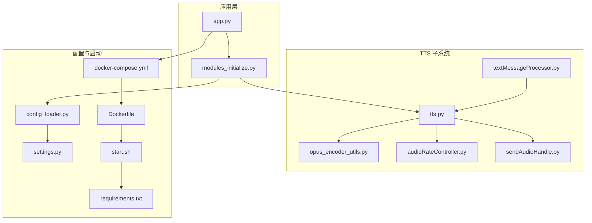
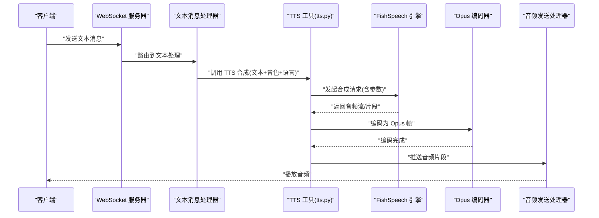
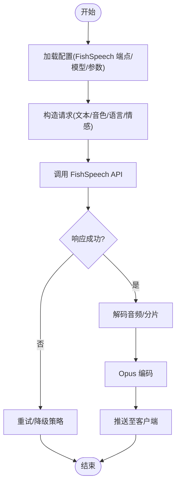
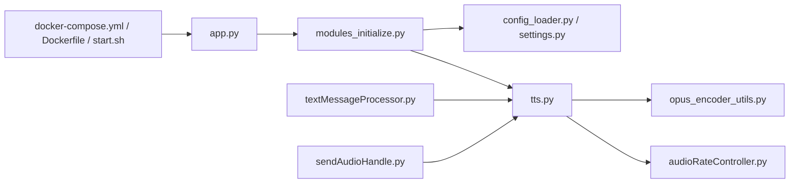

# FishSpeech TTS 提供商

<cite>
**本文引用的文件**   
- [fish-speech-integration.md](file://docs/fish-speech-integration.md)
- [performance_tester_tts.py](file://main/xiaozhi-server/performance_tester/performance_tester_tts.py)
- [performance_tester_stream_tts.py](file://main/xiaozhi-server/performance_tester/performance_tester_stream_tts.py)
- [tts.py](file://main/xiaozhi-server/core/utils/tts.py)
- [opus_encoder_utils.py](file://main/xiaozhi-server/core/utils/opus_encoder_utils.py)
- [audioRateController.py](file://main/xiaozhi-server/core/utils/audioRateController.py)
- [sendAudioHandle.py](file://main/xiaozhi-server/core/handle/sendAudioHandle.py)
- [receiveAudioHandle.py](file://main/xiaozhi-server/core/handle/receiveAudioHandle.py)
- [textMessageProcessor.py](file://main/xiaozhi-server/core/handle/textMessageProcessor.py)
- [modules_initialize.py](file://main/xiaozhi-server/core/utils/modules_initialize.py)
- [config_loader.py](file://main/xiaozhi-server/config/config_loader.py)
- [settings.py](file://main/xiaozhi-server/config/settings.py)
- [app.py](file://main/xiaozhi-server/app.py)
- [docker-compose.yml](file://main/xiaozhi-server/docker-compose.yml)
- [Dockerfile](file://main/xiaozhi-server/Dockerfile)
- [start.sh](file://main/xiaozhi-server/start.sh)
- [requirements.txt](file://main/xiaozhi-server/requirements.txt)
</cite>

## 目录
1. [简介](#简介)
2. [项目结构](#项目结构)
3. [核心组件](#核心组件)
4. [架构总览](#架构总览)
5. [详细组件分析](#详细组件分析)
6. [依赖关系分析](#依赖关系分析)
7. [性能考量](#性能考量)
8. [故障排查指南](#故障排查指南)
9. [结论](#结论)
10. [附录](#附录)

## 简介
本技术文档面向在 xiaozhi-esp32-server 中集成 FishSpeech TTS 的开发者与运维人员，系统阐述本地部署、API 端点配置、模型加载优化、音色与多语言支持、音频质量参数调优、推理性能与内存管理策略，以及语音克隆与个性化音色定制的实现方案。文档同时提供可操作的部署示例、性能测试方法与常见问题解决方案，帮助快速落地并稳定运行。

## 项目结构
FishSpeech TTS 在本项目中的集成涉及以下关键位置：
- 文档与集成说明：docs/fish-speech-integration.md
- TTS 工具与调用入口：core/utils/tts.py
- 音频编码与速率控制：core/utils/opus_encoder_utils.py、core/utils/audioRateController.py
- 音频发送链路：core/handle/sendAudioHandle.py
- 文本处理与消息流：core/handle/textMessageProcessor.py
- 模块初始化与配置加载：core/utils/modules_initialize.py、config/config_loader.py、config/settings.py
- 应用启动与容器化：app.py、docker-compose.yml、Dockerfile、start.sh、requirements.txt
- 性能测试工具：performance_tester/performance_tester_tts.py、performance_tester/performance_tester_stream_tts.py

图表来源
- [app.py](file://main/xiaozhi-server/app.py)
- [modules_initialize.py](file://main/xiaozhi-server/core/utils/modules_initialize.py)
- [tts.py](file://main/xiaozhi-server/core/utils/tts.py)
- [opus_encoder_utils.py](file://main/xiaozhi-server/core/utils/opus_encoder_utils.py)
- [audioRateController.py](file://main/xiaozhi-server/core/utils/audioRateController.py)
- [sendAudioHandle.py](file://main/xiaozhi-server/core/handle/sendAudioHandle.py)
- [textMessageProcessor.py](file://main/xiaozhi-server/core/handle/textMessageProcessor.py)
- [config_loader.py](file://main/xiaozhi-server/config/config_loader.py)
- [settings.py](file://main/xiaozhi-server/config/settings.py)
- [docker-compose.yml](file://main/xiaozhi-server/docker-compose.yml)
- [Dockerfile](file://main/xiaozhi-server/Dockerfile)
- [start.sh](file://main/xiaozhi-server/start.sh)
- [requirements.txt](file://main/xiaozhi-server/requirements.txt)

章节来源
- [fish-speech-integration.md](file://docs/fish-speech-integration.md)
- [tts.py](file://main/xiaozhi-server/core/utils/tts.py)
- [opus_encoder_utils.py](file://main/xiaozhi-server/core/utils/opus_encoder_utils.py)
- [audioRateController.py](file://main/xiaozhi-server/core/utils/audioRateController.py)
- [sendAudioHandle.py](file://main/xiaozhi-server/core/handle/sendAudioHandle.py)
- [textMessageProcessor.py](file://main/xiaozhi-server/core/handle/textMessageProcessor.py)
- [modules_initialize.py](file://main/xiaozhi-server/core/utils/modules_initialize.py)
- [config_loader.py](file://main/xiaozhi-server/config/config_loader.py)
- [settings.py](file://main/xiaozhi-server/config/settings.py)
- [app.py](file://main/xiaozhi-server/app.py)
- [docker-compose.yml](file://main/xiaozhi-server/docker-compose.yml)
- [Dockerfile](file://main/xiaozhi-server/Dockerfile)
- [start.sh](file://main/xiaozhi-server/start.sh)
- [requirements.txt](file://main/xiaozhi-server/requirements.txt)

## 核心组件
- TTS 工具封装（tts.py）：统一对外暴露 TTS 合成接口，负责选择后端（如 FishSpeech）、构造请求参数、处理响应数据流与错误码。
- Opus 编码器（opus_encoder_utils.py）：将 PCM 或 WAV 转换为 Opus 帧，用于低延迟网络传输与播放。
- 音频速率控制器（audioRateController.py）：根据目标采样率与比特率动态调整输出速率，保证播放流畅与资源占用平衡。
- 音频发送处理器（sendAudioHandle.py）：将 TTS 生成的音频片段通过 WebSocket/HTTP 推送至客户端，支持分片与缓冲。
- 文本消息处理器（textMessageProcessor.py）：将 LLM 输出的文本路由到 TTS 管道，支持断句、缓存与并发控制。
- 模块初始化（modules_initialize.py）：按配置加载 TTS、ASR、LLM 等模块，确保依赖就绪。
- 配置加载器（config_loader.py、settings.py）：集中管理环境变量、配置文件与默认值，便于不同环境切换。
- 启动脚本与容器化（app.py、docker-compose.yml、Dockerfile、start.sh、requirements.txt）：定义服务依赖、镜像构建与进程启动流程。

章节来源
- [tts.py](file://main/xiaozhi-server/core/utils/tts.py)
- [opus_encoder_utils.py](file://main/xiaozhi-server/core/utils/opus_encoder_utils.py)
- [audioRateController.py](file://main/xiaozhi-server/core/utils/audioRateController.py)
- [sendAudioHandle.py](file://main/xiaozhi-server/core/handle/sendAudioHandle.py)
- [textMessageProcessor.py](file://main/xiaozhi-server/core/handle/textMessageProcessor.py)
- [modules_initialize.py](file://main/xiaozhi-server/core/utils/modules_initialize.py)
- [config_loader.py](file://main/xiaozhi-server/config/config_loader.py)
- [settings.py](file://main/xiaozhi-server/config/settings.py)

## 架构总览
下图展示从文本输入到音频输出的端到端流程，包含 FishSpeech TTS 的集成点与关键组件交互。

图表来源
- [textMessageProcessor.py](file://main/xiaozhi-server/core/handle/textMessageProcessor.py)
- [tts.py](file://main/xiaozhi-server/core/utils/tts.py)
- [opus_encoder_utils.py](file://main/xiaozhi-server/core/utils/opus_encoder_utils.py)
- [sendAudioHandle.py](file://main/xiaozhi-server/core/handle/sendAudioHandle.py)

## 详细组件分析

### FishSpeech TTS 集成与 API 端点
- 集成方式：通过 tts.py 抽象出统一的 TTS 接口，内部根据配置选择 FishSpeech 后端，设置端点地址、鉴权头、超时与重试策略。
- 端点设置：在 settings.py 与 config_loader.py 中维护 FishSpeech 的 URL、端口、路径、模型版本与可选参数（如采样率、语言代码）。
- 请求构造：将文本、音色 ID、语言、情感强度等参数序列化为引擎要求的格式；对长文本进行分块以避免超时。
- 响应处理：解析音频流或二进制数据，校验状态码与错误信息，失败时触发降级或重试。

图表来源
- [tts.py](file://main/xiaozhi-server/core/utils/tts.py)
- [settings.py](file://main/xiaozhi-server/config/settings.py)
- [config_loader.py](file://main/xiaozhi-server/config/config_loader.py)

章节来源
- [fish-speech-integration.md](file://docs/fish-speech-integration.md)
- [tts.py](file://main/xiaozhi-server/core/utils/tts.py)
- [settings.py](file://main/xiaozhi-server/config/settings.py)
- [config_loader.py](file://main/xiaozhi-server/config/config_loader.py)

### 模型加载与优化
- 模型预热：在 modules_initialize.py 中预加载 FishSpeech 模型权重，减少首次请求延迟。
- 显存管理：限制并发请求数，使用对象池复用缓冲区，避免频繁分配/释放。
- 批处理：对短文本进行合并批处理，提高吞吐；对长文本采用流式分块。
- 缓存策略：对相同文本与参数的结果进行缓存，命中直接返回，降低重复计算。

章节来源
- [modules_initialize.py](file://main/xiaozhi-server/core/utils/modules_initialize.py)
- [tts.py](file://main/xiaozhi-server/core/utils/tts.py)

### 支持的音色类型与多语言合成
- 音色类型：通过音色 ID 映射到 FishSpeech 的 voice 参数，支持预设音色与自定义音色（需上传样本或生成声纹）。
- 多语言：在 settings.py 中配置语言代码（如 zh-CN、en-US），由 tts.py 传递到引擎；对混合语言文本进行分句与语言识别。
- 情感表达：通过情感强度参数（如兴奋、平静）影响韵律与语调，需在 FishSpeech 端点支持该能力。

章节来源
- [tts.py](file://main/xiaozhi-server/core/utils/tts.py)
- [settings.py](file://main/xiaozhi-server/config/settings.py)

### 音频质量参数调优
- 采样率：根据设备与网络条件选择 16k/24k/48k，higher 更清晰但带宽更高。
- 比特率：Opus 编码建议 32-128kbps，实时对话常用 48-64kbps。
- 压缩算法：优先 Opus，兼顾兼容性与低延迟；必要时回退 AAC/MP3。
- 速率控制：audioRateController.py 根据目标采样率与比特率动态调整帧大小与发送间隔。

章节来源
- [opus_encoder_utils.py](file://main/xiaozhi-server/core/utils/opus_encoder_utils.py)
- [audioRateController.py](file://main/xiaozhi-server/core/utils/audioRateController.py)

### 与开源模型的交互方式
- 接口抽象：tts.py 定义统一接口，便于替换或扩展其他开源 TTS（如 PaddleSpeech、VITS）。
- 插件机制：通过 modules_initialize.py 注册不同的 TTS 实现，按配置动态加载。
- 兼容性：对返回格式进行标准化，屏蔽底层差异。

章节来源
- [tts.py](file://main/xiaozhi-server/core/utils/tts.py)
- [modules_initialize.py](file://main/xiaozhi-server/core/utils/modules_initialize.py)

### 推理性能优化与内存管理
- 并发控制：限制同时进行的 TTS 请求数量，避免 GPU/CPU 过载。
- 流式处理：对长文本分块合成，边合成边编码与发送，降低首包延迟。
- 内存回收：及时释放中间缓冲区，启用 GC 阈值监控，防止内存泄漏。
- 日志与指标：记录延迟、吞吐、错误率，辅助定位瓶颈。

章节来源
- [tts.py](file://main/xiaozhi-server/core/utils/tts.py)
- [opus_encoder_utils.py](file://main/xiaozhi-server/core/utils/opus_encoder_utils.py)
- [audioRateController.py](file://main/xiaozhi-server/core/utils/audioRateController.py)

### 部署配置示例
- Docker Compose：在 docker-compose.yml 中定义 FishSpeech 服务、依赖（GPU 运行时、存储卷）、环境变量与端口映射。
- Dockerfile：安装 Python 依赖、编译 Opus 库、拷贝应用代码与配置文件。
- 启动脚本：start.sh 负责健康检查、依赖拉取与服务启动。
- 依赖清单：requirements.txt 列出 Python 包版本，确保可重现构建。

章节来源
- [docker-compose.yml](file://main/xiaozhi-server/docker-compose.yml)
- [Dockerfile](file://main/xiaozhi-server/Dockerfile)
- [start.sh](file://main/xiaozhi-server/start.sh)
- [requirements.txt](file://main/xiaozhi-server/requirements.txt)

### 性能测试方法
- 批量测试：使用 performance_tester_tts.py 对固定文本集进行批量合成，统计平均延迟与吞吐。
- 流式测试：使用 performance_tester_stream_tts.py 模拟真实对话场景，测量首包延迟与抖动。
- 压力测试：增加并发请求，观察 CPU/GPU 利用率、内存峰值与错误率。
- 结果分析：对比不同采样率、比特率与并发度下的表现，选择最优配置。

章节来源
- [performance_tester_tts.py](file://main/xiaozhi-server/performance_tester/performance_tester_tts.py)
- [performance_tester_stream_tts.py](file://main/xiaozhi-server/performance_tester/performance_tester_stream_tts.py)

### 语音克隆与个性化音色定制
- 声纹采集：录制用户语音样本，提取声纹特征并上传至 FishSpeech 管理端。
- 音色训练：使用训练脚本生成个性化模型或更新现有音色库。
- 在线切换：运行时通过音色 ID 动态切换，支持 A/B 对比与灰度发布。
- 质量控制：评估合成自然度与相似度，建立评分与回滚机制。

章节来源
- [fish-speech-integration.md](file://docs/fish-speech-integration.md)
- [tts.py](file://main/xiaozhi-server/core/utils/tts.py)

## 依赖关系分析
FishSpeech TTS 的依赖关系如下：
- 应用层依赖模块初始化与配置加载。
- TTS 工具依赖 Opus 编码器与音频速率控制器。
- 文本消息处理器依赖 TTS 工具。
- 音频发送处理器依赖 TTS 工具。
- 容器化依赖 Docker Compose、Dockerfile 与启动脚本。

图表来源
- [app.py](file://main/xiaozhi-server/app.py)
- [modules_initialize.py](file://main/xiaozhi-server/core/utils/modules_initialize.py)
- [config_loader.py](file://main/xiaozhi-server/config/config_loader.py)
- [settings.py](file://main/xiaozhi-server/config/settings.py)
- [tts.py](file://main/xiaozhi-server/core/utils/tts.py)
- [opus_encoder_utils.py](file://main/xiaozhi-server/core/utils/opus_encoder_utils.py)
- [audioRateController.py](file://main/xiaozhi-server/core/utils/audioRateController.py)
- [textMessageProcessor.py](file://main/xiaozhi-server/core/handle/textMessageProcessor.py)
- [sendAudioHandle.py](file://main/xiaozhi-server/core/handle/sendAudioHandle.py)
- [docker-compose.yml](file://main/xiaozhi-server/docker-compose.yml)
- [Dockerfile](file://main/xiaozhi-server/Dockerfile)
- [start.sh](file://main/xiaozhi-server/start.sh)

章节来源
- [app.py](file://main/xiaozhi-server/app.py)
- [modules_initialize.py](file://main/xiaozhi-server/core/utils/modules_initialize.py)
- [config_loader.py](file://main/xiaozhi-server/config/config_loader.py)
- [settings.py](file://main/xiaozhi-server/config/settings.py)
- [tts.py](file://main/xiaozhi-server/core/utils/tts.py)
- [opus_encoder_utils.py](file://main/xiaozhi-server/core/utils/opus_encoder_utils.py)
- [audioRateController.py](file://main/xiaozhi-server/core/utils/audioRateController.py)
- [textMessageProcessor.py](file://main/xiaozhi-server/core/handle/textMessageProcessor.py)
- [sendAudioHandle.py](file://main/xiaozhi-server/core/handle/sendAudioHandle.py)
- [docker-compose.yml](file://main/xiaozhi-server/docker-compose.yml)
- [Dockerfile](file://main/xiaozhi-server/Dockerfile)
- [start.sh](file://main/xiaozhi-server/start.sh)

## 性能考量
- 延迟优化：流式合成与编码、首包快速返回、减少序列化开销。
- 吞吐提升：批处理短文本、合理设置并发度、利用 GPU 并行。
- 资源控制：限制显存与内存使用，避免 OOM；启用背压与队列限流。
- 监控告警：记录关键指标（延迟、吞吐、错误率、资源使用），设置阈值告警。

[本节为通用指导，不直接分析具体文件]

## 故障排查指南
- 连接失败：检查 FishSpeech 端点可达性、防火墙与证书配置。
- 合成失败：查看错误码与日志，确认文本长度、语言代码与音色 ID 正确。
- 音频异常：验证 Opus 编码参数、采样率与比特率设置，检查网络丢包。
- 性能问题：分析并发度、批大小与缓存命中率，调整资源配置。
- 内存泄漏：监控内存曲线，定位未释放对象，启用 GC 调试。

章节来源
- [tts.py](file://main/xiaozhi-server/core/utils/tts.py)
- [opus_encoder_utils.py](file://main/xiaozhi-server/core/utils/opus_encoder_utils.py)
- [audioRateController.py](file://main/xiaozhi-server/core/utils/audioRateController.py)

## 结论
通过在 xiaozhi-esp32-server 中集成 FishSpeech TTS，可实现高质量、低延迟的语音合成服务。合理的配置、模型加载优化、音频参数调优与性能监控是保障稳定运行的关键。结合语音克隆与个性化音色定制，可进一步提升用户体验与产品差异化。

[本节为总结，不直接分析具体文件]

## 附录
- 最佳实践：
  - 预加载模型与缓存热点结果。
  - 使用流式合成与编码降低首包延迟。
  - 根据设备与网络动态调整采样率与比特率。
  - 建立完善的监控与告警体系。
- 参考文档：
  - docs/fish-speech-integration.md
  - core/utils/tts.py
  - core/utils/opus_encoder_utils.py
  - core/utils/audioRateController.py
  - core/handle/sendAudioHandle.py
  - core/handle/textMessageProcessor.py
  - config/config_loader.py
  - config/settings.py
  - main/xiaozhi-server/performance_tester/performance_tester_tts.py
  - main/xiaozhi-server/performance_tester/performance_tester_stream_tts.py

[本节为附录，不直接分析具体文件]