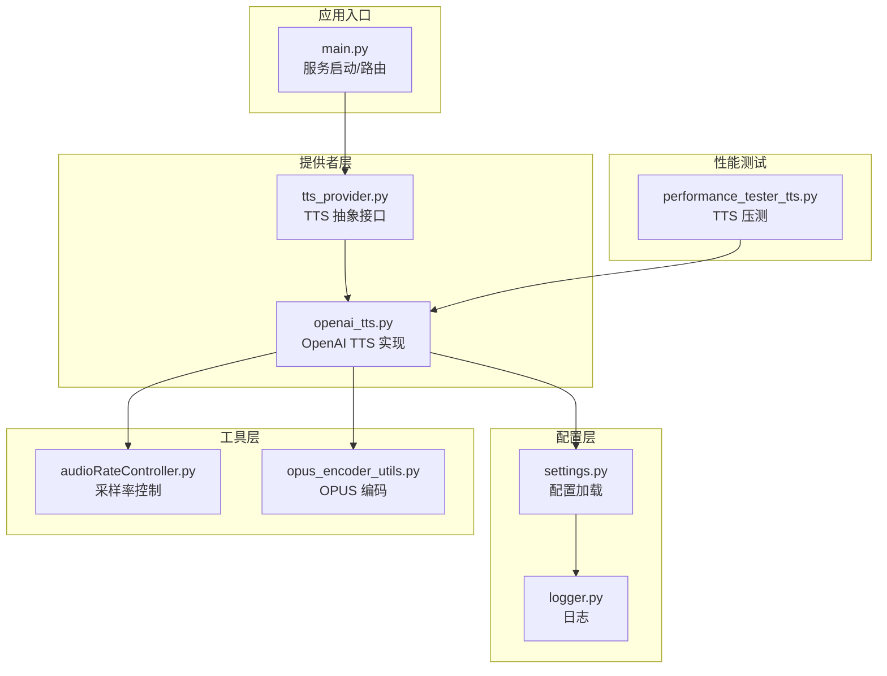
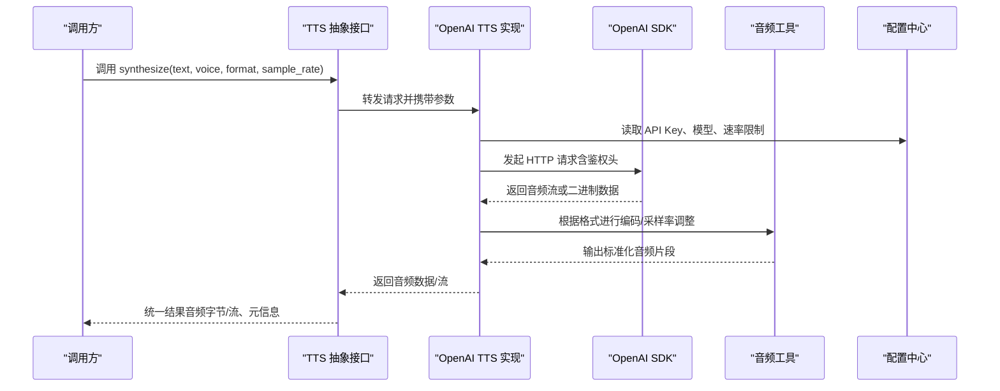
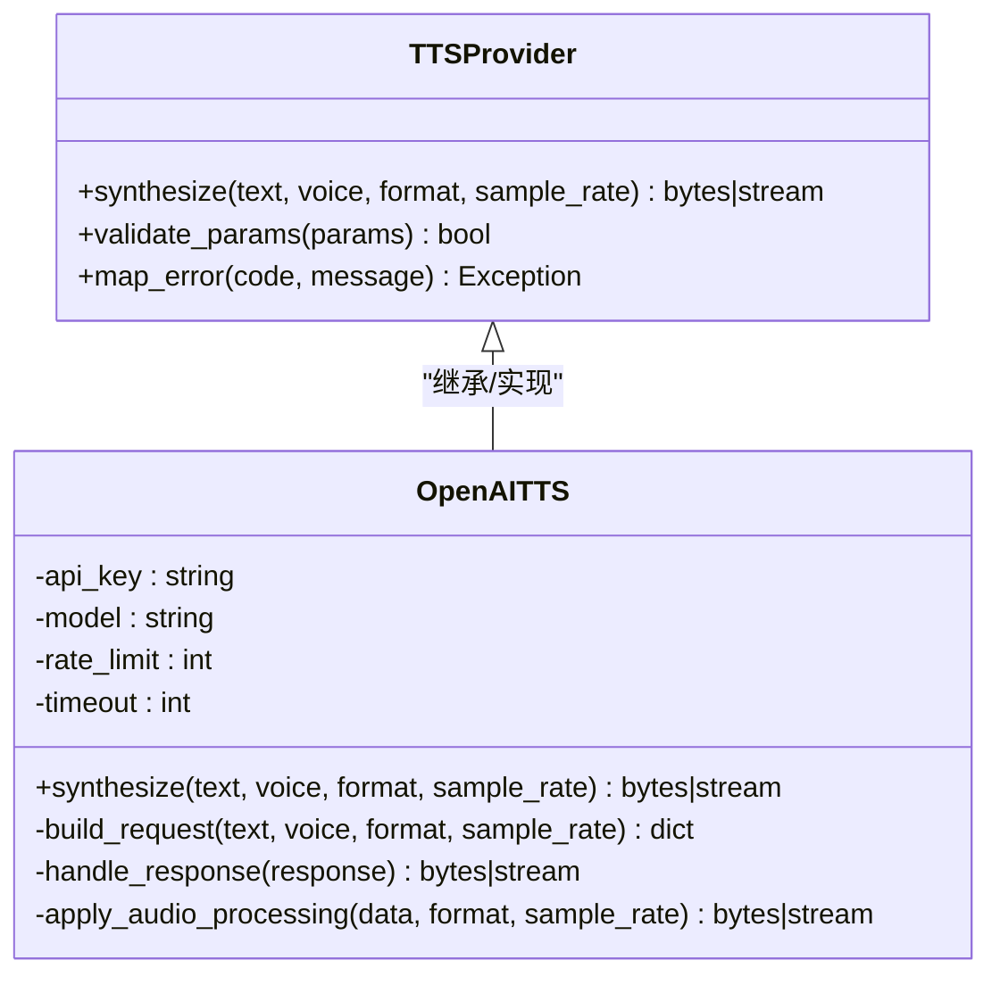
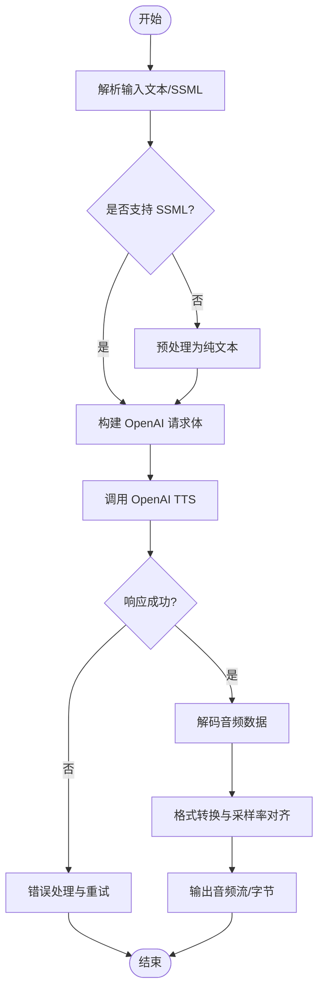
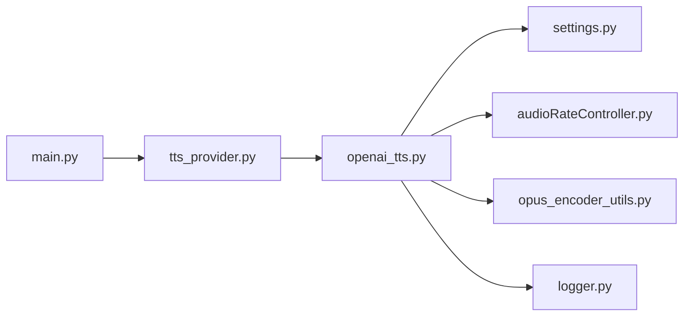

# OpenAI TTS 提供商

<cite>
**本文引用的文件**   
- [main.py](file://main/main.py)
- [tts_provider.py](file://main/core/providers/tts/tts_provider.py)
- [openai_tts.py](file://main/core/providers/tts/openai_tts.py)
- [settings.py](file://main/config/settings.py)
- [logger.py](file://main/config/logger.py)
- [audio_rate_controller.py](file://main/core/utils/audioRateController.py)
- [opus_encoder_utils.py](file://main/core/utils/opus_encoder_utils.py)
- [performance_tester_tts.py](file://main/performance_tester/performance_tester_tts.py)
</cite>

## 目录
1. [简介](#简介)
2. [项目结构](#项目结构)
3. [核心组件](#核心组件)
4. [架构总览](#架构总览)
5. [详细组件分析](#详细组件分析)
6. [依赖关系分析](#依赖关系分析)
7. [性能考量](#性能考量)
8. [故障排查指南](#故障排查指南)
9. [结论](#结论)
10. [附录](#附录)

## 简介
本技术文档面向在项目中集成 OpenAI 语音合成（TTS）的开发者，系统阐述 OpenAI TTS 提供商的实现方式与最佳实践。内容涵盖：
- API Key 配置、请求认证与速率限制处理
- 支持的音色（alloy、echo、fable、onyx、nova、shimmer）及其特点与适用场景
- 文本到语音转换流程，包括 SSML 支持、发音控制、停顿设置
- 音频输出格式（MP3、OPUS、AAC、FLAC）、采样率配置与文件大小优化
- Python SDK 使用示例、错误处理策略与重试机制
- 成本控制、批量处理、异步调用等生产环境优化技巧

## 项目结构
OpenAI TTS 提供商位于服务器端的核心模块中，遵循“按能力域分层 + 按提供商插件化”的组织方式：
- 配置层：集中管理密钥、模型、速率限制、日志等
- 提供者层：抽象 TTS 接口，具体实现以插件形式提供（如 OpenAI TTS）
- 工具层：音频编码、采样率控制、流式处理等通用能力
- 测试与性能：针对 TTS 的性能压测与基准

图表来源
- [main.py:1-200](file://main/main.py#L1-L200)
- [tts_provider.py:1-200](file://main/core/providers/tts/tts_provider.py#L1-L200)
- [openai_tts.py:1-200](file://main/core/providers/tts/openai_tts.py#L1-L200)
- [settings.py:1-200](file://main/config/settings.py#L1-L200)
- [logger.py:1-200](file://main/config/logger.py#L1-L200)
- [audio_rate_controller.py:1-200](file://main/core/utils/audioRateController.py#L1-L200)
- [opus_encoder_utils.py:1-200](file://main/core/utils/opus_encoder_utils.py#L1-L200)
- [performance_tester_tts.py:1-200](file://main/performance_tester/performance_tester_tts.py#L1-L200)

章节来源
- [main.py:1-200](file://main/main.py#L1-L200)
- [tts_provider.py:1-200](file://main/core/providers/tts/tts_provider.py#L1-L200)
- [openai_tts.py:1-200](file://main/core/providers/tts/openai_tts.py#L1-L200)
- [settings.py:1-200](file://main/config/settings.py#L1-L200)
- [logger.py:1-200](file://main/config/logger.py#L1-L200)
- [audio_rate_controller.py:1-200](file://main/core/utils/audioRateController.py#L1-L200)
- [opus_encoder_utils.py:1-200](file://main/core/utils/opus_encoder_utils.py#L1-L200)
- [performance_tester_tts.py:1-200](file://main/performance_tester/performance_tester_tts.py#L1-L200)

## 核心组件
- TTS 抽象接口（Provider）：定义统一的文本转语音方法、参数校验、错误码映射与扩展点
- OpenAI TTS 实现：封装 OpenAI 官方 SDK 调用，处理鉴权、请求构造、响应解析、流式与非流式输出
- 配置中心：集中读取 API Key、模型名、速率限制、并发与超时等关键参数
- 音频工具：采样率控制、编码为 OPUS/MP3/AAC/FLAC、大小估算与分片策略
- 性能测试：模拟高并发与长文本，评估延迟、吞吐与资源占用

章节来源
- [tts_provider.py:1-200](file://main/core/providers/tts/tts_provider.py#L1-L200)
- [openai_tts.py:1-200](file://main/core/providers/tts/openai_tts.py#L1-L200)
- [settings.py:1-200](file://main/config/settings.py#L1-L200)
- [audio_rate_controller.py:1-200](file://main/core/utils/audioRateController.py#L1-L200)
- [opus_encoder_utils.py:1-200](file://main/core/utils/opus_encoder_utils.py#L1-L200)

## 架构总览
下图展示了从上层调用到 OpenAI TTS 的完整链路，包括配置注入、鉴权、请求构建、响应解码与音频后处理。

图表来源
- [tts_provider.py:1-200](file://main/core/providers/tts/tts_provider.py#L1-L200)
- [openai_tts.py:1-200](file://main/core/providers/tts/openai_tts.py#L1-L200)
- [settings.py:1-200](file://main/config/settings.py#L1-L200)
- [audio_rate_controller.py:1-200](file://main/core/utils/audioRateController.py#L1-L200)
- [opus_encoder_utils.py:1-200](file://main/core/utils/opus_encoder_utils.py#L1-L200)

## 详细组件分析

### OpenAI TTS 提供商实现
- 职责
  - 将文本与音色、格式、采样率等参数转换为 OpenAI 请求体
  - 通过 SDK 发起请求，处理流式与非流式响应
  - 对响应进行解码、格式转换与采样率对齐
  - 统一错误码与异常类型，便于上层重试与降级
- 关键点
  - 鉴权：从配置中心读取 API Key，注入到请求头
  - 速率限制：基于配置中的 QPS/并发阈值进行限流与退避
  - 音频格式：支持 MP3、OPUS、AAC、FLAC；默认采样率可配置
  - SSML：若 SDK 支持，则透传 SSML 文本以控制发音与停顿

图表来源
- [tts_provider.py:1-200](file://main/core/providers/tts/tts_provider.py#L1-L200)
- [openai_tts.py:1-200](file://main/core/providers/tts/openai_tts.py#L1-L200)

章节来源
- [openai_tts.py:1-200](file://main/core/providers/tts/openai_tts.py#L1-L200)
- [tts_provider.py:1-200](file://main/core/providers/tts/tts_provider.py#L1-L200)

### 配置与鉴权
- API Key 配置
  - 通过 settings.py 集中管理，避免硬编码
  - 支持环境变量注入与配置文件覆盖
- 请求认证
  - 在每次请求时注入 Authorization 头
  - 失败时记录详细日志以便审计
- 速率限制
  - 基于 QPS 与并发数限制，结合指数退避重试
  - 支持按租户/设备维度隔离配额

章节来源
- [settings.py:1-200](file://main/config/settings.py#L1-L200)
- [logger.py:1-200](file://main/config/logger.py#L1-L200)

### 音频输出与采样率
- 支持格式
  - MP3：兼容性好，体积适中
  - OPUS：压缩率高，适合实时传输
  - AAC：移动端友好
  - FLAC：无损，适合离线存储
- 采样率配置
  - 默认 24kHz/48kHz，可按设备能力切换
  - 通过 audioRateController 进行重采样与对齐
- 文件大小优化
  - 根据时长与比特率估算大小
  - 分片上传与缓存策略降低内存峰值

章节来源
- [audio_rate_controller.py:1-200](file://main/core/utils/audioRateController.py#L1-L200)
- [opus_encoder_utils.py:1-200](file://main/core/utils/opus_encoder_utils.py#L1-L200)

### 文本到语音转换流程（SSML 与发音控制）
- SSML 支持
  - 若 SDK 支持，直接透传 SSML 文本
  - 不支持时，需在上层预处理为纯文本
- 发音控制
  - 通过 SSML 的 prosody、phoneme、break 等标签控制语速、音调与停顿
- 停顿设置
  - 使用 break 标签精确控制停顿时长
  - 结合业务语义自动插入自然停顿

图表来源
- [openai_tts.py:1-200](file://main/core/providers/tts/openai_tts.py#L1-L200)
- [audio_rate_controller.py:1-200](file://main/core/utils/audioRateController.py#L1-L200)

章节来源
- [openai_tts.py:1-200](file://main/core/providers/tts/openai_tts.py#L1-L200)

### 音色支持与适用场景
- alloy：清晰中性，适合新闻播报、客服对话
- echo：温暖柔和，适合故事讲述、情感表达
- fable：富有表现力，适合角色扮演、动画配音
- onyx：沉稳有力，适合男性角色、严肃场景
- nova：明亮活泼，适合儿童内容、轻松对话
- shimmer：优雅细腻，适合高端品牌、冥想引导

章节来源
- [openai_tts.py:1-200](file://main/core/providers/tts/openai_tts.py#L1-L200)

### Python SDK 使用示例与错误处理
- 基本用法
  - 初始化客户端，设置 API Key 与模型
  - 调用 synthesize 方法传入文本与音色
  - 处理返回的音频流或字节数据
- 错误处理
  - 网络异常：重试机制（指数退避）
  - 鉴权失败：提示重新配置 API Key
  - 速率限制：等待并重试，或降级到其他提供商
- 重试机制
  - 基于装饰器或中间件实现
  - 支持最大重试次数与超时控制

章节来源
- [openai_tts.py:1-200](file://main/core/providers/tts/openai_tts.py#L1-L200)
- [logger.py:1-200](file://main/config/logger.py#L1-L200)

### 成本控制、批量处理与异步调用
- 成本控制
  - 监控字符数与音频时长，统计成本
  - 缓存热点文本，减少重复请求
- 批量处理
  - 合并短文本为批次，提升吞吐
  - 分片处理大文本，避免超时
- 异步调用
  - 使用 asyncio 或线程池并行处理
  - 限制并发度，避免触发速率限制

章节来源
- [performance_tester_tts.py:1-200](file://main/performance_tester/performance_tester_tts.py#L1-L200)
- [settings.py:1-200](file://main/config/settings.py#L1-L200)

## 依赖关系分析
OpenAI TTS 提供商依赖配置中心、音频工具与日志模块，形成清晰的解耦结构。

图表来源
- [openai_tts.py:1-200](file://main/core/providers/tts/openai_tts.py#L1-L200)
- [tts_provider.py:1-200](file://main/core/providers/tts/tts_provider.py#L1-L200)
- [settings.py:1-200](file://main/config/settings.py#L1-L200)
- [audio_rate_controller.py:1-200](file://main/core/utils/audioRateController.py#L1-L200)
- [opus_encoder_utils.py:1-200](file://main/core/utils/opus_encoder_utils.py#L1-L200)
- [logger.py:1-200](file://main/config/logger.py#L1-L200)
- [main.py:1-200](file://main/main.py#L1-L200)

章节来源
- [openai_tts.py:1-200](file://main/core/providers/tts/openai_tts.py#L1-L200)
- [tts_provider.py:1-200](file://main/core/providers/tts/tts_provider.py#L1-L200)
- [settings.py:1-200](file://main/config/settings.py#L1-L200)
- [audio_rate_controller.py:1-200](file://main/core/utils/audioRateController.py#L1-L200)
- [opus_encoder_utils.py:1-200](file://main/core/utils/opus_encoder_utils.py#L1-L200)
- [logger.py:1-200](file://main/config/logger.py#L1-L200)
- [main.py:1-200](file://main/main.py#L1-L200)

## 性能考量
- 延迟优化
  - 启用流式响应，边生成边播放
  - 预取下一段文本，减少等待时间
- 吞吐优化
  - 合理设置并发度，避免过载
  - 使用连接池复用 HTTP 连接
- 资源优化
  - 控制音频缓冲区大小，降低内存峰值
  - 及时释放临时文件与缓存

章节来源
- [performance_tester_tts.py:1-200](file://main/performance_tester/performance_tester_tts.py#L1-L200)
- [audio_rate_controller.py:1-200](file://main/core/utils/audioRateController.py#L1-L200)

## 故障排查指南
- 常见问题
  - API Key 无效：检查配置与环境变量
  - 速率限制：降低并发或增加配额
  - 音频格式不支持：确认目标设备兼容性
- 调试技巧
  - 开启详细日志，记录请求与响应
  - 使用性能测试脚本模拟负载
  - 逐步缩小问题范围，定位具体环节

章节来源
- [logger.py:1-200](file://main/config/logger.py#L1-L200)
- [performance_tester_tts.py:1-200](file://main/performance_tester/performance_tester_tts.py#L1-L200)

## 结论
OpenAI TTS 提供商在本项目中实现了高内聚、低耦合的设计，通过抽象接口与插件化实现，便于扩展与维护。结合配置中心、音频工具与性能测试，提供了完整的端到端解决方案。建议在生产环境中充分测试并发与稳定性，并根据业务需求选择合适的音色与格式。

## 附录
- 最佳实践清单
  - 始终使用环境变量管理敏感信息
  - 实施幂等性与重试机制
  - 监控关键指标（延迟、错误率、成本）
  - 定期更新 SDK 与依赖库
- 参考链接
  - OpenAI TTS 官方文档
  - 项目内部配置模板与示例