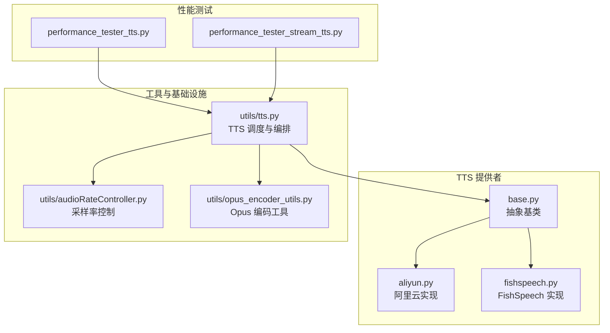
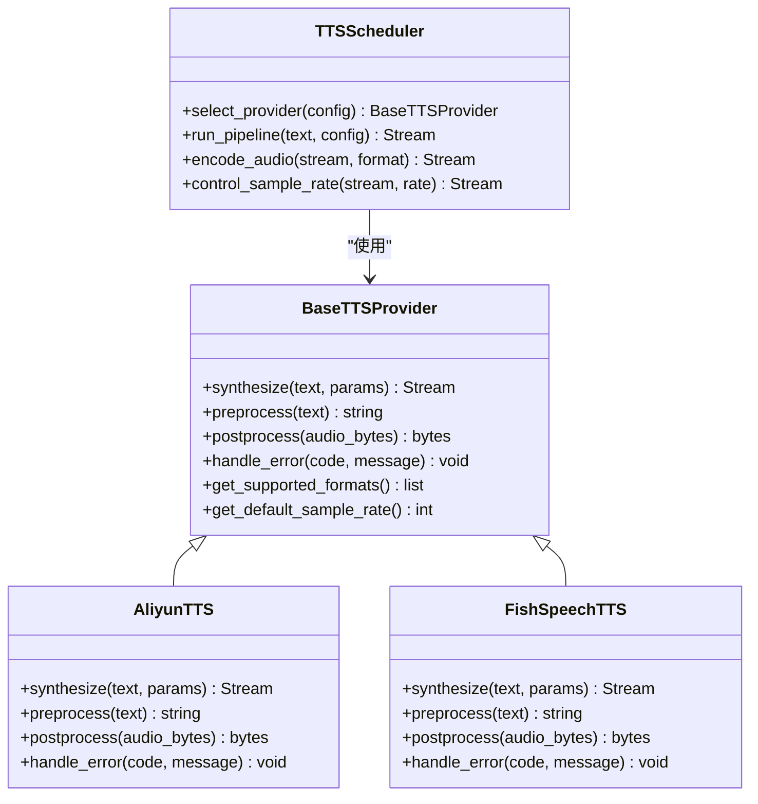
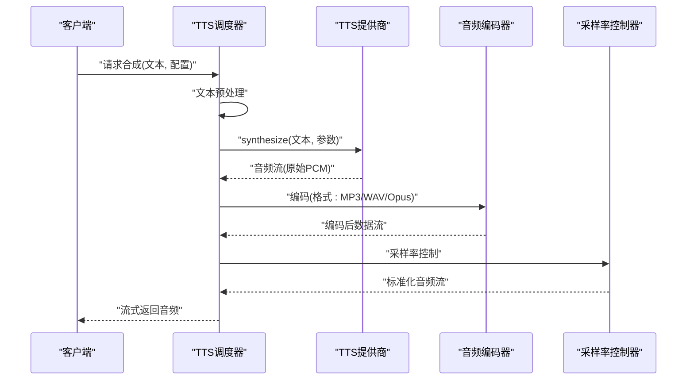
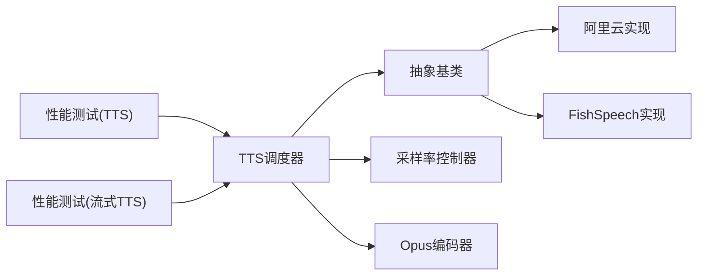

# TTS 基础架构

<cite>
**本文引用的文件**   
- [core/providers/tts/base.py](file://main/xiaozhi-server/core/providers/tts/base.py)
- [core/providers/tts/aliyun.py](file://main/xiaozhi-server/core/providers/tts/aliyun.py)
- [core/providers/tts/fishspeech.py](file://main/xiaozhi-server/core/providers/tts/fishspeech.py)
- [core/utils/tts.py](file://main/xiaozhi-server/core/utils/tts.py)
- [core/utils/audioRateController.py](file://main/xiaozhi-server/core/utils/audioRateController.py)
- [core/utils/opus_encoder_utils.py](file://main/xiaozhi-server/core/utils/opus_encoder_utils.py)
- [performance_tester/performance_tester_tts.py](file://main/xiaozhi-server/performance_tester/performance_tester_tts.py)
- [performance_tester/performance_tester_stream_tts.py](file://main/xiaozhi-server/performance_tester/performance_tester_stream_tts.py)
</cite>

## 目录
1. [简介](#简介)
2. [项目结构](#项目结构)
3. [核心组件](#核心组件)
4. [架构总览](#架构总览)
5. [详细组件分析](#详细组件分析)
6. [依赖关系分析](#依赖关系分析)
7. [性能考量](#性能考量)
8. [故障排查指南](#故障排查指南)
9. [结论](#结论)
10. [附录](#附录)

## 简介
本技术文档围绕 TTS（文本转语音）基础架构展开，系统性阐述抽象类设计模式、统一接口定义、音频流处理机制与核心合成流程。内容覆盖：
- 文本预处理、TTS 引擎调用、音频编码与流式传输
- 多提供商统一接口、配置管理、错误处理与性能监控
- 音频格式支持（MP3、WAV、Opus）、采样率控制与音量调节
- 自定义 TTS 提供商扩展、音频处理能力增强与性能优化实践

## 项目结构
TTS 相关代码主要位于 xiaozhi-server 的 core/providers/tts 与 core/utils 目录，配合 performance_tester 中的测试脚本进行验证与基准评估。整体组织遵循“提供者抽象 + 具体实现 + 工具链”的分层模式。

图表来源
- [core/providers/tts/base.py](file://main/xiaozhi-server/core/providers/tts/base.py)
- [core/providers/tts/aliyun.py](file://main/xiaozhi-server/core/providers/tts/aliyun.py)
- [core/providers/tts/fishspeech.py](file://main/xiaozhi-server/core/providers/tts/fishspeech.py)
- [core/utils/tts.py](file://main/xiaozhi-server/core/utils/tts.py)
- [core/utils/audioRateController.py](file://main/xiaozhi-server/core/utils/audioRateController.py)
- [core/utils/opus_encoder_utils.py](file://main/xiaozhi-server/core/utils/opus_encoder_utils.py)
- [performance_tester/performance_tester_tts.py](file://main/xiaozhi-server/performance_tester/performance_tester_tts.py)
- [performance_tester/performance_tester_stream_tts.py](file://main/xiaozhi-server/performance_tester/performance_tester_stream_tts.py)

章节来源
- [core/providers/tts/base.py](file://main/xiaozhi-server/core/providers/tts/base.py)
- [core/utils/tts.py](file://main/xiaozhi-server/core/utils/tts.py)

## 核心组件
- 抽象基类（Base TTS Provider）
  - 定义统一的 TTS 接口契约：文本预处理、合成调用、音频流读取、结束信号、错误码与状态上报等
  - 提供可复用的生命周期钩子与默认行为，便于各提供商快速实现
- 具体提供商实现
  - 阿里云 TTS：对接云端 API，处理鉴权、请求参数、流式响应与错误映射
  - FishSpeech：本地或私有化部署的 TTS 服务，封装 HTTP/gRPC 调用与流式解码
- TTS 调度与编排（utils/tts.py）
  - 根据配置选择提供商、组装文本、驱动合成、编码与流式输出
  - 集成采样率控制与 Opus 编码工具，保证端到端一致性与低延迟
- 音频工具链
  - 采样率控制器：动态调整播放速率，补偿网络抖动与设备差异
  - Opus 编码器：高效压缩与流式打包，适配移动端与嵌入式设备

章节来源
- [core/providers/tts/base.py](file://main/xiaozhi-server/core/providers/tts/base.py)
- [core/providers/tts/aliyun.py](file://main/xiaozhi-server/core/providers/tts/aliyun.py)
- [core/providers/tts/fishspeech.py](file://main/xiaozhi-server/core/providers/tts/fishspeech.py)
- [core/utils/tts.py](file://main/xiaozhi-server/core/utils/tts.py)
- [core/utils/audioRateController.py](file://main/xiaozhi-server/core/utils/audioRateController.py)
- [core/utils/opus_encoder_utils.py](file://main/xiaozhi-server/core/utils/opus_encoder_utils.py)

## 架构总览
TTS 架构采用“抽象基类 + 多提供商实现 + 工具链编排”的模式，确保可扩展性、可维护性与高性能。

图表来源
- [core/providers/tts/base.py](file://main/xiaozhi-server/core/providers/tts/base.py)
- [core/providers/tts/aliyun.py](file://main/xiaozhi-server/core/providers/tts/aliyun.py)
- [core/providers/tts/fishspeech.py](file://main/xiaozhi-server/core/providers/tts/fishspeech.py)
- [core/utils/tts.py](file://main/xiaozhi-server/core/utils/tts.py)

## 详细组件分析

### 抽象基类与统一接口
- 设计要点
  - 统一入口：synthesize(text, params) 返回音频流，屏蔽不同提供商的差异
  - 文本预处理：preprocess(text) 负责清洗、分句、标点规范化与长度限制
  - 后处理：postprocess(audio_bytes) 负责格式转换、降噪、响度归一化
  - 错误处理：handle_error(code, message) 标准化异常并上报监控
  - 能力声明：get_supported_formats() 与 get_default_sample_rate() 暴露能力元数据
- 扩展点
  - 新增提供商只需继承基类并实现必要方法，即可接入调度器
  - 可通过钩子注入缓存、重试、熔断等横切逻辑

章节来源
- [core/providers/tts/base.py](file://main/xiaozhi-server/core/providers/tts/base.py)

### 阿里云 TTS 提供商
- 功能特性
  - 鉴权与签名：自动处理 Token 获取与刷新
  - 参数映射：将通用参数转换为阿里云 API 所需字段
  - 流式响应：按块读取音频帧，降低首包延迟
  - 错误映射：将云端错误码映射为内部标准错误
- 性能优化
  - 连接池复用与超时控制
  - 自适应重传与退避策略

章节来源
- [core/providers/tts/aliyun.py](file://main/xiaozhi-server/core/providers/tts/aliyun.py)

### FishSpeech TTS 提供商
- 功能特性
  - 本地/私有化部署：通过 HTTP/gRPC 调用本地模型服务
  - 流式解码：边生成边解码，减少内存峰值
  - 参数调优：支持音色、语速、情感等高级参数
- 可靠性保障
  - 健康检查与降级策略
  - 资源占用监控与告警

章节来源
- [core/providers/tts/fishspeech.py](file://main/xiaozhi-server/core/providers/tts/fishspeech.py)

### TTS 调度与编排（utils/tts.py）
- 核心职责
  - 提供商选择：依据配置与运行时条件动态选择最优提供商
  - 流水线编排：串联文本预处理、合成、编码、采样率控制与流式输出
  - 监控埋点：记录关键指标（时延、吞吐、错误率）
- 扩展性
  - 插件化架构：新增提供商无需修改调度逻辑
  - 配置热更新：支持运行时切换提供商与参数

章节来源
- [core/utils/tts.py](file://main/xiaozhi-server/core/utils/tts.py)

### 音频工具链
- 采样率控制器（audioRateController.py）
  - 动态调整：根据网络状况与设备能力实时调整采样率
  - 平滑过渡：避免突变导致的音质劣化
- Opus 编码器（opus_encoder_utils.py）
  - 高效压缩：在保持音质的同时显著降低带宽占用
  - 流式打包：支持分片传输与乱序恢复

章节来源
- [core/utils/audioRateController.py](file://main/xiaozhi-server/core/utils/audioRateController.py)
- [core/utils/opus_encoder_utils.py](file://main/xiaozhi-server/core/utils/opus_encoder_utils.py)

### 核心流程时序图

图表来源
- [core/utils/tts.py](file://main/xiaozhi-server/core/utils/tts.py)
- [core/providers/tts/base.py](file://main/xiaozhi-server/core/providers/tts/base.py)
- [core/utils/opus_encoder_utils.py](file://main/xiaozhi-server/core/utils/opus_encoder_utils.py)
- [core/utils/audioRateController.py](file://main/xiaozhi-server/core/utils/audioRateController.py)

## 依赖关系分析
TTS 模块依赖清晰，耦合度低，内聚性强。

图表来源
- [core/utils/tts.py](file://main/xiaozhi-server/core/utils/tts.py)
- [core/providers/tts/base.py](file://main/xiaozhi-server/core/providers/tts/base.py)
- [core/providers/tts/aliyun.py](file://main/xiaozhi-server/core/providers/tts/aliyun.py)
- [core/providers/tts/fishspeech.py](file://main/xiaozhi-server/core/providers/tts/fishspeech.py)
- [core/utils/audioRateController.py](file://main/xiaozhi-server/core/utils/audioRateController.py)
- [core/utils/opus_encoder_utils.py](file://main/xiaozhi-server/core/utils/opus_encoder_utils.py)
- [performance_tester/performance_tester_tts.py](file://main/xiaozhi-server/performance_tester/performance_tester_tts.py)
- [performance_tester/performance_tester_stream_tts.py](file://main/xiaozhi-server/performance_tester/performance_tester_stream_tts.py)

章节来源
- [core/utils/tts.py](file://main/xiaozhi-server/core/utils/tts.py)
- [core/providers/tts/base.py](file://main/xiaozhi-server/core/providers/tts/base.py)

## 性能考量
- 首包延迟优化
  - 流式合成：边生成边传输，减少等待时间
  - 预取与缓冲：合理设置缓冲区大小，平衡延迟与稳定性
- 吞吐量提升
  - 并发控制：限制并行合成任务数，避免资源争用
  - 批量处理：合并短文本请求，提高编码器效率
- 资源管理
  - 连接池复用：减少握手开销
  - 内存池：复用音频缓冲区，降低 GC 压力
- 监控与告警
  - 关键指标：QPS、P99 延迟、错误率、CPU/内存占用
  - 动态降级：当某提供商不可用时自动切换

[本节为通用指导，不直接分析具体文件]

## 故障排查指南
- 常见问题定位
  - 文本预处理失败：检查输入合法性、长度限制与特殊字符处理
  - 提供商调用超时：确认网络连通性、鉴权状态与 API 配额
  - 音频编码异常：验证格式支持、采样率兼容性与编码器状态
  - 流式传输中断：检查缓冲区大小、网络抖动与重连策略
- 调试技巧
  - 启用详细日志：记录关键步骤与参数
  - 模拟故障：注入延迟、丢包与错误码，验证健壮性
  - 性能剖析：使用 profiling 工具定位瓶颈

章节来源
- [performance_tester/performance_tester_tts.py](file://main/xiaozhi-server/performance_tester/performance_tester_tts.py)
- [performance_tester/performance_tester_stream_tts.py](file://main/xiaozhi-server/performance_tester/performance_tester_stream_tts.py)

## 结论
本 TTS 基础架构通过抽象基类与统一接口实现了多提供商无缝接入，结合高效的音频工具链与调度编排，提供了高可用、高性能且易扩展的语音合成解决方案。未来可进一步引入智能路由、自适应编码与更细粒度的监控能力，以应对复杂场景下的多样化需求。

[本节为总结性内容，不直接分析具体文件]

## 附录
- 自定义 TTS 提供商实现步骤
  - 继承抽象基类并实现必要方法
  - 注册到调度器配置中
  - 编写单元测试与性能基准
- 音频处理能力扩展
  - 新增编码器：实现编解码接口并集成到工具链
  - 效果处理器：插入降噪、均衡、混响等处理节点
- 性能优化最佳实践
  - 合理配置并发与缓冲区
  - 使用连接池与内存池
  - 实施渐进式降级与熔断

[本节为概念性内容，不直接分析具体文件]