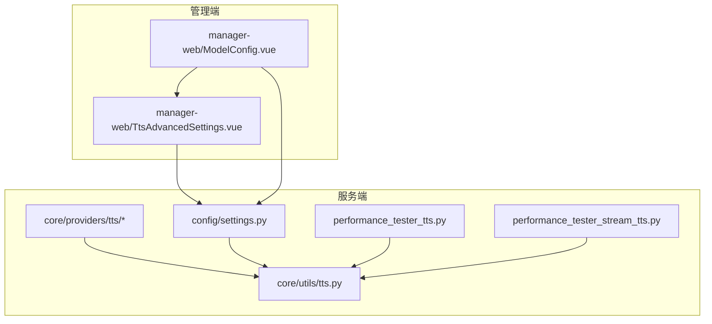
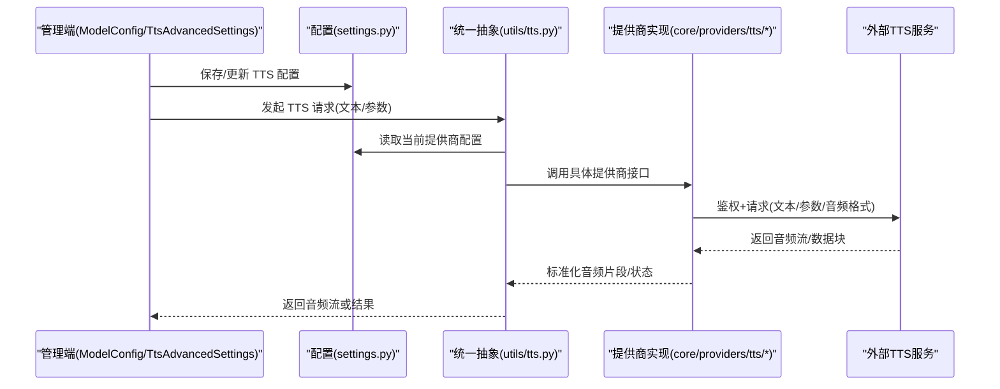
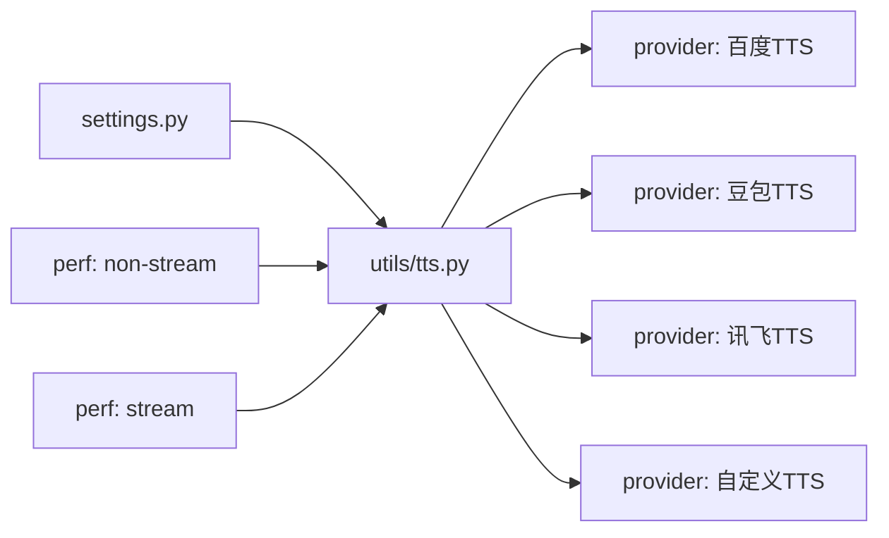

# 其他 TTS 提供商

<cite>
**本文引用的文件**   
- [xiaozhi-server/core/providers/tts/](file://main/xiaozhi-server/core/providers/tts/)
- [xiaozhi-server/core/utils/tts.py](file://main/xiaozhi-server/core/utils/tts.py)
- [xiaozhi-server/config/settings.py](file://main/xiaozhi-server/config/settings.py)
- [xiaozhi-server/performance_tester/performance_tester_tts.py](file://main/xiaozhi-server/performance_tester/performance_tester_tts.py)
- [xiaozhi-server/performance_tester/performance_tester_stream_tts.py](file://main/xiaozhi-server/performance_tester/performance_tester_stream_tts.py)
- [manager-web/src/components/TtsAdvancedSettings.vue](file://main/manager-web/src/components/TtsAdvancedSettings.vue)
- [manager-web/src/views/ModelConfig.vue](file://main/manager-web/src/views/ModelConfig.vue)
</cite>

## 目录
1. [简介](#简介)
2. [项目结构](#项目结构)
3. [核心组件](#核心组件)
4. [架构总览](#架构总览)
5. [详细组件分析](#详细组件分析)
6. [依赖关系分析](#依赖关系分析)
7. [性能考量](#性能考量)
8. [故障排查指南](#故障排查指南)
9. [结论](#结论)
10. [附录](#附录)

## 简介
本技术文档面向希望集成“百度 TTS、抖音豆包 TTS、讯飞 TTS、自定义 TTS”等第三方语音合成（TTS）提供商的开发者。文档基于仓库中 TTS 相关实现与配置，系统阐述各提供商的配置参数、API 接口、认证方式、限流策略，并对比其特色能力（如情感合成、实时对话、方言支持）。同时提供自定义 TTS 提供商的开发规范（接口约定、音频格式处理、错误码映射），以及混合使用、负载均衡与故障转移等高级场景实践建议。

## 项目结构
本项目将 TTS 能力以“提供商插件化”的方式组织在 xiaozhi-server 的 providers/tts 目录下，并通过统一的 utils/tts 抽象层进行调用；管理端通过 manager-web 的 ModelConfig 与 TtsAdvancedSettings 页面完成可视化配置与参数下发。

图表来源 
- [xiaozhi-server/core/providers/tts/](file://main/xiaozhi-server/core/providers/tts/)
- [xiaozhi-server/core/utils/tts.py](file://main/xiaozhi-server/core/utils/tts.py)
- [xiaozhi-server/config/settings.py](file://main/xiaozhi-server/config/settings.py)
- [xiaozhi-server/performance_tester/performance_tester_tts.py](file://main/xiaozhi-server/performance_tester/performance_tester_tts.py)
- [xiaozhi-server/performance_tester/performance_tester_stream_tts.py](file://main/xiaozhi-server/performance_tester/performance_tester_stream_tts.py)
- [manager-web/src/views/ModelConfig.vue](file://main/manager-web/src/views/ModelConfig.vue)
- [manager-web/src/components/TtsAdvancedSettings.vue](file://main/manager-web/src/components/TtsAdvancedSettings.vue)

章节来源
- [xiaozhi-server/core/providers/tts/](file://main/xiaozhi-server/core/providers/tts/)
- [xiaozhi-server/core/utils/tts.py](file://main/xiaozhi-server/core/utils/tts.py)
- [xiaozhi-server/config/settings.py](file://main/xiaozhi-server/config/settings.py)
- [manager-web/src/views/ModelConfig.vue](file://main/manager-web/src/views/ModelConfig.vue)
- [manager-web/src/components/TtsAdvancedSettings.vue](file://main/manager-web/src/components/TtsAdvancedSettings.vue)

## 核心组件
- 提供商抽象与统一入口：core/utils/tts.py 提供统一的 TTS 调用封装，屏蔽不同提供商的差异，向上暴露一致的接口（文本输入、音频输出、流式/非流式模式、错误处理）。
- 提供商实现：core/providers/tts/ 下按厂商划分具体实现，每个实现负责鉴权、请求构造、响应解析、音频编码与分片、重试与限流。
- 配置中心：config/settings.py 集中管理各提供商的密钥、端点、模型、并发与超时等参数，供运行时加载。
- 性能测试：performance_tester_tts.py 与 performance_tester_stream_tts.py 用于评估端到端时延、吞吐、首包延迟等指标。
- 管理端配置：ModelConfig.vue 与 TtsAdvancedSettings.vue 提供可视化的 TTS 模型选择、参数调节与高级设置。

章节来源
- [xiaozhi-server/core/utils/tts.py](file://main/xiaozhi-server/core/utils/tts.py)
- [xiaozhi-server/core/providers/tts/](file://main/xiaozhi-server/core/providers/tts/)
- [xiaozhi-server/config/settings.py](file://main/xiaozhi-server/config/settings.py)
- [xiaozhi-server/performance_tester/performance_tester_tts.py](file://main/xiaozhi-server/performance_tester/performance_tester_tts.py)
- [xiaozhi-server/performance_tester/performance_tester_stream_tts.py](file://main/xiaozhi-server/performance_tester/performance_tester_stream_tts.py)
- [manager-web/src/views/ModelConfig.vue](file://main/manager-web/src/views/ModelConfig.vue)
- [manager-web/src/components/TtsAdvancedSettings.vue](file://main/manager-web/src/components/TtsAdvancedSettings.vue)

## 架构总览
下图展示了从管理端配置到服务端 TTS 调用的整体流程，包括多提供商路由、统一抽象层与性能测试工具。

图表来源 
- [manager-web/src/views/ModelConfig.vue](file://main/manager-web/src/views/ModelConfig.vue)
- [manager-web/src/components/TtsAdvancedSettings.vue](file://main/manager-web/src/components/TtsAdvancedSettings.vue)
- [xiaozhi-server/config/settings.py](file://main/xiaozhi-server/config/settings.py)
- [xiaozhi-server/core/utils/tts.py](file://main/xiaozhi-server/core/utils/tts.py)
- [xiaozhi-server/core/providers/tts/](file://main/xiaozhi-server/core/providers/tts/)

## 详细组件分析

### 统一抽象层 core/utils/tts.py
- 职责：对外暴露统一的 TTS 调用方法，内部根据配置动态选择提供商实现；对音频格式、错误码、重试与限流进行统一处理。
- 关键行为：
  - 参数校验与默认值填充
  - 提供商路由与实例化
  - 流式与非流式两种模式适配
  - 错误码归一化与异常上抛
  - 性能埋点（耗时、字节数、失败率）

章节来源
- [xiaozhi-server/core/utils/tts.py](file://main/xiaozhi-server/core/utils/tts.py)

### 提供商实现 core/providers/tts/*
- 组织方式：每个子模块对应一个 TTS 提供商，包含鉴权、请求构建、响应解析、音频编码与分片、重试与限流逻辑。
- 通用要求：
  - 鉴权：支持 AK/SK、Token、签名等方式
  - 接口：REST/HTTP 或 WebSocket/流式接口
  - 音频：支持 PCM/WAV/OPUS/MP3 等常见格式，需按下游要求编码
  - 错误：将上游错误码映射为统一错误码
  - 限流：本地令牌桶/滑动窗口 + 全局配额控制
  - 重试：指数退避 + 幂等键（如适用）

章节来源
- [xiaozhi-server/core/providers/tts/](file://main/xiaozhi-server/core/providers/tts/)

### 配置中心 config/settings.py
- 作用：集中管理 TTS 提供商的密钥、端点、模型、并发、超时、缓存、日志级别等。
- 典型字段：
  - 提供商开关与优先级
  - 鉴权信息（AK/SK/Token）
  - 模型与音色参数（语速、音调、情感、方言）
  - 网络与超时、重试次数
  - 限流阈值与配额
  - 音频格式与采样率

章节来源
- [xiaozhi-server/config/settings.py](file://main/xiaozhi-server/config/settings.py)

### 管理端配置 UI
- ModelConfig.vue：选择 TTS 提供商与模型，维护基础配置。
- TtsAdvancedSettings.vue：高级参数（语速、音调、情感、方言、流式选项、重试与限流）可视化编辑。

章节来源
- [manager-web/src/views/ModelConfig.vue](file://main/manager-web/src/views/ModelConfig.vue)
- [manager-web/src/components/TtsAdvancedSettings.vue](file://main/manager-web/src/components/TtsAdvancedSettings.vue)

### 性能测试工具
- performance_tester_tts.py：批量非流式评测，统计平均时延、P95/P99、吞吐、失败率。
- performance_tester_stream_tts.py：流式评测，统计首包延迟、端到端时延、抖动、丢包影响。

章节来源
- [xiaozhi-server/performance_tester/performance_tester_tts.py](file://main/xiaozhi-server/performance_tester/performance_tester_tts.py)
- [xiaozhi-server/performance_tester/performance_tester_stream_tts.py](file://main/xiaozhi-server/performance_tester/performance_tester_stream_tts.py)

## 依赖关系分析
- 耦合度：utils/tts.py 作为中间层，降低上层业务与具体提供商的耦合；providers/tts/* 仅依赖 settings 与网络库。
- 内聚性：每个提供商实现自包含，便于独立测试与替换。
- 外部依赖：HTTP/WebSocket 客户端、音频编解码库、日志与监控 SDK。
- 潜在循环依赖：应避免 providers 反向依赖 utils；确保仅在 utils 层做路由与统一封装。

图表来源 
- [xiaozhi-server/core/utils/tts.py](file://main/xiaozhi-server/core/utils/tts.py)
- [xiaozhi-server/config/settings.py](file://main/xiaozhi-server/config/settings.py)
- [xiaozhi-server/performance_tester/performance_tester_tts.py](file://main/xiaozhi-server/performance_tester/performance_tester_tts.py)
- [xiaozhi-server/performance_tester/performance_tester_stream_tts.py](file://main/xiaozhi-server/performance_tester/performance_tester_stream_tts.py)
- [xiaozhi-server/core/providers/tts/](file://main/xiaozhi-server/core/providers/tts/)

## 性能考量
- 首包延迟：优先选择支持流式输出的提供商，减少等待时间。
- 吞吐与并发：合理设置连接池、线程/协程并发，避免上游限流触发。
- 音频格式：小体积格式（如 OPUS）可降低带宽占用，但需权衡解码复杂度。
- 缓存策略：短文本可考虑本地缓存，减少重复请求。
- 降级与熔断：当某提供商失败率升高时自动切换至备用提供商。

[本节为通用指导，不直接分析具体文件]

## 故障排查指南
- 常见问题定位：
  - 鉴权失败：检查 AK/SK/Token 有效期与权限范围
  - 网络超时：调整超时与重试策略，检查网络质量
  - 限流触发：降低并发或申请更高配额
  - 音频异常：确认采样率、声道、编码格式与播放器兼容性
- 日志与监控：
  - 记录请求 ID、耗时、字节数、错误码
  - 上报成功率、时延分布、失败原因 TopN
- 快速恢复：
  - 启用健康检查与自动切换
  - 灰度发布新提供商或新模型

章节来源
- [xiaozhi-server/core/utils/tts.py](file://main/xiaozhi-server/core/utils/tts.py)
- [xiaozhi-server/config/settings.py](file://main/xiaozhi-server/config/settings.py)

## 结论
通过统一的抽象层与插件化的提供商实现，本项目能够灵活接入多种 TTS 服务，并在配置、性能、稳定性方面具备良好扩展性。建议在上线前完成充分的性能评测与容灾演练，结合业务需求选择合适的提供商组合与策略。

[本节为总结性内容，不直接分析具体文件]

## 附录

### 各提供商集成要点（基于仓库现有抽象与配置）
- 百度 TTS
  - 认证：AK/SK 或 Token
  - 接口：REST/HTTP 为主，可选流式
  - 特色：情感合成、多音色、多语言
  - 限流：按 QPS/并发限制，需关注配额
  - 音频：PCM/WAV/MP3/OPUS（依配置）
- 抖音豆包 TTS
  - 认证：Token/签名
  - 接口：REST/HTTP 或 WebSocket 流式
  - 特色：实时对话、低时延优化
  - 限流：会话级与全局配额
  - 音频：OPUS/PCM（推荐流式分片）
- 讯飞 TTS
  - 认证：AK/SK/Token
  - 接口：REST/HTTP 或 WebSocket
  - 特色：方言支持、丰富音色
  - 限流：QPS/并发限制
  - 音频：PCM/WAV/MP3/OPUS
- 自定义 TTS
  - 认证：按实现定义（Header/Query/Body）
  - 接口：REST/HTTP 或 WebSocket
  - 音频：统一编码与分片规范
  - 错误码：映射为统一错误码

[本节为概念性说明，不直接分析具体文件]

### 自定义 TTS 开发指南
- 接口规范
  - 输入：文本、语速、音调、情感、方言、音频格式
  - 输出：音频流或分片、状态码、错误信息
  - 流式：SSE/WebSocket 分片推送
- 音频格式处理
  - 统一采样率与声道
  - 编码为 OPUS/PCM/WAV/MP3
  - 分片大小与边界对齐
- 错误码映射
  - 鉴权错误、参数错误、限流、服务不可用
  - 映射为统一错误码与消息
- 重试与限流
  - 指数退避、最大重试次数
  - 令牌桶/滑动窗口限流
- 示例参考路径
  - 统一抽象层：[core/utils/tts.py](file://main/xiaozhi-server/core/utils/tts.py)
  - 提供商目录：[core/providers/tts/](file://main/xiaozhi-server/core/providers/tts/)
  - 配置项：[config/settings.py](file://main/xiaozhi-server/config/settings.py)

章节来源
- [xiaozhi-server/core/utils/tts.py](file://main/xiaozhi-server/core/utils/tts.py)
- [xiaozhi-server/core/providers/tts/](file://main/xiaozhi-server/core/providers/tts/)
- [xiaozhi-server/config/settings.py](file://main/xiaozhi-server/config/settings.py)

### 性能对比与成本分析（方法论）
- 评测维度
  - 首包延迟、端到端时延、抖动
  - 吞吐（每秒字符/音频时长）
  - 失败率与重试开销
  - 带宽与存储成本
- 成本因素
  - 按字符/时长计费
  - 流式 vs 非流式差异
  - 高并发下的折扣与配额
- 选择建议
  - 低时延优先：豆包（实时对话）
  - 情感表达优先：百度（情感合成）
  - 方言覆盖优先：讯飞（方言支持）
  - 成本敏感：按实际评测结果选择

[本节为方法论说明，不直接分析具体文件]

### 混合使用策略、负载均衡与故障转移
- 混合使用
  - 按场景路由（对话/播报/方言）
  - 按地域/网络质量选择
- 负载均衡
  - 权重轮询、最少连接、延迟感知
- 故障转移
  - 健康检查、熔断、自动回滚
  - 灰度发布与回滚策略

[本节为概念性说明，不直接分析具体文件]