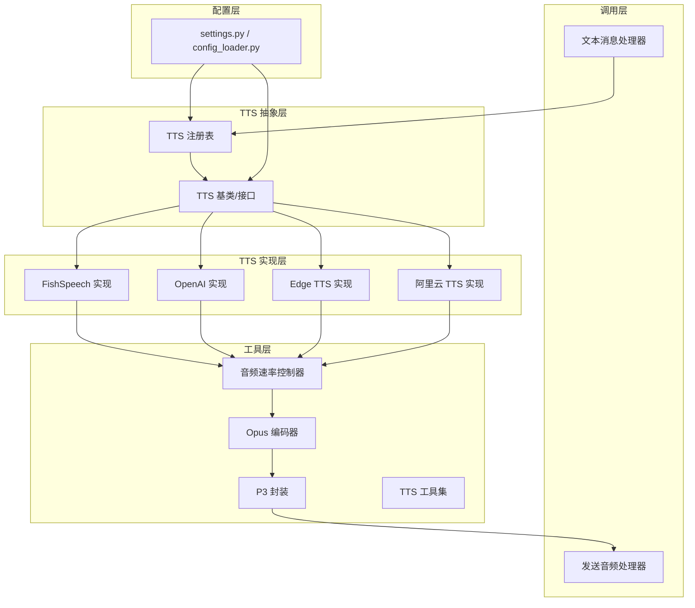
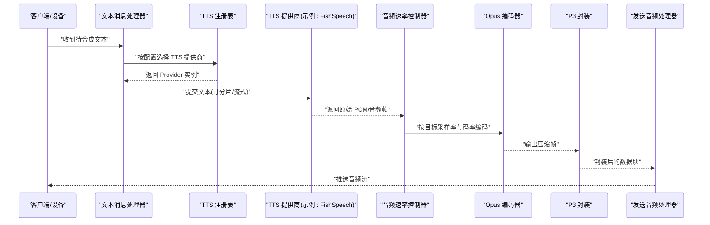
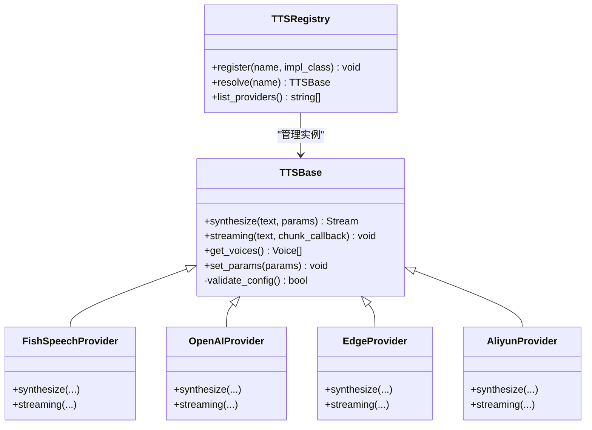
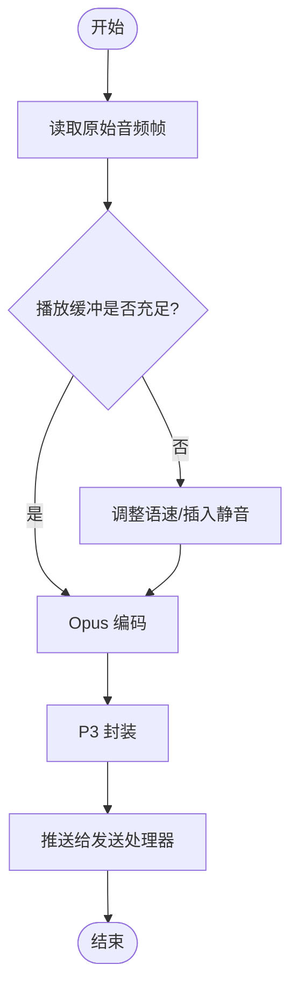
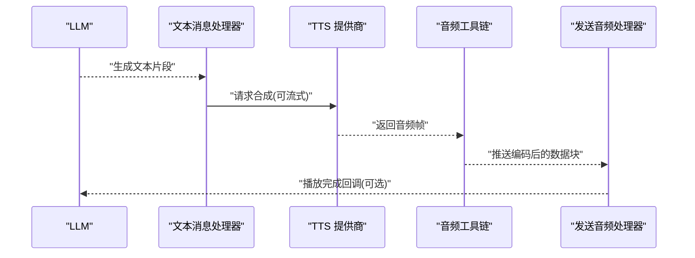
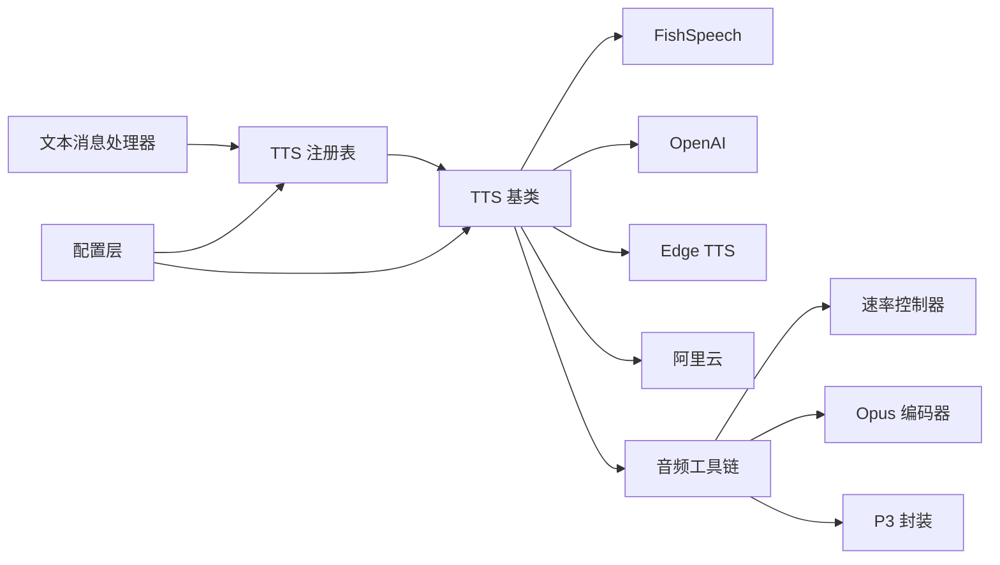

# 文本转语音 (TTS)

<cite>
**本文引用的文件**   
- [xiaozhi-server/core/providers/tts/__init__.py](file://main/xiaozhi-server/core/providers/tts/__init__.py)
- [xiaozhi-server/core/providers/tts/base.py](file://main/xiaozhi-server/core/providers/tts/base.py)
- [xiaozhi-server/core/utils/tts.py](file://main/xiaozhi-server/core/utils/tts.py)
- [xiaozhi-server/core/utils/audioRateController.py](file://main/xiaozhi-server/core/utils/audioRateController.py)
- [xiaozhi-server/core/utils/opus_encoder_utils.py](file://main/xiaozhi-server/core/utils/opus_encoder_utils.py)
- [xiaozhi-server/core/utils/p3.py](file://main/xiaozhi-server/core/utils/p3.py)
- [xiaozhi-server/core/handle/sendAudioHandle.py](file://main/xiaozhi-server/core/handle/sendAudioHandle.py)
- [xiaozhi-server/core/handle/textMessageHandlerRegistry.py](file://main/xiaozhi-server/core/handle/textMessageHandlerRegistry.py)
- [xiaozhi-server/core/handle/textMessageProcessor.py](file://main/xiaozhi-server/core/handle/textMessageProcessor.py)
- [xiaozhi-server/config/settings.py](file://main/xiaozhi-server/config/settings.py)
- [xiaozhi-server/config/config_loader.py](file://main/xiaozhi-server/config/config_loader.py)
- [xiaozhi-server/app.py](file://main/xiaozhi-server/app.py)
- [fish-speech-integration.md](file://docs/fish-speech-integration.md)
- [performance_tester_tts.py](file://main/xiaozhi-server/performance_tester_tts.py)
- [performance_tester_stream_tts.py](file://main/xiaozhi-server/performance_tester_stream_tts.py)
</cite>

## 目录
1. [简介](#简介)
2. [项目结构](#项目结构)
3. [核心组件](#核心组件)
4. [架构总览](#架构总览)
5. [详细组件分析](#详细组件分析)
6. [依赖关系分析](#依赖关系分析)
7. [性能考量](#性能考量)
8. [故障排查指南](#故障排查指南)
9. [结论](#结论)
10. [附录](#附录)

## 简介
本技术文档聚焦于文本转语音（TTS）模块，系统性阐述其核心架构、语音合成原理、音频流生成机制与多提供商集成方案。内容覆盖阿里云、FishSpeech、OpenAI、Edge TTS 等服务商的配置参数、音色选择、语速控制；深入解析音频编码格式（如 Opus）、流式合成、缓存策略；并提供情感控制、多语言支持、方言合成的实现思路与优化建议。同时给出添加新 TTS 提供商、自定义语音风格、提升合成质量的具体实践路径，以及语音克隆、个性化音色、实时对话优化的高级功能说明。

## 项目结构
TTS 相关代码主要位于 xiaozhi-server 的 providers/tts 与 utils 目录，配合配置加载器与消息处理器完成端到端的文本到音频流输出。整体组织遵循“提供者抽象 + 具体实现 + 工具链”的分层模式：
- 提供者抽象层：定义统一的 TTS 接口与基类，屏蔽不同厂商差异
- 具体实现层：各 TTS 提供商的具体接入逻辑（如 FishSpeech、OpenAI、Edge TTS、阿里云等）
- 工具层：音频速率控制、Opus 编码、P3 封装、流式处理等通用能力
- 配置层：集中管理 TTS 提供商密钥、模型、音色、采样率、并发等参数
- 调用层：消息处理器与发送音频处理器串联 TTS 流程

图表来源
- [xiaozhi-server/core/handle/textMessageProcessor.py](file://main/xiaozhi-server/core/handle/textMessageProcessor.py)
- [xiaozhi-server/core/handle/sendAudioHandle.py](file://main/xiaozhi-server/core/handle/sendAudioHandle.py)
- [xiaozhi-server/core/providers/tts/__init__.py](file://main/xiaozhi-server/core/providers/tts/__init__.py)
- [xiaozhi-server/core/providers/tts/base.py](file://main/xiaozhi-server/core/providers/tts/base.py)
- [xiaozhi-server/core/utils/audioRateController.py](file://main/xiaozhi-server/core/utils/audioRateController.py)
- [xiaozhi-server/core/utils/opus_encoder_utils.py](file://main/xiaozhi-server/core/utils/opus_encoder_utils.py)
- [xiaozhi-server/core/utils/p3.py](file://main/xiaozhi-server/core/utils/p3.py)
- [xiaozhi-server/config/settings.py](file://main/xiaozhi-server/config/settings.py)
- [xiaozhi-server/config/config_loader.py](file://main/xiaozhi-server/config/config_loader.py)

章节来源
- [xiaozhi-server/core/handle/textMessageProcessor.py](file://main/xiaozhi-server/core/handle/textMessageProcessor.py)
- [xiaozhi-server/core/handle/sendAudioHandle.py](file://main/xiaozhi-server/core/handle/sendAudioHandle.py)
- [xiaozhi-server/core/providers/tts/__init__.py](file://main/xiaozhi-server/core/providers/tts/__init__.py)
- [xiaozhi-server/core/providers/tts/base.py](file://main/xiaozhi-server/core/providers/tts/base.py)
- [xiaozhi-server/core/utils/audioRateController.py](file://main/xiaozhi-server/core/utils/audioRateController.py)
- [xiaozhi-server/core/utils/opus_encoder_utils.py](file://main/xiaozhi-server/core/utils/opus_encoder_utils.py)
- [xiaozhi-server/core/utils/p3.py](file://main/xiaozhi-server/core/utils/p3.py)
- [xiaozhi-server/config/settings.py](file://main/xiaozhi-server/config/settings.py)
- [xiaozhi-server/config/config_loader.py](file://main/xiaozhi-server/config/config_loader.py)

## 核心组件
- TTS 抽象与注册
  - 统一接口：定义文本输入、音频流输出、错误码、状态回调等契约
  - 注册表：按名称或类型动态装配具体实现，支持运行时切换
- 具体 TTS 提供商
  - FishSpeech：本地/远程推理服务对接，支持流式与非流式
  - OpenAI：基于 API 的在线合成，支持多音色与多语言
  - Edge TTS：微软边缘服务，低延迟、高可用
  - 阿里云：企业级 TTS，丰富音色与情感控制
- 音频工具链
  - 音频速率控制器：根据网络与播放端缓冲动态调整语速
  - Opus 编码器：高效压缩，适合实时传输
  - P3 封装：适配设备端解码与播放协议
- 配置与初始化
  - settings.py：集中声明 TTS 默认提供商、模型、音色、采样率、并发限制等
  - config_loader.py：从 YAML/JSON 或远端配置中心加载并热更新

章节来源
- [xiaozhi-server/core/providers/tts/__init__.py](file://main/xiaozhi-server/core/providers/tts/__init__.py)
- [xiaozhi-server/core/providers/tts/base.py](file://main/xiaozhi-server/core/providers/tts/base.py)
- [xiaozhi-server/core/utils/audioRateController.py](file://main/xiaozhi-server/core/utils/audioRateController.py)
- [xiaozhi-server/core/utils/opus_encoder_utils.py](file://main/xiaozhi-server/core/utils/opus_encoder_utils.py)
- [xiaozhi-server/core/utils/p3.py](file://main/xiaozhi-server/core/utils/p3.py)
- [xiaozhi-server/config/settings.py](file://main/xiaozhi-server/config/settings.py)
- [xiaozhi-server/config/config_loader.py](file://main/xiaozhi-server/config/config_loader.py)

## 架构总览
TTS 的整体调用链路从文本消息进入，经处理器路由至 TTS 注册表，再调度具体提供商进行合成。合成结果通过音频工具链编码封装后，由发送音频处理器推送到设备端。

图表来源
- [xiaozhi-server/core/handle/textMessageProcessor.py](file://main/xiaozhi-server/core/handle/textMessageProcessor.py)
- [xiaozhi-server/core/handle/sendAudioHandle.py](file://main/xiaozhi-server/core/handle/sendAudioHandle.py)
- [xiaozhi-server/core/providers/tts/__init__.py](file://main/xiaozhi-server/core/providers/tts/__init__.py)
- [xiaozhi-server/core/providers/tts/base.py](file://main/xiaozhi-server/core/providers/tts/base.py)
- [xiaozhi-server/core/utils/audioRateController.py](file://main/xiaozhi-server/core/utils/audioRateController.py)
- [xiaozhi-server/core/utils/opus_encoder_utils.py](file://main/xiaozhi-server/core/utils/opus_encoder_utils.py)
- [xiaozhi-server/core/utils/p3.py](file://main/xiaozhi-server/core/utils/p3.py)

## 详细组件分析

### TTS 抽象与注册表
- 设计要点
  - 统一接口：提供文本到音频流的标准化方法，支持同步与异步流式
  - 错误与状态：定义错误码、重试策略、进度回调
  - 注册表：维护提供商名称到实现的映射，支持动态加载与热插拔
- 扩展点
  - 新增提供商需继承基类并实现必要方法
  - 在注册表中登记名称与构造参数，便于配置驱动

图表来源
- [xiaozhi-server/core/providers/tts/base.py](file://main/xiaozhi-server/core/providers/tts/base.py)
- [xiaozhi-server/core/providers/tts/__init__.py](file://main/xiaozhi-server/core/providers/tts/__init__.py)

章节来源
- [xiaozhi-server/core/providers/tts/base.py](file://main/xiaozhi-server/core/providers/tts/base.py)
- [xiaozhi-server/core/providers/tts/__init__.py](file://main/xiaozhi-server/core/providers/tts/__init__.py)

### 音频工具链：速率控制、编码与封装
- 音频速率控制器
  - 依据网络抖动与播放端缓冲动态调节语速，避免卡顿与爆音
  - 支持平滑过渡与阈值控制，保证听感自然
- Opus 编码器
  - 将 PCM 帧编码为 Opus 数据，降低带宽占用
  - 可调码率、采样率、帧长，平衡音质与延迟
- P3 封装
  - 将编码后的数据块封装为设备端可识别的协议格式
  - 包含元数据（时长、采样率、声道数等）

图表来源
- [xiaozhi-server/core/utils/audioRateController.py](file://main/xiaozhi-server/core/utils/audioRateController.py)
- [xiaozhi-server/core/utils/opus_encoder_utils.py](file://main/xiaozhi-server/core/utils/opus_encoder_utils.py)
- [xiaozhi-server/core/utils/p3.py](file://main/xiaozhi-server/core/utils/p3.py)

章节来源
- [xiaozhi-server/core/utils/audioRateController.py](file://main/xiaozhi-server/core/utils/audioRateController.py)
- [xiaozhi-server/core/utils/opus_encoder_utils.py](file://main/xiaozhi-server/core/utils/opus_encoder_utils.py)
- [xiaozhi-server/core/utils/p3.py](file://main/xiaozhi-server/core/utils/p3.py)

### 消息处理与发送链路
- 文本消息处理器
  - 接收 LLM 生成的回复文本，进行分段与预处理
  - 根据配置选择 TTS 提供商，触发合成流程
- 发送音频处理器
  - 消费编码后的音频块，维持稳定的推送节奏
  - 处理断线重连、丢包恢复与播放队列管理

图表来源
- [xiaozhi-server/core/handle/textMessageProcessor.py](file://main/xiaozhi-server/core/handle/textMessageProcessor.py)
- [xiaozhi-server/core/handle/sendAudioHandle.py](file://main/xiaozhi-server/core/handle/sendAudioHandle.py)

章节来源
- [xiaozhi-server/core/handle/textMessageProcessor.py](file://main/xiaozhi-server/core/handle/textMessageProcessor.py)
- [xiaozhi-server/core/handle/sendAudioHandle.py](file://main/xiaozhi-server/core/handle/sendAudioHandle.py)

### 配置管理与初始化
- settings.py
  - 定义 TTS 默认提供商、模型、音色、采样率、并发限制、超时等
  - 提供全局访问入口，供各组件读取
- config_loader.py
  - 从配置文件或远端配置中心加载 TTS 参数
  - 支持热更新与校验，确保运行时一致性

章节来源
- [xiaozhi-server/config/settings.py](file://main/xiaozhi-server/config/settings.py)
- [xiaozhi-server/config/config_loader.py](file://main/xiaozhi-server/config/config_loader.py)

### 应用启动与模块装配
- app.py
  - 初始化核心模块，包括 TTS 注册表与各提供商实例
  - 启动 HTTP/WebSocket 服务，挂载消息处理器

章节来源
- [xiaozhi-server/app.py](file://main/xiaozhi-server/app.py)

## 依赖关系分析
- 组件耦合
  - 文本处理器依赖 TTS 注册表，解耦具体提供商
  - 音频工具链独立于提供商，提供通用能力
  - 配置层贯穿全链路，确保参数一致
- 外部依赖
  - FishSpeech：本地或远程推理服务
  - OpenAI：在线 API
  - Edge TTS：微软边缘服务
  - 阿里云：企业级 TTS 服务

图表来源
- [xiaozhi-server/core/handle/textMessageProcessor.py](file://main/xiaozhi-server/core/handle/textMessageProcessor.py)
- [xiaozhi-server/core/providers/tts/__init__.py](file://main/xiaozhi-server/core/providers/tts/__init__.py)
- [xiaozhi-server/core/providers/tts/base.py](file://main/xiaozhi-server/core/providers/tts/base.py)
- [xiaozhi-server/core/utils/audioRateController.py](file://main/xiaozhi-server/core/utils/audioRateController.py)
- [xiaozhi-server/core/utils/opus_encoder_utils.py](file://main/xiaozhi-server/core/utils/opus_encoder_utils.py)
- [xiaozhi-server/core/utils/p3.py](file://main/xiaozhi-server/core/utils/p3.py)
- [xiaozhi-server/config/settings.py](file://main/xiaozhi-server/config/settings.py)

章节来源
- [xiaozhi-server/core/handle/textMessageProcessor.py](file://main/xiaozhi-server/core/handle/textMessageProcessor.py)
- [xiaozhi-server/core/providers/tts/__init__.py](file://main/xiaozhi-server/core/providers/tts/__init__.py)
- [xiaozhi-server/core/providers/tts/base.py](file://main/xiaozhi-server/core/providers/tts/base.py)
- [xiaozhi-server/core/utils/audioRateController.py](file://main/xiaozhi-server/core/utils/audioRateController.py)
- [xiaozhi-server/core/utils/opus_encoder_utils.py](file://main/xiaozhi-server/core/utils/opus_encoder_utils.py)
- [xiaozhi-server/core/utils/p3.py](file://main/xiaozhi-server/core/utils/p3.py)
- [xiaozhi-server/config/settings.py](file://main/xiaozhi-server/config/settings.py)

## 性能考量
- 流式合成
  - 优先使用流式接口，减少首帧延迟
  - 合理分片文本，平衡吞吐与响应时间
- 编码与带宽
  - 根据网络状况动态调整 Opus 码率
  - 使用 P3 封装减少头部开销
- 缓存策略
  - 对短文本或高频语句进行音频缓存
  - 结合 TTL 与 LRU 淘汰策略，避免内存膨胀
- 并发与限流
  - 限制并发请求数，防止资源耗尽
  - 设置超时与重试上限，提高鲁棒性

[本节为通用指导，不直接分析具体文件]

## 故障排查指南
- 常见问题
  - 提供商连接失败：检查密钥、网络连通性与服务状态
  - 音频卡顿：调整速率控制器阈值与 Opus 码率
  - 播放异常：确认 P3 封装元数据与设备端解码兼容性
- 诊断手段
  - 启用详细日志，记录关键节点耗时与错误码
  - 使用性能测试脚本验证端到端延迟与吞吐

章节来源
- [xiaozhi-server/performance_tester_tts.py](file://main/xiaozhi-server/performance_tester_tts.py)
- [xiaozhi-server/performance_tester_stream_tts.py](file://main/xiaozhi-server/performance_tester_stream_tts.py)

## 结论
TTS 模块以清晰的抽象与注册机制整合多家提供商，借助音频工具链实现稳定高效的流式合成。通过合理的配置管理、缓存策略与性能调优，可在多场景下提供高质量、低延迟的语音输出。未来可进一步拓展情感控制、多语言与方言合成能力，并结合语音克隆与个性化音色提升用户体验。

[本节为总结性内容，不直接分析具体文件]

## 附录

### 多提供商集成要点
- FishSpeech
  - 支持本地/远程部署，关注推理服务可用性
  - 参考集成文档了解模型与参数配置
- OpenAI
  - 基于在线 API，注意密钥安全与配额限制
  - 选择合适的音色与语言，满足多语言需求
- Edge TTS
  - 低延迟、高可用，适合实时对话
  - 关注服务区域与合规要求
- 阿里云
  - 丰富的音色与情感控制，适合企业级场景
  - 注意并发与限流策略

章节来源
- [fish-speech-integration.md](file://docs/fish-speech-integration.md)

### 添加新 TTS 提供商的步骤
- 继承 TTS 基类，实现文本到音频流的合成方法
- 在注册表中登记提供商名称与构造参数
- 在配置文件中声明默认参数与切换规则
- 编写单元测试与性能测试用例

章节来源
- [xiaozhi-server/core/providers/tts/base.py](file://main/xiaozhi-server/core/providers/tts/base.py)
- [xiaozhi-server/core/providers/tts/__init__.py](file://main/xiaozhi-server/core/providers/tts/__init__.py)
- [xiaozhi-server/config/settings.py](file://main/xiaozhi-server/config/settings.py)

### 语音情感控制与多语言支持
- 情感控制
  - 通过提供商参数注入情感标签或强度
  - 结合文本预处理，增强语义表达
- 多语言与方言
  - 根据文本语言自动选择对应模型或音色
  - 提供方言专属模型或参数，提升识别与合成质量

[本节为概念性内容，不直接分析具体文件]

### 语音克隆与个性化音色
- 语音克隆
  - 采集用户语音样本，训练或微调模型
  - 将克隆音色注册为可用选项，供用户选择
- 个性化音色
  - 基于用户偏好动态调整音色参数
  - 结合上下文信息，优化情感与语速

[本节为概念性内容，不直接分析具体文件]

### 实时对话优化
- 首帧延迟优化
  - 流式合成与并行处理，缩短等待时间
  - 预取与缓存常用短语，提升响应速度
- 播放体验优化
  - 动态缓冲与速率控制，避免卡顿
  - 断线重连与错误恢复，保证连续性

[本节为概念性内容，不直接分析具体文件]