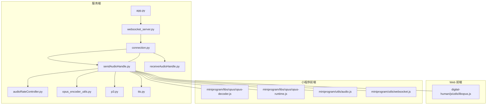
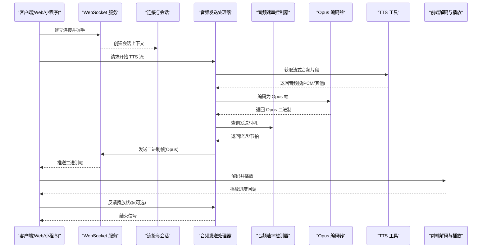
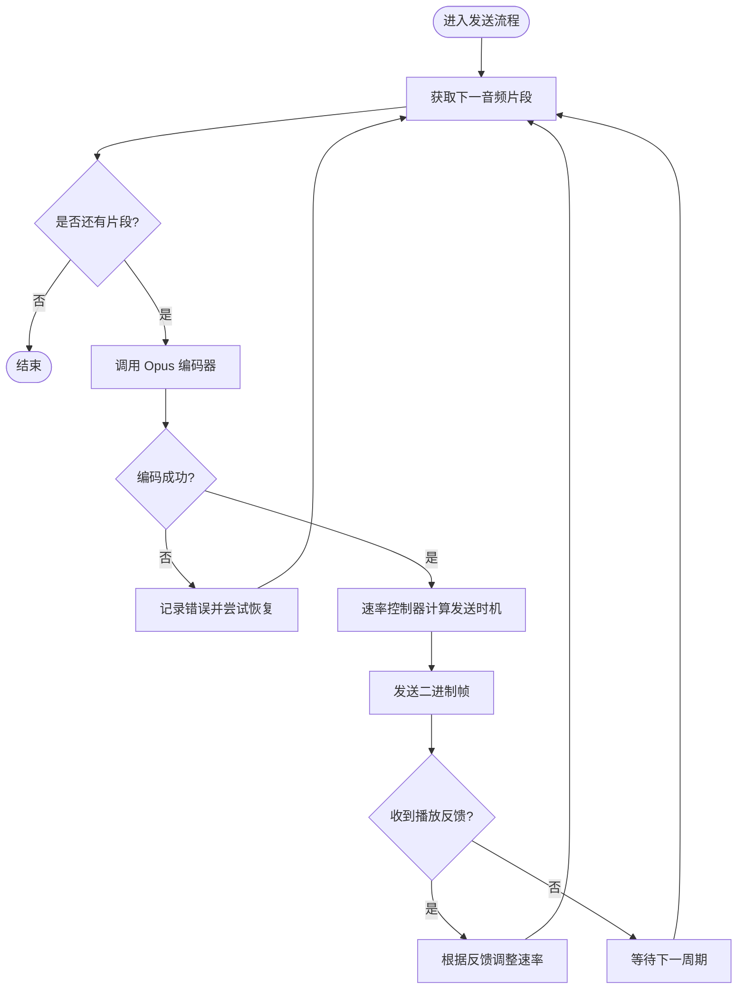
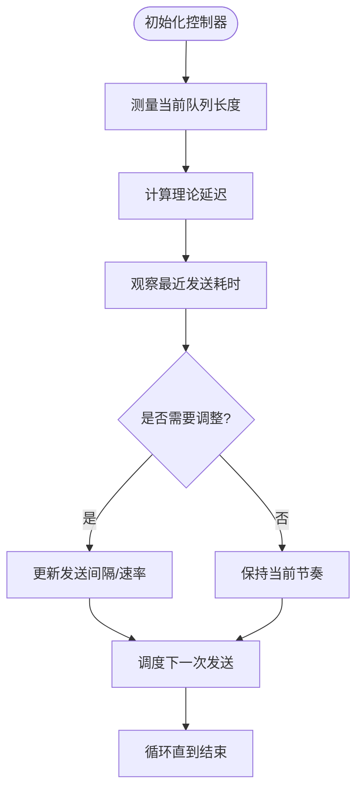
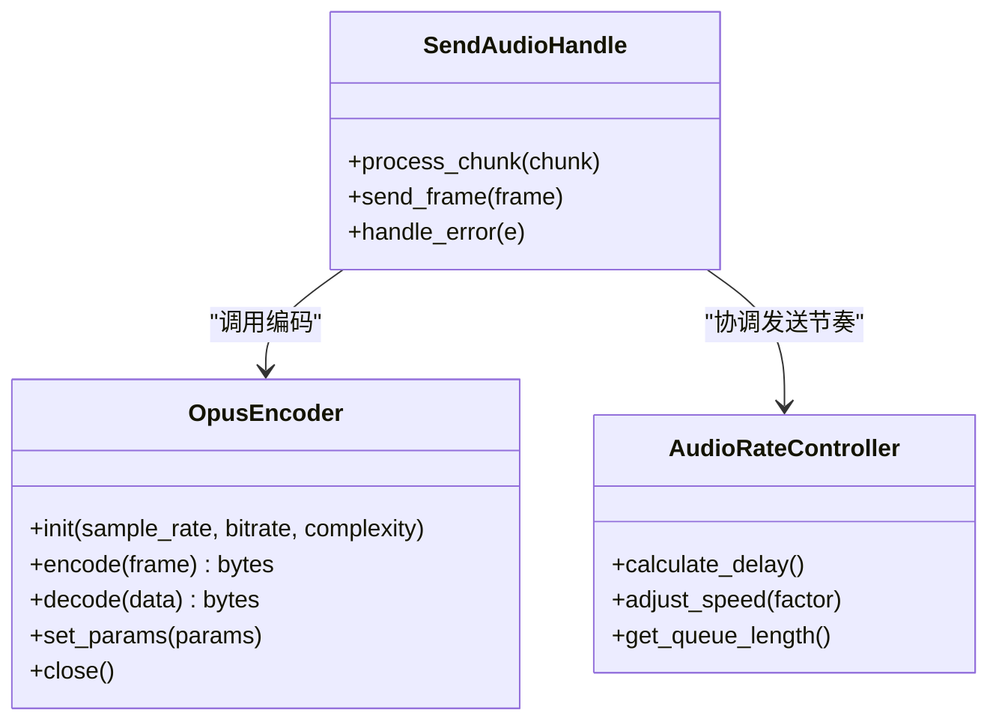
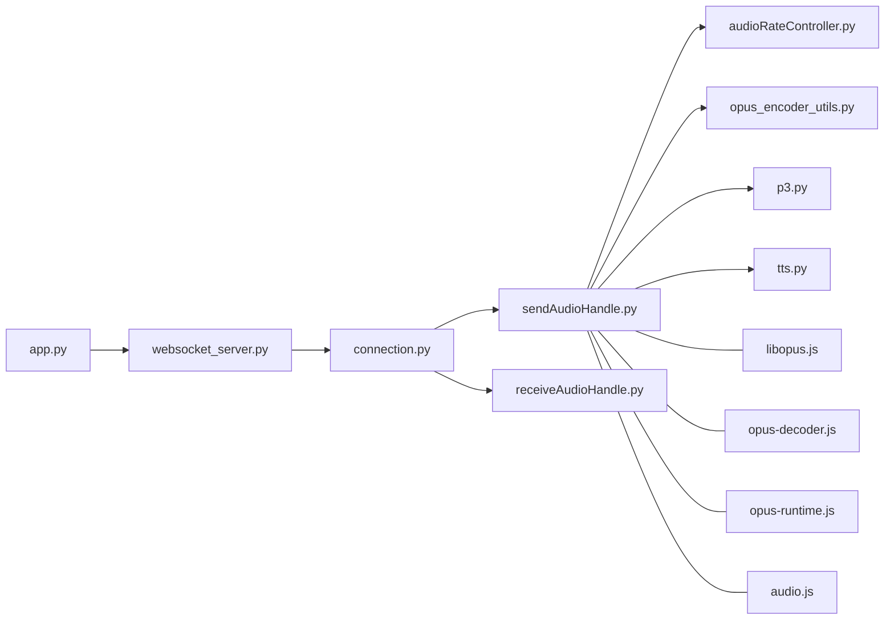

# 流式音频处理

<cite>
**本文引用的文件**   
- [app.py](file://main/xiaozhi-server/app.py)
- [websocket_server.py](file://main/xiaozhi-server/core/websocket_server.py)
- [connection.py](file://main/xiaozhi-server/core/connection.py)
- [sendAudioHandle.py](file://main/xiaozhi-server/core/handle/sendAudioHandle.py)
- [receiveAudioHandle.py](file://main/xiaozhi-server/core/handle/receiveAudioHandle.py)
- [audioRateController.py](file://main/xiaozhi-server/core/utils/audioRateController.py)
- [opus_encoder_utils.py](file://main/xiaozhi-server/core/utils/opus_encoder_utils.py)
- [p3.py](file://main/xiaozhi-server/core/utils/p3.py)
- [tts.py](file://main/xiaozhi-server/core/utils/tts.py)
- [libopus.js](file://main/digital-human/js/utils/libopus.js)
- [opus-decoder.js](file://main/miniprogram/libs/opus/opus-decoder.js)
- [opus-runtime.js](file://main/miniprogram/libs/opus/opus-runtime.js)
- [audio.js](file://main/miniprogram/utils/audio.js)
- [websocket.js](file://main/miniprogram/utils/websocket.js)
- [performance_tester_stream_tts.py](file://main/xiaozhi-server/performance_tester/performance_tester_stream_tts.py)
</cite>

## 目录
1. [简介](#简介)
2. [项目结构](#项目结构)
3. [核心组件](#核心组件)
4. [架构总览](#架构总览)
5. [详细组件分析](#详细组件分析)
6. [依赖关系分析](#依赖关系分析)
7. [性能考量](#性能考量)
8. [故障排查指南](#故障排查指南)
9. [结论](#结论)
10. [附录](#附录)

## 简介
本技术文档围绕 TTS 流式音频处理，系统阐述实时语音合成的实现方案与优化策略。内容覆盖：
- 音频流分片与缓冲区管理
- 延迟优化与卡顿处理
- 音频编码格式转换（重点 Opus）
- 音频速率控制机制（语速调节、播放速度同步）
- 流式传输协议与 WebSocket 消息格式、二进制数据处理
- 音频质量监控、网络自适应调整、内存使用优化
- 移动端音频播放、浏览器兼容性、设备性能适配

## 项目结构
本项目在服务端采用 Python 实现，前端包含 Web 与小程序端，分别负责音频采集、播放与编解码。关键路径如下：
- 服务端入口与 WebSocket 服务：app.py、core/websocket_server.py、core/connection.py
- 音频发送与接收处理器：core/handle/sendAudioHandle.py、core/handle/receiveAudioHandle.py
- 音频工具与编码器：core/utils/audioRateController.py、core/utils/opus_encoder_utils.py、core/utils/p3.py、core/utils/tts.py
- 前端库与工具：digital-human/js/utils/libopus.js、miniprogram/libs/opus/*、miniprogram/utils/audio.js、miniprogram/utils/websocket.js
- 性能测试：performance_tester_stream_tts.py

**图表来源** 
- [app.py](file://main/xiaozhi-server/app.py)
- [websocket_server.py](file://main/xiaozhi-server/core/websocket_server.py)
- [connection.py](file://main/xiaozhi-server/core/connection.py)
- [sendAudioHandle.py](file://main/xiaozhi-server/core/handle/sendAudioHandle.py)
- [receiveAudioHandle.py](file://main/xiaozhi-server/core/handle/receiveAudioHandle.py)
- [audioRateController.py](file://main/xiaozhi-server/core/utils/audioRateController.py)
- [opus_encoder_utils.py](file://main/xiaozhi-server/core/utils/opus_encoder_utils.py)
- [p3.py](file://main/xiaozhi-server/core/utils/p3.py)
- [tts.py](file://main/xiaozhi-server/core/utils/tts.py)
- [libopus.js](file://main/digital-human/js/utils/libopus.js)
- [opus-decoder.js](file://main/miniprogram/libs/opus/opus-decoder.js)
- [opus-runtime.js](file://main/miniprogram/libs/opus/opus-runtime.js)
- [audio.js](file://main/miniprogram/utils/audio.js)
- [websocket.js](file://main/miniprogram/utils/websocket.js)

**章节来源**
- [app.py](file://main/xiaozhi-server/app.py)
- [websocket_server.py](file://main/xiaozhi-server/core/websocket_server.py)
- [connection.py](file://main/xiaozhi-server/core/connection.py)

## 核心组件
- WebSocket 连接与会话管理：建立长连接，维护会话上下文，路由文本与音频消息。
- 音频发送处理器：将 TTS 生成的音频片段进行分片、编码、缓冲与发送，配合速率控制器保证播放同步。
- 音频接收处理器：处理客户端上传的音频数据，用于 ASR 或交互流程。
- 音频速率控制器：基于时间戳与队列长度动态调节发送节奏，避免卡顿与溢出。
- Opus 编码器工具：封装编码器配置、参数调优与帧打包。
- P3 工具：处理特定音频容器或分片协议。
- TTS 工具：对接不同 TTS 后端，提供流式输出接口。
- 前端编解码与播放：Web 端使用 libopus，小程序端使用 opus-decoder 与 runtime，统一二进制处理与播放。

**章节来源**
- [sendAudioHandle.py](file://main/xiaozhi-server/core/handle/sendAudioHandle.py)
- [receiveAudioHandle.py](file://main/xiaozhi-server/core/handle/receiveAudioHandle.py)
- [audioRateController.py](file://main/xiaozhi-server/core/utils/audioRateController.py)
- [opus_encoder_utils.py](file://main/xiaozhi-server/core/utils/opus_encoder_utils.py)
- [p3.py](file://main/xiaozhi-server/core/utils/p3.py)
- [tts.py](file://main/xiaozhi-server/core/utils/tts.py)
- [libopus.js](file://main/digital-human/js/utils/libopus.js)
- [opus-decoder.js](file://main/miniprogram/libs/opus/opus-decoder.js)
- [opus-runtime.js](file://main/miniprogram/libs/opus/opus-runtime.js)
- [audio.js](file://main/miniprogram/utils/audio.js)

## 架构总览
下图展示从 TTS 生成到客户端播放的端到端流程，包括 WebSocket 传输、Opus 编码、速率控制与前端解码播放。

**图表来源** 
- [websocket_server.py](file://main/xiaozhi-server/core/websocket_server.py)
- [connection.py](file://main/xiaozhi-server/core/connection.py)
- [sendAudioHandle.py](file://main/xiaozhi-server/core/handle/sendAudioHandle.py)
- [audioRateController.py](file://main/xiaozhi-server/core/utils/audioRateController.py)
- [opus_encoder_utils.py](file://main/xiaozhi-server/core/utils/opus_encoder_utils.py)
- [tts.py](file://main/xiaozhi-server/core/utils/tts.py)
- [libopus.js](file://main/digital-human/js/utils/libopus.js)
- [opus-decoder.js](file://main/miniprogram/libs/opus/opus-decoder.js)
- [opus-runtime.js](file://main/miniprogram/libs/opus/opus-runtime.js)
- [audio.js](file://main/miniprogram/utils/audio.js)

## 详细组件分析

### 音频发送处理器（sendAudioHandle）
职责：
- 接收 TTS 流式输出，按固定大小分片
- 调用 Opus 编码器进行压缩
- 通过速率控制器协调发送节奏
- 将二进制帧经 WebSocket 推送给客户端

关键点：
- 分片策略：按帧或时间窗口切分，平衡延迟与带宽
- 错误处理：捕获编码异常与网络异常，支持重试与降级
- 资源释放：及时释放编码器与缓冲区，防止内存泄漏

**图表来源** 
- [sendAudioHandle.py](file://main/xiaozhi-server/core/handle/sendAudioHandle.py)
- [audioRateController.py](file://main/xiaozhi-server/core/utils/audioRateController.py)
- [opus_encoder_utils.py](file://main/xiaozhi-server/core/utils/opus_encoder_utils.py)

**章节来源**
- [sendAudioHandle.py](file://main/xiaozhi-server/core/handle/sendAudioHandle.py)

### 音频速率控制器（audioRateController）
职责：
- 维护发送时间线，确保与播放端同步
- 根据队列长度与网络状况动态调整发送间隔
- 支持语速调节与卡顿补偿

算法要点：
- 基于目标采样率与帧时长计算理论发送时间
- 结合滑动窗口统计实际发送耗时，修正偏差
- 当队列积压时降低发送频率，避免拥塞；空闲时加速追赶

**图表来源** 
- [audioRateController.py](file://main/xiaozhi-server/core/utils/audioRateController.py)

**章节来源**
- [audioRateController.py](file://main/xiaozhi-server/core/utils/audioRateController.py)

### Opus 编码器工具（opus_encoder_utils）
职责：
- 封装 Opus 编码器初始化与参数配置
- 提供帧打包与解包方法
- 支持不同采样率、码率与复杂度设置

配置建议：
- 采样率：根据设备能力选择 16k/24k/48k
- 码率：在音质与带宽间权衡，通常 32-64kbps
- 复杂度：低复杂度适合移动端，高复杂度提升音质但增加 CPU

**图表来源** 
- [opus_encoder_utils.py](file://main/xiaozhi-server/core/utils/opus_encoder_utils.py)
- [audioRateController.py](file://main/xiaozhi-server/core/utils/audioRateController.py)
- [sendAudioHandle.py](file://main/xiaozhi-server/core/handle/sendAudioHandle.py)

**章节来源**
- [opus_encoder_utils.py](file://main/xiaozhi-server/core/utils/opus_encoder_utils.py)

### P3 工具（p3）
职责：
- 处理特定音频容器或分片协议
- 提供分片头解析与组装

适用场景：
- 与旧版客户端或特定硬件设备兼容
- 需要自定义分片标记或校验

**章节来源**
- [p3.py](file://main/xiaozhi-server/core/utils/p3.py)

### TTS 工具（tts）
职责：
- 对接多种 TTS 后端（本地/云端）
- 提供流式输出接口，逐段返回音频帧
- 统一错误码与状态通知

集成要点：
- 流式接口需保证低延迟与稳定输出
- 支持中断与重连机制
- 与速率控制器协同，避免背压

**章节来源**
- [tts.py](file://main/xiaozhi-server/core/utils/tts.py)

### 前端编解码与播放
- Web 端：使用 libopus.js 进行 Opus 解码与播放，兼容主流浏览器
- 小程序端：使用 opus-decoder.js 与 opus-runtime.js 完成解码，audio.js 管理播放队列与事件

兼容性策略：
- 检测浏览器能力，回退到 WAV/MP3 等格式（如必要）
- 针对低端设备降低采样率与码率
- 利用 Web Audio API 或原生播放器特性优化延迟

**章节来源**
- [libopus.js](file://main/digital-human/js/utils/libopus.js)
- [opus-decoder.js](file://main/miniprogram/libs/opus/opus-decoder.js)
- [opus-runtime.js](file://main/miniprogram/libs/opus/opus-runtime.js)
- [audio.js](file://main/miniprogram/utils/audio.js)

### WebSocket 消息格式与二进制数据处理
- 连接建立后，服务端与客户端约定消息类型（文本/二进制）
- 音频帧以二进制形式传输，携带必要的元数据（如序列号、时间戳）
- 客户端收到二进制帧后解码并送入播放队列

注意事项：
- 二进制帧大小需合理，避免过大导致阻塞
- 序列号用于乱序与丢包检测
- 时间戳用于播放同步与抖动缓冲

**章节来源**
- [websocket_server.py](file://main/xiaozhi-server/core/websocket_server.py)
- [connection.py](file://main/xiaozhi-server/core/connection.py)
- [websocket.js](file://main/miniprogram/utils/websocket.js)

## 依赖关系分析

**图表来源** 
- [app.py](file://main/xiaozhi-server/app.py)
- [websocket_server.py](file://main/xiaozhi-server/core/websocket_server.py)
- [connection.py](file://main/xiaozhi-server/core/connection.py)
- [sendAudioHandle.py](file://main/xiaozhi-server/core/handle/sendAudioHandle.py)
- [receiveAudioHandle.py](file://main/xiaozhi-server/core/handle/receiveAudioHandle.py)
- [audioRateController.py](file://main/xiaozhi-server/core/utils/audioRateController.py)
- [opus_encoder_utils.py](file://main/xiaozhi-server/core/utils/opus_encoder_utils.py)
- [p3.py](file://main/xiaozhi-server/core/utils/p3.py)
- [tts.py](file://main/xiaozhi-server/core/utils/tts.py)
- [libopus.js](file://main/digital-human/js/utils/libopus.js)
- [opus-decoder.js](file://main/miniprogram/libs/opus/opus-decoder.js)
- [opus-runtime.js](file://main/miniprogram/libs/opus/opus-runtime.js)
- [audio.js](file://main/miniprogram/utils/audio.js)

**章节来源**
- [websocket_server.py](file://main/xiaozhi-server/core/websocket_server.py)
- [connection.py](file://main/xiaozhi-server/core/connection.py)
- [sendAudioHandle.py](file://main/xiaozhi-server/core/handle/sendAudioHandle.py)

## 性能考量
- 延迟优化
  - 减小分片大小以降低首帧延迟
  - 预取与流水线并行编码与发送
  - 使用零拷贝或内存池减少分配开销
- 卡顿处理
  - 动态调整发送间隔与码率
  - 前端抖动缓冲与丢包重传（可选）
  - 监控队列长度与播放进度，自动回退策略
- 内存使用优化
  - 限制缓冲区最大容量，触发背压
  - 及时释放编码器实例与临时对象
  - 避免大对象频繁创建与 GC 压力
- 网络适应性
  - 根据 RTT 与丢包率调整码率与分片大小
  - 支持降级至更低采样率或更保守的复杂度
- 质量监控
  - 统计平均延迟、抖动、丢包率
  - 记录编码耗时与解码耗时分布
  - 用户侧播放卡顿指标上报

[本节为通用指导，不直接分析具体文件]

## 故障排查指南
常见问题与定位步骤：
- 音频断续或卡顿
  - 检查速率控制器日志与队列长度
  - 查看网络 RTT 与丢包率
  - 确认前端解码是否及时
- 编码失败
  - 检查 Opus 编码器参数是否合法
  - 验证输入音频帧格式与采样率
  - 查看是否有内存不足或线程阻塞
- 连接断开
  - 检查心跳与超时配置
  - 确认服务端与客户端协议一致
  - 查看 WebSocket 错误码与原因

参考实现位置：
- 错误处理与日志记录集中在发送处理器与速率控制器
- WebSocket 层提供连接状态与错误回调
- 前端解码器提供错误事件与降级逻辑

**章节来源**
- [sendAudioHandle.py](file://main/xiaozhi-server/core/handle/sendAudioHandle.py)
- [audioRateController.py](file://main/xiaozhi-server/core/utils/audioRateController.py)
- [websocket_server.py](file://main/xiaozhi-server/core/websocket_server.py)
- [connection.py](file://main/xiaozhi-server/core/connection.py)

## 结论
本方案通过流式 TTS、Opus 编码、速率控制与前端解码播放形成闭环，兼顾低延迟与稳定性。在实际部署中，应结合设备能力与网络环境动态调整参数，持续监控质量指标，逐步优化用户体验。

[本节为总结性内容，不直接分析具体文件]

## 附录
- 性能测试脚本：performance_tester_stream_tts.py 可用于评估流式 TTS 的端到端延迟与吞吐
- 前端兼容性矩阵：针对不同浏览器与小程序平台的能力检测与回退策略
- 配置示例：Opus 编码器参数、采样率、码率、复杂度的推荐值

**章节来源**
- [performance_tester_stream_tts.py](file://main/xiaozhi-server/performance_tester/performance_tester_stream_tts.py)