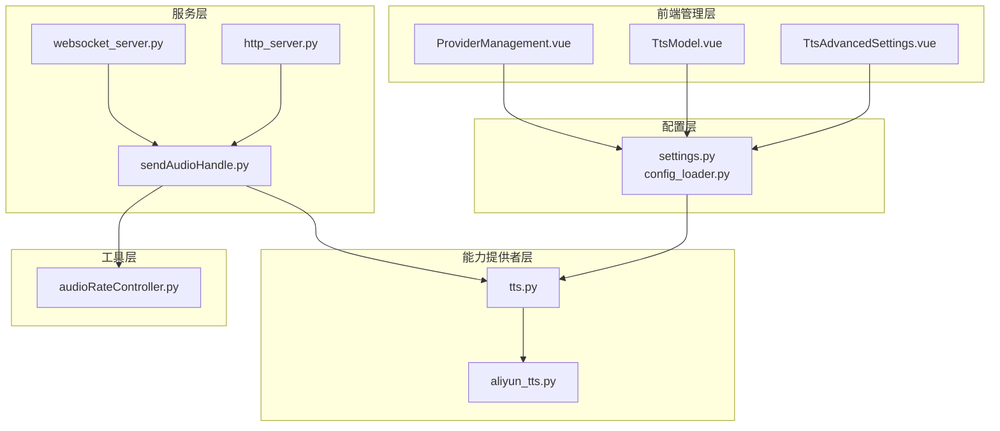
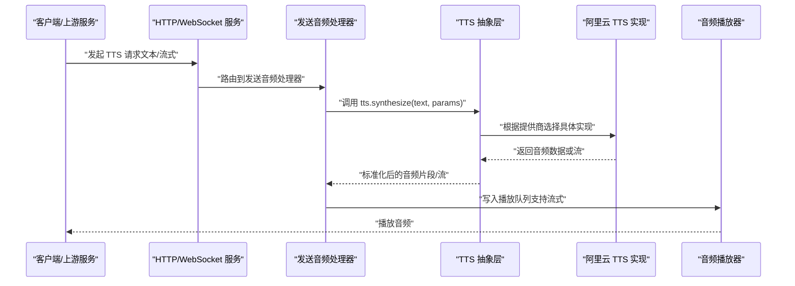
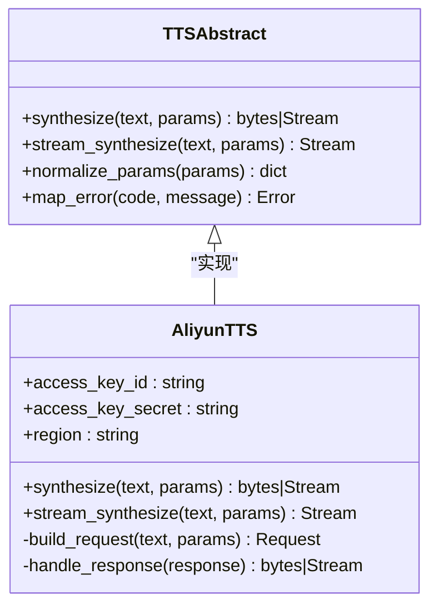
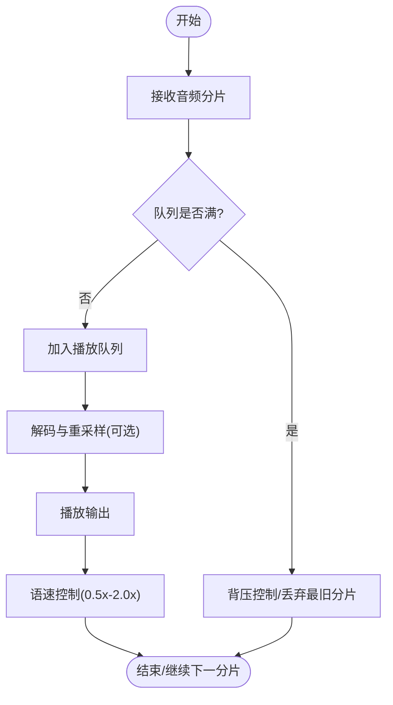
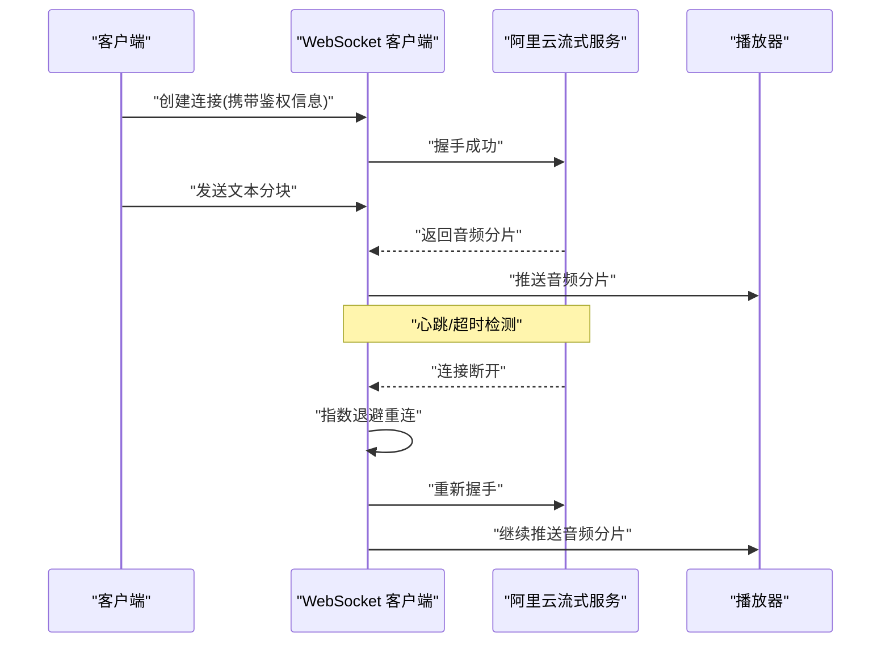
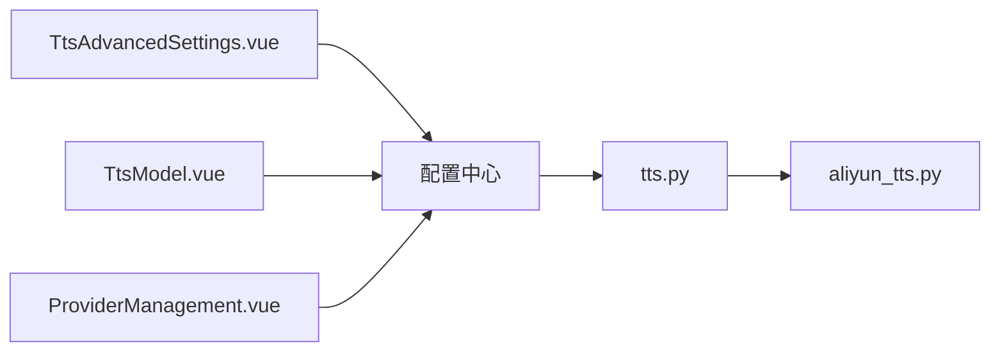
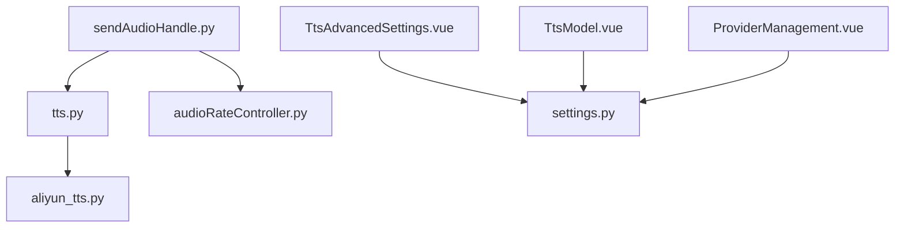

# 阿里云 TTS 提供商

<cite>
**本文引用的文件**
- [main.py](file://main/main.py)
- [settings.py](file://main/config/settings.py)
- [config_loader.py](file://main/config/config_loader.py)
- [tts.py](file://main/core/utils/tts.py)
- [aliyun_tts.py](file://main/core/providers/tts/aliyun_tts.py)
- [sendAudioHandle.py](file://main/core/handle/sendAudioHandle.py)
- [audioRateController.py](file://main/core/utils/audioRateController.py)
- [performance_tester_stream_tts.py](file://main/performance_tester/performance_tester_stream_tts.py)
- [TtsAdvancedSettings.vue](file://main/manager-web/src/components/TtsAdvancedSettings.vue)
- [TtsModel.vue](file://main/manager-web/src/components/TtsModel.vue)
- [ProviderManagement.vue](file://main/manager-web/src/views/ProviderManagement.vue)
</cite>

## 目录
1. [简介](#简介)
2. [项目结构](#项目结构)
3. [核心组件](#核心组件)
4. [架构总览](#架构总览)
5. [详细组件分析](#详细组件分析)
6. [依赖关系分析](#依赖关系分析)
7. [性能考量](#性能考量)
8. [故障排查指南](#故障排查指南)
9. [结论](#结论)
10. [附录](#附录)

## 简介
本技术文档面向在项目中集成阿里云语音合成（TTS）的开发者与运维人员，系统性说明配置方式、参数调优、音色库选择、语速与音量控制、音频格式选项、流式合成实现原理（WebSocket 连接管理、实时音频流处理、断线重连）、错误码与限流策略、缓存优化等生产环境最佳实践，并提供完整配置示例与故障排查指引。

## 项目结构
本项目采用分层与按功能域组织的方式：
- 配置层：集中管理环境变量与配置文件加载
- 服务层：HTTP/WebSocket 服务与业务处理
- 能力提供者层：ASR/LLM/TTS/VAD 等插件化实现
- 工具层：通用工具（音频编码、速率控制、TTS 调度等）
- 前端管理层：TTS 高级设置、模型与提供商管理界面

图表来源
- [settings.py](file://main/config/settings.py)
- [config_loader.py](file://main/config/config_loader.py)
- [tts.py](file://main/core/utils/tts.py)
- [aliyun_tts.py](file://main/core/providers/tts/aliyun_tts.py)
- [sendAudioHandle.py](file://main/core/handle/sendAudioHandle.py)
- [audioRateController.py](file://main/core/utils/audioRateController.py)
- [TtsAdvancedSettings.vue](file://main/manager-web/src/components/TtsAdvancedSettings.vue)
- [TtsModel.vue](file://main/manager-web/src/components/TtsModel.vue)
- [ProviderManagement.vue](file://main/manager-web/src/views/ProviderManagement.vue)

章节来源
- [main.py](file://main/main.py)
- [settings.py](file://main/config/settings.py)
- [config_loader.py](file://main/config/config_loader.py)

## 核心组件
- 配置中心：统一读取并校验阿里云 TTS 所需的密钥、区域、超时、重试等配置项
- TTS 抽象层：定义统一的调用接口（文本转音频、流式合成、参数标准化）
- 阿里云实现：封装阿里云 SDK/API 调用，处理鉴权、请求构造、响应解析与错误映射
- 音频播放管线：将合成结果送入播放器，支持流式分片与速率控制
- 前端管理：提供 TTS 高级设置、模型与提供商配置的可视化编辑

章节来源
- [tts.py](file://main/core/utils/tts.py)
- [aliyun_tts.py](file://main/core/providers/tts/aliyun_tts.py)
- [sendAudioHandle.py](file://main/core/handle/sendAudioHandle.py)
- [audioRateController.py](file://main/core/utils/audioRateController.py)

## 架构总览
下图展示了从请求到音频输出的端到端流程，以及阿里云 TTS 的接入点。

图表来源
- [sendAudioHandle.py](file://main/core/handle/sendAudioHandle.py)
- [tts.py](file://main/core/utils/tts.py)
- [aliyun_tts.py](file://main/core/providers/tts/aliyun_tts.py)

## 详细组件分析

### 配置与环境变量
- 阿里云 TTS 所需的关键配置项包括：
  - 访问密钥（AccessKey ID/Secret）
  - 服务区域（Region）
  - 超时与重试策略
  - 默认音色、语速、音量、采样率与输出格式
- 配置加载顺序建议：环境变量 > 配置文件 > 默认值，确保部署灵活性与安全性

章节来源
- [settings.py](file://main/config/settings.py)
- [config_loader.py](file://main/config/config_loader.py)

### TTS 抽象层与阿里云实现
- 抽象层职责：
  - 统一接口：synthesize(text, params)、stream_synthesize(text, params)
  - 参数标准化：将前端传入的参数转换为各提供商期望的格式
  - 错误映射：将不同提供商的错误码映射为统一错误类型
- 阿里云实现职责：
  - 鉴权与签名：使用 AccessKey 完成签名
  - 请求构造：组装文本、音色、语速、音量、采样率、格式等参数
  - 响应处理：同步返回音频字节或建立 WebSocket 流式通道
  - 错误处理：区分网络错误、鉴权失败、配额限制、参数非法等

图表来源
- [tts.py](file://main/core/utils/tts.py)
- [aliyun_tts.py](file://main/core/providers/tts/aliyun_tts.py)

章节来源
- [tts.py](file://main/core/utils/tts.py)
- [aliyun_tts.py](file://main/core/providers/tts/aliyun_tts.py)

### 音频播放与速率控制
- 播放管线：
  - 接收 TTS 返回的音频分片（支持流式）
  - 入队播放，避免阻塞主线程
  - 可选进行 Opus/PCM 解码与重采样
- 速率控制：
  - 支持 0.5x-2.0x 语速调节
  - 通过时间戳与缓冲水位动态调整播放速度，保持自然流畅

图表来源
- [sendAudioHandle.py](file://main/core/handle/sendAudioHandle.py)
- [audioRateController.py](file://main/core/utils/audioRateController.py)

章节来源
- [sendAudioHandle.py](file://main/core/handle/sendAudioHandle.py)
- [audioRateController.py](file://main/core/utils/audioRateController.py)

### 流式合成原理（WebSocket）
- 连接管理：
  - 建立 WebSocket 连接到阿里云流式合成服务
  - 心跳保活与超时检测
- 实时处理：
  - 文本分块发送，服务端边合成边回传音频分片
  - 客户端按序拼接并推送到播放器
- 断线重连：
  - 指数退避重试
  - 状态恢复与分片去重

图表来源
- [aliyun_tts.py](file://main/core/providers/tts/aliyun_tts.py)
- [performance_tester_stream_tts.py](file://main/performance_tester/performance_tester_stream_tts.py)

章节来源
- [aliyun_tts.py](file://main/core/providers/tts/aliyun_tts.py)
- [performance_tester_stream_tts.py](file://main/performance_tester/performance_tester_stream_tts.py)

### 前端管理与参数调优
- TTS 高级设置：
  - 语速（0.5-2.0）、音量、采样率、输出格式（如 PCM/Opus/Mp3）
  - 音色选择（标准女声、标准男声、情感音色等）
- 模型与提供商管理：
  - 切换提供商（阿里云/其他）
  - 配置密钥、区域、超时、重试等

图表来源
- [TtsAdvancedSettings.vue](file://main/manager-web/src/components/TtsAdvancedSettings.vue)
- [TtsModel.vue](file://main/manager-web/src/components/TtsModel.vue)
- [ProviderManagement.vue](file://main/manager-web/src/views/ProviderManagement.vue)
- [tts.py](file://main/core/utils/tts.py)
- [aliyun_tts.py](file://main/core/providers/tts/aliyun_tts.py)

章节来源
- [TtsAdvancedSettings.vue](file://main/manager-web/src/components/TtsAdvancedSettings.vue)
- [TtsModel.vue](file://main/manager-web/src/components/TtsModel.vue)
- [ProviderManagement.vue](file://main/manager-web/src/views/ProviderManagement.vue)

## 依赖关系分析
- 模块耦合：
  - TTS 抽象层对阿里云实现解耦，便于扩展其他提供商
  - 播放管线与 TTS 抽象层通过标准化接口交互
- 外部依赖：
  - 阿里云 SDK/API（鉴权、签名、流式协议）
  - 音频编解码库（Opus/PCM）
- 潜在循环依赖：
  - 避免在 TTS 实现中直接引用播放管线，应通过回调或事件机制

图表来源
- [tts.py](file://main/core/utils/tts.py)
- [aliyun_tts.py](file://main/core/providers/tts/aliyun_tts.py)
- [sendAudioHandle.py](file://main/core/handle/sendAudioHandle.py)
- [audioRateController.py](file://main/core/utils/audioRateController.py)
- [TtsAdvancedSettings.vue](file://main/manager-web/src/components/TtsAdvancedSettings.vue)
- [TtsModel.vue](file://main/manager-web/src/components/TtsModel.vue)
- [ProviderManagement.vue](file://main/manager-web/src/views/ProviderManagement.vue)
- [settings.py](file://main/config/settings.py)

章节来源
- [tts.py](file://main/core/utils/tts.py)
- [aliyun_tts.py](file://main/core/providers/tts/aliyun_tts.py)
- [sendAudioHandle.py](file://main/core/handle/sendAudioHandle.py)
- [audioRateController.py](file://main/core/utils/audioRateController.py)
- [settings.py](file://main/config/settings.py)

## 性能考量
- 流式合成优先：降低首包延迟，提升用户体验
- 合理分片大小：平衡网络开销与播放连续性
- 缓存优化：
  - 短文本高频重复可缓存音频片段
  - 缓存键包含文本、音色、语速、音量、格式等维度
- 限流与降级：
  - 基于 QPS 令牌桶或滑动窗口限流
  - 突发流量时启用排队与优先级策略
- 资源回收：
  - 及时释放 WebSocket 连接与缓冲区
  - 监控内存与 CPU 使用率

[本节为通用指导，不直接分析具体文件]

## 故障排查指南
- 鉴权失败：
  - 检查 AccessKey 是否正确、区域是否匹配
  - 查看签名生成逻辑与时钟同步
- 参数非法：
  - 确认音色名称、语速范围、采样率与格式是否在支持列表内
- 网络异常：
  - 检查超时与重试配置
  - 观察 WebSocket 心跳与断线重连日志
- 限流与配额：
  - 关注错误码中的限流提示
  - 调整并发与排队策略
- 播放卡顿：
  - 检查分片大小与缓冲水位
  - 调整语速控制算法与解码耗时

章节来源
- [aliyun_tts.py](file://main/core/providers/tts/aliyun_tts.py)
- [sendAudioHandle.py](file://main/core/handle/sendAudioHandle.py)
- [audioRateController.py](file://main/core/utils/audioRateController.py)

## 结论
通过统一的 TTS 抽象层与插件化的阿里云实现，项目实现了高内聚、低耦合的语音合成能力。结合流式合成、速率控制、缓存与限流策略，可在生产环境中提供稳定、低延迟、高质量的语音输出体验。前端管理界面进一步提升了配置的可操作性与可观测性。

[本节为总结性内容，不直接分析具体文件]

## 附录
- 配置示例要点：
  - 阿里云 TTS 密钥、区域、超时、重试
  - 默认音色、语速、音量、采样率、输出格式
- 推荐参数范围：
  - 语速：0.5-2.0
  - 音量：0-100%
  - 采样率：16k/24k/48k（根据设备与带宽选择）
  - 格式：PCM（无损）、Opus（高效）、Mp3（兼容）
- 最佳实践：
  - 使用流式合成降低首包延迟
  - 合理设置分片大小与缓冲水位
  - 启用指数退避重连与心跳保活
  - 对高频短文本启用缓存
  - 实施 QPS 限流与优先级队列

[本节为补充信息，不直接分析具体文件]