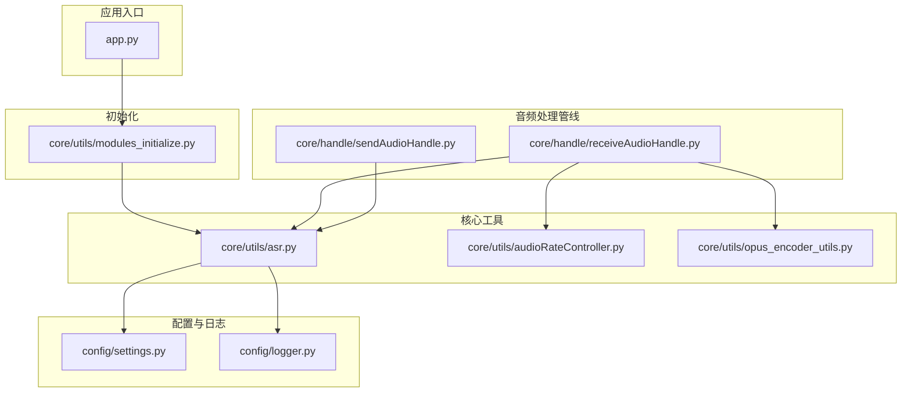
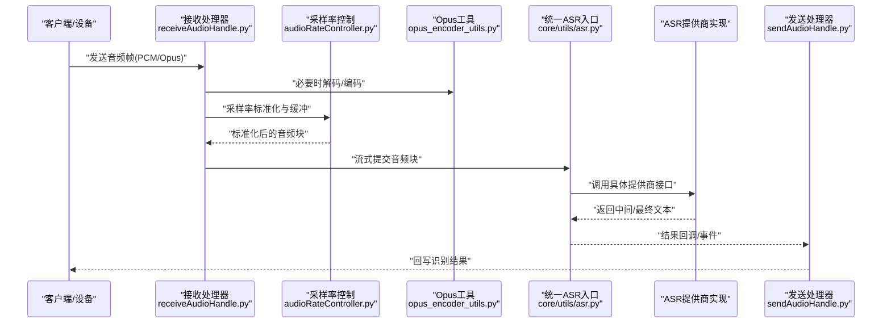
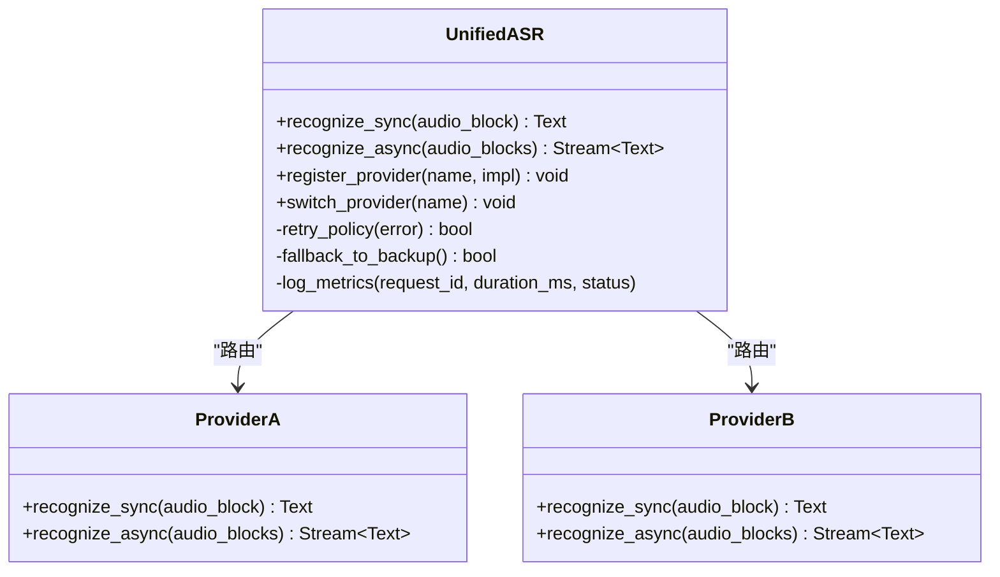
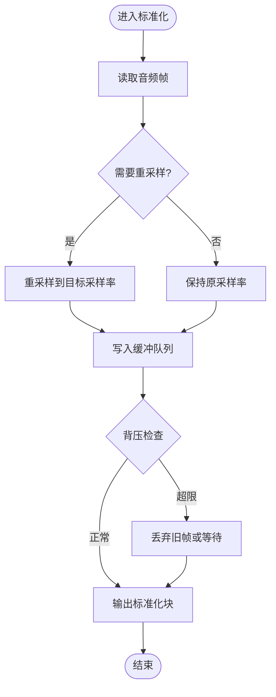
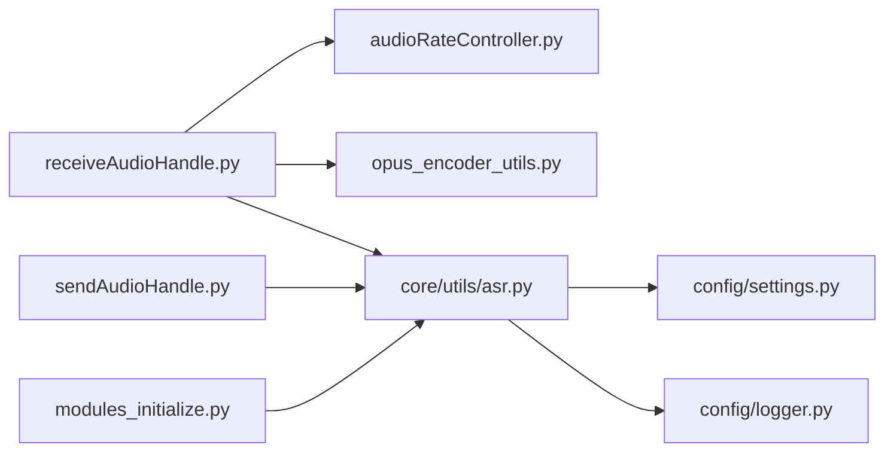
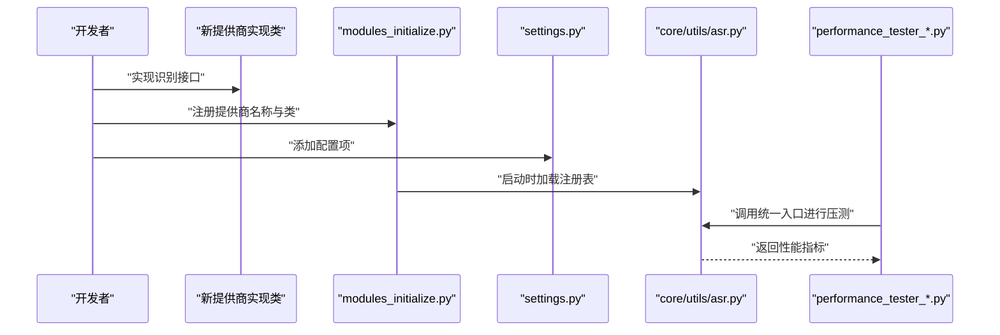

# ASR 基础架构与抽象接口

<cite>
**本文引用的文件**   
- [app.py](file://main/xiaozhi-server/app.py)
- [asr.py](file://main/xiaozhi-server/core/utils/asr.py)
- [audioRateController.py](file://main/xiaozhi-server/core/utils/audioRateController.py)
- [opus_encoder_utils.py](file://main/xiaozhi-server/core/utils/opus_encoder_utils.py)
- [receiveAudioHandle.py](file://main/xiaozhi-server/core/handle/receiveAudioHandle.py)
- [sendAudioHandle.py](file://main/xiaozhi-server/core/handle/sendAudioHandle.py)
- [logger.py](file://main/xiaozhi-server/config/logger.py)
- [settings.py](file://main/xiaozhi-server/config/settings.py)
- [modules_initialize.py](file://main/xiaozhi-server/core/utils/modules_initialize.py)
- [performance_tester_asr.py](file://main/xiaozhi-server/performance_tester/performance_tester_asr.py)
- [performance_tester_stream_asr.py](file://main/xiaozhi-server/performance_tester/performance_tester_stream_asr.py)
</cite>

## 目录
1. [简介](#简介)
2. [项目结构](#项目结构)
3. [核心组件](#核心组件)
4. [架构总览](#架构总览)
5. [详细组件分析](#详细组件分析)
6. [依赖关系分析](#依赖关系分析)
7. [性能考量](#性能考量)
8. [故障排查指南](#故障排查指南)
9. [结论](#结论)
10. [附录：扩展新 ASR 提供商的完整指南](#附录扩展新-asr-提供商的完整指南)

## 简介
本技术文档聚焦于 ASR（自动语音识别）基础架构与抽象接口，系统性阐述整体设计模式、统一接口规范、音频流处理基础设施（格式转换、采样率标准化、缓冲区管理、流式传输）、错误处理与重试机制、日志记录系统，以及扩展新 ASR 提供商的实践指南。文档面向不同技术背景的读者，既提供高层概览，也给出代码级分析与可视化图示，帮助快速理解与高效扩展。

## 项目结构
ASR 相关能力主要分布在 xiaozhi-server 后端模块中，围绕“统一入口 + 多实现”的设计组织：
- 统一入口与工具层：core/utils/asr.py 暴露统一的 ASR 调用入口；audioRateController.py 负责采样率控制；opus_encoder_utils.py 负责 Opus 编解码工具。
- 音频处理管线：core/handle/receiveAudioHandle.py 接收音频帧并驱动 ASR；core/handle/sendAudioHandle.py 负责输出通道（TTS/结果回传等）。
- 配置与日志：config/settings.py 提供全局配置；config/logger.py 提供结构化日志。
- 初始化与装配：core/utils/modules_initialize.py 负责模块初始化与注册。
- 性能测试：performance_tester 目录下提供 ASR 性能基准与流式压测脚本。

图表来源
- [app.py](file://main/xiaozhi-server/app.py)
- [asr.py](file://main/xiaozhi-server/core/utils/asr.py)
- [audioRateController.py](file://main/xiaozhi-server/core/utils/audioRateController.py)
- [opus_encoder_utils.py](file://main/xiaozhi-server/core/utils/opus_encoder_utils.py)
- [receiveAudioHandle.py](file://main/xiaozhi-server/core/handle/receiveAudioHandle.py)
- [sendAudioHandle.py](file://main/xiaozhi-server/core/handle/sendAudioHandle.py)
- [settings.py](file://main/xiaozhi-server/config/settings.py)
- [logger.py](file://main/xiaozhi-server/config/logger.py)
- [modules_initialize.py](file://main/xiaozhi-server/core/utils/modules_initialize.py)

章节来源
- [app.py](file://main/xiaozhi-server/app.py)
- [asr.py](file://main/xiaozhi-server/core/utils/asr.py)
- [audioRateController.py](file://main/xiaozhi-server/core/utils/audioRateController.py)
- [opus_encoder_utils.py](file://main/xiaozhi-server/core/utils/opus_encoder_utils.py)
- [receiveAudioHandle.py](file://main/xiaozhi-server/core/handle/receiveAudioHandle.py)
- [sendAudioHandle.py](file://main/xiaozhi-server/core/handle/sendAudioHandle.py)
- [settings.py](file://main/xiaozhi-server/config/settings.py)
- [logger.py](file://main/xiaozhi-server/config/logger.py)
- [modules_initialize.py](file://main/xiaozhi-server/core/utils/modules_initialize.py)

## 核心组件
- 统一 ASR 入口（core/utils/asr.py）
  - 职责：对外暴露统一的 ASR 调用接口，屏蔽具体提供商差异；内部根据配置选择实现；封装重试、超时、错误码映射与日志。
  - 关键特性：支持同步与异步调用；支持流式数据块输入；提供结果回调或事件通知；内置降级策略（如失败回退到本地模型或缓存）。
- 音频速率控制器（core/utils/audioRateController.py）
  - 职责：对输入音频进行采样率标准化与速率适配，确保下游 ASR 模型期望的采样率一致；维护缓冲队列，平滑突发流量。
  - 关键特性：可配置的缓冲大小与阈值；丢包/补帧策略；背压控制。
- Opus 编解码工具（core/utils/opus_encoder_utils.py）
  - 职责：将 PCM/其他原始音频编码为 Opus 帧，或将 Opus 解码为 PCM；提供批量编码/解码接口。
  - 关键特性：低延迟编码参数；内存复用；错误恢复。
- 音频接收处理器（core/handle/receiveAudioHandle.py）
  - 职责：从网络或设备端接收音频帧，执行格式校验、VAD 检测（可选）、采样率标准化、分片与流式发送；驱动 ASR 流式识别。
  - 关键特性：断线重连；帧序校验；超时清理。
- 音频发送处理器（core/handle/sendAudioHandle.py）
  - 职责：将 ASR 结果或 TTS 音频流写回客户端；管理输出缓冲与背压。
  - 关键特性：流控；错误重试；优雅关闭。
- 配置与日志（config/settings.py, config/logger.py）
  - 职责：集中管理 ASR 提供商开关、超时、重试次数、采样率、缓冲大小等；提供结构化日志与分级输出。
  - 关键特性：热更新支持；按模块隔离日志；敏感信息脱敏。

章节来源
- [asr.py](file://main/xiaozhi-server/core/utils/asr.py)
- [audioRateController.py](file://main/xiaozhi-server/core/utils/audioRateController.py)
- [opus_encoder_utils.py](file://main/xiaozhi-server/core/utils/opus_encoder_utils.py)
- [receiveAudioHandle.py](file://main/xiaozhi-server/core/handle/receiveAudioHandle.py)
- [sendAudioHandle.py](file://main/xiaozhi-server/core/handle/sendAudioHandle.py)
- [settings.py](file://main/xiaozhi-server/config/settings.py)
- [logger.py](file://main/xiaozhi-server/config/logger.py)

## 架构总览
ASR 子系统采用“统一抽象 + 插件化实现”的架构：上层通过统一入口调用，底层由多个 ASR 提供商实现类接入；音频流在接收端被标准化后进入流式识别管道，结果经发送端回传。

图表来源
- [receiveAudioHandle.py](file://main/xiaozhi-server/core/handle/receiveAudioHandle.py)
- [audioRateController.py](file://main/xiaozhi-server/core/utils/audioRateController.py)
- [opus_encoder_utils.py](file://main/xiaozhi-server/core/utils/opus_encoder_utils.py)
- [asr.py](file://main/xiaozhi-server/core/utils/asr.py)
- [sendAudioHandle.py](file://main/xiaozhi-server/core/handle/sendAudioHandle.py)

## 详细组件分析

### 统一 ASR 入口（core/utils/asr.py）
- 设计要点
  - 抽象接口：定义统一的识别方法签名（同步/异步、流式/非流式），包括输入类型、返回类型、错误码约定。
  - 提供商路由：依据配置动态选择实现类，支持热切换与灰度发布。
  - 重试与降级：基于指数退避的重试策略；失败时自动降级到备用提供商或本地模型。
  - 错误处理：统一异常封装，区分网络错误、鉴权失败、超时、格式不匹配等。
  - 日志与指标：记录请求耗时、吞吐、错误分布，便于监控与定位。
- 数据流
  - 输入：标准化后的音频块（通常为固定采样率的 PCM 或 Opus 帧）。
  - 输出：文本片段或完整文本，支持增量回调。
- 并发与资源
  - 线程安全：内部使用锁或无共享状态设计，避免竞态。
  - 资源回收：连接池、缓冲区对象的生命周期管理。

图表来源
- [asr.py](file://main/xiaozhi-server/core/utils/asr.py)

章节来源
- [asr.py](file://main/xiaozhi-server/core/utils/asr.py)

### 音频速率控制器（core/utils/audioRateController.py）
- 设计要点
  - 采样率标准化：将任意输入采样率转换为目标采样率（如 16kHz），保证与 ASR 模型一致。
  - 缓冲管理：环形缓冲或队列，控制峰值与均值，避免抖动导致的不稳定。
  - 背压与丢弃策略：当上游过快或下游阻塞时，采取丢帧或等待策略。
- 算法复杂度
  - 时间复杂度：O(n) 每块处理；空间复杂度：O(b) 缓冲大小。
- 优化点
  - 零拷贝路径：尽量使用内存视图减少复制。
  - 批处理：合并小块以降低函数调用开销。

图表来源
- [audioRateController.py](file://main/xiaozhi-server/core/utils/audioRateController.py)

章节来源
- [audioRateController.py](file://main/xiaozhi-server/core/utils/audioRateController.py)

### Opus 编解码工具（core/utils/opus_encoder_utils.py）
- 设计要点
  - 编码器：将 PCM 编码为 Opus 帧，支持可变比特率与低延迟模式。
  - 解码器：将 Opus 帧解码为 PCM，支持错误隐藏与丢包补偿。
  - 内存管理：复用缓冲区，减少 GC 压力。
- 错误处理
  - 非法帧检测与跳过；解码失败时的静音填充。
- 性能优化
  - 批量编码/解码；SIMD 加速（若可用）。

章节来源
- [opus_encoder_utils.py](file://main/xiaozhi-server/core/utils/opus_encoder_utils.py)

### 音频接收处理器（core/handle/receiveAudioHandle.py）
- 设计要点
  - 帧接收：从 WebSocket/HTTP 流读取音频帧，校验长度与格式。
  - VAD 检测：可选静音段过滤，减少无效数据传输。
  - 流式处理：将音频块按时间窗口切分，持续送入 ASR 流式接口。
  - 生命周期：会话开始/结束事件，清理资源。
- 错误处理
  - 网络中断重连；帧乱序修复；超时清理。

章节来源
- [receiveAudioHandle.py](file://main/xiaozhi-server/core/handle/receiveAudioHandle.py)

### 音频发送处理器（core/handle/sendAudioHandle.py）
- 设计要点
  - 结果回写：将 ASR 文本或 TTS 音频流写回客户端。
  - 流控：基于滑动窗口或令牌桶控制发送速率。
  - 优雅关闭：确保未发送数据完成或丢弃策略明确。
- 错误处理
  - 发送失败重试；客户端断开检测。

章节来源
- [sendAudioHandle.py](file://main/xiaozhi-server/core/handle/sendAudioHandle.py)

### 配置与日志（config/settings.py, config/logger.py）
- 配置项
  - ASR 提供商列表、默认实现、超时、重试次数、采样率、缓冲大小、日志级别。
- 日志规范
  - 结构化 JSON 日志；按模块分类；敏感字段脱敏；性能指标埋点。

章节来源
- [settings.py](file://main/xiaozhi-server/config/settings.py)
- [logger.py](file://main/xiaozhi-server/config/logger.py)

## 依赖关系分析
ASR 子系统依赖关系清晰，耦合度低，便于扩展与维护。

图表来源
- [receiveAudioHandle.py](file://main/xiaozhi-server/core/handle/receiveAudioHandle.py)
- [audioRateController.py](file://main/xiaozhi-server/core/utils/audioRateController.py)
- [opus_encoder_utils.py](file://main/xiaozhi-server/core/utils/opus_encoder_utils.py)
- [asr.py](file://main/xiaozhi-server/core/utils/asr.py)
- [sendAudioHandle.py](file://main/xiaozhi-server/core/handle/sendAudioHandle.py)
- [settings.py](file://main/xiaozhi-server/config/settings.py)
- [logger.py](file://main/xiaozhi-server/config/logger.py)
- [modules_initialize.py](file://main/xiaozhi-server/core/utils/modules_initialize.py)

章节来源
- [receiveAudioHandle.py](file://main/xiaozhi-server/core/handle/receiveAudioHandle.py)
- [audioRateController.py](file://main/xiaozhi-server/core/utils/audioRateController.py)
- [opus_encoder_utils.py](file://main/xiaozhi-server/core/utils/opus_encoder_utils.py)
- [asr.py](file://main/xiaozhi-server/core/utils/asr.py)
- [sendAudioHandle.py](file://main/xiaozhi-server/core/handle/sendAudioHandle.py)
- [settings.py](file://main/xiaozhi-server/config/settings.py)
- [logger.py](file://main/xiaozhi-server/config/logger.py)
- [modules_initialize.py](file://main/xiaozhi-server/core/utils/modules_initialize.py)

## 性能考量
- 流式处理
  - 小批量累积：平衡延迟与吞吐，建议 20-40ms 窗口。
  - 零拷贝路径：避免不必要的内存复制。
- 采样率与编码
  - 统一 16kHz PCM 或 Opus 低延迟模式，降低带宽与 CPU。
- 缓冲与背压
  - 合理设置缓冲上限，防止内存暴涨；启用丢帧策略保护主流程。
- 并发与资源
  - 连接池复用；线程池隔离不同任务；及时释放临时对象。
- 监控与压测
  - 使用 performance_tester_asr.py 与 performance_tester_stream_asr.py 进行基准测试与回归验证。

章节来源
- [performance_tester_asr.py](file://main/xiaozhi-server/performance_tester/performance_tester_asr.py)
- [performance_tester_stream_asr.py](file://main/xiaozhi-server/performance_tester/performance_tester_stream_asr.py)

## 故障排查指南
- 常见问题
  - 采样率不一致：检查 audioRateController 配置与输入源。
  - 网络超时：调整 ASR 超时与重试策略，观察日志中的错误码。
  - 内存泄漏：监控缓冲队列长度与对象引用计数。
  - 帧丢失：检查 VAD 与丢帧策略，确认网络抖动影响。
- 诊断步骤
  - 开启 DEBUG 日志，定位错误堆栈。
  - 使用性能测试脚本复现问题，对比基线。
  - 逐步禁用功能（如 VAD）以缩小范围。
- 恢复策略
  - 自动降级到备用提供商；熔断与限流；优雅重启。

章节来源
- [logger.py](file://main/xiaozhi-server/config/logger.py)
- [settings.py](file://main/xiaozhi-server/config/settings.py)
- [asr.py](file://main/xiaozhi-server/core/utils/asr.py)

## 结论
ASR 子系统通过统一抽象与插件化实现，实现了高内聚、低耦合的可扩展架构。音频流处理基础设施完善，涵盖格式转换、采样率标准化、缓冲管理与流式传输。错误处理、重试与日志体系健全，配合性能测试工具可有效保障稳定性与性能。遵循本文档的扩展指南，可快速接入新的 ASR 提供商，满足多样化业务需求。

## 附录：扩展新 ASR 提供商的完整指南
- 目标
  - 新增一个 ASR 提供商实现类，并通过统一入口无缝接入。
- 步骤
  1. 定义实现类
     - 继承统一 ASR 抽象接口（参考 core/utils/asr.py 的接口定义）。
     - 实现必要方法：同步识别、异步流式识别、健康检查、配置加载。
  2. 注册提供商
     - 在 modules_initialize.py 中注册新实现，绑定名称与类。
  3. 配置开关
     - 在 settings.py 中添加提供商配置项（超时、重试、密钥等）。
  4. 集成日志与指标
     - 使用 logger.py 记录关键事件与性能指标。
  5. 单元测试与压测
     - 编写用例覆盖正常与异常路径；使用 performance_tester_asr.py 与 performance_tester_stream_asr.py 进行压测。
- 示例流程（概念图）

- 注意事项
  - 线程安全：确保实现类无共享可变状态或使用适当同步。
  - 资源管理：连接池、缓冲区对象需正确释放。
  - 错误映射：将第三方错误码映射为统一错误类型。
  - 兼容性：支持流式与非流式两种模式。

章节来源
- [modules_initialize.py](file://main/xiaozhi-server/core/utils/modules_initialize.py)
- [settings.py](file://main/xiaozhi-server/config/settings.py)
- [asr.py](file://main/xiaozhi-server/core/utils/asr.py)
- [performance_tester_asr.py](file://main/xiaozhi-server/performance_tester/performance_tester_asr.py)
- [performance_tester_stream_asr.py](file://main/xiaozhi-server/performance_tester/performance_tester_stream_asr.py)