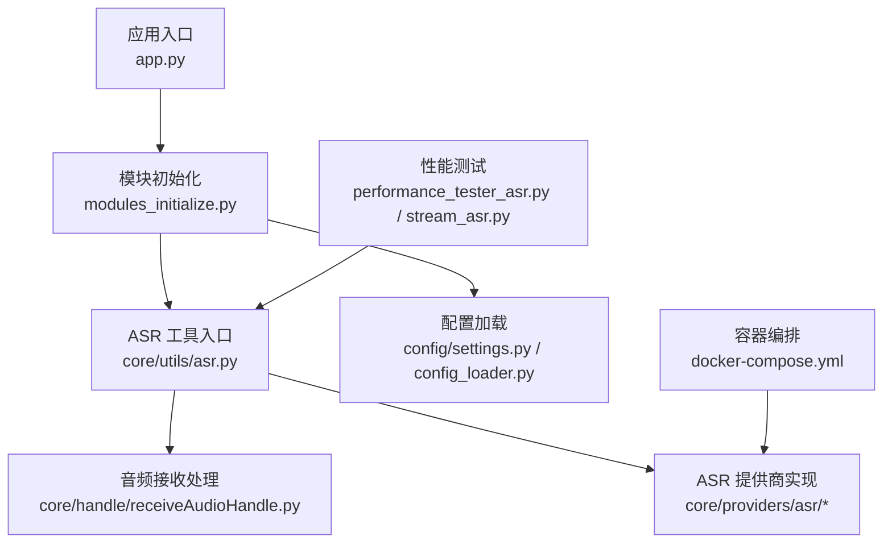
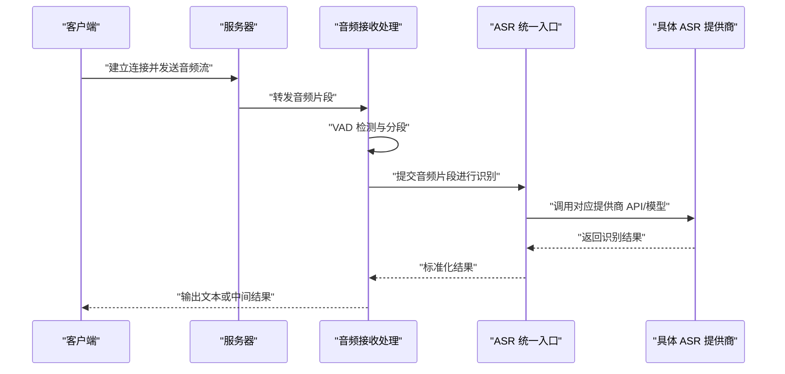
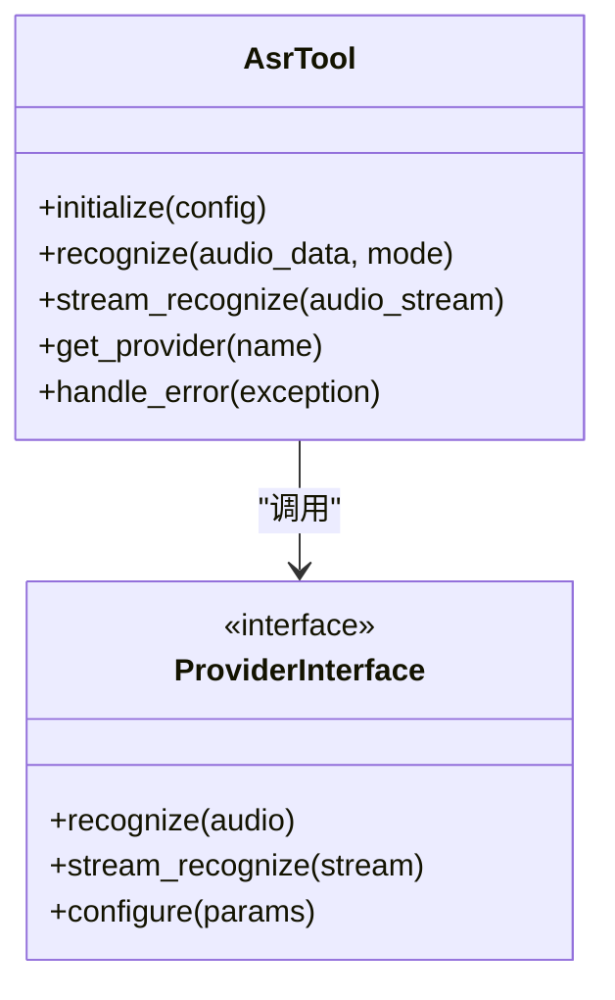
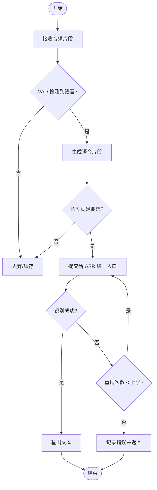
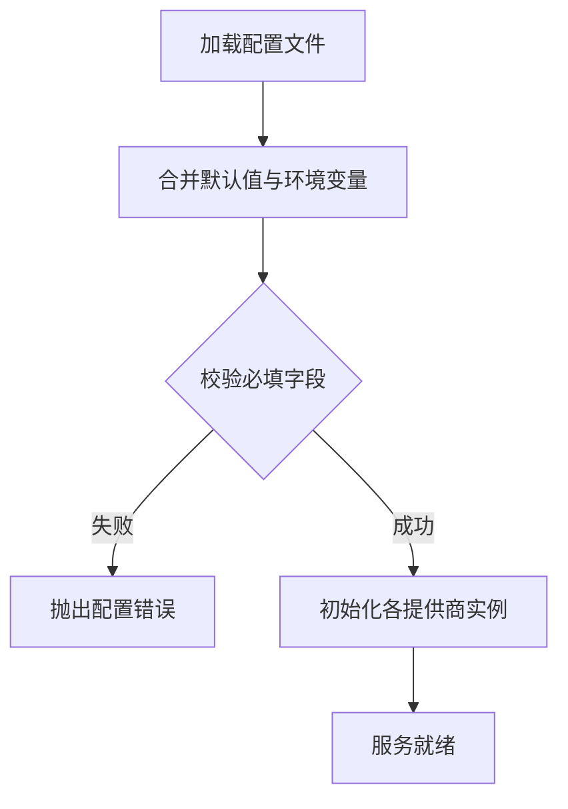
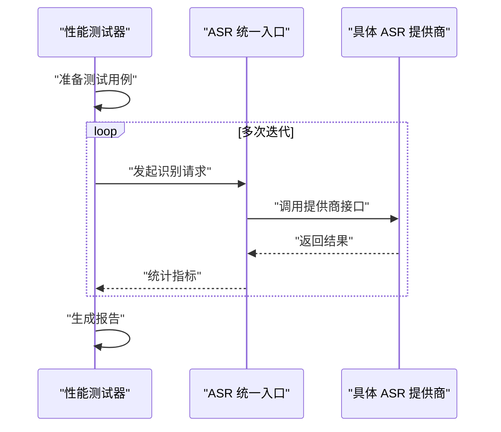
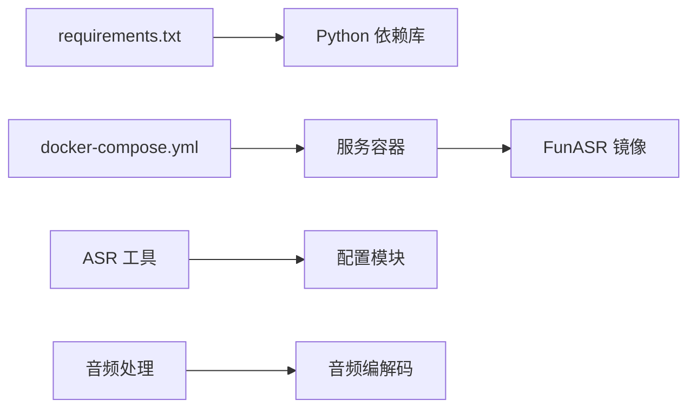

# 其他 ASR 提供商

<cite>
**本文引用的文件**   
- [app.py](file://main/xiaozhi-server/app.py)
- [asr.py](file://main/xiaozhi-server/core/utils/asr.py)
- [modules_initialize.py](file://main/xiaozhi-server/core/utils/modules_initialize.py)
- [receiveAudioHandle.py](file://main/xiaozhi-server/core/handle/receiveAudioHandle.py)
- [performance_tester_asr.py](file://main/xiaozhi-server/performance_tester/performance_tester_asr.py)
- [performance_tester_stream_asr.py](file://main/xiaozhi-server/performance_tester/performance_tester_stream_asr.py)
- [settings.py](file://main/xiaozhi-server/config/settings.py)
- [config_loader.py](file://main/xiaozhi-server/config/config_loader.py)
- [docker-compose.yml](file://main/xiaozhi-server/docker-compose.yml)
- [requirements.txt](file://main/xiaozhi-server/requirements.txt)
- [README.md](file://README.md)
</cite>

## 目录
1. [简介](#简介)
2. [项目结构](#项目结构)
3. [核心组件](#核心组件)
4. [架构总览](#架构总览)
5. [详细组件分析](#详细组件分析)
6. [依赖关系分析](#依赖关系分析)
7. [性能考量](#性能考量)
8. [故障排查指南](#故障排查指南)
9. [结论](#结论)
10. [附录](#附录)

## 简介
本技术文档面向希望在现有系统中集成更多 ASR（自动语音识别）提供商的工程师与运维人员。内容覆盖抖音豆包、腾讯云、OpenAI Whisper、Vosk、Sherpa-ONNX、FunASR、通义千问等主流方案，包括：
- 各提供商的特点、性能表现、成本优势与适用场景对比
- 本地部署（Vosk、Sherpa-ONNX）与云端服务的差异与权衡
- 配置参数、认证方式、API 调用示例（以路径引用形式提供）
- 离线识别实现原理、模型加载与内存优化
- 迁移指南：统一接口适配、不同提供商切换方法、性能基准测试流程

## 项目结构
系统采用模块化设计，ASR 能力通过统一的抽象层接入，便于扩展新的提供商。关键目录与职责如下：
- core/providers/asr：ASR 提供商的具体实现与注册
- core/utils/asr.py：ASR 工具与统一入口
- core/handle/receiveAudioHandle.py：音频接收与处理管线
- config/settings.py、config/config_loader.py：配置加载与默认值管理
- performance_tester/*：性能基准测试脚本
- docker-compose.yml：容器化编排（含 FunASR 镜像构建脚本）
- requirements.txt：Python 依赖清单

**图表来源** 
- [app.py](file://main/xiaozhi-server/app.py)
- [modules_initialize.py](file://main/xiaozhi-server/core/utils/modules_initialize.py)
- [asr.py](file://main/xiaozhi-server/core/utils/asr.py)
- [receiveAudioHandle.py](file://main/xiaozhi-server/core/handle/receiveAudioHandle.py)
- [settings.py](file://main/xiaozhi-server/config/settings.py)
- [config_loader.py](file://main/xiaozhi-server/config/config_loader.py)
- [performance_tester_asr.py](file://main/xiaozhi-server/performance_tester/performance_tester_asr.py)
- [performance_tester_stream_asr.py](file://main/xiaozhi-server/performance_tester/performance_tester_stream_asr.py)
- [docker-compose.yml](file://main/xiaozhi-server/docker-compose.yml)

**章节来源**
- [README.md](file://README.md)
- [app.py](file://main/xiaozhi-server/app.py)
- [modules_initialize.py](file://main/xiaozhi-server/core/utils/modules_initialize.py)
- [asr.py](file://main/xiaozhi-server/core/utils/asr.py)
- [receiveAudioHandle.py](file://main/xiaozhi-server/core/handle/receiveAudioHandle.py)
- [settings.py](file://main/xiaozhi-server/config/settings.py)
- [config_loader.py](file://main/xiaozhi-server/config/config_loader.py)
- [performance_tester_asr.py](file://main/xiaozhi-server/performance_tester/performance_tester_asr.py)
- [performance_tester_stream_asr.py](file://main/xiaozhi-server/performance_tester/performance_tester_stream_asr.py)
- [docker-compose.yml](file://main/xiaozhi-server/docker-compose.yml)

## 核心组件
- ASR 统一入口与工具：封装不同提供商的调用细节，对外暴露一致的识别接口
- 音频接收处理：负责流式音频数据收集、VAD 分段、超时控制与错误重试
- 配置与初始化：集中管理各提供商的配置项、认证信息与模型路径
- 性能测试：提供批量与流式两种模式的基准测试，支持多提供商对比

**章节来源**
- [asr.py](file://main/xiaozhi-server/core/utils/asr.py)
- [receiveAudioHandle.py](file://main/xiaozhi-server/core/handle/receiveAudioHandle.py)
- [settings.py](file://main/xiaozhi-server/config/settings.py)
- [config_loader.py](file://main/xiaozhi-server/config/config_loader.py)
- [performance_tester_asr.py](file://main/xiaozhi-server/performance_tester/performance_tester_asr.py)
- [performance_tester_stream_asr.py](file://main/xiaozhi-server/performance_tester/performance_tester_stream_asr.py)

## 架构总览
下图展示从音频输入到文本输出的整体流程，以及 ASR 提供商的统一接入点。

**图表来源** 
- [receiveAudioHandle.py](file://main/xiaozhi-server/core/handle/receiveAudioHandle.py)
- [asr.py](file://main/xiaozhi-server/core/utils/asr.py)

## 详细组件分析

### ASR 统一入口与工具
- 职责：屏蔽不同提供商的差异，提供统一的识别接口；管理会话状态、重试与超时；缓存常用配置与模型实例
- 关键点：
  - 提供商选择策略（按配置动态切换）
  - 流式与非流式识别的统一封装
  - 错误码与异常的统一映射
  - 日志与指标上报

**图表来源** 
- [asr.py](file://main/xiaozhi-server/core/utils/asr.py)

**章节来源**
- [asr.py](file://main/xiaozhi-server/core/utils/asr.py)

### 音频接收处理
- 职责：接收设备端音频流，执行 VAD 分段，控制超时与重试，将有效片段交给 ASR 统一入口
- 关键点：
  - 流式缓冲与丢帧策略
  - 静音检测阈值与最小片段长度
  - 网络抖动与重连机制
  - 与 ASR 的背压协调

**图表来源** 
- [receiveAudioHandle.py](file://main/xiaozhi-server/core/handle/receiveAudioHandle.py)

**章节来源**
- [receiveAudioHandle.py](file://main/xiaozhi-server/core/handle/receiveAudioHandle.py)

### 配置与初始化
- 职责：加载配置文件，设置默认值，校验必填字段，初始化各提供商实例
- 关键点：
  - 环境变量与 YAML/JSON 配置的优先级
  - 敏感信息（密钥）的安全存储
  - 模型路径与资源预加载策略

**图表来源** 
- [settings.py](file://main/xiaozhi-server/config/settings.py)
- [config_loader.py](file://main/xiaozhi-server/config/config_loader.py)

**章节来源**
- [settings.py](file://main/xiaozhi-server/config/settings.py)
- [config_loader.py](file://main/xiaozhi-server/config/config_loader.py)

### 性能测试
- 职责：提供批量与流式两种测试模式，统计延迟、吞吐、错误率等指标
- 关键点：
  - 并发请求控制
  - 结果比对与一致性检查
  - 可插拔的提供商适配器

**图表来源** 
- [performance_tester_asr.py](file://main/xiaozhi-server/performance_tester/performance_tester_asr.py)
- [performance_tester_stream_asr.py](file://main/xiaozhi-server/performance_tester/performance_tester_stream_asr.py)

**章节来源**
- [performance_tester_asr.py](file://main/xiaozhi-server/performance_tester/performance_tester_asr.py)
- [performance_tester_stream_asr.py](file://main/xiaozhi-server/performance_tester/performance_tester_stream_asr.py)

## 依赖关系分析
- Python 依赖：通过 requirements.txt 管理第三方库（如 HTTP 客户端、音频编解码、ONNX 运行时等）
- 容器依赖：docker-compose.yml 定义服务编排，包含 FunASR 镜像构建脚本
- 内部依赖：ASR 工具依赖配置模块，音频处理依赖 VAD 与编码器工具

**图表来源** 
- [requirements.txt](file://main/xiaozhi-server/requirements.txt)
- [docker-compose.yml](file://main/xiaozhi-server/docker-compose.yml)

**章节来源**
- [requirements.txt](file://main/xiaozhi-server/requirements.txt)
- [docker-compose.yml](file://main/xiaozhi-server/docker-compose.yml)

## 性能考量
- 延迟优化：
  - 流式识别减少首字延迟
  - 合理设置 VAD 阈值与片段长度
  - 使用异步 I/O 提高并发处理能力
- 吞吐优化：
  - 批处理音频片段
  - 模型量化与 ONNX 加速
  - GPU 加速（如适用）
- 资源优化：
  - 模型懒加载与共享
  - 内存池与对象复用
  - 监控与告警

[本节为通用指导，不直接分析具体文件]

## 故障排查指南
- 常见问题：
  - 认证失败：检查密钥与权限配置
  - 模型加载失败：确认路径与格式正确
  - 网络超时：调整超时与重试策略
  - 内存不足：优化模型大小与并发数
- 调试技巧：
  - 启用详细日志
  - 使用性能测试器定位瓶颈
  - 逐步替换提供商隔离问题

**章节来源**
- [asr.py](file://main/xiaozhi-server/core/utils/asr.py)
- [receiveAudioHandle.py](file://main/xiaozhi-server/core/handle/receiveAudioHandle.py)
- [performance_tester_asr.py](file://main/xiaozhi-server/performance_tester/performance_tester_asr.py)

## 结论
通过统一的 ASR 抽象层，系统能够灵活集成多种提供商，满足不同场景下的性能、成本与隐私需求。本地部署方案（Vosk、Sherpa-ONNX）适合离线与隐私敏感场景，云端服务（抖音豆包、腾讯云、OpenAI Whisper、FunASR、通义千问）则提供更强的实时性与可扩展性。建议根据业务需求选择合适的提供商，并通过性能测试持续优化。

[本节为总结性内容，不直接分析具体文件]

## 附录
- 配置参数参考：查看 settings.py 与 config_loader.py 中的默认值与校验逻辑
- 认证方式：各提供商的密钥管理与安全存储建议
- API 调用示例：参考 performance_tester_* 中的调用模式
- 迁移指南：通过统一接口切换提供商，无需修改上层业务代码

[本节为补充信息，不直接分析具体文件]