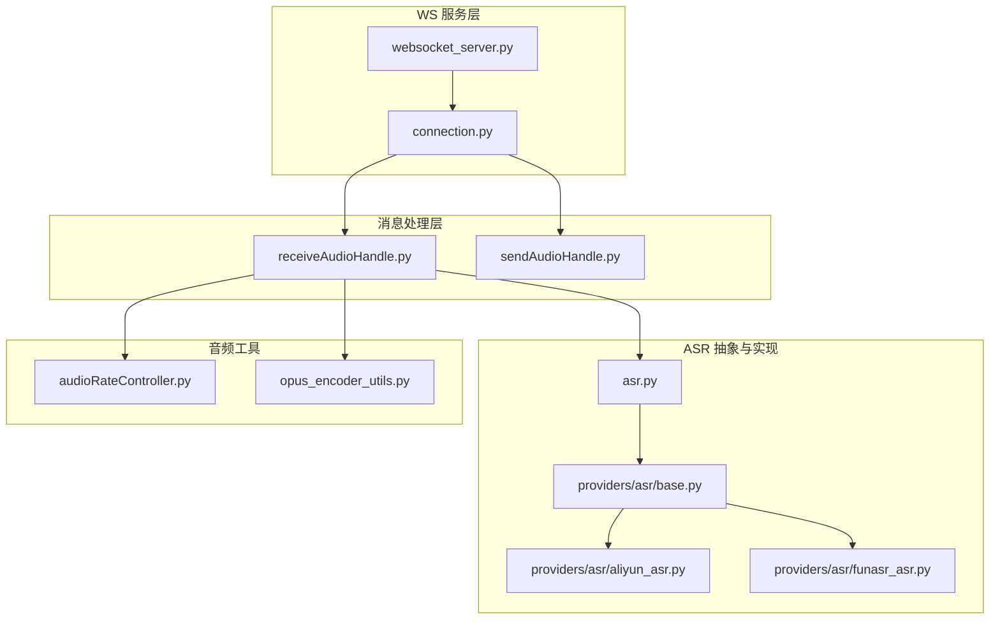
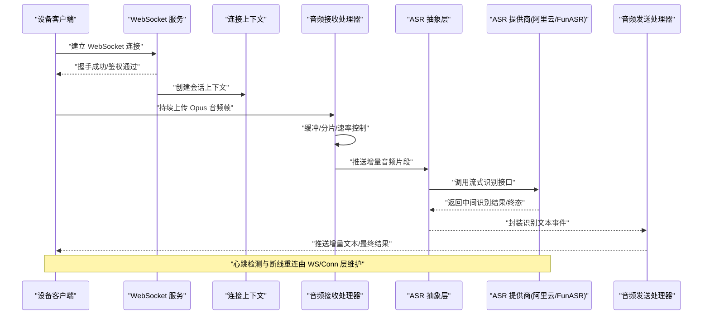
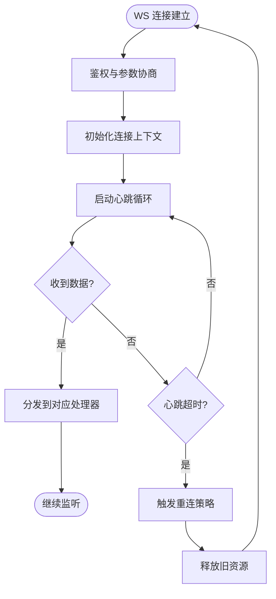
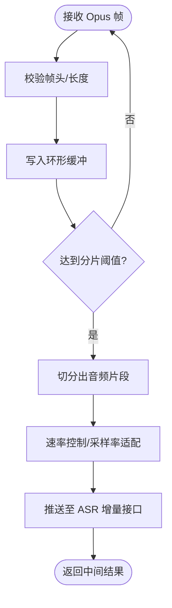
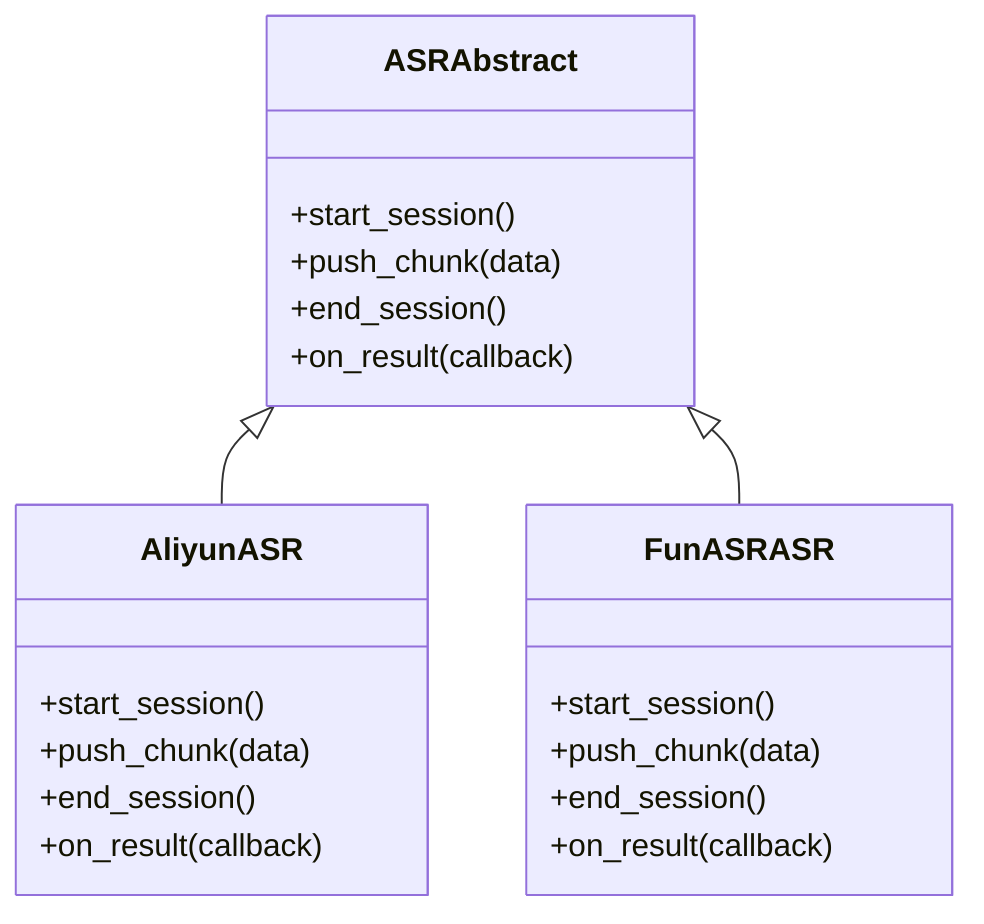
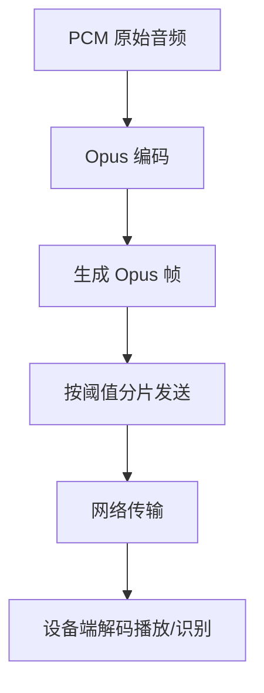
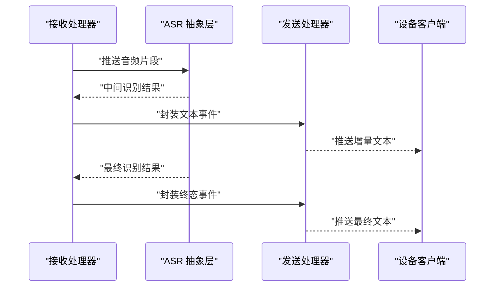
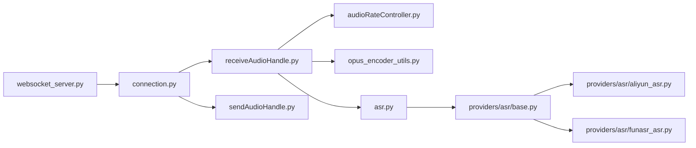

# 流式 ASR 实现详解

<cite>
**本文引用的文件**
- [xiaozhi-server/app.py](file://main/xiaozhi-server/app.py)
- [xiaozhi-server/core/websocket_server.py](file://main/xiaozhi-server/core/websocket_server.py)
- [xiaozhi-server/core/connection.py](file://main/xiaozhi-server/core/connection.py)
- [xiaozhi-server/core/handle/receiveAudioHandle.py](file://main/xiaozhi-server/core/handle/receiveAudioHandle.py)
- [xiaozhi-server/core/handle/sendAudioHandle.py](file://main/xiaozhi-server/core/handle/sendAudioHandle.py)
- [xiaozhi-server/core/utils/asr.py](file://main/xiaozhi-server/core/utils/asr.py)
- [xiaozhi-server/core/providers/asr/base.py](file://main/xiaozhi-server/core/providers/asr/base.py)
- [xiaozhi-server/core/providers/asr/aliyun_asr.py](file://main/xiaozhi-server/core/providers/asr/aliyun_asr.py)
- [xiaozhi-server/core/providers/asr/funasr_asr.py](file://main/xiaozhi-server/core/providers/asr/funasr_asr.py)
- [xiaozhi-server/core/utils/audioRateController.py](file://main/xiaozhi-server/core/utils/audioRateController.py)
- [xiaozhi-server/core/utils/opus_encoder_utils.py](file://main/xiaozhi-server/core/utils/opus_encoder_utils.py)
- [xiaozhi-server/performance_tester/performance_tester_stream_asr.py](file://main/xiaozhi-server/performance_tester/performance_tester_stream_asr.py)
</cite>

## 目录
1. [简介](#简介)
2. [项目结构](#项目结构)
3. [核心组件](#核心组件)
4. [架构总览](#架构总览)
5. [详细组件分析](#详细组件分析)
6. [依赖关系分析](#依赖关系分析)
7. [性能考量](#性能考量)
8. [故障排查指南](#故障排查指南)
9. [结论](#结论)
10. [附录](#附录)

## 简介
本技术文档围绕流式语音识别（ASR）在 xiaozhi-esp32-server 中的实现进行深入解析，涵盖以下关键主题：
- 音频流的分片处理与增量识别机制
- WebSocket 连接建立、心跳检测与断线重连策略
- 音频数据压缩传输、带宽优化与延迟控制
- 流式处理的内存管理、缓冲区策略与数据同步
- 完整的流式客户端示例流程（录音、实时上传、结果回调）
- 错误恢复、超时处理与资源清理
- 不同提供商（阿里云、FunASR）的流式实现差异与最佳实践

## 项目结构
本项目采用分层与按功能域组织相结合的结构。与流式 ASR 相关的核心代码集中在 xiaozhi-server 模块中：
- core/websocket_server.py：WebSocket 服务入口与连接生命周期管理
- core/connection.py：单连接上下文与会话状态
- core/handle/receiveAudioHandle.py：接收并分片音频帧
- core/handle/sendAudioHandle.py：发送文本/音频响应
- core/utils/asr.py：ASR 统一接口与调度
- core/providers/asr/*：各 ASR 提供商的具体实现
- core/utils/audioRateController.py：音频速率控制
- core/utils/opus_encoder_utils.py：Opus 编码工具
- performance_tester/performance_tester_stream_asr.py：流式 ASR 性能测试

图表来源
- [xiaozhi-server/core/websocket_server.py](file://main/xiaozhi-server/core/websocket_server.py)
- [xiaozhi-server/core/connection.py](file://main/xiaozhi-server/core/connection.py)
- [xiaozhi-server/core/handle/receiveAudioHandle.py](file://main/xiaozhi-server/core/handle/receiveAudioHandle.py)
- [xiaozhi-server/core/handle/sendAudioHandle.py](file://main/xiaozhi-server/core/handle/sendAudioHandle.py)
- [xiaozhi-server/core/utils/asr.py](file://main/xiaozhi-server/core/utils/asr.py)
- [xiaozhi-server/core/providers/asr/base.py](file://main/xiaozhi-server/core/providers/asr/base.py)
- [xiaozhi-server/core/providers/asr/aliyun_asr.py](file://main/xiaozhi-server/core/providers/asr/aliyun_asr.py)
- [xiaozhi-server/core/providers/asr/funasr_asr.py](file://main/xiaozhi-server/core/providers/asr/funasr_asr.py)
- [xiaozhi-server/core/utils/audioRateController.py](file://main/xiaozhi-server/core/utils/audioRateController.py)
- [xiaozhi-server/core/utils/opus_encoder_utils.py](file://main/xiaozhi-server/core/utils/opus_encoder_utils.py)

章节来源
- [xiaozhi-server/app.py](file://main/xiaozhi-server/app.py)
- [xiaozhi-server/core/websocket_server.py](file://main/xiaozhi-server/core/websocket_server.py)
- [xiaozhi-server/core/connection.py](file://main/xiaozhi-server/core/connection.py)

## 核心组件
- WebSocket 服务与连接管理
  - 负责 WS 握手、鉴权、会话初始化、心跳保活、异常断开与重连触发
- 音频接收与分片
  - 将设备端上传的 Opus 音频帧进行缓冲、去抖、切段，驱动增量识别
- ASR 抽象与提供商适配
  - 定义统一的流式 ASR 接口，屏蔽不同后端差异（阿里云、FunASR 等）
- 音频速率控制与编码
  - 控制上行采样率/码率，使用 Opus 编码降低带宽占用
- 响应发送
  - 将识别结果以文本或中间态形式回推至客户端

章节来源
- [xiaozhi-server/core/websocket_server.py](file://main/xiaozhi-server/core/websocket_server.py)
- [xiaozhi-server/core/connection.py](file://main/xiaozhi-server/core/connection.py)
- [xiaozhi-server/core/handle/receiveAudioHandle.py](file://main/xiaozhi-server/core/handle/receiveAudioHandle.py)
- [xiaozhi-server/core/handle/sendAudioHandle.py](file://main/xiaozhi-server/core/handle/sendAudioHandle.py)
- [xiaozhi-server/core/utils/asr.py](file://main/xiaozhi-server/core/utils/asr.py)
- [xiaozhi-server/core/providers/asr/base.py](file://main/xiaozhi-server/core/providers/asr/base.py)
- [xiaozhi-server/core/providers/asr/aliyun_asr.py](file://main/xiaozhi-server/core/providers/asr/aliyun_asr.py)
- [xiaozhi-server/core/providers/asr/funasr_asr.py](file://main/xiaozhi-server/core/providers/asr/funasr_asr.py)
- [xiaozhi-server/core/utils/audioRateController.py](file://main/xiaozhi-server/core/utils/audioRateController.py)
- [xiaozhi-server/core/utils/opus_encoder_utils.py](file://main/xiaozhi-server/core/utils/opus_encoder_utils.py)

## 架构总览
下图展示了从设备端到服务端 ASR 提供商的完整调用链路与数据流向。

图表来源
- [xiaozhi-server/core/websocket_server.py](file://main/xiaozhi-server/core/websocket_server.py)
- [xiaozhi-server/core/connection.py](file://main/xiaozhi-server/core/connection.py)
- [xiaozhi-server/core/handle/receiveAudioHandle.py](file://main/xiaozhi-server/core/handle/receiveAudioHandle.py)
- [xiaozhi-server/core/handle/sendAudioHandle.py](file://main/xiaozhi-server/core/handle/sendAudioHandle.py)
- [xiaozhi-server/core/utils/asr.py](file://main/xiaozhi-server/core/utils/asr.py)
- [xiaozhi-server/core/providers/asr/aliyun_asr.py](file://main/xiaozhi-server/core/providers/asr/aliyun_asr.py)
- [xiaozhi-server/core/providers/asr/funasr_asr.py](file://main/xiaozhi-server/core/providers/asr/funasr_asr.py)

## 详细组件分析

### WebSocket 连接与心跳、重连
- 连接建立
  - 处理握手、鉴权、参数协商（采样率、编码格式、语言模型等）
  - 初始化连接上下文与会话状态机
- 心跳检测
  - 周期性发送心跳帧，维护长连接存活
  - 对无响应的连接执行健康检查与告警
- 断线重连
  - 捕获网络异常与远端关闭事件
  - 指数退避重试，限制最大重试次数与间隔
  - 清理资源后重建会话

图表来源
- [xiaozhi-server/core/websocket_server.py](file://main/xiaozhi-server/core/websocket_server.py)
- [xiaozhi-server/core/connection.py](file://main/xiaozhi-server/core/connection.py)

章节来源
- [xiaozhi-server/core/websocket_server.py](file://main/xiaozhi-server/core/websocket_server.py)
- [xiaozhi-server/core/connection.py](file://main/xiaozhi-server/core/connection.py)

### 音频接收与分片处理
- 接收与解码
  - 接收设备端 Opus 帧，校验长度与序列号
  - 可选本地解码为 PCM 用于 VAD/静音检测
- 分片与增量
  - 基于时间窗口或帧数阈值进行分片
  - 将分片推送到 ASR 增量接口，获得中间结果
- 速率控制
  - 根据网络状况与设备能力动态调整采样率/码率
  - 避免拥塞与丢包导致的抖动

图表来源
- [xiaozhi-server/core/handle/receiveAudioHandle.py](file://main/xiaozhi-server/core/handle/receiveAudioHandle.py)
- [xiaozhi-server/core/utils/audioRateController.py](file://main/xiaozhi-server/core/utils/audioRateController.py)

章节来源
- [xiaozhi-server/core/handle/receiveAudioHandle.py](file://main/xiaozhi-server/core/handle/receiveAudioHandle.py)
- [xiaozhi-server/core/utils/audioRateController.py](file://main/xiaozhi-server/core/utils/audioRateController.py)

### ASR 抽象层与提供商实现
- 抽象接口
  - 定义统一的流式识别方法：开始、推送片段、结束、获取结果
  - 标准化错误码与事件回调
- 阿里云实现
  - 基于其流式 API，支持增量识别与实时文本回调
  - 处理鉴权、协议适配、断线重连
- FunASR 实现
  - 本地/云端推理引擎，提供流式接口
  - 针对中文场景优化，支持热词与标点恢复

图表来源
- [xiaozhi-server/core/utils/asr.py](file://main/xiaozhi-server/core/utils/asr.py)
- [xiaozhi-server/core/providers/asr/base.py](file://main/xiaozhi-server/core/providers/asr/base.py)
- [xiaozhi-server/core/providers/asr/aliyun_asr.py](file://main/xiaozhi-server/core/providers/asr/aliyun_asr.py)
- [xiaozhi-server/core/providers/asr/funasr_asr.py](file://main/xiaozhi-server/core/providers/asr/funasr_asr.py)

章节来源
- [xiaozhi-server/core/utils/asr.py](file://main/xiaozhi-server/core/utils/asr.py)
- [xiaozhi-server/core/providers/asr/base.py](file://main/xiaozhi-server/core/providers/asr/base.py)
- [xiaozhi-server/core/providers/asr/aliyun_asr.py](file://main/xiaozhi-server/core/providers/asr/aliyun_asr.py)
- [xiaozhi-server/core/providers/asr/funasr_asr.py](file://main/xiaozhi-server/core/providers/asr/funasr_asr.py)

### 音频编码与带宽优化
- Opus 编码
  - 使用 Opus 编码器将 PCM 转为低码率音频帧
  - 自适应码率与复杂度，平衡音质与带宽
- 传输优化
  - 合理设置帧大小与发送频率，减少小包开销
  - 结合 VAD 静音检测，跳过静音片段以降低负载

图表来源
- [xiaozhi-server/core/utils/opus_encoder_utils.py](file://main/xiaozhi-server/core/utils/opus_encoder_utils.py)

章节来源
- [xiaozhi-server/core/utils/opus_encoder_utils.py](file://main/xiaozhi-server/core/utils/opus_encoder_utils.py)

### 响应发送与结果回调
- 文本事件
  - 将 ASR 中间结果与最终结果封装为标准事件
  - 通过 WS 推送给客户端，支持增量更新
- 音频事件
  - 如需回传 TTS 或其他音频，采用相同分片与速率控制策略

图表来源
- [xiaozhi-server/core/handle/receiveAudioHandle.py](file://main/xiaozhi-server/core/handle/receiveAudioHandle.py)
- [xiaozhi-server/core/handle/sendAudioHandle.py](file://main/xiaozhi-server/core/handle/sendAudioHandle.py)
- [xiaozhi-server/core/utils/asr.py](file://main/xiaozhi-server/core/utils/asr.py)

章节来源
- [xiaozhi-server/core/handle/receiveAudioHandle.py](file://main/xiaozhi-server/core/handle/receiveAudioHandle.py)
- [xiaozhi-server/core/handle/sendAudioHandle.py](file://main/xiaozhi-server/core/handle/sendAudioHandle.py)
- [xiaozhi-server/core/utils/asr.py](file://main/xiaozhi-server/core/utils/asr.py)

### 内存管理与缓冲区策略
- 环形缓冲
  - 使用固定大小的环形缓冲存储音频帧，避免频繁分配
  - 读写指针分离，保证并发安全
- 分片阈值
  - 基于时间或帧数阈值触发分片，平衡延迟与吞吐
- 资源清理
  - 连接关闭时释放编码器、缓冲与句柄
  - 防止内存泄漏与僵尸线程

章节来源
- [xiaozhi-server/core/handle/receiveAudioHandle.py](file://main/xiaozhi-server/core/handle/receiveAudioHandle.py)
- [xiaozhi-server/core/connection.py](file://main/xiaozhi-server/core/connection.py)

### 数据同步与一致性
- 帧序号与时间戳
  - 为每帧添加序号与时间戳，确保顺序与可追溯性
- 幂等处理
  - 重复帧丢弃，避免重复识别
- 背压与限流
  - 当下游处理慢时，暂停上游推送，避免积压

章节来源
- [xiaozhi-server/core/handle/receiveAudioHandle.py](file://main/xiaozhi-server/core/handle/receiveAudioHandle.py)
- [xiaozhi-server/core/utils/asr.py](file://main/xiaozhi-server/core/utils/asr.py)

### 错误恢复与超时处理
- 网络异常
  - 捕获 IO 错误、超时、远端关闭
  - 触发重连与降级策略
- ASR 异常
  - 提供商不可用或返回错误码时，切换备用提供商或回退到非流式模式
- 资源清理
  - 确保所有句柄、线程与缓冲被正确释放

章节来源
- [xiaozhi-server/core/websocket_server.py](file://main/xiaozhi-server/core/websocket_server.py)
- [xiaozhi-server/core/connection.py](file://main/xiaozhi-server/core/connection.py)
- [xiaozhi-server/core/utils/asr.py](file://main/xiaozhi-server/core/utils/asr.py)

### 不同提供商的差异与最佳实践
- 阿里云
  - 优势：高可用、全球覆盖、增量识别成熟
  - 注意：鉴权与协议细节复杂，需严格遵循时序
- FunASR
  - 优势：开源可控、本地部署灵活、中文优化好
  - 注意：资源占用较高，需合理配置并发与缓存
- 通用建议
  - 统一抽象层屏蔽差异，便于热插拔
  - 监控指标：首字延迟、平均延迟、错误率、重连次数
  - 多提供商容灾：主备切换与自动降级

章节来源
- [xiaozhi-server/core/providers/asr/aliyun_asr.py](file://main/xiaozhi-server/core/providers/asr/aliyun_asr.py)
- [xiaozhi-server/core/providers/asr/funasr_asr.py](file://main/xiaozhi-server/core/providers/asr/funasr_asr.py)
- [xiaozhi-server/core/utils/asr.py](file://main/xiaozhi-server/core/utils/asr.py)

## 依赖关系分析
- 模块耦合
  - receiveAudioHandle 依赖 audioRateController 与 opus_encoder_utils
  - asr.py 作为抽象层，依赖具体提供商实现
  - websocket_server 与 connection 管理连接生命周期
- 外部依赖
  - WebSocket 库、Opus 编解码库、ASR SDK
- 潜在循环依赖
  - 通过抽象层解耦，避免直接循环引用

图表来源
- [xiaozhi-server/core/websocket_server.py](file://main/xiaozhi-server/core/websocket_server.py)
- [xiaozhi-server/core/connection.py](file://main/xiaozhi-server/core/connection.py)
- [xiaozhi-server/core/handle/receiveAudioHandle.py](file://main/xiaozhi-server/core/handle/receiveAudioHandle.py)
- [xiaozhi-server/core/handle/sendAudioHandle.py](file://main/xiaozhi-server/core/handle/sendAudioHandle.py)
- [xiaozhi-server/core/utils/asr.py](file://main/xiaozhi-server/core/utils/asr.py)
- [xiaozhi-server/core/providers/asr/base.py](file://main/xiaozhi-server/core/providers/asr/base.py)
- [xiaozhi-server/core/providers/asr/aliyun_asr.py](file://main/xiaozhi-server/core/providers/asr/aliyun_asr.py)
- [xiaozhi-server/core/providers/asr/funasr_asr.py](file://main/xiaozhi-server/core/providers/asr/funasr_asr.py)

章节来源
- [xiaozhi-server/core/websocket_server.py](file://main/xiaozhi-server/core/websocket_server.py)
- [xiaozhi-server/core/connection.py](file://main/xiaozhi-server/core/connection.py)
- [xiaozhi-server/core/handle/receiveAudioHandle.py](file://main/xiaozhi-server/core/handle/receiveAudioHandle.py)
- [xiaozhi-server/core/handle/sendAudioHandle.py](file://main/xiaozhi-server/core/handle/sendAudioHandle.py)
- [xiaozhi-server/core/utils/asr.py](file://main/xiaozhi-server/core/utils/asr.py)
- [xiaozhi-server/core/providers/asr/base.py](file://main/xiaozhi-server/core/providers/asr/base.py)
- [xiaozhi-server/core/providers/asr/aliyun_asr.py](file://main/xiaozhi-server/core/providers/asr/aliyun_asr.py)
- [xiaozhi-server/core/providers/asr/funasr_asr.py](file://main/xiaozhi-server/core/providers/asr/funasr_asr.py)

## 性能考量
- 首字延迟优化
  - 减小分片大小、提高推送频率
  - 预取与并行解码
- 带宽优化
  - 自适应码率、静音跳过、压缩传输
- 内存与 CPU
  - 环形缓冲与对象池减少分配
  - 控制并发与队列长度，避免阻塞
- 监控与调优
  - 采集延迟、吞吐、错误率、重连次数
  - A/B 测试不同分片策略与编码参数

章节来源
- [xiaozhi-server/core/utils/audioRateController.py](file://main/xiaozhi-server/core/utils/audioRateController.py)
- [xiaozhi-server/core/utils/opus_encoder_utils.py](file://main/xiaozhi-server/core/utils/opus_encoder_utils.py)
- [xiaozhi-server/performance_tester/performance_tester_stream_asr.py](file://main/xiaozhi-server/performance_tester/performance_tester_stream_asr.py)

## 故障排查指南
- 常见问题
  - 连接频繁断开：检查心跳配置与网络质量
  - 识别延迟高：调整分片阈值与编码参数
  - 内存增长：确认缓冲释放与资源清理
- 定位步骤
  - 查看 WS 日志与连接状态
  - 检查 ASR 提供商返回码与错误信息
  - 使用性能测试工具复现问题
- 恢复策略
  - 自动重连与降级
  - 切换提供商或回退非流式模式

章节来源
- [xiaozhi-server/core/websocket_server.py](file://main/xiaozhi-server/core/websocket_server.py)
- [xiaozhi-server/core/connection.py](file://main/xiaozhi-server/core/connection.py)
- [xiaozhi-server/core/utils/asr.py](file://main/xiaozhi-server/core/utils/asr.py)
- [xiaozhi-server/performance_tester/performance_tester_stream_asr.py](file://main/xiaozhi-server/performance_tester/performance_tester_stream_asr.py)

## 结论
本实现通过清晰的层次划分与抽象层设计，实现了稳定高效的流式 ASR 能力。WebSocket 连接管理、音频分片与增量识别、提供商适配与带宽优化共同构成了完整的流式语音识别链路。通过合理的内存管理、错误恢复与监控调优，可在复杂网络环境下保持低延迟与高可用性。

## 附录
- 客户端实现要点
  - 录音与编码：使用麦克风采集 PCM，经 Opus 编码后分片上传
  - 实时上传：按阈值或定时器推送，保持连接活跃
  - 结果回调：订阅文本事件，渲染中间与最终结果
  - 错误处理：捕获网络异常，触发重连与降级
- 参考实现路径
  - 性能测试用例可作为客户端行为参考

章节来源
- [xiaozhi-server/performance_tester/performance_tester_stream_asr.py](file://main/xiaozhi-server/performance_tester/performance_tester_stream_asr.py)