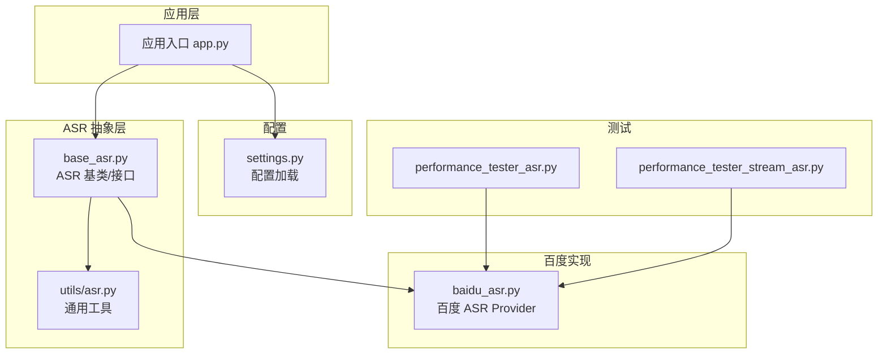
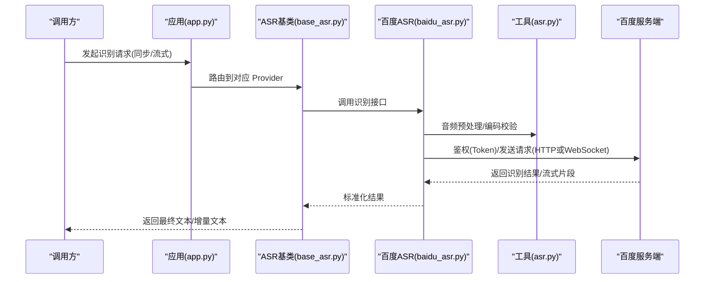
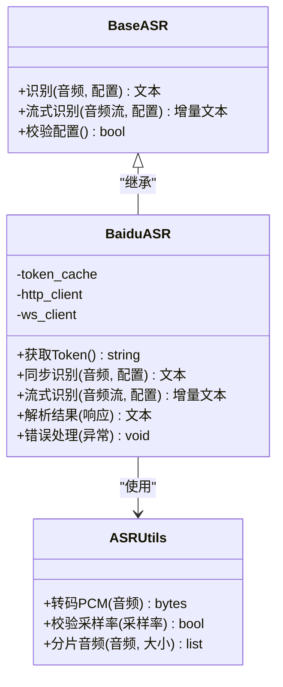
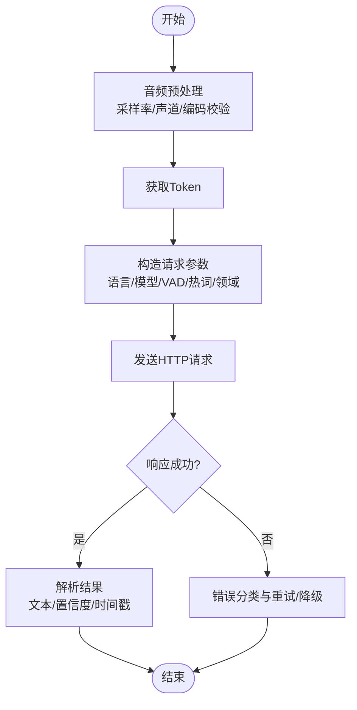
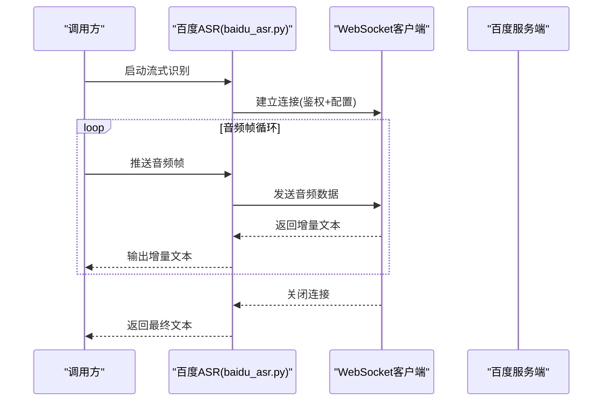
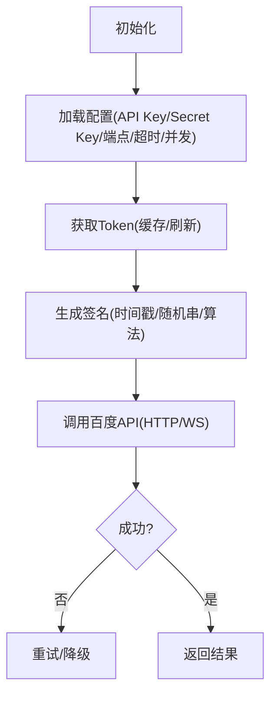
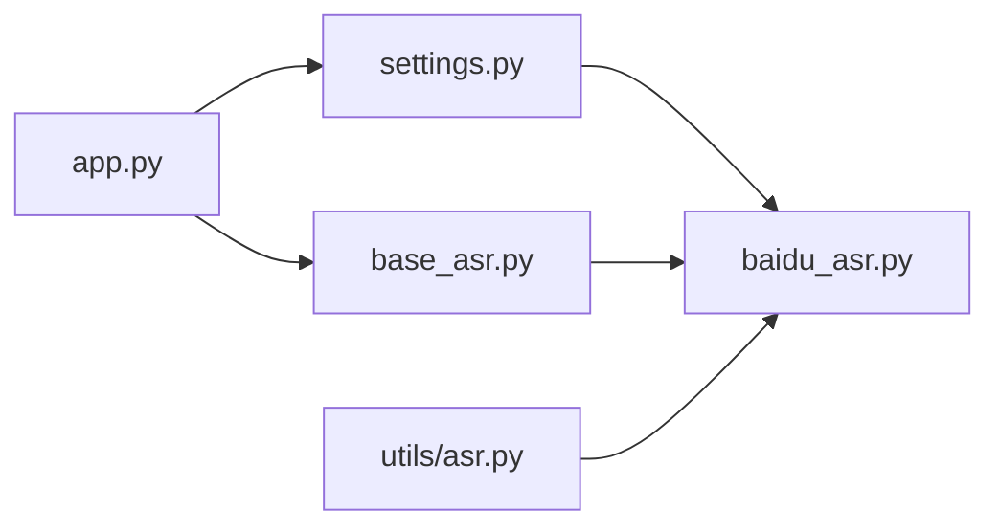

# 百度 ASR 集成

<cite>
**本文档引用的文件**   
- [xiaozhi-server/providers/asr/baidu_asr.py](file://main/xiaozhi-server/core/providers/asr/baidu_asr.py)
- [xiaozhi-server/providers/asr/base_asr.py](file://main/xiaozhi-server/core/providers/asr/base_asr.py)
- [xiaozhi-server/utils/asr.py](file://main/xiaozhi-server/core/utils/asr.py)
- [xiaozhi-server/config/settings.py](file://main/xiaozhi-server/config/settings.py)
- [xiaozhi-server/app.py](file://main/xiaozhi-server/app.py)
- [xiaozhi-server/performance_tester/performance_tester_asr.py](file://main/xiaozhi-server/performance_tester/performance_tester_asr.py)
- [xiaozhi-server/performance_tester/performance_tester_stream_asr.py](file://main/xiaozhi-server/performance_tester/performance_tester_stream_asr.py)
</cite>

## 目录
1. [简介](#简介)
2. [项目结构](#项目结构)
3. [核心组件](#核心组件)
4. [架构总览](#架构总览)
5. [详细组件分析](#详细组件分析)
6. [依赖关系分析](#依赖关系分析)
7. [性能考量](#性能考量)
8. [故障排查指南](#故障排查指南)
9. [结论](#结论)
10. [附录](#附录)

## 简介
本技术文档面向在 xiaozhi-esp32-server 中集成“百度语音识别（ASR）”的开发者与运维人员，系统阐述以下主题：
- 百度 ASR 的配置参数、API Key/Secret Key 获取与配置、应用权限设置
- HTTP API 与 WebSocket 两种接入方式的差异与适用场景
- 音频上传格式要求、语言模型选择（普通话、粤语、英语等）、领域定制选项
- 鉴权流程、Token 管理机制、请求签名算法
- 同步识别与流式识别的集成示例（以代码路径引用为主）
- 错误码处理、限流控制、计费统计等运维要点

## 项目结构
本项目将 ASR 能力抽象为 Provider 层，百度 ASR 作为其中一个实现。关键位置如下：
- ASR Provider 基类与工具：core/providers/asr/base_asr.py、core/utils/asr.py
- 百度 ASR 具体实现：core/providers/asr/baidu_asr.py
- 配置加载与全局设置：config/settings.py
- 应用入口与模块初始化：app.py
- 性能测试脚本（同步/流式）：performance_tester/performance_tester_asr.py、performance_tester/performance_tester_stream_asr.py

**图示来源** 
- [app.py](file://main/xiaozhi-server/app.py)
- [base_asr.py](file://main/xiaozhi-server/core/providers/asr/base_asr.py)
- [baidu_asr.py](file://main/xiaozhi-server/core/providers/asr/baidu_asr.py)
- [asr.py](file://main/xiaozhi-server/core/utils/asr.py)
- [settings.py](file://main/xiaozhi-server/config/settings.py)
- [performance_tester_asr.py](file://main/xiaozhi-server/performance_tester/performance_tester_asr.py)
- [performance_tester_stream_asr.py](file://main/xiaozhi-server/performance_tester/performance_tester_stream_asr.py)

**章节来源**
- [app.py](file://main/xiaozhi-server/app.py)
- [base_asr.py](file://main/xiaozhi-server/core/providers/asr/base_asr.py)
- [baidu_asr.py](file://main/xiaozhi-server/core/providers/asr/baidu_asr.py)
- [asr.py](file://main/xiaozhi-server/core/utils/asr.py)
- [settings.py](file://main/xiaozhi-server/config/settings.py)

## 核心组件
- ASR Provider 基类（base_asr.py）
  - 定义统一的 ASR 接口（如识别方法、流式识别方法、配置项校验等），屏蔽不同厂商差异。
- 百度 ASR Provider（baidu_asr.py）
  - 实现百度 ASR 的具体逻辑：鉴权 Token 获取、HTTP 调用或 WebSocket 流式识别、参数映射、结果解析、错误处理。
- ASR 工具（utils/asr.py）
  - 提供通用的音频处理、编码转换、采样率/通道数校验、分片策略等辅助能力。
- 配置（settings.py）
  - 集中管理百度 ASR 的 API Key、Secret Key、服务地址、超时、重试、并发限制等开关与阈值。
- 应用入口（app.py）
  - 负责模块初始化、Provider 注册、运行时配置注入。

**章节来源**
- [base_asr.py](file://main/xiaozhi-server/core/providers/asr/base_asr.py)
- [baidu_asr.py](file://main/xiaozhi-server/core/providers/asr/baidu_asr.py)
- [asr.py](file://main/xiaozhi-server/core/utils/asr.py)
- [settings.py](file://main/xiaozhi-server/config/settings.py)
- [app.py](file://main/xiaozhi-server/app.py)

## 架构总览
百度 ASR 集成采用“抽象 + 实现”的分层设计：上层通过统一 ASR 接口调用，底层由百度 Provider 完成鉴权、网络通信与结果解析。支持同步与流式两条链路，便于在不同业务场景下灵活选择。

**图示来源** 
- [app.py](file://main/xiaozhi-server/app.py)
- [base_asr.py](file://main/xiaozhi-server/core/providers/asr/base_asr.py)
- [baidu_asr.py](file://main/xiaozhi-server/core/providers/asr/baidu_asr.py)
- [asr.py](file://main/xiaozhi-server/core/utils/asr.py)

## 详细组件分析

### 百度 ASR Provider（baidu_asr.py）
- 功能职责
  - 鉴权：根据 API Key/Secret Key 获取访问令牌（Token），并缓存与自动刷新。
  - 同步识别：将音频数据（PCM/WAV/OPUS 等）经工具层处理后，通过 HTTP 接口提交识别。
  - 流式识别：建立 WebSocket 连接，按帧推送音频数据，接收增量识别结果。
  - 参数映射：将上层配置（语言、采样率、声道、VAD、标点、热词、领域模型等）转换为百度 API 所需字段。
  - 错误处理：对鉴权失败、网络异常、限流、参数不合法等进行分类处理与重试策略。
- 关键流程
  - Token 管理：首次获取后缓存，过期前自动续期；失败时退避重试。
  - 音频格式：统一为百度要求的采样率与编码（如 16k/8k PCM、单声道）。
  - 语言模型：支持普通话、粤语、英语等；可选领域定制（金融、医疗、客服等）。
  - 流式分片：按固定时长或大小切分音频帧，避免单次过大导致超时。
- 性能与稳定性
  - 连接池与超时控制：HTTP 连接复用、合理超时与重试次数。
  - 并发限制：基于 settings 的全局并发上限，防止触发服务端限流。
  - 降级策略：当百度不可用时，可回退至本地 VAD/静音检测或提示用户重试。

**图示来源** 
- [base_asr.py](file://main/xiaozhi-server/core/providers/asr/base_asr.py)
- [baidu_asr.py](file://main/xiaozhi-server/core/providers/asr/baidu_asr.py)
- [asr.py](file://main/xiaozhi-server/core/utils/asr.py)

**章节来源**
- [baidu_asr.py](file://main/xiaozhi-server/core/providers/asr/baidu_asr.py)
- [asr.py](file://main/xiaozhi-server/core/utils/asr.py)

### 同步识别流程（HTTP API）
- 适用场景
  - 离线录音文件识别、短语音批量处理、对实时性要求不高的场景。
- 关键步骤
  - 音频预处理：采样率/声道/编码校验与转换。
  - 鉴权：获取 Token 并附加到请求头或参数。
  - 请求构造：填充语言、采样率、声道、VAD、标点、热词、领域模型等参数。
  - 结果解析：提取文本、置信度、时间戳等结构化信息。
  - 错误处理：区分网络错误、鉴权失败、参数错误、服务端限流等。

**图示来源** 
- [baidu_asr.py](file://main/xiaozhi-server/core/providers/asr/baidu_asr.py)
- [asr.py](file://main/xiaozhi-server/core/utils/asr.py)

**章节来源**
- [baidu_asr.py](file://main/xiaozhi-server/core/providers/asr/baidu_asr.py)
- [asr.py](file://main/xiaozhi-server/core/utils/asr.py)

### 流式识别流程（WebSocket）
- 适用场景
  - 实时对话、长语音连续识别、低延迟交互场景。
- 关键步骤
  - 建立 WebSocket 连接，携带鉴权信息与基础配置。
  - 按帧推送音频数据（建议固定时长或大小分片）。
  - 接收增量识别结果，合并为完整文本。
  - 连接异常重连与断线恢复。

**图示来源** 
- [baidu_asr.py](file://main/xiaozhi-server/core/providers/asr/baidu_asr.py)

**章节来源**
- [baidu_asr.py](file://main/xiaozhi-server/core/providers/asr/baidu_asr.py)

### 配置与鉴权（settings.py 与 baidu_asr.py）
- 配置项建议
  - API Key / Secret Key：从安全存储读取（环境变量/密钥管理服务）。
  - 服务地址：HTTP 与 WebSocket 端点。
  - 超时与重试：连接超时、请求超时、最大重试次数、退避策略。
  - 并发限制：全局并发上限、队列长度。
  - 音频参数：默认采样率、声道、编码、分片大小。
  - 语言与模型：默认语言（普通话/粤语/英语）、是否启用标点、热词列表、领域模型。
- 鉴权流程
  - 使用 API Key/Secret Key 获取 Token，缓存有效期内的 Token。
  - Token 过期前自动刷新；失败时指数退避重试。
  - 请求签名：按百度规范生成签名（时间戳、随机串、签名算法），附加到请求头或参数。

**图示来源** 
- [settings.py](file://main/xiaozhi-server/config/settings.py)
- [baidu_asr.py](file://main/xiaozhi-server/core/providers/asr/baidu_asr.py)

**章节来源**
- [settings.py](file://main/xiaozhi-server/config/settings.py)
- [baidu_asr.py](file://main/xiaozhi-server/core/providers/asr/baidu_asr.py)

### 集成示例（同步与流式）
- 同步识别示例
  - 参考路径：[performance_tester_asr.py](file://main/xiaozhi-server/performance_tester/performance_tester_asr.py)
  - 说明：演示如何加载配置、准备音频、调用百度 ASR 同步接口、解析结果与错误处理。
- 流式识别示例
  - 参考路径：[performance_tester_stream_asr.py](file://main/xiaozhi-server/performance_tester/performance_tester_stream_asr.py)
  - 说明：演示如何建立 WebSocket 连接、分片推送音频、接收增量文本、处理断线与重连。

**章节来源**
- [performance_tester_asr.py](file://main/xiaozhi-server/performance_tester/performance_tester_asr.py)
- [performance_tester_stream_asr.py](file://main/xiaozhi-server/performance_tester/performance_tester_stream_asr.py)

## 依赖关系分析
- 模块耦合
  - baidu_asr.py 依赖 base_asr.py 提供的统一接口与 utils/asr.py 的工具函数。
  - settings.py 为所有模块提供运行时配置。
  - app.py 负责初始化与 Provider 注册，确保依赖注入正确。
- 外部依赖
  - 百度 ASR 服务端（HTTP/WS 端点）
  - 网络库（HTTP 客户端、WebSocket 客户端）
  - 音频编解码库（用于格式转换与校验）

**图示来源** 
- [settings.py](file://main/xiaozhi-server/config/settings.py)
- [base_asr.py](file://main/xiaozhi-server/core/providers/asr/base_asr.py)
- [baidu_asr.py](file://main/xiaozhi-server/core/providers/asr/baidu_asr.py)
- [asr.py](file://main/xiaozhi-server/core/utils/asr.py)
- [app.py](file://main/xiaozhi-server/app.py)

**章节来源**
- [settings.py](file://main/xiaozhi-server/config/settings.py)
- [base_asr.py](file://main/xiaozhi-server/core/providers/asr/base_asr.py)
- [baidu_asr.py](file://main/xiaozhi-server/core/providers/asr/baidu_asr.py)
- [asr.py](file://main/xiaozhi-server/core/utils/asr.py)
- [app.py](file://main/xiaozhi-server/app.py)

## 性能考量
- 音频预处理优化
  - 预校验采样率与声道，减少无效请求。
  - 按需进行格式转换与分片，避免大对象内存占用。
- 网络与并发
  - 合理设置连接池大小、超时与重试次数。
  - 控制全局并发上限，避免触发服务端限流。
- Token 缓存
  - 缓存有效 Token，减少鉴权开销。
  - 过期前主动刷新，降低失败概率。
- 流式识别
  - 分片大小与推送频率平衡，兼顾延迟与带宽。
  - 断线重连与增量合并策略，提升鲁棒性。

[本节为通用指导，无需特定文件引用]

## 故障排查指南
- 常见问题定位
  - 鉴权失败：检查 API Key/Secret Key、Token 缓存与刷新逻辑、签名生成是否正确。
  - 音频格式错误：确认采样率、声道、编码是否符合百度要求。
  - 网络异常：检查超时、重试、连接池配置与网络连通性。
  - 限流与配额：关注并发上限、请求频率、配额使用情况。
- 日志与监控
  - 记录关键节点日志（鉴权、请求、响应、错误分类）。
  - 统计成功率、延迟分布、错误码分布，便于问题定位。
- 降级与恢复
  - 当百度不可用时，提示用户重试或切换其他 ASR 提供商（若已实现）。
  - 对瞬时错误采用指数退避重试，避免雪崩。

**章节来源**
- [baidu_asr.py](file://main/xiaozhi-server/core/providers/asr/baidu_asr.py)
- [asr.py](file://main/xiaozhi-server/core/utils/asr.py)
- [settings.py](file://main/xiaozhi-server/config/settings.py)

## 结论
通过在 xiaozhi-esp32-server 中引入百度 ASR Provider，我们实现了统一抽象下的多厂商兼容与高内聚低耦合。结合合理的配置管理、鉴权机制、音频预处理与错误处理策略，可在同步与流式两种模式下稳定提供服务。建议在上线前充分验证音频格式、语言模型与领域定制选项，并结合监控与限流策略保障服务质量。

[本节为总结性内容，无需特定文件引用]

## 附录
- 百度 ASR 配置清单（建议）
  - API Key / Secret Key：从安全存储读取
  - 服务地址：HTTP/WS 端点
  - 超时与重试：连接/请求超时、最大重试次数、退避策略
  - 并发限制：全局并发上限、队列长度
  - 音频参数：默认采样率、声道、编码、分片大小
  - 语言与模型：默认语言（普通话/粤语/英语）、标点、热词、领域模型
- 常见错误码与处理
  - 鉴权失败：重新获取 Token，检查签名与时间戳
  - 参数错误：校验音频格式与必填字段
  - 限流：降低并发、增加退避间隔
  - 网络异常：重试与降级

[本节为补充信息，无需特定文件引用]