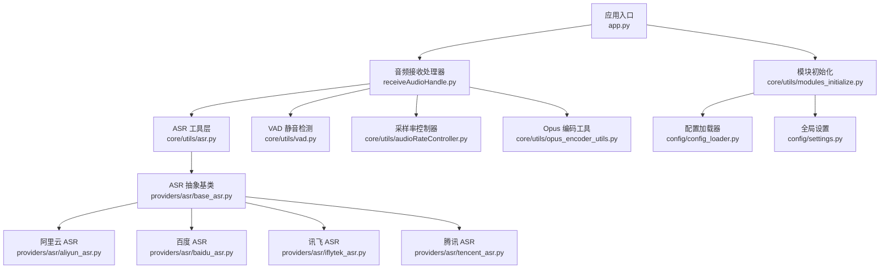
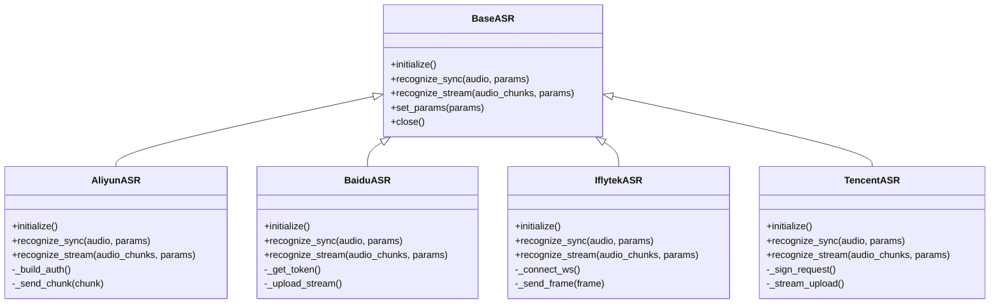
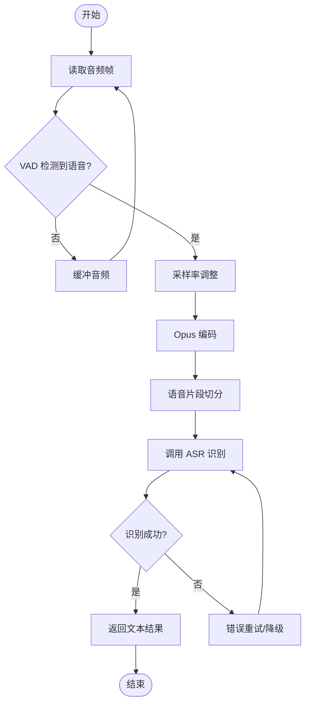
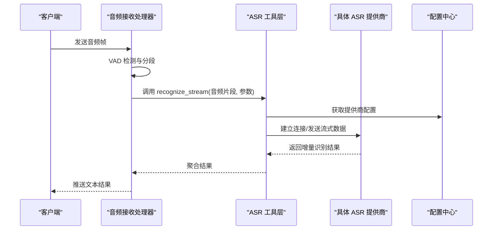
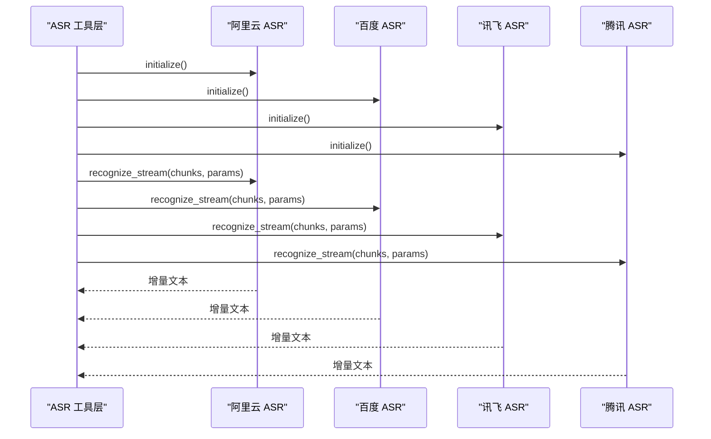
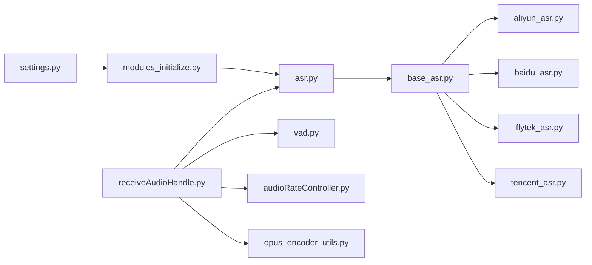

# 自动语音识别 (ASR)

<cite>
**本文引用的文件**   
- [app.py](file://main/xiaozhi-server/app.py)
- [receiveAudioHandle.py](file://main/xiaozhi-server/core/handle/receiveAudioHandle.py)
- [asr.py](file://main/xiaozhi-server/core/utils/asr.py)
- [audioRateController.py](file://main/xiaozhi-server/core/utils/audioRateController.py)
- [opus_encoder_utils.py](file://main/xiaozhi-server/core/utils/opus_encoder_utils.py)
- [vad.py](file://main/xiaozhi-server/core/utils/vad.py)
- [modules_initialize.py](file://main/xiaozhi-server/core/utils/modules_initialize.py)
- [settings.py](file://main/xiaozhi-server/config/settings.py)
- [config_loader.py](file://main/xiaozhi-server/config/config_loader.py)
- [performance_tester_asr.py](file://main/xiaozhi-server/performance_tester/performance_tester_asr.py)
- [performance_tester_stream_asr.py](file://main/xiaozhi-server/performance_tester/performance_tester_stream_asr.py)
- [aliyun_asr.py](file://main/xiaozhi-server/core/providers/asr/aliyun_asr.py)
- [baidu_asr.py](file://main/xiaozhi-server/core/providers/asr/baidu_asr.py)
- [iflytek_asr.py](file://main/xiaozhi-server/core/providers/asr/iflytek_asr.py)
- [tencent_asr.py](file://main/xiaozhi-server/core/providers/asr/tencent_asr.py)
- [base_asr.py](file://main/xiaozhi-server/core/providers/asr/base_asr.py)
</cite>

## 目录
1. [简介](#简介)
2. [项目结构](#项目结构)
3. [核心组件](#核心组件)
4. [架构总览](#架构总览)
5. [详细组件分析](#详细组件分析)
6. [依赖关系分析](#依赖关系分析)
7. [性能考量](#性能考量)
8. [故障排查指南](#故障排查指南)
9. [结论](#结论)
10. [附录](#附录)

## 简介
本技术文档面向自动语音识别（ASR）模块，系统性阐述其核心架构、音频流处理机制与实时识别原理。文档覆盖主流 ASR 提供商（阿里云、百度、讯飞、腾讯）的集成方式、配置参数、认证方法与 API 调用流程；深入解析音频格式转换、采样率处理、噪声抑制等关键技术；并给出流式识别实现方案、错误重试机制、性能优化策略。同时提供扩展新提供商、自定义音频预处理算法、提升识别准确率的最佳实践，以及多语言支持、方言识别、热词定制等高级功能说明。

## 项目结构
ASR 相关代码主要位于 xiaozhi-server 子项目中：
- 入口与调度：应用启动、WebSocket 连接与会话生命周期管理
- 音频处理：音频接收、VAD 静音检测、采样率控制、Opus 编解码
- ASR 抽象与实现：统一 ASR 接口、各厂商 SDK 封装
- 配置与初始化：全局设置加载、模块初始化、运行时参数注入
- 性能测试：离线与流式 ASR 基准测试工具

**图表来源** 
- [app.py](file://main/xiaozhi-server/app.py)
- [receiveAudioHandle.py](file://main/xiaozhi-server/core/handle/receiveAudioHandle.py)
- [asr.py](file://main/xiaozhi-server/core/utils/asr.py)
- [base_asr.py](file://main/xiaozhi-server/core/providers/asr/base_asr.py)
- [aliyun_asr.py](file://main/xiaozhi-server/core/providers/asr/aliyun_asr.py)
- [baidu_asr.py](file://main/xiaozhi-server/core/providers/asr/baidu_asr.py)
- [iflytek_asr.py](file://main/xiaozhi-server/core/providers/asr/iflytek_asr.py)
- [tencent_asr.py](file://main/xiaozhi-server/core/providers/asr/tencent_asr.py)
- [vad.py](file://main/xiaozhi-server/core/utils/vad.py)
- [audioRateController.py](file://main/xiaozhi-server/core/utils/audioRateController.py)
- [opus_encoder_utils.py](file://main/xiaozhi-server/core/utils/opus_encoder_utils.py)
- [modules_initialize.py](file://main/xiaozhi-server/core/utils/modules_initialize.py)
- [config_loader.py](file://main/xiaozhi-server/config/config_loader.py)
- [settings.py](file://main/xiaozhi-server/config/settings.py)

**章节来源**
- [app.py](file://main/xiaozhi-server/app.py)
- [receiveAudioHandle.py](file://main/xiaozhi-server/core/handle/receiveAudioHandle.py)
- [asr.py](file://main/xiaozhi-server/core/utils/asr.py)
- [vad.py](file://main/xiaozhi-server/core/utils/vad.py)
- [audioRateController.py](file://main/xiaozhi-server/core/utils/audioRateController.py)
- [opus_encoder_utils.py](file://main/xiaozhi-server/core/utils/opus_encoder_utils.py)
- [modules_initialize.py](file://main/xiaozhi-server/core/utils/modules_initialize.py)
- [config_loader.py](file://main/xiaozhi-server/config/config_loader.py)
- [settings.py](file://main/xiaozhi-server/config/settings.py)

## 核心组件
- 音频接收与 VAD：负责从 WebSocket 接收音频帧，进行静音检测与分段，触发 ASR 识别或流式增量输出
- ASR 工具层：统一封装不同厂商的 ASR 能力，提供同步与流式识别接口，管理会话、鉴权与重试
- 各厂商 ASR 实现：基于 base_asr 抽象，分别对接阿里云、百度、讯飞、腾讯的 SDK/API
- 音频预处理：采样率控制、Opus 编解码、降噪与增益控制
- 配置与初始化：集中加载配置项，按设备/会话动态选择 ASR 提供商与模型参数

**章节来源**
- [receiveAudioHandle.py](file://main/xiaozhi-server/core/handle/receiveAudioHandle.py)
- [asr.py](file://main/xiaozhi-server/core/utils/asr.py)
- [base_asr.py](file://main/xiaozhi-server/core/providers/asr/base_asr.py)
- [aliyun_asr.py](file://main/xiaozhi-server/core/providers/asr/aliyun_asr.py)
- [baidu_asr.py](file://main/xiaozhi-server/core/providers/asr/baidu_asr.py)
- [iflytek_asr.py](file://main/xiaozhi-server/core/providers/asr/iflytek_asr.py)
- [tencent_asr.py](file://main/xiaozhi-server/core/providers/asr/tencent_asr.py)
- [audioRateController.py](file://main/xiaozhi-server/core/utils/audioRateController.py)
- [opus_encoder_utils.py](file://main/xiaozhi-server/core/utils/opus_encoder_utils.py)
- [vad.py](file://main/xiaozhi-server/core/utils/vad.py)

## 架构总览
ASR 模块采用“统一抽象 + 多实现”的设计模式。上层通过 asr.py 暴露标准接口，底层由 base_asr 定义契约，具体厂商实现按需接入。音频流在 receiveAudioHandle 中经 VAD 分割后送入 ASR 工具层，根据配置选择对应提供商，完成实时识别与结果回传。

**图表来源** 
- [base_asr.py](file://main/xiaozhi-server/core/providers/asr/base_asr.py)
- [aliyun_asr.py](file://main/xiaozhi-server/core/providers/asr/aliyun_asr.py)
- [baidu_asr.py](file://main/xiaozhi-server/core/providers/asr/baidu_asr.py)
- [iflytek_asr.py](file://main/xiaozhi-server/core/providers/asr/iflytek_asr.py)
- [tencent_asr.py](file://main/xiaozhi-server/core/providers/asr/tencent_asr.py)

## 详细组件分析

### 音频接收与 VAD 处理
- 音频帧接收：从 WebSocket 读取二进制音频数据，按固定大小分片
- VAD 静音检测：基于 vad.py 判断说话起止，生成可识别片段
- 采样率控制：使用 audioRateController 对输入音频进行重采样，确保与 ASR 模型要求一致
- Opus 编解码：通过 opus_encoder_utils 将 PCM 转换为 Opus 流，降低带宽占用

**图表来源** 
- [receiveAudioHandle.py](file://main/xiaozhi-server/core/handle/receiveAudioHandle.py)
- [vad.py](file://main/xiaozhi-server/core/utils/vad.py)
- [audioRateController.py](file://main/xiaozhi-server/core/utils/audioRateController.py)
- [opus_encoder_utils.py](file://main/xiaozhi-server/core/utils/opus_encoder_utils.py)

**章节来源**
- [receiveAudioHandle.py](file://main/xiaozhi-server/core/handle/receiveAudioHandle.py)
- [vad.py](file://main/xiaozhi-server/core/utils/vad.py)
- [audioRateController.py](file://main/xiaozhi-server/core/utils/audioRateController.py)
- [opus_encoder_utils.py](file://main/xiaozhi-server/core/utils/opus_encoder_utils.py)

### ASR 工具层与统一接口
- 统一接口：asr.py 提供 recognize_sync 与 recognize_stream 两个核心方法
- 提供商选择：根据配置 settings 与 modules_initialize 动态实例化具体 ASR 实现
- 会话管理：维护鉴权令牌、连接状态、超时与重试策略
- 参数传递：支持语言、采样率、热词、VAD 阈值等参数透传

**图表来源** 
- [asr.py](file://main/xiaozhi-server/core/utils/asr.py)
- [settings.py](file://main/xiaozhi-server/config/settings.py)
- [modules_initialize.py](file://main/xiaozhi-server/core/utils/modules_initialize.py)
- [base_asr.py](file://main/xiaozhi-server/core/providers/asr/base_asr.py)

**章节来源**
- [asr.py](file://main/xiaozhi-server/core/utils/asr.py)
- [settings.py](file://main/xiaozhi-server/config/settings.py)
- [modules_initialize.py](file://main/xiaozhi-server/core/utils/modules_initialize.py)

### 各厂商 ASR 实现要点
- 阿里云 ASR：支持流式与批量识别，需配置 AK/SK、AppKey、通道 ID；鉴权通过签名请求
- 百度 ASR：提供 REST 与 WebSocket 两种模式，需配置 AppID/AK/SK；支持实时流式上传
- 讯飞 ASR：基于 WebSocket 长连接，需配置 AppID、APIKey、APISecret；支持增量结果回调
- 腾讯 ASR：支持实时转写，需配置 SecretId/SecretKey、ProjectId；流式上传需分片与心跳

**图表来源** 
- [aliyun_asr.py](file://main/xiaozhi-server/core/providers/asr/aliyun_asr.py)
- [baidu_asr.py](file://main/xiaozhi-server/core/providers/asr/baidu_asr.py)
- [iflytek_asr.py](file://main/xiaozhi-server/core/providers/asr/iflytek_asr.py)
- [tencent_asr.py](file://main/xiaozhi-server/core/providers/asr/tencent_asr.py)

**章节来源**
- [aliyun_asr.py](file://main/xiaozhi-server/core/providers/asr/aliyun_asr.py)
- [baidu_asr.py](file://main/xiaozhi-server/core/providers/asr/baidu_asr.py)
- [iflytek_asr.py](file://main/xiaozhi-server/core/providers/asr/iflytek_asr.py)
- [tencent_asr.py](file://main/xiaozhi-server/core/providers/asr/tencent_asr.py)

### 音频预处理与质量优化
- 采样率处理：audioRateController 支持 8k/16k/48k 等常见采样率转换，确保与 ASR 模型匹配
- 噪声抑制：可在预处理阶段加入降噪滤波器（如谱减法、维纳滤波），提升信噪比
- 增益控制：自适应音量归一化，避免过曝或过低导致识别失败
- 格式转换：PCM 到 Opus 的高效压缩，减少网络传输开销

**章节来源**
- [audioRateController.py](file://main/xiaozhi-server/core/utils/audioRateController.py)
- [opus_encoder_utils.py](file://main/xiaozhi-server/core/utils/opus_encoder_utils.py)

### 流式识别与实时性保障
- 流式上传：按固定时长（如 20ms）分片上传，降低首字延迟
- 增量结果：服务端实时返回中间识别结果，前端可即时展示
- 断线重连：网络异常时自动重建连接，保证会话连续性
- 背压控制：当上游生产速率高于下游消费时，采用队列缓冲与丢弃策略

**章节来源**
- [asr.py](file://main/xiaozhi-server/core/utils/asr.py)
- [receiveAudioHandle.py](file://main/xiaozhi-server/core/handle/receiveAudioHandle.py)

### 错误重试与降级策略
- 重试机制：针对网络抖动、临时服务不可用，支持指数退避重试
- 降级策略：主提供商失败时自动切换到备用提供商（如阿里云失败则切换百度）
- 超时控制：单条请求最大等待时间，避免阻塞主线程
- 日志记录：关键错误与重试次数记录，便于问题定位

**章节来源**
- [asr.py](file://main/xiaozhi-server/core/utils/asr.py)
- [settings.py](file://main/xiaozhi-server/config/settings.py)

## 依赖关系分析
ASR 模块依赖关系清晰，耦合度低，便于扩展与维护。

**图表来源** 
- [settings.py](file://main/xiaozhi-server/config/settings.py)
- [modules_initialize.py](file://main/xiaozhi-server/core/utils/modules_initialize.py)
- [asr.py](file://main/xiaozhi-server/core/utils/asr.py)
- [base_asr.py](file://main/xiaozhi-server/core/providers/asr/base_asr.py)
- [aliyun_asr.py](file://main/xiaozhi-server/core/providers/asr/aliyun_asr.py)
- [baidu_asr.py](file://main/xiaozhi-server/core/providers/asr/baidu_asr.py)
- [iflytek_asr.py](file://main/xiaozhi-server/core/providers/asr/iflytek_asr.py)
- [tencent_asr.py](file://main/xiaozhi-server/core/providers/asr/tencent_asr.py)
- [receiveAudioHandle.py](file://main/xiaozhi-server/core/handle/receiveAudioHandle.py)
- [vad.py](file://main/xiaozhi-server/core/utils/vad.py)
- [audioRateController.py](file://main/xiaozhi-server/core/utils/audioRateController.py)
- [opus_encoder_utils.py](file://main/xiaozhi-server/core/utils/opus_encoder_utils.py)

**章节来源**
- [settings.py](file://main/xiaozhi-server/config/settings.py)
- [modules_initialize.py](file://main/xiaozhi-server/core/utils/modules_initialize.py)
- [asr.py](file://main/xiaozhi-server/core/utils/asr.py)
- [base_asr.py](file://main/xiaozhi-server/core/providers/asr/base_asr.py)
- [receiveAudioHandle.py](file://main/xiaozhi-server/core/handle/receiveAudioHandle.py)

## 性能考量
- 首字延迟：流式分片大小与频率直接影响首字延迟，建议 20ms 分片
- 并发处理：多线程/协程并行处理多个会话，避免阻塞
- 内存管理：及时释放音频缓冲区，防止内存泄漏
- 网络优化：复用连接、压缩传输、CDN 加速
- 基准测试：使用 performance_tester_asr.py 与 performance_tester_stream_asr.py 进行离线与流式性能评估

**章节来源**
- [performance_tester_asr.py](file://main/xiaozhi-server/performance_tester/performance_tester_asr.py)
- [performance_tester_stream_asr.py](file://main/xiaozhi-server/performance_tester/performance_tester_stream_asr.py)

## 故障排查指南
- 常见问题
  - 无法连接 ASR 服务：检查网络连通性与防火墙规则
  - 鉴权失败：核对 AK/SK、AppID、密钥有效期
  - 音频格式错误：确认采样率、声道数、编码格式是否符合要求
  - 识别结果为空：检查 VAD 阈值、噪声环境、麦克风权限
- 调试技巧
  - 启用详细日志：记录音频帧大小、分片数量、网络耗时
  - 本地回放：保存原始音频与处理后音频对比
  - 模拟测试：使用 performance_tester 模拟高负载场景

**章节来源**
- [asr.py](file://main/xiaozhi-server/core/utils/asr.py)
- [receiveAudioHandle.py](file://main/xiaozhi-server/core/handle/receiveAudioHandle.py)
- [settings.py](file://main/xiaozhi-server/config/settings.py)

## 结论
ASR 模块通过统一抽象与多实现设计，实现了灵活可扩展的语音识别能力。结合高效的音频预处理、流式识别与健壮的错误处理机制，能够满足实时语音交互的高性能需求。未来可进一步引入更先进的降噪算法、多语言混合识别与个性化热词定制，以提升用户体验与识别准确率。

## 附录
- 新增 ASR 提供商步骤
  - 继承 base_asr.BaseASR，实现 initialize、recognize_sync、recognize_stream 等方法
  - 在 modules_initialize.py 中注册新提供商
  - 在 settings.py 中添加配置项
  - 编写单元测试与性能测试用例
- 自定义音频预处理算法
  - 在 audioRateController 或独立预处理模块中实现降噪、增益、均衡等功能
  - 通过配置开关控制是否启用预处理
- 优化识别准确率
  - 调整 VAD 阈值与静音段长度
  - 增加热词表与领域词典
  - 使用高质量麦克风与环境降噪