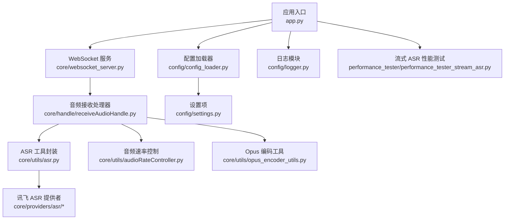
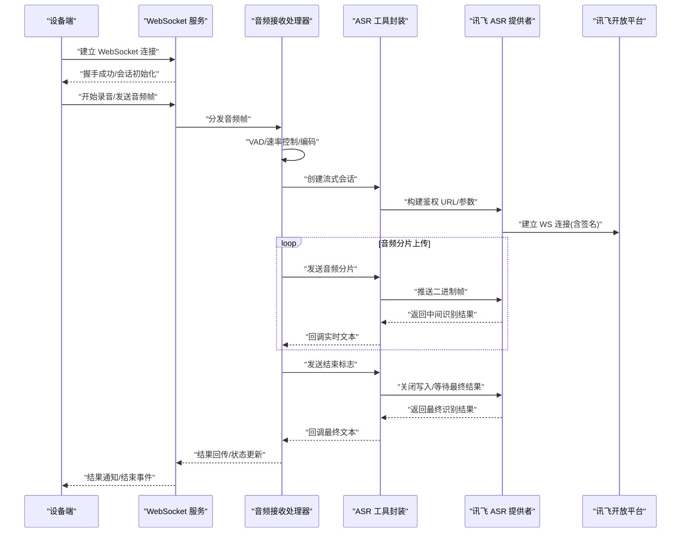
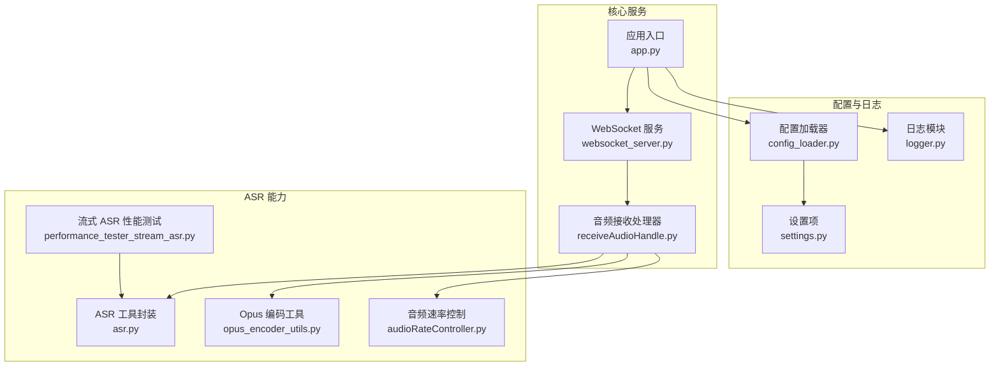

# 讯飞 ASR 集成

<cite>
**本文引用的文件**   
- [app.py](file://main/xiaozhi-server/app.py)
- [websocket_server.py](file://main/xiaozhi-server/core/websocket_server.py)
- [receiveAudioHandle.py](file://main/xiaozhi-server/core/handle/receiveAudioHandle.py)
- [asr.py](file://main/xiaozhi-server/core/utils/asr.py)
- [settings.py](file://main/xiaozhi-server/config/settings.py)
- [config_loader.py](file://main/xiaozhi-server/config/config_loader.py)
- [logger.py](file://main/xiaozhi-server/config/logger.py)
- [audioRateController.py](file://main/xiaozhi-server/core/utils/audioRateController.py)
- [opus_encoder_utils.py](file://main/xiaozhi-server/core/utils/opus_encoder_utils.py)
- [performance_tester_stream_asr.py](file://main/xiaozhi-server/performance_tester/performance_tester_stream_asr.py)
</cite>

## 目录
1. [简介](#简介)
2. [项目结构](#项目结构)
3. [核心组件](#核心组件)
4. [架构总览](#架构总览)
5. [详细组件分析](#详细组件分析)
6. [依赖关系分析](#依赖关系分析)
7. [性能考量](#性能考量)
8. [故障排查指南](#故障排查指南)
9. [结论](#结论)
10. [附录](#附录)

## 简介
本技术文档面向在 xiaozhi-esp32-server 项目中集成讯飞开放平台语音识别（ASR）的开发者，系统阐述配置方法、WebSocket 连接建立流程、身份认证机制，以及流式语音识别的实现原理与关键细节。内容涵盖音频分片上传、实时结果回调、标点符号处理、支持的音频格式与采样率范围、方言识别、中英混合识别、专业词汇定制等能力启用方式，并提供完整的 WebSocket 客户端实现示例，展示连接管理、消息发送、结果接收的完整流程，同时覆盖错误处理、连接保活、资源释放等关键实现要点。

## 项目结构
本项目采用分层模块化组织，ASR 相关能力位于 core/providers/asr 与 core/utils 中，服务端入口与 WebSocket 服务位于 core 层，配置与日志位于 config 层，性能测试工具位于 performance_tester。

图表来源
- [app.py](file://main/xiaozhi-server/app.py)
- [websocket_server.py](file://main/xiaozhi-server/core/websocket_server.py)
- [receiveAudioHandle.py](file://main/xiaozhi-server/core/handle/receiveAudioHandle.py)
- [asr.py](file://main/xiaozhi-server/core/utils/asr.py)
- [settings.py](file://main/xiaozhi-server/config/settings.py)
- [config_loader.py](file://main/xiaozhi-server/config/config_loader.py)
- [logger.py](file://main/xiaozhi-server/config/logger.py)
- [performance_tester_stream_asr.py](file://main/xiaozhi-server/performance_tester/performance_tester_stream_asr.py)

章节来源
- [app.py](file://main/xiaozhi-server/app.py)
- [websocket_server.py](file://main/xiaozhi-server/core/websocket_server.py)
- [receiveAudioHandle.py](file://main/xiaozhi-server/core/handle/receiveAudioHandle.py)
- [asr.py](file://main/xiaozhi-server/core/utils/asr.py)
- [settings.py](file://main/xiaozhi-server/config/settings.py)
- [config_loader.py](file://main/xiaozhi-server/config/config_loader.py)
- [logger.py](file://main/xiaozhi-server/config/logger.py)
- [performance_tester_stream_asr.py](file://main/xiaozhi-server/performance_tester/performance_tester_stream_asr.py)

## 核心组件
- 应用入口与生命周期：负责初始化配置、日志、各模块，并启动 WebSocket 服务。
- WebSocket 服务：维护设备连接、会话上下文、心跳与重连策略。
- 音频接收处理器：解析设备上报的音频帧，进行 VAD 判断、速率控制、编码与分片，调用 ASR 流式接口。
- ASR 工具封装：统一 ASR 抽象，提供流式识别、参数构建、结果回调与错误处理。
- 讯飞 ASR 提供者：实现讯飞开放平台 WebSocket 协议，包括鉴权签名、URL 构建、消息序列化和结果解析。
- 配置与日志：集中管理 ASR 密钥、域名、模型参数、日志级别与输出。
- 性能测试：流式 ASR 压测脚本，用于验证端到端时延与吞吐。

章节来源
- [app.py](file://main/xiaozhi-server/app.py)
- [websocket_server.py](file://main/xiaozhi-server/core/websocket_server.py)
- [receiveAudioHandle.py](file://main/xiaozhi-server/core/handle/receiveAudioHandle.py)
- [asr.py](file://main/xiaozhi-server/core/utils/asr.py)
- [settings.py](file://main/xiaozhi-server/config/settings.py)
- [config_loader.py](file://main/xiaozhi-server/config/config_loader.py)
- [logger.py](file://main/xiaozhi-server/config/logger.py)

## 架构总览
下图展示了从设备到讯飞 ASR 的端到端数据流与控制流，包含连接建立、鉴权、音频分片上传、实时结果回调与结束信号。

图表来源
- [websocket_server.py](file://main/xiaozhi-server/core/websocket_server.py)
- [receiveAudioHandle.py](file://main/xiaozhi-server/core/handle/receiveAudioHandle.py)
- [asr.py](file://main/xiaozhi-server/core/utils/asr.py)

## 详细组件分析

### 配置与鉴权
- 配置项
  - 讯飞 AppID、SecretKey、Domain、WS URL、模型参数（语言、方言、中英混合、标点、热词）。
  - 通过配置加载器读取 settings，支持环境变量或配置文件覆盖。
- 鉴权机制
  - 基于时间戳与 SecretKey 生成签名，拼接至 WS URL 查询参数。
  - 首次握手前完成签名计算，确保连接合法。
- 关键实现位置
  - 配置加载与默认值：[config_loader.py](file://main/xiaozhi-server/config/config_loader.py)、[settings.py](file://main/xiaozhi-server/config/settings.py)
  - 鉴权签名与 URL 构建：[asr.py](file://main/xiaozhi-server/core/utils/asr.py)

章节来源
- [config_loader.py](file://main/xiaozhi-server/config/config_loader.py)
- [settings.py](file://main/xiaozhi-server/config/settings.py)
- [asr.py](file://main/xiaozhi-server/core/utils/asr.py)

### WebSocket 连接建立流程
- 客户端侧
  - 构建带签名的 WS URL，发起连接。
  - 监听 open/close/error 事件，维护连接状态。
- 服务端侧
  - 接收设备连接，分配会话上下文。
  - 转发音频帧与 ASR 结果，保持心跳。
- 关键实现位置
  - 服务端 WS 接入：[websocket_server.py](file://main/xiaozhi-server/core/websocket_server.py)
  - 音频帧处理与 ASR 调用：[receiveAudioHandle.py](file://main/xiaozhi-server/core/handle/receiveAudioHandle.py)
  - ASR 工具封装（含连接管理）：[asr.py](file://main/xiaozhi-server/core/utils/asr.py)

章节来源
- [websocket_server.py](file://main/xiaozhi-server/core/websocket_server.py)
- [receiveAudioHandle.py](file://main/xiaozhi-server/core/handle/receiveAudioHandle.py)
- [asr.py](file://main/xiaozhi-server/core/utils/asr.py)

### 流式语音识别实现原理
- 音频分片上传
  - 将 PCM/Opus 音频按固定时长或大小切分为分片，逐帧推送。
  - 使用速率控制器保证稳定吞吐，避免拥塞。
- 实时结果回调
  - 服务端收到中间结果后，立即回调上层，用于 UI 展示或后续处理。
- 结束信号与最终结果
  - 发送结束标志后，等待最终结果；超时需触发重试或降级。
- 关键实现位置
  - 音频分片与速率控制：[receiveAudioHandle.py](file://main/xiaozhi-server/core/handle/receiveAudioHandle.py)、[audioRateController.py](file://main/xiaozhi-server/core/utils/audioRateController.py)
  - Opus 编码与封装：[opus_encoder_utils.py](file://main/xiaozhi-server/core/utils/opus_encoder_utils.py)
  - 流式 ASR 调用与回调：[asr.py](file://main/xiaozhi-server/core/utils/asr.py)

章节来源
- [receiveAudioHandle.py](file://main/xiaozhi-server/core/handle/receiveAudioHandle.py)
- [audioRateController.py](file://main/xiaozhi-server/core/utils/audioRateController.py)
- [opus_encoder_utils.py](file://main/xiaozhi-server/core/utils/opus_encoder_utils.py)
- [asr.py](file://main/xiaozhi-server/core/utils/asr.py)

### 音频格式、采样率与声道数
- 支持格式
  - 常见为 PCM 与 Opus；若使用 Opus，需确保编码器参数与讯飞要求一致。
- 采样率范围
  - 通常支持 8k/16k，推荐 16k 以获得更好识别效果。
- 声道数
  - 单声道（Mono）；多声道需下混为单声道。
- 关键实现位置
  - 编码与参数配置：[opus_encoder_utils.py](file://main/xiaozhi-server/core/utils/opus_encoder_utils.py)
  - 速率控制与分片：[audioRateController.py](file://main/xiaozhi-server/core/utils/audioRateController.py)

章节来源
- [opus_encoder_utils.py](file://main/xiaozhi-server/core/utils/opus_encoder_utils.py)
- [audioRateController.py](file://main/xiaozhi-server/core/utils/audioRateController.py)

### 方言识别、中英混合与专业词汇定制
- 方言识别
  - 通过模型参数指定方言（如粤语、四川话等），需在 ASR 请求头或参数中声明。
- 中英混合识别
  - 开启中英混合模式，提升混合场景准确率。
- 专业词汇定制（热词）
  - 上传热词表或在请求中注入自定义词，提高专有名词识别精度。
- 关键实现位置
  - 参数构建与传递：[asr.py](file://main/xiaozhi-server/core/utils/asr.py)
  - 配置项管理：[settings.py](file://main/xiaozhi-server/config/settings.py)、[config_loader.py](file://main/xiaozhi-server/config/config_loader.py)

章节来源
- [asr.py](file://main/xiaozhi-server/core/utils/asr.py)
- [settings.py](file://main/xiaozhi-server/config/settings.py)
- [config_loader.py](file://main/xiaozhi-server/config/config_loader.py)

### 标点符号处理
- 开启标点功能后，服务端会在中间结果与最终结果中包含标点。
- 前端展示建议对中间结果进行去噪与合并，最终结果直接渲染。
- 关键实现位置
  - 结果解析与回调：[asr.py](file://main/xiaozhi-server/core/utils/asr.py)

章节来源
- [asr.py](file://main/xiaozhi-server/core/utils/asr.py)

### WebSocket 客户端实现示例（流程说明）
- 连接管理
  - 构建带签名的 WS URL，建立连接；失败则指数退避重试。
- 消息发送
  - 首条消息为会话初始化（含模型参数）；随后循环发送音频分片。
- 结果接收
  - 监听中间结果与最终结果，分别回调上层处理。
- 结束与清理
  - 发送结束标志，等待最终结果；关闭连接并释放资源。
- 关键实现位置
  - 客户端流程参考：[performance_tester_stream_asr.py](file://main/xiaozhi-server/performance_tester/performance_tester_stream_asr.py)
  - 服务端对接与转发：[websocket_server.py](file://main/xiaozhi-server/core/websocket_server.py)、[receiveAudioHandle.py](file://main/xiaozhi-server/core/handle/receiveAudioHandle.py)

章节来源
- [performance_tester_stream_asr.py](file://main/xiaozhi-server/performance_tester/performance_tester_stream_asr.py)
- [websocket_server.py](file://main/xiaozhi-server/core/websocket_server.py)
- [receiveAudioHandle.py](file://main/xiaozhi-server/core/handle/receiveAudioHandle.py)

### 错误处理、连接保活与资源释放
- 错误处理
  - 网络异常、鉴权失败、参数错误、超时等；记录日志并触发重试或降级。
- 连接保活
  - 心跳检测与自动重连；断线后重建会话并恢复状态。
- 资源释放
  - 关闭 WS、释放编码器、清空缓冲区，避免内存泄漏。
- 关键实现位置
  - 日志与错误记录：[logger.py](file://main/xiaozhi-server/config/logger.py)
  - 连接与会话管理：[websocket_server.py](file://main/xiaozhi-server/core/websocket_server.py)
  - 音频与编码资源：[opus_encoder_utils.py](file://main/xiaozhi-server/core/utils/opus_encoder_utils.py)、[audioRateController.py](file://main/xiaozhi-server/core/utils/audioRateController.py)

章节来源
- [logger.py](file://main/xiaozhi-server/config/logger.py)
- [websocket_server.py](file://main/xiaozhi-server/core/websocket_server.py)
- [opus_encoder_utils.py](file://main/xiaozhi-server/core/utils/opus_encoder_utils.py)
- [audioRateController.py](file://main/xiaozhi-server/core/utils/audioRateController.py)

## 依赖关系分析
ASR 模块依赖配置、日志、音频处理与 WebSocket 服务，形成清晰的层次化依赖。

图表来源
- [app.py](file://main/xiaozhi-server/app.py)
- [websocket_server.py](file://main/xiaozhi-server/core/websocket_server.py)
- [receiveAudioHandle.py](file://main/xiaozhi-server/core/handle/receiveAudioHandle.py)
- [asr.py](file://main/xiaozhi-server/core/utils/asr.py)
- [opus_encoder_utils.py](file://main/xiaozhi-server/core/utils/opus_encoder_utils.py)
- [audioRateController.py](file://main/xiaozhi-server/core/utils/audioRateController.py)
- [config_loader.py](file://main/xiaozhi-server/config/config_loader.py)
- [settings.py](file://main/xiaozhi-server/config/settings.py)
- [logger.py](file://main/xiaozhi-server/config/logger.py)
- [performance_tester_stream_asr.py](file://main/xiaozhi-server/performance_tester/performance_tester_stream_asr.py)

章节来源
- [app.py](file://main/xiaozhi-server/app.py)
- [websocket_server.py](file://main/xiaozhi-server/core/websocket_server.py)
- [receiveAudioHandle.py](file://main/xiaozhi-server/core/handle/receiveAudioHandle.py)
- [asr.py](file://main/xiaozhi-server/core/utils/asr.py)
- [opus_encoder_utils.py](file://main/xiaozhi-server/core/utils/opus_encoder_utils.py)
- [audioRateController.py](file://main/xiaozhi-server/core/utils/audioRateController.py)
- [config_loader.py](file://main/xiaozhi-server/config/config_loader.py)
- [settings.py](file://main/xiaozhi-server/config/settings.py)
- [logger.py](file://main/xiaozhi-server/config/logger.py)
- [performance_tester_stream_asr.py](file://main/xiaozhi-server/performance_tester/performance_tester_stream_asr.py)

## 性能考量
- 分片大小与频率
  - 平衡时延与带宽，建议 20-40ms 分片，避免过大导致卡顿。
- 编码与解码开销
  - Opus 编码需合理设置码率与复杂度，避免 CPU 峰值。
- 并发与会话隔离
  - 每个设备独立会话，避免共享状态导致的竞争。
- 背压与缓冲
  - 使用队列与速率控制器，防止上游过快导致积压。
- 监控与压测
  - 使用性能测试脚本评估端到端时延与吞吐，定位瓶颈。

章节来源
- [audioRateController.py](file://main/xiaozhi-server/core/utils/audioRateController.py)
- [opus_encoder_utils.py](file://main/xiaozhi-server/core/utils/opus_encoder_utils.py)
- [performance_tester_stream_asr.py](file://main/xiaozhi-server/performance_tester/performance_tester_stream_asr.py)

## 故障排查指南
- 常见问题
  - 鉴权失败：检查时间戳、SecretKey、签名算法与 URL 参数。
  - 连接断开：检查网络稳定性、防火墙与代理设置。
  - 识别结果为空：确认音频格式、采样率、声道数与参数配置。
  - 延迟过高：优化分片大小、编码参数与网络路径。
- 排查步骤
  - 查看日志定位错误码与堆栈。
  - 复现问题并抓取 WS 报文，核对消息顺序与字段。
  - 调整参数并压测验证。
- 关键实现位置
  - 日志输出与错误记录：[logger.py](file://main/xiaozhi-server/config/logger.py)
  - 连接与会话状态：[websocket_server.py](file://main/xiaozhi-server/core/websocket_server.py)
  - ASR 调用与回调：[asr.py](file://main/xiaozhi-server/core/utils/asr.py)

章节来源
- [logger.py](file://main/xiaozhi-server/config/logger.py)
- [websocket_server.py](file://main/xiaozhi-server/core/websocket_server.py)
- [asr.py](file://main/xiaozhi-server/core/utils/asr.py)

## 结论
通过在 xiaozhi-esp32-server 中集成讯飞 ASR，可实现高可用、低时延的流式语音识别能力。合理的配置、稳健的连接管理与高效的音频处理是保障体验的关键。建议结合性能测试与监控持续优化，确保在不同网络与设备条件下的稳定表现。

## 附录
- 最佳实践
  - 使用 16k 单声道 PCM/Opus，分片 20-40ms。
  - 开启标点与中英混合，根据场景启用方言与热词。
  - 实现指数退避重连与心跳保活，及时释放资源。
- 参考实现
  - 流式 ASR 性能测试脚本可作为客户端实现参考。