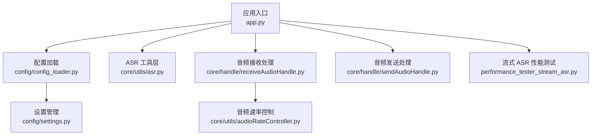
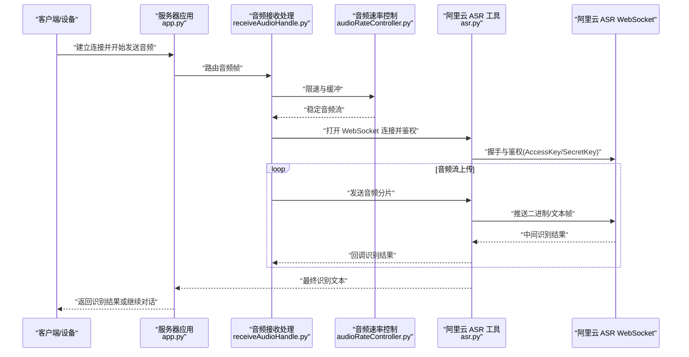
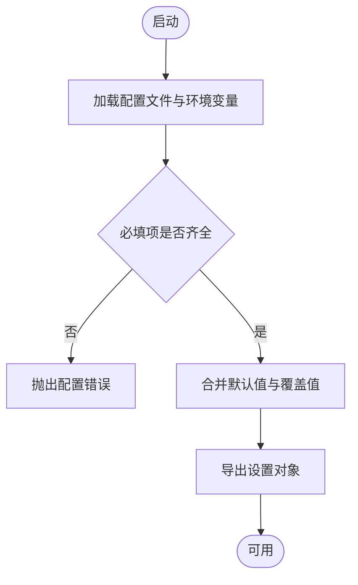
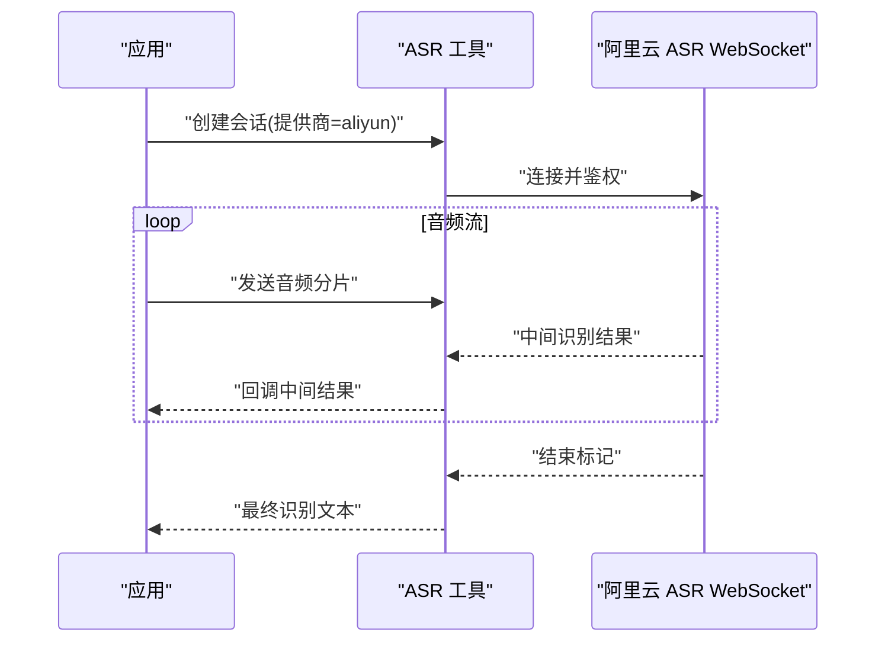
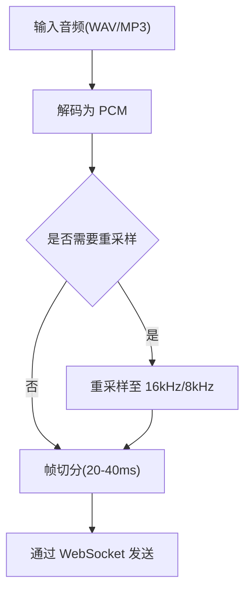
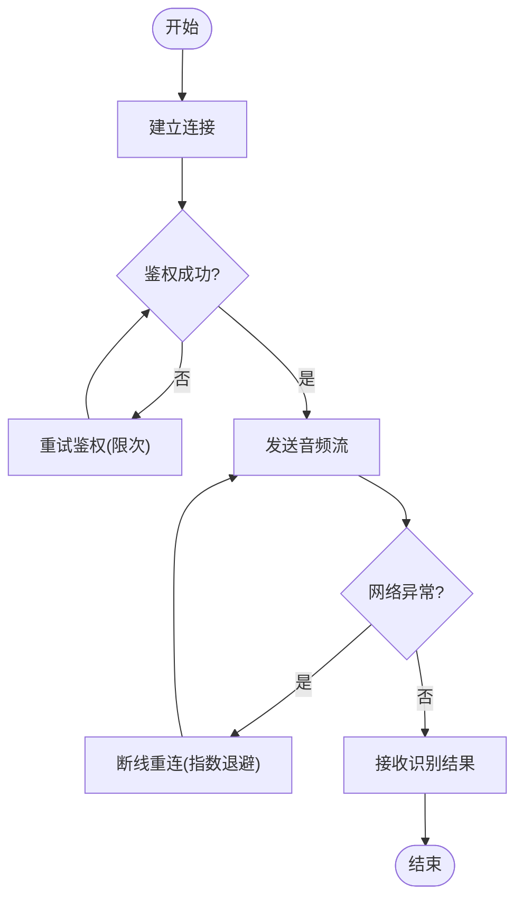
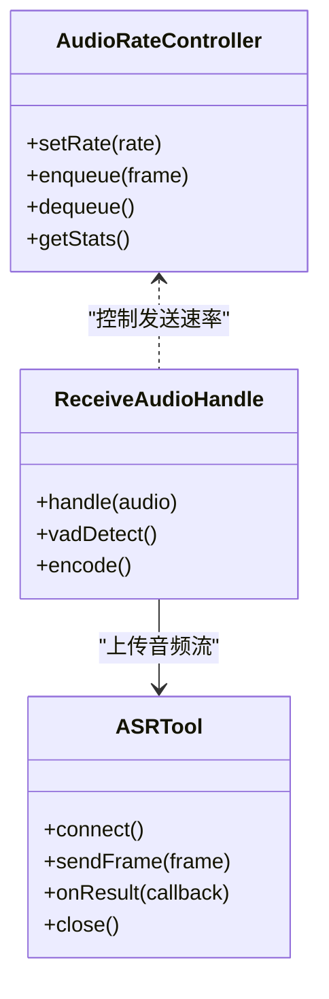
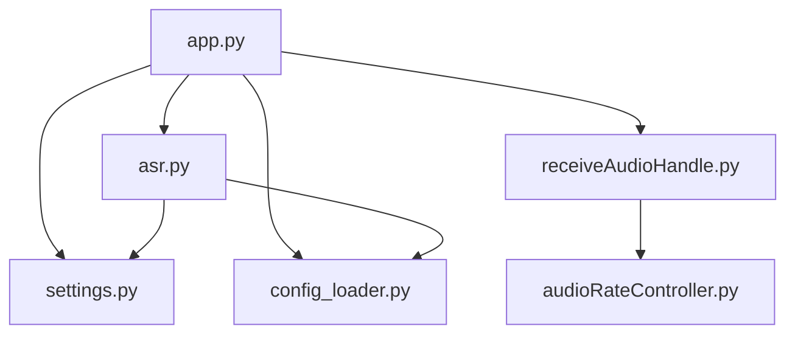

# 阿里云 ASR 集成

<cite>
**本文引用的文件**   
- [app.py](file://main/xiaozhi-server/app.py)
- [settings.py](file://main/xiaozhi-server/config/settings.py)
- [config_loader.py](file://main/xiaozhi-server/config/config_loader.py)
- [asr.py](file://main/xiaozhi-server/core/utils/asr.py)
- [receiveAudioHandle.py](file://main/xiaozhi-server/core/handle/receiveAudioHandle.py)
- [sendAudioHandle.py](file://main/xiaozhi-server/core/handle/sendAudioHandle.py)
- [audioRateController.py](file://main/xiaozhi-server/core/utils/audioRateController.py)
- [performance_tester_stream_asr.py](file://main/xiaozhi-server/performance_tester/performance_tester_stream_asr.py)
</cite>

## 目录
1. [简介](#简介)
2. [项目结构](#项目结构)
3. [核心组件](#核心组件)
4. [架构总览](#架构总览)
5. [详细组件分析](#详细组件分析)
6. [依赖关系分析](#依赖关系分析)
7. [性能与成本优化](#性能与成本优化)
8. [故障排查指南](#故障排查指南)
9. [结论](#结论)
10. [附录：配置与示例](#附录配置与示例)

## 简介
本技术文档面向在项目中集成阿里云语音识别（ASR）服务的开发者，重点说明：
- 配置参数与认证方式（AccessKey、SecretKey）
- API 端点设置与实时语音识别的 WebSocket 连接流程
- 音频格式要求（PCM、WAV、MP3）、采样率（16kHz、8kHz）与编码配置
- 错误处理策略、网络异常重试、断线重连机制
- 性能调优、并发连接限制与成本控制建议
- 完整配置示例与代码片段路径，便于快速落地

## 项目结构
本项目采用分层与按功能模块组织的方式。与阿里云 ASR 集成相关的核心位置如下：
- 应用入口与初始化：app.py
- 配置加载与设置：config/settings.py、config/config_loader.py
- ASR 工具层：core/utils/asr.py
- 音频接收与发送处理：core/handle/receiveAudioHandle.py、core/handle/sendAudioHandle.py
- 音频速率控制：core/utils/audioRateController.py
- 流式 ASR 性能测试：performance_tester/performance_tester_stream_asr.py

**图表来源** 
- [app.py](file://main/xiaozhi-server/app.py)
- [config_loader.py](file://main/xiaozhi-server/config/config_loader.py)
- [settings.py](file://main/xiaozhi-server/config/settings.py)
- [asr.py](file://main/xiaozhi-server/core/utils/asr.py)
- [receiveAudioHandle.py](file://main/xiaozhi-server/core/handle/receiveAudioHandle.py)
- [sendAudioHandle.py](file://main/xiaozhi-server/core/handle/sendAudioHandle.py)
- [audioRateController.py](file://main/xiaozhi-server/core/utils/audioRateController.py)
- [performance_tester_stream_asr.py](file://main/xiaozhi-server/performance_tester/performance_tester_stream_asr.py)

**章节来源**
- [app.py](file://main/xiaozhi-server/app.py)
- [config_loader.py](file://main/xiaozhi-server/config/config_loader.py)
- [settings.py](file://main/xiaozhi-server/config/settings.py)

## 核心组件
- 配置系统
  - settings.py：集中管理运行时配置项，包括 ASR 提供商、鉴权凭据、端点、超时、并发等。
  - config_loader.py：负责从配置文件或环境变量加载并校验设置，提供统一的访问接口。
- ASR 工具层
  - asr.py：封装阿里云 ASR 的调用逻辑，包含鉴权签名、请求构造、WebSocket 连接、音频流上传、结果解析与错误处理。
- 音频处理
  - receiveAudioHandle.py：接收设备/客户端音频帧，进行 VAD 检测、分片、编码与转发到 ASR。
  - sendAudioHandle.py：将 ASR 返回的文本结果与后续 TTS 输出进行编排与发送。
  - audioRateController.py：控制音频发送速率，避免丢包与拥塞，保障低延迟。
- 性能测试
  - performance_tester_stream_asr.py：用于评估流式 ASR 的端到端时延、吞吐与稳定性。

**章节来源**
- [settings.py](file://main/xiaozhi-server/config/settings.py)
- [config_loader.py](file://main/xiaozhi-server/config/config_loader.py)
- [asr.py](file://main/xiaozhi-server/core/utils/asr.py)
- [receiveAudioHandle.py](file://main/xiaozhi-server/core/handle/receiveAudioHandle.py)
- [sendAudioHandle.py](file://main/xiaozhi-server/core/handle/sendAudioHandle.py)
- [audioRateController.py](file://main/xiaozhi-server/core/utils/audioRateController.py)
- [performance_tester_stream_asr.py](file://main/xiaozhi-server/performance_tester/performance_tester_stream_asr.py)

## 架构总览
下图展示了从音频采集到 ASR 识别结果的端到端流程，以及关键组件之间的交互关系。

**图表来源** 
- [app.py](file://main/xiaozhi-server/app.py)
- [receiveAudioHandle.py](file://main/xiaozhi-server/core/handle/receiveAudioHandle.py)
- [audioRateController.py](file://main/xiaozhi-server/core/utils/audioRateController.py)
- [asr.py](file://main/xiaozhi-server/core/utils/asr.py)

## 详细组件分析

### 配置系统与认证
- 配置项要点
  - 提供商选择：aliyun（阿里云）
  - 鉴权凭据：AccessKey、SecretKey
  - 端点设置：实时语音识别 WebSocket 地址
  - 超时与重试：连接超时、读写超时、最大重试次数
  - 并发与限流：最大并发连接数、单连接队列长度
- 认证方式
  - 使用 AccessKey 与 SecretKey 生成签名，随 WebSocket 握手或首条消息发送
  - 支持按区域或环境切换端点（如生产/预发）
- 配置加载流程
  - config_loader.py 读取配置文件与环境变量，合并并校验必填项
  - settings.py 暴露统一访问接口，供 ASR 工具层与业务模块获取

**图表来源** 
- [config_loader.py](file://main/xiaozhi-server/config/config_loader.py)
- [settings.py](file://main/xiaozhi-server/config/settings.py)

**章节来源**
- [settings.py](file://main/xiaozhi-server/config/settings.py)
- [config_loader.py](file://main/xiaozhi-server/config/config_loader.py)

### 实时语音识别（WebSocket）流程
- 连接建立
  - 根据配置构建 WebSocket 地址与查询参数（含鉴权信息）
  - 建立连接后发送握手/初始化消息，完成鉴权
- 音频流上传
  - 将 PCM/WAV/MP3 数据按帧分片，通过二进制帧持续推送
  - 控制帧大小与间隔，确保低延迟与稳定传输
- 识别结果接收
  - 服务端返回中间结果与最终结果，应用层聚合为完整文本
  - 支持静音检测与说话人结束标记，触发最终结果回调

**图表来源** 
- [asr.py](file://main/xiaozhi-server/core/utils/asr.py)

**章节来源**
- [asr.py](file://main/xiaozhi-server/core/utils/asr.py)

### 音频格式与采样率
- 支持的音频格式
  - PCM：原始线性 PCM，推荐 16kHz 单声道
  - WAV：常见容器，内部可为 PCM 或压缩编码
  - MP3：压缩格式，需解码为 PCM 后再上传（降低带宽与存储）
- 采样率与编码
  - 推荐 16kHz 单声道；部分场景可使用 8kHz（带宽受限）
  - 编码位深通常为 16bit，具体以阿里云 ASR 文档为准
- 编码与分片
  - 将连续音频切分为固定大小的帧（例如 20-40ms），减少抖动
  - 使用音频速率控制器平滑发送，避免突发导致丢包

**图表来源** 
- [receiveAudioHandle.py](file://main/xiaozhi-server/core/handle/receiveAudioHandle.py)
- [audioRateController.py](file://main/xiaozhi-server/core/utils/audioRateController.py)

**章节来源**
- [receiveAudioHandle.py](file://main/xiaozhi-server/core/handle/receiveAudioHandle.py)
- [audioRateController.py](file://main/xiaozhi-server/core/utils/audioRateController.py)

### 错误处理与重连机制
- 网络异常
  - 连接失败：指数退避重试，限制最大重试次数
  - 读写超时：捕获超时异常，记录日志并尝试重连
  - 鉴权失败：检查 AccessKey/SecretKey 与端点配置，提示用户更新
- 断线重连
  - 心跳保活：定期发送心跳帧，维持连接活跃
  - 自动重连：检测到断开后，按策略重建连接并恢复音频流
- 结果处理
  - 中间结果累积：遇到乱序或重复，去重与排序
  - 最终结果确认：结合静音检测与结束标记，保证完整性

**图表来源** 
- [asr.py](file://main/xiaozhi-server/core/utils/asr.py)

**章节来源**
- [asr.py](file://main/xiaozhi-server/core/utils/asr.py)

### 性能调优与并发控制
- 并发连接限制
  - 设置最大并发连接数，防止资源耗尽
  - 单连接队列长度与缓冲区大小，平衡内存与延迟
- 音频发送速率
  - 使用音频速率控制器平滑发送，避免突发
  - 调整帧大小与间隔，优化时延与吞吐
- 超时与重试
  - 合理设置连接与读写超时，避免长时间阻塞
  - 重试策略结合业务 SLA，避免雪崩
- 监控与测试
  - 使用性能测试工具评估端到端时延与稳定性
  - 收集关键指标：连接成功率、平均时延、丢包率

**图表来源** 
- [audioRateController.py](file://main/xiaozhi-server/core/utils/audioRateController.py)
- [asr.py](file://main/xiaozhi-server/core/utils/asr.py)
- [receiveAudioHandle.py](file://main/xiaozhi-server/core/handle/receiveAudioHandle.py)

**章节来源**
- [audioRateController.py](file://main/xiaozhi-server/core/utils/audioRateController.py)
- [performance_tester_stream_asr.py](file://main/xiaozhi-server/performance_tester/performance_tester_stream_asr.py)

## 依赖关系分析
- 组件耦合
  - app.py 作为入口，协调配置加载与模块初始化
  - receiveAudioHandle.py 与 audioRateController.py 紧密协作，确保音频流稳定
  - asr.py 依赖 settings.py 与 config_loader.py 提供的配置
- 外部依赖
  - 阿里云 ASR WebSocket 服务：鉴权、端点、协议细节
  - 音频编解码库：WAV/MP3 解码与 PCM 转换
- 潜在风险
  - 循环依赖：应避免模块间互相导入
  - 外部服务不可用：需要健壮的降级与熔断策略

**图表来源** 
- [app.py](file://main/xiaozhi-server/app.py)
- [settings.py](file://main/xiaozhi-server/config/settings.py)
- [config_loader.py](file://main/xiaozhi-server/config/config_loader.py)
- [asr.py](file://main/xiaozhi-server/core/utils/asr.py)
- [receiveAudioHandle.py](file://main/xiaozhi-server/core/handle/receiveAudioHandle.py)
- [audioRateController.py](file://main/xiaozhi-server/core/utils/audioRateController.py)

**章节来源**
- [app.py](file://main/xiaozhi-server/app.py)
- [settings.py](file://main/xiaozhi-server/config/settings.py)
- [config_loader.py](file://main/xiaozhi-server/config/config_loader.py)
- [asr.py](file://main/xiaozhi-server/core/utils/asr.py)
- [receiveAudioHandle.py](file://main/xiaozhi-server/core/handle/receiveAudioHandle.py)
- [audioRateController.py](file://main/xiaozhi-server/core/utils/audioRateController.py)

## 性能与成本优化
- 音频格式选择
  - 优先使用 PCM 16kHz 单声道，减少解码开销与带宽占用
  - 对 MP3/WAV 进行本地解码，避免在服务端重复解码
- 采样率与编码
  - 在带宽受限场景可考虑 8kHz，但可能影响识别精度
  - 合理设置帧大小与间隔，平衡时延与稳定性
- 并发与连接池
  - 限制最大并发连接数，避免资源耗尽
  - 复用连接与缓存鉴权信息，减少握手开销
- 成本控制
  - 按需启用 ASR，避免空闲连接与无效请求
  - 监控用量与费用，设置阈值告警

[本节为通用指导，不直接分析具体文件]

## 故障排查指南
- 常见问题
  - 鉴权失败：检查 AccessKey/SecretKey 是否正确，端点是否匹配
  - 连接超时：检查网络连通性与防火墙策略
  - 音频格式错误：确认 PCM/WAV/MP3 与采样率设置
- 定位方法
  - 查看日志中的错误码与堆栈
  - 使用性能测试工具复现问题，定位瓶颈
- 解决步骤
  - 重置配置并重启服务
  - 逐步缩小范围，隔离问题模块

**章节来源**
- [asr.py](file://main/xiaozhi-server/core/utils/asr.py)
- [performance_tester_stream_asr.py](file://main/xiaozhi-server/performance_tester/performance_tester_stream_asr.py)

## 结论
通过合理的配置管理、稳健的鉴权与连接策略、稳定的音频流处理与完善的错误处理机制，可以在项目中高效集成阿里云 ASR 服务。建议在生产环境中进行充分的性能测试与监控，确保低延迟与高可用性。

[本节为总结性内容，不直接分析具体文件]

## 附录：配置与示例
- 配置示例
  - 提供商：aliyun
  - 鉴权：AccessKey、SecretKey
  - 端点：实时语音识别 WebSocket 地址
  - 超时与重试：连接超时、读写超时、最大重试次数
  - 并发与限流：最大并发连接数、单连接队列长度
- 代码片段路径
  - 配置加载与设置：[settings.py](file://main/xiaozhi-server/config/settings.py)、[config_loader.py](file://main/xiaozhi-server/config/config_loader.py)
  - ASR 工具层：[asr.py](file://main/xiaozhi-server/core/utils/asr.py)
  - 音频处理：[receiveAudioHandle.py](file://main/xiaozhi-server/core/handle/receiveAudioHandle.py)、[audioRateController.py](file://main/xiaozhi-server/core/utils/audioRateController.py)
  - 性能测试：[performance_tester_stream_asr.py](file://main/xiaozhi-server/performance_tester/performance_tester_stream_asr.py)

**章节来源**
- [settings.py](file://main/xiaozhi-server/config/settings.py)
- [config_loader.py](file://main/xiaozhi-server/config/config_loader.py)
- [asr.py](file://main/xiaozhi-server/core/utils/asr.py)
- [receiveAudioHandle.py](file://main/xiaozhi-server/core/handle/receiveAudioHandle.py)
- [audioRateController.py](file://main/xiaozhi-server/core/utils/audioRateController.py)
- [performance_tester_stream_asr.py](file://main/xiaozhi-server/performance_tester/performance_tester_stream_asr.py)