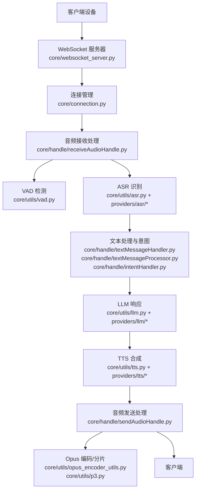
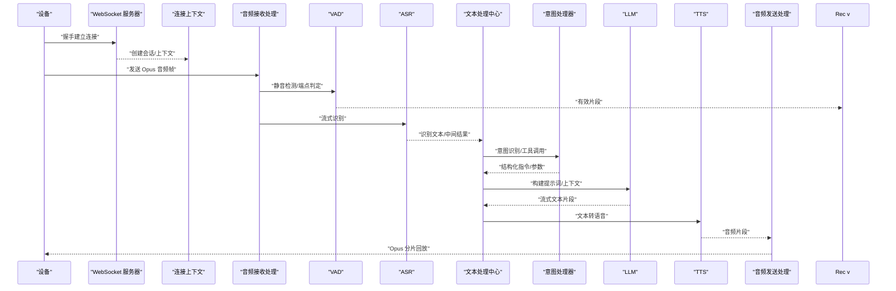
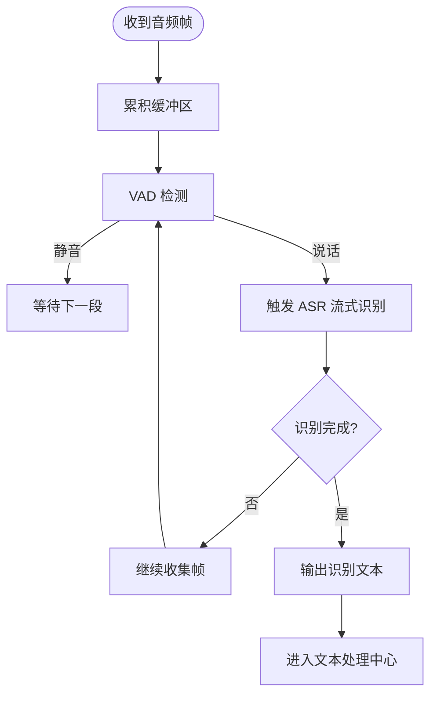
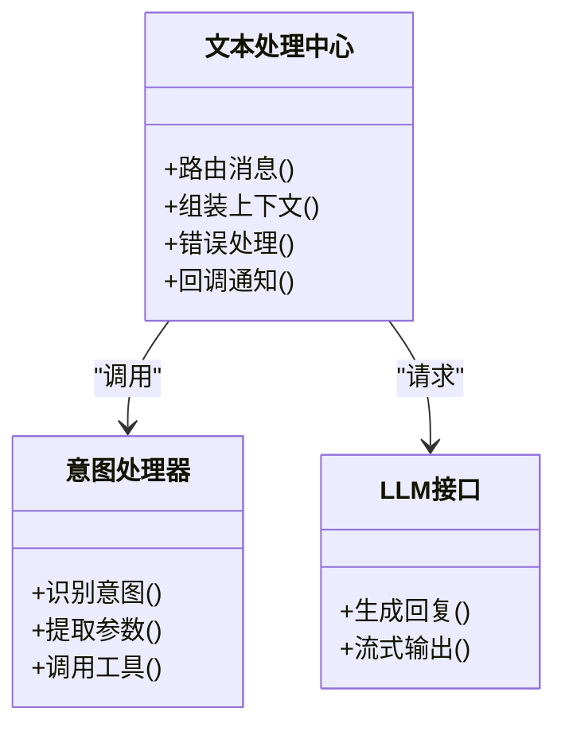
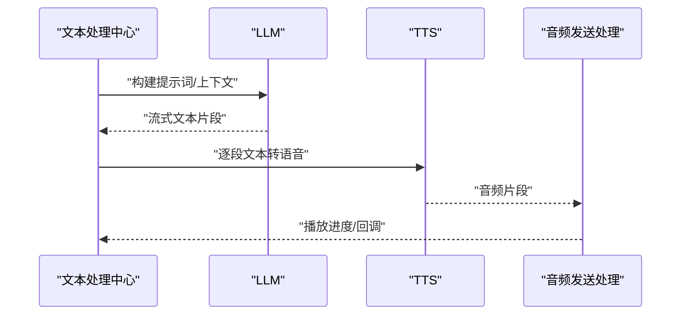
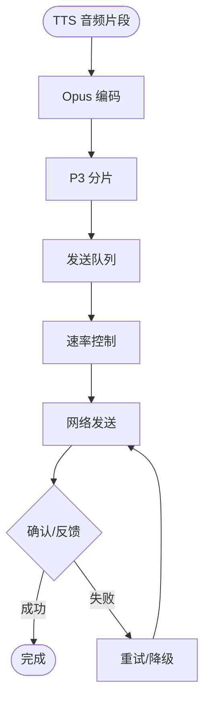
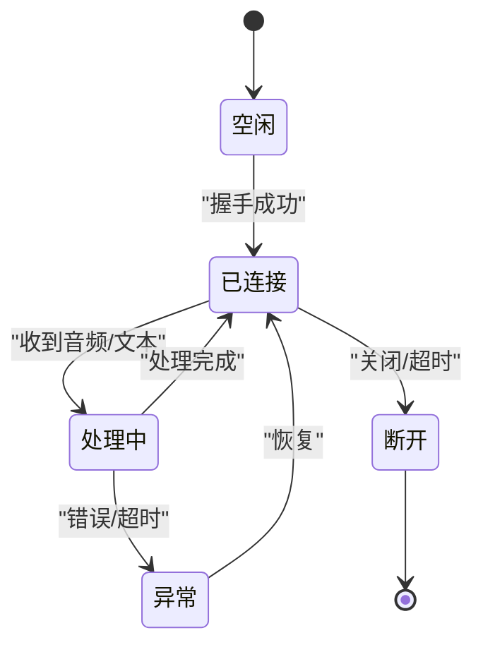
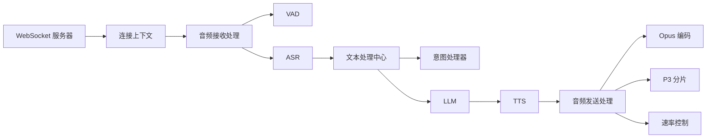

# 语音处理流水线

<cite>
**本文引用的文件**   
- [app.py](file://main/xiaozhi-server/app.py)
- [websocket_server.py](file://main/xiaozhi-server/core/websocket_server.py)
- [connection.py](file://main/xiaozhi-server/core/connection.py)
- [receiveAudioHandle.py](file://main/xiaozhi-server/core/handle/receiveAudioHandle.py)
- [sendAudioHandle.py](file://main/xiaozhi-server/core/handle/sendAudioHandle.py)
- [textMessageHandler.py](file://main/xiaozhi-server/core/handle/textMessageHandler.py)
- [textMessageProcessor.py](file://main/xiaozhi-server/core/handle/textMessageProcessor.py)
- [intentHandler.py](file://main/xiaozhi-server/core/handle/intentHandler.py)
- [asr.py](file://main/xiaozhi-server/core/utils/asr.py)
- [tts.py](file://main/xiaozhi-server/core/utils/tts.py)
- [llm.py](file://main/xiaozhi-server/core/utils/llm.py)
- [vad.py](file://main/xiaozhi-server/core/utils/vad.py)
- [audioRateController.py](file://main/xiaozhi-server/core/utils/audioRateController.py)
- [opus_encoder_utils.py](file://main/xiaozhi-server/core/utils/opus_encoder_utils.py)
- [p3.py](file://main/xiaozhi-server/core/utils/p3.py)
- [modules_initialize.py](file://main/xiaozhi-server/core/utils/modules_initialize.py)
- [http_server.py](file://main/xiaozhi-server/core/http_server.py)
- [performance_tester_asr.py](file://main/xiaozhi-server/performance_tester/performance_tester_asr.py)
- [performance_tester_tts.py](file://main/xiaozhi-server/performance_tester/performance_tester_tts.py)
- [performance_tester_stream_asr.py](file://main/xiaozhi-server/performance_tester/performance_tester_stream_asr.py)
- [performance_tester_stream_tts.py](file://main/xiaozhi-server/performance_tester/performance_tester_stream_tts.py)
</cite>

## 目录
1. [简介](#简介)
2. [项目结构](#项目结构)
3. [核心组件](#核心组件)
4. [架构总览](#架构总览)
5. [详细组件分析](#详细组件分析)
6. [依赖关系分析](#依赖关系分析)
7. [性能与实时性](#性能与实时性)
8. [故障排查指南](#故障排查指南)
9. [结论](#结论)
10. [附录](#附录)

## 简介
本技术文档面向语音处理流水线的端到端实现，覆盖从音频输入到语音输出的完整链路：音频接收、VAD 静音检测、ASR 识别、文本处理（含意图/工具调用）、LLM 响应生成、TTS 合成与流式播放。重点阐述各组件通信机制、数据格式、状态同步策略，以及实时性保证、错误恢复、资源管理、并发与负载均衡等工程要点。同时提供监控、统计与调试方法，并给出扩展步骤与优化建议。

## 项目结构
本项目采用分层与按功能域组织的方式，核心服务位于 main/xiaozhi-server 下：
- 入口与服务器：app.py、core/http_server.py、core/websocket_server.py
- 连接与会话：core/connection.py
- 消息处理管线：core/handle/*（音频收发、文本处理、意图处理）
- 能力提供者：core/providers/*（ASR/TTS/LLM/VAD/Memory/Tools 等）
- 通用工具：core/utils/*（编解码、速率控制、模块初始化等）
- 性能测试：performance_tester/*

图表来源
- [websocket_server.py](file://main/xiaozhi-server/core/websocket_server.py)
- [connection.py](file://main/xiaozhi-server/core/connection.py)
- [receiveAudioHandle.py](file://main/xiaozhi-server/core/handle/receiveAudioHandle.py)
- [sendAudioHandle.py](file://main/xiaozhi-server/core/handle/sendAudioHandle.py)
- [asr.py](file://main/xiaozhi-server/core/utils/asr.py)
- [tts.py](file://main/xiaozhi-server/core/utils/tts.py)
- [llm.py](file://main/xiaozhi-server/core/utils/llm.py)
- [vad.py](file://main/xiaozhi-server/core/utils/vad.py)
- [opus_encoder_utils.py](file://main/xiaozhi-server/core/utils/opus_encoder_utils.py)
- [p3.py](file://main/xiaozhi-server/core/utils/p3.py)

章节来源
- [app.py](file://main/xiaozhi-server/app.py)
- [websocket_server.py](file://main/xiaozhi-server/core/websocket_server.py)
- [connection.py](file://main/xiaozhi-server/core/connection.py)

## 核心组件
- WebSocket 服务器：负责接入设备连接、协议解析、事件分发与生命周期管理。
- 连接上下文：维护会话状态、队列、线程池、超时与心跳。
- 音频处理链：接收 Opus 帧、VAD 切分、ASR 流式识别、文本处理、LLM 生成、TTS 合成与回推。
- 文本处理中心：统一路由文本消息、执行意图识别与工具调用、编排 LLM 对话。
- 能力提供者：ASR/TTS/LLM/VAD 等通过统一接口接入，支持多后端与热插拔。
- 工具与基础设施：Opus 编解码、P3 分片、音频速率控制、模块初始化、缓存与日志。

章节来源
- [websocket_server.py](file://main/xiaozhi-server/core/websocket_server.py)
- [connection.py](file://main/xiaozhi-server/core/connection.py)
- [receiveAudioHandle.py](file://main/xiaozhi-server/core/handle/receiveAudioHandle.py)
- [sendAudioHandle.py](file://main/xiaozhi-server/core/handle/sendAudioHandle.py)
- [textMessageHandler.py](file://main/xiaozhi-server/core/handle/textMessageHandler.py)
- [textMessageProcessor.py](file://main/xiaozhi-server/core/handle/textMessageProcessor.py)
- [intentHandler.py](file://main/xiaozhi-server/core/handle/intentHandler.py)
- [asr.py](file://main/xiaozhi-server/core/utils/asr.py)
- [tts.py](file://main/xiaozhi-server/core/utils/tts.py)
- [llm.py](file://main/xiaozhi-server/core/utils/llm.py)
- [vad.py](file://main/xiaozhi-server/core/utils/vad.py)
- [opus_encoder_utils.py](file://main/xiaozhi-server/core/utils/opus_encoder_utils.py)
- [p3.py](file://main/xiaozhi-server/core/utils/p3.py)
- [modules_initialize.py](file://main/xiaozhi-server/core/utils/modules_initialize.py)

## 架构总览
语音处理流水线以“事件驱动 + 异步 I/O”为核心，关键流程如下：
- 设备通过 WebSocket 建立长连接，服务端创建连接上下文。
- 音频帧到达后进入 VAD 检测，触发 ASR 流式识别。
- 识别结果进入文本处理中心，进行意图识别与工具调用。
- LLM 生成回复（可流式），TTS 将文本转为音频并分片回推。
- 发送端对音频进行编码与缓冲，保障低延迟与稳定播放。

图表来源
- [websocket_server.py](file://main/xiaozhi-server/core/websocket_server.py)
- [connection.py](file://main/xiaozhi-server/core/connection.py)
- [receiveAudioHandle.py](file://main/xiaozhi-server/core/handle/receiveAudioHandle.py)
- [sendAudioHandle.py](file://main/xiaozhi-server/core/handle/sendAudioHandle.py)
- [vad.py](file://main/xiaozhi-server/core/utils/vad.py)
- [asr.py](file://main/xiaozhi-server/core/utils/asr.py)
- [textMessageHandler.py](file://main/xiaozhi-server/core/handle/textMessageHandler.py)
- [intentHandler.py](file://main/xiaozhi-server/core/handle/intentHandler.py)
- [llm.py](file://main/xiaozhi-server/core/utils/llm.py)
- [tts.py](file://main/xiaozhi-server/core/utils/tts.py)

## 详细组件分析

### 音频接收与 VAD/ASR 链路
- 音频接收处理：消费设备发来的 Opus 帧，维护缓冲区与时间戳，触发 VAD 判断。
- VAD：基于静音检测模型或阈值策略，输出说话开始/结束事件，减少无效 ASR 调用。
- ASR：支持流式识别，增量返回文本；失败时具备重试与降级策略。

图表来源
- [receiveAudioHandle.py](file://main/xiaozhi-server/core/handle/receiveAudioHandle.py)
- [vad.py](file://main/xiaozhi-server/core/utils/vad.py)
- [asr.py](file://main/xiaozhi-server/core/utils/asr.py)

章节来源
- [receiveAudioHandle.py](file://main/xiaozhi-server/core/handle/receiveAudioHandle.py)
- [vad.py](file://main/xiaozhi-server/core/utils/vad.py)
- [asr.py](file://main/xiaozhi-server/core/utils/asr.py)

### 文本处理与意图识别
- 文本处理中心：统一入口，负责消息路由、上下文拼装、错误处理与回调。
- 意图处理器：根据文本与上下文生成结构化意图，必要时调用工具函数。
- 与 LLM 协作：将意图与系统提示组合，形成高质量 prompt，支持流式返回。

图表来源
- [textMessageHandler.py](file://main/xiaozhi-server/core/handle/textMessageHandler.py)
- [textMessageProcessor.py](file://main/xiaozhi-server/core/handle/textMessageProcessor.py)
- [intentHandler.py](file://main/xiaozhi-server/core/handle/intentHandler.py)
- [llm.py](file://main/xiaozhi-server/core/utils/llm.py)

章节来源
- [textMessageHandler.py](file://main/xiaozhi-server/core/handle/textMessageHandler.py)
- [textMessageProcessor.py](file://main/xiaozhi-server/core/handle/textMessageProcessor.py)
- [intentHandler.py](file://main/xiaozhi-server/core/handle/intentHandler.py)
- [llm.py](file://main/xiaozhi-server/core/utils/llm.py)

### LLM 与 TTS 合成
- LLM：支持多种后端，统一接口封装，包含重试、超时、流式输出与结果缓存。
- TTS：文本到语音，支持流式合成与多后端切换；失败时自动降级或重试。

图表来源
- [llm.py](file://main/xiaozhi-server/core/utils/llm.py)
- [tts.py](file://main/xiaozhi-server/core/utils/tts.py)
- [sendAudioHandle.py](file://main/xiaozhi-server/core/handle/sendAudioHandle.py)

章节来源
- [llm.py](file://main/xiaozhi-server/core/utils/llm.py)
- [tts.py](file://main/xiaozhi-server/core/utils/tts.py)
- [sendAudioHandle.py](file://main/xiaozhi-server/core/handle/sendAudioHandle.py)

### 音频发送与编码
- 音频发送处理：接收 TTS 音频片段，进行 Opus 编码、P3 分片、网络发送与缓冲控制。
- 编码与分片：确保帧大小与采样率一致，避免抖动与卡顿。
- 速率控制：依据网络与设备能力动态调整发送速率。

图表来源
- [sendAudioHandle.py](file://main/xiaozhi-server/core/handle/sendAudioHandle.py)
- [opus_encoder_utils.py](file://main/xiaozhi-server/core/utils/opus_encoder_utils.py)
- [p3.py](file://main/xiaozhi-server/core/utils/p3.py)
- [audioRateController.py](file://main/xiaozhi-server/core/utils/audioRateController.py)

章节来源
- [sendAudioHandle.py](file://main/xiaozhi-server/core/handle/sendAudioHandle.py)
- [opus_encoder_utils.py](file://main/xiaozhi-server/core/utils/opus_encoder_utils.py)
- [p3.py](file://main/xiaozhi-server/core/utils/p3.py)
- [audioRateController.py](file://main/xiaozhi-server/core/utils/audioRateController.py)

### 连接管理与生命周期
- 连接上下文：维护会话状态、任务队列、线程池、心跳与超时。
- 生命周期：握手、鉴权、业务处理、异常退出与清理。

图表来源
- [connection.py](file://main/xiaozhi-server/core/connection.py)
- [websocket_server.py](file://main/xiaozhi-server/core/websocket_server.py)

章节来源
- [connection.py](file://main/xiaozhi-server/core/connection.py)
- [websocket_server.py](file://main/xiaozhi-server/core/websocket_server.py)

## 依赖关系分析
- 模块耦合：音频处理链强依赖 VAD/ASR/TTS，文本处理中心依赖意图与 LLM。
- 外部依赖：ASR/TTS/LLM 通过 providers 层解耦，便于替换与扩展。
- 工具依赖：Opus/P3/速率控制为底层基础设施，被发送链路广泛使用。

图表来源
- [websocket_server.py](file://main/xiaozhi-server/core/websocket_server.py)
- [connection.py](file://main/xiaozhi-server/core/connection.py)
- [receiveAudioHandle.py](file://main/xiaozhi-server/core/handle/receiveAudioHandle.py)
- [sendAudioHandle.py](file://main/xiaozhi-server/core/handle/sendAudioHandle.py)
- [vad.py](file://main/xiaozhi-server/core/utils/vad.py)
- [asr.py](file://main/xiaozhi-server/core/utils/asr.py)
- [textMessageHandler.py](file://main/xiaozhi-server/core/handle/textMessageHandler.py)
- [intentHandler.py](file://main/xiaozhi-server/core/handle/intentHandler.py)
- [llm.py](file://main/xiaozhi-server/core/utils/llm.py)
- [tts.py](file://main/xiaozhi-server/core/utils/tts.py)
- [opus_encoder_utils.py](file://main/xiaozhi-server/core/utils/opus_encoder_utils.py)
- [p3.py](file://main/xiaozhi-server/core/utils/p3.py)
- [audioRateController.py](file://main/xiaozhi-server/core/utils/audioRateController.py)

章节来源
- [modules_initialize.py](file://main/xiaozhi-server/core/utils/modules_initialize.py)

## 性能与实时性
- 流式处理：ASR/TTS/LLM 均采用流式接口，降低首包延迟。
- 缓冲与队列：合理设置缓冲区大小与队列长度，平衡吞吐与时延。
- 并发与线程池：I/O 密集型任务（网络/模型推理）使用线程池或协程，避免阻塞。
- 速率控制：根据网络状况与设备能力动态调节发送速率，减少卡顿。
- 缓存与复用：热点文本/音频片段缓存，减少重复计算与网络开销。
- 监控与统计：通过性能测试工具与日志指标评估各环节耗时与成功率。

章节来源
- [performance_tester_asr.py](file://main/xiaozhi-server/performance_tester/performance_tester_asr.py)
- [performance_tester_tts.py](file://main/xiaozhi-server/performance_tester/performance_tester_tts.py)
- [performance_tester_stream_asr.py](file://main/xiaozhi-server/performance_tester/performance_tester_stream_asr.py)
- [performance_tester_stream_tts.py](file://main/xiaozhi-server/performance_tester/performance_tester_stream_tts.py)
- [audioRateController.py](file://main/xiaozhi-server/core/utils/audioRateController.py)

## 故障排查指南
- 常见问题定位：
  - 音频丢包/卡顿：检查 Opus 编码参数、P3 分片大小、发送队列与速率控制。
  - ASR 识别失败：查看 VAD 阈值、ASR 后端健康状态与重试策略。
  - LLM 超时/错误：检查提示词构造、上下文长度、后端限流与重试次数。
  - TTS 合成失败：验证文本清洗、TTS 后端可用性、音频格式一致性。
- 调试工具：
  - 启用详细日志与指标上报，记录关键节点耗时与错误码。
  - 使用性能测试脚本模拟负载，定位瓶颈环节。
  - 通过 HTTP API 获取连接状态与队列深度，辅助诊断。

章节来源
- [http_server.py](file://main/xiaozhi-server/core/http_server.py)
- [performance_tester_asr.py](file://main/xiaozhi-server/performance_tester/performance_tester_asr.py)
- [performance_tester_tts.py](file://main/xiaozhi-server/performance_tester/performance_tester_tts.py)
- [performance_tester_stream_asr.py](file://main/xiaozhi-server/performance_tester/performance_tester_stream_asr.py)
- [performance_tester_stream_tts.py](file://main/xiaozhi-server/performance_tester/performance_tester_stream_tts.py)

## 结论
该语音处理流水线以模块化与流式处理为核心，实现了从音频输入到语音输出的高效端到端链路。通过 VAD/ASR/文本处理/LLM/TTS 的协同工作，结合速率控制与缓冲策略，满足低延迟与高可用的要求。建议在部署中完善监控与告警，持续优化各组件性能，并根据业务需求扩展意图与工具能力。

## 附录
- 扩展处理步骤示例：
  - 新增 ASR 后端：在 providers/asr 下实现统一接口，并在 modules_initialize 中注册。
  - 自定义中间件：在文本处理中心插入预处理/后处理逻辑，如敏感词过滤、语言检测。
  - 优化整体性能：调整 VAD 阈值、ASR 窗口大小、TTS 并行度与缓存命中率。
- 并发与负载均衡：
  - 使用线程池/协程池隔离不同阶段任务，避免相互阻塞。
  - 对 LLM/TTS/ASR 后端进行多实例部署，配合负载均衡与熔断降级。
- 故障转移：
  - 多后端冗余配置，主备切换与快速失败。
  - 关键路径重试与退避策略，提升鲁棒性。