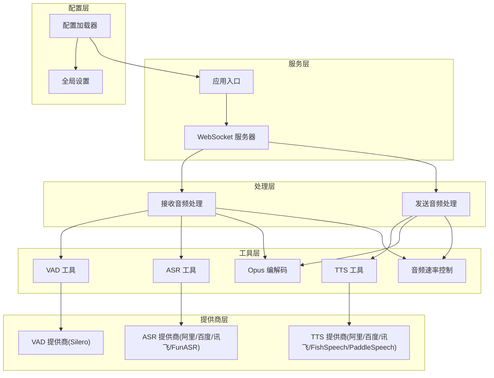
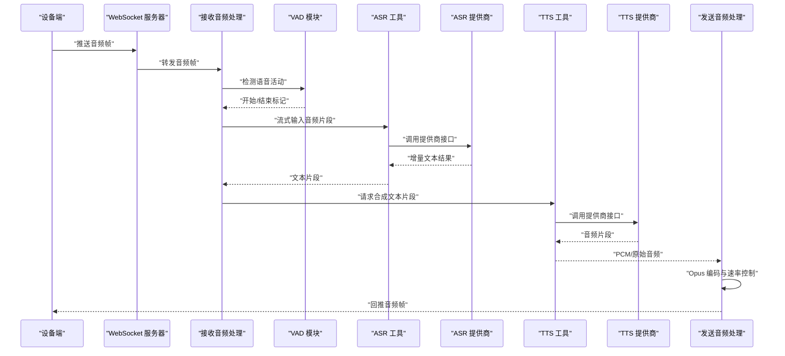
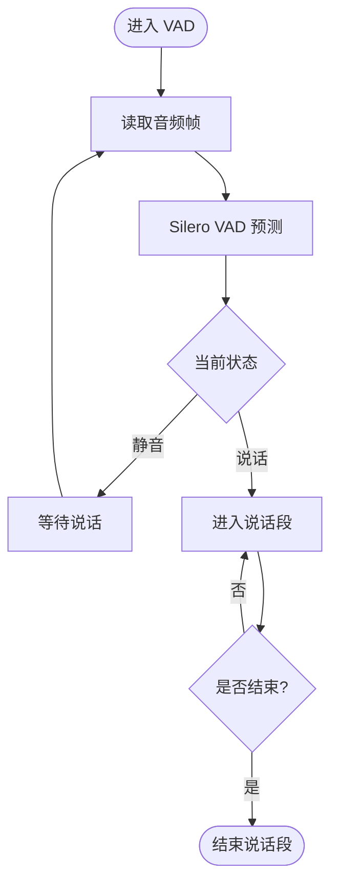
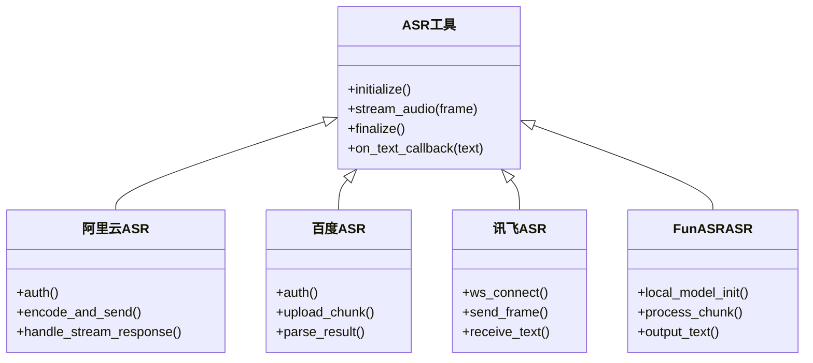
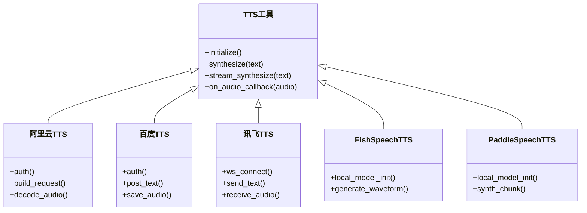
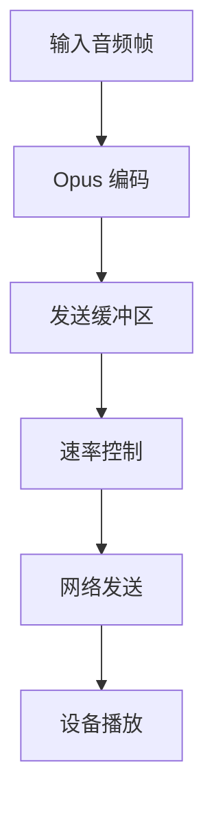
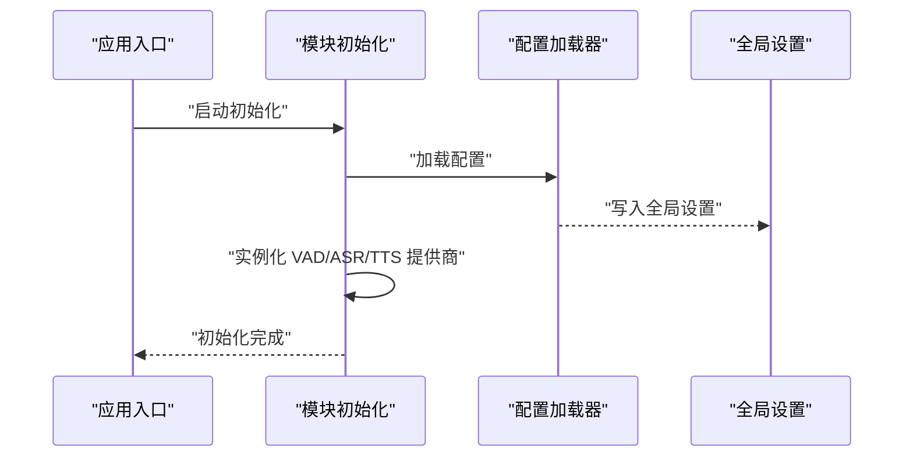

# 语音处理管道

<cite>
**本文引用的文件**   
- [app.py](file://main/xiaozhi-server/app.py)
- [websocket_server.py](file://main/xiaozhi-server/core/websocket_server.py)
- [receiveAudioHandle.py](file://main/xiaozhi-server/core/handle/receiveAudioHandle.py)
- [sendAudioHandle.py](file://main/xiaozhi-server/core/handle/sendAudioHandle.py)
- [vad.py](file://main/xiaozhi-server/core/utils/vad.py)
- [asr.py](file://main/xiaozhi-server/core/utils/asr.py)
- [tts.py](file://main/xiaozhi-server/core/utils/tts.py)
- [opus_encoder_utils.py](file://main/xiaozhi-server/core/utils/opus_encoder_utils.py)
- [audioRateController.py](file://main/xiaozhi-server/core/utils/audioRateController.py)
- [modules_initialize.py](file://main/xiaozhi-server/core/utils/modules_initialize.py)
- [aliyun_asr.py](file://main/xiaozhi-server/core/providers/asr/aliyun_asr.py)
- [baidu_asr.py](file://main/xiaozhi-server/core/providers/asr/baidu_asr.py)
- [iflytek_asr.py](file://main/xiaozhi-server/core/providers/asr/iflytek_asr.py)
- [funasr_asr.py](file://main/xiaozhi-server/core/providers/asr/funasr_asr.py)
- [silero_vad.py](file://main/xiaozhi-server/core/providers/vad/silero_vad.py)
- [aliyun_tts.py](file://main/xiaozhi-server/core/providers/tts/aliyun_tts.py)
- [baidu_tts.py](file://main/xiaozhi-server/core/providers/tts/baidu_tts.py)
- [iflytek_tts.py](file://main/xiaozhi-server/core/providers/tts/iflytek_tts.py)
- [fishspeech_tts.py](file://main/xiaozhi-server/core/providers/tts/fishspeech_tts.py)
- [paddlespeech_tts.py](file://main/xiaozhi-server/core/providers/tts/paddlespeech_tts.py)
- [config_loader.py](file://main/xiaozhi-server/config/config_loader.py)
- [settings.py](file://main/xiaozhi-server/config/settings.py)
- [performance_tester_asr.py](file://main/xiaozhi-server/performance_tester/performance_tester_asr.py)
- [performance_tester_stream_asr.py](file://main/xiaozhi-server/performance_tester/performance_tester_stream_asr.py)
- [performance_tester_tts.py](file://main/xiaozhi-server/performance_tester/performance_tester_tts.py)
- [performance_tester_stream_tts.py](file://main/xiaozhi-server/performance_tester/performance_tester_stream_tts.py)
</cite>

## 目录
1. [简介](#简介)
2. [项目结构](#项目结构)
3. [核心组件](#核心组件)
4. [架构总览](#架构总览)
5. [详细组件分析](#详细组件分析)
6. [依赖关系分析](#依赖关系分析)
7. [性能考量](#性能考量)
8. [故障排查指南](#故障排查指南)
9. [结论](#结论)
10. [附录](#附录)

## 简介
本技术文档面向语音处理管道的实现与集成，覆盖 ASR（自动语音识别）、TTS（文本转语音）、VAD（语音活动检测）三大模块。重点说明：
- 数据流向与实时流式处理机制
- 音频格式转换与编码策略
- 多提供商接入（阿里云、百度、讯飞等）的配置与使用
- 性能优化、缓存与错误重试
- 扩展新提供商、自定义算法与质量优化的实践方法
- 多语言、方言识别与噪声抑制等高级能力

## 项目结构
语音处理相关代码主要位于 main/xiaozhi-server 下，采用“功能分层 + 提供商插件化”的组织方式：
- core/handle：消息处理入口，负责接收音频、调度 VAD/ASR/TTS、发送音频
- core/utils：通用工具与中间件（VAD、ASR、TTS、Opus 编解码、速率控制等）
- core/providers：各服务提供商的具体实现（ASR/TTS/VAD）
- config：配置加载与全局设置
- performance_tester：性能测试工具集

图表来源
- [app.py:1-200](file://main/xiaozhi-server/app.py#L1-L200)
- [websocket_server.py:1-200](file://main/xiaozhi-server/core/websocket_server.py#L1-L200)
- [receiveAudioHandle.py:1-200](file://main/xiaozhi-server/core/handle/receiveAudioHandle.py#L1-L200)
- [sendAudioHandle.py:1-200](file://main/xiaozhi-server/core/handle/sendAudioHandle.py#L1-L200)
- [vad.py:1-200](file://main/xiaozhi-server/core/utils/vad.py#L1-L200)
- [asr.py:1-200](file://main/xiaozhi-server/core/utils/asr.py#L1-L200)
- [tts.py:1-200](file://main/xiaozhi-server/core/utils/tts.py#L1-L200)
- [opus_encoder_utils.py:1-200](file://main/xiaozhi-server/core/utils/opus_encoder_utils.py#L1-L200)
- [audioRateController.py:1-200](file://main/xiaozhi-server/core/utils/audioRateController.py#L1-L200)
- [modules_initialize.py:1-200](file://main/xiaozhi-server/core/utils/modules_initialize.py#L1-L200)
- [config_loader.py:1-200](file://main/xiaozhi-server/config/config_loader.py#L1-L200)
- [settings.py:1-200](file://main/xiaozhi-server/config/settings.py#L1-L200)

章节来源
- [app.py:1-200](file://main/xiaozhi-server/app.py#L1-L200)
- [websocket_server.py:1-200](file://main/xiaozhi-server/core/websocket_server.py#L1-L200)
- [receiveAudioHandle.py:1-200](file://main/xiaozhi-server/core/handle/receiveAudioHandle.py#L1-L200)
- [sendAudioHandle.py:1-200](file://main/xiaozhi-server/core/handle/sendAudioHandle.py#L1-L200)
- [vad.py:1-200](file://main/xiaozhi-server/core/utils/vad.py#L1-L200)
- [asr.py:1-200](file://main/xiaozhi-server/core/utils/asr.py#L1-L200)
- [tts.py:1-200](file://main/xiaozhi-server/core/utils/tts.py#L1-L200)
- [opus_encoder_utils.py:1-200](file://main/xiaozhi-server/core/utils/opus_encoder_utils.py#L1-L200)
- [audioRateController.py:1-200](file://main/xiaozhi-server/core/utils/audioRateController.py#L1-L200)
- [modules_initialize.py:1-200](file://main/xiaozhi-server/core/utils/modules_initialize.py#L1-L200)
- [config_loader.py:1-200](file://main/xiaozhi-server/config/config_loader.py#L1-L200)
- [settings.py:1-200](file://main/xiaozhi-server/config/settings.py#L1-L200)

## 核心组件
- WebSocket 服务器：建立设备连接，分发音视频帧与指令
- 接收音频处理：缓冲、VAD 检测、触发 ASR 流式识别
- 发送音频处理：TTS 合成、Opus 编码、播放速率控制与网络发送
- VAD：基于 Silero 的静音/说话段检测，用于打断与分句
- ASR：统一接口封装多家服务商，支持流式与非流式
- TTS：统一接口封装多家服务商，支持流式合成与音频片段输出
- Opus 编解码：低延迟高质量音频压缩，适配网络传输
- 音频速率控制：平滑播放，避免卡顿或爆音
- 模块初始化：按需加载提供商与模型，管理生命周期

章节来源
- [websocket_server.py:1-200](file://main/xiaozhi-server/core/websocket_server.py#L1-L200)
- [receiveAudioHandle.py:1-200](file://main/xiaozhi-server/core/handle/receiveAudioHandle.py#L1-L200)
- [sendAudioHandle.py:1-200](file://main/xiaozhi-server/core/handle/sendAudioHandle.py#L1-L200)
- [vad.py:1-200](file://main/xiaozhi-server/core/utils/vad.py#L1-L200)
- [asr.py:1-200](file://main/xiaozhi-server/core/utils/asr.py#L1-L200)
- [tts.py:1-200](file://main/xiaozhi-server/core/utils/tts.py#L1-L200)
- [opus_encoder_utils.py:1-200](file://main/xiaozhi-server/core/utils/opus_encoder_utils.py#L1-L200)
- [audioRateController.py:1-200](file://main/xiaozhi-server/core/utils/audioRateController.py#L1-L200)
- [modules_initialize.py:1-200](file://main/xiaozhi-server/core/utils/modules_initialize.py#L1-L200)

## 架构总览
整体流程：设备通过 WebSocket 推送 PCM/Opus 音频帧；服务端进行 VAD 判断是否进入说话段；在说话段内将音频切片送入 ASR 流式识别；ASR 返回文本后交由下游 LLM/业务逻辑生成回复文本；TTS 将文本合成为音频片段，经 Opus 编码后回推至设备播放。

图表来源
- [websocket_server.py:1-200](file://main/xiaozhi-server/core/websocket_server.py#L1-L200)
- [receiveAudioHandle.py:1-200](file://main/xiaozhi-server/core/handle/receiveAudioHandle.py#L1-L200)
- [sendAudioHandle.py:1-200](file://main/xiaozhi-server/core/handle/sendAudioHandle.py#L1-L200)
- [vad.py:1-200](file://main/xiaozhi-server/core/utils/vad.py#L1-L200)
- [asr.py:1-200](file://main/xiaozhi-server/core/utils/asr.py#L1-L200)
- [tts.py:1-200](file://main/xiaozhi-server/core/utils/tts.py#L1-L200)

## 详细组件分析

### VAD（语音活动检测）
- 原理：基于 Silero VAD 模型对音频帧进行静音/说话段判定，提供开始/结束事件以驱动 ASR 启动与停止
- 集成方式：在接收音频处理中按固定帧长切分并送入 VAD；根据状态机切换 ASR 会话
- 关键参数：阈值、窗口大小、最小说话时长、去抖时间
- 性能要点：CPU 占用低、可并行评估；建议批量化与缓存最近帧特征

图表来源
- [vad.py:1-200](file://main/xiaozhi-server/core/utils/vad.py#L1-L200)
- [silero_vad.py:1-200](file://main/xiaozhi-server/core/providers/vad/silero_vad.py#L1-200)

章节来源
- [vad.py:1-200](file://main/xiaozhi-server/core/utils/vad.py#L1-L200)
- [silero_vad.py:1-200](file://main/xiaozhi-server/core/providers/vad/silero_vad.py#L1-200)

### ASR（自动语音识别）
- 原理：统一抽象层封装多家 ASR 提供商，支持流式增量识别与整段识别
- 提供商实现：阿里云、百度、讯飞、FunASR 等，各自处理鉴权、协议、编码与重试
- 数据流：接收音频帧 → 标准化格式 → 流式上传 → 增量文本回调 → 拼接结果
- 错误处理：网络异常、鉴权失败、超时重试、降级到本地模型（如 FunASR）

图表来源
- [asr.py:1-200](file://main/xiaozhi-server/core/utils/asr.py#L1-200)
- [aliyun_asr.py:1-200](file://main/xiaozhi-server/core/providers/asr/aliyun_asr.py#L1-200)
- [baidu_asr.py:1-200](file://main/xiaozhi-server/core/providers/asr/baidu_asr.py#L1-200)
- [iflytek_asr.py:1-200](file://main/xiaozhi-server/core/providers/asr/iflytek_asr.py#L1-200)
- [funasr_asr.py:1-200](file://main/xiaozhi-server/core/providers/asr/funasr_asr.py#L1-200)

章节来源
- [asr.py:1-200](file://main/xiaozhi-server/core/utils/asr.py#L1-200)
- [aliyun_asr.py:1-200](file://main/xiaozhi-server/core/providers/asr/aliyun_asr.py#L1-200)
- [baidu_asr.py:1-200](file://main/xiaozhi-server/core/providers/asr/baidu_asr.py#L1-200)
- [iflytek_asr.py:1-200](file://main/xiaozhi-server/core/providers/asr/iflytek_asr.py#L1-200)
- [funasr_asr.py:1-200](file://main/xiaozhi-server/core/providers/asr/funasr_asr.py#L1-200)

### TTS（文本转语音）
- 原理：统一抽象层封装多家 TTS 提供商，支持流式合成与音频片段输出
- 提供商实现：阿里云、百度、讯飞、FishSpeech、PaddleSpeech 等，各自处理鉴权、协议、采样率与编码
- 数据流：文本片段 → 选择提供商 → 合成音频片段 → 标准化格式 → 回推设备
- 错误处理：鉴权失败、限流、超时重试、降级到本地模型（如 PaddleSpeech）

图表来源
- [tts.py:1-200](file://main/xiaozhi-server/core/utils/tts.py#L1-200)
- [aliyun_tts.py:1-200](file://main/xiaozhi-server/core/providers/tts/aliyun_tts.py#L1-200)
- [baidu_tts.py:1-200](file://main/xiaozhi-server/core/providers/tts/baidu_tts.py#L1-200)
- [iflytek_tts.py:1-200](file://main/xiaozhi-server/core/providers/tts/iflytek_tts.py#L1-200)
- [fishspeech_tts.py:1-200](file://main/xiaozhi-server/core/providers/tts/fishspeech_tts.py#L1-200)
- [paddlespeech_tts.py:1-200](file://main/xiaozhi-server/core/providers/tts/paddlespeech_tts.py#L1-200)

章节来源
- [tts.py:1-200](file://main/xiaozhi-server/core/utils/tts.py#L1-200)
- [aliyun_tts.py:1-200](file://main/xiaozhi-server/core/providers/tts/aliyun_tts.py#L1-200)
- [baidu_tts.py:1-200](file://main/xiaozhi-server/core/providers/tts/baidu_tts.py#L1-200)
- [iflytek_tts.py:1-200](file://main/xiaozhi-server/core/providers/tts/iflytek_tts.py#L1-200)
- [fishspeech_tts.py:1-200](file://main/xiaozhi-server/core/providers/tts/fishspeech_tts.py#L1-200)
- [paddlespeech_tts.py:1-200](file://main/xiaozhi-server/core/providers/tts/paddlespeech_tts.py#L1-200)

### 音频格式转换与实时流处理
- 编码器：Opus 编码器用于低延迟高质量压缩，适合实时传输
- 速率控制：动态调整播放速率，避免缓冲区欠载/过载
- 流式处理：VAD 驱动 ASR 流式识别；TTS 流式合成与分段回推

图表来源
- [opus_encoder_utils.py:1-200](file://main/xiaozhi-server/core/utils/opus_encoder_utils.py#L1-200)
- [audioRateController.py:1-200](file://main/xiaozhi-server/core/utils/audioRateController.py#L1-200)
- [sendAudioHandle.py:1-200](file://main/xiaozhi-server/core/handle/sendAudioHandle.py#L1-200)

章节来源
- [opus_encoder_utils.py:1-200](file://main/xiaozhi-server/core/utils/opus_encoder_utils.py#L1-200)
- [audioRateController.py:1-200](file://main/xiaozhi-server/core/utils/audioRateController.py#L1-200)
- [sendAudioHandle.py:1-200](file://main/xiaozhi-server/core/handle/sendAudioHandle.py#L1-200)

### 模块初始化与配置加载
- 模块初始化：按需加载 VAD/ASR/TTS 提供商与模型，管理生命周期与资源释放
- 配置加载：从配置文件或 API 获取提供商密钥、模型路径、超时与重试策略

图表来源
- [modules_initialize.py:1-200](file://main/xiaozhi-server/core/utils/modules_initialize.py#L1-200)
- [config_loader.py:1-200](file://main/xiaozhi-server/config/config_loader.py#L1-200)
- [settings.py:1-200](file://main/xiaozhi-server/config/settings.py#L1-200)

章节来源
- [modules_initialize.py:1-200](file://main/xiaozhi-server/core/utils/modules_initialize.py#L1-200)
- [config_loader.py:1-200](file://main/xiaozhi-server/config/config_loader.py#L1-200)
- [settings.py:1-200](file://main/xiaozhi-server/config/settings.py#L1-200)

## 依赖关系分析
- 组件耦合：处理层依赖工具层，工具层依赖提供商层；配置层为全局注入
- 外部依赖：各云厂商 SDK、本地模型库（Silero、FunASR、PaddleSpeech、FishSpeech）
- 潜在循环：通过统一抽象层避免直接耦合，降低循环依赖风险

图表来源
- [receiveAudioHandle.py:1-200](file://main/xiaozhi-server/core/handle/receiveAudioHandle.py#L1-200)
- [sendAudioHandle.py:1-200](file://main/xiaozhi-server/core/handle/sendAudioHandle.py#L1-200)
- [vad.py:1-200](file://main/xiaozhi-server/core/utils/vad.py#L1-200)
- [asr.py:1-200](file://main/xiaozhi-server/core/utils/asr.py#L1-200)
- [tts.py:1-200](file://main/xiaozhi-server/core/utils/tts.py#L1-200)
- [config_loader.py:1-200](file://main/xiaozhi-server/config/config_loader.py#L1-200)

章节来源
- [receiveAudioHandle.py:1-200](file://main/xiaozhi-server/core/handle/receiveAudioHandle.py#L1-200)
- [sendAudioHandle.py:1-200](file://main/xiaozhi-server/core/handle/sendAudioHandle.py#L1-200)
- [vad.py:1-200](file://main/xiaozhi-server/core/utils/vad.py#L1-200)
- [asr.py:1-200](file://main/xiaozhi-server/core/utils/asr.py#L1-200)
- [tts.py:1-200](file://main/xiaozhi-server/core/utils/tts.py#L1-200)
- [config_loader.py:1-200](file://main/xiaozhi-server/config/config_loader.py#L1-200)

## 性能考量
- 流式处理：VAD 驱动 ASR 流式识别，减少端到端延迟；TTS 流式合成提升首包速度
- 编码优化：Opus 低延迟编码，合理比特率与帧长平衡音质与带宽
- 速率控制：动态调节播放速率，避免卡顿与爆音
- 缓存机制：对短文本 TTS 结果进行缓存，减少重复合成；对热门 ASR 热词进行缓存
- 并发与线程池：I/O 密集型任务（网络请求）使用异步或线程池，避免阻塞主循环
- 资源管理：模型预热与懒加载，空闲时释放 GPU/CPU 资源

章节来源
- [audioRateController.py:1-200](file://main/xiaozhi-server/core/utils/audioRateController.py#L1-200)
- [opus_encoder_utils.py:1-200](file://main/xiaozhi-server/core/utils/opus_encoder_utils.py#L1-200)
- [modules_initialize.py:1-200](file://main/xiaozhi-server/core/utils/modules_initialize.py#L1-200)

## 故障排查指南
- 常见问题
  - 鉴权失败：检查提供商密钥、签名与有效期
  - 网络超时：增加重试次数与退避策略，监控网络质量
  - 音频格式不匹配：确认采样率、声道数与编码格式
  - 内存泄漏：检查模型加载与释放，避免重复实例化
- 诊断手段
  - 启用详细日志，记录 VAD/ASR/TTS 状态与耗时
  - 使用性能测试工具验证端到端延迟与吞吐
  - 抓包分析网络请求与响应体

章节来源
- [performance_tester_asr.py:1-200](file://main/xiaozhi-server/performance_tester/performance_tester_asr.py#L1-200)
- [performance_tester_stream_asr.py:1-200](file://main/xiaozhi-server/performance_tester/performance_tester_stream_asr.py#L1-200)
- [performance_tester_tts.py:1-200](file://main/xiaozhi-server/performance_tester/performance_tester_tts.py#L1-200)
- [performance_tester_stream_tts.py:1-200](file://main/xiaozhi-server/performance_tester/performance_tester_stream_tts.py#L1-200)

## 结论
本语音处理管道通过统一的抽象层与插件化提供商设计，实现了高可扩展性与高可用性。结合 VAD、ASR、TTS 的流式处理与 Opus 编码，能够在低延迟与高质量之间取得良好平衡。通过合理的性能优化、缓存与错误重试策略，系统可在复杂网络与多语言场景下稳定运行。

## 附录
- 添加新 ASR 提供商步骤
  - 在 providers/asr 目录下新增实现类，继承统一抽象接口
  - 实现鉴权、音频编码、流式上传与结果解析
  - 在配置中注册新提供商，并在模块初始化中加载
- 添加新 TTS 提供商步骤
  - 在 providers/tts 目录下新增实现类，继承统一抽象接口
  - 实现文本预处理、合成请求与音频解码
  - 在配置中注册新提供商，并在模块初始化中加载
- 自定义语音处理算法
  - 在 utils 目录下新增处理模块，遵循统一接口
  - 在接收/发送处理流程中插入自定义节点
- 优化音频质量
  - 调整 Opus 比特率与帧长
  - 引入降噪与回声消除预处理
- 多语言与方言识别
  - 在 ASR 提供商配置中指定语言与方言参数
  - 使用多语言模型或热词增强
- 噪声抑制
  - 在音频输入链路加入降噪模块
  - 调整 VAD 阈值与去抖时间