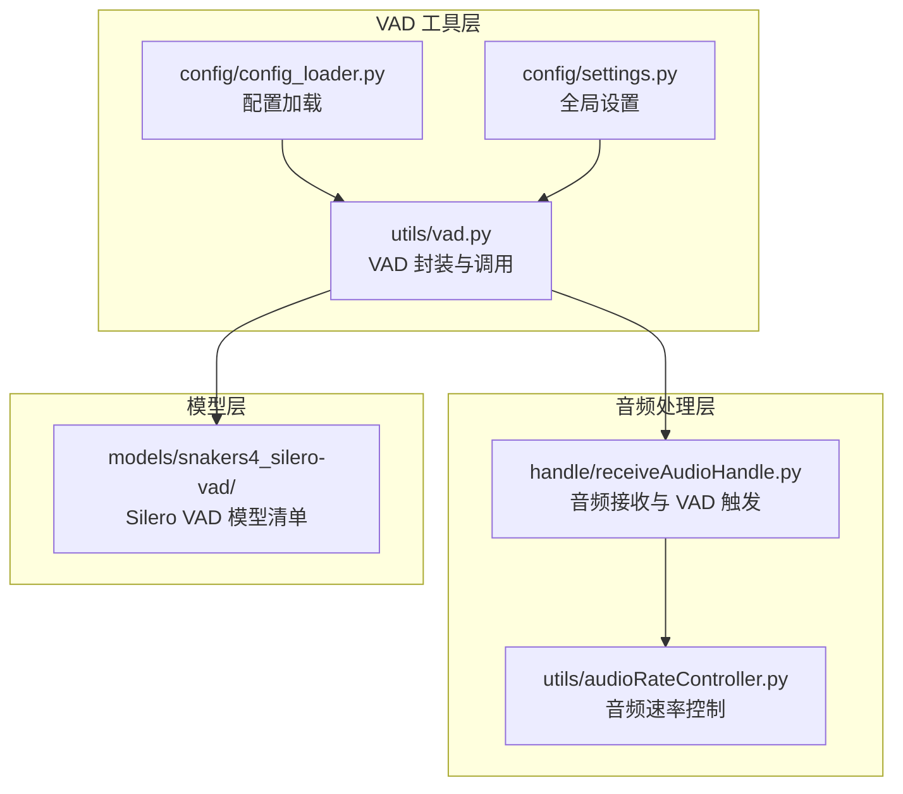
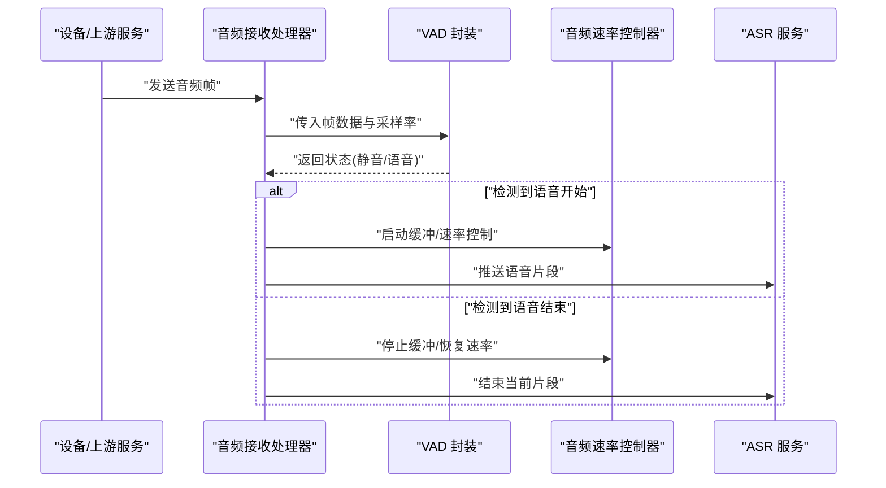
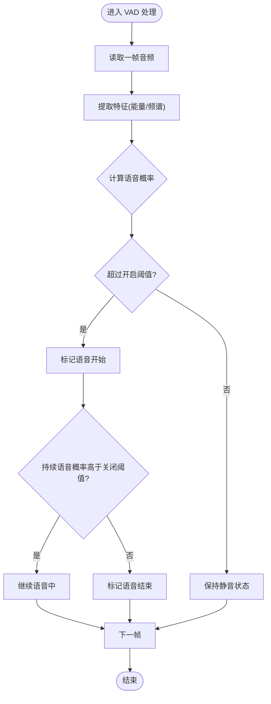
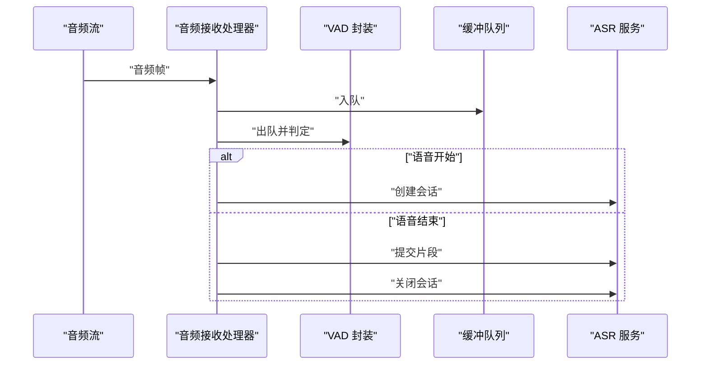
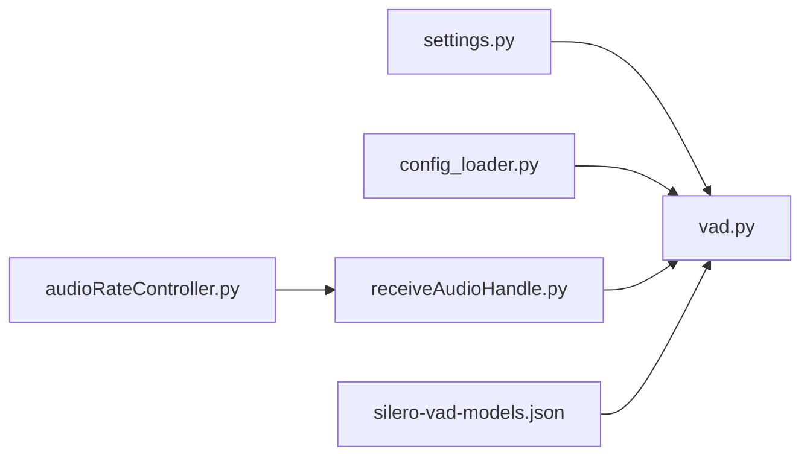

# 语音活动检测 (VAD)

<cite>
**本文引用的文件**   
- [vad.py](file://main/xiaozhi-server/core/utils/vad.py)
- [receiveAudioHandle.py](file://main/xiaozhi-server/core/handle/receiveAudioHandle.py)
- [audioRateController.py](file://main/xiaozhi-server/core/utils/audioRateController.py)
- [settings.py](file://main/xiaozhi-server/config/settings.py)
- [config_loader.py](file://main/xiaozhi-server/config/config_loader.py)
- [silero-vad-models.json](file://main/xiaozhi-server/models/snakers4_silero-vad/silero-vad-models.json)
</cite>

## 目录
1. [简介](#简介)
2. [项目结构](#项目结构)
3. [核心组件](#核心组件)
4. [架构总览](#架构总览)
5. [详细组件分析](#详细组件分析)
6. [依赖关系分析](#依赖关系分析)
7. [性能考量](#性能考量)
8. [故障排查指南](#故障排查指南)
9. [结论](#结论)
10. [附录](#附录)

## 简介
本技术文档聚焦于语音活动检测（Voice Activity Detection，简称 VAD）模块，系统阐述其在项目中的工作原理、静音检测算法、语音边界识别策略，以及主流检测器（如 Silero VAD）的集成方式与参数调优方法。文档还覆盖音频帧处理、阈值设置、噪声环境自适应、实时流检测、内存优化、CPU 使用率控制等关键工程实践，并提供多语言环境下的精度优化、背景噪声处理与说话人分离等高级功能的指导。

## 项目结构
VAD 相关代码主要位于 xiaozhi-server 的核心工具与处理器中：
- 工具层：VAD 封装与配置加载
- 处理层：音频接收与 VAD 触发流程
- 配置层：全局设置与模型清单
- 模型层：Silero VAD 模型元数据

图表来源
- [vad.py](file://main/xiaozhi-server/core/utils/vad.py)
- [receiveAudioHandle.py](file://main/xiaozhi-server/core/handle/receiveAudioHandle.py)
- [audioRateController.py](file://main/xiaozhi-server/core/utils/audioRateController.py)
- [settings.py](file://main/xiaozhi-server/config/settings.py)
- [config_loader.py](file://main/xiaozhi-server/config/config_loader.py)
- [silero-vad-models.json](file://main/xiaozhi-server/models/snakers4_silero-vad/silero-vad-models.json)

章节来源
- [vad.py](file://main/xiaozhi-server/core/utils/vad.py)
- [receiveAudioHandle.py](file://main/xiaozhi-server/core/handle/receiveAudioHandle.py)
- [audioRateController.py](file://main/xiaozhi-server/core/utils/audioRateController.py)
- [settings.py](file://main/xiaozhi-server/config/settings.py)
- [config_loader.py](file://main/xiaozhi-server/config/config_loader.py)
- [silero-vad-models.json](file://main/xiaozhi-server/models/snakers4_silero-vad/silero-vad-models.json)

## 核心组件
- VAD 封装与调用：提供统一的 VAD 接口，负责音频帧输入、阈值判定、状态机管理（静音/语音开始/语音结束），并输出事件或片段标记。
- 音频接收与触发：在音频流接收阶段进行 VAD 判断，触发后续 ASR/TTS 流程，协调音频速率控制以维持低延迟。
- 配置与设置：从配置文件加载 VAD 参数（阈值、窗口大小、最小语音时长等），支持运行时动态调整。
- 模型清单：维护 Silero VAD 模型版本与路径信息，便于按需加载与切换。

章节来源
- [vad.py](file://main/xiaozhi-server/core/utils/vad.py)
- [receiveAudioHandle.py](file://main/xiaozhi-server/core/handle/receiveAudioHandle.py)
- [settings.py](file://main/xiaozhi-server/config/settings.py)
- [config_loader.py](file://main/xiaozhi-server/config/config_loader.py)
- [silero-vad-models.json](file://main/xiaozhi-server/models/snakers4_silero-vad/silero-vad-models.json)

## 架构总览
VAD 在整体语音流水线中的作用如下：
- 输入：来自设备或上游服务的 PCM/Opus 音频帧
- 处理：VAD 对每帧计算能量/特征，结合阈值与历史状态判定是否语音
- 输出：语音开始/结束事件、语音片段、置信度分数
- 下游：ASR 接收语音片段进行识别；TTS 根据业务逻辑生成回复

图表来源
- [receiveAudioHandle.py](file://main/xiaozhi-server/core/handle/receiveAudioHandle.py)
- [vad.py](file://main/xiaozhi-server/core/utils/vad.py)
- [audioRateController.py](file://main/xiaozhi-server/core/utils/audioRateController.py)

## 详细组件分析

### VAD 封装与状态机
- 功能要点
  - 帧级处理：按固定窗口滑动，计算短时能量/过零率/频谱特征，得到语音概率
  - 阈值与迟滞：通过开启/关闭阈值避免抖动，提升边界稳定性
  - 状态机：定义“静音”“语音中”“语音结束”等状态，记录起止时间戳
  - 事件输出：产生“语音开始/结束”事件，供上层触发 ASR/TTS
- 复杂度与优化
  - 时间复杂度：O(N·W)，N 为帧数，W 为窗口长度；可通过下采样或特征降维降低开销
  - 空间复杂度：O(W) 缓存窗口特征；可复用缓冲区减少分配
  - CPU 控制：限制批处理大小、使用向量化运算、避免频繁锁竞争

图表来源
- [vad.py](file://main/xiaozhi-server/core/utils/vad.py)

章节来源
- [vad.py](file://main/xiaozhi-server/core/utils/vad.py)

### 音频接收与 VAD 触发
- 功能要点
  - 流式接收：逐帧读取并送入 VAD，维护缓冲队列
  - 触发策略：语音开始时建立 ASR 会话，结束时提交片段
  - 速率控制：根据网络与后端处理能力动态调整帧推送频率
- 错误处理
  - 丢帧保护：当队列满时丢弃最旧帧或阻塞等待
  - 异常恢复：VAD 初始化失败时回退到默认参数或降级模式

图表来源
- [receiveAudioHandle.py](file://main/xiaozhi-server/core/handle/receiveAudioHandle.py)
- [vad.py](file://main/xiaozhi-server/core/utils/vad.py)

章节来源
- [receiveAudioHandle.py](file://main/xiaozhi-server/core/handle/receiveAudioHandle.py)

### 音频速率控制
- 功能要点
  - 动态调节：依据网络延迟、CPU 负载、队列长度调整帧推送间隔
  - 平滑过渡：避免突发流量导致抖动，采用指数移动平均平滑控制信号
- 指标监控
  - 队列长度、丢帧率、端到端延迟、CPU 占用率

章节来源
- [audioRateController.py](file://main/xiaozhi-server/core/utils/audioRateController.py)

### 配置与设置
- 功能要点
  - 参数来源：配置文件（YAML/JSON）与运行时环境变量
  - 关键参数：阈值、窗口大小、最小语音时长、最大静音时长、模型选择
  - 热更新：支持运行时修改部分参数而不重启服务

章节来源
- [settings.py](file://main/xiaozhi-server/config/settings.py)
- [config_loader.py](file://main/xiaozhi-server/config/config_loader.py)

### Silero VAD 模型清单
- 功能要点
  - 模型版本管理：维护不同版本的权重与路径
  - 自动下载：首次运行自动拉取所需模型
  - 多语言适配：不同语言模型对应不同阈值与特征

章节来源
- [silero-vad-models.json](file://main/xiaozhi-server/models/snakers4_silero-vad/silero-vad-models.json)

## 依赖关系分析
VAD 模块与上下游组件的依赖关系如下：
- 内部依赖：配置加载、设置管理、音频速率控制
- 外部依赖：Silero VAD 模型库、ASR/TTS 服务
- 耦合点：音频帧格式、采样率、时间戳对齐

图表来源
- [settings.py](file://main/xiaozhi-server/config/settings.py)
- [config_loader.py](file://main/xiaozhi-server/config/config_loader.py)
- [vad.py](file://main/xiaozhi-server/core/utils/vad.py)
- [receiveAudioHandle.py](file://main/xiaozhi-server/core/handle/receiveAudioHandle.py)
- [audioRateController.py](file://main/xiaozhi-server/core/utils/audioRateController.py)
- [silero-vad-models.json](file://main/xiaozhi-server/models/snakers4_silero-vad/silero-vad-models.json)

章节来源
- [settings.py](file://main/xiaozhi-server/config/settings.py)
- [config_loader.py](file://main/xiaozhi-server/config/config_loader.py)
- [vad.py](file://main/xiaozhi-server/core/utils/vad.py)
- [receiveAudioHandle.py](file://main/xiaozhi-server/core/handle/receiveAudioHandle.py)
- [audioRateController.py](file://main/xiaozhi-server/core/utils/audioRateController.py)
- [silero-vad-models.json](file://main/xiaozhi-server/models/snakers4_silero-vad/silero-vad-models.json)

## 性能考量
- 帧处理优化
  - 批量处理：将多帧合并计算以降低函数调用开销
  - 特征复用：缓存上一帧特征，增量更新
  - 下采样：对高频特征进行降采样以减少计算量
- 内存优化
  - 循环缓冲：固定大小的环形缓冲区避免频繁分配
  - 对象池：复用音频帧对象与特征数组
- CPU 使用率控制
  - 限流：基于队列长度与 CPU 负载动态调整处理频率
  - 并行化：利用多线程/异步 I/O 提高吞吐
- 实时性保障
  - 低延迟：优先保证首包延迟，牺牲少量准确率
  - 抖动抑制：平滑阈值与迟滞参数，避免误触发

[本节为通用性能建议，不直接分析具体文件]

## 故障排查指南
- 常见问题
  - 误触发：阈值过低导致噪声被识别为语音；需提高开启阈值或增加迟滞
  - 漏检：阈值过高导致语音片段丢失；需降低关闭阈值或延长最小语音时长
  - 延迟高：队列积压或 CPU 过载；检查速率控制与批处理大小
  - 模型加载失败：路径错误或网络问题；检查模型清单与下载脚本
- 调试手段
  - 日志：记录每帧概率、状态变化、阈值与窗口长度
  - 可视化：绘制语音概率曲线与阈值线，定位误判区间
  - 回放：保存原始音频与标注，离线复现与分析

章节来源
- [vad.py](file://main/xiaozhi-server/core/utils/vad.py)
- [receiveAudioHandle.py](file://main/xiaozhi-server/core/handle/receiveAudioHandle.py)

## 结论
VAD 模块作为语音流水线的入口，其准确性与实时性直接影响整体用户体验。通过合理的阈值设置、状态机设计与性能优化，可在复杂噪声环境中实现稳定的语音边界识别。结合 Silero VAD 等主流模型，配合配置管理与速率控制，可实现跨平台、多语言的语音活动检测方案。

[本节为总结性内容，不直接分析具体文件]

## 附录
- 参数调优建议
  - 阈值：根据环境噪声水平动态调整，建议使用分位数统计
  - 窗口长度：短窗口提升响应速度，长窗口提升稳定性
  - 最小语音时长：过滤短促噪声，避免误触发
- 高级功能
  - 多语言优化：针对不同语言训练独立模型与阈值
  - 背景噪声处理：引入噪声估计与自适应滤波
  - 说话人分离：结合声纹识别与聚类算法区分不同说话人

[本节为补充说明，不直接分析具体文件]