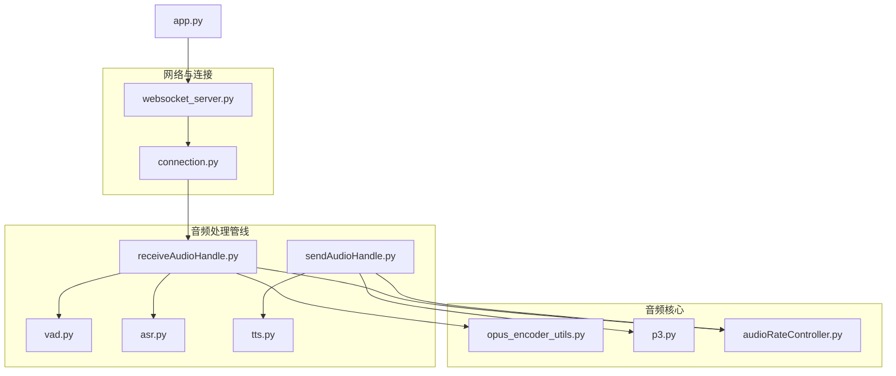
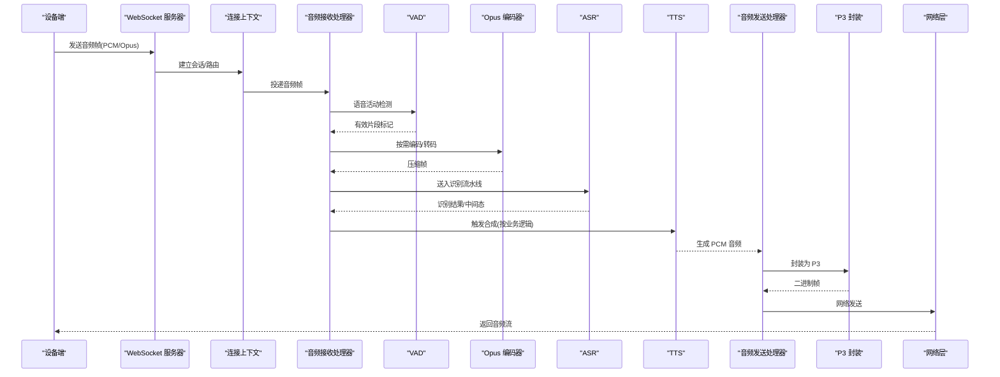
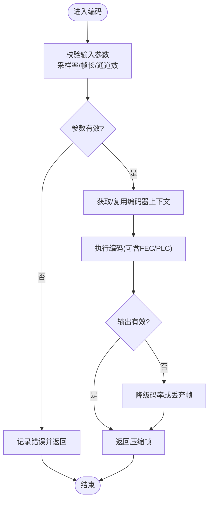
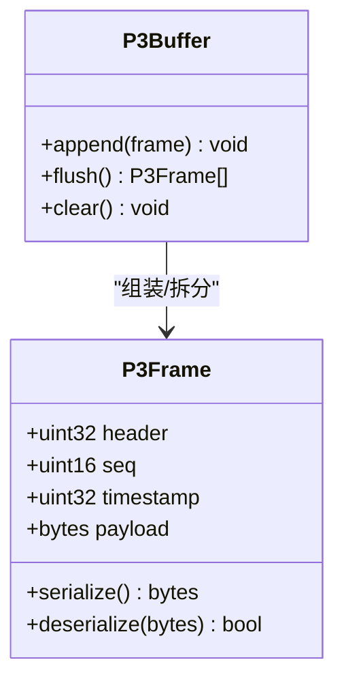
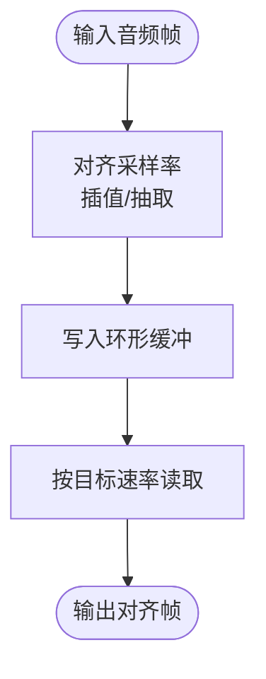
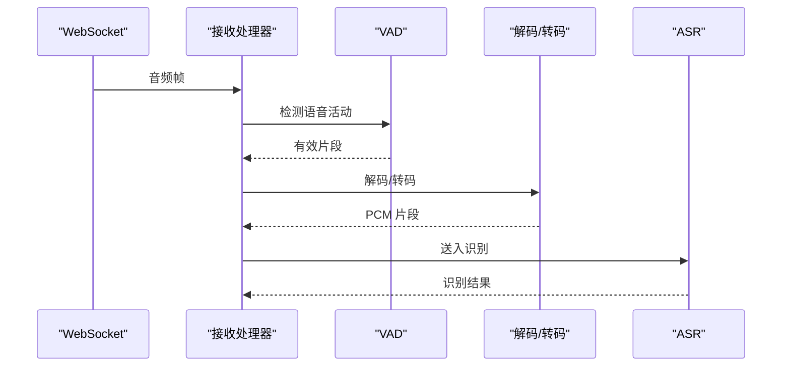
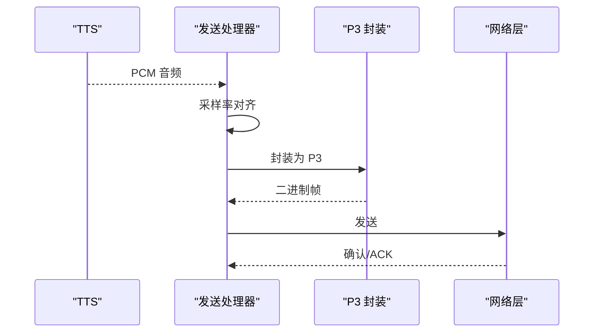
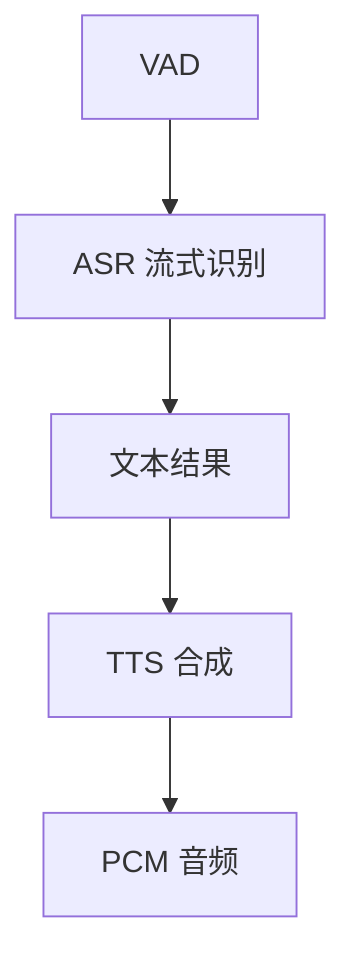
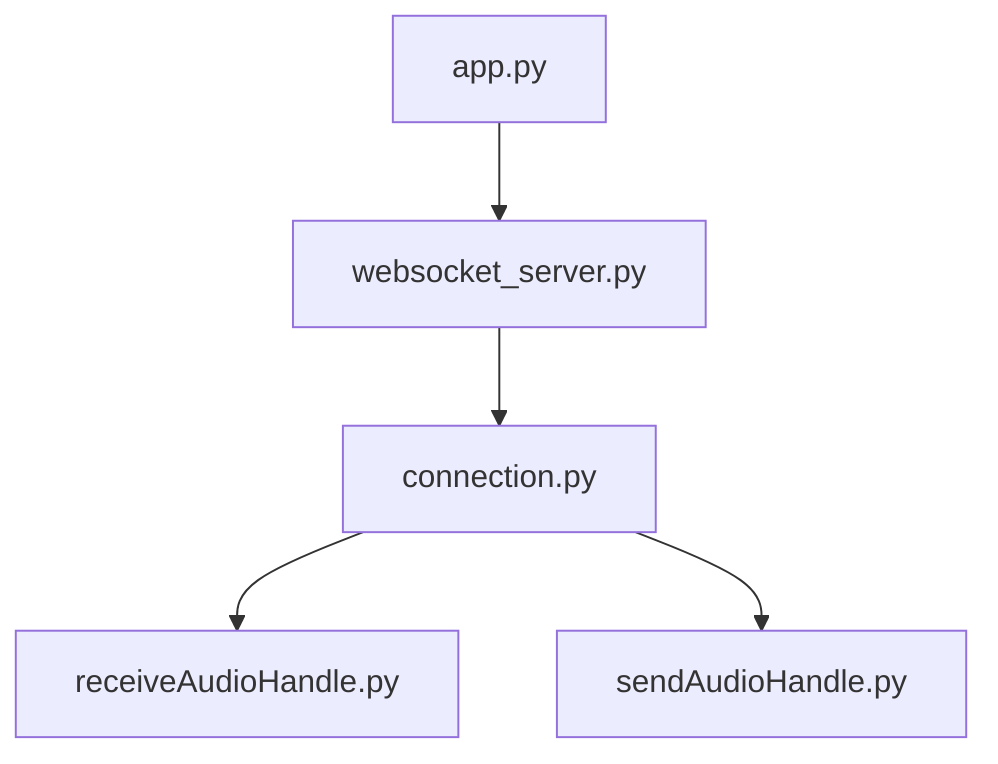
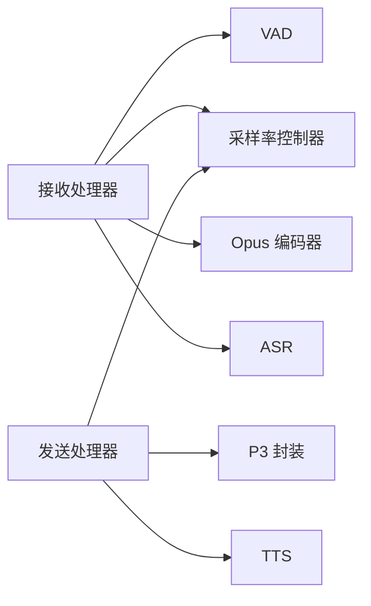

# 音频处理核心

<cite>
**本文档引用的文件**   
- [opus_encoder_utils.py](file://main/xiaozhi-server/core/utils/opus_encoder_utils.py)
- [p3.py](file://main/xiaozhi-server/core/utils/p3.py)
- [audioRateController.py](file://main/xiaozhi-server/core/utils/audioRateController.py)
- [receiveAudioHandle.py](file://main/xiaozhi-server/core/handle/receiveAudioHandle.py)
- [sendAudioHandle.py](file://main/xiaozhi-server/core/handle/sendAudioHandle.py)
- [vad.py](file://main/xiaozhi-server/core/utils/vad.py)
- [asr.py](file://main/xiaozhi-server/core/utils/asr.py)
- [tts.py](file://main/xiaozhi-server/core/utils/tts.py)
- [websocket_server.py](file://main/xiaozhi-server/core/websocket_server.py)
- [connection.py](file://main/xiaozhi-server/core/connection.py)
- [app.py](file://main/xiaozhi-server/app.py)
</cite>

## 目录
1. [简介](#简介)
2. [项目结构](#项目结构)
3. [核心组件](#核心组件)
4. [架构总览](#架构总览)
5. [详细组件分析](#详细组件分析)
6. [依赖关系分析](#依赖关系分析)
7. [性能考量](#性能考量)
8. [故障排查指南](#故障排查指南)
9. [结论](#结论)
10. [附录](#附录)

## 简介
本技术文档聚焦于项目的音频处理核心模块，围绕以下目标展开：
- 音频格式转换与采样率控制：说明 PCM、Opus、P3 等格式的流转与转换路径。
- 编码解码实现：解析 Opus 编码器封装、P3 格式处理流程及与 ASR/TTS 的集成。
- 音频流缓冲机制：阐述实时音频流的缓冲策略、丢包与乱序处理、延迟优化。
- 质量与带宽适配：讨论码率自适应、VAD 驱动的静音段裁剪、端到端时延控制。
- 实时性与并发安全：多线程模型、线程安全队列、内存管理与 GC 友好设计。
- 高级音频处理：回声消除（AEC）、降噪（NS）、增益控制（AGC）等能力接入点与扩展建议。

## 项目结构
音频相关代码主要位于后端服务 xiaozhi-server 的 core/utils 与 core/handle 目录中，关键文件包括：
- 编码与格式工具：opus_encoder_utils.py、p3.py
- 采样率与时序控制：audioRateController.py
- 音频接收与发送处理器：receiveAudioHandle.py、sendAudioHandle.py
- VAD 与语音识别/合成：vad.py、asr.py、tts.py
- 网络与连接管理：websocket_server.py、connection.py
- 应用入口：app.py

图表来源
- [app.py](file://main/xiaozhi-server/app.py)
- [websocket_server.py](file://main/xiaozhi-server/core/websocket_server.py)
- [connection.py](file://main/xiaozhi-server/core/connection.py)
- [receiveAudioHandle.py](file://main/xiaozhi-server/core/handle/receiveAudioHandle.py)
- [sendAudioHandle.py](file://main/xiaozhi-server/core/handle/sendAudioHandle.py)
- [vad.py](file://main/xiaozhi-server/core/utils/vad.py)
- [asr.py](file://main/xiaozhi-server/core/utils/asr.py)
- [tts.py](file://main/xiaozhi-server/core/utils/tts.py)
- [opus_encoder_utils.py](file://main/xiaozhi-server/core/utils/opus_encoder_utils.py)
- [p3.py](file://main/xiaozhi-server/core/utils/p3.py)
- [audioRateController.py](file://main/xiaozhi-server/core/utils/audioRateController.py)

章节来源
- [app.py](file://main/xiaozhi-server/app.py)
- [websocket_server.py](file://main/xiaozhi-server/core/websocket_server.py)
- [connection.py](file://main/xiaozhi-server/core/connection.py)
- [receiveAudioHandle.py](file://main/xiaozhi-server/core/handle/receiveAudioHandle.py)
- [sendAudioHandle.py](file://main/xiaozhi-server/core/handle/sendAudioHandle.py)
- [vad.py](file://main/xiaozhi-server/core/utils/vad.py)
- [asr.py](file://main/xiaozhi-server/core/utils/asr.py)
- [tts.py](file://main/xiaozhi-server/core/utils/tts.py)
- [opus_encoder_utils.py](file://main/xiaozhi-server/core/utils/opus_encoder_utils.py)
- [p3.py](file://main/xiaozhi-server/core/utils/p3.py)
- [audioRateController.py](file://main/xiaozhi-server/core/utils/audioRateController.py)

## 核心组件
- Opus 编码器封装：提供统一的编码接口，支持可变比特率、帧长配置、复杂度与 FEC 参数，用于上行语音数据压缩传输。
- P3 格式处理：面向设备侧或特定协议的音频容器封装/解封装，确保与终端设备的兼容性。
- 采样率控制器：负责在链路不同阶段对齐采样率，避免重采样抖动，维持时序稳定。
- 音频接收处理器：对接 WebSocket 音频帧，执行 VAD 检测、静音裁剪、Opus 解码/转码、ASR 输入准备。
- 音频发送处理器：将 TTS 输出进行 P3 封装、采样率对齐、网络打包与发送，保障低延迟播放。
- VAD：基于能量或模型判断语音起止，减少无效数据传输与计算。
- ASR/TTS：语音识别与文本转语音，作为音频管线的上下游环节。

章节来源
- [opus_encoder_utils.py](file://main/xiaozhi-server/core/utils/opus_encoder_utils.py)
- [p3.py](file://main/xiaozhi-server/core/utils/p3.py)
- [audioRateController.py](file://main/xiaozhi-server/core/utils/audioRateController.py)
- [receiveAudioHandle.py](file://main/xiaozhi-server/core/handle/receiveAudioHandle.py)
- [sendAudioHandle.py](file://main/xiaozhi-server/core/handle/sendAudioHandle.py)
- [vad.py](file://main/xiaozhi-server/core/utils/vad.py)
- [asr.py](file://main/xiaozhi-server/core/utils/asr.py)
- [tts.py](file://main/xiaozhi-server/core/utils/tts.py)

## 架构总览
下图展示从设备到服务端再到下游服务的完整音频流路径，包含编码、VAD、ASR、TTS、P3 封装与网络收发。

图表来源
- [websocket_server.py](file://main/xiaozhi-server/core/websocket_server.py)
- [connection.py](file://main/xiaozhi-server/core/connection.py)
- [receiveAudioHandle.py](file://main/xiaozhi-server/core/handle/receiveAudioHandle.py)
- [sendAudioHandle.py](file://main/xiaozhi-server/core/handle/sendAudioHandle.py)
- [vad.py](file://main/xiaozhi-server/core/utils/vad.py)
- [asr.py](file://main/xiaozhi-server/core/utils/asr.py)
- [tts.py](file://main/xiaozhi-server/core/utils/tts.py)
- [opus_encoder_utils.py](file://main/xiaozhi-server/core/utils/opus_encoder_utils.py)
- [p3.py](file://main/xiaozhi-server/core/utils/p3.py)

## 详细组件分析

### Opus 编码器封装
- 功能要点
  - 统一初始化与销毁生命周期，避免频繁创建开销。
  - 支持码率自适应（CBR/VBR），根据网络状况动态调整。
  - 帧长与复杂度可调，平衡时延与音质。
  - 可选前向纠错（FEC）与丢包隐藏（PLC）增强鲁棒性。
- 数据结构与复杂度
  - 编码器状态对象持有内部上下文，O(1) 编码调用。
  - 批量编码需考虑内存复用，避免频繁分配。
- 错误处理
  - 输入长度校验、采样率一致性检查。
  - 编码失败回退策略（降级码率或丢弃帧）。
- 性能优化
  - 预分配缓冲区，减少 GC 压力。
  - 使用零拷贝路径（如适用）降低拷贝成本。

图表来源
- [opus_encoder_utils.py](file://main/xiaozhi-server/core/utils/opus_encoder_utils.py)

章节来源
- [opus_encoder_utils.py](file://main/xiaozhi-server/core/utils/opus_encoder_utils.py)

### P3 格式处理
- 功能要点
  - 定义 P3 帧头/负载结构，保证设备端兼容。
  - 支持分片与重组，应对大音频块的网络传输。
  - 时间戳与序列号维护，便于乱序恢复与抖动缓冲。
- 数据结构与复杂度
  - 帧头固定长度，负载变长；序列化/反序列化 O(n)。
- 错误处理
  - 校验和/长度不一致时的丢弃与告警。
  - 缺失帧的重放策略（插值/静音填充）。
- 性能优化
  - 复用字节缓冲，避免重复分配。
  - 并行组装（当多路流时）提升吞吐。

图表来源
- [p3.py](file://main/xiaozhi-server/core/utils/p3.py)

章节来源
- [p3.py](file://main/xiaozhi-server/core/utils/p3.py)

### 采样率控制器
- 功能要点
  - 在 ASR/TTS 与网络层之间对齐采样率，避免重采样抖动。
  - 支持动态切换采样率（如 16k/24k/48k），保持时序一致。
- 算法与复杂度
  - 基于环形缓冲与插值重采样，O(n) 每帧处理。
- 错误处理
  - 输入空帧/异常时长处理，自动补齐或丢弃。
- 性能优化
  - 预分配缓冲，减少锁竞争。
  - 批处理模式降低函数调用开销。

图表来源
- [audioRateController.py](file://main/xiaozhi-server/core/utils/audioRateController.py)

章节来源
- [audioRateController.py](file://main/xiaozhi-server/core/utils/audioRateController.py)

### 音频接收处理器
- 功能要点
  - 接收 WebSocket 音频帧，执行 VAD 检测与静音裁剪。
  - 对 Opus 帧进行解码/转码，准备 ASR 输入。
  - 维护时序与丢包统计，必要时请求重传或容错。
- 数据处理流程
  - 帧到达 -> VAD -> 解码/转码 -> ASR -> 事件上报。
- 错误处理
  - 网络中断、解码失败、超时保护。
- 性能优化
  - 异步 IO，非阻塞处理。
  - 线程池分发任务，避免主线程阻塞。

图表来源
- [receiveAudioHandle.py](file://main/xiaozhi-server/core/handle/receiveAudioHandle.py)
- [vad.py](file://main/xiaozhi-server/core/utils/vad.py)
- [asr.py](file://main/xiaozhi-server/core/utils/asr.py)

章节来源
- [receiveAudioHandle.py](file://main/xiaozhi-server/core/handle/receiveAudioHandle.py)
- [vad.py](file://main/xiaozhi-server/core/utils/vad.py)
- [asr.py](file://main/xiaozhi-server/core/utils/asr.py)

### 音频发送处理器
- 功能要点
  - 将 TTS 输出的 PCM 进行 P3 封装，按网络条件打包发送。
  - 控制发送速率与缓冲水位，避免拥塞与卡顿。
- 数据处理流程
  - TTS 输出 -> 采样率对齐 -> P3 封装 -> 网络发送。
- 错误处理
  - 发送失败重试、背压与限流。
- 性能优化
  - 批量发送、零拷贝路径、Nagle 禁用。

图表来源
- [sendAudioHandle.py](file://main/xiaozhi-server/core/handle/sendAudioHandle.py)
- [p3.py](file://main/xiaozhi-server/core/utils/p3.py)
- [audioRateController.py](file://main/xiaozhi-server/core/utils/audioRateController.py)

章节来源
- [sendAudioHandle.py](file://main/xiaozhi-server/core/handle/sendAudioHandle.py)
- [p3.py](file://main/xiaozhi-server/core/utils/p3.py)
- [audioRateController.py](file://main/xiaozhi-server/core/utils/audioRateController.py)

### VAD、ASR 与 TTS 集成
- VAD
  - 基于能量阈值或轻量模型，快速判定语音起止。
  - 与接收处理器协作，减少无效数据进入 ASR。
- ASR
  - 接收 PCM 片段，流式识别，返回中间结果与最终文本。
  - 支持多语言与热词定制。
- TTS
  - 文本到语音合成，输出 PCM 流，供发送处理器封装。
  - 支持多音色与语速调节。

图表来源
- [vad.py](file://main/xiaozhi-server/core/utils/vad.py)
- [asr.py](file://main/xiaozhi-server/core/utils/asr.py)
- [tts.py](file://main/xiaozhi-server/core/utils/tts.py)

章节来源
- [vad.py](file://main/xiaozhi-server/core/utils/vad.py)
- [asr.py](file://main/xiaozhi-server/core/utils/asr.py)
- [tts.py](file://main/xiaozhi-server/core/utils/tts.py)

### 网络与连接管理
- WebSocket 服务器
  - 管理客户端连接、消息路由与心跳检测。
- 连接上下文
  - 维护会话状态、音频管道实例、资源清理。
- 应用入口
  - 启动服务、加载配置、注册处理器。

图表来源
- [app.py](file://main/xiaozhi-server/app.py)
- [websocket_server.py](file://main/xiaozhi-server/core/websocket_server.py)
- [connection.py](file://main/xiaozhi-server/core/connection.py)

章节来源
- [app.py](file://main/xiaozhi-server/app.py)
- [websocket_server.py](file://main/xiaozhi-server/core/websocket_server.py)
- [connection.py](file://main/xiaozhi-server/core/connection.py)

## 依赖关系分析
- 组件耦合
  - 接收/发送处理器强依赖 VAD、采样率控制器与格式工具。
  - ASR/TTS 通过处理器间接耦合，便于替换实现。
- 外部依赖
  - 网络层（WebSocket）、音频编解码库（Opus）、可能的第三方 ASR/TTS 服务。
- 循环依赖
  - 通过接口抽象与事件驱动避免循环导入。

图表来源
- [receiveAudioHandle.py](file://main/xiaozhi-server/core/handle/receiveAudioHandle.py)
- [sendAudioHandle.py](file://main/xiaozhi-server/core/handle/sendAudioHandle.py)
- [vad.py](file://main/xiaozhi-server/core/utils/vad.py)
- [audioRateController.py](file://main/xiaozhi-server/core/utils/audioRateController.py)
- [opus_encoder_utils.py](file://main/xiaozhi-server/core/utils/opus_encoder_utils.py)
- [p3.py](file://main/xiaozhi-server/core/utils/p3.py)
- [asr.py](file://main/xiaozhi-server/core/utils/asr.py)
- [tts.py](file://main/xiaozhi-server/core/utils/tts.py)

章节来源
- [receiveAudioHandle.py](file://main/xiaozhi-server/core/handle/receiveAudioHandle.py)
- [sendAudioHandle.py](file://main/xiaozhi-server/core/handle/sendAudioHandle.py)
- [vad.py](file://main/xiaozhi-server/core/utils/vad.py)
- [audioRateController.py](file://main/xiaozhi-server/core/utils/audioRateController.py)
- [opus_encoder_utils.py](file://main/xiaozhi-server/core/utils/opus_encoder_utils.py)
- [p3.py](file://main/xiaozhi-server/core/utils/p3.py)
- [asr.py](file://main/xiaozhi-server/core/utils/asr.py)
- [tts.py](file://main/xiaozhi-server/core/utils/tts.py)

## 性能考量
- 延迟优化
  - 减小帧长、启用低复杂度编码、禁用 Nagle、合理设置抖动缓冲。
  - VAD 提前截断静音，减少 ASR 输入量。
- 带宽适配
  - 动态码率调整、丢包率监控与 FEC/PLC 开关。
  - 网络拥塞时降低采样率或切换更稳健的编码参数。
- 内存管理
  - 预分配缓冲、复用对象、避免频繁 GC。
  - 使用环形缓冲与零拷贝路径降低内存峰值。
- 并发与线程安全
  - 生产者-消费者队列隔离读写，避免锁竞争。
  - 任务拆分至线程池，主线程仅做调度。
- 质量控制
  - 输入噪声抑制、增益控制、削波保护。
  - 定期校准 VAD 阈值，适应环境变化。

[本节为通用指导，不直接分析具体文件]

## 故障排查指南
- 常见问题
  - 音频断续：检查网络丢包、抖动缓冲大小、FEC/PLC 配置。
  - 音高异常：核对采样率对齐与重采样参数。
  - 识别不准：优化 VAD 阈值、增加热词、改善麦克风质量。
  - 延迟过高：降低帧长、关闭非必要后处理、优化 ASR/TTS 流水线。
- 定位方法
  - 启用详细日志，记录帧到达/处理/发送时间戳。
  - 监控 CPU/内存占用，识别瓶颈模块。
  - 回放原始 PCM 与压缩帧对比，验证编解码链路。
- 修复建议
  - 调整缓冲与码率参数，观察指标变化。
  - 隔离问题模块（如单独测试 VAD/ASR），逐步缩小范围。

章节来源
- [receiveAudioHandle.py](file://main/xiaozhi-server/core/handle/receiveAudioHandle.py)
- [sendAudioHandle.py](file://main/xiaozhi-server/core/handle/sendAudioHandle.py)
- [audioRateController.py](file://main/xiaozhi-server/core/utils/audioRateController.py)
- [vad.py](file://main/xiaozhi-server/core/utils/vad.py)
- [asr.py](file://main/xiaozhi-server/core/utils/asr.py)
- [tts.py](file://main/xiaozhi-server/core/utils/tts.py)
- [opus_encoder_utils.py](file://main/xiaozhi-server/core/utils/opus_encoder_utils.py)
- [p3.py](file://main/xiaozhi-server/core/utils/p3.py)

## 结论
本项目音频处理核心以模块化与低延迟为目标，通过 Opus 编码、P3 封装、采样率控制与 VAD/ASR/TTS 集成，构建了完整的实时语音链路。建议在部署中结合网络与环境特性调优参数，持续监控关键指标，确保音质、时延与稳定性达到预期。

[本节为总结，不直接分析具体文件]

## 附录
- 配置示例（路径引用）
  - 初始化 Opus 编码器参数：参考 [opus_encoder_utils.py](file://main/xiaozhi-server/core/utils/opus_encoder_utils.py)
  - P3 帧结构与封装流程：参考 [p3.py](file://main/xiaozhi-server/core/utils/p3.py)
  - 采样率对齐与缓冲策略：参考 [audioRateController.py](file://main/xiaozhi-server/core/utils/audioRateController.py)
  - 接收/发送处理器集成点：参考 [receiveAudioHandle.py](file://main/xiaozhi-server/core/handle/receiveAudioHandle.py)、[sendAudioHandle.py](file://main/xiaozhi-server/core/handle/sendAudioHandle.py)
  - VAD/ASR/TTS 接入方式：参考 [vad.py](file://main/xiaozhi-server/core/utils/vad.py)、[asr.py](file://main/xiaozhi-server/core/utils/asr.py)、[tts.py](file://main/xiaozhi-server/core/utils/tts.py)
- 高级功能扩展建议
  - 回声消除（AEC）：在接收处理器前端接入 AEC 模块，输出干净 PCM 给 VAD/ASR。
  - 降噪（NS）：在 VAD 前加入频谱降噪，提升识别准确率。
  - 自动增益（AGC）：在输入端动态调整增益，避免削波与过小音量。
  - 多路混音：在发送前对多路音频进行混音与响度归一化。

[本节为补充信息，不直接分析具体文件]