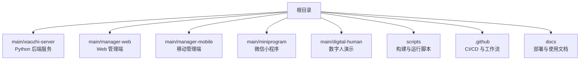
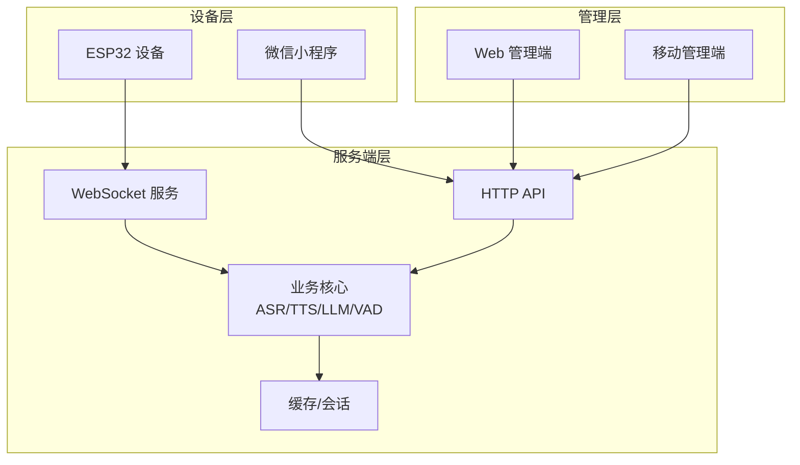
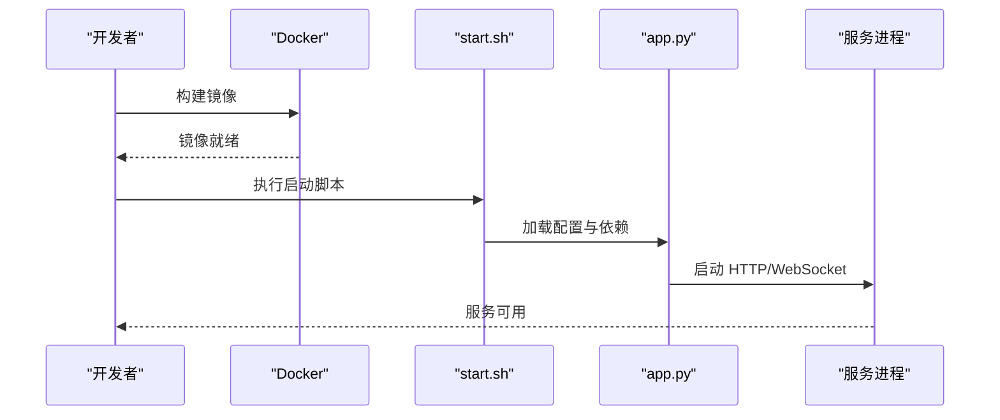
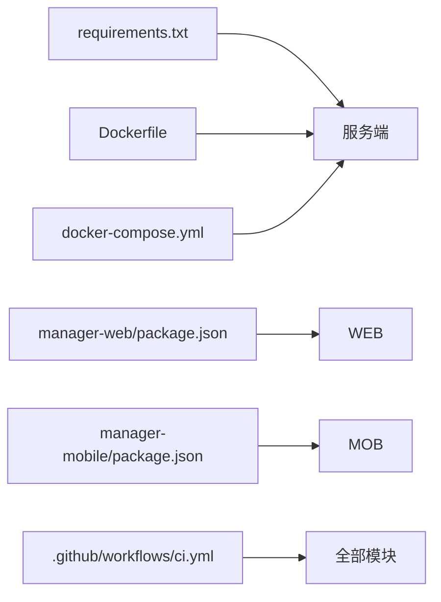

# 贡献指南

<cite>
**本文引用的文件**   
- [README.md](file://README.md)
- [AGENTS.md](file://AGENTS.md)
- [CLAUDE.md](file://CLAUDE.md)
- [.github/ISSUE_TEMPLATE/bug_report.md](file://.github/ISSUE_TEMPLATE/bug_report.md)
- [.github/ISSUE_TEMPLATE/feature_request.md](file://.github/ISSUE_TEMPLATE/feature_request.md)
- [.github/workflows/ci.yml](file://.github/workflows/ci.yml)
- [docker-setup.sh](file://docker-setup.sh)
- [main/xiaozhi-server/app.py](file://main/xiaozhi-server/app.py)
- [main/xiaozhi-server/Dockerfile](file://main/xiaozhi-server/Dockerfile)
- [main/xiaozhi-server/docker-compose.yml](file://main/xiaozhi-server/docker-compose.yml)
- [main/xiaozhi-server/requirements.txt](file://main/xiaozhi-server/requirements.txt)
- [main/xiaozhi-server/start.sh](file://main/xiaozhi-server/start.sh)
- [main/manager-web/package.json](file://main/manager-web/package.json)
- [main/manager-web/vue.config.js](file://main/manager-web/vue.config.js)
- [main/manager-mobile/package.json](file://main/manager-mobile/package.json)
- [main/manager-mobile/eslint.config.mjs](file://main/manager-mobile/eslint.config.mjs)
- [main/manager-mobile/.commitlintrc.cjs](file://main/manager-mobile/.commitlintrc.cjs)
- [main/manager-mobile/husky/_/husky.sh](file://main/manager-mobile/husky/_/husky.sh)
- [main/miniprogram/project.config.json](file://main/miniprogram/project.config.json)
- [main/digital-human/start.py](file://main/digital-human/start.py)
- [scripts/run-build-manager.sh](file://scripts/run-build-manager.sh)
- [scripts/run-build-web.sh](file://scripts/run-build-web.sh)
- [scripts/run-build-xiaozhi.sh](file://scripts/run-build-xiaozhi.sh)
</cite>

## 目录
1. [简介](#简介)
2. [项目结构](#项目结构)
3. [核心组件](#核心组件)
4. [架构总览](#架构总览)
5. [详细组件分析](#详细组件分析)
6. [依赖关系分析](#依赖关系分析)
7. [性能考虑](#性能考虑)
8. [故障排查指南](#故障排查指南)
9. [结论](#结论)
10. [附录](#附录)

## 简介
本贡献指南面向希望参与 xiaozhi-esp32-server 项目的开发者与文档作者，涵盖开发规范、环境搭建、代码审查流程、新功能开发指引以及社区参与方式。目标是让不同背景的贡献者都能高效、安全地参与协作，保证代码质量与交付一致性。

## 项目结构
仓库采用多模块组织：服务端（Python）、管理端 Web（Vue）、移动端小程序（UniApp/微信小程序）、数字人演示等。根目录包含跨模块脚本与配置，GitHub Actions 用于 CI，docs 存放部署与使用说明。

**图示来源** 
- [README.md:1-200](file://README.md#L1-L200)
- [AGENTS.md:1-200](file://AGENTS.md#L1-L200)

**章节来源**
- [README.md:1-200](file://README.md#L1-L200)
- [AGENTS.md:1-200](file://AGENTS.md#L1-L200)

## 核心组件
- 服务端（xiaozhi-server）
  - 入口与启动：app.py、start.sh、Dockerfile、docker-compose.yml
  - 依赖管理：requirements.txt
- 管理端 Web（manager-web）
  - 前端工程：package.json、vue.config.js
- 移动管理端（manager-mobile）
  - 工程与规范：package.json、eslint.config.mjs、.commitlintrc.cjs、husky 钩子
- 微信小程序（miniprogram）
  - 工程配置：project.config.json
- 数字人演示（digital-human）
  - 启动脚本：start.py
- 构建与发布
  - 脚本：scripts/*.sh
- CI/CD
  - GitHub Actions：.github/workflows/ci.yml

**章节来源**
- [main/xiaozhi-server/app.py:1-200](file://main/xiaozhi-server/app.py#L1-L200)
- [main/xiaozhi-server/start.sh:1-200](file://main/xiaozhi-server/start.sh#L1-L200)
- [main/xiaozhi-server/Dockerfile:1-200](file://main/xiaozhi-server/Dockerfile#L1-L200)
- [main/xiaozhi-server/docker-compose.yml:1-200](file://main/xiaozhi-server/docker-compose.yml#L1-L200)
- [main/xiaozhi-server/requirements.txt:1-200](file://main/xiaozhi-server/requirements.txt#L1-L200)
- [main/manager-web/package.json:1-200](file://main/manager-web/package.json#L1-L200)
- [main/manager-web/vue.config.js:1-200](file://main/manager-web/vue.config.js#L1-L200)
- [main/manager-mobile/package.json:1-200](file://main/manager-mobile/package.json#L1-L200)
- [main/manager-mobile/eslint.config.mjs:1-200](file://main/manager-mobile/eslint.config.mjs#L1-L200)
- [main/manager-mobile/.commitlintrc.cjs:1-200](file://main/manager-mobile/.commitlintrc.cjs#L1-L200)
- [main/manager-mobile/husky/_/husky.sh:1-200](file://main/manager-mobile/husky/_/husky.sh#L1-L200)
- [main/miniprogram/project.config.json:1-200](file://main/miniprogram/project.config.json#L1-L200)
- [main/digital-human/start.py:1-200](file://main/digital-human/start.py#L1-L200)
- [scripts/run-build-manager.sh:1-200](file://scripts/run-build-manager.sh#L1-L200)
- [scripts/run-build-web.sh:1-200](file://scripts/run-build-web.sh#L1-L200)
- [scripts/run-build-xiaozhi.sh:1-200](file://scripts/run-build-xiaozhi.sh#L1-L200)
- [.github/workflows/ci.yml:1-200](file://.github/workflows/ci.yml#L1-L200)

## 架构总览
系统由“设备端（ESP32/小程序）— 服务端 — 管理端”构成。设备通过 WebSocket/MQTT 与服务端交互；服务端提供 ASR/TTS/LLM/VAD 等能力；管理端用于配置与运维。

**图示来源** 
- [main/xiaozhi-server/app.py:1-200](file://main/xiaozhi-server/app.py#L1-L200)
- [main/xiaozhi-server/start.sh:1-200](file://main/xiaozhi-server/start.sh#L1-L200)
- [main/manager-web/package.json:1-200](file://main/manager-web/package.json#L1-L200)
- [main/manager-mobile/package.json:1-200](file://main/manager-mobile/package.json#L1-L200)
- [main/miniprogram/project.config.json:1-200](file://main/miniprogram/project.config.json#L1-L200)

## 详细组件分析

### 服务端（xiaozhi-server）
- 启动流程
  - Dockerfile 定义镜像与依赖安装
  - start.sh 初始化环境变量并启动应用
  - app.py 加载配置、注册路由、启动 HTTP/WebSocket 服务
- 依赖与环境
  - requirements.txt 声明 Python 依赖
  - docker-compose.yml 编排服务与外部依赖（数据库、缓存等）

**图示来源** 
- [main/xiaozhi-server/Dockerfile:1-200](file://main/xiaozhi-server/Dockerfile#L1-L200)
- [main/xiaozhi-server/start.sh:1-200](file://main/xiaozhi-server/start.sh#L1-L200)
- [main/xiaozhi-server/app.py:1-200](file://main/xiaozhi-server/app.py#L1-L200)

**章节来源**
- [main/xiaozhi-server/Dockerfile:1-200](file://main/xiaozhi-server/Dockerfile#L1-L200)
- [main/xiaozhi-server/start.sh:1-200](file://main/xiaozhi-server/start.sh#L1-L200)
- [main/xiaozhi-server/app.py:1-200](file://main/xiaozhi-server/app.py#L1-L200)
- [main/xiaozhi-server/requirements.txt:1-200](file://main/xiaozhi-server/requirements.txt#L1-L200)
- [main/xiaozhi-server/docker-compose.yml:1-200](file://main/xiaozhi-server/docker-compose.yml#L1-L200)

### 管理端 Web（manager-web）
- 工程配置
  - package.json 定义依赖与脚本
  - vue.config.js 配置构建与代理
- 开发建议
  - 使用 npm/pnpm/yarn 进行依赖管理与构建
  - 本地调试可通过 dev server 与后端 API 代理

**章节来源**
- [main/manager-web/package.json:1-200](file://main/manager-web/package.json#L1-L200)
- [main/manager-web/vue.config.js:1-200](file://main/manager-web/vue.config.js#L1-L200)

### 移动管理端（manager-mobile）
- 工程与规范
  - package.json 定义依赖与脚本
  - eslint.config.mjs 统一代码风格检查
  - .commitlintrc.cjs 提交信息格式校验
  - husky 钩子在提交前触发 lint/测试
- 开发建议
  - 提交前确保 lint 与测试通过
  - 遵循约定式提交规范

**章节来源**
- [main/manager-mobile/package.json:1-200](file://main/manager-mobile/package.json#L1-L200)
- [main/manager-mobile/eslint.config.mjs:1-200](file://main/manager-mobile/eslint.config.mjs#L1-L200)
- [main/manager-mobile/.commitlintrc.cjs:1-200](file://main/manager-mobile/.commitlintrc.cjs#L1-L200)
- [main/manager-mobile/husky/_/husky.sh:1-200](file://main/manager-mobile/husky/_/husky.sh#L1-L200)

### 微信小程序（miniprogram）
- 工程配置
  - project.config.json 定义小程序工程参数
- 开发建议
  - 使用微信开发者工具打开工程
  - 遵循小程序平台规范与最佳实践

**章节来源**
- [main/miniprogram/project.config.json:1-200](file://main/miniprogram/project.config.json#L1-L200)

### 数字人演示（digital-human）
- 启动脚本
  - start.py 负责初始化与运行演示服务
- 开发建议
  - 在独立环境中运行，避免与主服务冲突

**章节来源**
- [main/digital-human/start.py:1-200](file://main/digital-human/start.py#L1-L200)

### 构建与发布脚本
- scripts 目录提供一键构建与管理端、Web、服务端的构建命令
- 建议在 CI 中复用这些脚本以保证一致性

**章节来源**
- [scripts/run-build-manager.sh:1-200](file://scripts/run-build-manager.sh#L1-L200)
- [scripts/run-build-web.sh:1-200](file://scripts/run-build-web.sh#L1-L200)
- [scripts/run-build-xiaozhi.sh:1-200](file://scripts/run-build-xiaozhi.sh#L1-L200)

## 依赖关系分析
- 服务端依赖
  - Python 包依赖由 requirements.txt 管理
  - 容器化依赖由 Dockerfile 与 docker-compose.yml 管理
- 前端依赖
  - manager-web 与 manager-mobile 分别通过 package.json 管理
- 工作流依赖
  - GitHub Actions 的 ci.yml 驱动自动化任务

**图示来源** 
- [main/xiaozhi-server/requirements.txt:1-200](file://main/xiaozhi-server/requirements.txt#L1-L200)
- [main/xiaozhi-server/Dockerfile:1-200](file://main/xiaozhi-server/Dockerfile#L1-L200)
- [main/xiaozhi-server/docker-compose.yml:1-200](file://main/xiaozhi-server/docker-compose.yml#L1-L200)
- [main/manager-web/package.json:1-200](file://main/manager-web/package.json#L1-L200)
- [main/manager-mobile/package.json:1-200](file://main/manager-mobile/package.json#L1-L200)
- [.github/workflows/ci.yml:1-200](file://.github/workflows/ci.yml#L1-L200)

**章节来源**
- [main/xiaozhi-server/requirements.txt:1-200](file://main/xiaozhi-server/requirements.txt#L1-L200)
- [main/xiaozhi-server/Dockerfile:1-200](file://main/xiaozhi-server/Dockerfile#L1-L200)
- [main/xiaozhi-server/docker-compose.yml:1-200](file://main/xiaozhi-server/docker-compose.yml#L1-L200)
- [main/manager-web/package.json:1-200](file://main/manager-web/package.json#L1-L200)
- [main/manager-mobile/package.json:1-200](file://main/manager-mobile/package.json#L1-L200)
- [.github/workflows/ci.yml:1-200](file://.github/workflows/ci.yml#L1-L200)

## 性能考虑
- 服务端
  - 合理设置线程池与连接池大小
  - 对高频路径启用缓存与异步处理
  - 监控内存与 CPU 使用，避免长时阻塞
- 前端
  - 按需加载与懒加载
  - 减少重复请求与数据序列化开销
- 容器化
  - 镜像分层优化，复用基础镜像
  - 限制资源配额，避免争抢

[本节为通用指导，不直接分析具体文件]

## 故障排查指南
- 常见问题定位
  - 查看服务日志与容器输出
  - 检查端口占用与网络连通性
  - 验证配置文件与密钥是否正确
- 调试技巧
  - 使用本地开发模式逐步定位问题
  - 通过断点与日志增强可观测性
- 提交前自检
  - 运行 lint 与单元测试
  - 确认构建产物与依赖无异常

**章节来源**
- [main/xiaozhi-server/start.sh:1-200](file://main/xiaozhi-server/start.sh#L1-L200)
- [main/xiaozhi-server/app.py:1-200](file://main/xiaozhi-server/app.py#L1-L200)
- [main/manager-mobile/husky/_/husky.sh:1-200](file://main/manager-mobile/husky/_/husky.sh#L1-L200)

## 结论
通过统一的工程规范、清晰的架构与完善的 CI/CD，本项目能够支持多人协作与持续交付。贡献者应遵循代码风格、提交信息与分支策略，并在 PR 中附带必要的测试与文档更新。遇到问题优先查阅文档与日志，必要时在社区讨论区寻求帮助。

[本节为总结性内容，不直接分析具体文件]

## 附录

### 开发环境搭建
- 前置要求
  - 操作系统：Linux/macOS/Windows（推荐 Linux）
  - 版本控制：Git
  - 容器化：Docker 与 docker-compose
  - Node.js：根据各前端工程的 package.json 指定版本
  - Python：根据服务端 requirements.txt 指定版本
- 克隆与初始化
  - 克隆仓库后，进入根目录
  - 使用 docker-setup.sh 快速初始化环境与依赖
- 启动服务
  - 服务端：使用 start.sh 或 docker-compose up
  - Web 管理端：安装依赖后运行开发服务器
  - 移动管理端：安装依赖后运行开发服务器
  - 小程序：使用微信开发者工具导入工程
- IDE 配置建议
  - Python：启用 Pylint/Black/Ruff（如存在），配置解释器与虚拟环境
  - Vue/UniApp：启用 ESLint/Prettier，配置格式化规则
  - 微信小程序：安装官方插件与语法提示

**章节来源**
- [docker-setup.sh:1-200](file://docker-setup.sh#L1-L200)
- [main/xiaozhi-server/start.sh:1-200](file://main/xiaozhi-server/start.sh#L1-L200)
- [main/manager-web/package.json:1-200](file://main/manager-web/package.json#L1-L200)
- [main/manager-mobile/package.json:1-200](file://main/manager-mobile/package.json#L1-L200)
- [main/miniprogram/project.config.json:1-200](file://main/miniprogram/project.config.json#L1-L200)

### 代码风格与提交规范
- Python 服务端
  - 遵循 PEP8，建议使用 Lint 与自动格式化
  - 函数与类命名清晰，注释完善
- 前端（manager-web/manager-mobile）
  - 使用 ESLint 与 Prettier 统一风格
  - 组件拆分合理，避免过大文件
- 提交信息
  - 使用约定式提交（参考 .commitlintrc.cjs）
  - 类型包括 feat、fix、docs、style、refactor、test、chore 等
  - 主题简洁明确，正文说明动机与影响
- 分支策略
  - main：稳定分支
  - develop：集成分支
  - feature/*：功能分支
  - fix/*：修复分支
  - hotfix/*：紧急修复
  - release/*：发布准备

**章节来源**
- [main/manager-mobile/.commitlintrc.cjs:1-200](file://main/manager-mobile/.commitlintrc.cjs#L1-L200)
- [main/manager-mobile/eslint.config.mjs:1-200](file://main/manager-mobile/eslint.config.mjs#L1-L200)

### 代码审查与 Pull Request 规范
- PR 要求
  - 关联 Issue 编号
  - 描述变更内容与影响范围
  - 附测试用例与截图（如涉及 UI）
  - 更新相关文档与配置
- 审查流程
  - 至少一名 Maintainer 审查通过
  - CI 必须全部通过
  - 合并前解决所有评论与改动
- 测试要求
  - 新增逻辑需补充单元测试/集成测试
  - 回归测试覆盖关键路径
  - 性能敏感变更需提供基准对比

**章节来源**
- [.github/workflows/ci.yml:1-200](file://.github/workflows/ci.yml#L1-L200)
- [main/manager-mobile/husky/_/husky.sh:1-200](file://main/manager-mobile/husky/_/husky.sh#L1-L200)

### 新功能开发流程
- 需求分析
  - 明确目标、边界与验收标准
  - 评估技术可行性与风险
- 设计与方案
  - 输出设计文档与接口契约
  - 确定依赖与第三方服务
- 实现与自测
  - 按模块拆分实现，保持高内聚低耦合
  - 编写测试与文档，完成本地验证
- 提交流与评审
  - 创建 PR，附上变更说明与测试报告
  - 响应评审意见并完成迭代
- 发布与跟踪
  - 合并至目标分支，触发 CI/CD
  - 上线后监控指标与用户反馈

[本节为流程性指导，不直接分析具体文件]

### 社区参与方式
- Issue 报告
  - Bug：使用 bug_report 模板，提供复现步骤与环境信息
  - 功能建议：使用 feature_request 模板，说明背景与价值
- 讨论与改进
  - 在讨论区发起话题，收集共识
  - 改进文档与示例，提升可读性与可用性
- 贡献途径
  - 提交 PR 修复问题或增加功能
  - 翻译与本地化文档
  - 分享使用经验与最佳实践

**章节来源**
- [.github/ISSUE_TEMPLATE/bug_report.md:1-200](file://.github/ISSUE_TEMPLATE/bug_report.md#L1-L200)
- [.github/ISSUE_TEMPLATE/feature_request.md:1-200](file://.github/ISSUE_TEMPLATE/feature_request.md#L1-L200)

### 开发与调试示例
- 添加新功能（以服务端为例）
  - 在对应模块新增处理器与路由
  - 配置依赖与鉴权
  - 编写测试与文档
- 修复 Bug
  - 定位问题根因，最小化改动
  - 补充回归测试，避免复发
- 优化性能
  - 识别热点路径与瓶颈
  - 引入缓存、异步与批处理
  - 压测验证效果

[本节为示例性指导，不直接分析具体文件]