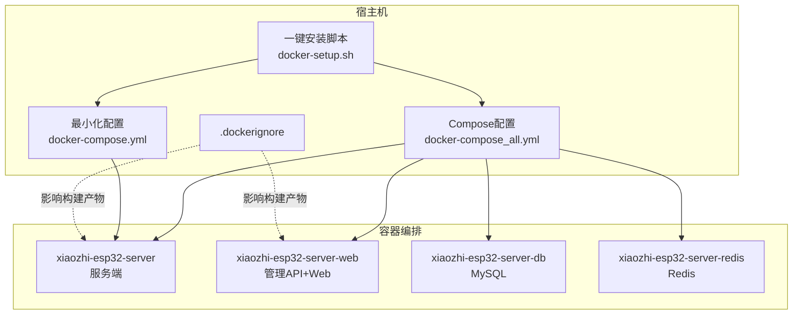
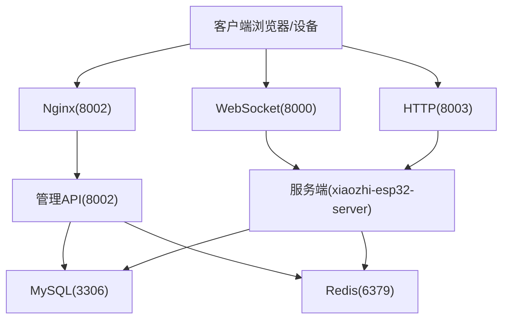
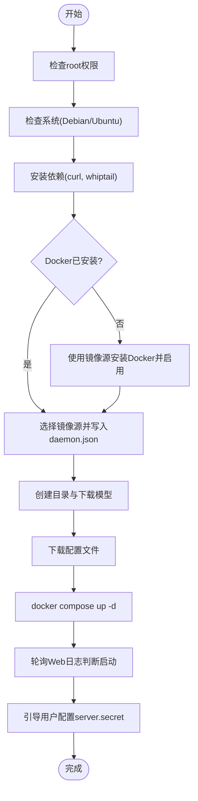
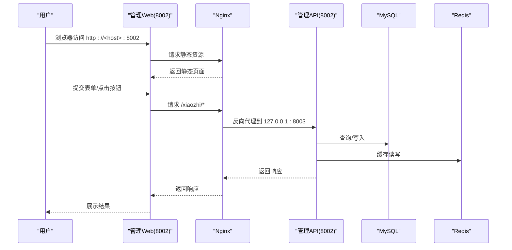

# Docker部署

<cite>
**本文引用的文件**
- [docker-setup.sh](file://docker-setup.sh)
- [docker-compose.yml](file://main/xiaozhi-server/docker-compose.yml)
- [docker-compose_all.yml](file://main/xiaozhi-server/docker-compose_all.yml)
- [docker-compose-oceanbase.yml](file://main/xiaozhi-server/docker-compose-oceanbase.yml)
- [.dockerignore](file://.dockerignore)
- [config_from_api.yaml](file://main/xiaozhi-server/config_from_api.yaml)
- [app.py](file://main/xiaozhi-server/app.py)
- [nginx.conf](file://docs/docker/nginx.conf)
- [start.sh](file://docs/docker/start.sh)
- [docs/docker-build.md](file://docs/docker-build.md)
- [application.yml](file://main/manager-api/src/main/resources/application.yml)
</cite>

## 目录
1. [简介](#简介)
2. [项目结构](#项目结构)
3. [核心组件](#核心组件)
4. [架构总览](#架构总览)
5. [组件详细分析](#组件详细分析)
6. [依赖关系分析](#依赖关系分析)
7. [性能与资源调优](#性能与资源调优)
8. [故障排查指南](#故障排查指南)
9. [结论](#结论)
10. [附录](#附录)

## 简介
本文件面向“小智ESP32服务器”的Docker部署场景，提供从一键安装脚本到手动部署、镜像构建、配置管理、健康检查、资源限制与性能调优、多环境策略与版本兼容性的完整说明。文档基于仓库内的实际配置文件与脚本进行分析，帮助运维与开发人员快速、稳定地完成部署。

## 项目结构
围绕Docker部署的关键文件与目录如下：
- 一键安装脚本：负责系统检查、Docker安装与镜像源配置、目录与模型准备、Compose编排与服务启动、密钥配置等。
- Compose编排文件：包含最小化部署与全模块部署两种模式，分别覆盖服务端、Web后端、数据库与缓存等组件。
- Nginx与启动脚本：Web后端容器内通过Nginx代理转发至后端API端口，启动脚本统一初始化环境变量并启动服务。
- 配置文件：支持本地配置与远程配置（Manager-API）两级覆盖，便于多环境灵活切换。
- 构建文档：提供本地镜像构建与运行方式，便于二次定制与CI集成。

图表来源
- [docker-setup.sh](file://docker-setup.sh)
- [docker-compose_all.yml](file://main/xiaozhi-server/docker-compose_all.yml)
- [docker-compose.yml](file://main/xiaozhi-server/docker-compose.yml)
- [.dockerignore](file://.dockerignore)

章节来源
- [docker-setup.sh](file://docker-setup.sh)
- [docker-compose_all.yml](file://main/xiaozhi-server/docker-compose_all.yml)
- [docker-compose.yml](file://main/xiaozhi-server/docker-compose.yml)
- [.dockerignore](file://.dockerignore)

## 核心组件
- 服务端容器（xiaozhi-esp32-server）
  - 运行Python异步服务，提供WebSocket与HTTP接口，负责ASR/TTS/LLM/工具链等能力。
  - 端口映射：8000（WS）、8003（HTTP/视觉分析）。
  - 挂载：data目录（持久化配置与日志）、模型文件（SenseVoiceSmall）。
- 管理API与Web容器（xiaozhi-esp32-server-web）
  - 运行Java后端（Tomcat），端口8002；通过Nginx反向代理转发/xiaozhi路径到后端API。
  - 环境变量：数据库连接、Redis连接、时区等。
- 数据库容器（xiaozhi-esp32-server-db）
  - MySQL，健康检查基于ping，数据持久化至宿主目录。
- 缓存容器（xiaozhi-esp32-server-redis）
  - Redis，健康检查基于ping。
- OceanBase（可选）
  - 用于PowerMem记忆系统，提供SQL/RPC端口与健康检查。

章节来源
- [docker-compose_all.yml](file://main/xiaozhi-server/docker-compose_all.yml)
- [docker-compose.yml](file://main/xiaozhi-server/docker-compose.yml)
- [docker-compose-oceanbase.yml](file://main/xiaozhi-server/docker-compose-oceanbase.yml)
- [nginx.conf](file://docs/docker/nginx.conf)
- [start.sh](file://docs/docker/start.sh)

## 架构总览
下图展示Docker部署的整体交互：客户端通过8002端口访问管理Web，Nginx将/xiaozhi请求转发至后端API；设备侧通过WS（8000）与HTTP（8003）与服务端通信；数据库与缓存由Compose统一管理。

图表来源
- [docker-compose_all.yml](file://main/xiaozhi-server/docker-compose_all.yml)
- [nginx.conf](file://docs/docker/nginx.conf)
- [application.yml](file://main/manager-api/src/main/resources/application.yml)

## 组件详细分析

### 一键安装脚本工作原理
- 权限与系统检查：要求root权限，仅支持Debian/Ubuntu；提供中断处理与终端按键检测。
- 依赖检查与安装：自动安装whiptail、curl；若未安装Docker，则使用国内镜像源安装并启用服务。
- 镜像源配置：支持多种镜像源选择，生成daemon.json并重启Docker。
- 目录与模型准备：创建/opt/xiaozhi-server/data与models目录，下载SenseVoiceSmall模型文件。
- 配置文件下载：根据是否升级决定是否下载最新配置文件。
- 启动与健康检查：拉起Compose服务，轮询Web容器日志以判断启动完成。
- 密钥配置：引导用户在管理台获取server.secret，写入本地配置并重启服务端。

图表来源
- [docker-setup.sh](file://docker-setup.sh)

章节来源
- [docker-setup.sh](file://docker-setup.sh)

### Compose配置解析（全模块）
- 服务端（xiaozhi-esp32-server）
  - 依赖：数据库与Redis（健康检查通过后启动）。
  - 端口：8000（WS）、8003（HTTP/视觉分析）。
  - 环境：时区Asia/Shanghai。
  - 挂载：data目录、模型文件。
- 管理API与Web（xiaozhi-esp32-server-web）
  - 依赖：数据库与Redis（健康检查通过后启动）。
  - 端口：8002（管理Web）。
  - 环境：数据库URL、用户名、密码、Redis主机与端口等。
  - 挂载：上传文件目录。
- 数据库（xiaozhi-esp32-server-db）
  - 健康检查：mysqladmin ping。
  - 环境：时区、root密码、数据库名、初始化字符集。
  - 挂载：MySQL数据目录。
- 缓存（xiaozhi-esp32-server-redis）
  - 健康检查：redis-cli ping。
- 网络
  - 默认网络，容器间通过服务名互访。

章节来源
- [docker-compose_all.yml](file://main/xiaozhi-server/docker-compose_all.yml)

### Compose配置解析（最小化）
- 服务端（xiaozhi-esp32-server）
  - 端口：8000（WS）、8003（HTTP/视觉分析）。
  - 挂载：data目录、模型文件。
  - 环境：时区Asia/Shanghai。
  - 安全：seccomp:unconfined（便于音频/视频处理）。

章节来源
- [docker-compose.yml](file://main/xiaozhi-server/docker-compose.yml)

### OceanBase（可选）
- 服务：oceanbase。
- 端口：2881（SQL）、2882（RPC）。
- 环境：内存与磁盘配额、初始密码、租户等。
- 健康检查：通过obclient执行查询。
- 网络：自定义bridge网络。

章节来源
- [docker-compose-oceanbase.yml](file://main/xiaozhi-server/docker-compose-oceanbase.yml)

### Nginx与启动脚本
- Nginx配置
  - 监听8002，静态站点根目录指向编译后的Web目录。
  - /xiaozhi路径代理到后端API（127.0.0.1:8003）。
  - 超时与压缩等参数优化。
- 启动脚本
  - 以环境变量注入数据库与Redis配置，启动Java后端。
  - 前台运行Nginx以保持容器存活。

章节来源
- [nginx.conf](file://docs/docker/nginx.conf)
- [start.sh](file://docs/docker/start.sh)

### 配置文件与远程配置
- 本地配置（data/.config.yaml）
  - 支持server.ip/port、http_port、vision_explain、manager-api.url/secret、prompt_template等。
- 远程配置（Manager-API）
  - 通过server.read_config_from_api启用，运行时从管理API动态拉取配置。
- 配置层级（3层）
  - 基础配置（config.yaml）< 本地配置（data/.config.yaml）< 远程配置（Manager-API）。
  - 合并策略：后者覆盖前者。

章节来源
- [config_from_api.yaml](file://main/xiaozhi-server/config_from_api.yaml)
- [app.py](file://main/xiaozhi-server/app.py)

### 服务端启动与端口信息
- 服务端启动后会打印关键地址：
  - OTA接口地址
  - 视觉分析接口地址
  - WebSocket地址
- MCP接入点校验与转换（/mcp/ → /call/）。

章节来源
- [app.py](file://main/xiaozhi-server/app.py)

### Web后端端口与上下文
- 管理API端口8002，上下文路径/xiaozhi。
- Nginx将外部8002请求转发至后端8002端口。

章节来源
- [application.yml](file://main/manager-api/src/main/resources/application.yml)
- [nginx.conf](file://docs/docker/nginx.conf)

## 依赖关系分析
- 启动顺序
  - 数据库与Redis先于业务容器启动，Web容器对数据库与Redis进行健康检查条件依赖。
  - 服务端对数据库与Redis进行健康检查条件依赖。
- 服务发现
  - 容器间通过服务名互访：xiaozhi-esp32-server-db、xiaozhi-esp32-server-redis。
- 网络
  - 默认网络或自定义bridge网络，容器共享同一子网。

图表来源
- [docker-compose_all.yml](file://main/xiaozhi-server/docker-compose_all.yml)
- [nginx.conf](file://docs/docker/nginx.conf)
- [application.yml](file://main/manager-api/src/main/resources/application.yml)

章节来源
- [docker-compose_all.yml](file://main/xiaozhi-server/docker-compose_all.yml)

## 性能与资源调优
- 端口与带宽
  - 8002（Web）、8000（WS）、8003（HTTP/视觉分析）端口应按需放通防火墙。
- Nginx参数
  - 超时、gzip、并发连接数等参数已配置，可根据流量峰值调整。
- 数据库与缓存
  - MySQL与Redis健康检查确保可用性；生产环境建议独立资源池与监控。
- 容器安全
  - 服务端开启seccomp:unconfined以满足音视频处理需求，生产环境可评估收紧策略。
- 日志与持久化
  - data与uploadfile目录挂载，建议定期清理与归档。

章节来源
- [docker-compose.yml](file://main/xiaozhi-server/docker-compose.yml)
- [docker-compose_all.yml](file://main/xiaozhi-server/docker-compose_all.yml)
- [nginx.conf](file://docs/docker/nginx.conf)

## 故障排查指南
- 安装脚本常见问题
  - 权限不足：以root运行。
  - 系统不支持：仅Debian/Ubuntu。
  - Docker安装失败：检查镜像源与网络，重试安装。
  - 启动超时：查看Web容器日志，确认依赖健康检查通过。
- 服务端启动问题
  - 确认data/.config.yaml与manager-api.secret配置正确。
  - 查看服务端日志，关注端口与MCP接入点校验信息。
- Web后端问题
  - 确认8002端口可达，Nginx代理路径/xiaozhi是否正确。
  - 检查数据库与Redis连通性与凭据。
- 模型与挂载
  - 确保模型文件已下载并挂载至正确路径。

章节来源
- [docker-setup.sh](file://docker-setup.sh)
- [docker-compose_all.yml](file://main/xiaozhi-server/docker-compose_all.yml)
- [app.py](file://main/xiaozhi-server/app.py)

## 结论
通过一键安装脚本与Compose编排，小智ESP32服务器可在Docker环境中实现快速部署与扩展。结合Nginx代理、健康检查与多层配置体系，系统具备良好的可维护性与可移植性。建议在生产环境中进一步完善资源隔离、监控告警与备份策略。

## 附录

### 手动部署步骤
- 准备目录与模型
  - 在/opt/xiaozhi-server下创建data与models目录，下载模型文件。
- 拉起服务
  - 使用全模块Compose文件启动全部组件，或使用最小化Compose文件仅启动服务端。
- 配置密钥
  - 登录管理Web，获取server.secret，写入data/.config.yaml并重启服务端。

章节来源
- [docker-setup.sh](file://docker-setup.sh)
- [docker-compose_all.yml](file://main/xiaozhi-server/docker-compose_all.yml)
- [docker-compose.yml](file://main/xiaozhi-server/docker-compose.yml)

### 镜像构建与运行
- 本地构建
  - 使用Dockerfile-server与Dockerfile-web分别构建服务端与Web镜像。
  - 构建完成后修改Compose文件中的镜像标签并启动。
- 运行注意事项
  - 确保挂载目录与环境变量正确，必要时调整Nginx与后端端口。

章节来源
- [docs/docker-build.md](file://docs/docker-build.md)

### 自定义配置选项
- 环境变量
  - 数据库URL、用户名、密码；Redis主机、端口、密码。
- 配置文件
  - server.ip/port、http_port、vision_explain、manager-api.url/secret、prompt_template。
- 远程配置
  - 开启后将从Manager-API动态拉取配置，无需重启即可生效。

章节来源
- [docker-compose_all.yml](file://main/xiaozhi-server/docker-compose_all.yml)
- [config_from_api.yaml](file://main/xiaozhi-server/config_from_api.yaml)
- [app.py](file://main/xiaozhi-server/app.py)

### 多环境部署策略
- 开发/测试/生产
  - 通过不同Compose文件与环境变量区分；使用远程配置实现无感热更新。
- 配置管理
  - 基础配置纳入版本控制，本地与远程配置分离，避免敏感信息泄露。
- 版本兼容
  - 镜像标签区分版本，升级时先备份配置，再平滑迁移。

章节来源
- [docker-compose_all.yml](file://main/xiaozhi-server/docker-compose_all.yml)
- [config_from_api.yaml](file://main/xiaozhi-server/config_from_api.yaml)