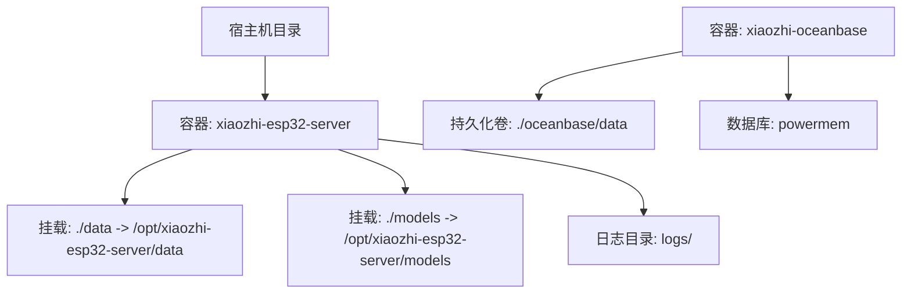
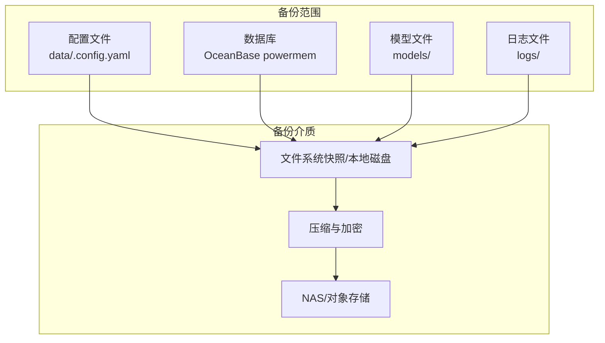
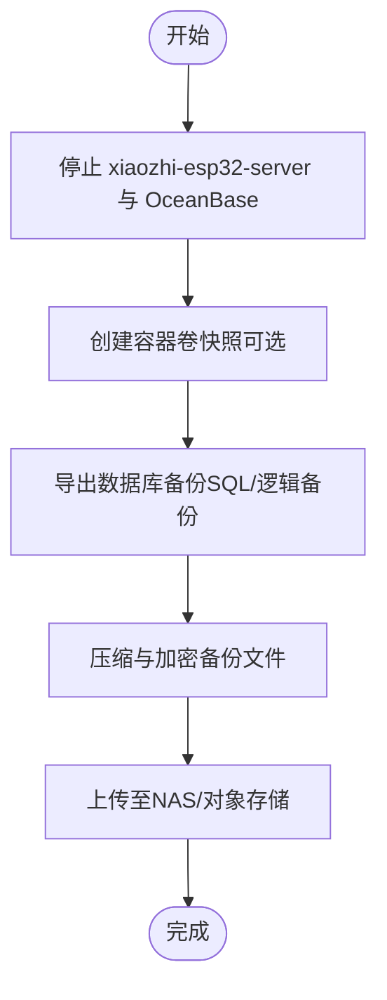
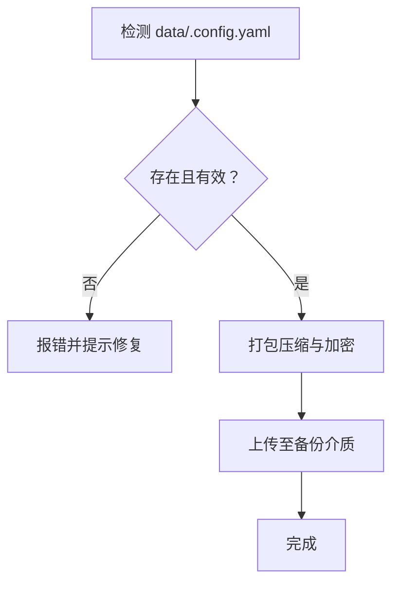
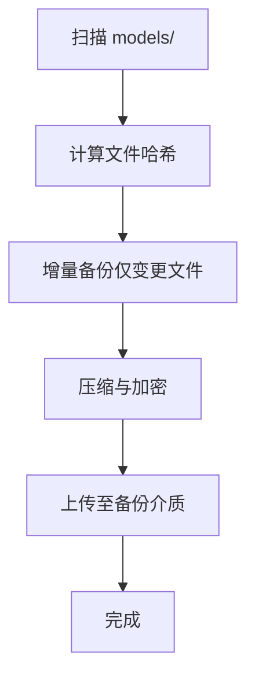
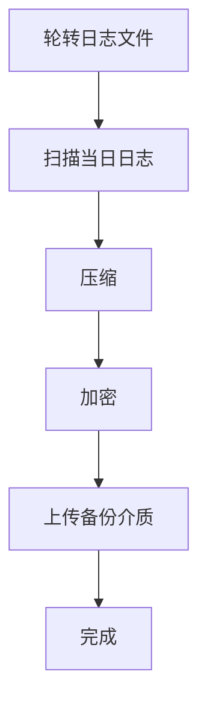
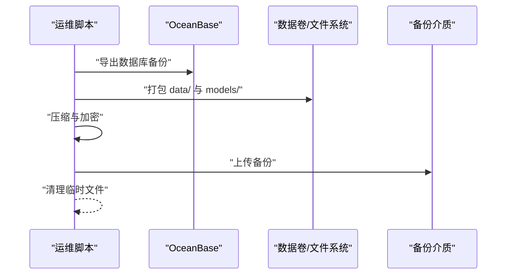
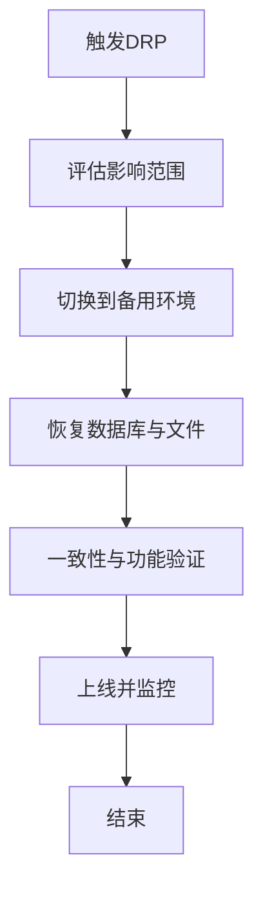
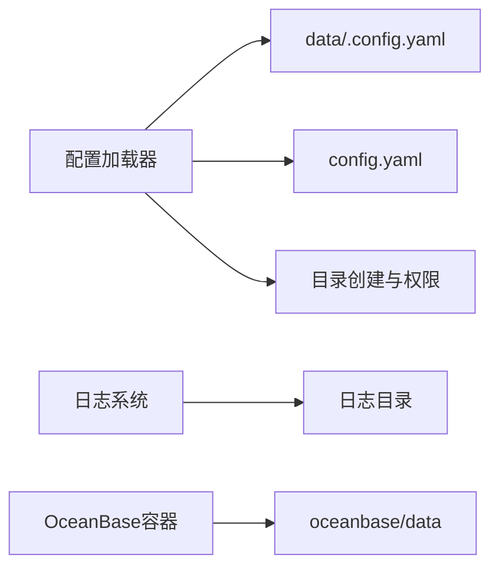

# 备份恢复

<cite>
**本文引用的文件**
- [settings.py](file://main/xiaozhi-server/config/settings.py)
- [config_loader.py](file://main/xiaozhi-server/config/config_loader.py)
- [logger.py](file://main/xiaozhi-server/config/logger.py)
- [docker-compose.yml](file://main/xiaozhi-server/docker-compose.yml)
- [docker-compose-oceanbase.yml](file://main/xiaozhi-server/docker-compose-oceanbase.yml)
- [init-powermem.sh](file://main/xiaozhi-server/oceanbase/init-powermem.sh)
- [README.md](file://main/xiaozhi-server/oceanbase/README.md)
- [.gitignore](file://.gitignore)
- [DELETE-MONITOR-GUIDE.md](file://main/xiaozhi-server/docs/guides/DELETE-MONITOR-GUIDE.md)
- [Memory_System_Architecture_Blueprint.md](file://main/xiaozhi-server/docs/architecture/Memory_System_Architecture_Blueprint.md)
</cite>

## 目录
1. [简介](#简介)
2. [项目结构](#项目结构)
3. [核心组件](#核心组件)
4. [架构总览](#架构总览)
5. [详细组件分析](#详细组件分析)
6. [依赖分析](#依赖分析)
7. [性能考虑](#性能考虑)
8. [故障排查指南](#故障排查指南)
9. [结论](#结论)
10. [附录](#附录)

## 简介
本文件面向小智ESP32服务器的运维与开发团队，提供一套完整的备份与恢复方案，涵盖数据库（OceanBase）、配置文件、模型文件与日志文件的备份策略、增量/全量备份实施方法、存储位置、压缩加密与版本管理、灾难恢复计划、自动化脚本、监控与告警、跨平台迁移与一致性检查等。目标是在保障数据安全的前提下，实现快速、可验证、可回滚的恢复流程。

## 项目结构
围绕备份与恢复的关键目录与文件如下：
- 配置与运行时数据
  - data/.config.yaml：运行时配置（敏感信息，不纳入版本控制）
  - config.yaml：默认配置模板
- 模型文件
  - models/：包含语音识别与VAD等模型资源
- 日志
  - logs/：应用日志（按大小轮转）
- 数据库存储
  - docker-compose-oceanbase.yml：OceanBase容器与数据卷映射
  - oceanbase/data/：OceanBase持久化目录
- 部署与挂载
  - docker-compose.yml：主服务容器与data、models目录的卷挂载

图表来源
- [docker-compose.yml:18-22](file://main/xiaozhi-server/docker-compose.yml#L18-L22)
- [docker-compose-oceanbase.yml:22-23](file://main/xiaozhi-server/docker-compose-oceanbase.yml#L22-L23)

章节来源
- [docker-compose.yml:1-22](file://main/xiaozhi-server/docker-compose.yml#L1-L22)
- [docker-compose-oceanbase.yml:1-36](file://main/xiaozhi-server/docker-compose-oceanbase.yml#L1-L36)

## 核心组件
- 配置加载与校验
  - 通过配置加载器读取默认配置与data/.config.yaml，支持从管理API拉取远程配置；确保目录存在与权限正确。
- 日志系统
  - 统一日志输出与文件轮转，日志目录可配置，默认位于项目内tmp或指定路径。
- 数据库存储
  - OceanBase容器通过卷映射持久化数据，支持备份与恢复。
- 模型与资源
  - 模型文件挂载至容器内，便于备份与迁移。
- 监控与审计
  - 记忆删除监控日志采用固定级别，便于过滤与审计。

章节来源
- [config_loader.py:27-62](file://main/xiaozhi-server/config/config_loader.py#L27-L62)
- [config_loader.py:123-162](file://main/xiaozhi-server/config/config_loader.py#L123-L162)
- [logger.py:64-91](file://main/xiaozhi-server/config/logger.py#L64-L91)
- [settings.py:9-34](file://main/xiaozhi-server/config/settings.py#L9-L34)
- [DELETE-MONITOR-GUIDE.md:1-255](file://main/xiaozhi-server/docs/guides/DELETE-MONITOR-GUIDE.md#L1-L255)

## 架构总览
备份与恢复涉及以下关键路径：
- 配置备份：data/.config.yaml（含API密钥、数据库凭据、模型选择等）
- 数据库备份：OceanBase容器内的powermem数据库
- 模型备份：models/目录（含ASR、VAD等模型）
- 日志备份：logs/目录（按大小轮转）

## 详细组件分析

### 数据库备份策略（OceanBase）
- 备份方式
  - 全量备份：使用数据库客户端导出SQL或逻辑备份
  - 增量备份：结合容器卷快照（如LVM/ZFS）进行增量快照
- 存储位置
  - 容器内持久化目录：/root/ob（映射到oceanbase/data）
- 压缩与加密
  - 建议对备份文件进行压缩（如gzip）与加密（如AES-256）后上传至NAS/对象存储
- 版本管理
  - 以日期命名备份文件，保留最近N个版本，定期清理过期备份
- 恢复流程
  - 停止服务 -> 恢复数据卷或导入SQL -> 启动服务 -> 验证连通性与数据完整性

章节来源
- [docker-compose-oceanbase.yml:22-23](file://main/xiaozhi-server/docker-compose-oceanbase.yml#L22-L23)
- [README.md:245-260](file://main/xiaozhi-server/oceanbase/README.md#L245-L260)

### 配置文件备份（data/.config.yaml）
- 备份范围
  - data/.config.yaml（含API密钥、数据库凭据、模型选择、性能调优等）
- 存储位置
  - data/ 目录（容器挂载）
- 压缩与加密
  - 建议对data/目录进行打包压缩与加密
- 版本管理
  - 以时间戳命名备份，保留最近N份
- 恢复流程
  - 停止服务 -> 恢复data/.config.yaml -> 启动服务 -> 校验配置加载

章节来源
- [settings.py:9-34](file://main/xiaozhi-server/config/settings.py#L9-L34)
- [config_loader.py:36-41](file://main/xiaozhi-server/config/config_loader.py#L36-L41)

### 模型文件备份（models/）
- 备份范围
  - models/ 目录（包含SenseVoiceSmall、silero-vad等模型）
- 存储位置
  - models/ 目录（容器挂载）
- 压缩与加密
  - 建议对models/进行增量备份，结合哈希校验
- 版本管理
  - 以模型版本号与日期命名，保留必要历史版本
- 恢复流程
  - 停止服务 -> 恢复models/ -> 启动服务 -> 校验模型可用性

章节来源
- [.gitignore:168-181](file://.gitignore#L168-L181)

### 日志文件备份（logs/）
- 备份范围
  - logs/ 目录（按大小轮转）
- 存储位置
  - logs/ 目录（容器挂载）
- 压缩与加密
  - 建议对日志进行压缩与加密
- 版本管理
  - 保留近N天的日志备份
- 恢复流程
  - 停止服务 -> 恢复logs/ -> 启动服务 -> 校验日志轮转

章节来源
- [logger.py:64-91](file://main/xiaozhi-server/config/logger.py#L64-L91)

### 自动化备份脚本（建议）
- 全量备份脚本
  - 停止服务 -> 导出数据库 -> 备份data/与models/ -> 压缩加密 -> 上传 -> 清理临时文件
- 增量备份脚本
  - 基于文件哈希对比，仅备份变更文件；数据库层面可结合快照
- 回滚脚本
  - 停止服务 -> 恢复对应备份 -> 启动服务 -> 校验

### 备份监控与告警
- 监控项
  - 备份任务执行状态、压缩/加密成功率、上传完成度、存储空间使用率
- 告警机制
  - 失败即刻告警；周期性巡检并报告异常

### 灾难恢复计划（DRP）
- 恢复目标
  - RTO/RPO目标（例如RTO<2小时，RPO<1天）
- 恢复流程
  - 评估故障影响 -> 切换到备用环境 -> 恢复数据库与文件 -> 校验服务可用性 -> 上线
- 一致性检查
  - 校验数据库表计数、日志完整性、模型文件哈希

### 跨平台迁移与数据同步
- 迁移步骤
  - 停止服务 -> 导出数据库 -> 备份data/与models/ -> 解压到新平台 -> 更新配置 -> 启动服务
- 同步策略
  - 文件层：rsync/分布式存储；数据库层：逻辑备份/物理快照
- 一致性检查
  - 校验哈希、统计数据、关键接口响应

## 依赖分析
- 配置加载依赖
  - 配置加载器依赖data/.config.yaml与默认配置，确保目录存在并具备写权限
- 日志系统依赖
  - 日志目录与轮转配置由配置驱动
- 数据库存储依赖
  - OceanBase容器通过卷映射实现数据持久化

图表来源
- [config_loader.py:123-162](file://main/xiaozhi-server/config/config_loader.py#L123-L162)
- [logger.py:64-91](file://main/xiaozhi-server/config/logger.py#L64-L91)
- [docker-compose-oceanbase.yml:22-23](file://main/xiaozhi-server/docker-compose-oceanbase.yml#L22-L23)

章节来源
- [config_loader.py:27-62](file://main/xiaozhi-server/config/config_loader.py#L27-L62)
- [logger.py:64-91](file://main/xiaozhi-server/config/logger.py#L64-L91)
- [docker-compose-oceanbase.yml:22-23](file://main/xiaozhi-server/docker-compose-oceanbase.yml#L22-L23)

## 性能考虑
- 备份窗口
  - 尽量在低峰期执行备份，避免影响在线服务
- 并行与增量
  - 并行压缩与上传；增量备份减少IO与带宽占用
- 存储与网络
  - 使用高速存储与高带宽网络，缩短备份与恢复时间

## 故障排查指南
- 配置文件缺失
  - 若data/.config.yaml不存在，启动时会抛出异常，需按指引创建并配置
- 日志轮转问题
  - 检查日志目录权限与磁盘空间
- 数据库不可用
  - 使用内置命令检查容器状态、端口占用与初始化日志
- 记忆删除审计
  - 使用固定级别的删除监控日志进行审计与定位

章节来源
- [settings.py:9-34](file://main/xiaozhi-server/config/settings.py#L9-L34)
- [logger.py:64-91](file://main/xiaozhi-server/config/logger.py#L64-L91)
- [README.md:313-340](file://main/xiaozhi-server/oceanbase/README.md#L313-L340)
- [DELETE-MONITOR-GUIDE.md:76-89](file://main/xiaozhi-server/docs/guides/DELETE-MONITOR-GUIDE.md#L76-L89)

## 结论
通过明确的备份策略（全量/增量）、规范的存储与加密、严格的版本管理与自动化脚本，配合完善的监控与告警、清晰的灾难恢复流程与一致性检查，小智ESP32服务器能够在发生故障时快速恢复并保障业务连续性。建议将上述流程纳入SOP，并定期演练以验证有效性。

## 附录
- 存储位置与挂载
  - data/、models/、logs/、oceanbase/data/均为关键备份对象
- 安全与合规
  - 敏感配置与日志需加密存储；遵守数据最小化与可追溯原则
- 参考文档
  - OceanBase使用指南与备份恢复命令
  - 架构蓝图中的存储卷说明

章节来源
- [docker-compose.yml:18-22](file://main/xiaozhi-server/docker-compose.yml#L18-L22)
- [docker-compose-oceanbase.yml:22-23](file://main/xiaozhi-server/docker-compose-oceanbase.yml#L22-L23)
- [README.md:245-260](file://main/xiaozhi-server/oceanbase/README.md#L245-L260)
- [Memory_System_Architecture_Blueprint.md:729-764](file://main/xiaozhi-server/docs/architecture/Memory_System_Architecture_Blueprint.md#L729-L764)