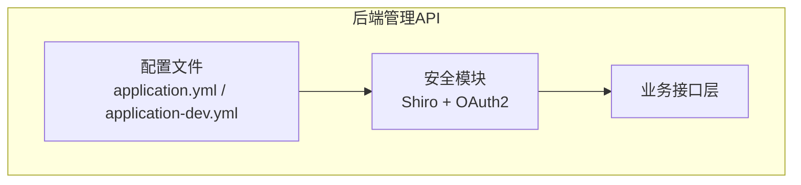
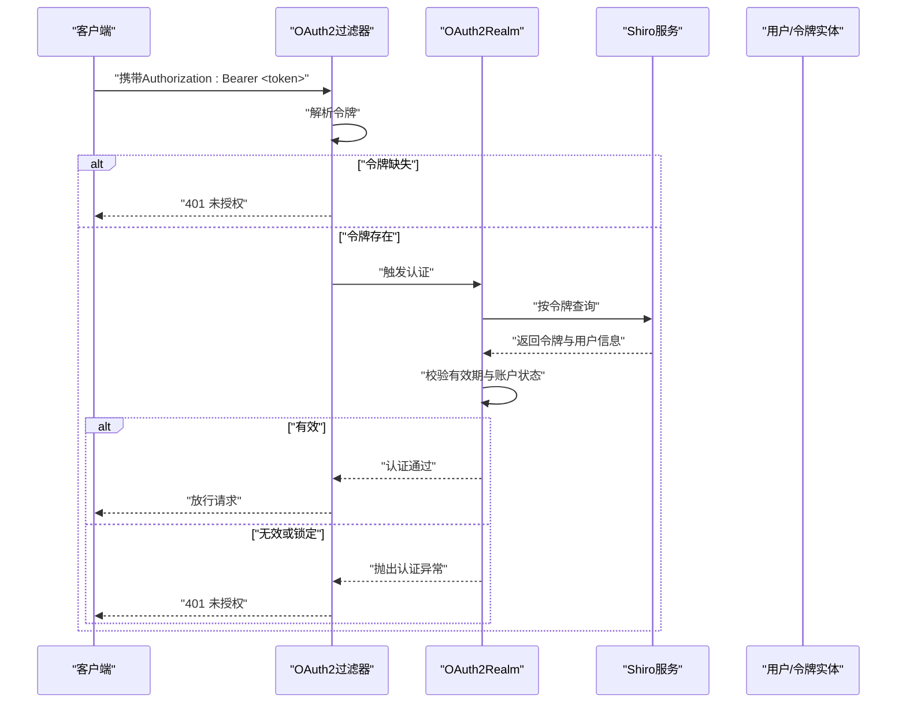
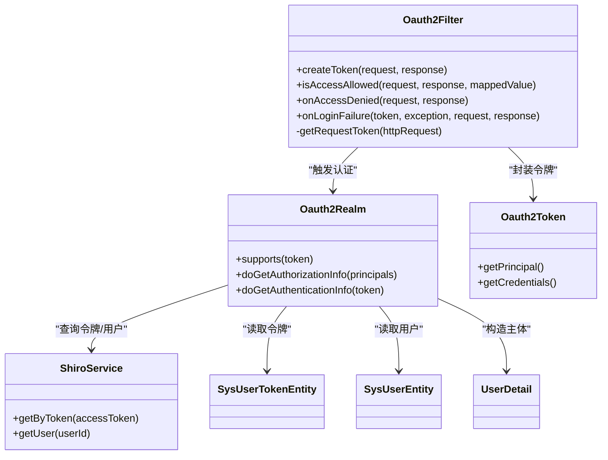
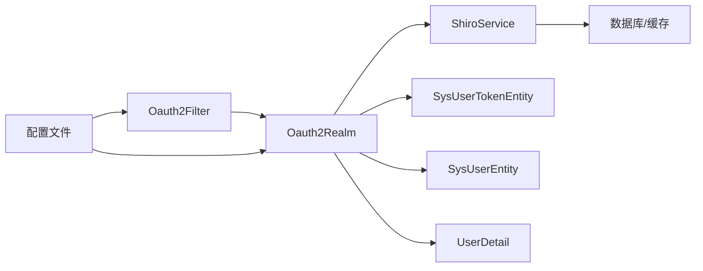

# 安全合规

<cite>
**本文引用的文件**
- [application.yml](file://main/manager-api/src/main/resources/application.yml)
- [application-dev.yml](file://main/manager-api/src/main/resources/application-dev.yml)
- [Oauth2Filter.java](file://main/manager-api/src/main/java/xiaozhi/modules/security/oauth2/Oauth2Filter.java)
- [Oauth2Realm.java](file://main/manager-api/src/main/java/xiaozhi/modules/security/oauth2/Oauth2Realm.java)
- [Oauth2Token.java](file://main/manager-api/src/main/java/xiaozhi/modules/security/oauth2/Oauth2Token.java)
- [ShiroService.java](file://main/manager-api/src/main/java/xiaozhi/modules/security/service/ShiroService.java)
- [SysUserTokenEntity.java](file://main/manager-api/src/main/java/xiaozhi/modules/security/entity/SysUserTokenEntity.java)
- [SysUserEntity.java](file://main/manager-api/src/main/java/xiaozhi/modules/sys/entity/SysUserEntity.java)
- [UserDetail.java](file://main/manager-api/src/main/java/xiaozhi/common/user/UserDetail.java)
</cite>

## 目录
1. [简介](#简介)
2. [项目结构](#项目结构)
3. [核心组件](#核心组件)
4. [架构总览](#架构总览)
5. [详细组件分析](#详细组件分析)
6. [依赖分析](#依赖分析)
7. [性能考虑](#性能考虑)
8. [故障排查指南](#故障排查指南)
9. [结论](#结论)
10. [附录](#附录)

## 简介
本文件面向小智ESP32服务器，聚焦于后端管理API（基于Spring Boot与Apache Shiro）的安全与合规设计，系统化梳理身份认证机制、OAuth2集成思路、会话与令牌管理策略，并结合现有配置与实现，提出密码加密、敏感数据保护、传输安全、访问控制、权限管理、审计日志、网络安全与合规建议。由于当前仓库未包含完整的后端认证与会话持久化实现细节，本文在“已实现”部分严格依据现有源码，在“建议完善”部分给出可落地的加固方案。

## 项目结构
后端管理API位于 main/manager-api，采用Spring Boot工程，安全模块围绕Apache Shiro构建，核心安全组件包括：
- OAuth2过滤器：负责从HTTP头提取令牌并触发认证流程
- Realm：执行认证与授权逻辑，校验令牌有效性与用户状态
- Token模型：封装认证令牌
- Shiro服务：提供令牌与用户信息查询接口
- 配置文件：定义Tomcat会话Cookie属性、XSS开关、Knife4j基础鉴权等

图表来源
- [application.yml:1-66](file://main/manager-api/src/main/resources/application.yml#L1-L66)
- [application-dev.yml:1-51](file://main/manager-api/src/main/resources/application-dev.yml#L1-L51)

章节来源
- [application.yml:1-66](file://main/manager-api/src/main/resources/application.yml#L1-L66)
- [application-dev.yml:1-51](file://main/manager-api/src/main/resources/application-dev.yml#L1-L51)

## 核心组件
- OAuth2过滤器：从请求头解析Bearer令牌，若缺失则返回未授权；存在时交由认证流程处理
- Realm：根据令牌查询用户与令牌信息，校验有效期与账户状态，授予角色权限集合
- Token模型：承载令牌字符串，作为Shiro认证主体
- Shiro服务：抽象出令牌与用户查询能力，供Realm调用
- 实体与用户详情：令牌实体、用户实体、用户详情对象用于权限与上下文传递

章节来源
- [Oauth2Filter.java:1-109](file://main/manager-api/src/main/java/xiaozhi/modules/security/oauth2/Oauth2Filter.java#L1-L109)
- [Oauth2Realm.java:1-108](file://main/manager-api/src/main/java/xiaozhi/modules/security/oauth2/Oauth2Realm.java#L1-L108)
- [Oauth2Token.java:1-27](file://main/manager-api/src/main/java/xiaozhi/modules/security/oauth2/Oauth2Token.java#L1-L27)
- [ShiroService.java](file://main/manager-api/src/main/java/xiaozhi/modules/security/service/ShiroService.java)
- [SysUserTokenEntity.java](file://main/manager-api/src/main/java/xiaozhi/modules/security/entity/SysUserTokenEntity.java)
- [SysUserEntity.java](file://main/manager-api/src/main/java/xiaozhi/modules/sys/entity/SysUserEntity.java)
- [UserDetail.java](file://main/manager-api/src/main/java/xiaozhi/common/user/UserDetail.java)

## 架构总览
下图展示从客户端到后端的典型认证与授权流程，映射到现有过滤器、Realm与服务接口：

图表来源
- [Oauth2Filter.java:33-76](file://main/manager-api/src/main/java/xiaozhi/modules/security/oauth2/Oauth2Filter.java#L33-L76)
- [Oauth2Realm.java:75-106](file://main/manager-api/src/main/java/xiaozhi/modules/security/oauth2/Oauth2Realm.java#L75-L106)
- [ShiroService.java](file://main/manager-api/src/main/java/xiaozhi/modules/security/service/ShiroService.java)
- [SysUserTokenEntity.java](file://main/manager-api/src/main/java/xiaozhi/modules/security/entity/SysUserTokenEntity.java)
- [SysUserEntity.java](file://main/manager-api/src/main/java/xiaozhi/modules/sys/entity/SysUserEntity.java)

## 详细组件分析

### 组件一：OAuth2过滤器（Oauth2Filter）
- 功能要点
  - 从请求头读取Authorization字段，识别Bearer令牌
  - 若OPTIONS预检请求直接放行
  - 令牌缺失时返回统一错误响应
  - 认证失败时进行国际化错误包装并输出JSON
- 安全影响
  - 仅支持Bearer令牌，避免混淆其他鉴权方式
  - 返回头包含跨域凭据与来源，需配合后端CORS策略
- 建议完善
  - 明确令牌来源与刷新机制（当前未见刷新逻辑）
  - 引入速率限制与黑名单检查（建议）

章节来源
- [Oauth2Filter.java:33-109](file://main/manager-api/src/main/java/xiaozhi/modules/security/oauth2/Oauth2Filter.java#L33-L109)

### 组件二：OAuth2 Realm（Oauth2Realm）
- 功能要点
  - 支持OAuth2Token类型的认证
  - 授权：超级管理员授予双重角色，普通用户授予普通角色
  - 认证：按令牌查询用户与令牌实体，校验过期时间与账户状态
  - 账户状态异常时记录错误并拒绝
- 安全影响
  - 通过令牌实体过期时间控制会话有效期
  - 账户锁定与禁用场景明确区分
- 建议完善
  - 补充令牌撤销与黑名单存储（Redis/数据库）
  - 引入失败计数与临时封禁策略

章节来源
- [Oauth2Realm.java:45-106](file://main/manager-api/src/main/java/xiaozhi/modules/security/oauth2/Oauth2Realm.java#L45-L106)

### 组件三：Token模型（Oauth2Token）
- 功能要点
  - 实现Shiro的AuthenticationToken接口
  - 提供令牌作为主体与凭证
- 安全影响
  - 令牌以字符串形式传递，需确保传输安全与存储安全

章节来源
- [Oauth2Token.java:10-26](file://main/manager-api/src/main/java/xiaozhi/modules/security/oauth2/Oauth2Token.java#L10-L26)

### 组件四：Shiro服务（ShiroService）
- 功能要点
  - 提供按令牌查询与按用户ID查询的能力
  - 作为Realm与数据层之间的适配器
- 安全影响
  - 服务层应保证令牌查询的幂等与一致性
- 建议完善
  - 引入缓存与限流
  - 记录审计日志（见“审计日志”章节）

章节来源
- [ShiroService.java](file://main/manager-api/src/main/java/xiaozhi/modules/security/service/ShiroService.java)

### 组件五：实体与用户详情
- 实体
  - 令牌实体：包含用户ID与过期时间等
  - 用户实体：包含账户状态等
- 用户详情
  - 用于权限上下文传递与会话主体
- 安全影响
  - 需确保实体字段不泄露敏感信息
  - 过期时间与状态字段必须严格校验

章节来源
- [SysUserTokenEntity.java](file://main/manager-api/src/main/java/xiaozhi/modules/security/entity/SysUserTokenEntity.java)
- [SysUserEntity.java](file://main/manager-api/src/main/java/xiaozhi/modules/sys/entity/SysUserEntity.java)
- [UserDetail.java](file://main/manager-api/src/main/java/xiaozhi/common/user/UserDetail.java)

### 类关系图

图表来源
- [Oauth2Filter.java:29-109](file://main/manager-api/src/main/java/xiaozhi/modules/security/oauth2/Oauth2Filter.java#L29-L109)
- [Oauth2Realm.java:37-108](file://main/manager-api/src/main/java/xiaozhi/modules/security/oauth2/Oauth2Realm.java#L37-L108)
- [Oauth2Token.java:10-26](file://main/manager-api/src/main/java/xiaozhi/modules/security/oauth2/Oauth2Token.java#L10-L26)
- [ShiroService.java](file://main/manager-api/src/main/java/xiaozhi/modules/security/service/ShiroService.java)
- [SysUserTokenEntity.java](file://main/manager-api/src/main/java/xiaozhi/modules/security/entity/SysUserTokenEntity.java)
- [SysUserEntity.java](file://main/manager-api/src/main/java/xiaozhi/modules/sys/entity/SysUserEntity.java)
- [UserDetail.java](file://main/manager-api/src/main/java/xiaozhi/common/user/UserDetail.java)

## 依赖分析
- 组件耦合
  - 过滤器依赖Realm执行认证
  - Realm依赖ShiroService进行令牌与用户查询
  - Realm依赖实体与用户详情对象构建主体
- 外部依赖
  - Spring Boot、Apache Shiro
  - Knife4j（开发环境API文档与基础鉴权）
  - Druid（数据库连接池，含SQL审计与墙配置）
  - Redis（开发环境配置，可用于会话/令牌缓存）

图表来源
- [Oauth2Filter.java:29-109](file://main/manager-api/src/main/java/xiaozhi/modules/security/oauth2/Oauth2Filter.java#L29-L109)
- [Oauth2Realm.java:37-108](file://main/manager-api/src/main/java/xiaozhi/modules/security/oauth2/Oauth2Realm.java#L37-L108)
- [ShiroService.java](file://main/manager-api/src/main/java/xiaozhi/modules/security/service/ShiroService.java)
- [application.yml:15-66](file://main/manager-api/src/main/resources/application.yml#L15-L66)
- [application-dev.yml:10-51](file://main/manager-api/src/main/resources/application-dev.yml#L10-L51)

章节来源
- [application.yml:15-66](file://main/manager-api/src/main/resources/application.yml#L15-L66)
- [application-dev.yml:10-51](file://main/manager-api/src/main/resources/application-dev.yml#L10-L51)

## 性能考虑
- 线程与会话
  - Tomcat线程池上限较高，需结合限流与熔断
  - 会话Cookie启用HttpOnly，降低XSS风险
- 数据库与缓存
  - Druid连接池参数合理，建议开启慢SQL日志与SQL防火墙
  - Redis连接池参数适中，建议引入连接池监控与健康检查
- 认证路径
  - 建议对令牌查询加缓存（如Redis），减少数据库压力
  - 对认证失败进行限速与临时封禁，防止暴力破解

## 故障排查指南
- 常见问题定位
  - 401未授权：检查请求头是否包含正确的Bearer令牌
  - 账户被锁/禁用：检查用户状态字段与Realm中的状态判断
  - 令牌无效：检查令牌过期时间与数据库中的令牌记录
- 日志与审计
  - 启用Shiro与业务日志，记录认证与授权事件
  - 对异常与失败尝试进行审计留痕

章节来源
- [Oauth2Filter.java:56-95](file://main/manager-api/src/main/java/xiaozhi/modules/security/oauth2/Oauth2Filter.java#L56-L95)
- [Oauth2Realm.java:75-106](file://main/manager-api/src/main/java/xiaozhi/modules/security/oauth2/Oauth2Realm.java#L75-L106)

## 结论
当前后端安全体系以Shiro为核心，实现了基于Bearer令牌的认证与授权，具备基本的会话Cookie安全属性与开发环境的Knife4j基础鉴权。建议在以下方面进一步完善：引入令牌刷新与撤销、失败计数与封禁、令牌黑名单、审计日志、传输加密与网络边界防护，以满足生产环境的安全与合规要求。

## 附录

### 安全配置清单（基于现有配置）
- 会话与Cookie
  - 启用HttpOnly Cookie，降低XSS风险
- XSS防护
  - 开启XSS过滤，排除特定URL
- API文档与基础鉴权
  - Knife4j开发环境基础鉴权，生产环境建议关闭或改为更严格的鉴权
- 数据库与SQL安全
  - Druid慢SQL日志与墙配置，多语句允许需谨慎
- 缓存与连接
  - Redis连接池参数与健康检查

章节来源
- [application.yml:11-14](file://main/manager-api/src/main/resources/application.yml#L11-L14)
- [application.yml:42-44](file://main/manager-api/src/main/resources/application.yml#L42-L44)
- [application.yml:30-37](file://main/manager-api/src/main/resources/application.yml#L30-L37)
- [application-dev.yml:29-38](file://main/manager-api/src/main/resources/application-dev.yml#L29-L38)
- [application-dev.yml:40-51](file://main/manager-api/src/main/resources/application-dev.yml#L40-L51)

### 密码加密与敏感数据保护（建议）
- 密码加密
  - 使用强哈希算法（如Argon2、bcrypt、scrypt）存储密码
  - 为每个用户生成随机盐值，禁止明文存储
- 敏感数据保护
  - 令牌与密钥使用硬件安全模块（HSM）或密钥管理系统（KMS）
  - 数据库连接串与Redis密码使用环境变量或密钥管理服务注入
- 传输安全
  - 强制HTTPS，禁用HTTP
  - 启用TLS 1.3与前向保密套件
  - 配置HSTS与安全重定向

### 访问控制与权限管理（建议）
- 角色与权限
  - 基于RBAC模型，细化权限粒度（资源+操作）
  - 超级管理员与普通管理员分离
- 会话管理
  - 令牌过期时间与滑动过期策略
  - 登出时撤销令牌，加入黑名单
  - 并发登录控制与强制下线

### 审计日志（建议）
- 记录内容
  - 认证/授权事件、失败尝试、权限变更、敏感操作
- 存储与保留
  - 异步写入、集中式日志、合规保留周期
- 可视化与告警
  - 关联规则引擎，异常行为实时告警

### 网络安全与DDoS防护（建议）
- 边界防护
  - Web应用防火墙（WAF）、IP白名单/黑名单
  - CDN与DDoS清洗服务
- 速率限制
  - 基于IP/令牌/用户维度的限流
  - 滑动窗口与令牌桶算法
- 健康检查与弹性
  - 自动扩缩容、熔断与降级

### 合规与安全扫描（建议）
- 合规框架
  - 参考等保2.0、ISO 27001、GDPR等
- 安全扫描
  - 代码静态扫描（SonarQube、SpotBugs）
  - 依赖漏洞扫描（OWASP Dependency-Check）
  - 渗透测试（红蓝对抗、持续集成）

### 安全事件响应（建议）
- 流程
  - 发现→评估→隔离→处置→恢复→复盘
- 工具
  - SIEM、威胁情报、自动化编排
- 培训
  - 定期演练与安全意识培训