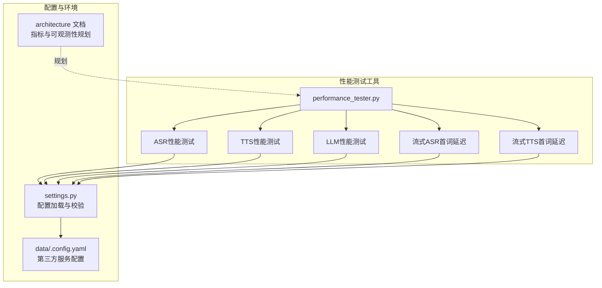
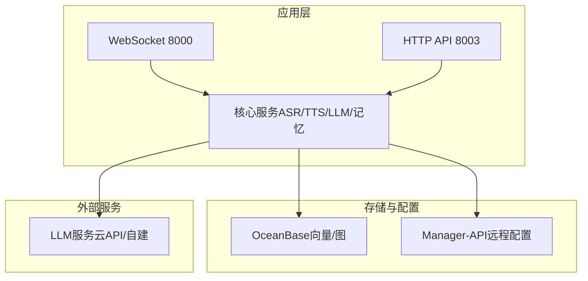
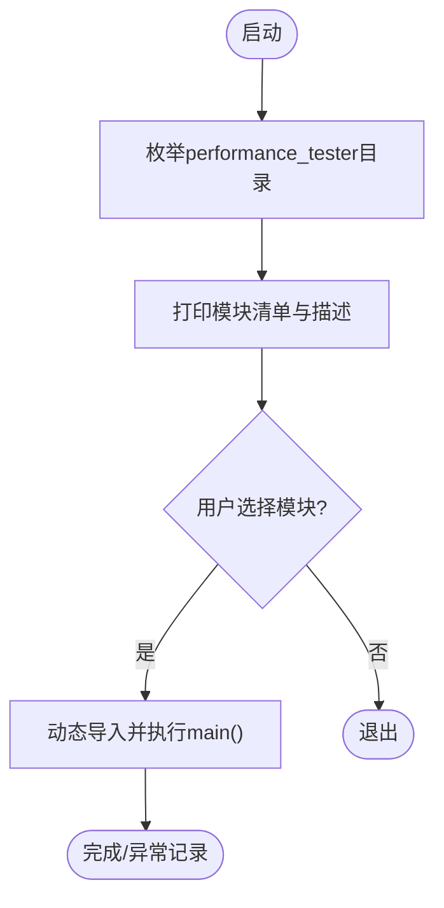
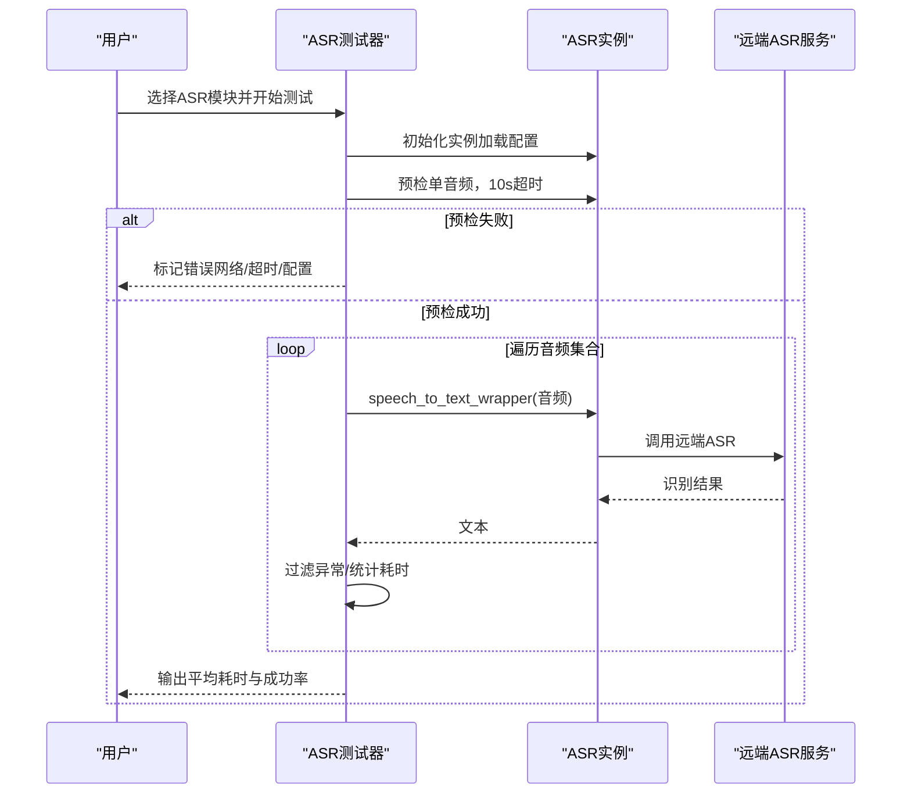
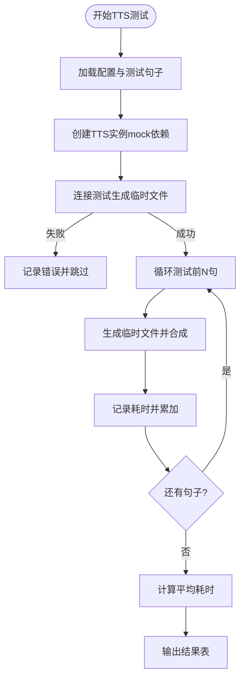
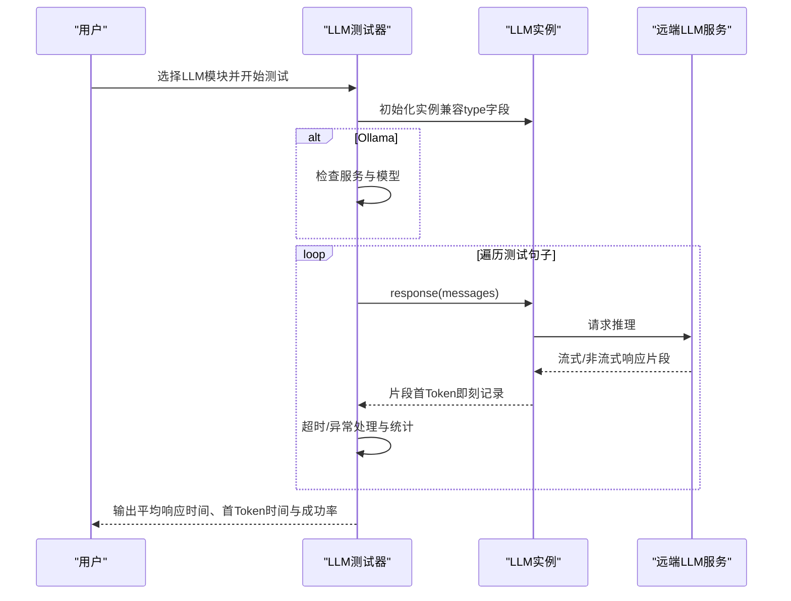
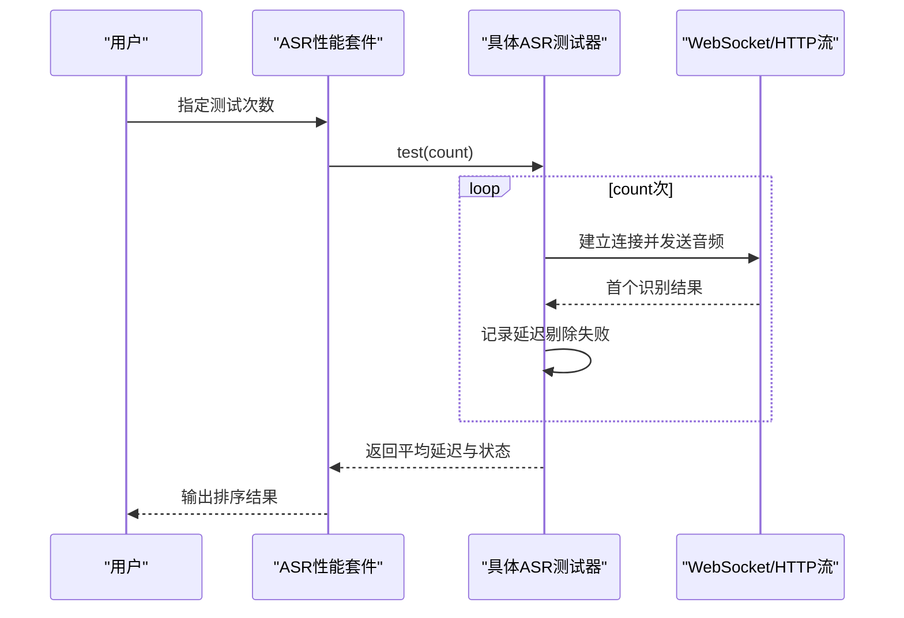
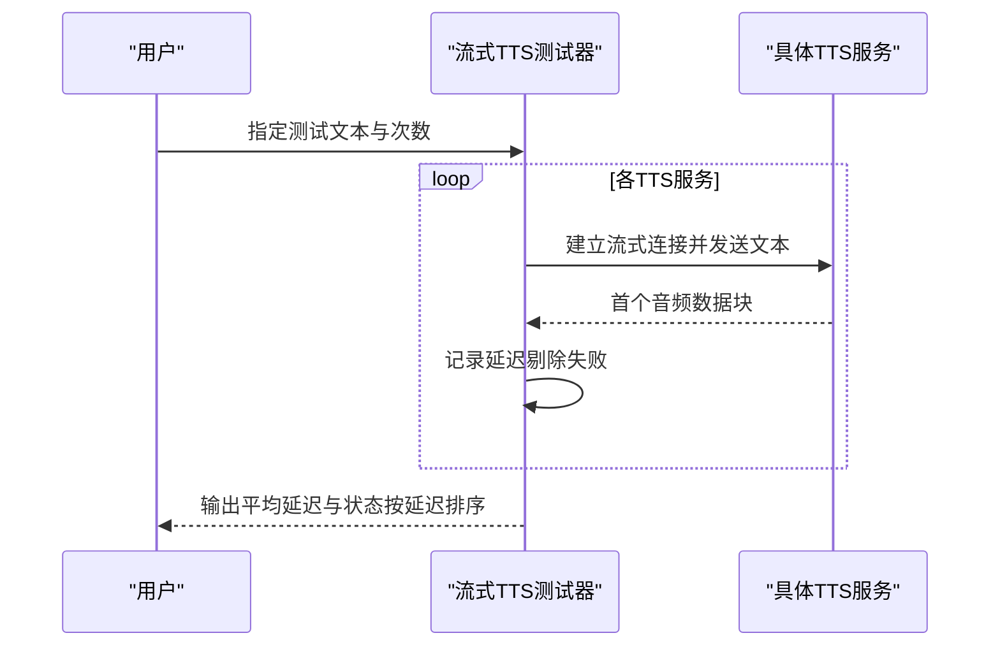
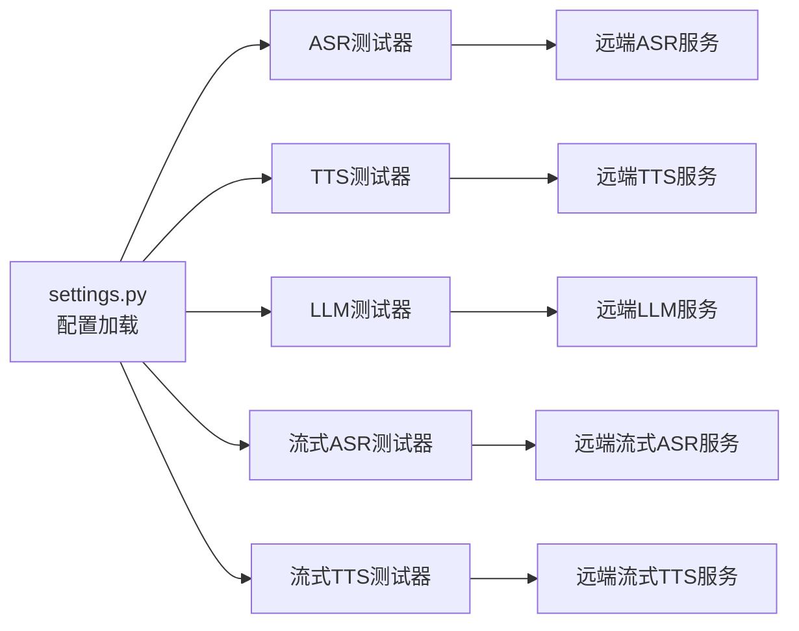

# 性能监控

<cite>
**本文引用的文件**   
- [performance_tester.py](file://main/xiaozhi-server/performance_tester.py)
- [performance_tester_asr.py](file://main/xiaozhi-server/performance_tester/performance_tester_asr.py)
- [performance_tester_tts.py](file://main/xiaozhi-server/performance_tester/performance_tester_tts.py)
- [performance_tester_llm.py](file://main/xiaozhi-server/performance_tester/performance_tester_llm.py)
- [performance_tester_stream_asr.py](file://main/xiaozhi-server/performance_tester/performance_tester_stream_asr.py)
- [performance_tester_stream_tts.py](file://main/xiaozhi-server/performance_tester/performance_tester_stream_tts.py)
- [settings.py](file://main/xiaozhi-server/config/settings.py)
- [Memory_System_Architecture_Blueprint.md.bak3](file://main/xiaozhi-server/docs/architecture/Memory_System_Architecture_Blueprint.md.bak3)
- [performance_tester.md](file://docs/performance_tester.md)
</cite>

## 目录
1. [简介](#简介)
2. [项目结构](#项目结构)
3. [核心组件](#核心组件)
4. [架构总览](#架构总览)
5. [详细组件分析](#详细组件分析)
6. [依赖关系分析](#依赖关系分析)
7. [性能考量](#性能考量)
8. [故障排查指南](#故障排查指南)
9. [结论](#结论)
10. [附录](#附录)

## 简介
本文件面向小智ESP32服务器的性能监控与优化，围绕ASR、TTS、LLM等AI服务的性能测试方法、延迟与吞吐评估、系统资源监控、内存与CPU负载跟踪、瓶颈识别与调优策略展开。文档同时给出监控仪表板配置思路、告警规则建议与性能报告生成方法，并覆盖压力测试、负载测试与稳定性测试的实施步骤。

## 项目结构
小智ESP32服务器采用多模块架构，性能测试工具集中位于 Xiaozhi Server 的 performance_tester 目录，配合配置加载模块与系统架构文档，形成“配置驱动 + 自动化测试 + 结果汇总”的闭环。

图示来源
- [performance_tester.py:1-69](file://main/xiaozhi-server/performance_tester.py#L1-L69)
- [settings.py:1-34](file://main/xiaozhi-server/config/settings.py#L1-L34)
- [Memory_System_Architecture_Blueprint.md.bak3:680-698](file://main/xiaozhi-server/docs/architecture/Memory_System_Architecture_Blueprint.md.bak3#L680-L698)

章节来源
- [performance_tester.py:1-69](file://main/xiaozhi-server/performance_tester.py#L1-L69)
- [settings.py:1-34](file://main/xiaozhi-server/config/settings.py#L1-L34)
- [Memory_System_Architecture_Blueprint.md.bak3:680-698](file://main/xiaozhi-server/docs/architecture/Memory_System_Architecture_Blueprint.md.bak3#L680-L698)

## 核心组件
- 性能测试调度器：动态发现并执行各模块测试，支持交互选择与批量运行。
- ASR/TTS/LLM/流式ASR/流式TTS 测试器：分别针对非流式与流式场景，采集延迟、吞吐、成功率等指标。
- 配置加载与校验：统一读取 config.yaml 与 data/.config.yaml，校验第三方服务凭据与可用性。
- 架构文档：定义未来指标（Prometheus）与追踪（OpenTelemetry）方向，指导监控体系演进。

章节来源
- [performance_tester.py:47-69](file://main/xiaozhi-server/performance_tester.py#L47-L69)
- [settings.py:9-34](file://main/xiaozhi-server/config/settings.py#L9-L34)
- [Memory_System_Architecture_Blueprint.md.bak3:680-698](file://main/xiaozhi-server/docs/architecture/Memory_System_Architecture_Blueprint.md.bak3#L680-L698)

## 架构总览
小智服务器的部署与性能相关要点如下：
- 应用服务器：Python 3.10，WebSocket 8000、HTTP API 8003，异步+线程池并发模型。
- 存储与外部服务：OceanBase（向量+图）、Manager-API（远程配置）、外部LLM服务。
- 资源限制：4核CPU、8GB内存（生产环境建议）。

图示来源
- [Memory_System_Architecture_Blueprint.md.bak3:707-737](file://main/xiaozhi-server/docs/architecture/Memory_System_Architecture_Blueprint.md.bak3#L707-L737)

章节来源
- [Memory_System_Architecture_Blueprint.md.bak3:707-737](file://main/xiaozhi-server/docs/architecture/Memory_System_Architecture_Blueprint.md.bak3#L707-L737)

## 详细组件分析

### 性能测试调度器（performance_tester.py）
- 功能：扫描 performance_tester 目录，列出可用测试模块，支持交互选择与异步执行。
- 关键点：动态导入模块、查找 main 函数、并发执行、异常处理与描述展示。

图示来源
- [performance_tester.py:8-35](file://main/xiaozhi-server/performance_tester.py#L8-L35)
- [performance_tester.py:47-69](file://main/xiaozhi-server/performance_tester.py#L47-L69)

章节来源
- [performance_tester.py:1-69](file://main/xiaozhi-server/performance_tester.py#L1-L69)

### ASR 性能测试（performance_tester_asr.py）
- 测试目标：非流式语音识别的平均耗时与成功率。
- 数据来源：config/assets 下的音频文件，data/.config.yaml 中的 ASR 配置。
- 方法论：
  - 连通性预检：单音频快速测试，超时10秒。
  - 全量测试：遍历音频集合，过滤异常耗时与502错误。
  - 统计：平均耗时、成功率（≥30%有效样本），按耗时升序排序。
- 错误处理：超时、502、配置缺失、异常均记录并标注错误类型。

图示来源
- [performance_tester_asr.py:67-89](file://main/xiaozhi-server/performance_tester/performance_tester_asr.py#L67-L89)
- [performance_tester_asr.py:90-240](file://main/xiaozhi-server/performance_tester/performance_tester_asr.py#L90-L240)

章节来源
- [performance_tester_asr.py:1-354](file://main/xiaozhi-server/performance_tester/performance_tester_asr.py#L1-L354)

### TTS 性能测试（performance_tester_tts.py）
- 测试目标：非流式语音合成的平均耗时与可用性。
- 数据来源：配置中的 test_sentences，mock conn 与 opus_encoder 以规避依赖。
- 方法论：
  - 连接测试：生成临时文件验证服务可达性。
  - 多句测试：统计前若干句的耗时，计算平均值。
  - 排序：按平均耗时升序，错误项排末尾。

图示来源
- [performance_tester_tts.py:33-98](file://main/xiaozhi-server/performance_tester/performance_tester_tts.py#L33-L98)
- [performance_tester_tts.py:167-189](file://main/xiaozhi-server/performance_tester/performance_tester_tts.py#L167-L189)

章节来源
- [performance_tester_tts.py:1-200](file://main/xiaozhi-server/performance_tester/performance_tester_tts.py#L1-L200)

### LLM 性能测试（performance_tester_llm.py）
- 测试目标：非流式对话的平均响应时间与首Token时间，评估延迟与吞吐。
- 数据来源：配置中的 LLM 列表与 test_sentences，系统提示词模板替换。
- 方法论：
  - 单句测试：构造消息（系统提示词+用户输入），异步等待响应，记录首Token时间与总响应时间。
  - 超时控制：单句10秒，整体任务30秒超时保护。
  - 统计：过滤异常与低成功率（<30%），3σ去离群，计算平均响应与首Token时间，输出成功率。
  - 特例：Ollama 服务健康检查与模型存在性校验。

图示来源
- [performance_tester_llm.py:146-228](file://main/xiaozhi-server/performance_tester/performance_tester_llm.py#L146-L228)
- [performance_tester_llm.py:229-366](file://main/xiaozhi-server/performance_tester/performance_tester_llm.py#L229-L366)

章节来源
- [performance_tester_llm.py:1-545](file://main/xiaozhi-server/performance_tester/performance_tester_llm.py#L1-L545)

### 流式ASR首词延迟测试（performance_tester_stream_asr.py）
- 测试目标：流式ASR从建立连接到收到首个识别结果的延迟。
- 支持厂商：豆包、通义、讯飞。
- 方法论：
  - WebSocket/HTTP流式请求，计时起点统一在连接建立前（包含握手、发送音频、接收首个结果）。
  - 多次测试取有效样本（剔除None与≤0），按平均延迟排序，输出状态与统计。

图示来源
- [performance_tester_stream_asr.py:49-127](file://main/xiaozhi-server/performance_tester/performance_tester_stream_asr.py#L49-L127)
- [performance_tester_stream_asr.py:195-213](file://main/xiaozhi-server/performance_tester/performance_tester_stream_asr.py#L195-L213)

章节来源
- [performance_tester_stream_asr.py:1-402](file://main/xiaozhi-server/performance_tester/performance_tester_stream_asr.py#L1-L402)

### 流式TTS首词延迟测试（performance_tester_stream_tts.py）
- 测试目标：流式TTS从建立连接到收到第一个音频数据块的延迟。
- 支持厂商：阿里云、阿里云百炼、火山引擎、PaddleSpeech、Linkerai、讯飞。
- 方法论：
  - WebSocket/HTTP流式请求，统一计时起点（连接建立前）。
  - 多次测试取有效样本，输出平均延迟与状态，按延迟升序排序。

图示来源
- [performance_tester_stream_tts.py:24-96](file://main/xiaozhi-server/performance_tester/performance_tester_stream_tts.py#L24-L96)
- [performance_tester_stream_tts.py:605-656](file://main/xiaozhi-server/performance_tester/performance_tester_stream_tts.py#L605-L656)

章节来源
- [performance_tester_stream_tts.py:1-671](file://main/xiaozhi-server/performance_tester/performance_tester_stream_tts.py#L1-L671)

## 依赖关系分析
- 配置加载：各测试器通过 settings.load_config 或直接读取 data/.config.yaml 获取第三方服务参数。
- 依赖注入：ASR/TTS/LLM 测试器通过工厂方法创建实例，保证测试与业务解耦。
- 并发模型：测试器普遍采用 asyncio + ThreadPoolExecutor，提升I/O密集场景吞吐。

图示来源
- [settings.py:1-34](file://main/xiaozhi-server/config/settings.py#L1-L34)
- [performance_tester_asr.py:26-47](file://main/xiaozhi-server/performance_tester/performance_tester_asr.py#L26-L47)
- [performance_tester_tts.py:22-31](file://main/xiaozhi-server/performance_tester/performance_tester_tts.py#L22-L31)
- [performance_tester_llm.py:22-35](file://main/xiaozhi-server/performance_tester/performance_tester_llm.py#L22-L35)

章节来源
- [settings.py:1-34](file://main/xiaozhi-server/config/settings.py#L1-L34)
- [performance_tester_asr.py:1-66](file://main/xiaozhi-server/performance_tester/performance_tester_asr.py#L1-L66)
- [performance_tester_tts.py:1-32](file://main/xiaozhi-server/performance_tester/performance_tester_tts.py#L1-L32)
- [performance_tester_llm.py:1-36](file://main/xiaozhi-server/performance_tester/performance_tester_llm.py#L1-L36)

## 性能考量
- 延迟指标
  - 非流式：ASR/TTS平均耗时；LLM平均响应时间、首Token时间。
  - 流式：首词/首帧延迟，强调从连接建立到首个数据块的时延。
- 吞吐指标
  - LLM：单位时间内成功响应的句子数（结合超时与成功率阈值）。
  - ASR/TTS：单位时间内成功识别/合成的音频/文本数。
- 质量阈值
  - 成功率≥30%（ASR/TTS/LLM），否则判定网络不稳定或接口异常。
  - 超时控制：单句10秒，整体任务30秒，避免长时间阻塞。
- 异常处理
  - 502/超时/网络异常：剔除该样本，仅统计有效样本。
  - 配置缺失：跳过该模块，记录错误类型。

章节来源
- [performance_tester_asr.py:198-207](file://main/xiaozhi-server/performance_tester/performance_tester_asr.py#L198-L207)
- [performance_tester_tts.py:89-98](file://main/xiaozhi-server/performance_tester/performance_tester_tts.py#L89-L98)
- [performance_tester_llm.py:312-322](file://main/xiaozhi-server/performance_tester/performance_tester_llm.py#L312-L322)
- [performance_tester_llm.py:494-514](file://main/xiaozhi-server/performance_tester/performance_tester_llm.py#L494-L514)

## 故障排查指南
- 配置问题
  - 缺失 data/.config.yaml：启动时报错提示不存在，请按文档准备配置。
  - API Key占位符：当检测到“你的”“placeholder”等关键字，测试器会跳过该模块并标注“配置错误”。
- 网络问题
  - 502/超时：测试器自动识别并标注“502网络错误/超时连接”，剔除该样本。
- 服务可用性
  - Ollama：测试前检查服务状态与模型存在性，否则跳过。
- 日志与可见性
  - 架构文档建议使用 ERROR 级别日志确保可见性，便于定位问题。

章节来源
- [settings.py:9-34](file://main/xiaozhi-server/config/settings.py#L9-L34)
- [performance_tester_llm.py:245-251](file://main/xiaozhi-server/performance_tester/performance_tester_llm.py#L245-L251)
- [performance_tester_asr.py:185-196](file://main/xiaozhi-server/performance_tester/performance_tester_asr.py#L185-L196)

## 结论
通过统一的性能测试框架与明确的指标定义，小智ESP32服务器可在ASR、TTS、LLM及流式服务维度建立稳定、可重复的性能基线。结合超时与成功率阈值、异常剔除策略与排序输出，测试器能快速识别瓶颈与异常。建议在生产环境逐步引入Prometheus指标与OpenTelemetry追踪，完善监控与告警体系。

## 附录

### 性能测试工具使用指南
- 准备工作
  - 在 main/xiaozhi-server/data 目录创建 data/.config.yaml，按文档示例填写各服务参数。
  - 准备测试音频（ASR）与测试文本（TTS/LLM/流式测试）。
- 运行方式
  - 在 main/xiaozhi-server 目录运行性能测试入口脚本，按提示选择模块执行。
- 输出与解读
  - 表格形式输出平均耗时/首词延迟、成功率与状态，按指标排序，便于对比与选型。

章节来源
- [performance_tester.md:1-27](file://docs/performance_tester.md#L1-L27)
- [performance_tester.py:47-69](file://main/xiaozhi-server/performance_tester.py#L47-L69)

### 监控仪表板与告警建议
- 指标规划（参考架构文档）
  - Prometheus指标：计数器（写入/查询总量）、直方图（写入/查询延迟）、量表（缓存/数据库大小）。
  - OpenTelemetry追踪：记忆写入/查询流程、抽取/嵌入/存储/检索链路。
- 告警规则建议
  - 延迟：首Token时间/平均响应时间超过阈值持续N分钟。
  - 吞吐：成功率低于阈值或QPS骤降。
  - 资源：CPU使用率、内存占用、连接数、队列长度。
- 仪表板
  - 时序曲线：各服务延迟与成功率趋势。
  - 分布图：延迟直方图与Top-N慢请求。
  - 运行时视图：并发连接数、队列深度、错误分布。

章节来源
- [Memory_System_Architecture_Blueprint.md.bak3:684-698](file://main/xiaozhi-server/docs/architecture/Memory_System_Architecture_Blueprint.md.bak3#L684-L698)

### 基准测试流程
- 准备阶段
  - 明确测试目标（延迟/吞吐/稳定性）与阈值。
  - 准备配置文件与测试数据集。
- 执行阶段
  - 非流式：ASR/TTS/LLM分别运行，记录平均耗时与成功率。
  - 流式：ASR/TTS分别运行，记录首词/首帧延迟。
- 归档与对比
  - 生成报告，对比不同供应商与配置组合。
  - 识别异常样本与错误类型，定位瓶颈。

章节来源
- [performance_tester_asr.py:309-345](file://main/xiaozhi-server/performance_tester/performance_tester_asr.py#L309-L345)
- [performance_tester_tts.py:99-188](file://main/xiaozhi-server/performance_tester/performance_tester_tts.py#L99-L188)
- [performance_tester_llm.py:453-535](file://main/xiaozhi-server/performance_tester/performance_tester_llm.py#L453-L535)
- [performance_tester_stream_asr.py:374-384](file://main/xiaozhi-server/performance_tester/performance_tester_stream_asr.py#L374-L384)
- [performance_tester_stream_tts.py:655-656](file://main/xiaozhi-server/performance_tester/performance_tester_stream_tts.py#L655-L656)

### 压力测试、负载测试与稳定性测试
- 压力测试
  - 逐步提高并发与请求速率，观察延迟与错误率拐点，定位系统上限。
- 负载测试
  - 在稳定工作负载下长期运行，监测延迟抖动、资源占用与错误累积。
- 稳定性测试
  - 混沌注入（网络抖动/丢包、服务间歇性不可用），评估恢复能力与退避策略。

章节来源
- [Memory_System_Architecture_Blueprint.md.bak3:778-845](file://main/xiaozhi-server/docs/architecture/Memory_System_Architecture_Blueprint.md.bak3#L778-L845)