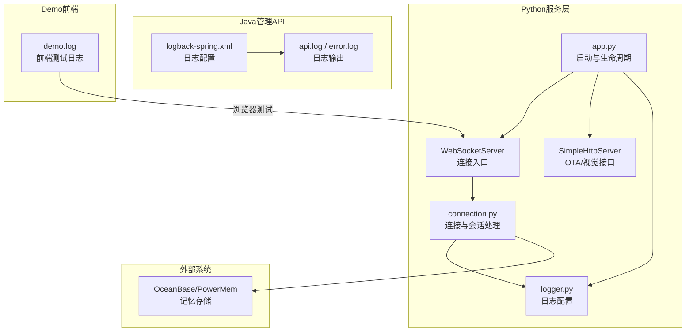
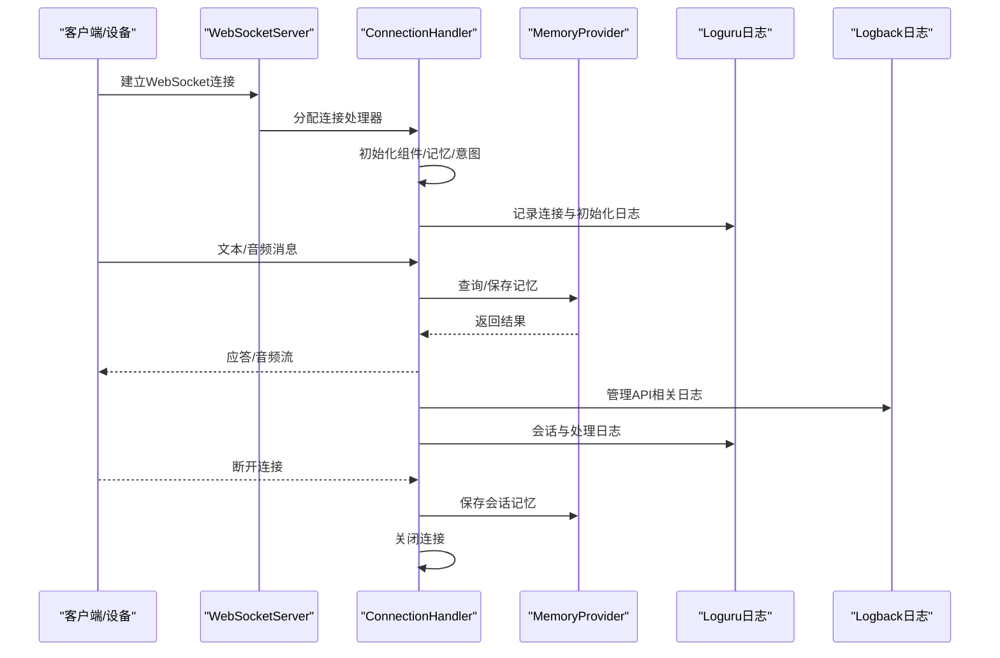
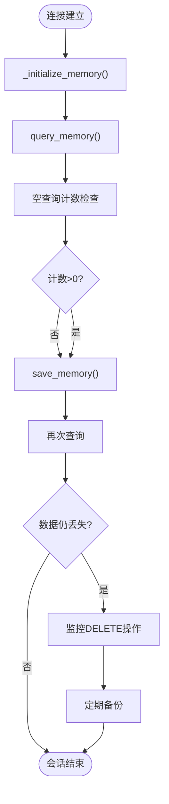
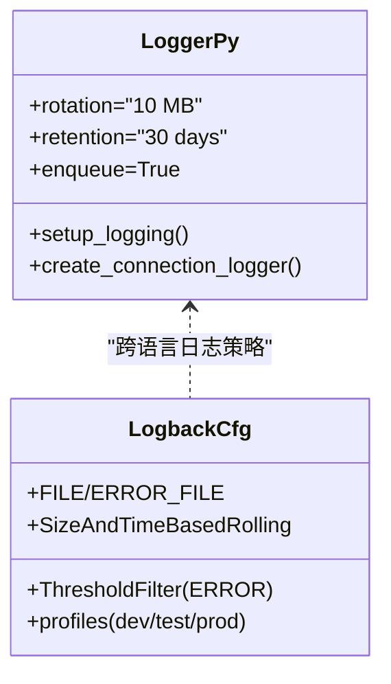
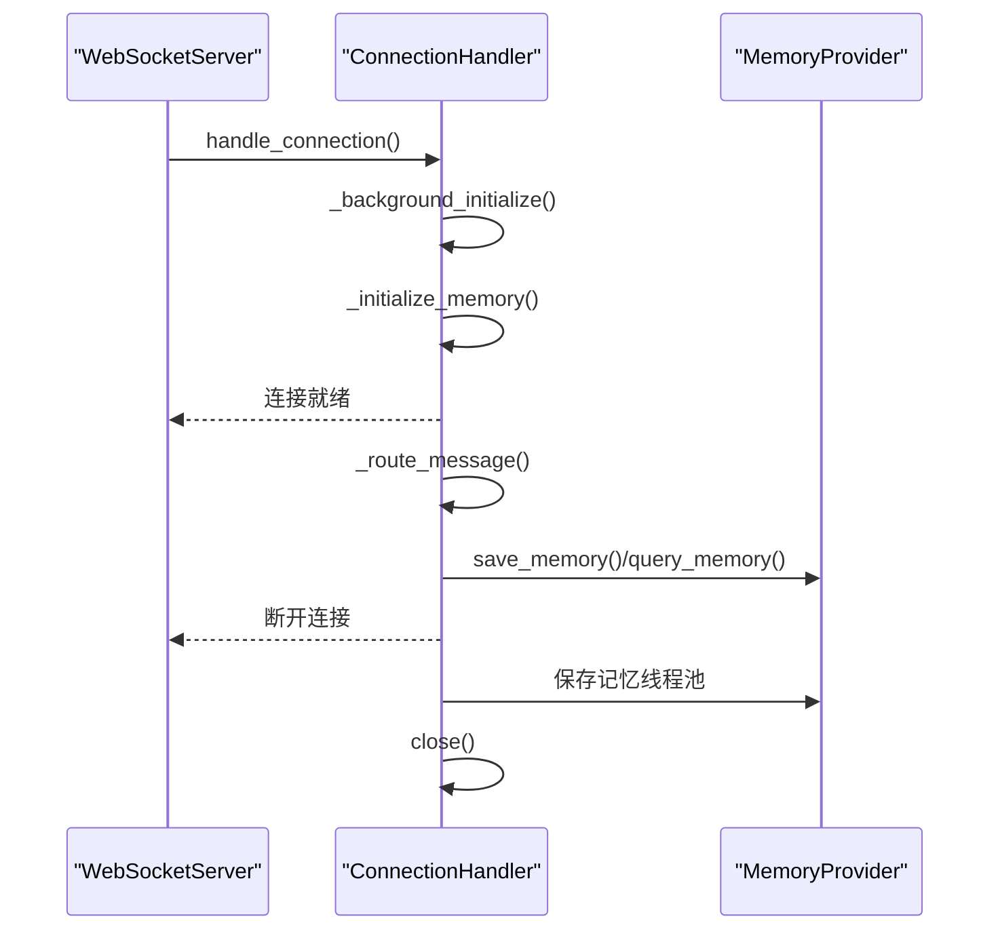
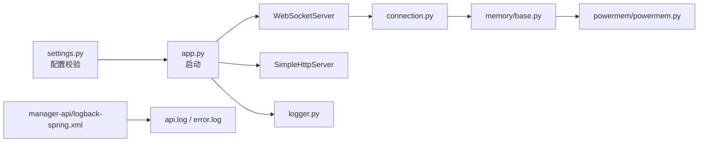

# 故障排查

<cite>
**本文引用的文件**
- [README.md](file://README.md)
- [001-critical-memories-data-loss.md](file://main/xiaozhi-server/docs/issues/001-critical-memories-data-loss.md)
- [002-memory-loss-root-cause-20260506.md](file://main/xiaozhi-server/docs/issues/002-memory-loss-root-cause-20260506.md)
- [logger.py](file://main/xiaozhi-server/config/logger.py)
- [logback-spring.xml](file://main/manager-api/src/main/resources/logback-spring.xml)
- [connection.py](file://main/xiaozhi-server/core/connection.py)
- [app.py](file://main/xiaozhi-server/app.py)
- [settings.py](file://main/xiaozhi-server/config/settings.py)
- [base.py](file://main/xiaozhi-server/core/providers/memory/base.py)
- [powermem.py](file://main/xiaozhi-server/core/providers/memory/powermem/powermem.py)
- [demo.log](file://main/demo-web/logs/demo.log)
- [api.log](file://main/manager-api/logs/api.log)
- [error.log](file://main/manager-api/logs/error.log)
- [app.log](file://logs/app.log)
</cite>

## 目录
1. [简介](#简介)
2. [项目结构](#项目结构)
3. [核心组件](#核心组件)
4. [架构总览](#架构总览)
5. [详细组件分析](#详细组件分析)
6. [依赖关系分析](#依赖关系分析)
7. [性能考量](#性能考量)
8. [故障排查指南](#故障排查指南)
9. [结论](#结论)
10. [附录](#附录)

## 简介
本文件面向小智ESP32服务器的运维与开发人员，提供系统化的故障排查手册。重点覆盖以下方面：
- 常见问题诊断方法与根因定位技巧
- 内存丢失问题（memories表数据异常）、服务启动失败、网络连接异常的排查流程
- 日志级别设置、日志收集与分析方法
- 设备连接问题、语音识别失败、TTS合成异常的解决方案
- 系统崩溃恢复、数据备份与紧急修复程序
- 故障预防、监控告警与应急预案

## 项目结构
小智后端由三部分组成：
- Python服务层（xiaozhi-server）：负责WebSocket/HTTP服务、模块编排、记忆与工具链集成
- Java管理API（manager-api）：提供Web管理界面与后端接口
- Demo前端（demo-web）：用于本地联调与音频交互测试

**图表来源**
- [app.py:46-131](file://main/xiaozhi-server/app.py#L46-L131)
- [connection.py:193-264](file://main/xiaozhi-server/core/connection.py#L193-L264)
- [logger.py:48-109](file://main/xiaozhi-server/config/logger.py#L48-L109)
- [logback-spring.xml:29-60](file://main/manager-api/src/main/resources/logback-spring.xml#L29-L60)
- [demo.log:1-50](file://main/demo-web/logs/demo.log#L1-L50)

**章节来源**
- [README.md:178-233](file://README.md#L178-L233)
- [app.py:46-131](file://main/xiaozhi-server/app.py#L46-L131)

## 核心组件
- 日志系统：Python侧使用Loguru，Java侧使用Logback；两者均支持按级别滚动输出与阈值过滤
- 连接与会话：WebSocket连接建立、握手、消息路由、超时与关闭流程
- 记忆系统：PowerMem集成与查询/保存流程，包含异常波动与数据丢失风险
- 配置与启动：从配置文件加载、校验与服务启动，包含退出信号与资源回收

**章节来源**
- [logger.py:48-109](file://main/xiaozhi-server/config/logger.py#L48-L109)
- [logback-spring.xml:29-60](file://main/manager-api/src/main/resources/logback-spring.xml#L29-L60)
- [connection.py:193-264](file://main/xiaozhi-server/core/connection.py#L193-L264)
- [powermem.py:1-120](file://main/xiaozhi-server/core/providers/memory/powermem/powermem.py#L1-L120)
- [app.py:46-131](file://main/xiaozhi-server/app.py#L46-L131)

## 架构总览

**图表来源**
- [connection.py:193-264](file://main/xiaozhi-server/core/connection.py#L193-L264)
- [connection.py:265-328](file://main/xiaozhi-server/core/connection.py#L265-L328)
- [logger.py:48-109](file://main/xiaozhi-server/config/logger.py#L48-L109)
- [logback-spring.xml:29-60](file://main/manager-api/src/main/resources/logback-spring.xml#L29-L60)

## 详细组件分析

### 记忆系统与PowerMem数据丢失问题
- 问题特征：隔天启动后首次连接即发生memories表数据丢失，user_profiles数据正常
- 关键线索：空查询计数不可靠、查询结果在短时间内波动、疑似SDK内部清理或会话相关逻辑
- 已采取措施：在关键路径添加CRITICAL级别日志，监控DELETE操作，启用数据库慢查询日志
- 临时方案：定期备份记忆、临时屏蔽DELETE操作

**图表来源**
- [001-critical-memories-data-loss.md:113-140](file://main/xiaozhi-server/docs/issues/001-critical-memories-data-loss.md#L113-L140)
- [002-memory-loss-root-cause-20260506.md:183-192](file://main/xiaozhi-server/docs/issues/002-memory-loss-root-cause-20260506.md#L183-L192)

**章节来源**
- [001-critical-memories-data-loss.md:1-348](file://main/xiaozhi-server/docs/issues/001-critical-memories-data-loss.md#L1-L348)
- [002-memory-loss-root-cause-20260506.md:1-275](file://main/xiaozhi-server/docs/issues/002-memory-loss-root-cause-20260506.md#L1-L275)
- [powermem.py:1-120](file://main/xiaozhi-server/core/providers/memory/powermem/powermem.py#L1-L120)
- [base.py:16-28](file://main/xiaozhi-server/core/providers/memory/base.py#L16-L28)

### 日志系统与级别设置
- Python侧（Loguru）：支持控制台与文件输出、按大小轮转、异步安全、回溯与诊断信息
- Java侧（Logback）：按环境区分日志级别，错误日志单独文件输出，支持按日期与大小轮转
- 建议：生产环境统一ERROR及以上级别，必要时临时提升至DEBUG/TRACE定位问题

**图表来源**
- [logger.py:48-109](file://main/xiaozhi-server/config/logger.py#L48-L109)
- [logback-spring.xml:29-60](file://main/manager-api/src/main/resources/logback-spring.xml#L29-L60)

**章节来源**
- [logger.py:48-109](file://main/xiaozhi-server/config/logger.py#L48-L109)
- [logback-spring.xml:29-60](file://main/manager-api/src/main/resources/logback-spring.xml#L29-L60)

### 连接与会话处理
- 连接建立：解析头信息、认证、超时任务、后台初始化
- 消息路由：文本与音频分流、MQTT网关音频包解析、乱序包缓冲
- 会话关闭：生成会话标题、异步保存记忆、线程池等待与超时保护、最终关闭

**图表来源**
- [connection.py:193-264](file://main/xiaozhi-server/core/connection.py#L193-L264)
- [connection.py:265-328](file://main/xiaozhi-server/core/connection.py#L265-L328)

**章节来源**
- [connection.py:193-264](file://main/xiaozhi-server/core/connection.py#L193-L264)
- [connection.py:265-328](file://main/xiaozhi-server/core/connection.py#L265-L328)

### 服务启动与退出
- 启动：检查FFmpeg、加载配置、初始化GC管理器、启动WS/HTTP服务、打印服务地址
- 退出：捕获SIGINT/SIGTERM，取消任务并等待，停止GC管理器

**章节来源**
- [app.py:46-131](file://main/xiaozhi-server/app.py#L46-L131)

## 依赖关系分析
- Python服务依赖配置加载、日志、WebSocket/HTTP服务器、模块初始化与工具链
- 记忆系统依赖PowerMem SDK与OceanBase存储
- 管理API依赖Logback配置与日志文件输出

**图表来源**
- [settings.py:9-33](file://main/xiaozhi-server/config/settings.py#L9-L33)
- [app.py:46-131](file://main/xiaozhi-server/app.py#L46-L131)
- [connection.py:193-264](file://main/xiaozhi-server/core/connection.py#L193-L264)
- [base.py:1-29](file://main/xiaozhi-server/core/providers/memory/base.py#L1-L29)
- [powermem.py:1-120](file://main/xiaozhi-server/core/providers/memory/powermem/powermem.py#L1-L120)
- [logger.py:48-109](file://main/xiaozhi-server/config/logger.py#L48-L109)
- [logback-spring.xml:29-60](file://main/manager-api/src/main/resources/logback-spring.xml#L29-L60)

**章节来源**
- [settings.py:9-33](file://main/xiaozhi-server/config/settings.py#L9-L33)
- [app.py:46-131](file://main/xiaozhi-server/app.py#L46-L131)
- [connection.py:193-264](file://main/xiaozhi-server/core/connection.py#L193-L264)
- [base.py:1-29](file://main/xiaozhi-server/core/providers/memory/base.py#L1-L29)
- [powermem.py:1-120](file://main/xiaozhi-server/core/providers/memory/powermem/powermem.py#L1-L120)
- [logger.py:48-109](file://main/xiaozhi-server/config/logger.py#L48-L109)
- [logback-spring.xml:29-60](file://main/manager-api/src/main/resources/logback-spring.xml#L29-L60)

## 性能考量
- 日志轮转与磁盘占用：建议监控日志目录空间，按需调整轮转大小与保留天数
- 记忆查询稳定性：避免使用空查询计数作为唯一依据，结合SQL COUNT或专用计数接口
- 连接超时与资源回收：合理设置超时时间，确保线程池与事件循环有序关闭

[本节为通用指导，无需列出“章节来源”]

## 故障排查指南

### 一、内存丢失问题（memories表）
- 快速确认
  - 隔天启动后首次连接即丢失，user_profiles正常
  - 查询结果在短时间内波动（如0→12→0）
- 根因定位
  - 排除临时表/内存表：确认表类型与引擎
  - 检查PowerMem SDK内部清理逻辑（retention_days、cleanup接口）
  - 排查UserMemory模式下的特殊行为与数量限制
- 诊断步骤
  - 在关键路径添加CRITICAL级别日志，监控DELETE操作
  - 启用数据库慢查询日志，审计memories表的所有操作
  - 使用SQL COUNT替代空查询计数，复现实验
- 临时方案
  - 定时备份memories表数据
  - 临时屏蔽DELETE操作，观察是否仍有丢失
- 长期修复
  - 修复查询计数逻辑，确保一致性
  - 明确SDK清理策略与配置项

**章节来源**
- [001-critical-memories-data-loss.md:1-348](file://main/xiaozhi-server/docs/issues/001-critical-memories-data-loss.md#L1-L348)
- [002-memory-loss-root-cause-20260506.md:1-275](file://main/xiaozhi-server/docs/issues/002-memory-loss-root-cause-20260506.md#L1-L275)

### 二、服务启动失败
- 检查点
  - 配置文件存在与格式正确（settings.py校验）
  - FFmpeg可用性（app.py启动前检查）
  - 端口占用与权限（WebSocket/HTTP端口）
  - 依赖模块初始化（日志、GC管理器）
- 诊断步骤
  - 查看Python日志（logs/app.log）与Java错误日志（manager-api/error.log）
  - 逐步注释模块初始化，定位失败点
  - 使用最小配置启动，确认问题是否与特定模块相关
- 修复建议
  - 修正配置文件路径与内容
  - 安装缺失依赖（FFmpeg、第三方SDK）
  - 调整端口与防火墙规则

**章节来源**
- [settings.py:9-33](file://main/xiaozhi-server/config/settings.py#L9-L33)
- [app.py:46-131](file://main/xiaozhi-server/app.py#L46-L131)
- [logger.py:48-109](file://main/xiaozhi-server/config/logger.py#L48-L109)
- [logback-spring.xml:29-60](file://main/manager-api/src/main/resources/logback-spring.xml#L29-L60)

### 三、网络连接异常
- 常见现象
  - 连接建立后立即断开
  - 握手阶段报错或超时
  - MQTT网关音频包解析失败
- 诊断步骤
  - 检查客户端IP与头信息（connection.py中记录）
  - 查看WebSocket/HTTP日志，定位异常点
  - 验证MCP接入点格式（app.py中校验）
  - 检查防火墙与代理设置
- 修复建议
  - 修正MCP接入点地址格式
  - 调整超时参数与缓冲策略
  - 优化MQTT网关头部解析与乱序包处理

**章节来源**
- [connection.py:193-264](file://main/xiaozhi-server/core/connection.py#L193-L264)
- [connection.py:375-406](file://main/xiaozhi-server/core/connection.py#L375-L406)
- [app.py:98-110](file://main/xiaozhi-server/app.py#L98-L110)

### 四、设备连接问题
- 症状
  - 需要绑定验证码、绑定提示频繁播放
  - 从MQTT网关连接时音频乱序
- 诊断步骤
  - 检查bind_completed_event状态与提示间隔
  - 查看MQTT音频包解析与时间戳缓冲
  - 确认设备ID与客户端ID来源
- 修复建议
  - 优化绑定流程与提示频率
  - 调整音频时间戳缓冲阈值
  - 统一设备标识与鉴权头

**章节来源**
- [connection.py:329-356](file://main/xiaozhi-server/core/connection.py#L329-L356)
- [connection.py:375-406](file://main/xiaozhi-server/core/connection.py#L375-L406)
- [connection.py:680-708](file://main/xiaozhi-server/core/connection.py#L680-L708)

### 五、语音识别（ASR）失败
- 症状
  - 识别结果为空或不稳定
  - 本地ASR与远程ASR混用导致状态不一致
- 诊断步骤
  - 检查ASR初始化与接口类型（LOCAL/REMOTE）
  - 查看音频队列与通道开启状态
  - 对比不同ASR提供商的响应
- 修复建议
  - 明确本地/远程ASR的实例化策略
  - 统一音频通道与队列处理
  - 为不同ASR设置独立配置与降级策略

**章节来源**
- [connection.py:635-650](file://main/xiaozhi-server/core/connection.py#L635-L650)
- [connection.py:514-524](file://main/xiaozhi-server/core/connection.py#L514-L524)

### 六、TTS合成异常
- 症状
  - 合成无文本返回、音频播放异常
  - TTS通道未正确开启
- 诊断步骤
  - 检查TTS初始化与默认TTS回退
  - 查看音频通道开启与发送流程
  - 对比不同TTS提供商的流式/非流式差异
- 修复建议
  - 确保TTS通道在连接建立后及时开启
  - 为无文本场景提供兜底回复
  - 优化流式TTS的断流与重连

**章节来源**
- [connection.py:624-633](file://main/xiaozhi-server/core/connection.py#L624-L633)
- [connection.py:487-501](file://main/xiaozhi-server/core/connection.py#L487-L501)

### 七、日志级别设置与收集
- Python（Loguru）
  - 控制台与文件输出、按大小轮转、异步安全
  - 建议：生产环境ERROR，调试时INFO/DEBUG
- Java（Logback）
  - 错误日志单独文件输出，按日期与大小轮转
  - 建议：dev/test/INFO，prod/INFO+ERROR_FILE
- 收集与分析
  - 使用tail -f与grep筛选关键日志
  - 结合时间线与会话ID定位问题
  - 对比Python与Java日志，确认跨语言调用链

**章节来源**
- [logger.py:48-109](file://main/xiaozhi-server/config/logger.py#L48-L109)
- [logback-spring.xml:29-60](file://main/manager-api/src/main/resources/logback-spring.xml#L29-L60)
- [001-critical-memories-data-loss.md:137-140](file://main/xiaozhi-server/docs/issues/001-critical-memories-data-loss.md#L137-L140)

### 八、系统崩溃恢复与紧急修复
- 崩溃恢复
  - 使用守护进程或容器编排自动拉起
  - 启动时检查关键依赖（FFmpeg、数据库）
- 紧急修复
  - 临时屏蔽高风险模块（如DELETE记忆）
  - 降低日志级别以减少IO压力
  - 回滚最近变更的配置或SDK版本
- 数据备份
  - 定时导出memories表
  - 备份配置文件与日志目录

**章节来源**
- [app.py:132-152](file://main/xiaozhi-server/app.py#L132-L152)
- [002-memory-loss-root-cause-20260506.md:215-241](file://main/xiaozhi-server/docs/issues/002-memory-loss-root-cause-20260506.md#L215-L241)

### 九、故障预防、监控告警与应急预案
- 预防
  - 配置健康检查与存活探针
  - 限制日志体积与保留周期，避免磁盘占满
  - 对关键模块（记忆、ASR、TTS）设置降级策略
- 监控
  - 监控连接数、会话时长、错误率
  - 监控日志ERROR数量与趋势
- 告警
  - 配置阈值告警（如ERROR突增、连接失败率）
  - 建立跨语言日志聚合与检索
- 应急预案
  - 快速回滚与切换备用节点
  - 临时关闭高风险功能（如DELETE记忆）
  - 启动人工接管流程

[本节为通用指导，无需列出“章节来源”]

## 结论
本故障排查文档围绕小智ESP32服务器的核心模块与典型问题，给出了系统化的诊断思路、日志分析方法与修复建议。针对记忆丢失、服务启动、网络连接与语音模块异常，建议优先通过日志与最小复现实验定位根因，并结合临时方案保障业务连续性，最终完成长期修复与预防。

[本节为总结性内容，无需列出“章节来源”]

## 附录

### A. 常用日志文件与位置
- Python应用日志：logs/app.log
- 管理API日志：manager-api/logs/xiaozhi-esp32-api.log、manager-api/logs/error.log
- Demo前端日志：demo-web/logs/demo.log

**章节来源**
- [app.log:1-50](file://logs/app.log#L1-L50)
- [api.log:1-50](file://main/manager-api/logs/api.log#L1-L50)
- [error.log:1-50](file://main/manager-api/logs/error.log#L1-L50)
- [demo.log:1-50](file://main/demo-web/logs/demo.log#L1-L50)

### B. 关键配置与启动要点
- 配置文件校验：settings.py
- 服务启动：app.py
- 日志配置：logger.py、logback-spring.xml
- 连接处理：connection.py

**章节来源**
- [settings.py:9-33](file://main/xiaozhi-server/config/settings.py#L9-L33)
- [app.py:46-131](file://main/xiaozhi-server/app.py#L46-L131)
- [logger.py:48-109](file://main/xiaozhi-server/config/logger.py#L48-L109)
- [logback-spring.xml:29-60](file://main/manager-api/src/main/resources/logback-spring.xml#L29-L60)
- [connection.py:193-264](file://main/xiaozhi-server/core/connection.py#L193-L264)