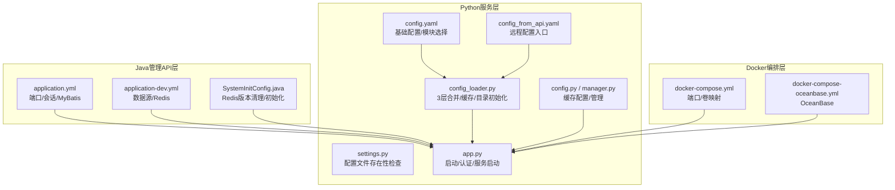
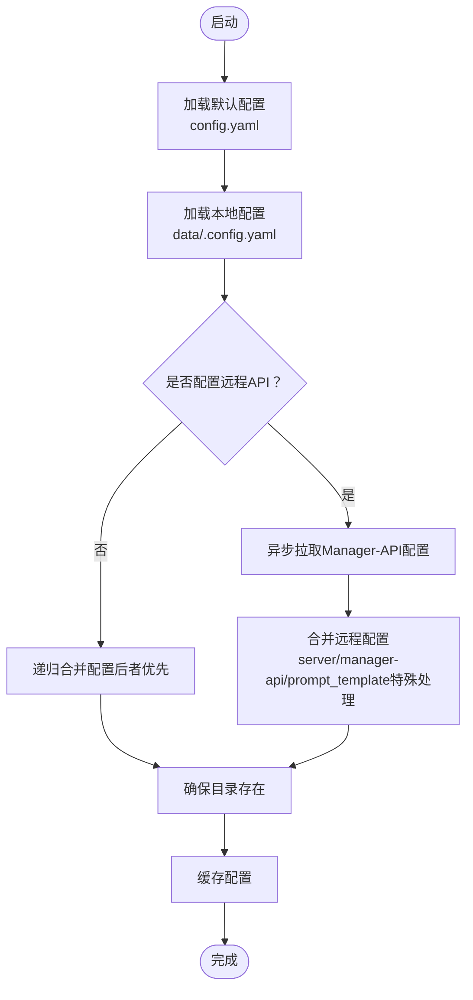
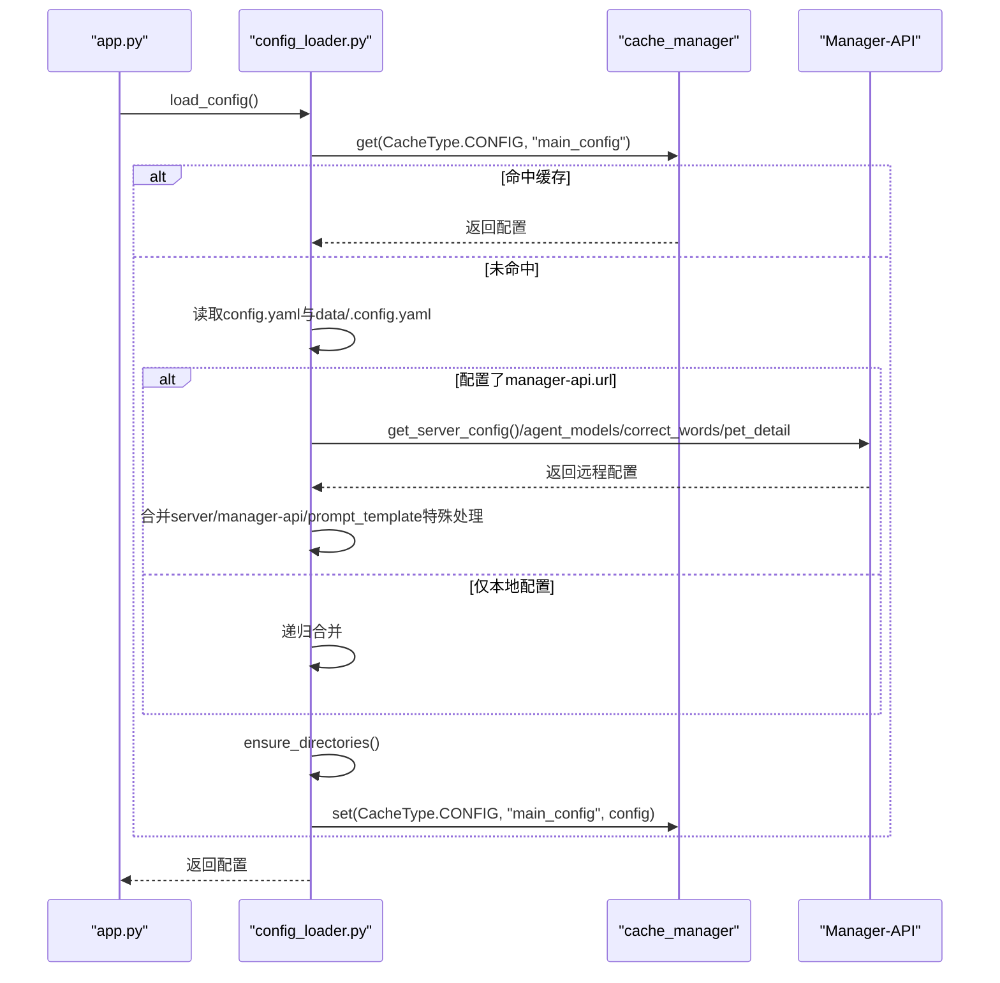
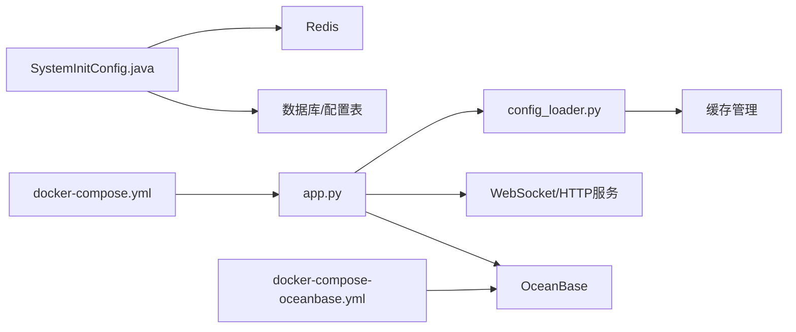

# 环境配置

<cite>
**本文引用的文件**
- [application.yml](file://main/manager-api/src/main/resources/application.yml)
- [application-dev.yml](file://main/manager-api/src/main/resources/application-dev.yml)
- [settings.py](file://main/xiaozhi-server/config/settings.py)
- [config_loader.py](file://main/xiaozhi-server/config/config_loader.py)
- [config.yaml](file://main/xiaozhi-server/config.yaml)
- [config_from_api.yaml](file://main/xiaozhi-server/config_from_api.yaml)
- [app.py](file://main/xiaozhi-server/app.py)
- [docker-compose.yml](file://main/xiaozhi-server/docker-compose.yml)
- [docker-compose-oceanbase.yml](file://main/xiaozhi-server/docker-compose-oceanbase.yml)
- [config.py](file://main/xiaozhi-server/core/utils/cache/config.py)
- [manager.py](file://main/xiaozhi-server/core/utils/cache/manager.py)
- [SystemInitConfig.java](file://main/manager-api/src/main/java/xiaozhi/modules/config/init/SystemInitConfig.java)
- [oceanbase-connection-guide.md](file://main/xiaozhi-server/docs/guides/oceanbase-connection-guide.md)
- [Memory_System_Architecture_Blueprint.md](file://main/xiaozhi-server/docs/architecture/Memory_System_Architecture_Blueprint.md)
</cite>

## 目录
1. [简介](#简介)
2. [项目结构](#项目结构)
3. [核心组件](#核心组件)
4. [架构总览](#架构总览)
5. [详细组件分析](#详细组件分析)
6. [依赖关系分析](#依赖关系分析)
7. [性能考虑](#性能考虑)
8. [故障排查指南](#故障排查指南)
9. [结论](#结论)
10. [附录](#附录)

## 简介
本文件面向小智ESP32服务器的运维与开发者，提供一套完整的环境配置说明。内容涵盖：
- 核心配置文件结构、参数含义与默认值
- 数据库连接配置（含OceanBase）、Redis缓存设置与第三方服务集成参数
- 环境变量管理、配置文件优先级与动态配置更新机制
- 生产与开发环境差异、安全配置最佳实践与性能优化参数
- 配置验证方法、常见错误与解决方案
- 配置热更新、备份与灾难恢复策略

## 项目结构
小智ESP32服务器由三层配置与运行体系构成：
- Java管理API层（Spring Boot）：负责系统参数、Redis、Knife4j等配置
- Python服务层（xiaozhi-server）：负责核心业务逻辑、模块选择、第三方服务集成与配置加载
- Docker编排层：负责容器化部署、端口映射与持久化卷

**图表来源**
- [application.yml:1-66](file://main/manager-api/src/main/resources/application.yml#L1-L66)
- [application-dev.yml:1-51](file://main/manager-api/src/main/resources/application-dev.yml#L1-L51)
- [SystemInitConfig.java:1-41](file://main/manager-api/src/main/java/xiaozhi/modules/config/init/SystemInitConfig.java#L1-L41)
- [config.yaml:1-120](file://main/xiaozhi-server/config.yaml#L1-L120)
- [config_from_api.yaml:1-27](file://main/xiaozhi-server/config_from_api.yaml#L1-L27)
- [config_loader.py:1-193](file://main/xiaozhi-server/config/config_loader.py#L1-L193)
- [settings.py:1-34](file://main/xiaozhi-server/config/settings.py#L1-L34)
- [app.py:1-160](file://main/xiaozhi-server/app.py#L1-L160)
- [config.py:1-66](file://main/xiaozhi-server/core/utils/cache/config.py#L1-L66)
- [manager.py:40-73](file://main/xiaozhi-server/core/utils/cache/manager.py#L40-L73)
- [docker-compose.yml:1-22](file://main/xiaozhi-server/docker-compose.yml#L1-L22)
- [docker-compose-oceanbase.yml:1-36](file://main/xiaozhi-server/docker-compose-oceanbase.yml#L1-L36)

**章节来源**
- [application.yml:1-66](file://main/manager-api/src/main/resources/application.yml#L1-L66)
- [application-dev.yml:1-51](file://main/manager-api/src/main/resources/application-dev.yml#L1-L51)
- [config.yaml:1-120](file://main/xiaozhi-server/config.yaml#L1-L120)
- [config_from_api.yaml:1-27](file://main/xiaozhi-server/config_from_api.yaml#L1-L27)
- [config_loader.py:1-193](file://main/xiaozhi-server/config/config_loader.py#L1-L193)
- [settings.py:1-34](file://main/xiaozhi-server/config/settings.py#L1-L34)
- [app.py:1-160](file://main/xiaozhi-server/app.py#L1-L160)
- [config.py:1-66](file://main/xiaozhi-server/core/utils/cache/config.py#L1-L66)
- [manager.py:40-73](file://main/xiaozhi-server/core/utils/cache/manager.py#L40-L73)
- [docker-compose.yml:1-22](file://main/xiaozhi-server/docker-compose.yml#L1-L22)
- [docker-compose-oceanbase.yml:1-36](file://main/xiaozhi-server/docker-compose-oceanbase.yml#L1-L36)

## 核心组件
- Java管理API配置
  - 服务器端口、Tomcat线程池、会话Cookie安全、国际化、文件上传大小、MyBatis配置、Knife4j开关与Basic认证
  - 开发环境配置包含Druid数据源、Stat/Wall过滤器、Redis连接参数
- Python服务配置
  - 服务器监听地址/端口、HTTP端口、WebSocket地址、视觉分析接口地址、时区偏移、认证开关与白名单、MQTT/UDP网关、日志路径与级别、模块选择与第三方服务密钥
  - 远程配置入口（Manager-API）与本地配置合并策略
- 缓存与目录
  - 缓存类型与TTL策略、LRU/LRU-TTL等策略配置
  - 启动时按配置创建日志、ASR/TTS输出目录与模型目录
- Docker编排
  - 端口映射（WebSocket 8000、HTTP 8003）、时区环境变量、数据卷映射、OceanBase容器与网络

**章节来源**
- [application.yml:1-66](file://main/manager-api/src/main/resources/application.yml#L1-L66)
- [application-dev.yml:1-51](file://main/manager-api/src/main/resources/application-dev.yml#L1-L51)
- [config.yaml:1-120](file://main/xiaozhi-server/config.yaml#L1-L120)
- [config_from_api.yaml:1-27](file://main/xiaozhi-server/config_from_api.yaml#L1-L27)
- [config_loader.py:123-193](file://main/xiaozhi-server/config/config_loader.py#L123-L193)
- [config.py:1-66](file://main/xiaozhi-server/core/utils/cache/config.py#L1-L66)
- [docker-compose.yml:1-22](file://main/xiaozhi-server/docker-compose.yml#L1-L22)

## 架构总览
小智ESP32服务器的配置体系采用“三层合并 + 远程拉取”的设计，确保灵活性与安全性。

**图表来源**
- [config_loader.py:27-94](file://main/xiaozhi-server/config/config_loader.py#L27-L94)
- [config_loader.py:164-193](file://main/xiaozhi-server/config/config_loader.py#L164-L193)
- [config_loader.py:123-162](file://main/xiaozhi-server/config/config_loader.py#L123-L162)
- [config.yaml:1-120](file://main/xiaozhi-server/config.yaml#L1-L120)
- [config_from_api.yaml:1-27](file://main/xiaozhi-server/config_from_api.yaml#L1-L27)

**章节来源**
- [config_loader.py:27-94](file://main/xiaozhi-server/config/config_loader.py#L27-L94)
- [config_loader.py:123-193](file://main/xiaozhi-server/config/config_loader.py#L123-L193)
- [config.yaml:1-120](file://main/xiaozhi-server/config.yaml#L1-L120)
- [config_from_api.yaml:1-27](file://main/xiaozhi-server/config_from_api.yaml#L1-L27)

## 详细组件分析

### Java管理API配置（Spring Boot）
- 服务器与会话
  - 端口、URI编码、Tomcat线程池上限与最小空闲线程
  - Servlet上下文路径、Session Cookie HttpOnly
- 国际化与文件上传
  - 消息编码、i18n基础名、multipart大小与启用
- MyBatis Plus
  - Mapper位置、实体别名包、ID策略、驼峰映射、缓存禁用、空值JDBC类型
- Knife4j
  - 开关、Basic认证用户名/密码、页脚
- 安全与Redis
  - RenRen Redis开关、XSS开关与排除URL

**章节来源**
- [application.yml:1-66](file://main/manager-api/src/main/resources/application.yml#L1-L66)

### 开发环境数据库与Redis配置
- Druid数据源
  - 驱动、URL、用户名/密码、初始/最大/最小连接数、最大预处理、空闲回收、慢SQL统计
- Redis
  - Host/Port/密码/数据库/超时、Lettuce连接池大小与优雅关闭超时

**章节来源**
- [application-dev.yml:1-51](file://main/manager-api/src/main/resources/application-dev.yml#L1-L51)

### Python服务配置（xiaozhi-server）
- 服务器与接口
  - 监听IP/端口、HTTP端口、WebSocket地址、视觉分析接口地址、时区偏移、认证开关与白名单
- 日志
  - 控制台/文件日志格式、级别、目录与文件名、数据目录
- 行为参数
  - 删除音频、无语音断连时间、TTS/工具调用超时、唤醒词响应缓存、问候与提示音
- 音频参数
  - Opus格式、采样率、声道、帧时长
- 模块与插件
  - selected_module（VAD/ASR/LLM/TTS/Intent/Memory）、Intent配置、Memory配置（mem0ai/powermem/nomem/mem_local_short）
  - 插件：天气、新闻、Home Assistant、音乐播放、RAGFlow、声纹
- 第三方服务密钥
  - MCP接入点、Context Providers、各ASR/LLM/TTS提供商的API Key/Base URL/AppID/Token等
- 本地配置入口
  - data/.config.yaml用于覆盖默认配置，避免将敏感信息提交至版本库

**章节来源**
- [config.yaml:1-120](file://main/xiaozhi-server/config.yaml#L1-L120)
- [config.yaml:120-350](file://main/xiaozhi-server/config.yaml#L120-L350)
- [config.yaml:350-750](file://main/xiaozhi-server/config.yaml#L350-L750)
- [config.yaml:750-1198](file://main/xiaozhi-server/config.yaml#L750-L1198)

### 远程配置与合并策略
- 远程配置入口
  - config_from_api.yaml定义Manager-API地址与secret，复制到data/.config.yaml后生效
- 配置加载流程
  - 读取默认config.yaml与data/.config.yaml，若存在manager-api.url则异步拉取远程配置
  - 服务器配置以本地为准（server.ip/port/http_port/vision_explain/auth_key）
  - prompt_template缺失时回退到本地
- 目录初始化
  - 自动创建日志、ASR/TTS输出目录、模型目录（按selected_module）

**图表来源**
- [app.py:46-70](file://main/xiaozhi-server/app.py#L46-L70)
- [config_loader.py:27-94](file://main/xiaozhi-server/config/config_loader.py#L27-L94)
- [config_loader.py:164-193](file://main/xiaozhi-server/config/config_loader.py#L164-L193)
- [config_loader.py:123-162](file://main/xiaozhi-server/config/config_loader.py#L123-L162)

**章节来源**
- [config_from_api.yaml:1-27](file://main/xiaozhi-server/config_from_api.yaml#L1-L27)
- [config_loader.py:27-94](file://main/xiaozhi-server/config/config_loader.py#L27-L94)
- [config_loader.py:123-193](file://main/xiaozhi-server/config/config_loader.py#L123-L193)

### 配置验证与启动流程
- 配置文件存在性检查
  - 启动前检查data/.config.yaml是否存在，否则抛出异常
- 认证密钥生成与回退
  - 优先使用server.auth_key，其次使用manager-api.secret，最后自动生成UUID
- MCP接入点校验
  - 校验mcp_endpoint格式，修正为/call/调用点
- 服务启动
  - 启动WebSocket与HTTP（OTA/视觉分析）服务，打印对外地址

**章节来源**
- [settings.py:1-34](file://main/xiaozhi-server/config/settings.py#L1-L34)
- [app.py:46-130](file://main/xiaozhi-server/app.py#L46-L130)

### 缓存配置与目录初始化
- 缓存类型与策略
  - TTL、LRU、TTL_LRU、固定大小等策略，针对不同缓存类型设置TTL与容量
- 目录初始化
  - 自动创建日志目录、ASR/TTS输出目录、模型目录（按selected_module）

**章节来源**
- [config.py:1-66](file://main/xiaozhi-server/core/utils/cache/config.py#L1-L66)
- [manager.py:40-73](file://main/xiaozhi-server/core/utils/cache/manager.py#L40-L73)
- [config_loader.py:123-162](file://main/xiaozhi-server/config/config_loader.py#L123-L162)

### Docker编排与OceanBase
- 服务端口
  - WebSocket: 8000、HTTP(OTA/视觉分析): 8003
- 卷映射
  - data目录映射到/opt/xiaozhi-esp32-server/data
  - 模型文件挂载（示例：SenseVoiceSmall）
- OceanBase
  - 端口映射2881/2882、内存与磁盘参数、root密码、租户、健康检查、网络

**章节来源**
- [docker-compose.yml:1-22](file://main/xiaozhi-server/docker-compose.yml#L1-L22)
- [docker-compose-oceanbase.yml:1-36](file://main/xiaozhi-server/docker-compose-oceanbase.yml#L1-L36)

## 依赖关系分析
- Java管理API层
  - SystemInitConfig在容器启动后执行，检查Redis版本并清空旧数据，初始化server.secret与配置
- Python服务层
  - app.py在启动时加载配置、生成auth_key、启动服务
  - config_loader.py负责配置合并、缓存与目录初始化
- Docker编排层
  - 通过环境变量与卷映射提供时区与持久化

**图表来源**
- [SystemInitConfig.java:27-40](file://main/manager-api/src/main/java/xiaozhi/modules/config/init/SystemInitConfig.java#L27-L40)
- [app.py:46-130](file://main/xiaozhi-server/app.py#L46-L130)
- [config_loader.py:27-94](file://main/xiaozhi-server/config/config_loader.py#L27-L94)
- [docker-compose.yml:1-22](file://main/xiaozhi-server/docker-compose.yml#L1-L22)
- [docker-compose-oceanbase.yml:1-36](file://main/xiaozhi-server/docker-compose-oceanbase.yml#L1-L36)

**章节来源**
- [SystemInitConfig.java:1-41](file://main/manager-api/src/main/java/xiaozhi/modules/config/init/SystemInitConfig.java#L1-L41)
- [app.py:1-160](file://main/xiaozhi-server/app.py#L1-L160)
- [config_loader.py:1-193](file://main/xiaozhi-server/config/config_loader.py#L1-L193)
- [docker-compose.yml:1-22](file://main/xiaozhi-server/docker-compose.yml#L1-L22)
- [docker-compose-oceanbase.yml:1-36](file://main/xiaozhi-server/docker-compose-oceanbase.yml#L1-L36)

## 性能考虑
- 线程池与连接
  - Java层Tomcat线程池上限与最小空闲线程，Redis连接池大小与优雅关闭超时
- 缓存策略
  - 针对天气、农历、意图等设置不同TTL，降低重复请求压力
- 目录与I/O
  - 自动创建ASR/TTS输出目录，避免运行时I/O失败
- Docker资源
  - OceanBase内存与磁盘参数，合理分配以避免OOM

**章节来源**
- [application.yml:1-66](file://main/manager-api/src/main/resources/application.yml#L1-L66)
- [application-dev.yml:1-51](file://main/manager-api/src/main/resources/application-dev.yml#L1-L51)
- [config.py:1-66](file://main/xiaozhi-server/core/utils/cache/config.py#L1-L66)
- [config_loader.py:123-162](file://main/xiaozhi-server/config/config_loader.py#L123-L162)
- [docker-compose-oceanbase.yml:12-21](file://main/xiaozhi-server/docker-compose-oceanbase.yml#L12-L21)

## 故障排查指南
- 配置文件缺失
  - 现象：启动时报错提示找不到data/.config.yaml
  - 处理：按教程创建data目录并复制config_from_api.yaml为.data.yaml，填写manager-api.url与secret
- 远程配置冲突
  - 现象：同时包含智控台配置与本地配置
  - 处理：遵循提示将config_from_api.yaml复制到data并重命名为.config.yaml，按教程配置接口地址与密钥
- MCP接入点格式错误
  - 现象：日志提示mcp接入点不符合规范
  - 处理：确保mcp_endpoint为ws://.../mcp/...且符合规范，系统会自动转换为/call/调用点
- OceanBase连接失败
  - 现象：PowerMem初始化失败或连接超时
  - 处理：检查容器健康、端口映射、凭据与向量维度配置，参考OceanBase连接指南

**章节来源**
- [settings.py:1-34](file://main/xiaozhi-server/config/settings.py#L1-L34)
- [config_from_api.yaml:1-27](file://main/xiaozhi-server/config_from_api.yaml#L1-L27)
- [app.py:98-109](file://main/xiaozhi-server/app.py#L98-L109)
- [oceanbase-connection-guide.md:1-219](file://main/xiaozhi-server/docs/guides/oceanbase-connection-guide.md#L1-L219)

## 结论
小智ESP32服务器通过“默认配置 + 本地覆盖 + 远程拉取”的三层配置体系，实现了灵活部署与安全隔离。配合Docker编排与缓存策略，可在开发与生产环境中快速落地。建议在生产环境严格区分密钥与凭据，启用HTTPS与白名单认证，并定期备份data目录与OceanBase数据。

## 附录

### 配置优先级与差异对比
- 优先级
  - config.yaml（默认）< data/.config.yaml（本地覆盖）< Manager-API（远程配置）
- 开发 vs 生产
  - 开发：本地数据库（Druid）+ 本地Redis；生产：OceanBase + 远程Redis/数据库
  - 开发：Knife4j Basic认证；生产：建议关闭或使用强口令

**章节来源**
- [config.yaml:1-120](file://main/xiaozhi-server/config.yaml#L1-L120)
- [application-dev.yml:1-51](file://main/manager-api/src/main/resources/application-dev.yml#L1-L51)
- [application.yml:30-38](file://main/manager-api/src/main/resources/application.yml#L30-L38)

### 安全配置最佳实践
- 密钥管理
  - 将敏感信息置于data/.config.yaml，避免提交至版本库
  - 使用Manager-API生成并轮换server.secret
- 认证与授权
  - 启用server.auth.enabled与白名单设备
  - MCP接入点使用安全传输与令牌校验
- 网络与容器
  - 仅暴露必要端口，使用内网地址或反向代理
  - Docker时区统一为Asia/Shanghai

**章节来源**
- [config_from_api.yaml:1-27](file://main/xiaozhi-server/config_from_api.yaml#L1-L27)
- [config.yaml:30-41](file://main/xiaozhi-server/config.yaml#L30-L41)
- [docker-compose.yml:11-13](file://main/xiaozhi-server/docker-compose.yml#L11-L13)

### 动态配置更新与热更新
- 更新机制
  - 配置通过缓存管理器缓存，远程配置拉取后刷新缓存
  - 目录初始化在配置变更时重新执行
- 热更新建议
  - 通过Manager-API调整参数后，重启Python服务以确保配置生效
  - 对于OceanBase等外部依赖，变更后验证连接与维度一致性

**章节来源**
- [config_loader.py:27-94](file://main/xiaozhi-server/config/config_loader.py#L27-L94)
- [config_loader.py:123-162](file://main/xiaozhi-server/config/config_loader.py#L123-L162)
- [config.py:1-66](file://main/xiaozhi-server/core/utils/cache/config.py#L1-L66)

### 配置备份与灾难恢复
- 备份
  - data/.config.yaml与oceanbase/data目录定期备份
- 恢复
  - 重新部署后恢复备份，确保Manager-API密钥与数据库凭据一致
  - OceanBase初始化脚本可一键执行，确保表结构与权限

**章节来源**
- [docker-compose-oceanbase.yml:22-31](file://main/xiaozhi-server/docker-compose-oceanbase.yml#L22-L31)
- [oceanbase-connection-guide.md:73-96](file://main/xiaozhi-server/docs/guides/oceanbase-connection-guide.md#L73-L96)