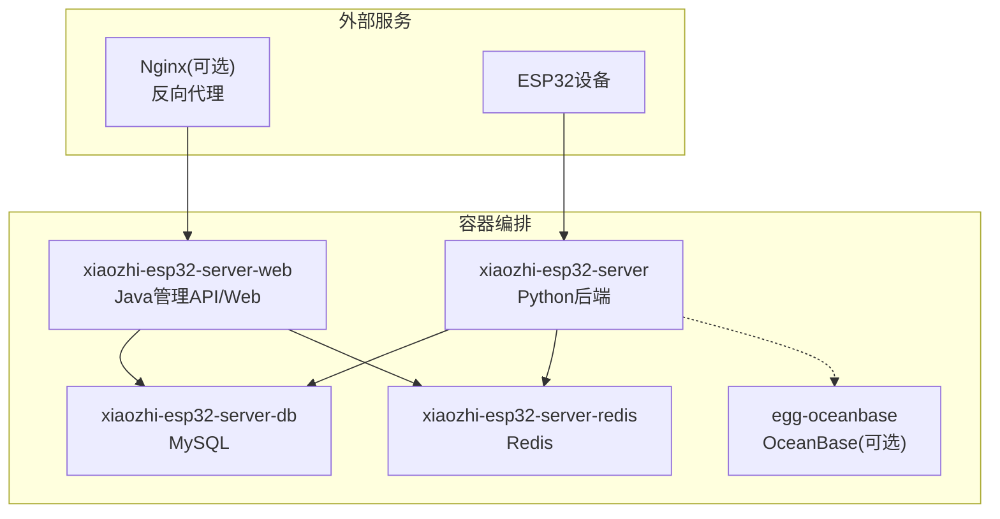
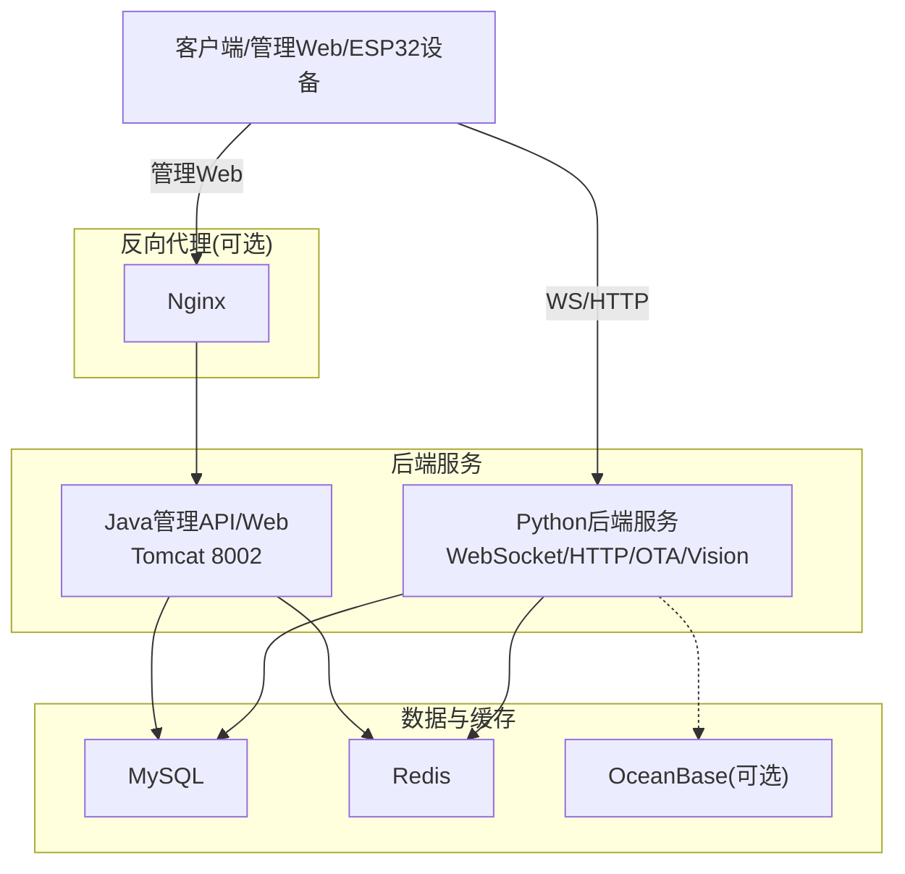
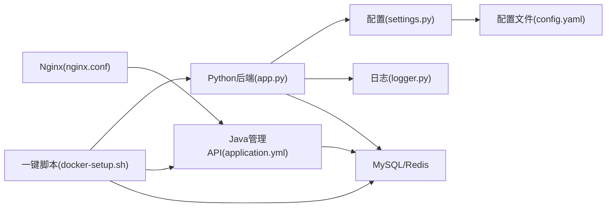

# 部署与运维

<cite>
**本文引用的文件**
- [README.md](file://README.md)
- [docker-setup.sh](file://docker-setup.sh)
- [docker-compose.yml](file://main/xiaozhi-server/docker-compose.yml)
- [docker-compose_all.yml](file://main/xiaozhi-server/docker-compose_all.yml)
- [docker-compose-oceanbase.yml](file://main/xiaozhi-server/docker-compose-oceanbase.yml)
- [nginx.conf](file://docs/docker/nginx.conf)
- [start.sh](file://docs/docker/start.sh)
- [application.yml](file://main/manager-api/src/main/resources/application.yml)
- [config_from_api.yaml](file://main/xiaozhi-server/config_from_api.yaml)
- [config.yaml](file://main/xiaozhi-server/config.yaml)
- [settings.py](file://main/xiaozhi-server/config/settings.py)
- [logger.py](file://main/xiaozhi-server/config/logger.py)
- [app.py](file://main/xiaozhi-server/app.py)
- [requirements.txt](file://main/xiaozhi-server/requirements.txt)
</cite>

## 目录
1. [简介](#简介)
2. [项目结构](#项目结构)
3. [核心组件](#核心组件)
4. [架构总览](#架构总览)
5. [详细组件分析](#详细组件分析)
6. [依赖关系分析](#依赖关系分析)
7. [性能考量](#性能考量)
8. [故障排查指南](#故障排查指南)
9. [结论](#结论)
10. [附录](#附录)

## 简介
本文件面向小智ESP32服务器的部署与运维，围绕Docker部署、容器编排、环境变量与配置管理、数据库与第三方服务集成、性能优化、监控与负载均衡、故障排查、备份恢复、安全加固与合规、CI/CD与自动化、运维监控与告警、应急响应等方面，提供系统化、可操作的指导。内容基于仓库现有文档与脚本，结合Python后端、Java管理API与Web、Nginx代理、MySQL/Redis/OceanBase等组件的实际配置进行梳理。

## 项目结构
- Python后端服务（WebSocket/HTTP/OTA/Vision）位于 main/xiaozhi-server，包含配置、日志、核心服务与模块适配层。
- Java管理API与Web位于 main/manager-api 与 main/manager-web，提供管理后台、用户与设备管理、参数配置等。
- Docker相关位于 docs/docker 与 main/xiaozhi-server 下的 docker-compose*.yml，提供单服务与全模块部署方案。
- 配置文件位于 main/xiaozhi-server/config 与 main/xiaozhi-server/data（运行时覆盖）。

图表来源
- [docker-compose_all.yml:1-93](file://main/xiaozhi-server/docker-compose_all.yml#L1-L93)
- [docker-compose-oceanbase.yml:1-36](file://main/xiaozhi-server/docker-compose-oceanbase.yml#L1-L36)
- [nginx.conf:1-53](file://docs/docker/nginx.conf#L1-L53)

章节来源
- [docker-compose.yml:1-22](file://main/xiaozhi-server/docker-compose.yml#L1-L22)
- [docker-compose_all.yml:1-93](file://main/xiaozhi-server/docker-compose_all.yml#L1-L93)
- [docker-compose-oceanbase.yml:1-36](file://main/xiaozhi-server/docker-compose-oceanbase.yml#L1-L36)

## 核心组件
- Python后端服务（WebSocket/HTTP/OTA/Vision）
  - 启动入口与生命周期管理：[app.py:46-160](file://main/xiaozhi-server/app.py#L46-L160)
  - 配置加载与校验：[settings.py:9-34](file://main/xiaozhi-server/config/settings.py#L9-L34)、[config.yaml:1-120](file://main/xiaozhi-server/config.yaml#L1-L120)
  - 日志系统：[logger.py:48-115](file://main/xiaozhi-server/config/logger.py#L48-L115)
  - 依赖与运行环境：[requirements.txt:1-43](file://main/xiaozhi-server/requirements.txt#L1-L43)
- Java管理API与Web
  - 应用端口与Spring配置：[application.yml:1-66](file://main/manager-api/src/main/resources/application.yml#L1-L66)
- Docker与编排
  - 单服务部署：[docker-compose.yml:1-22](file://main/xiaozhi-server/docker-compose.yml#L1-L22)
  - 全模块部署（含MySQL/Redis）：[docker-compose_all.yml:1-93](file://main/xiaozhi-server/docker-compose_all.yml#L1-L93)
  - OceanBase（PowerMem）：[docker-compose-oceanbase.yml:1-36](file://main/xiaozhi-server/docker-compose-oceanbase.yml#L1-L36)
  - Nginx反向代理（可选）：[nginx.conf:1-53](file://docs/docker/nginx.conf#L1-L53)
  - Web容器启动脚本（Java+NGINX）：[start.sh:1-13](file://docs/docker/start.sh#L1-L13)
- 一键部署脚本
  - [docker-setup.sh:1-414](file://docker-setup.sh#L1-L414)

章节来源
- [app.py:46-160](file://main/xiaozhi-server/app.py#L46-L160)
- [settings.py:9-34](file://main/xiaozhi-server/config/settings.py#L9-L34)
- [config.yaml:1-120](file://main/xiaozhi-server/config.yaml#L1-L120)
- [logger.py:48-115](file://main/xiaozhi-server/config/logger.py#L48-L115)
- [requirements.txt:1-43](file://main/xiaozhi-server/requirements.txt#L1-L43)
- [application.yml:1-66](file://main/manager-api/src/main/resources/application.yml#L1-L66)
- [docker-compose.yml:1-22](file://main/xiaozhi-server/docker-compose.yml#L1-L22)
- [docker-compose_all.yml:1-93](file://main/xiaozhi-server/docker-compose_all.yml#L1-L93)
- [docker-compose-oceanbase.yml:1-36](file://main/xiaozhi-server/docker-compose-oceanbase.yml#L1-L36)
- [nginx.conf:1-53](file://docs/docker/nginx.conf#L1-L53)
- [start.sh:1-13](file://docs/docker/start.sh#L1-L13)
- [docker-setup.sh:1-414](file://docker-setup.sh#L1-L414)

## 架构总览
小智后端由“Python后端服务”和“Java管理API/Web”组成，二者通过配置中心或直接通信。生产环境通常采用Docker Compose编排，包含数据库（MySQL）、缓存（Redis），可选OceanBase用于PowerMem记忆系统。Nginx可作为反向代理承载管理Web静态资源与转发后端请求。

图表来源
- [docker-compose_all.yml:1-93](file://main/xiaozhi-server/docker-compose_all.yml#L1-L93)
- [docker-compose-oceanbase.yml:1-36](file://main/xiaozhi-server/docker-compose-oceanbase.yml#L1-L36)
- [nginx.conf:1-53](file://docs/docker/nginx.conf#L1-L53)
- [application.yml:1-66](file://main/manager-api/src/main/resources/application.yml#L1-L66)

## 详细组件分析

### Docker部署与编排
- 单服务部署
  - 服务：Python后端容器映射WS/HTTP端口，挂载data与模型目录。
  - 关键点：TZ时区、安全配置、端口映射、卷挂载。
  - 参考：[docker-compose.yml:1-22](file://main/xiaozhi-server/docker-compose.yml#L1-L22)
- 全模块部署
  - 包含：Python后端、Java管理API/Web、MySQL、Redis；管理Web依赖数据库与缓存健康检查。
  - 关键点：环境变量（数据库URL/用户名/密码、Redis主机/端口/密码）、卷挂载、健康检查。
  - 参考：[docker-compose_all.yml:1-93](file://main/xiaozhi-server/docker-compose_all.yml#L1-L93)
- OceanBase（PowerMem）
  - 服务：oceanbase，端口映射与内存/磁盘配置，健康检查。
  - 参考：[docker-compose-oceanbase.yml:1-36](file://main/xiaozhi-server/docker-compose-oceanbase.yml#L1-L36)
- Nginx反向代理
  - 作用：静态资源、到管理API的反代、超时与gzip配置。
  - 参考：[nginx.conf:1-53](file://docs/docker/nginx.conf#L1-L53)
- Web容器启动脚本
  - Java后端监听8003，Nginx前台运行。
  - 参考：[start.sh:1-13](file://docs/docker/start.sh#L1-L13)

章节来源
- [docker-compose.yml:1-22](file://main/xiaozhi-server/docker-compose.yml#L1-L22)
- [docker-compose_all.yml:1-93](file://main/xiaozhi-server/docker-compose_all.yml#L1-L93)
- [docker-compose-oceanbase.yml:1-36](file://main/xiaozhi-server/docker-compose-oceanbase.yml#L1-L36)
- [nginx.conf:1-53](file://docs/docker/nginx.conf#L1-L53)
- [start.sh:1-13](file://docs/docker/start.sh#L1-L13)

### 环境变量与配置管理
- 管理API环境变量（全模块）
  - 数据库URL/用户名/密码、Redis主机/端口/密码。
  - 参考：[docker-compose_all.yml:47-52](file://main/xiaozhi-server/docker-compose_all.yml#L47-L52)
- Java应用配置（端口、会话、多语言、文件上传大小等）
  - 参考：[application.yml:1-66](file://main/manager-api/src/main/resources/application.yml#L1-L66)
- Python后端配置（WS/HTTP端口、鉴权、日志、模块选择、第三方密钥等）
  - 参考：[config.yaml:9-220](file://main/xiaozhi-server/config.yaml#L9-L220)
- 从管理API读取配置
  - 通过data/.config.yaml中的manager-api.url与secret同步后端配置。
  - 参考：[config_from_api.yaml:1-27](file://main/xiaozhi-server/config_from_api.yaml#L1-L27)
- 配置校验与加载
  - data/.config.yaml存在性检查、冲突检测（本地与从API配置不可同时存在）。
  - 参考：[settings.py:9-34](file://main/xiaozhi-server/config/settings.py#L9-L34)

章节来源
- [docker-compose_all.yml:47-52](file://main/xiaozhi-server/docker-compose_all.yml#L47-L52)
- [application.yml:1-66](file://main/manager-api/src/main/resources/application.yml#L1-L66)
- [config.yaml:9-220](file://main/xiaozhi-server/config.yaml#L9-L220)
- [config_from_api.yaml:1-27](file://main/xiaozhi-server/config_from_api.yaml#L1-L27)
- [settings.py:9-34](file://main/xiaozhi-server/config/settings.py#L9-L34)

### 数据库连接与第三方服务集成
- 数据库
  - MySQL：容器内初始化数据库与字符集，Root密码与数据库名。
  - 参考：[docker-compose_all.yml:57-77](file://main/xiaozhi-server/docker-compose_all.yml#L57-L77)
- 缓存
  - Redis：健康检查与端口暴露。
  - 参考：[docker-compose_all.yml:78-90](file://main/xiaozhi-server/docker-compose_all.yml#L78-L90)
- OceanBase（PowerMem）
  - 内存/数据/日志容量、Root密码、租户、健康检查。
  - 参考：[docker-compose-oceanbase.yml:12-29](file://main/xiaozhi-server/docker-compose-oceanbase.yml#L12-L29)
- 第三方服务（ASR/LLM/TTS/VAD/意图/记忆/知识库等）
  - 通过config.yaml中对应模块配置密钥与参数。
  - 参考：[config.yaml:343-800](file://main/xiaozhi-server/config.yaml#L343-L800)

章节来源
- [docker-compose_all.yml:57-90](file://main/xiaozhi-server/docker-compose_all.yml#L57-L90)
- [docker-compose-oceanbase.yml:12-29](file://main/xiaozhi-server/docker-compose-oceanbase.yml#L12-L29)
- [config.yaml:343-800](file://main/xiaozhi-server/config.yaml#L343-L800)

### 性能优化策略
- 模块选择与流式配置
  - 项目提供“入门全免费”与“流式配置”，流式配置可显著降低响应时延。
  - 参考：[README.md:203-222](file://README.md#L203-L222)
- Python后端
  - 日志轮转（10MB/30天）、异步事件循环、WebSocket心跳与音频发送延迟控制。
  - 参考：[logger.py:94-106](file://main/xiaozhi-server/config/logger.py#L94-L106)、[config.yaml:74-82](file://main/xiaozhi-server/config.yaml#L74-L82)
- Java管理API
  - Tomcat线程池、会话Cookie HttpOnly、文件上传大小限制。
  - 参考：[application.yml:2-26](file://main/manager-api/src/main/resources/application.yml#L2-L26)
- Docker与Nginx
  - gzip压缩、超时与连接数配置、静态资源缓存友好。
  - 参考：[nginx.conf:8-23](file://docs/docker/nginx.conf#L8-L23)

章节来源
- [README.md:203-222](file://README.md#L203-L222)
- [logger.py:94-106](file://main/xiaozhi-server/config/logger.py#L94-L106)
- [config.yaml:74-82](file://main/xiaozhi-server/config.yaml#L74-L82)
- [application.yml:2-26](file://main/manager-api/src/main/resources/application.yml#L2-L26)
- [nginx.conf:8-23](file://docs/docker/nginx.conf#L8-L23)

### 资源监控与负载均衡
- 监控建议
  - 容器资源：CPU/内存/IO（Docker stats/Prometheus Node Exporter）。
  - 应用指标：Java管理API端点、Python后端WS/HTTP吞吐与延迟。
  - 日志聚合：集中化日志收集与检索（ELK/Fluentd/Loki）。
- 负载均衡
  - 外部：Nginx/HAProxy/云LB，按WS/HTTP/管理Web分流。
  - 内部：多实例部署（需独立配置与共享存储/缓存）。
- 参考配置
  - Nginx超时与gzip：[nginx.conf:13-23](file://docs/docker/nginx.conf#L13-L23)
  - Java端口与会话：[application.yml:2-14](file://main/manager-api/src/main/resources/application.yml#L2-L14)

章节来源
- [nginx.conf:13-23](file://docs/docker/nginx.conf#L13-L23)
- [application.yml:2-14](file://main/manager-api/src/main/resources/application.yml#L2-L14)

### 故障排查指南
- 启动与健康检查
  - Python后端：WS/HTTP端口可达、日志输出地址信息。
    - 参考：[app.py:78-130](file://main/xiaozhi-server/app.py#L78-L130)
  - Java管理API：容器内8003端口与Nginx代理。
    - 参考：[start.sh:3-10](file://docs/docker/start.sh#L3-L10)
  - 数据库/Redis健康检查。
    - 参考：[docker-compose_all.yml:60-88](file://main/xiaozhi-server/docker-compose_all.yml#L60-L88)
- 配置问题
  - data/.config.yaml缺失或与从API配置冲突。
    - 参考：[settings.py:16-33](file://main/xiaozhi-server/config/settings.py#L16-L33)
  - 从API读取配置后端未生效。
    - 参考：[config_from_api.yaml:1-27](file://main/xiaozhi-server/config_from_api.yaml#L1-L27)
- 日志定位
  - 控制台与文件日志格式、轮转与保留。
    - 参考：[logger.py:58-106](file://main/xiaozhi-server/config/logger.py#L58-L106)
- 一键部署脚本
  - Docker镜像源、模型下载、服务启动与超时检测。
    - 参考：[docker-setup.sh:258-381](file://docker-setup.sh#L258-L381)

章节来源
- [app.py:78-130](file://main/xiaozhi-server/app.py#L78-L130)
- [start.sh:3-10](file://docs/docker/start.sh#L3-L10)
- [docker-compose_all.yml:60-88](file://main/xiaozhi-server/docker-compose_all.yml#L60-L88)
- [settings.py:16-33](file://main/xiaozhi-server/config/settings.py#L16-L33)
- [config_from_api.yaml:1-27](file://main/xiaozhi-server/config_from_api.yaml#L1-L27)
- [logger.py:58-106](file://main/xiaozhi-server/config/logger.py#L58-L106)
- [docker-setup.sh:258-381](file://docker-setup.sh#L258-L381)

### 备份恢复策略
- 数据库备份
  - MySQL：mysqldump/Percona XtraBackup/逻辑备份，定期归档与异地存储。
- 配置与模型
  - data/.config.yaml、模型文件（models/SenseVoiceSmall/model.pt）纳入备份。
- 恢复流程
  - 停止容器 -> 恢复数据/配置 -> 启动容器 -> 校验服务与日志。

章节来源
- [docker-compose_all.yml:70-71](file://main/xiaozhi-server/docker-compose_all.yml#L70-L71)
- [docker-compose.yml:18-22](file://main/xiaozhi-server/docker-compose.yml#L18-L22)

### 安全加固与合规
- 网络与访问控制
  - 仅开放必要端口（WS/HTTP/管理Web/数据库/缓存/OceanBase），防火墙/安全组放行。
- 认证与授权
  - Java管理API会话Cookie HttpOnly；后端鉴权开关与白名单。
    - 参考：[application.yml:12-13](file://main/manager-api/src/main/resources/application.yml#L12-L13)、[config.yaml:30-38](file://main/xiaozhi-server/config.yaml#L30-L38)
- 密钥与敏感信息
  - 通过data/.config.yaml与环境变量注入，避免硬编码。
    - 参考：[config_from_api.yaml:20-25](file://main/xiaozhi-server/config_from_api.yaml#L20-L25)
- 合规提示
  - 项目文档明确第三方API无担保，部署需遵循当地法规。
    - 参考：[README.md:169-175](file://README.md#L169-L175)

章节来源
- [application.yml:12-13](file://main/manager-api/src/main/resources/application.yml#L12-L13)
- [config.yaml:30-38](file://main/xiaozhi-server/config.yaml#L30-L38)
- [config_from_api.yaml:20-25](file://main/xiaozhi-server/config_from_api.yaml#L20-L25)
- [README.md:169-175](file://README.md#L169-L175)

### CI/CD流水线与自动化
- 构建与镜像
  - 使用GitHub Actions构建基础镜像与发布镜像（仓库包含工作流文件）。
  - 参考：[build-base-image.yml](file://main/xiaozhi-server/build-base-image.yml)、[docker-image.yml](file://main/xiaozhi-server/docker-image.yml)
- 自动化部署
  - 一键部署脚本支持镜像源配置、模型下载、服务启动与超时检测。
  - 参考：[docker-setup.sh:258-381](file://docker-setup.sh#L258-L381)
- 版本管理
  - 通过Git标签与Release管理版本迭代。

章节来源
- [docker-setup.sh:258-381](file://docker-setup.sh#L258-L381)

### 运维监控仪表板、告警与应急响应
- 监控仪表板
  - Prometheus + Grafana：采集Docker/应用指标，展示WS/HTTP吞吐、延迟、错误率。
- 告警
  - 基于Prometheus Alertmanager，针对容器重启、健康检查失败、日志异常、资源阈值触发。
- 应急响应
  - 快速回滚（镜像版本）、隔离故障节点、扩容/降载、紧急修复与演练。

[本节为通用运维建议，不直接分析具体文件]

## 依赖关系分析

图表来源
- [app.py:46-160](file://main/xiaozhi-server/app.py#L46-L160)
- [settings.py:9-34](file://main/xiaozhi-server/config/settings.py#L9-L34)
- [config.yaml:1-120](file://main/xiaozhi-server/config.yaml#L1-L120)
- [logger.py:48-115](file://main/xiaozhi-server/config/logger.py#L48-L115)
- [application.yml:1-66](file://main/manager-api/src/main/resources/application.yml#L1-L66)
- [nginx.conf:1-53](file://docs/docker/nginx.conf#L1-L53)
- [docker-setup.sh:1-414](file://docker-setup.sh#L1-L414)

章节来源
- [app.py:46-160](file://main/xiaozhi-server/app.py#L46-L160)
- [settings.py:9-34](file://main/xiaozhi-server/config/settings.py#L9-L34)
- [config.yaml:1-120](file://main/xiaozhi-server/config.yaml#L1-L120)
- [logger.py:48-115](file://main/xiaozhi-server/config/logger.py#L48-L115)
- [application.yml:1-66](file://main/manager-api/src/main/resources/application.yml#L1-L66)
- [nginx.conf:1-53](file://docs/docker/nginx.conf#L1-L53)
- [docker-setup.sh:1-414](file://docker-setup.sh#L1-L414)

## 性能考量
- 模块选择与流式配置
  - 依据README的配置矩阵选择合适模块，平衡成本与延迟。
  - 参考：[README.md:203-222](file://README.md#L203-L222)
- Python后端
  - 通过日志轮转与异步事件循环降低资源占用；合理设置音频发送延迟与心跳保活。
  - 参考：[logger.py:94-106](file://main/xiaozhi-server/config/logger.py#L94-L106)、[config.yaml:74-82](file://main/xiaozhi-server/config.yaml#L74-L82)
- Java管理API
  - 调整Tomcat线程池与会话配置，限制文件上传大小。
  - 参考：[application.yml:2-26](file://main/manager-api/src/main/resources/application.yml#L2-L26)
- Docker/Nginx
  - 合理设置gzip、超时与连接数，避免慢查询与连接堆积。
  - 参考：[nginx.conf:8-23](file://docs/docker/nginx.conf#L8-L23)

章节来源
- [README.md:203-222](file://README.md#L203-L222)
- [logger.py:94-106](file://main/xiaozhi-server/config/logger.py#L94-L106)
- [config.yaml:74-82](file://main/xiaozhi-server/config.yaml#L74-L82)
- [application.yml:2-26](file://main/manager-api/src/main/resources/application.yml#L2-L26)
- [nginx.conf:8-23](file://docs/docker/nginx.conf#L8-L23)

## 故障排查指南
- 启动失败
  - 检查容器健康检查（MySQL/Redis/OceanBase）、端口占用与日志。
  - 参考：[docker-compose_all.yml:60-88](file://main/xiaozhi-server/docker-compose_all.yml#L60-L88)
- 配置冲突
  - data/.config.yaml与从API配置不可同时存在；确认密钥与URL正确。
  - 参考：[settings.py:26-33](file://main/xiaozhi-server/config/settings.py#L26-L33)、[config_from_api.yaml:20-25](file://main/xiaozhi-server/config_from_api.yaml#L20-L25)
- 日志定位
  - 控制台与文件日志格式、轮转与保留策略。
  - 参考：[logger.py:58-106](file://main/xiaozhi-server/config/logger.py#L58-L106)
- 一键部署异常
  - 镜像源、模型下载、服务启动超时与中断处理。
  - 参考：[docker-setup.sh:258-381](file://docker-setup.sh#L258-L381)

章节来源
- [docker-compose_all.yml:60-88](file://main/xiaozhi-server/docker-compose_all.yml#L60-L88)
- [settings.py:26-33](file://main/xiaozhi-server/config/settings.py#L26-L33)
- [config_from_api.yaml:20-25](file://main/xiaozhi-server/config_from_api.yaml#L20-L25)
- [logger.py:58-106](file://main/xiaozhi-server/config/logger.py#L58-L106)
- [docker-setup.sh:258-381](file://docker-setup.sh#L258-L381)

## 结论
本部署与运维文档基于仓库现有配置与脚本，给出了从Docker编排、环境变量、数据库与第三方服务集成、性能优化、监控与负载均衡、故障排查、备份恢复、安全加固与合规、CI/CD与自动化到运维监控与应急响应的完整实践路线。建议在生产环境中结合自身规模与合规要求，进一步细化安全策略、灾备与容量规划，并持续通过日志与指标驱动优化。

## 附录
- 一键部署脚本功能概览
  - 镜像源配置、模型下载、服务启动、超时检测与密钥配置。
  - 参考：[docker-setup.sh:258-414](file://docker-setup.sh#L258-L414)
- Python后端启动流程
  - 配置加载、WS/HTTP服务启动、日志输出与退出信号处理。
  - 参考：[app.py:46-160](file://main/xiaozhi-server/app.py#L46-L160)

章节来源
- [docker-setup.sh:258-414](file://docker-setup.sh#L258-L414)
- [app.py:46-160](file://main/xiaozhi-server/app.py#L46-L160)