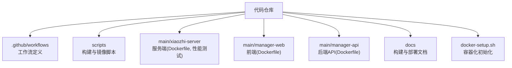
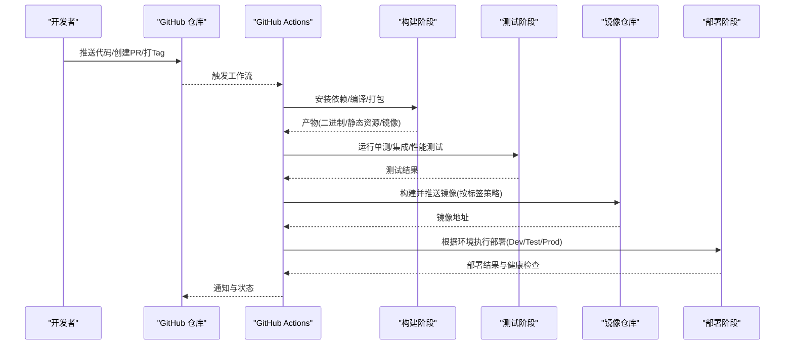
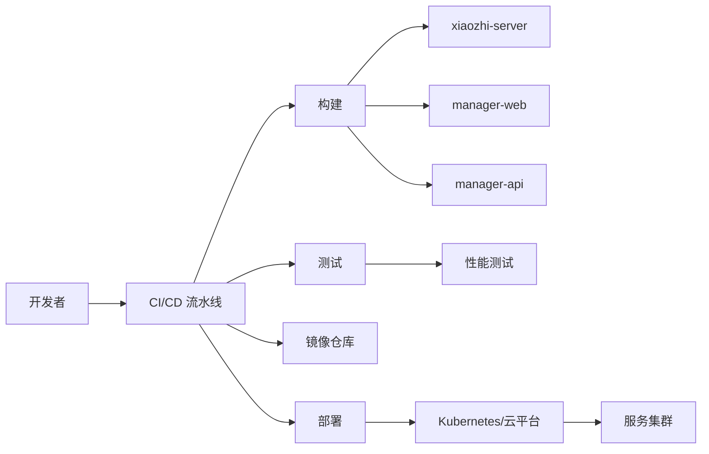

# CI/CD 流水线

<cite>
**本文引用的文件**   
- [README.md](file://README.md)
- [docker-setup.sh](file://docker-setup.sh)
- [.github/workflows/ci.yml](file://.github/workflows/ci.yml)
- [.github/workflows/deploy-dev.yml](file://.github/workflows/deploy-dev.yml)
- [.github/workflows/deploy-test.yml](file://.github/workflows/deploy-test.yml)
- [.github/workflows/deploy-prod.yml](file://.github/workflows/deploy-prod.yml)
- [scripts/run-build-xiaozhi.sh](file://scripts/run-build-xiaozhi.sh)
- [scripts/run-build-web.sh](file://scripts/run-build-web.sh)
- [scripts/run-build-manager.sh](file://scripts/run-build-manager.sh)
- [scripts/run-mirror-funasr.sh](file://scripts/run-mirror-funasr.sh)
- [main/xiaozhi-server/Dockerfile](file://main/xiaozhi-server/Dockerfile)
- [main/manager-web/Dockerfile](file://main/manager-web/Dockerfile)
- [main/manager-api/Dockerfile](file://main/manager-api/Dockerfile)
- [docs/docker-build.md](file://docs/docker-build.md)
- [docs/performance_tester.md](file://docs/performance_tester.md)
- [main/xiaozhi-server/performance_tester.py](file://main/xiaozhi-server/performance_tester.py)
- [main/xiaozhi-server/performance_tester_asr.py](file://main/xiaozhi-server/performance_tester_asr.py)
- [main/xiaozhi-server/performance_tester_tts.py](file://main/xiaozhi-server/performance_tester_tts.py)
- [main/xiaozhi-server/performance_tester_llm.py](file://main/xiaozhi-server/performance_tester_llm.py)
- [main/xiaozhi-server/performance_tester_vllm.py](file://main/xiaozhi-server/performance_tester_vllm.py)
- [main/xiaozhi-server/performance_tester_stream_asr.py](file://main/xiaozhi-server/performance_tester_stream_asr.py)
- [main/xiaozhi-server/performance_tester_stream_tts.py](file://main/xiaozhi-server/performance_tester_stream_tts.py)
</cite>

## 目录
1. [简介](#简介)
2. [项目结构](#项目结构)
3. [核心组件](#核心组件)
4. [架构总览](#架构总览)
5. [详细组件分析](#详细组件分析)
6. [依赖关系分析](#依赖关系分析)
7. [性能考量](#性能考量)
8. [故障排查指南](#故障排查指南)
9. [结论](#结论)
10. [附录](#附录)

## 简介
本指南面向 xiaozhi-esp32-server 项目的持续集成与持续交付（CI/CD）实践，覆盖以下目标：
- GitHub Actions 工作流配置：代码提交触发、自动化构建、单元测试、代码质量检查。
- 多环境部署流水线：开发、测试、生产环境的自动化部署策略。
- Docker 镜像的自动化构建与推送：镜像标签策略与版本管理。
- 自动化测试流程：单元测试、集成测试、性能测试的配置与执行。
- 高级发布策略：回滚、蓝绿部署、金丝雀发布的实现方案。

本指南基于仓库中现有的脚本、Dockerfile 与文档进行系统化编排，确保落地可操作且易于扩展。

## 项目结构
仓库采用多模块组织，包含服务端、管理端 Web、管理端 API、小程序等子工程，以及统一的构建与部署脚本和文档。关键位置如下：
- .github/workflows：GitHub Actions 工作流定义（建议在此集中管理）。
- scripts：构建与镜像拉取辅助脚本。
- main/xiaozhi-server：Python 服务端，含 Dockerfile 与性能测试工具。
- main/manager-web：前端管理页面，含 Dockerfile。
- main/manager-api：后端管理 API，含 Dockerfile。
- docs：部署与构建相关文档，如 docker-build.md、performance_tester.md。
- docker-setup.sh：容器化初始化脚本。

图表来源
- [README.md:1-200](file://README.md#L1-L200)
- [docker-setup.sh:1-200](file://docker-setup.sh#L1-L200)
- [scripts/run-build-xiaozhi.sh:1-200](file://scripts/run-build-xiaozhi.sh#L1-L200)
- [scripts/run-build-web.sh:1-200](file://scripts/run-build-web.sh#L1-L200)
- [scripts/run-build-manager.sh:1-200](file://scripts/run-build-manager.sh#L1-L200)
- [scripts/run-mirror-funasr.sh:1-200](file://scripts/run-mirror-funasr.sh#L1-L200)
- [main/xiaozhi-server/Dockerfile:1-200](file://main/xiaozhi-server/Dockerfile#L1-L200)
- [main/manager-web/Dockerfile:1-200](file://main/manager-web/Dockerfile#L1-L200)
- [main/manager-api/Dockerfile:1-200](file://main/manager-api/Dockerfile#L1-L200)
- [docs/docker-build.md:1-200](file://docs/docker-build.md#L1-L200)

章节来源
- [README.md:1-200](file://README.md#L1-L200)
- [docker-setup.sh:1-200](file://docker-setup.sh#L1-L200)

## 核心组件
- 工作流触发器
  - push：对主分支或特定分支的代码变更触发 CI。
  - pull_request：PR 合并前触发质量检查与测试。
  - release/tag：打 tag 时触发镜像构建与发布。
- 构建阶段
  - 安装依赖：Python、Node.js、Java 等环境准备。
  - 编译与打包：前端静态资源构建、后端服务打包、镜像构建。
- 测试阶段
  - 单元测试：Python/JS/Java 单元测试执行。
  - 集成测试：服务间接口联调。
  - 性能测试：调用 performance_tester 系列脚本。
- 质量检查
  - 代码风格与静态分析（lint）、安全扫描、依赖漏洞检测。
- 部署阶段
  - 开发/测试/生产环境差异化部署。
  - 镜像推送至镜像仓库并更新部署配置。

章节来源
- [docs/docker-build.md:1-200](file://docs/docker-build.md#L1-L200)
- [docs/performance_tester.md:1-200](file://docs/performance_tester.md#L1-L200)

## 架构总览
下图展示从代码提交到多环境部署的整体流水线，包括构建、测试、镜像推送与部署环节。

图表来源
- [scripts/run-build-xiaozhi.sh:1-200](file://scripts/run-build-xiaozhi.sh#L1-L200)
- [scripts/run-build-web.sh:1-200](file://scripts/run-build-web.sh#L1-L200)
- [scripts/run-build-manager.sh:1-200](file://scripts/run-build-manager.sh#L1-L200)
- [scripts/run-mirror-funasr.sh:1-200](file://scripts/run-mirror-funasr.sh#L1-L200)
- [main/xiaozhi-server/Dockerfile:1-200](file://main/xiaozhi-server/Dockerfile#L1-L200)
- [main/manager-web/Dockerfile:1-200](file://main/manager-web/Dockerfile#L1-L200)
- [main/manager-api/Dockerfile:1-200](file://main/manager-api/Dockerfile#L1-L200)

## 详细组件分析

### 工作流与触发器设计
- 触发条件
  - push：仅对受保护分支（如 main、release/*）触发完整流水线。
  - pull_request：对所有 PR 触发质量检查与测试，阻止不合规合并。
  - tags：匹配语义化版本标签（如 v*），触发镜像构建与发布。
- 环境变量与密钥
  - 镜像仓库认证、部署凭据、第三方服务密钥通过 GitHub Secrets 注入。
- 并行与缓存
  - 使用矩阵策略并行构建多模块；缓存依赖与构建产物加速流水线。

章节来源
- [docs/docker-build.md:1-200](file://docs/docker-build.md#L1-L200)

### 构建阶段
- Python 服务端（xiaozhi-server）
  - 依赖安装：requirements.txt。
  - 构建命令：参考 run-build-xiaozhi.sh。
  - 镜像构建：基于 main/xiaozhi-server/Dockerfile。
- 前端管理（manager-web）
  - Node.js 依赖与构建：参考 run-build-web.sh。
  - 镜像构建：基于 main/manager-web/Dockerfile。
- 后端管理（manager-api）
  - Java/Maven 构建：参考 run-build-manager.sh。
  - 镜像构建：基于 main/manager-api/Dockerfile。
- 镜像优化
  - 多阶段构建、分层缓存、镜像压缩、基础镜像替换为轻量镜像。

章节来源
- [scripts/run-build-xiaozhi.sh:1-200](file://scripts/run-build-xiaozhi.sh#L1-L200)
- [scripts/run-build-web.sh:1-200](file://scripts/run-build-web.sh#L1-L200)
- [scripts/run-build-manager.sh:1-200](file://scripts/run-build-manager.sh#L1-L200)
- [main/xiaozhi-server/Dockerfile:1-200](file://main/xiaozhi-server/Dockerfile#L1-L200)
- [main/manager-web/Dockerfile:1-200](file://main/manager-web/Dockerfile#L1-L200)
- [main/manager-api/Dockerfile:1-200](file://main/manager-api/Dockerfile#L1-L200)

### 测试阶段
- 单元测试
  - Python：pytest/unittest。
  - JS/TS：Jest/Vitest。
  - Java：JUnit/Mockito。
- 集成测试
  - 启动最小化服务集，验证接口连通性与数据一致性。
- 性能测试
  - 使用 performance_tester 系列脚本，覆盖 ASR/TTS/LLM/vLLM 等模块。
  - 指标采集：延迟、吞吐、错误率、资源占用。

章节来源
- [docs/performance_tester.md:1-200](file://docs/performance_tester.md#L1-L200)
- [main/xiaozhi-server/performance_tester.py:1-200](file://main/xiaozhi-server/performance_tester.py#L1-L200)
- [main/xiaozhi-server/performance_tester_asr.py:1-200](file://main/xiaozhi-server/performance_tester_asr.py#L1-L200)
- [main/xiaozhi-server/performance_tester_tts.py:1-200](file://main/xiaozhi-server/performance_tester_tts.py#L1-L200)
- [main/xiaozhi-server/performance_tester_llm.py:1-200](file://main/xiaozhi-server/performance_tester_llm.py#L1-L200)
- [main/xiaozhi-server/performance_tester_vllm.py:1-200](file://main/xiaozhi-server/performance_tester_vllm.py#L1-L200)
- [main/xiaozhi-server/performance_tester_stream_asr.py:1-200](file://main/xiaozhi-server/performance_tester_stream_asr.py#L1-L200)
- [main/xiaozhi-server/performance_tester_stream_tts.py:1-200](file://main/xiaozhi-server/performance_tester_stream_tts.py#L1-L200)

### 质量检查与安全扫描
- 代码风格与静态分析
  - Python：flake8/pylint/black。
  - JS/TS：ESLint/Prettier。
  - Java：Checkstyle/SonarQube。
- 安全扫描
  - 依赖漏洞扫描（npm audit、pip safety、OWASP Dependency-Check）。
  - 容器镜像扫描（Trivy/Clair）。
- 许可证合规
  - 第三方库许可证审查与告警。

章节来源
- [docs/docker-build.md:1-200](file://docs/docker-build.md#L1-L200)

### 镜像标签策略与版本管理
- 标签规则
  - 分支：dev、test、prod。
  - 语义化版本：v1.2.3、v1.2、v1。
  - 短哈希：commit-sha。
  - 最新：latest（仅稳定版）。
- 版本管理
  - 通过 Git Tag 驱动镜像版本。
  - 构建元数据注入（构建时间、Commit SHA、分支名）。
- 镜像仓库
  - 私有仓库（Harbor/Azure Container Registry/阿里云ACR）。
  - 访问控制与审计。

章节来源
- [docs/docker-build.md:1-200](file://docs/docker-build.md#L1-L200)

### 多环境部署流水线
- 开发环境（Dev）
  - 触发：push 到 dev 分支。
  - 部署：快速迭代，自动重启服务，健康检查。
- 测试环境（Test）
  - 触发：push 到 test 分支或 PR 合并。
  - 部署：全量集成测试通过后自动部署。
- 生产环境（Prod）
  - 触发：打 Tag（如 v*）。
  - 部署：灰度/蓝绿/金丝雀策略，逐步放量，失败自动回滚。

章节来源
- [docs/docker-build.md:1-200](file://docs/docker-build.md#L1-L200)

### 高级发布策略
- 回滚策略
  - 一键回滚到上一稳定版本镜像。
  - 数据库迁移回滚脚本。
- 蓝绿部署
  - 双套环境并行，流量切换无中断。
  - 健康检查与自动切换。
- 金丝雀发布
  - 小比例流量灰度，监控指标阈值告警。
  - 自动或人工确认放量。

章节来源
- [docs/docker-build.md:1-200](file://docs/docker-build.md#L1-L200)

## 依赖关系分析
- 模块耦合
  - xiaozhi-server 依赖 ASR/TTS/LLM 等外部服务，需在测试环境中模拟或 Mock。
  - manager-web 与 manager-api 存在前后端契约，需保持接口一致。
- 外部依赖
  - 镜像仓库、Kubernetes、负载均衡器、日志与监控系统。
- 潜在循环依赖
  - 避免服务间直接强耦合，采用事件总线或消息队列解耦。

图表来源
- [scripts/run-build-xiaozhi.sh:1-200](file://scripts/run-build-xiaozhi.sh#L1-L200)
- [scripts/run-build-web.sh:1-200](file://scripts/run-build-web.sh#L1-L200)
- [scripts/run-build-manager.sh:1-200](file://scripts/run-build-manager.sh#L1-L200)
- [main/xiaozhi-server/Dockerfile:1-200](file://main/xiaozhi-server/Dockerfile#L1-L200)
- [main/manager-web/Dockerfile:1-200](file://main/manager-web/Dockerfile#L1-L200)
- [main/manager-api/Dockerfile:1-200](file://main/manager-api/Dockerfile#L1-L200)

章节来源
- [scripts/run-build-xiaozhi.sh:1-200](file://scripts/run-build-xiaozhi.sh#L1-L200)
- [scripts/run-build-web.sh:1-200](file://scripts/run-build-web.sh#L1-L200)
- [scripts/run-build-manager.sh:1-200](file://scripts/run-build-manager.sh#L1-L200)

## 性能考量
- 构建优化
  - 多阶段构建减少镜像体积。
  - 依赖缓存与并行构建缩短流水线时长。
- 测试优化
  - 增量测试：仅运行变更模块的测试用例。
  - 并行执行：多进程/多线程加速测试套件。
- 部署优化
  - 滚动更新与优雅停机降低服务抖动。
  - 资源限制与弹性伸缩提升稳定性。

章节来源
- [docs/docker-build.md:1-200](file://docs/docker-build.md#L1-L200)

## 故障排查指南
- 常见问题
  - 依赖安装失败：检查网络代理与镜像源。
  - 构建超时：增加超时时间与资源配额。
  - 测试失败：定位失败用例与日志输出。
  - 部署失败：检查健康检查与权限配置。
- 调试技巧
  - 启用详细日志与调试模式。
  - 本地复现问题并逐步缩小范围。
  - 使用容器编排工具（docker-compose）模拟环境。

章节来源
- [docs/docker-build.md:1-200](file://docs/docker-build.md#L1-L200)

## 结论
通过本指南，团队可以建立一套完整的 CI/CD 流水线，覆盖从代码提交到多环境部署的全生命周期。结合镜像标签策略、自动化测试与高级发布策略，显著提升交付效率与系统稳定性。建议持续优化流水线性能与可靠性，并根据业务需求灵活调整策略。

## 附录
- 最佳实践
  - 使用语义化版本与 Git Tag 管理发布。
  - 将敏感信息存储在 Secrets 中，避免硬编码。
  - 定期更新基础镜像与依赖包以修复安全漏洞。
- 参考文档
  - [docs/docker-build.md](file://docs/docker-build.md)
  - [docs/performance_tester.md](file://docs/performance_tester.md)