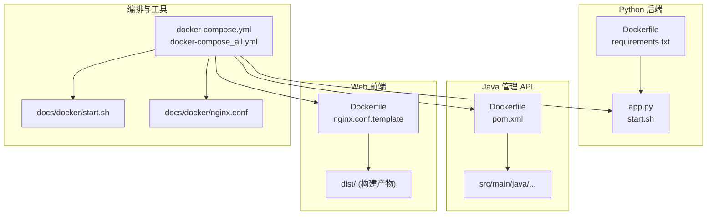
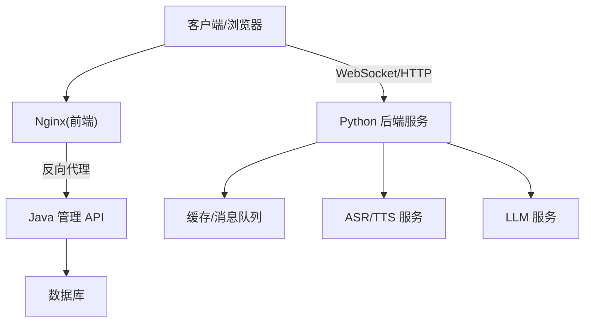
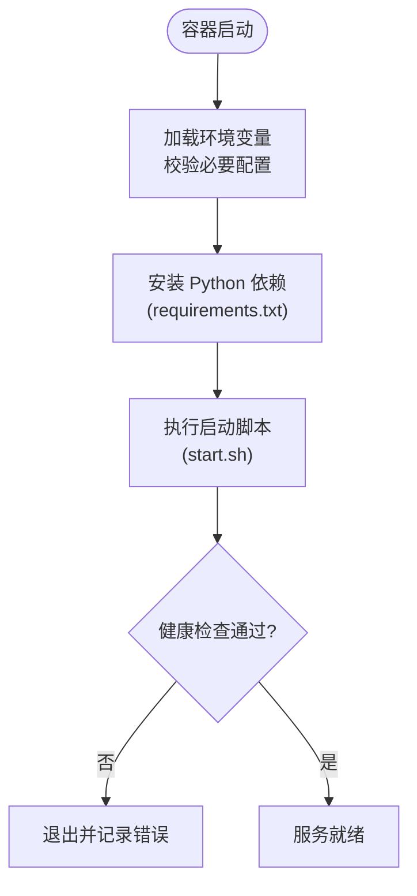
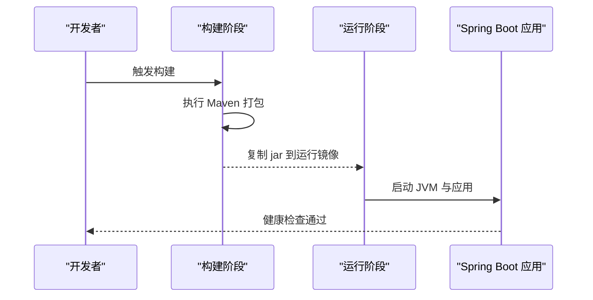
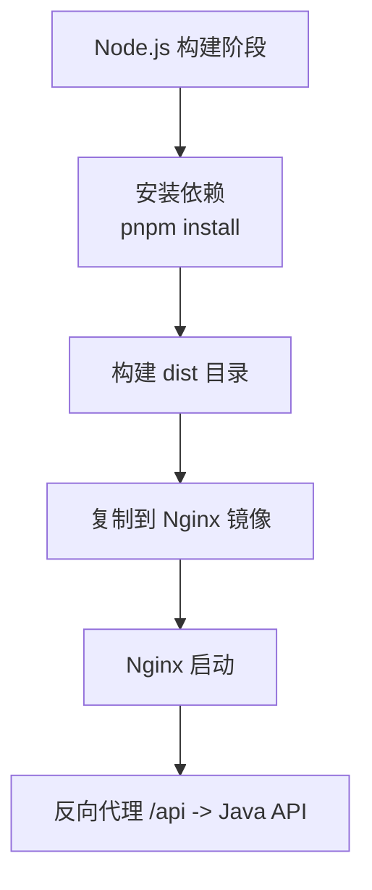
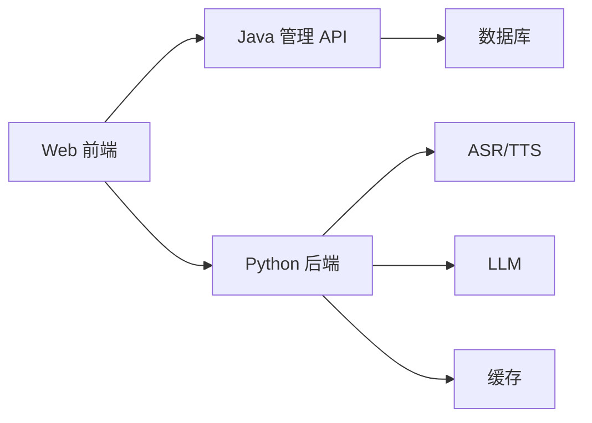

# Docker 部署

<cite>
**本文引用的文件**
- [docker-compose.yml](file://main/xiaozhi-server/docker-compose.yml)
- [docker-compose_all.yml](file://main/xiaozhi-server/docker-compose_all.yml)
- [Dockerfile](file://main/xiaozhi-server/Dockerfile)
- [start.sh](file://main/xiaozhi-server/start.sh)
- [requirements.txt](file://main/xiaozhi-server/requirements.txt)
- [app.py](file://main/xiaozhi-server/app.py)
- [nginx.conf](file://docs/docker/nginx.conf)
- [start.sh](file://docs/docker/start.sh)
- [Dockerfile](file://main/manager-api/Dockerfile)
- [pom.xml](file://main/manager-api/pom.xml)
- [.dockerignore](file://main/manager-api/.dockerignore)
- [Dockerfile](file://main/manager-web/Dockerfile)
- [nginx.conf.template](file://main/manager-web/docker/nginx.conf.template)
- [start.sh](file://main/manager-web/docker/start.sh)
- [package.json](file://main/manager-web/package.json)
- [vue.config.js](file://main/manager-web/vue.config.js)
- [scripts/build-push-xiaozhi-server.sh](file://docs/aliyun/sae-deployment/scripts/build-push-xiaozhi-server.sh)
- [scripts/build-push-manager-api.sh](file://docs/aliyun/sae-deployment/scripts/build-push-manager-api.sh)
- [scripts/build-push-manager-web.sh](file://docs/aliyun/sae-deployment/scripts/build-push-manager-web.sh)
- [buildkitd.toml](file://docs/aliyun/sae-deployment/scripts/buildkitd.toml)
- [docker-setup.sh](file://docker-setup.sh)
</cite>

## 目录
1. [简介](#简介)
2. [项目结构](#项目结构)
3. [核心组件](#核心组件)
4. [架构总览](#架构总览)
5. [详细组件分析](#详细组件分析)
6. [依赖关系分析](#依赖关系分析)
7. [性能考虑](#性能考虑)
8. [故障排查指南](#故障排查指南)
9. [结论](#结论)
10. [附录](#附录)

## 简介
本指南面向 xiaozhi-esp32-server 的容器化部署，覆盖 Python 后端服务、Java 管理 API、Vue.js Web 前端与 Uni-app 移动端的镜像构建与编排。文档基于仓库内现有 Dockerfile、docker-compose 配置与构建脚本，提供多阶段构建优化、镜像体积优化、安全最佳实践、环境变量与数据卷挂载说明，以及生产环境模板与性能调优建议。

## 项目结构
xiaozhi-esp32-server 的容器化相关代码主要分布在以下位置：
- Python 后端服务（xiaozhi-server）：包含应用入口、依赖清单、启动脚本与 docker-compose 编排
- Java 管理 API（manager-api）：Spring Boot 应用，含 Maven 构建与 Dockerfile
- Vue.js Web 前端（manager-web）：静态资源构建产物由 Nginx 托管，含独立 Dockerfile
- 移动端（Uni-app/小程序）：通过 CI/CD 脚本构建为可分发包，不直接运行于容器
- 公共文档与工具：docs/docker 下的 nginx 配置与通用启动脚本；阿里云 SAE 构建脚本用于多阶段构建与镜像推送

**图示来源**
- [Dockerfile](file://main/xiaozhi-server/Dockerfile)
- [requirements.txt](file://main/xiaozhi-server/requirements.txt)
- [app.py](file://main/xiaozhi-server/app.py)
- [Dockerfile](file://main/manager-api/Dockerfile)
- [pom.xml](file://main/manager-api/pom.xml)
- [Dockerfile](file://main/manager-web/Dockerfile)
- [nginx.conf.template](file://main/manager-web/docker/nginx.conf.template)
- [docker-compose.yml](file://main/xiaozhi-server/docker-compose.yml)
- [docker-compose_all.yml](file://main/xiaozhi-server/docker-compose_all.yml)
- [nginx.conf](file://docs/docker/nginx.conf)
- [start.sh](file://docs/docker/start.sh)

**章节来源**
- [docker-compose.yml](file://main/xiaozhi-server/docker-compose.yml)
- [docker-compose_all.yml](file://main/xiaozhi-server/docker-compose_all.yml)
- [Dockerfile](file://main/xiaozhi-server/Dockerfile)
- [requirements.txt](file://main/xiaozhi-server/requirements.txt)
- [app.py](file://main/xiaozhi-server/app.py)
- [Dockerfile](file://main/manager-api/Dockerfile)
- [pom.xml](file://main/manager-api/pom.xml)
- [Dockerfile](file://main/manager-web/Dockerfile)
- [nginx.conf.template](file://main/manager-web/docker/nginx.conf.template)
- [nginx.conf](file://docs/docker/nginx.conf)
- [start.sh](file://docs/docker/start.sh)

## 核心组件
- Python 后端服务（xiaozhi-server）
  - 入口与运行时：应用主程序与启动脚本
  - 依赖管理：requirements.txt 定义 Python 依赖
  - 镜像构建：Dockerfile 采用多阶段构建，分离构建与运行环境
- Java 管理 API（manager-api）
  - 构建系统：Maven 打包 Spring Boot 应用
  - 镜像构建：Dockerfile 使用多阶段构建，仅包含运行时 JRE 与产物
- Vue.js Web 前端（manager-web）
  - 构建产物：静态资源 dist 目录
  - 镜像构建：Nginx 托管静态资源，支持反向代理与缓存策略
- 编排与网络
  - docker-compose 统一编排服务、网络与数据卷
  - 环境变量注入与外部依赖（数据库、缓存等）集中管理

**章节来源**
- [Dockerfile](file://main/xiaozhi-server/Dockerfile)
- [requirements.txt](file://main/xiaozhi-server/requirements.txt)
- [app.py](file://main/xiaozhi-server/app.py)
- [Dockerfile](file://main/manager-api/Dockerfile)
- [pom.xml](file://main/manager-api/pom.xml)
- [Dockerfile](file://main/manager-web/Dockerfile)
- [docker-compose.yml](file://main/xiaozhi-server/docker-compose.yml)
- [docker-compose_all.yml](file://main/xiaozhi-server/docker-compose_all.yml)

## 架构总览
下图展示各服务的容器化部署关系与数据流向。Python 后端对外暴露 WebSocket/HTTP 接口，Java 管理 API 提供管理端点，Vue 前端通过 Nginx 反向代理访问 API，统一由编排文件协调网络与端口映射。

**图示来源**
- [docker-compose.yml](file://main/xiaozhi-server/docker-compose.yml)
- [docker-compose_all.yml](file://main/xiaozhi-server/docker-compose_all.yml)
- [nginx.conf](file://docs/docker/nginx.conf)
- [nginx.conf.template](file://main/manager-web/docker/nginx.conf.template)

## 详细组件分析

### Python 后端服务（xiaozhi-server）
- 镜像构建
  - 多阶段构建：第一阶段安装依赖并编译 C/C++ 扩展（如有），第二阶段仅包含运行时依赖与最小化基础镜像
  - 依赖锁定：requirements.txt 固定版本，确保构建可重复性
- 运行配置
  - 启动脚本：start.sh 负责初始化环境与进程管理
  - 环境变量：通过 docker-compose 注入配置项（如数据库连接、第三方服务密钥）
- 数据与日志
  - 数据卷：持久化配置与日志到宿主机或云盘
  - 日志输出：标准输出与文件双写，便于采集与轮转

**图示来源**
- [Dockerfile](file://main/xiaozhi-server/Dockerfile)
- [start.sh](file://main/xiaozhi-server/start.sh)
- [requirements.txt](file://main/xiaozhi-server/requirements.txt)
- [app.py](file://main/xiaozhi-server/app.py)

**章节来源**
- [Dockerfile](file://main/xiaozhi-server/Dockerfile)
- [start.sh](file://main/xiaozhi-server/start.sh)
- [requirements.txt](file://main/xiaozhi-server/requirements.txt)
- [app.py](file://main/xiaozhi-server/app.py)

### Java 管理 API（manager-api）
- 镜像构建
  - 多阶段构建：第一阶段使用 Maven 打包，第二阶段仅包含 JRE 与 jar 包
  - 依赖裁剪：仅引入运行时所需依赖，减少镜像体积
- 运行配置
  - JVM 参数：堆大小、GC 策略通过环境变量或启动参数注入
  - 配置文件：application.yml/properties 通过数据卷或环境变量覆盖
- 健康检查与优雅关闭
  - 健康端点：/actuator/health 或自定义端点
  - 优雅关闭：SIGTERM 处理，确保请求完成后再退出

**图示来源**
- [Dockerfile](file://main/manager-api/Dockerfile)
- [pom.xml](file://main/manager-api/pom.xml)

**章节来源**
- [Dockerfile](file://main/manager-api/Dockerfile)
- [pom.xml](file://main/manager-api/pom.xml)
- [.dockerignore](file://main/manager-api/.dockerignore)

### Vue.js Web 前端（manager-web）
- 镜像构建
  - 多阶段构建：第一阶段 Node.js 环境构建 dist，第二阶段 Nginx 托管静态资源
  - 构建缓存：利用 .npmrc 与 pnpm/yarn 缓存加速构建
- 运行配置
  - Nginx 反向代理：将 /api 转发至 Java 管理 API
  - 缓存策略：静态资源启用长期缓存，HTML 禁用缓存
- 环境变量
  - 构建时变量：VITE_* 前缀注入到前端代码
  - 运行时变量：通过 Nginx 配置或环境变量注入

**图示来源**
- [Dockerfile](file://main/manager-web/Dockerfile)
- [nginx.conf.template](file://main/manager-web/docker/nginx.conf.template)
- [package.json](file://main/manager-web/package.json)
- [vue.config.js](file://main/manager-web/vue.config.js)

**章节来源**
- [Dockerfile](file://main/manager-web/Dockerfile)
- [nginx.conf.template](file://main/manager-web/docker/nginx.conf.template)
- [package.json](file://main/manager-web/package.json)
- [vue.config.js](file://main/manager-web/vue.config.js)

### Uni-app 移动端（管理端）
- 构建与发布
  - 通过 CI/CD 脚本构建为小程序/H5/App 包，不直接运行于容器
  - 构建脚本参考阿里云 SAE 构建流程，支持多平台输出
- 与后端集成
  - 调用 Java 管理 API 与 Python 后端服务（WebSocket/HTTP）
  - 环境变量与域名配置在构建时注入

**章节来源**
- [scripts/build-push-manager-web.sh](file://docs/aliyun/sae-deployment/scripts/build-push-manager-web.sh)
- [scripts/build-push-manager-api.sh](file://docs/aliyun/sae-deployment/scripts/build-push-manager-api.sh)
- [scripts/build-push-xiaozhi-server.sh](file://docs/aliyun/sae-deployment/scripts/build-push-xiaozhi-server.sh)

## 依赖关系分析
- 服务间依赖
  - Web 前端依赖 Java 管理 API（/api 路径）
  - Python 后端依赖外部服务（ASR/TTS/LLM/数据库/缓存）
- 构建依赖
  - Python：requirements.txt 锁定版本
  - Java：pom.xml 管理依赖，Maven 构建
  - Web：package.json 管理依赖，Node.js 构建
- 编排依赖
  - docker-compose 定义服务顺序、网络与端口映射
  - 环境变量集中管理，避免硬编码

**图示来源**
- [docker-compose.yml](file://main/xiaozhi-server/docker-compose.yml)
- [docker-compose_all.yml](file://main/xiaozhi-server/docker-compose_all.yml)

**章节来源**
- [docker-compose.yml](file://main/xiaozhi-server/docker-compose.yml)
- [docker-compose_all.yml](file://main/xiaozhi-server/docker-compose_all.yml)

## 性能考虑
- 镜像优化
  - 多阶段构建：分离构建与运行环境，减小镜像体积
  - 依赖缓存：利用 Docker 层缓存与 pnpm/yarn 缓存
  - 基础镜像选择：使用精简版基础镜像（如 alpine、distroless）
- 运行时优化
  - Python：限制线程数、调整 GIL 行为、使用异步 I/O
  - Java：JVM 参数调优（堆大小、GC 策略）、连接池配置
  - Nginx：开启 gzip、缓存策略、连接复用
- 资源限制
  - CPU/内存限制：通过 docker-compose 或 Kubernetes 资源配额
  - 磁盘 I/O：日志轮转与数据卷挂载到高性能存储

[本节为通用指导，无需特定文件引用]

## 故障排查指南
- 常见问题
  - 端口冲突：检查 docker-compose 端口映射与宿主端口占用
  - 环境变量缺失：确认必要环境变量已注入（数据库、密钥等）
  - 依赖安装失败：检查 requirements.txt 与网络代理设置
  - 构建缓存失效：清理 Docker 缓存或更新依赖版本
- 日志查看
  - Python：容器日志与文件日志双写，支持 tail -f 实时查看
  - Java：Spring Boot 日志级别调整，输出到标准输出与文件
  - Nginx：访问日志与错误日志定位前端问题
- 健康检查
  - 自定义健康端点：/health 或 /actuator/health
  - 自动重启：docker-compose restart 或 Kubernetes liveness probe

**章节来源**
- [start.sh](file://main/xiaozhi-server/start.sh)
- [start.sh](file://docs/docker/start.sh)
- [nginx.conf](file://docs/docker/nginx.conf)

## 结论
本指南基于仓库现有 Dockerfile 与编排配置，提供了 xiaozhi-esp32-server 的全栈容器化部署方案。通过多阶段构建、镜像优化与安全最佳实践，确保生产环境的稳定性与性能。建议结合云平台（如阿里云 SAE/Kubernetes）进行弹性伸缩与监控告警。

[本节为总结，无需特定文件引用]

## 附录
- 启动命令
  - 本地开发：docker-compose up -d
  - 生产环境：docker-compose -f docker-compose_all.yml up -d
- 日志查看
  - docker logs -f <container_name>
  - 文件日志：tail -f /var/log/<service>.log
- 环境变量模板
  - 数据库连接：DB_HOST, DB_PORT, DB_USER, DB_PASS
  - 第三方服务：ASR_URL, TTS_URL, LLM_API_KEY
- 生产环境模板
  - 参考 docs/aliyun/sae-deployment 下的构建脚本与配置
  - 使用 buildkitd.toml 优化构建性能

**章节来源**
- [docker-compose.yml](file://main/xiaozhi-server/docker-compose.yml)
- [docker-compose_all.yml](file://main/xiaozhi-server/docker-compose_all.yml)
- [docker-setup.sh](file://docker-setup.sh)
- [buildkitd.toml](file://docs/aliyun/sae-deployment/scripts/buildkitd.toml)