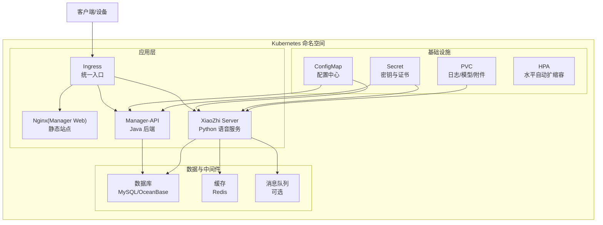
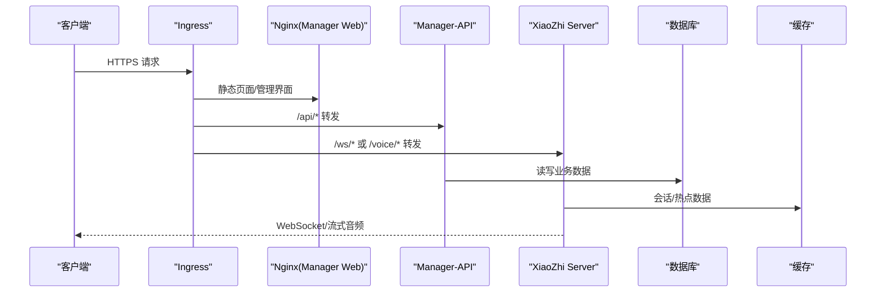
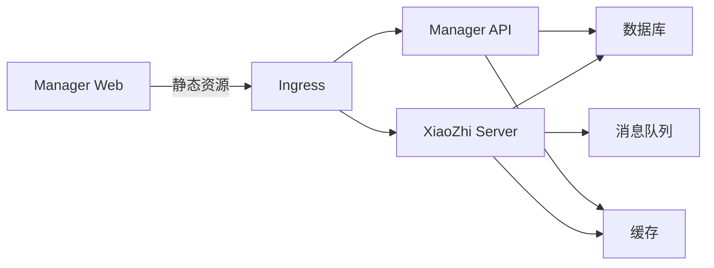

# Kubernetes 部署

<cite>
**本文引用的文件**   
- [README.md](file://README.md)
- [docker-setup.sh](file://docker-setup.sh)
- [main/xiaozhi-server/Dockerfile](file://main/xiaozhi-server/Dockerfile)
- [main/manager-api/Dockerfile](file://main/manager-api/Dockerfile)
- [main/manager-web/Dockerfile](file://main/manager-web/Dockerfile)
- [main/xiaozhi-server/docker-compose.yml](file://main/xiaozhi-server/docker-compose.yml)
- [main/xiaozhi-server/docker-compose-oceanbase.yml](file://main/xiaozhi-server/docker-compose-oceanbase.yml)
- [main/xiaozhi-server/start.sh](file://main/xiaozhi-server/start.sh)
- [main/manager-web/docker/nginx.conf.template](file://main/manager-web/docker/nginx.conf.template)
- [main/manager-web/docker/start.sh](file://main/manager-web/docker/start.sh)
- [docs/docker/nginx.conf](file://docs/docker/nginx.conf)
- [docs/docker/start.sh](file://docs/docker/start.sh)
- [docs/aliyun/ack-deployment-handbook.md](file://docs/aliyun/ack-deployment-handbook.md)
- [docs/aliyun/ack-deployment/01-containerization.md](file://docs/aliyun/ack-deployment/01-container化.md)
- [docs/aliyun/ack-deployment/02-kubernetes.md](file://docs/aliyun/ack-deployment/02-kubernetes.md)
- [docs/aliyun/ack-deployment/03-cloud-resources.md](file://docs/aliyun/ack-deployment/03-cloud-resources.md)
- [docs/aliyun/ack-deployment/04-operations.md](file://docs/aliyun/ack-deployment/04-operations.md)
- [scripts/run-build-xiaozhi.sh](file://scripts/run-build-xiaozhi.sh)
- [scripts/run-build-manager.sh](file://scripts/run-build-manager.sh)
- [scripts/run-build-web.sh](file://scripts/run-build-web.sh)
</cite>

## 目录
1. [简介](#简介)
2. [项目结构](#项目结构)
3. [核心组件](#核心组件)
4. [架构总览](#架构总览)
5. [详细组件分析](#详细组件分析)
6. [依赖关系分析](#依赖关系分析)
7. [性能与扩缩容](#性能与扩缩容)
8. [故障排查指南](#故障排查指南)
9. [结论](#结论)
10. [附录：阿里云 ACK 最佳实践](#附录阿里云-ack-最佳实践)

## 简介
本指南面向在 Kubernetes（尤其是阿里云 ACK）上部署 xiaozhi-esp32-server 的工程团队，提供从容器镜像到完整 K8s 资源的落地方案。内容覆盖 Deployment、Service、ConfigMap、Secret、Ingress、HPA、持久化存储、监控告警集成，以及滚动更新策略与健康检查配置。同时结合仓库中已有的 Dockerfile、启动脚本与阿里云部署手册，给出可直接落地的 YAML 模板与操作建议。

## 项目结构
xiaozhi-esp32-server 包含多个可独立部署的微服务与前端资源：
- xiaozhi-server：Python 语音对话服务端，含 WebSocket/HTTP 接口、ASR/TTS/LLM 等插件体系
- manager-api：Java 管理后端 API
- manager-web：Vue 管理前端，通常以 Nginx 静态站点形式发布
- 其他前端与小程序代码不在 K8s 部署范围内

关键构建与运行入口：
- 各服务的 Dockerfile 定义镜像构建过程
- start.sh 与 nginx 模板用于容器内运行时行为控制
- docker-compose 文件用于本地开发编排参考

图表来源
- [main/xiaozhi-server/Dockerfile](file://main/xiaozhi-server/Dockerfile)
- [main/manager-api/Dockerfile](file://main/manager-api/Dockerfile)
- [main/manager-web/Dockerfile](file://main/manager-web/Dockerfile)
- [main/xiaozhi-server/docker-compose.yml](file://main/xiaozhi-server/docker-compose.yml)

章节来源
- [README.md](file://README.md)
- [docker-setup.sh](file://docker-setup.sh)

## 核心组件
- 镜像构建
  - xiaozhi-server：基于 Python 的语音服务，Dockerfile 定义依赖安装与启动命令
  - manager-api：Java 后端，使用 Maven/Gradle 构建并打包为可执行镜像
  - manager-web：Vue 前端，构建后由 Nginx 托管静态资源
- 运行时脚本
  - start.sh：容器启动入口，负责环境变量注入、进程拉起、健康检查端点暴露
  - nginx.conf.template：动态生成 Nginx 配置，支持路径转发、WebSocket 升级、TLS 终止
- 编排参考
  - docker-compose.yml：本地多服务编排，便于理解服务间依赖与端口映射

章节来源
- [main/xiaozhi-server/Dockerfile](file://main/xiaozhi-server/Dockerfile)
- [main/manager-api/Dockerfile](file://main/manager-api/Dockerfile)
- [main/manager-web/Dockerfile](file://main/manager-web/Dockerfile)
- [main/xiaozhi-server/start.sh](file://main/xiaozhi-server/start.sh)
- [main/manager-web/docker/nginx.conf.template](file://main/manager-web/docker/nginx.conf.template)
- [main/xiaozhi-server/docker-compose.yml](file://main/xiaozhi-server/docker-compose.yml)

## 架构总览
Kubernetes 部署采用“统一入口 + 微服务拆分 + 外部依赖解耦”的模式：
- Ingress 作为统一入口，按域名或路径路由至不同服务，并处理 TLS 终止
- 每个微服务通过 Service 暴露 ClusterIP，供内部访问；对外通过 Ingress 暴露
- 配置与密钥通过 ConfigMap/Secret 注入，避免硬编码
- 状态与数据通过 PVC 持久化（如日志、模型、附件），无状态服务保持弹性伸缩
- 监控与日志通过 Sidecar 或 DaemonSet 采集，集中到日志平台与监控系统

图表来源
- [main/manager-web/docker/nginx.conf.template](file://main/manager-web/docker/nginx.conf.template)
- [main/xiaozhi-server/start.sh](file://main/xiaozhi-server/start.sh)

## 详细组件分析

### 命名空间与基础资源
- 命名空间：建议按环境划分（dev/staging/prod），隔离资源与权限
- 网络策略：限制跨命名空间访问，仅开放必要端口
- 资源配额：对命名空间设置 CPU/Memory 上限，防止资源争用

章节来源
- [docs/aliyun/ack-deployment/02-kubernetes.md](file://docs/aliyun/ack-deployment/02-kubernetes.md)

### ConfigMap 与 Secret
- ConfigMap：存放非敏感配置（如服务地址、功能开关、日志级别）
- Secret：存放敏感信息（数据库密码、第三方 API Key、TLS 私钥）
- 挂载方式：环境变量注入或文件卷挂载，优先使用环境变量

章节来源
- [main/xiaozhi-server/start.sh](file://main/xiaozhi-server/start.sh)
- [main/manager-web/docker/nginx.conf.template](file://main/manager-web/docker/nginx.conf.template)

### Deployment 与 Service
- Deployment：定义副本数、镜像版本、滚动更新策略、资源限制、探针
- Service：ClusterIP 类型用于内部通信；NodePort/LoadBalancer 仅在调试时使用
- 滚动更新：设置 maxUnavailable/maxSurge 保证零停机更新

章节来源
- [main/xiaozhi-server/Dockerfile](file://main/xiaozhi-server/Dockerfile)
- [main/manager-api/Dockerfile](file://main/manager-api/Dockerfile)
- [main/manager-web/Dockerfile](file://main/manager-web/Dockerfile)

### Ingress 与负载均衡
- Ingress：按域名或路径路由，启用 TLS 终止，支持 HTTP/2
- 负载均衡：云厂商 LB（如 ALB/NLB）与 Ingress Controller 配合
- 健康检查：Ingress 后端健康检查与就绪探针联动

章节来源
- [docs/docker/nginx.conf](file://docs/docker/nginx.conf)
- [main/manager-web/docker/nginx.conf.template](file://main/manager-web/docker/nginx.conf.template)

### 健康检查与探针
- LivenessProbe：检测进程是否存活，失败则重启 Pod
- ReadinessProbe：检测服务是否就绪，失败则从负载均衡摘除
- StartupProbe：适用于冷启动较慢的服务，避免误杀

章节来源
- [main/xiaozhi-server/start.sh](file://main/xiaozhi-server/start.sh)

### 持久化存储
- PVC：为需要持久化的数据（日志、模型、附件）申请存储卷
- StorageClass：选择高性能或高可靠存储类，匹配业务需求
- 备份恢复：定期快照与导出，确保数据安全

章节来源
- [main/xiaozhi-server/docker-compose.yml](file://main/xiaozhi-server/docker-compose.yml)

### 监控与告警
- 指标采集：Prometheus 抓取 K8s 与应用指标
- 日志收集：Fluent Bit/Filebeat 采集容器日志，输出到 ES/日志平台
- 告警规则：CPU/内存/错误率/延迟阈值触发告警

章节来源
- [docs/aliyun/ack-deployment/04-operations.md](file://docs/aliyun/ack-deployment/04-operations.md)

### 滚动更新策略
- 策略：RollingUpdate，设置 maxUnavailable=0 或 1，maxSurge=1
- 预检查：启动前进行依赖检查（数据库连通性、配置校验）
- 回滚：保留历史版本，快速回滚至稳定版本

章节来源
- [main/xiaozhi-server/start.sh](file://main/xiaozhi-server/start.sh)

### HPA 水平自动扩缩容
- 指标：CPU/内存利用率、自定义指标（QPS、延迟）
- 目标：根据负载自动调整副本数，最小/最大副本数限制
- 预热：预留冷启动时间，避免频繁扩缩容

章节来源
- [docs/aliyun/ack-deployment/04-operations.md](file://docs/aliyun/ack-deployment/04-operations.md)

### SSL/TLS 证书管理
- 证书来源：Let's Encrypt、云厂商证书服务、内部 CA
- 自动续期：Cert-manager 自动签发与更新
- 安全传输：强制 HTTPS，禁用弱加密套件

章节来源
- [main/manager-web/docker/nginx.conf.template](file://main/manager-web/docker/nginx.conf.template)

### 阿里云 ACK 特定配置
- 节点池：按工作负载类型划分（通用/计算优化/GPU）
- 网络插件：Terway/VPC CNI，支持 ENI 直通与 IP 池管理
- 存储类：ESSD/CPFS，根据 IOPS 与吞吐需求选择
- 安全组：最小权限原则，仅开放必要端口

章节来源
- [docs/aliyun/ack-deployment/01-containerization.md](file://docs/aliyun/ack-deployment/01-container化.md)
- [docs/aliyun/ack-deployment/03-cloud-resources.md](file://docs/aliyun/ack-deployment/03-cloud-resources.md)

## 依赖关系分析
服务间依赖与外部系统交互如下：
- XiaoZhi Server：依赖数据库、缓存、可选消息队列
- Manager API：依赖数据库、缓存
- Manager Web：静态资源，无后端依赖
- Ingress：依赖证书与后端服务健康状态

图表来源
- [main/xiaozhi-server/docker-compose.yml](file://main/xiaozhi-server/docker-compose.yml)

章节来源
- [main/xiaozhi-server/docker-compose.yml](file://main/xiaozhi-server/docker-compose.yml)

## 性能与扩缩容
- 资源限制：为每个容器设置 requests/limits，避免资源争用
- 连接池：数据库/缓存连接池大小调优，避免连接耗尽
- 缓存策略：热点数据缓存，减少数据库压力
- 异步处理：耗时任务异步化，提升响应速度
- 水平扩展：HPA 根据指标自动扩缩容，应对流量峰值

章节来源
- [docs/aliyun/ack-deployment/04-operations.md](file://docs/aliyun/ack-deployment/04-operations.md)

## 故障排查指南
- 启动失败：检查环境变量、配置文件、依赖服务连通性
- 健康检查失败：查看探针配置与后端服务状态
- 网络问题：检查 Service/Ingress 配置与安全组规则
- 性能瓶颈：监控 CPU/内存/磁盘 IO，定位慢查询与阻塞
- 日志分析：集中日志平台检索错误堆栈与关键事件

章节来源
- [main/xiaozhi-server/start.sh](file://main/xiaozhi-server/start.sh)
- [docs/aliyun/ack-deployment/04-operations.md](file://docs/aliyun/ack-deployment/04-operations.md)

## 结论
通过合理的 K8s 资源设计与阿里云 ACK 最佳实践，xiaozhi-esp32-server 可实现高可用、易扩展、易维护的云原生部署。建议在生产环境严格遵循安全规范、监控告警与备份恢复策略，持续优化性能与成本。

## 附录：阿里云 ACK 最佳实践
- 容器化：使用多阶段构建减小镜像体积，扫描漏洞
- Kubernetes：合理划分命名空间与资源配额，使用 NetworkPolicy 限制访问
- 云资源：选择合适的节点规格与存储类，利用弹性伸缩
- 运维：自动化部署与回滚，建立监控告警与日志分析体系

章节来源
- [docs/aliyun/ack-deployment/01-containerization.md](file://docs/aliyun/ack-deployment/01-container化.md)
- [docs/aliyun/ack-deployment/02-kubernetes.md](file://docs/aliyun/ack-deployment/02-kubernetes.md)
- [docs/aliyun/ack-deployment/03-cloud-resources.md](file://docs/aliyun/ack-deployment/03-cloud-resources.md)
- [docs/aliyun/ack-deployment/04-operations.md](file://docs/aliyun/ack-deployment/04-operations.md)