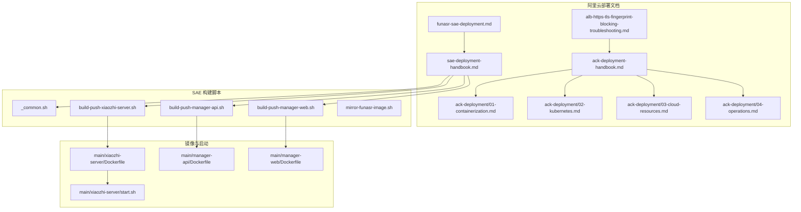
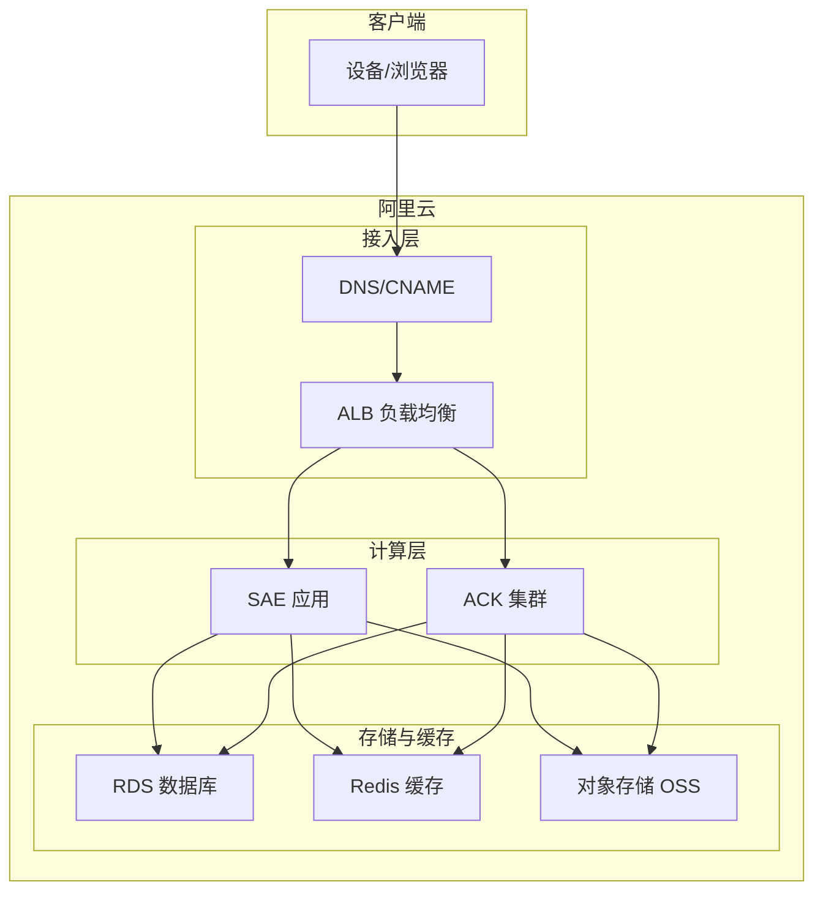
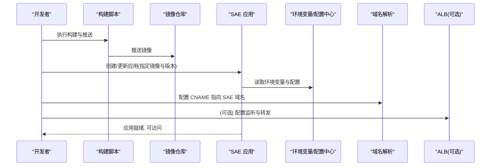
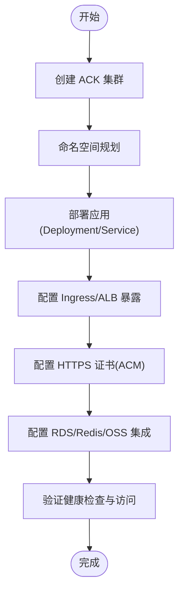
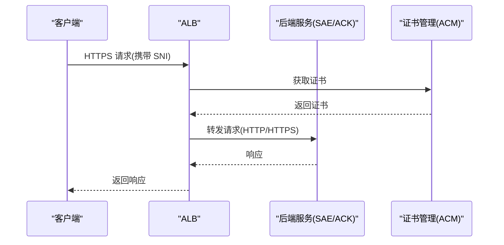
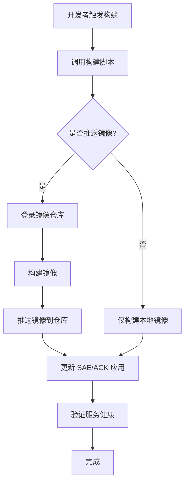
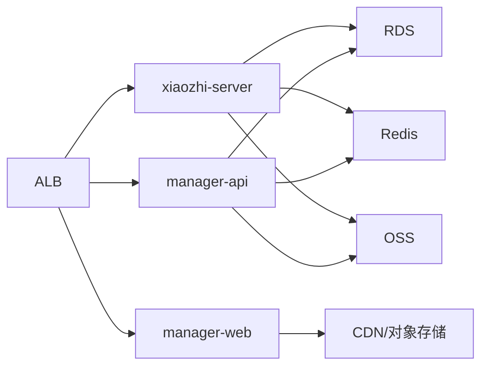

# 云平台部署

<cite>
**本文引用的文件**   
- [docs/aliyun/sae-deployment-handbook.md](file://docs/aliyun/sae-deployment-handbook.md)
- [docs/aliyun/ack-deployment-handbook.md](file://docs/aliyun/ack-deployment-handbook.md)
- [docs/aliyun/alb-https-tls-fingerprint-blocking-troubleshooting.md](file://docs/aliyun/alb-https-tls-fingerprint-blocking-troubleshooting.md)
- [docs/aliyun/funasr-sae-deployment.md](file://docs/aliyun/funasr-sae-deployment.md)
- [docs/aliyun/ack-deployment/01-containerization.md](file://docs/aliyun/ack-deployment/01-containerization.md)
- [docs/aliyun/ack-deployment/02-kubernetes.md](file://docs/aliyun/ack-deployment/02-kubernetes.md)
- [docs/aliyun/ack-deployment/03-cloud-resources.md](file://docs/aliyun/ack-deployment/03-cloud-resources.md)
- [docs/aliyun/ack-deployment/04-operations.md](file://docs/aliyun/ack-deployment/04-operations.md)
- [docs/aliyun/sae-deployment/scripts/_common.sh](file://docs/aliyun/sae-deployment/scripts/_common.sh)
- [docs/aliyun/sae-deployment/scripts/build-push-xiaozhi-server.sh](file://docs/aliyun/sae-deployment/scripts/build-push-xiaozhi-server.sh)
- [docs/aliyun/sae-deployment/scripts/build-push-manager-api.sh](file://docs/aliyun/sae-deployment/scripts/build-push-manager-api.sh)
- [docs/aliyun/sae-deployment/scripts/build-push-manager-web.sh](file://docs/aliyun/sae-deployment/scripts/build-push-manager-web.sh)
- [docs/aliyun/sae-deployment/scripts/mirror-funasr-image.sh](file://docs/aliyun/sae-deployment/scripts/mirror-funasr-image.sh)
- [main/xiaozhi-server/Dockerfile](file://main/xiaozhi-server/Dockerfile)
- [main/manager-api/Dockerfile](file://main/manager-api/Dockerfile)
- [main/manager-web/Dockerfile](file://main/manager-web/Dockerfile)
- [main/xiaozhi-server/docker-compose.yml](file://main/xiaozhi-server/docker-compose.yml)
- [main/xiaozhi-server/start.sh](file://main/xiaozhi-server/start.sh)
- [scripts/run-build-xiaozhi.sh](file://scripts/run-build-xiaozhi.sh)
- [scripts/run-build-manager.sh](file://scripts/run-build-manager.sh)
- [scripts/run-build-web.sh](file://scripts/run-build-web.sh)
</cite>

## 目录
1. [简介](#简介)
2. [项目结构](#项目结构)
3. [核心组件](#核心组件)
4. [架构总览](#架构总览)
5. [详细组件分析](#详细组件分析)
6. [依赖关系分析](#依赖关系分析)
7. [性能考虑](#性能考虑)
8. [故障排查指南](#故障排查指南)
9. [结论](#结论)
10. [附录](#附录)

## 简介
本指南面向在阿里云上部署 xiaozhi-esp32-server 的工程师与运维人员，重点覆盖两种主流方案：
- 阿里云 SAE（Serverless App Engine）：快速创建、配置、发布应用，适合中小规模与快速迭代场景。
- 阿里云 ACK（容器服务 Kubernetes 版）：基于 Kubernetes 的完整容器编排能力，适合大规模、高可用与精细化治理场景。

文档涵盖以下内容：
- SAE 应用的创建、镜像构建与推送、环境变量配置、域名绑定与发布流程
- ACK 集群搭建、命名空间规划、服务暴露方式（Ingress/ALB）
- ALB 负载均衡器配置：HTTPS 证书管理、TLS 指纹处理、健康检查
- 云数据库 RDS、Redis、OSS 等云服务的集成配置
- 自动化部署脚本与 CI/CD 建议

## 项目结构
仓库中与云平台部署相关的资源主要分布在以下位置：
- docs/aliyun：SAE 与 ACK 部署手册、ALB 排错、FunASR 在 SAE 的部署说明
- docs/aliyun/sae-deployment/scripts：镜像构建与推送脚本、公共脚本
- main/*：各子服务的 Dockerfile 与启动脚本
- scripts：本地一键构建脚本

图表来源
- [docs/aliyun/sae-deployment-handbook.md](file://docs/aliyun/sae-deployment-handbook.md)
- [docs/aliyun/ack-deployment-handbook.md](file://docs/aliyun/ack-deployment-handbook.md)
- [docs/aliyun/alb-https-tls-fingerprint-blocking-troubleshooting.md](file://docs/aliyun/alb-https-tls-fingerprint-blocking-troubleshooting.md)
- [docs/aliyun/funasr-sae-deployment.md](file://docs/aliyun/funasr-sae-deployment.md)
- [docs/aliyun/ack-deployment/01-containerization.md](file://docs/aliyun/ack-deployment/01-containerization.md)
- [docs/aliyun/ack-deployment/02-kubernetes.md](file://docs/aliyun/ack-deployment/02-kubernetes.md)
- [docs/aliyun/ack-deployment/03-cloud-resources.md](file://docs/aliyun/ack-deployment/03-cloud-resources.md)
- [docs/aliyun/ack-deployment/04-operations.md](file://docs/aliyun/ack-deployment/04-operations.md)
- [docs/aliyun/sae-deployment/scripts/_common.sh](file://docs/aliyun/sae-deployment/scripts/_common.sh)
- [docs/aliyun/sae-deployment/scripts/build-push-xiaozhi-server.sh](file://docs/aliyun/sae-deployment/scripts/build-push-xiaozhi-server.sh)
- [docs/aliyun/sae-deployment/scripts/build-push-manager-api.sh](file://docs/aliyun/sae-deployment/scripts/build-push-manager-api.sh)
- [docs/aliyun/sae-deployment/scripts/build-push-manager-web.sh](file://docs/aliyun/sae-deployment/scripts/build-push-manager-web.sh)
- [docs/aliyun/sae-deployment/scripts/mirror-funasr-image.sh](file://docs/aliyun/sae-deployment/scripts/mirror-funasr-image.sh)
- [main/xiaozhi-server/Dockerfile](file://main/xiaozhi-server/Dockerfile)
- [main/manager-api/Dockerfile](file://main/manager-api/Dockerfile)
- [main/manager-web/Dockerfile](file://main/manager-web/Dockerfile)
- [main/xiaozhi-server/start.sh](file://main/xiaozhi-server/start.sh)

章节来源
- [docs/aliyun/sae-deployment-handbook.md](file://docs/aliyun/sae-deployment-handbook.md)
- [docs/aliyun/ack-deployment-handbook.md](file://docs/aliyun/ack-deployment-handbook.md)

## 核心组件
- 应用与服务
  - xiaozhi-server：核心语音交互服务，提供 WebSocket/HTTP 接口
  - manager-api：管理端 API 服务
  - manager-web：管理端前端静态站点
- 运行时与镜像
  - 各服务均提供独立 Dockerfile，便于构建镜像并推送到阿里云镜像仓库
  - start.sh 用于统一启动入口与环境初始化
- 部署脚本
  - SAE 构建与推送脚本：按服务分别构建镜像并推送至阿里云镜像服务
  - 公共脚本 _common.sh 封装通用逻辑（登录、镜像名拼接、版本管理等）
  - FunASR 镜像拉取与镜像加速脚本，便于离线或受限网络环境使用

章节来源
- [main/xiaozhi-server/Dockerfile](file://main/xiaozhi-server/Dockerfile)
- [main/manager-api/Dockerfile](file://main/manager-api/Dockerfile)
- [main/manager-web/Dockerfile](file://main/manager-web/Dockerfile)
- [main/xiaozhi-server/start.sh](file://main/xiaozhi-server/start.sh)
- [docs/aliyun/sae-deployment/scripts/_common.sh](file://docs/aliyun/sae-deployment/scripts/_common.sh)
- [docs/aliyun/sae-deployment/scripts/build-push-xiaozhi-server.sh](file://docs/aliyun/sae-deployment/scripts/build-push-xiaozhi-server.sh)
- [docs/aliyun/sae-deployment/scripts/build-push-manager-api.sh](file://docs/aliyun/sae-deployment/scripts/build-push-manager-api.sh)
- [docs/aliyun/sae-deployment/scripts/build-push-manager-web.sh](file://docs/aliyun/sae-deployment/scripts/build-push-manager-web.sh)
- [docs/aliyun/sae-deployment/scripts/mirror-funasr-image.sh](file://docs/aliyun/sae-deployment/scripts/mirror-funasr-image.sh)

## 架构总览
下图展示了在阿里云上的典型部署架构，包含 SAE/ACK 两种运行环境与外部云服务（RDS、Redis、OSS、ALB）。

图表来源
- [docs/aliyun/ack-deployment-handbook.md](file://docs/aliyun/ack-deployment-handbook.md)
- [docs/aliyun/sae-deployment-handbook.md](file://docs/aliyun/sae-deployment-handbook.md)
- [docs/aliyun/alb-https-tls-fingerprint-blocking-troubleshooting.md](file://docs/aliyun/alb-https-tls-fingerprint-blocking-troubleshooting.md)

## 详细组件分析

### SAE 部署方案
- 应用创建与配置
  - 在 SAE 控制台创建应用，选择对应镜像源（支持阿里云镜像服务）
  - 配置环境变量（如数据库连接、Redis、OSS、鉴权密钥等），建议使用 SAE 的环境变量或配置中心
  - 设置实例规格、弹性伸缩策略、健康检查路径
- 镜像构建与推送
  - 使用提供的构建脚本对 xiaozhi-server、manager-api、manager-web 分别构建镜像并推送至阿里云镜像仓库
  - 公共脚本 _common.sh 负责统一的认证与镜像命名规则
- 域名绑定与发布
  - 在 SAE 应用中绑定自定义域名，开启 HTTPS（可关联 ACM 证书）
  - 发布新版本时采用灰度或蓝绿发布策略，确保零停机更新
- 依赖服务集成
  - RDS：通过内网地址访问，配置白名单与账号权限
  - Redis：推荐使用阿里云 Redis 实例，配置安全组与访问控制
  - OSS：通过 Endpoint 与 AK/SK 或 STS 临时凭证访问，建议最小权限原则

图表来源
- [docs/aliyun/sae-deployment-handbook.md](file://docs/aliyun/sae-deployment-handbook.md)
- [docs/aliyun/sae-deployment/scripts/_common.sh](file://docs/aliyun/sae-deployment/scripts/_common.sh)
- [docs/aliyun/sae-deployment/scripts/build-push-xiaozhi-server.sh](file://docs/aliyun/sae-deployment/scripts/build-push-xiaozhi-server.sh)
- [docs/aliyun/sae-deployment/scripts/build-push-manager-api.sh](file://docs/aliyun/sae-deployment/scripts/build-push-manager-api.sh)
- [docs/aliyun/sae-deployment/scripts/build-push-manager-web.sh](file://docs/aliyun/sae-deployment/scripts/build-push-manager-web.sh)

章节来源
- [docs/aliyun/sae-deployment-handbook.md](file://docs/aliyun/sae-deployment-handbook.md)
- [docs/aliyun/sae-deployment/scripts/_common.sh](file://docs/aliyun/sae-deployment/scripts/_common.sh)
- [docs/aliyun/sae-deployment/scripts/build-push-xiaozhi-server.sh](file://docs/aliyun/sae-deployment/scripts/build-push-xiaozhi-server.sh)
- [docs/aliyun/sae-deployment/scripts/build-push-manager-api.sh](file://docs/aliyun/sae-deployment/scripts/build-push-manager-api.sh)
- [docs/aliyun/sae-deployment/scripts/build-push-manager-web.sh](file://docs/aliyun/sae-deployment/scripts/build-push-manager-web.sh)

### ACK 部署方案
- 集群搭建
  - 创建 ACK 集群（托管版推荐），选择节点池规格与地域
  - 配置网络插件（Terway/VPC 插件）、日志采集与监控
- 命名空间规划
  - 按环境划分命名空间（dev/staging/prod）
  - 按服务划分命名空间（xiaozhi-server、manager-api、manager-web）
- 服务暴露方式
  - Ingress：通过 Nginx Ingress Controller 暴露 HTTP/HTTPS 路由
  - ALB：使用 ALB Ingress 控制器，结合 ACM 证书实现 HTTPS 终止
- 资源配置
  - Deployment/StatefulSet：定义副本数、资源限制、滚动更新策略
  - Service/Ingress：暴露端口与域名路由
  - ConfigMap/Secret：集中管理配置与敏感信息
- 云资源集成
  - RDS：通过内网地址与账号密码连接，使用 Secret 管理凭据
  - Redis：通过内网地址与密码连接，使用 Secret 管理凭据
  - OSS：通过 Endpoint 与 AK/SK 或 RAM Role 访问

图表来源
- [docs/aliyun/ack-deployment-handbook.md](file://docs/aliyun/ack-deployment-handbook.md)
- [docs/aliyun/ack-deployment/01-containerization.md](file://docs/aliyun/ack-deployment/01-containerization.md)
- [docs/aliyun/ack-deployment/02-kubernetes.md](file://docs/aliyun/ack-deployment/02-kubernetes.md)
- [docs/aliyun/ack-deployment/03-cloud-resources.md](file://docs/aliyun/ack-deployment/03-cloud-resources.md)
- [docs/aliyun/ack-deployment/04-operations.md](file://docs/aliyun/ack-deployment/04-operations.md)

章节来源
- [docs/aliyun/ack-deployment-handbook.md](file://docs/aliyun/ack-deployment-handbook.md)
- [docs/aliyun/ack-deployment/01-containerization.md](file://docs/aliyun/ack-deployment/01-containerization.md)
- [docs/aliyun/ack-deployment/02-kubernetes.md](file://docs/aliyun/ack-deployment/02-kubernetes.md)
- [docs/aliyun/ack-deployment/03-cloud-resources.md](file://docs/aliyun/ack-deployment/03-cloud-resources.md)
- [docs/aliyun/ack-deployment/04-operations.md](file://docs/aliyun/ack-deployment/04-operations.md)

### ALB 负载均衡器配置
- HTTPS 证书管理
  - 在 ACM 中申请或导入证书，并在 ALB 监听器中绑定证书
  - 支持多域名与通配符证书
- TLS 指纹处理
  - 若客户端使用固定 TLS 指纹校验，需确保 ALB 透传或后端正确处理握手参数
  - 参考排错文档定位握手失败、协议不匹配等问题
- 健康检查配置
  - 为后端服务配置 HTTP/TCP 健康检查路径与超时时间
  - 针对 WebSocket 长连接，注意健康检查不应中断会话

图表来源
- [docs/aliyun/alb-https-tls-fingerprint-blocking-troubleshooting.md](file://docs/aliyun/alb-https-tls-fingerprint-blocking-troubleshooting.md)

章节来源
- [docs/aliyun/alb-https-tls-fingerprint-blocking-troubleshooting.md](file://docs/aliyun/alb-https-tls-fingerprint-blocking-troubleshooting.md)

### 云数据库与存储服务集成
- RDS
  - 使用内网地址与账号密码连接，建议在 Secret 或环境变量中管理凭据
  - 配置安全组白名单，仅允许应用所在 VPC 访问
- Redis
  - 使用内网地址与密码连接，启用 ACL 或白名单控制
  - 对于热点数据，合理设置过期时间与内存淘汰策略
- OSS
  - 通过 Endpoint 与 AK/SK 或 STS/RAM Role 访问
  - 建议最小权限原则，按业务桶进行权限隔离

章节来源
- [docs/aliyun/ack-deployment/03-cloud-resources.md](file://docs/aliyun/ack-deployment/03-cloud-resources.md)

### 自动化部署脚本与工具
- 构建与推送
  - build-push-xiaozhi-server.sh：构建 xiaozhi-server 镜像并推送至阿里云镜像服务
  - build-push-manager-api.sh：构建 manager-api 镜像并推送
  - build-push-manager-web.sh：构建 manager-web 镜像并推送
  - mirror-funasr-image.sh：拉取并镜像 FunASR 镜像，便于离线或受限网络环境
- 公共脚本
  - _common.sh：封装阿里云 CLI 登录、镜像仓库地址、版本号生成等通用逻辑
- 本地一键构建
  - run-build-xiaozhi.sh、run-build-manager.sh、run-build-web.sh：简化本地构建流程

图表来源
- [docs/aliyun/sae-deployment/scripts/_common.sh](file://docs/aliyun/sae-deployment/scripts/_common.sh)
- [docs/aliyun/sae-deployment/scripts/build-push-xiaozhi-server.sh](file://docs/aliyun/sae-deployment/scripts/build-push-xiaozhi-server.sh)
- [docs/aliyun/sae-deployment/scripts/build-push-manager-api.sh](file://docs/aliyun/sae-deployment/scripts/build-push-manager-api.sh)
- [docs/aliyun/sae-deployment/scripts/build-push-manager-web.sh](file://docs/aliyun/sae-deployment/scripts/build-push-manager-web.sh)
- [docs/aliyun/sae-deployment/scripts/mirror-funasr-image.sh](file://docs/aliyun/sae-deployment/scripts/mirror-funasr-image.sh)
- [scripts/run-build-xiaozhi.sh](file://scripts/run-build-xiaozhi.sh)
- [scripts/run-build-manager.sh](file://scripts/run-build-manager.sh)
- [scripts/run-build-web.sh](file://scripts/run-build-web.sh)

章节来源
- [docs/aliyun/sae-deployment/scripts/_common.sh](file://docs/aliyun/sae-deployment/scripts/_common.sh)
- [docs/aliyun/sae-deployment/scripts/build-push-xiaozhi-server.sh](file://docs/aliyun/sae-deployment/scripts/build-push-xiaozhi-server.sh)
- [docs/aliyun/sae-deployment/scripts/build-push-manager-api.sh](file://docs/aliyun/sae-deployment/scripts/build-push-manager-api.sh)
- [docs/aliyun/sae-deployment/scripts/build-push-manager-web.sh](file://docs/aliyun/sae-deployment/scripts/build-push-manager-web.sh)
- [docs/aliyun/sae-deployment/scripts/mirror-funasr-image.sh](file://docs/aliyun/sae-deployment/scripts/mirror-funasr-image.sh)
- [scripts/run-build-xiaozhi.sh](file://scripts/run-build-xiaozhi.sh)
- [scripts/run-build-manager.sh](file://scripts/run-build-manager.sh)
- [scripts/run-build-web.sh](file://scripts/run-build-web.sh)

## 依赖关系分析
- 组件耦合
  - xiaozhi-server 依赖 RDS、Redis、OSS 以及可能的第三方 ASR/TTS 服务
  - manager-api 依赖 RDS、Redis、OSS
  - manager-web 为静态站点，通常由 CDN 或对象存储直接提供服务
- 外部依赖
  - 阿里云镜像服务：存放构建产物镜像
  - ACM：管理 HTTPS 证书
  - ALB：流量接入与证书卸载
  - RDS/Redis/OSS：数据存储与缓存

图表来源
- [docs/aliyun/ack-deployment/03-cloud-resources.md](file://docs/aliyun/ack-deployment/03-cloud-resources.md)
- [docs/aliyun/sae-deployment-handbook.md](file://docs/aliyun/sae-deployment-handbook.md)

章节来源
- [docs/aliyun/ack-deployment/03-cloud-resources.md](file://docs/aliyun/ack-deployment/03-cloud-resources.md)
- [docs/aliyun/sae-deployment-handbook.md](file://docs/aliyun/sae-deployment-handbook.md)

## 性能考虑
- 弹性伸缩
  - SAE：根据 CPU/内存或自定义指标自动扩缩容，设置合理的阈值与冷却时间
  - ACK：HPA（Horizontal Pod Autoscaler）基于资源利用率或自定义指标扩展
- 连接优化
  - WebSocket 长连接：调整 ALB/Ingress 的超时与心跳机制，避免误杀连接
  - 数据库连接池：合理设置最大连接数与空闲回收策略
- 缓存与异步
  - Redis 缓存热点数据，降低数据库压力
  - 异步任务（如语音转写、模型推理）使用消息队列或任务队列解耦
- 资源限制
  - 为每个服务设置 CPU/内存请求与限制，避免资源争用
  - 使用节点亲和性与污点容忍优化调度

[本节为通用指导，无需特定文件引用]

## 故障排查指南
- ALB HTTPS 与 TLS 指纹问题
  - 确认 ACM 证书已正确绑定且未过期
  - 检查客户端 TLS 指纹是否与服务器端一致，必要时调整 ALB 透传模式
  - 查看 ALB 访问日志与健康检查状态，定位握手失败原因
- 服务不可用
  - 检查 SAE/ACK 应用的健康检查路径与返回值
  - 查看应用日志与事件，确认启动成功与依赖服务可达
- 数据库与缓存连接失败
  - 核对内网地址、端口、账号密码与白名单配置
  - 检查安全组与网络 ACL 规则
- 镜像构建失败
  - 检查构建脚本中的镜像仓库地址与认证信息
  - 确认依赖包下载与编译环境正常

章节来源
- [docs/aliyun/alb-https-tls-fingerprint-blocking-troubleshooting.md](file://docs/aliyun/alb-https-tls-fingerprint-blocking-troubleshooting.md)

## 结论
- SAE 适合快速上线与弹性伸缩，配合构建脚本可实现一键构建与发布
- ACK 提供更强的编排能力与生态整合，适合复杂场景与精细化治理
- ALB 作为统一接入层，结合 ACM 证书与健康检查保障安全与可用性
- 云数据库、缓存与对象存储应遵循最小权限与内网访问原则，提升安全性与性能
- 自动化脚本与 CI/CD 能显著提升交付效率与一致性

[本节为总结性内容，无需特定文件引用]

## 附录
- 相关文档与脚本路径
  - SAE 部署手册与脚本：docs/aliyun/sae-deployment-handbook.md、docs/aliyun/sae-deployment/scripts/*
  - ACK 部署手册与步骤：docs/aliyun/ack-deployment-handbook.md、docs/aliyun/ack-deployment/*
  - ALB 排错指南：docs/aliyun/alb-https-tls-fingerprint-blocking-troubleshooting.md
  - FunASR 在 SAE 的部署：docs/aliyun/funasr-sae-deployment.md
  - 各服务 Dockerfile 与启动脚本：main/*/Dockerfile、main/xiaozhi-server/start.sh
  - 本地构建脚本：scripts/run-build-*.sh

[本节为索引性内容，无需特定文件引用]