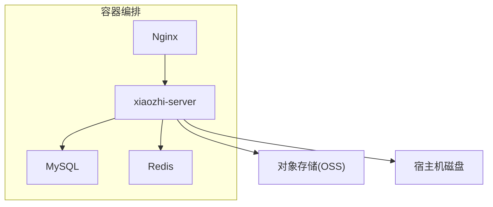
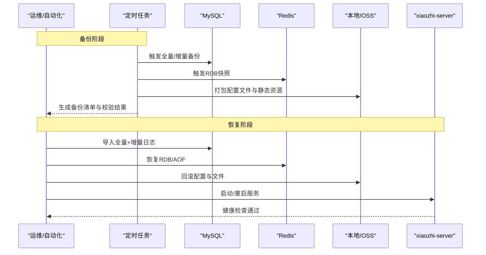
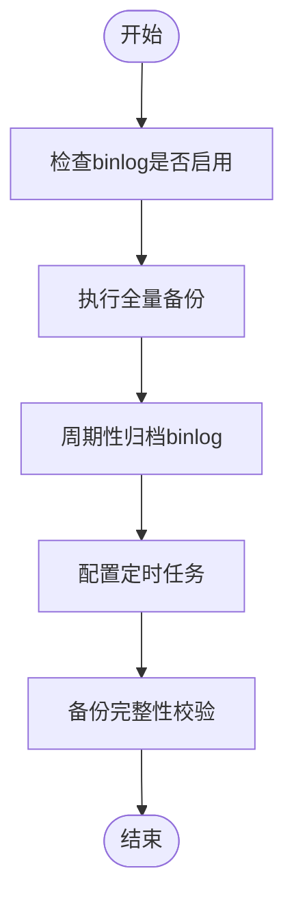
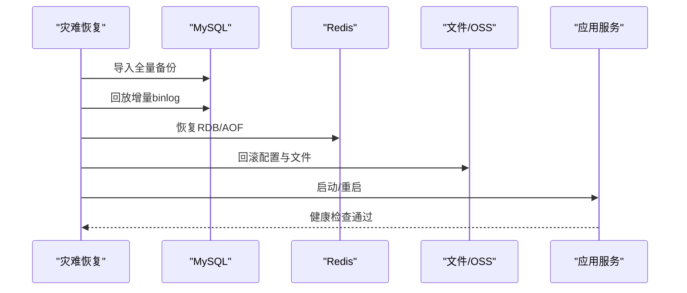
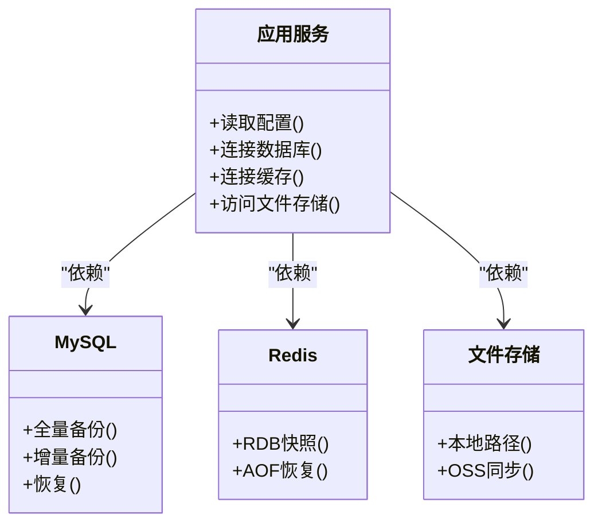

# 备份与恢复

<cite>
**本文引用的文件**   
- [docker-compose.yml](file://main/xiaozhi-server/docker-compose.yml)
- [docker-compose_all.yml](file://main/xiaozhi-server/docker-compose_all.yml)
- [start.sh](file://main/xiaozhi-server/start.sh)
- [app.py](file://main/xiaozhi-server/app.py)
- [config_loader.py](file://main/xiaozhi-server/config/config_loader.py)
- [settings.py](file://main/xiaozhi-server/config/settings.py)
- [cache-implementation.md](file://main/xiaozhi-server/docs/cache-implementation.md)
- [production-readiness-assessment.md](file://main/xiaozhi-server/docs/production-readiness-assessment.md)
- [check_tables.py](file://main/xiaozhi-server/check_tables.py)
- [verify_graph_tables.py](file://main/xiaozhi-server/verify_graph_tables.py)
- [nginx.conf](file://docs/docker/nginx.conf)
- [start.sh](file://docs/docker/start.sh)
</cite>

## 目录
1. [简介](#简介)
2. [项目结构](#项目结构)
3. [核心组件](#核心组件)
4. [架构总览](#架构总览)
5. [详细组件分析](#详细组件分析)
6. [依赖关系分析](#依赖关系分析)
7. [性能考虑](#性能考虑)
8. [故障排查指南](#故障排查指南)
9. [结论](#结论)
10. [附录](#附录)

## 简介
本指南面向 xiaozhi-esp32-server 的运维与开发人员，提供完整的数据备份与恢复方案。内容覆盖：
- MySQL 全量与增量备份、定时任务配置
- Redis 缓存持久化与恢复
- 文件存储（OSS、本地文件系统）备份策略
- 灾难恢复流程（从数据恢复到服务重启）
- 备份验证与测试方法
- 跨地域备份与容灾（主备切换、数据同步）
- 自动化备份与恢复脚本使用说明

## 项目结构
xiaozhi-esp32-server 采用多容器部署，关键数据存储与服务通过 docker-compose 编排。备份与恢复需围绕以下组件展开：
- MySQL：业务数据库
- Redis：会话与缓存
- 应用服务：Python 后端（FastAPI/HTTP 服务）
- 文件存储：本地或 OSS（由配置决定）
- Nginx：反向代理与静态资源

图表来源
- [docker-compose.yml](file://main/xiaozhi-server/docker-compose.yml)
- [docker-compose_all.yml](file://main/xiaozhi-server/docker-compose_all.yml)

章节来源
- [docker-compose.yml](file://main/xiaozhi-server/docker-compose.yml)
- [docker-compose_all.yml](file://main/xiaozhi-server/docker-compose_all.yml)

## 核心组件
- 数据库层（MySQL）
  - 全量备份：使用 mysqldump 或云厂商快照
  - 增量备份：基于 binlog 的增量恢复
  - 定时任务：cron 或容器内定时任务
- 缓存层（Redis）
  - RDB/AOF 持久化策略
  - 冷备与热备恢复
- 应用层（xiaozhi-server）
  - 配置加载与运行时参数
  - 启动脚本与环境变量注入
- 文件存储
  - 本地路径挂载
  - OSS SDK 配置与访问密钥

章节来源
- [app.py](file://main/xiaozhi-server/app.py)
- [config_loader.py](file://main/xiaozhi-server/config/config_loader.py)
- [settings.py](file://main/xiaozhi-server/config/settings.py)
- [start.sh](file://main/xiaozhi-server/start.sh)

## 架构总览
下图展示备份与恢复在系统中的位置与交互：

图表来源
- [docker-compose.yml](file://main/xiaozhi-server/docker-compose.yml)
- [start.sh](file://main/xiaozhi-server/start.sh)
- [cache-implementation.md](file://main/xiaozhi-server/docs/cache-implementation.md)

## 详细组件分析

### MySQL 备份与恢复
- 全量备份
  - 使用 mysqldump 导出逻辑备份，或使用云数据库快照进行物理备份
  - 建议按库/表维度组织备份文件，保留版本与时间戳
- 增量备份
  - 开启 binlog，记录事务日志
  - 定期归档 binlog，结合时间点进行精确恢复
- 定时任务
  - 使用系统 cron 或容器内定时任务执行备份脚本
  - 将备份输出到本地卷或远端对象存储
- 恢复流程
  - 先恢复全量备份，再回放增量 binlog 至目标时间点
  - 校验表结构与数据一致性

图表来源
- [check_tables.py](file://main/xiaozhi-server/check_tables.py)
- [verify_graph_tables.py](file://main/xiaozhi-server/verify_graph_tables.py)

章节来源
- [check_tables.py](file://main/xiaozhi-server/check_tables.py)
- [verify_graph_tables.py](file://main/xiaozhi-server/verify_graph_tables.py)

### Redis 缓存持久化与恢复
- 持久化策略
  - RDB：定期快照，适合灾难恢复
  - AOF：追加写日志，适合高可用与细粒度恢复
- 恢复方法
  - 停止服务后替换 dump.rdb 或 aof 文件
  - 启动服务自动加载持久化数据
- 注意事项
  - 大键与高频写入场景下优先选择 AOF
  - 备份前确保数据落盘一致

章节来源
- [cache-implementation.md](file://main/xiaozhi-server/docs/cache-implementation.md)

### 文件存储（本地与 OSS）备份
- 本地文件系统
  - 将应用工作目录与上传目录挂载为持久卷
  - 使用 rsync/tar 打包备份，支持增量传输
- 对象存储（OSS）
  - 通过 SDK 或命令行工具同步 bucket
  - 配置生命周期策略管理历史版本
- 配置与密钥
  - 备份包含配置文件与访问密钥（加密存储）

章节来源
- [settings.py](file://main/xiaozhi-server/config/settings.py)
- [config_loader.py](file://main/xiaozhi-server/config/config_loader.py)

### 应用服务启动与配置加载
- 启动脚本
  - start.sh 负责环境变量注入与服务初始化
- 配置加载
  - config_loader.py 与 settings.py 解析配置并注入运行时
- 健康检查
  - 启动后执行健康检查接口，确认服务就绪

章节来源
- [start.sh](file://main/xiaozhi-server/start.sh)
- [config_loader.py](file://main/xiaozhi-server/config/config_loader.py)
- [settings.py](file://main/xiaozhi-server/config/settings.py)
- [app.py](file://main/xiaozhi-server/app.py)

### 灾难恢复流程（端到端）
- 准备阶段
  - 确定恢复目标时间点与数据范围
  - 准备备份集（MySQL、Redis、文件）
- 执行阶段
  - 恢复 MySQL 全量与增量
  - 恢复 Redis 持久化文件
  - 回滚文件与配置
  - 启动/重启应用服务
- 验证阶段
  - 运行表结构校验与关键数据抽样
  - 调用健康检查接口确认服务正常

图表来源
- [start.sh](file://main/xiaozhi-server/start.sh)
- [app.py](file://main/xiaozhi-server/app.py)

章节来源
- [production-readiness-assessment.md](file://main/xiaozhi-server/docs/production-readiness-assessment.md)

### 备份验证与测试
- 数据一致性
  - 使用 check_tables.py 与 verify_graph_tables.py 校验表结构与图数据
- 功能回归
  - 在隔离环境恢复备份，执行关键用例
- 演练计划
  - 定期演练恢复流程，记录 RTO/RPO

章节来源
- [check_tables.py](file://main/xiaozhi-server/check_tables.py)
- [verify_graph_tables.py](file://main/xiaozhi-server/verify_graph_tables.py)

### 跨地域备份与容灾
- 主备架构
  - 主库写入，备库异步复制
  - 跨地域对象存储同步
- 数据同步策略
  - MySQL 主从复制与 GTID 管理
  - Redis 主从与哨兵模式
- 主备切换
  - 自动或手动切换流量指向备库
  - DNS 或负载均衡器切换

章节来源
- [docker-compose_all.yml](file://main/xiaozhi-server/docker-compose_all.yml)

## 依赖关系分析
- 应用对数据库与缓存的依赖
- 配置加载顺序与环境变量优先级
- 外部存储（OSS）与本地文件的读写路径

图表来源
- [app.py](file://main/xiaozhi-server/app.py)
- [config_loader.py](file://main/xiaozhi-server/config/config_loader.py)
- [settings.py](file://main/xiaozhi-server/config/settings.py)

章节来源
- [app.py](file://main/xiaozhi-server/app.py)
- [config_loader.py](file://main/xiaozhi-server/config/config_loader.py)
- [settings.py](file://main/xiaozhi-server/config/settings.py)

## 性能考虑
- 备份窗口与业务高峰错开
- 增量备份减少 I/O 压力
- 并行导出与压缩提升吞吐
- 缓存预热避免恢复后雪崩

## 故障排查指南
- 备份失败
  - 检查权限、网络与存储空间
  - 查看备份日志与错误码
- 恢复异常
  - 校验备份完整性与版本兼容性
  - 核对配置与密钥
- 服务不可用
  - 检查健康检查接口与端口占用
  - 查看应用日志与依赖状态

章节来源
- [start.sh](file://main/xiaozhi-server/start.sh)
- [app.py](file://main/xiaozhi-server/app.py)

## 结论
通过规范的备份策略、严格的恢复流程与持续的演练验证，可显著提升 xiaozhi-esp32-server 的数据可靠性与业务连续性。建议结合云原生能力（快照、对象存储、托管数据库）实现自动化与跨地域容灾。

## 附录
- 常用命令参考
  - MySQL 全量导出/导入
  - binlog 归档与回放
  - Redis 快照与 AOF 恢复
  - 文件打包与同步
- 安全与合规
  - 备份加密与访问控制
  - 密钥轮换与审计