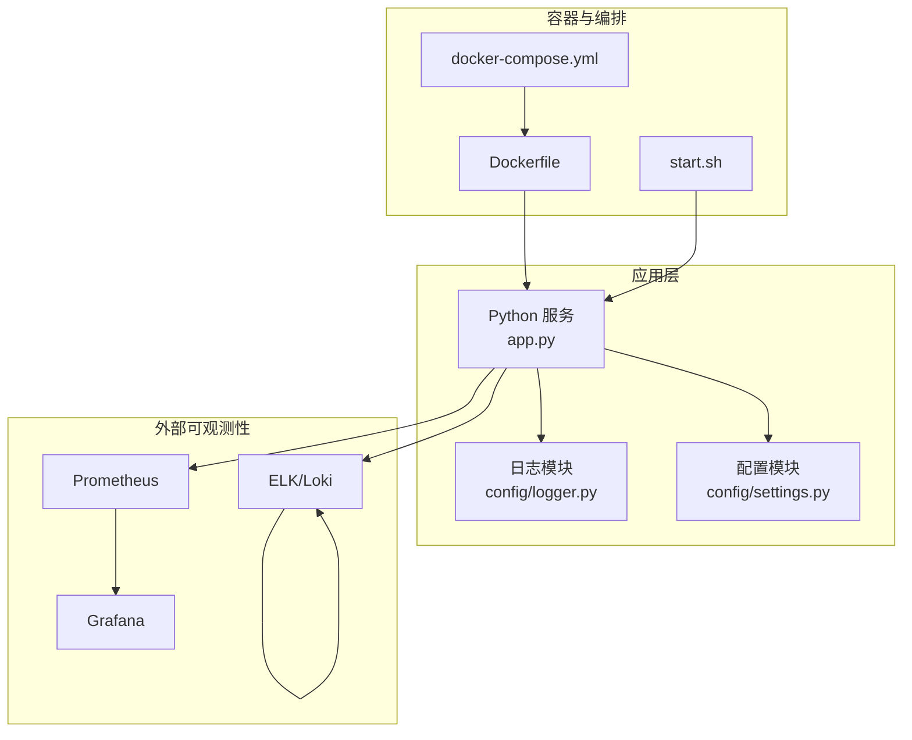
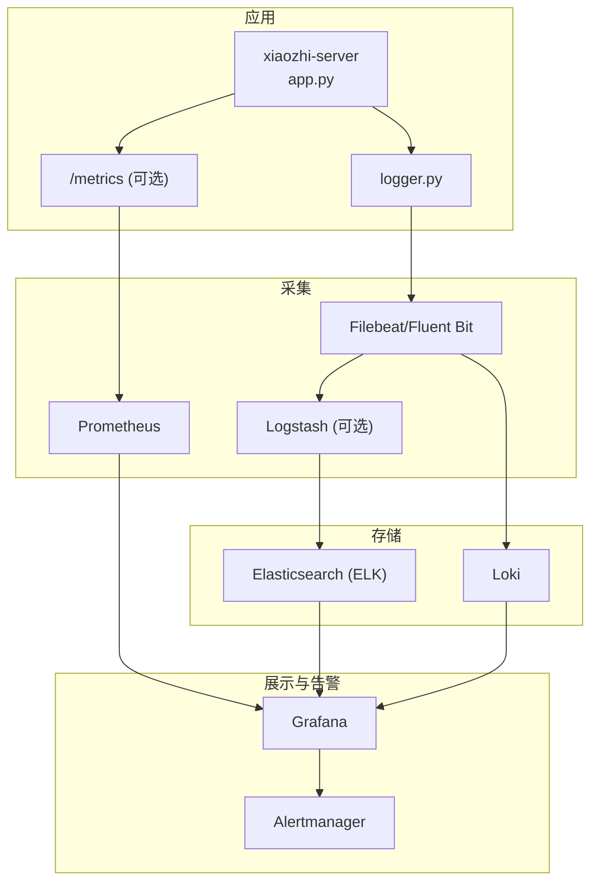
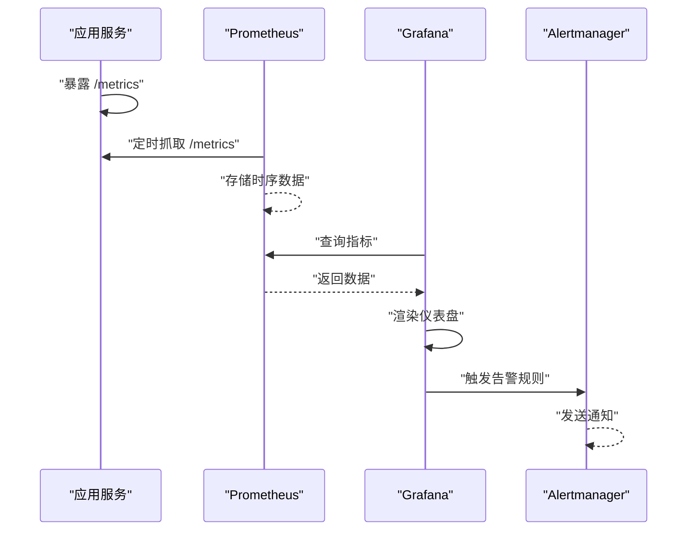
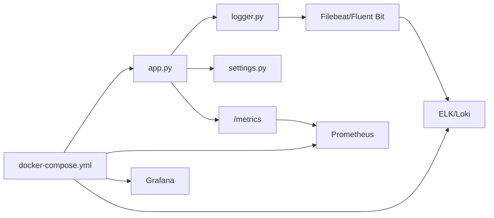

# 监控与日志

<cite>
**本文引用的文件**   
- [xiaozhi-server/app.py](file://main/xiaozhi-server/app.py)
- [xiaozhi-server/config/logger.py](file://main/xiaozhi-server/config/logger.py)
- [xiaozhi-server/config/settings.py](file://main/xiaozhi-server/config/settings.py)
- [xiaozhi-server/docker-compose.yml](file://main/xiaozhi-server/docker-compose.yml)
- [xiaozhi-server/Dockerfile](file://main/xiaozhi-server/Dockerfile)
- [xiaozhi-server/start.sh](file://main/xiaozhi-server/start.sh)
- [docker-setup.sh](file://docker-setup.sh)
- [docs/docker/nginx.conf](file://docs/docker/nginx.conf)
- [docs/docker/start.sh](file://docs/docker/start.sh)
</cite>

## 目录
1. [简介](#简介)
2. [项目结构](#项目结构)
3. [核心组件](#核心组件)
4. [架构总览](#架构总览)
5. [详细组件分析](#详细组件分析)
6. [依赖关系分析](#依赖关系分析)
7. [性能考量](#性能考量)
8. [故障排查指南](#故障排查指南)
9. [结论](#结论)
10. [附录](#附录)

## 简介
本指南面向 xiaozhi-esp32-server 的运维与研发人员，提供一套完整的“监控与日志”落地方案。内容涵盖：
- 日志收集系统搭建（ELK Stack 或 Loki）
- 应用日志结构化输出、级别控制与轮转策略
- Prometheus 指标采集与 Grafana 可视化
- 告警规则配置（CPU、内存、错误率等）
- 故障排查工具与方法（日志分析、性能分析、链路追踪）

目标是让团队在生产环境具备可观测性能力，快速定位问题并保障服务稳定性。

## 项目结构
本项目包含 Python 服务端（xiaozhi-server）、管理端（manager-api、manager-web）、小程序/移动端以及文档与脚本。与监控和日志相关的重点位置如下：
- 应用入口与启动脚本：app.py、start.sh
- 配置与日志初始化：config/settings.py、config/logger.py
- 容器化与编排：Dockerfile、docker-compose.yml
- 通用 Docker 脚本与 Nginx 示例：docs/docker/*
- 仓库级部署脚本：docker-setup.sh

图表来源
- [xiaozhi-server/app.py](file://main/xiaozhi-server/app.py)
- [xiaozhi-server/config/logger.py](file://main/xiaozhi-server/config/logger.py)
- [xiaozhi-server/config/settings.py](file://main/xiaozhi-server/config/settings.py)
- [xiaozhi-server/Dockerfile](file://main/xiaozhi-server/Dockerfile)
- [xiaozhi-server/docker-compose.yml](file://main/xiaozhi-server/docker-compose.yml)
- [xiaozhi-server/start.sh](file://main/xiaozhi-server/start.sh)

章节来源
- [xiaozhi-server/app.py](file://main/xiaozhi-server/app.py)
- [xiaozhi-server/config/logger.py](file://main/xiaozhi-server/config/logger.py)
- [xiaozhi-server/config/settings.py](file://main/xiaozhi-server/config/settings.py)
- [xiaozhi-server/Dockerfile](file://main/xiaozhi-server/Dockerfile)
- [xiaozhi-server/docker-compose.yml](file://main/xiaozhi-server/docker-compose.yml)
- [xiaozhi-server/start.sh](file://main/xiaozhi-server/start.sh)
- [docker-setup.sh](file://docker-setup.sh)
- [docs/docker/nginx.conf](file://docs/docker/nginx.conf)
- [docs/docker/start.sh](file://docs/docker/start.sh)

## 核心组件
- 应用日志模块：负责统一日志格式、级别控制、输出目标（控制台/文件/远程），支持 JSON 结构化输出以便后续采集。
- 配置模块：集中管理运行时参数（如日志级别、输出路径、采样率等），便于不同环境切换。
- 启动脚本：在容器内初始化运行环境、加载配置、拉起服务进程。
- 容器编排：定义服务镜像构建、端口暴露、环境变量注入、数据卷挂载（日志持久化）。

章节来源
- [xiaozhi-server/config/logger.py](file://main/xiaozhi-server/config/logger.py)
- [xiaozhi-server/config/settings.py](file://main/xiaozhi-server/config/settings.py)
- [xiaozhi-server/start.sh](file://main/xiaozhi-server/start.sh)
- [xiaozhi-server/docker-compose.yml](file://main/xiaozhi-server/docker-compose.yml)

## 架构总览
整体可观测性架构由“应用埋点 + 指标采集 + 日志收集 + 可视化与告警”组成：
- 应用侧：通过日志模块输出结构化日志；通过指标库暴露 /metrics 接口（如适用）。
- 采集侧：Prometheus 抓取指标；Filebeat/Fluent Bit 采集日志；Logstash 或 Loki 进行解析与存储。
- 展示与告警：Grafana 展示仪表盘；Alertmanager 或内置告警规则触发通知。

图表来源
- [xiaozhi-server/app.py](file://main/xiaozhi-server/app.py)
- [xiaozhi-server/config/logger.py](file://main/xiaozhi-server/config/logger.py)
- [xiaozhi-server/docker-compose.yml](file://main/xiaozhi-server/docker-compose.yml)

## 详细组件分析

### 日志系统设计与实现
- 结构化输出：建议采用 JSON 格式，包含字段如时间戳、级别、服务名、实例ID、请求ID、模块、消息、堆栈等，便于 ELK/Loki 解析。
- 级别控制：DEBUG/INFO/WARN/ERROR/FATAL，生产默认 INFO，调试时临时调至 DEBUG。
- 输出目标：
  - 控制台：便于本地开发调试。
  - 文件：按大小或时间轮转，保留周期与压缩策略需明确。
  - 远程：通过 Filebeat/Fluent Bit 推送至 Logstash/Elasticsearch 或 Loki。
- 采样与限流：对高频日志进行采样，避免风暴；对错误日志全量记录。
- 敏感信息脱敏：对手机号、身份证、密钥等进行掩码处理。

章节来源
- [xiaozhi-server/config/logger.py](file://main/xiaozhi-server/config/logger.py)
- [xiaozhi-server/config/settings.py](file://main/xiaozhi-server/config/settings.py)

### 指标采集与暴露
- 指标类型：
  - 应用性能：QPS、延迟分布、错误率、线程池/连接池状态、GC 行为。
  - 业务指标：会话数、ASR/TTS 调用次数、成功率、耗时分位。
  - 基础设施：CPU、内存、磁盘、网络、容器资源使用。
- 暴露方式：HTTP /metrics 端点（如使用标准库或框架中间件），供 Prometheus 抓取。
- 标签设计：service、instance、env、version、method、status 等，确保维度清晰。
- 采集频率：Prometheus 抓取间隔建议 15s~30s，避免过高负载。

章节来源
- [xiaozhi-server/app.py](file://main/xiaozhi-server/app.py)
- [xiaozhi-server/docker-compose.yml](file://main/xiaozhi-server/docker-compose.yml)

### 容器化与部署要点
- Dockerfile：安装依赖、拷贝代码、设置工作目录、暴露端口、健康检查。
- docker-compose：定义服务（应用、Prometheus、Grafana、ELK/Loki 等），挂载日志目录，注入环境变量。
- start.sh：初始化配置、创建必要目录、启动主进程。
- 日志持久化：将应用日志目录挂载到宿主机或云盘，便于采集与归档。

章节来源
- [xiaozhi-server/Dockerfile](file://main/xiaozhi-server/Dockerfile)
- [xiaozhi-server/docker-compose.yml](file://main/xiaozhi-server/docker-compose.yml)
- [xiaozhi-server/start.sh](file://main/xiaozhi-server/start.sh)
- [docker-setup.sh](file://docker-setup.sh)

### 日志收集方案对比（ELK vs Loki）
- ELK（Elasticsearch + Logstash + Kibana）：
  - 优点：强大的全文检索与分析能力，适合复杂查询与报表。
  - 缺点：资源消耗较大，维护成本较高。
  - 适用场景：需要深度日志分析与审计的场景。
- Loki：
  - 优点：轻量、低成本、与 Grafana 原生集成良好。
  - 缺点：复杂聚合能力弱于 Elasticsearch。
  - 适用场景：以指标为主、辅以日志关联的场景。

章节来源
- [xiaozhi-server/docker-compose.yml](file://main/xiaozhi-server/docker-compose.yml)

### 日志轮转策略
- 基于大小：单文件达到阈值自动切分，保留 N 个历史文件。
- 基于时间：按天/小时切分，配合压缩与过期清理。
- 推荐策略：生产环境按天轮转，保留 7~30 天，开启 gzip 压缩。

章节来源
- [xiaozhi-server/config/logger.py](file://main/xiaozhi-server/config/logger.py)

### 指标采集与展示流程

图表来源
- [xiaozhi-server/app.py](file://main/xiaozhi-server/app.py)
- [xiaozhi-server/docker-compose.yml](file://main/xiaozhi-server/docker-compose.yml)

## 依赖关系分析
- 应用与日志模块：应用通过 logger 模块统一输出，避免分散实现。
- 应用与配置模块：所有开关（日志级别、采样率、指标开关）集中在 settings。
- 容器编排与外部组件：docker-compose 统一管理 Prometheus、Grafana、ELK/Loki 的生命周期与网络。
- 采集器与应用：Filebeat/Fluent Bit 通过文件系统或 stdout 采集日志；Prometheus 通过 HTTP 抓取指标。

图表来源
- [xiaozhi-server/app.py](file://main/xiaozhi-server/app.py)
- [xiaozhi-server/config/logger.py](file://main/xiaozhi-server/config/logger.py)
- [xiaozhi-server/config/settings.py](file://main/xiaozhi-server/config/settings.py)
- [xiaozhi-server/docker-compose.yml](file://main/xiaozhi-server/docker-compose.yml)

章节来源
- [xiaozhi-server/app.py](file://main/xiaozhi-server/app.py)
- [xiaozhi-server/config/logger.py](file://main/xiaozhi-server/config/logger.py)
- [xiaozhi-server/config/settings.py](file://main/xiaozhi-server/config/settings.py)
- [xiaozhi-server/docker-compose.yml](file://main/xiaozhi-server/docker-compose.yml)

## 性能考量
- 日志写入开销：异步写入、批量落盘、限制同步写盘频率。
- 指标暴露开销：减少高基数标签，避免过多计数器更新。
- 采集频率：合理设置 Prometheus 抓取间隔，避免对应用造成压力。
- 存储容量：规划索引生命周期（ILM）或 Loki 的 retention，定期清理。
- 资源隔离：为 ELK/Loki/Prometheus/Grafana 分配独立资源，避免争抢。

[本节为通用指导，不直接分析具体文件]

## 故障排查指南
- 日志分析：
  - 关键字搜索：ERROR、Exception、Timeout、OOM、Deadlock。
  - 关联上下文：通过 request_id、trace_id 串联上下游日志。
  - 趋势分析：错误率突增、延迟分位上升。
- 性能分析：
  - 指标观察：CPU、内存、GC、线程阻塞、连接池耗尽。
  - 热点定位：慢接口、慢 SQL、第三方调用超时。
- 链路追踪：
  - 引入分布式追踪（如 OpenTelemetry），跨服务传递 trace_id。
  - 在网关、API、下游服务埋点，形成完整调用链。
- 常用命令与工具：
  - 查看容器日志：docker logs、kubectl logs。
  - 实时跟踪：tail -f、grep、awk。
  - 指标查询：PromQL、Grafana Explore。
  - 日志检索：Kibana Discover、Loki LogQL。

章节来源
- [xiaozhi-server/config/logger.py](file://main/xiaozhi-server/config/logger.py)
- [xiaozhi-server/app.py](file://main/xiaozhi-server/app.py)

## 结论
通过统一的日志与指标体系，结合 ELK/Loki 与 Prometheus/Grafana，可以为 xiaozhi-esp32-server 建立完善的可观测性平台。建议在上线前完成以下关键步骤：
- 启用结构化日志与必要的业务指标
- 部署采集器与存储后端
- 配置基础仪表盘与告警规则
- 制定日志轮转与保留策略
- 完善故障排查手册与演练

[本节为总结性内容，不直接分析具体文件]

## 附录

### ELK Stack 部署与配置要点
- Elasticsearch：集群模式、分片与副本、索引模板、ILM 策略。
- Logstash：输入（Filebeat/Beats）、过滤（JSON、脱敏）、输出（ES）。
- Kibana：索引模式、Discover、Dashboard、Saved Searches。
- 采集器：Filebeat 配置 filebeat.yml，指定日志路径与输出目标。

章节来源
- [xiaozhi-server/docker-compose.yml](file://main/xiaozhi-server/docker-compose.yml)

### Loki 部署与配置要点
- Loki：存储后端（S3/本地）、索引策略、retention。
- Promtail：采集容器 stdout 或文件日志，发送到 Loki。
- Grafana：添加 Loki 数据源，使用 LogQL 查询。

章节来源
- [xiaozhi-server/docker-compose.yml](file://main/xiaozhi-server/docker-compose.yml)

### Prometheus 与 Grafana 配置要点
- Prometheus：scrape_configs、targets、relabeling、alerting_rules。
- Grafana：数据源（Prometheus/Loki）、仪表盘导入、变量与面板。
- 告警：阈值规则（CPU>80%、内存>85%、错误率>1%）、通知渠道（邮件/钉钉/企业微信）。

章节来源
- [xiaozhi-server/docker-compose.yml](file://main/xiaozhi-server/docker-compose.yml)

### 应用日志规范建议
- 字段要求：timestamp、level、service、instance、request_id、module、message、stack_trace。
- 级别使用：DEBUG（调试）、INFO（正常流程）、WARN（潜在风险）、ERROR（异常）、FATAL（致命）。
- 脱敏规则：手机号、身份证、密钥、Token 等。
- 采样策略：高频 INFO 采样 10%~30%，ERROR 全量。

章节来源
- [xiaozhi-server/config/logger.py](file://main/xiaozhi-server/config/logger.py)
- [xiaozhi-server/config/settings.py](file://main/xiaozhi-server/config/settings.py)

### 容器与启动脚本注意事项
- Dockerfile：最小化镜像、非 root 运行、健康检查。
- docker-compose：环境变量、数据卷、网络隔离、重启策略。
- start.sh：预检查、权限设置、优雅退出信号处理。

章节来源
- [xiaozhi-server/Dockerfile](file://main/xiaozhi-server/Dockerfile)
- [xiaozhi-server/docker-compose.yml](file://main/xiaozhi-server/docker-compose.yml)
- [xiaozhi-server/start.sh](file://main/xiaozhi-server/start.sh)
- [docker-setup.sh](file://docker-setup.sh)
- [docs/docker/nginx.conf](file://docs/docker/nginx.conf)
- [docs/docker/start.sh](file://docs/docker/start.sh)