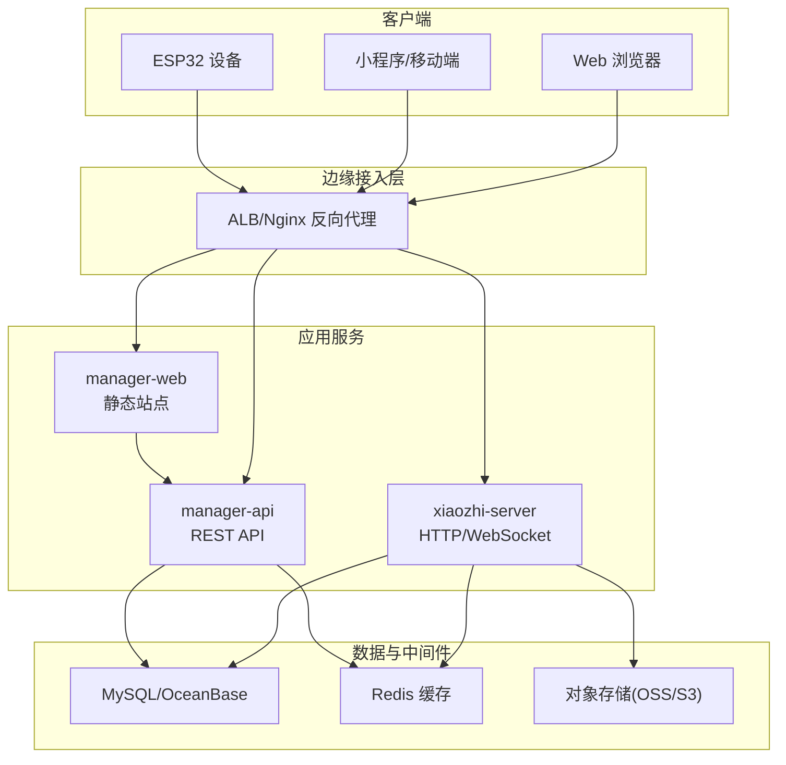
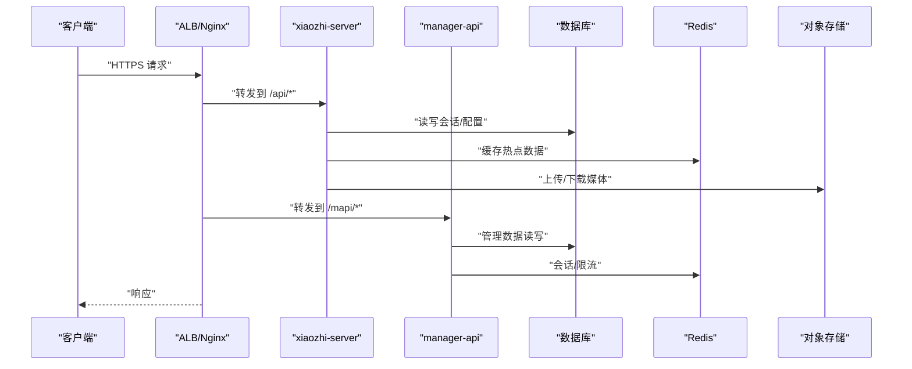
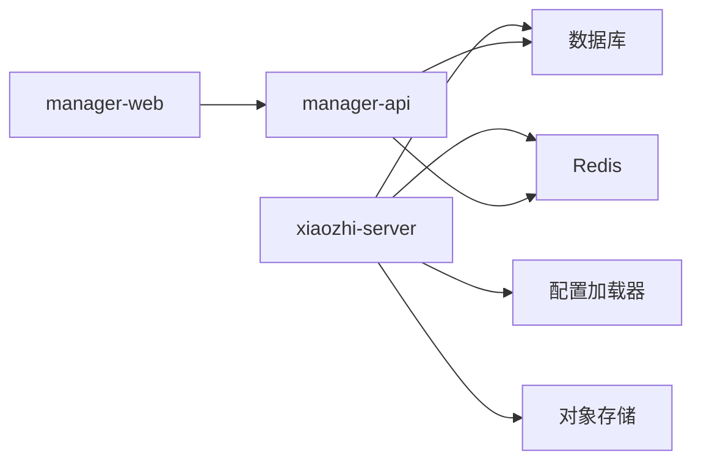

# 部署指南

<cite>
**本文引用的文件**   
- [README.md](file://README.md)
- [docker-setup.sh](file://docker-setup.sh)
- [main/xiaozhi-server/Dockerfile](file://main/xiaozhi-server/Dockerfile)
- [main/xiaozhi-server/docker-compose.yml](file://main/xiaozhi-server/docker-compose.yml)
- [main/xiaozhi-server/docker-compose_all.yml](file://main/xiaozhi-server/docker-compose_all.yml)
- [main/xiaozhi-server/app.py](file://main/xiaozhi-server/app.py)
- [main/xiaozhi-server/start.sh](file://main/xiaozhi-server/start.sh)
- [main/xiaozhi-server/config/settings.py](file://main/xiaozhi-server/config/settings.py)
- [main/xiaozhi-server/config/config_loader.py](file://main/xiaozhi-server/config/config_loader.py)
- [main/xiaozhi-server/core/http_server.py](file://main/xiaozhi-server/core/http_server.py)
- [main/xiaozhi-server/core/websocket_server.py](file://main/xiaozhi-server/core/websocket_server.py)
- [main/manager-api/Dockerfile](file://main/manager-api/Dockerfile)
- [main/manager-web/Dockerfile](file://main/manager-web/Dockerfile)
- [docs/docker/nginx.conf](file://docs/docker/nginx.conf)
- [docs/docker/start.sh](file://docs/docker/start.sh)
- [docs/aliyun/ack-deployment/01-containerization.md](file://docs/aliyun/ack-deployment/01-containerization.md)
- [docs/aliyun/ack-deployment/02-kubernetes.md](file://docs/aliyun/ack-deployment/02-kubernetes.md)
- [docs/aliyun/ack-deployment/03-cloud-resources.md](file://docs/aliyun/ack-deployment/03-cloud-resources.md)
- [docs/aliyun/ack-deployment/04-operations.md](file://docs/aliyun/ack-deployment/04-operations.md)
- [docs/aliyun/sae-deployment-handbook.md](file://docs/aliyun/sae-deployment-handbook.md)
- [docs/aliyun/sae-deployment/scripts/build-push-xiaozhi-server.sh](file://docs/aliyun/sae-deployment/scripts/build-push-xiaozhi-server.sh)
- [scripts/run-build-xiaozhi.sh](file://scripts/run-build-xiaozhi.sh)
- [scripts/run-build-manager.sh](file://scripts/run-build-manager.sh)
- [scripts/run-build-web.sh](file://scripts/run-build-web.sh)
</cite>

## 目录
1. [简介](#简介)
2. [项目结构](#项目结构)
3. [核心组件](#核心组件)
4. [架构总览](#架构总览)
5. [详细组件分析](#详细组件分析)
6. [依赖关系分析](#依赖关系分析)
7. [性能考虑](#性能考虑)
8. [故障排查指南](#故障排查指南)
9. [结论](#结论)
10. [附录](#附录)

## 简介
本指南面向生产环境，提供 xiaozhi-esp32-server 的完整部署方案，涵盖：
- Docker 容器化与 docker-compose 编排
- Kubernetes（阿里云 ACK）编排与负载均衡
- SAE（Serverless 应用引擎）一键部署
- 数据库初始化、Redis 缓存、对象存储配置要点
- CI/CD 流水线搭建（构建、测试、发布）
- 监控告警、日志收集、健康检查
- 安全加固、备份恢复与灾难恢复

本指南以仓库内现有文档与脚本为依据，结合通用企业级实践给出可操作的步骤与模板。

## 项目结构
xiaozhi-esp32-server 包含多个子模块：
- main/xiaozhi-server：核心服务（Python），提供 HTTP/WebSocket 接口与业务逻辑
- main/manager-api：管理后端（Java/Spring），提供管理 API
- main/manager-web：管理前端（Vue），静态资源由 Nginx 托管
- docs/docker：Nginx 反向代理与启动脚本示例
- docs/aliyun：ACK/SAE 部署手册与脚本
- scripts：本地构建脚本

图表来源
- [docs/aliyun/ack-deployment/02-kubernetes.md:1-200](file://docs/aliyun/ack-deployment/02-kubernetes.md#L1-L200)
- [docs/docker/nginx.conf:1-200](file://docs/docker/nginx.conf#L1-L200)

章节来源
- [README.md:1-200](file://README.md#L1-L200)
- [docs/aliyun/ack-deployment/01-containerization.md:1-200](file://docs/aliyun/ack-deployment/01-containerization.md#L1-L200)

## 核心组件
- xiaozhi-server：核心运行时，处理语音对话、ASR/TTS/LLM 等能力调用，暴露 HTTP 与 WebSocket 接口
- manager-api：管理后台 API，负责用户、设备、模型、知识库等管理
- manager-web：管理后台前端，通过 Nginx 静态托管并反向代理至 manager-api
- 中间件：MySQL/OceanBase、Redis、对象存储（OSS/S3）、可选 FunASR 等

关键入口与配置：
- 应用入口与启动脚本：[app.py](file://main/xiaozhi-server/app.py)、[start.sh](file://main/xiaozhi-server/start.sh)
- 配置加载与设置：[settings.py](file://main/xiaozhi-server/config/settings.py)、[config_loader.py](file://main/xiaozhi-server/config/config_loader.py)
- HTTP/WebSocket 服务：[http_server.py](file://main/xiaozhi-server/core/http_server.py)、[websocket_server.py](file://main/xiaozhi-server/core/websocket_server.py)

章节来源
- [main/xiaozhi-server/app.py:1-200](file://main/xiaozhi-server/app.py#L1-L200)
- [main/xiaozhi-server/start.sh:1-200](file://main/xiaozhi-server/start.sh#L1-L200)
- [main/xiaozhi-server/config/settings.py:1-200](file://main/xiaozhi-server/config/settings.py#L1-L200)
- [main/xiaozhi-server/config/config_loader.py:1-200](file://main/xiaozhi-server/config/config_loader.py#L1-L200)
- [main/xiaozhi-server/core/http_server.py:1-200](file://main/xiaozhi-server/core/http_server.py#L1-L200)
- [main/xiaozhi-server/core/websocket_server.py:1-200](file://main/xiaozhi-server/core/websocket_server.py#L1-L200)

## 架构总览
生产环境推荐分层架构：
- 接入层：ALB/Nginx 统一入口，TLS 终止、WAF、限流
- 应用层：xiaozhi-server、manager-api、manager-web
- 数据层：MySQL/OceanBase、Redis、对象存储
- 运维层：CI/CD、监控告警、日志采集、备份恢复

图表来源
- [docs/aliyun/ack-deployment/02-kubernetes.md:1-200](file://docs/aliyun/ack-deployment/02-kubernetes.md#L1-L200)
- [docs/docker/nginx.conf:1-200](file://docs/docker/nginx.conf#L1-L200)

## 详细组件分析

### 容器化与镜像构建
- xiaozhi-server 镜像：基于官方 Python 基础镜像，安装依赖并拷贝代码，暴露端口，执行启动脚本
- manager-api 镜像：基于 Java 运行环境，构建 Spring Boot 应用
- manager-web 镜像：基于 Nginx，拷贝静态资源并挂载配置

关键文件：
- [main/xiaozhi-server/Dockerfile](file://main/xiaozhi-server/Dockerfile)
- [main/manager-api/Dockerfile](file://main/manager-api/Dockerfile)
- [main/manager-web/Dockerfile](file://main/manager-web/Dockerfile)

章节来源
- [main/xiaozhi-server/Dockerfile:1-200](file://main/xiaozhi-server/Dockerfile#L1-L200)
- [main/manager-api/Dockerfile:1-200](file://main/manager-api/Dockerfile#L1-L200)
- [main/manager-web/Dockerfile:1-200](file://main/manager-web/Dockerfile#L1-L200)

### Docker Compose 快速部署
使用 docker-compose 拉起 xiaozhi-server、数据库、Redis、对象存储（可选）。支持多环境配置与环境变量注入。

关键文件：
- [main/xiaozhi-server/docker-compose.yml](file://main/xiaozhi-server/docker-compose.yml)
- [main/xiaozhi-server/docker-compose_all.yml](file://main/xiaozhi-server/docker-compose_all.yml)
- [docker-setup.sh](file://docker-setup.sh)

建议步骤：
- 准备 .env 或环境变量文件，填写数据库、Redis、对象存储、密钥等
- 执行 docker-compose up -d 启动服务
- 验证健康检查与端口访问

章节来源
- [main/xiaozhi-server/docker-compose.yml:1-200](file://main/xiaozhi-server/docker-compose.yml#L1-L200)
- [main/xiaozhi-server/docker-compose_all.yml:1-200](file://main/xiaozhi-server/docker-compose_all.yml#L1-L200)
- [docker-setup.sh:1-200](file://docker-setup.sh#L1-L200)

### Kubernetes（ACK）编排与负载均衡
- 使用 Deployment/Service/Ingress/ConfigMap/Secret/HPA 进行编排
- Ingress 通过 ALB 暴露 HTTP/HTTPS，启用 TLS 与 WAF
- HPA 根据 CPU/内存或自定义指标自动扩缩容

关键参考：
- [docs/aliyun/ack-deployment/02-kubernetes.md](file://docs/aliyun/ack-deployment/02-kubernetes.md)
- [docs/aliyun/ack-deployment/03-cloud-resources.md](file://docs/aliyun/ack-deployment/03-cloud-resources.md)
- [docs/aliyun/ack-deployment/04-operations.md](file://docs/aliyun/ack-deployment/04-operations.md)

章节来源
- [docs/aliyun/ack-deployment/02-kubernetes.md:1-200](file://docs/aliyun/ack-deployment/02-kubernetes.md#L1-L200)
- [docs/aliyun/ack-deployment/03-cloud-resources.md:1-200](file://docs/aliyun/ack-deployment/03-cloud-resources.md#L1-L200)
- [docs/aliyun/ack-deployment/04-operations.md:1-200](file://docs/aliyun/ack-deployment/04-operations.md#L1-L200)

### SAE（Serverless 应用引擎）部署
- 将镜像推送到镜像仓库，创建 SAE 应用，配置环境变量与存储卷
- 使用提供的构建脚本构建并推送镜像
- 在 SAE 控制台完成域名绑定、HTTPS、灰度发布

关键参考：
- [docs/aliyun/sae-deployment-handbook.md](file://docs/aliyun/sae-deployment-handbook.md)
- [docs/aliyun/sae-deployment/scripts/build-push-xiaozhi-server.sh](file://docs/aliyun/sae-deployment/scripts/build-push-xiaozhi-server.sh)

章节来源
- [docs/aliyun/sae-deployment-handbook.md:1-200](file://docs/aliyun/sae-deployment-handbook.md#L1-L200)
- [docs/aliyun/sae-deployment/scripts/build-push-xiaozhi-server.sh:1-200](file://docs/aliyun/sae-deployment/scripts/build-push-xiaozhi-server.sh#L1-L200)

### Nginx 反向代理与静态资源
- 使用 Nginx 作为统一入口，按路径路由到不同服务
- 为 manager-web 提供静态资源服务，并为 API 提供反向代理
- 支持 HTTPS 终止、Gzip、缓存策略

关键文件：
- [docs/docker/nginx.conf](file://docs/docker/nginx.conf)
- [docs/docker/start.sh](file://docs/docker/start.sh)

章节来源
- [docs/docker/nginx.conf:1-200](file://docs/docker/nginx.conf#L1-L200)
- [docs/docker/start.sh:1-200](file://docs/docker/start.sh#L1-L200)

### 数据库初始化与连接
- 首次启动需执行数据库初始化脚本（建库、建表、初始数据）
- 连接参数通过环境变量或配置文件注入
- 建议使用只读副本与主从分离提升性能

关键文件：
- [main/xiaozhi-server/app.py](file://main/xiaozhi-server/app.py)
- [main/xiaozhi-server/config/settings.py](file://main/xiaozhi-server/config/settings.py)
- [main/xiaozhi-server/config/config_loader.py](file://main/xiaozhi-server/config/config_loader.py)

章节来源
- [main/xiaozhi-server/app.py:1-200](file://main/xiaozhi-server/app.py#L1-L200)
- [main/xiaozhi-server/config/settings.py:1-200](file://main/xiaozhi-server/config/settings.py#L1-L200)
- [main/xiaozhi-server/config/config_loader.py:1-200](file://main/xiaozhi-server/config/config_loader.py#L1-L200)

### Redis 缓存配置
- 用于会话、限流、热点数据缓存
- 连接参数通过环境变量注入，支持密码与集群模式
- 建议开启持久化与内存淘汰策略

关键文件：
- [main/xiaozhi-server/config/settings.py](file://main/xiaozhi-server/config/settings.py)
- [main/xiaozhi-server/config/config_loader.py](file://main/xiaozhi-server/config/config_loader.py)

章节来源
- [main/xiaozhi-server/config/settings.py:1-200](file://main/xiaozhi-server/config/settings.py#L1-L200)
- [main/xiaozhi-server/config/config_loader.py:1-200](file://main/xiaozhi-server/config/config_loader.py#L1-L200)

### 对象存储配置
- 用于音频、图片、模型等资源存储
- 支持阿里云 OSS、AWS S3 等兼容协议
- 通过 AK/SK 或 IAM 角色授权，建议最小权限原则

关键文件：
- [main/xiaozhi-server/config/settings.py](file://main/xiaozhi-server/config/settings.py)
- [main/xiaozhi-server/config/config_loader.py](file://main/xiaozhi-server/config/config_loader.py)

章节来源
- [main/xiaozhi-server/config/settings.py:1-200](file://main/xiaozhi-server/config/settings.py#L1-L200)
- [main/xiaozhi-server/config/config_loader.py:1-200](file://main/xiaozhi-server/config/config_loader.py#L1-L200)

### 健康检查与探针
- HTTP 健康端点：返回服务状态码与依赖健康信息
- Kubernetes Liveness/Readiness Probe：周期性探测存活与就绪
- 依赖检查：数据库、Redis、对象存储连通性

关键文件：
- [main/xiaozhi-server/core/http_server.py](file://main/xiaozhi-server/core/http_server.py)
- [main/xiaozhi-server/start.sh](file://main/xiaozhi-server/start.sh)

章节来源
- [main/xiaozhi-server/core/http_server.py:1-200](file://main/xiaozhi-server/core/http_server.py#L1-L200)
- [main/xiaozhi-server/start.sh:1-200](file://main/xiaozhi-server/start.sh#L1-L200)

### WebSocket 长连接与心跳
- 服务端维护设备长连接，处理消息路由与状态同步
- 心跳机制保障连接有效性，异常断开重连策略
- 注意并发与内存占用，合理设置超时与队列长度

关键文件：
- [main/xiaozhi-server/core/websocket_server.py](file://main/xiaozhi-server/core/websocket_server.py)

章节来源
- [main/xiaozhi-server/core/websocket_server.py:1-200](file://main/xiaozhi-server/core/websocket_server.py#L1-L200)

## 依赖关系分析
- 外部依赖：数据库、Redis、对象存储、第三方 ASR/TTS/LLM 服务
- 内部依赖：xiaozhi-server 依赖配置加载器与工具模块；manager-api 依赖数据库与缓存
- 编排依赖：Kubernetes 资源对象（Deployment/Service/Ingress/ConfigMap/Secret）

图表来源
- [main/xiaozhi-server/config/config_loader.py:1-200](file://main/xiaozhi-server/config/config_loader.py#L1-L200)
- [main/xiaozhi-server/config/settings.py:1-200](file://main/xiaozhi-server/config/settings.py#L1-L200)

章节来源
- [main/xiaozhi-server/config/config_loader.py:1-200](file://main/xiaozhi-server/config/config_loader.py#L1-L200)
- [main/xiaozhi-server/config/settings.py:1-200](file://main/xiaozhi-server/config/settings.py#L1-L200)

## 性能考虑
- 水平扩展：通过 HPA 或 SAE 弹性伸缩应对流量峰值
- 连接池：数据库与 Redis 连接池大小调优
- 缓存策略：热点数据缓存、CDN 加速静态资源
- I/O 优化：对象存储分片上传、异步处理、消息队列削峰
- 资源限制：CPU/内存限制与 QoS 等级设置

[本节为通用指导，不直接分析具体文件]

## 故障排查指南
常见问题与定位方法：
- 服务无法启动：检查环境变量、配置文件、镜像版本与依赖服务连通性
- 数据库连接失败：核对连接串、账号权限、网络白名单与 SSL
- Redis 超时：检查内存使用率、网络延迟与命令耗时
- 对象存储上传失败：核对 AK/SK、Bucket 权限与网络可达性
- WebSocket 断连：检查心跳间隔、代理超时与负载均衡会话保持

建议操作：
- 查看容器日志与应用日志
- 使用 kubectl logs/exec 进入容器调试
- 通过健康检查端点与依赖探针定位问题

章节来源
- [main/xiaozhi-server/start.sh:1-200](file://main/xiaozhi-server/start.sh#L1-L200)
- [main/xiaozhi-server/core/http_server.py:1-200](file://main/xiaozhi-server/core/http_server.py#L1-L200)

## 结论
通过容器化与云原生编排，xiaozhi-esp32-server 可在生产环境实现高可用、可扩展与安全可控的部署。结合监控告警、备份恢复与安全加固，满足企业级需求。建议逐步落地：先 Docker Compose 验证，再迁移至 Kubernetes/SAE，完善 CI/CD 与运维体系。

[本节为总结，不直接分析具体文件]

## 附录

### CI/CD 流水线搭建
- 触发条件：Push/Merge Request
- 阶段：构建镜像、单元测试、集成测试、镜像扫描、推送镜像、部署
- 产物：Docker 镜像、制品归档、部署清单

关键脚本：
- [scripts/run-build-xiaozhi.sh](file://scripts/run-build-xiaozhi.sh)
- [scripts/run-build-manager.sh](file://scripts/run-build-manager.sh)
- [scripts/run-build-web.sh](file://scripts/run-build-web.sh)
- [docs/aliyun/sae-deployment/scripts/build-push-xiaozhi-server.sh](file://docs/aliyun/sae-deployment/scripts/build-push-xiaozhi-server.sh)

章节来源
- [scripts/run-build-xiaozhi.sh:1-200](file://scripts/run-build-xiaozhi.sh#L1-L200)
- [scripts/run-build-manager.sh:1-200](file://scripts/run-build-manager.sh#L1-L200)
- [scripts/run-build-web.sh:1-200](file://scripts/run-build-web.sh#L1-L200)
- [docs/aliyun/sae-deployment/scripts/build-push-xiaozhi-server.sh:1-200](file://docs/aliyun/sae-deployment/scripts/build-push-xiaozhi-server.sh#L1-L200)

### 监控告警与日志采集
- 指标采集：Prometheus + Grafana，采集 JVM/Python 指标与系统指标
- 日志采集：Filebeat/Fluent Bit -> Logstash/Elasticsearch -> Kibana
- 告警规则：错误率、延迟、资源使用率阈值告警
- 健康检查：Kubernetes Probe 与自定义健康端点

[本节为通用指导，不直接分析具体文件]

### 安全加固
- 最小权限：RBAC、IAM 角色、数据库账号权限最小化
- 网络安全：VPC、安全组、WAF、TLS 证书管理
- 密钥管理：Secrets 管理、轮换策略、审计
- 镜像安全：漏洞扫描、签名校验、白名单镜像

[本节为通用指导，不直接分析具体文件]

### 备份恢复与灾难恢复
- 数据库备份：全量+增量备份，异地容灾
- 对象存储备份：跨地域复制、生命周期策略
- 恢复演练：定期演练恢复流程，验证 RTO/RPO
- 回滚策略：蓝绿/灰度发布，快速回滚

[本节为通用指导，不直接分析具体文件]

### 云平台部署要点
- 阿里云 ACK：使用 Ingress/HPA/PersistentVolume，结合云监控与日志服务
- 阿里云 SAE：无服务器部署，自动扩缩容，简化运维
- 其他平台：EKS/GKE/AKS 类似编排，注意网络与存储插件差异

章节来源
- [docs/aliyun/ack-deployment/01-containerization.md:1-200](file://docs/aliyun/ack-deployment/01-containerization.md#L1-L200)
- [docs/aliyun/ack-deployment/02-kubernetes.md:1-200](file://docs/aliyun/ack-deployment/02-kubernetes.md#L1-L200)
- [docs/aliyun/ack-deployment/03-cloud-resources.md:1-200](file://docs/aliyun/ack-deployment/03-cloud-resources.md#L1-L200)
- [docs/aliyun/ack-deployment/04-operations.md:1-200](file://docs/aliyun/ack-deployment/04-operations.md#L1-L200)
- [docs/aliyun/sae-deployment-handbook.md:1-200](file://docs/aliyun/sae-deployment-handbook.md#L1-L200)